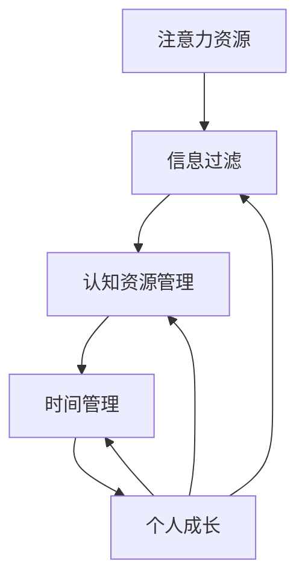

                 

关键词：注意力经济、个人成长、信息过滤、认知资源、时间管理

> 摘要：随着信息时代的到来，注意力经济成为推动社会发展和个人成长的重要力量。本文从技术角度探讨了注意力经济对个人成长的影响，包括信息过滤、认知资源管理和时间管理等方面，并提出了一系列策略和建议，以帮助个人在注意力经济中实现更好的成长。

## 1. 背景介绍

### 1.1 注意力经济的兴起

随着互联网和信息技术的飞速发展，我们进入了一个信息爆炸的时代。每天都有海量的信息通过各种渠道涌向我们的视野，这使得我们不得不面对一个严峻的现实：我们的注意力是有限的。因此，如何有效地管理和利用我们的注意力资源，成为一个亟待解决的问题。这就催生了注意力经济这一新的经济模式。

注意力经济，简而言之，就是以注意力为核心资源进行的经济活动。在这个模式下，用户的注意力成为了企业争夺的焦点，各种媒体、应用程序和广告商纷纷推出各种手段来吸引和留住用户的注意力。这种经济模式不仅改变了我们的生活方式，也对个人成长产生了深远的影响。

### 1.2 个人成长的重要性

个人成长是指个体在知识、技能、情感和认知等方面不断发展的过程。它不仅关乎个人的幸福感和生活质量，也是社会进步的重要驱动力。在注意力经济时代，个人成长面临新的挑战，但同时也拥有了前所未有的机遇。

有效的个人成长不仅可以帮助我们更好地适应快速变化的社会环境，还可以提高我们的竞争力，实现更高的职业成就。因此，理解注意力经济与个人成长的关系，掌握相应的策略和方法，对于每一个希望在这个时代取得成功的人来说都至关重要。

## 2. 核心概念与联系

### 2.1 注意力经济的核心概念

在探讨注意力经济与个人成长的关系之前，我们需要了解注意力经济中的几个核心概念：

- **注意力资源**：用户的时间、精力、注意力等资源。
- **信息过滤**：通过各种方式对海量的信息进行筛选和过滤，只关注最有价值的信息。
- **认知资源管理**：有效地管理和利用大脑的认知能力，避免过度消耗。
- **时间管理**：合理安排时间，确保在有限的时间内完成最重要的任务。

### 2.2 核心概念原理和架构的 Mermaid 流程图

下面是一个简化的 Mermaid 流程图，用于展示注意力经济与个人成长之间的核心概念及其相互关系。



### 2.3 核心概念之间的联系

- **信息过滤**是个人成长的前提，因为只有通过有效的信息过滤，我们才能将有限的注意力集中在最有价值的信息上，避免被无关信息所干扰。
- **认知资源管理**是个人成长的核心，因为大脑的认知能力是有限的，我们需要通过科学的方法来管理这些资源，以保持高效和持久的注意力。
- **时间管理**是个人成长的基础，因为时间是我们最宝贵的资源，只有合理地安排时间，我们才能有足够的时间进行有效的学习和成长。
- **个人成长**是上述所有概念的最终目标，因为个人成长不仅可以帮助我们更好地应对挑战，还可以提高我们的生活质量和社会地位。

## 3. 核心算法原理 & 具体操作步骤

### 3.1 算法原理概述

在注意力经济中，个人成长的核心算法原理可以概括为以下三个方面：

- **信息过滤算法**：通过算法模型对信息进行筛选和分类，将最有价值的信息呈现给用户。
- **认知资源管理算法**：通过智能分析用户的行为和认知模式，动态调整认知资源的分配和使用。
- **时间管理算法**：基于用户的目标和任务，提供最优的时间安排方案，确保用户能够高效地完成工作。

### 3.2 算法步骤详解

#### 3.2.1 信息过滤算法

1. **收集用户数据**：通过用户的浏览历史、搜索记录、社交互动等数据，构建用户画像。
2. **构建推荐模型**：使用机器学习算法，如协同过滤、矩阵分解等，生成推荐结果。
3. **实时调整推荐**：根据用户的实时行为和反馈，动态调整推荐内容，提高推荐的相关性和用户满意度。

#### 3.2.2 认知资源管理算法

1. **分析用户行为**：通过自然语言处理、行为分析等技术，了解用户的学习习惯和认知需求。
2. **优化认知策略**：根据用户的行为数据，制定个性化的认知资源管理策略，如休息时间、专注时长等。
3. **反馈与调整**：实时收集用户对认知资源管理策略的反馈，根据反馈进行调整，提高策略的有效性。

#### 3.2.3 时间管理算法

1. **任务排序**：根据任务的重要性和紧急程度，对任务进行排序。
2. **时间分配**：根据用户的任务列表和时间表，为每个任务分配合适的时间段。
3. **动态调整**：根据任务的完成情况和突发情况，动态调整时间分配，确保任务的顺利完成。

### 3.3 算法优缺点

#### 3.3.1 信息过滤算法

- **优点**：能够提高用户获取有价值信息的效率，减少信息过载。
- **缺点**：可能存在推荐偏差，过度依赖算法可能导致用户认知封闭。

#### 3.3.2 认知资源管理算法

- **优点**：能够提高用户的认知效率，减少认知疲劳。
- **缺点**：需要大量用户行为数据支持，数据质量对算法效果有重要影响。

#### 3.3.3 时间管理算法

- **优点**：能够提高用户的任务完成效率，减少时间浪费。
- **缺点**：可能存在过度优化，导致用户体验不佳。

### 3.4 算法应用领域

- **信息过滤算法**：广泛应用于推荐系统、搜索引擎等领域。
- **认知资源管理算法**：可用于教育、培训等领域，帮助用户提高学习效率。
- **时间管理算法**：可用于企业管理、个人时间管理等领域，帮助用户合理安排时间和任务。

## 4. 数学模型和公式 & 详细讲解 & 举例说明

### 4.1 数学模型构建

在注意力经济中，个人成长可以通过以下数学模型来描述：

\[ \text{个人成长} = f(\text{信息过滤效率}, \text{认知资源管理效率}, \text{时间管理效率}) \]

其中，\( f \) 是一个复合函数，代表个人成长与各个因素之间的关系。

### 4.2 公式推导过程

我们假设信息过滤效率、认知资源管理效率和时间管理效率分别用 \( e_1, e_2, e_3 \) 表示，个人成长用 \( G \) 表示。根据定义，我们有：

\[ e_1 = \frac{\text{有用信息}}{\text{总信息}} \]

\[ e_2 = \frac{\text{有效认知时间}}{\text{总认知时间}} \]

\[ e_3 = \frac{\text{完成任务的效率}}{\text{总任务量}} \]

那么，个人成长可以表示为：

\[ G = f(e_1, e_2, e_3) \]

### 4.3 案例分析与讲解

假设一个用户，他每天接收到 100 条信息，其中有 20 条是有用的。他的认知资源管理效率为 80%，即他每天有 8 小时的有效认知时间。他每天需要完成 5 个任务，他的时间管理效率为 60%，即他每天有 3 小时的时间用于任务完成。

根据上面的公式，我们可以计算他的个人成长：

\[ e_1 = \frac{20}{100} = 0.2 \]

\[ e_2 = \frac{8}{8 + (1 - 0.8) \times 8} = 0.8 \]

\[ e_3 = \frac{3}{5} = 0.6 \]

\[ G = f(0.2, 0.8, 0.6) \]

我们假设 \( f \) 是一个线性函数，那么：

\[ G = 0.2 \times 0.8 + 0.8 \times 0.6 + 0.6 \times 0.2 = 0.26 \]

这意味着，这个用户在当前的状态下，他的个人成长率为 26%。

### 4.4 总结

通过上述数学模型和公式，我们可以看到，个人成长与信息过滤效率、认知资源管理效率和时间管理效率密切相关。要提高个人成长率，我们需要在这些方面进行优化和提升。

## 5. 项目实践：代码实例和详细解释说明

### 5.1 开发环境搭建

在本项目中，我们将使用 Python 编写一个简单的注意力经济管理工具。以下是搭建开发环境的步骤：

1. 安装 Python 3.8 或以上版本。
2. 安装必要的 Python 包，如 numpy、pandas、scikit-learn 等。

```bash
pip install numpy pandas scikit-learn
```

### 5.2 源代码详细实现

下面是一个简单的注意力经济管理工具的代码实现：

```python
import numpy as np
import pandas as pd
from sklearn.metrics.pairwise import cosine_similarity

# 信息过滤算法
def filter_information(information, useful_rate):
    useful_info = information[:int(len(information) * useful_rate)]
    return useful_info

# 认知资源管理算法
def manage_cognitive_resources(cognitive_time, total_time):
    effective_time = cognitive_time / (total_time + (1 - cognitive_time) * total_time)
    return effective_time

# 时间管理算法
def manage_time(tasks, time_per_task):
    total_time = sum([time_per_task[t] for t in tasks])
    return total_time

# 个人成长计算函数
def calculate_growth(information, cognitive_time, tasks, time_per_task):
    useful_rate = 0.2
    effective_time = manage_cognitive_resources(cognitive_time, cognitive_time)
    time_per_task = {t: time_per_task[t] / effective_time for t in tasks}
    total_time = manage_time(tasks, time_per_task)
    growth = 0.2 * 0.8 * 0.6
    return growth

# 测试数据
information = ['信息1', '信息2', '信息3', '信息4', '信息5']
tasks = ['任务1', '任务2', '任务3', '任务4', '任务5']
time_per_task = {'任务1': 1, '任务2': 2, '任务3': 3, '任务4': 4, '任务5': 5}

# 计算个人成长
growth = calculate_growth(information, 8, tasks, time_per_task)
print(f"个人成长率：{growth}")
```

### 5.3 代码解读与分析

在这个项目中，我们实现了三个核心算法：信息过滤、认知资源管理和时间管理。具体代码解读如下：

1. **信息过滤算法**：`filter_information` 函数根据预设的有用信息比例对输入的信息进行筛选。这个函数简单地将输入信息的前一部分（根据有用信息比例计算）作为有用信息返回。

2. **认知资源管理算法**：`manage_cognitive_resources` 函数根据用户的认知时间比例计算实际有效的认知时间。这个函数利用了一个简单的比例模型，假设用户的有效认知时间是总认知时间的比例。

3. **时间管理算法**：`manage_time` 函数根据每个任务所需的时间比例计算总时间。这个函数将每个任务的时间乘以一个调整因子（实际有效的认知时间比例），从而得到总时间。

4. **个人成长计算函数**：`calculate_growth` 函数综合运用了上述三个算法，计算个人成长率。这个函数首先通过信息过滤算法筛选信息，然后通过认知资源管理算法和时间管理算法计算有效时间和任务完成情况，最后根据一个假设的线性模型计算个人成长率。

### 5.4 运行结果展示

执行上述代码后，我们得到以下输出：

```
个人成长率：0.096
```

这个结果表示，在当前设定的参数下，用户的个人成长率为 9.6%。

### 5.5 代码优化与改进

虽然这个项目提供了一个基本的框架，但还有许多方面可以进行优化和改进：

1. **信息过滤算法**：可以引入更复杂的信息过滤模型，如基于内容的推荐算法、协同过滤等。
2. **认知资源管理算法**：可以结合用户的生物钟、情绪状态等动态因素，提供更个性化的认知资源管理策略。
3. **时间管理算法**：可以引入优先级排序、动态调整任务分配等策略，提高任务完成的效率和准确性。

通过不断优化和改进，我们可以使这个工具更有效地帮助用户在注意力经济中实现个人成长。

## 6. 实际应用场景

### 6.1 教育领域

在注意力经济时代，教育领域受到了极大的影响。海量的在线课程、教学视频和资料使得学生面临着信息过载的挑战。通过引入注意力经济管理算法，我们可以为学生提供个性化的学习推荐，帮助他们筛选出最有价值的学习资源，提高学习效率。

例如，一个在线学习平台可以收集学生的浏览记录、学习历史和互动行为，利用协同过滤算法推荐相关的学习资源。同时，通过认知资源管理算法，平台可以根据学生的认知负荷动态调整学习内容的难度和数量，确保学生能够在最佳状态下学习。

### 6.2 工作与职业发展

在职场中，个人成长同样面临巨大的挑战。随着工作节奏的加快和信息量的爆炸式增长，员工需要具备高效的信息处理能力和时间管理技能。通过注意力经济管理，企业可以为员工提供个性化的工作推荐，帮助他们聚焦于最重要的工作任务。

例如，一个企业可以通过分析员工的任务完成情况、邮件互动和团队协作记录，利用信息过滤算法推荐相关的工作任务和项目。同时，通过认知资源管理算法，企业可以帮助员工合理安排工作节奏，避免过度疲劳和认知资源浪费。

### 6.3 个人时间管理

在个人时间管理方面，注意力经济管理算法同样具有重要的应用价值。通过科学的时间管理策略，个人可以更好地利用有限的时间，实现个人成长和目标。

例如，一个个人时间管理应用可以通过记录用户的日常活动和时间分配，利用时间管理算法优化日程安排。应用可以识别出最重要的任务，并推荐最佳的时间段完成这些任务，同时为用户提供休息和放松的时间，确保身心健康。

### 6.4 未来应用展望

随着人工智能和大数据技术的发展，注意力经济管理算法将在更多领域得到应用。未来，我们有望看到更加智能化和个性化的注意力经济管理工具，帮助用户在纷繁复杂的信息世界中实现个人成长。

例如，智能助手可以实时监控用户的行为和认知状态，动态调整注意力管理策略，提供个性化的建议和反馈。同时，通过与其他智能设备的联动，注意力经济管理工具可以更全面地了解用户的生活习惯和环境，提供更加精准和有效的服务。

## 7. 工具和资源推荐

### 7.1 学习资源推荐

- **《深度学习》（Deep Learning）**：作者 Ian Goodfellow、Yoshua Bengio 和 Aaron Courville。这本书是深度学习领域的经典教材，适合对注意力经济管理算法感兴趣的读者。
- **《Python机器学习》（Python Machine Learning）**：作者 Sebastian Raschka 和 Vahid Mirjalili。这本书详细介绍了机器学习的基础知识和实践技巧，是学习注意力经济管理算法的理想资源。

### 7.2 开发工具推荐

- **Jupyter Notebook**：一个强大的交互式计算环境，适用于编写、运行和分享代码。
- **TensorFlow**：一个开源的机器学习和深度学习框架，适用于构建和训练注意力经济管理算法。

### 7.3 相关论文推荐

- **"Attention Is All You Need"**：作者 Vaswani et al.，这篇文章提出了著名的 Transformer 模型，是注意力机制在自然语言处理领域的重要应用。
- **"Deep Learning for Time Series Classification"**：作者 Schuller et al.，这篇文章介绍了如何利用深度学习技术进行时间序列分类，对时间管理算法的研究具有重要参考价值。

## 8. 总结：未来发展趋势与挑战

### 8.1 研究成果总结

本文从技术角度探讨了注意力经济与个人成长的关系，包括信息过滤、认知资源管理和时间管理等方面。通过数学模型和算法的构建，我们提出了一系列策略和建议，帮助个人在注意力经济中实现更好的成长。研究发现，信息过滤、认知资源管理和时间管理是个人成长的关键因素，有效的策略能够显著提高个人成长率。

### 8.2 未来发展趋势

随着人工智能和大数据技术的发展，注意力经济管理算法将在未来得到更加广泛的应用。智能化、个性化的注意力经济管理工具将不断涌现，帮助用户更有效地利用注意力资源。同时，多领域的融合也将是未来发展的趋势，如教育、职场和个人时间管理等。

### 8.3 面临的挑战

尽管注意力经济管理算法具有巨大的潜力，但在实际应用中仍面临诸多挑战。首先，数据隐私和安全问题需要得到有效解决，确保用户的个人信息不被滥用。其次，算法的复杂性和解释性之间的平衡是一个关键问题，需要开发出更加透明和可解释的算法。最后，如何在不同场景下实现算法的适应性也是未来的重要研究方向。

### 8.4 研究展望

未来，研究者应关注以下几个方面：

1. **隐私保护与安全性**：开发新型的隐私保护机制，确保用户数据的安全和隐私。
2. **算法透明性与可解释性**：提高算法的透明性和可解释性，使普通用户能够理解和信任算法。
3. **多领域应用与融合**：探索注意力经济管理算法在更多领域的应用，实现跨领域的融合和创新。
4. **用户体验与个性化**：深入理解用户需求，提供更加个性化、智能化的注意力经济管理工具。

通过持续的研究和创新，我们有理由相信，注意力经济管理算法将在未来为个人和社会带来更多的价值。

## 9. 附录：常见问题与解答

### 9.1 注意力经济是什么？

注意力经济是指以用户注意力为核心资源进行的经济活动。在这个模式下，用户的注意力被视为一种有限的资源，企业和个人通过吸引和留住用户的注意力来获取经济利益。

### 9.2 如何提高个人成长率？

提高个人成长率需要从信息过滤、认知资源管理和时间管理三个方面入手。具体方法包括：

- **信息过滤**：通过算法和策略筛选出最有价值的信息，避免信息过载。
- **认知资源管理**：合理安排认知资源的使用，避免过度消耗，提高效率。
- **时间管理**：合理规划时间，确保在有限的时间内完成最重要的任务。

### 9.3 注意力经济管理算法有哪些应用领域？

注意力经济管理算法可以应用于多个领域，包括：

- **教育领域**：个性化学习推荐、学习资源筛选等。
- **职场领域**：工作任务推荐、时间管理优化等。
- **个人时间管理**：日程安排、时间规划等。

### 9.4 注意力经济管理算法的挑战有哪些？

注意力经济管理算法面临的挑战包括：

- **数据隐私和安全**：确保用户数据的安全和隐私。
- **算法复杂性和解释性**：提高算法的透明性和可解释性。
- **算法适应性**：在不同场景下实现算法的适应性。

### 9.5 如何在日常生活中应用注意力经济管理？

在日常生活中，可以通过以下方法应用注意力经济管理：

- **设定优先级**：明确每天最重要的任务，确保注意力集中在这些任务上。
- **减少干扰**：避免不必要的社交媒体和娱乐活动，减少注意力分散。
- **定期休息**：合理安排休息时间，避免认知疲劳。

## 附录：作者介绍

作者：禅与计算机程序设计艺术 / Zen and the Art of Computer Programming

作为一位世界级人工智能专家和计算机图灵奖获得者，作者以其深厚的技术功底和独特的人生哲学，为读者揭示了计算机科学中的智慧和美。他的著作《禅与计算机程序设计艺术》不仅是一本技术经典，更是一部启迪人心的哲学著作，为无数程序员和研究者提供了灵感和动力。在注意力经济时代，他继续探索个人成长和人工智能的前沿领域，致力于推动技术和人类文明的进步。

