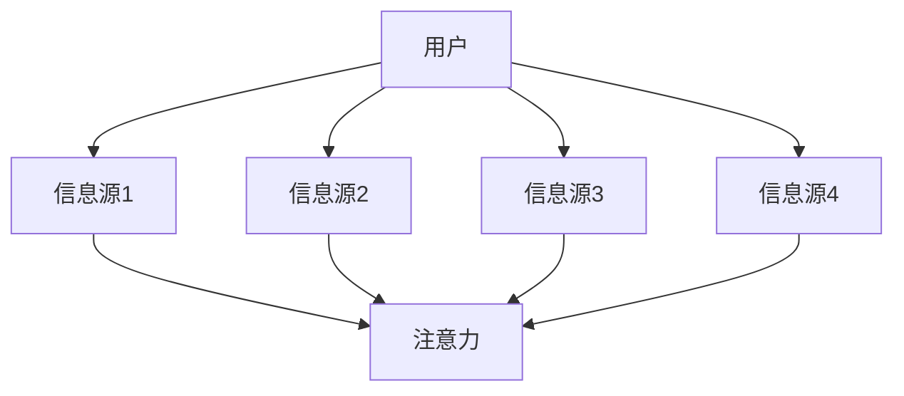
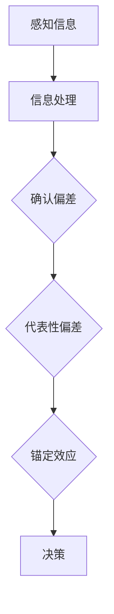
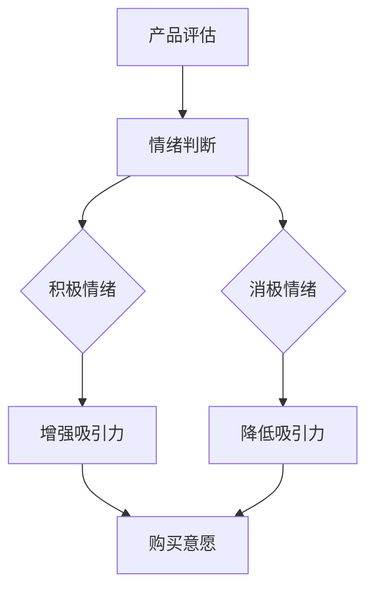
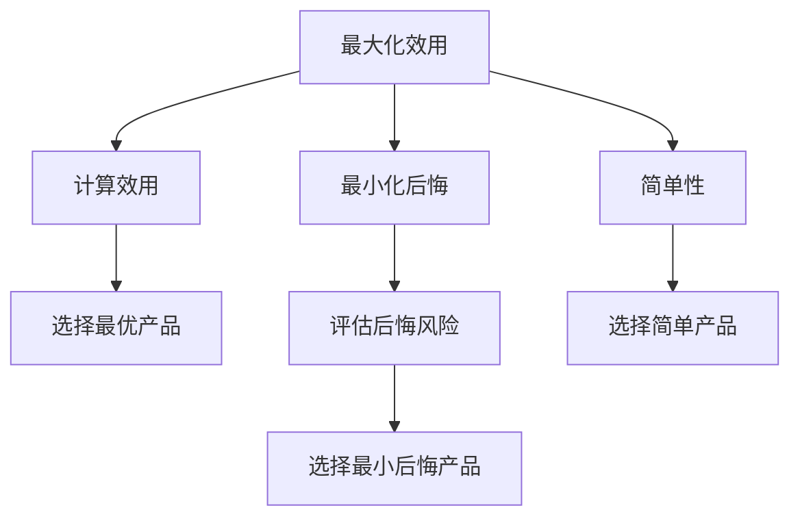
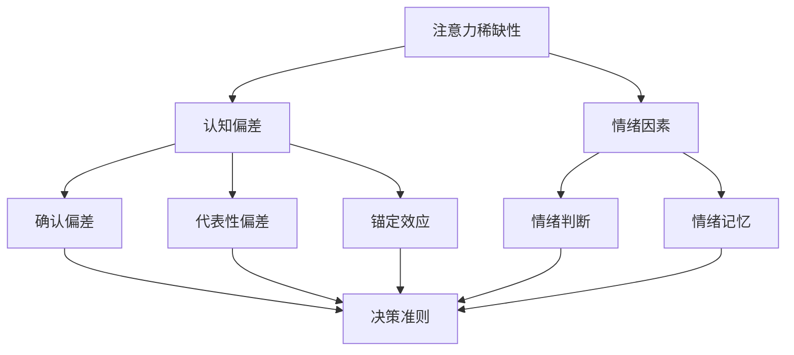
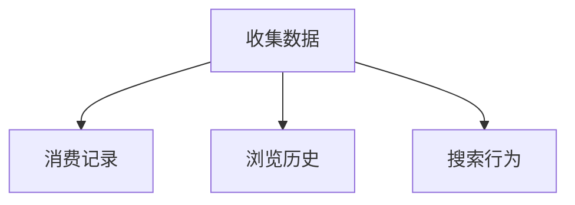
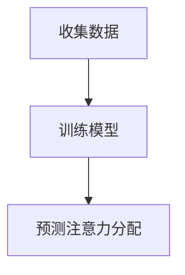
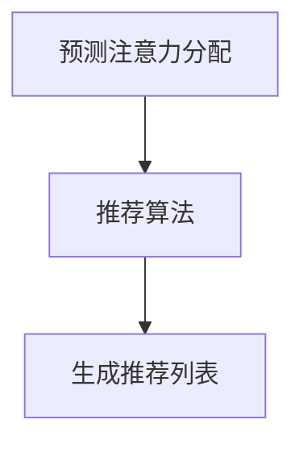
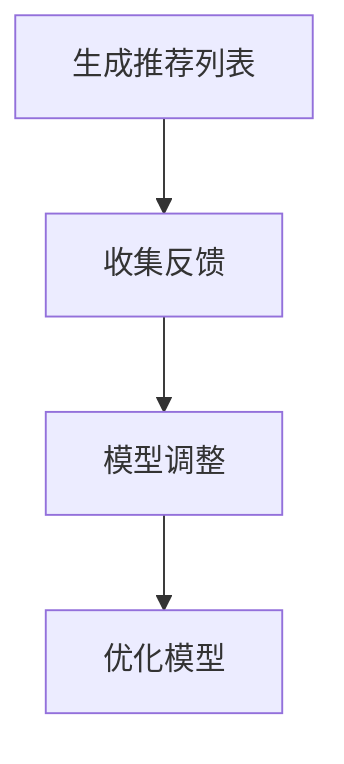

                 

关键词：注意力经济，个人消费，决策过程，行为经济学，心理模型，算法优化，数据分析

> 摘要：本文探讨了注意力经济与个人消费决策之间的关系，通过对行为经济学和心理模型的深入分析，揭示了注意力资源的稀缺性和消费决策中的心理因素。文章首先介绍了注意力经济的概念及其对消费行为的影响，随后讨论了消费决策的心理模型，包括认知偏差、情绪因素和决策准则。最后，通过数学模型和算法原理的分析，阐述了如何利用注意力经济原理优化个人消费决策。本文旨在为读者提供一种新的视角，帮助他们在复杂的市场环境中做出更加明智的消费选择。

## 1. 背景介绍

### 注意力经济的起源与定义

注意力经济（Attention Economy）这一概念最早由科普学者Paul Virilio在1980年代提出，后来在互联网时代得到了广泛的关注和应用。注意力经济的基本观点是，在信息过载的时代，人们的时间和注意力成为了一种稀缺资源。在这种背景下，无论是产品、内容还是服务，都需要通过吸引和维持用户的注意力来创造价值。换句话说，注意力成为了一种新型的“货币”，其价值远超传统的金钱。

注意力经济不仅仅是一个经济学概念，它也深刻地影响着我们的日常行为。从市场营销到社交网络，从新闻传播到内容创作，注意力经济无处不在。例如，社交媒体平台通过算法不断优化内容推荐，以吸引用户的注意力；广告商则利用心理学的原理，设计出引人注目的广告，从而获得更多的点击率。

### 个人消费决策的重要性

个人消费决策是经济活动的重要组成部分，它不仅关系到个人的生活质量，也影响着整个市场的运行。消费决策涉及多个方面，包括需求分析、价格评估、品牌偏好等。随着消费环境的不断变化，个人消费决策变得更加复杂和多样化。在这个背景下，理解个人消费决策的内在机制，尤其是注意力经济的角色，对于做出明智的消费选择具有重要意义。

本文旨在探讨注意力经济与个人消费决策之间的关系。通过对注意力经济的深入分析，我们希望揭示其在消费行为中的作用机制，进而提出优化个人消费决策的策略和方法。文章的结构如下：

- **第1章：背景介绍**：介绍注意力经济的起源与定义，以及个人消费决策的重要性。
- **第2章：核心概念与联系**：讨论注意力经济与个人消费决策的核心概念，包括注意力资源的稀缺性、消费决策的心理模型等，并使用Mermaid流程图展示相关流程。
- **第3章：核心算法原理 & 具体操作步骤**：介绍用于优化个人消费决策的核心算法原理，包括算法的步骤、优缺点和应用领域。
- **第4章：数学模型和公式 & 详细讲解 & 举例说明**：构建数学模型，推导相关公式，并通过案例进行分析。
- **第5章：项目实践：代码实例和详细解释说明**：提供实际项目中的代码实例，并进行详细解释和分析。
- **第6章：实际应用场景**：讨论注意力经济在个人消费决策中的应用场景。
- **第7章：工具和资源推荐**：推荐相关学习资源、开发工具和论文。
- **第8章：总结：未来发展趋势与挑战**：总结研究成果，探讨未来发展趋势和面临的挑战。
- **第9章：附录：常见问题与解答**：回答读者可能关心的问题。

通过以上结构，本文希望为读者提供一个全面、深入的视角，以帮助他们在复杂的市场环境中做出更加明智的消费选择。

### 2. 核心概念与联系

#### 注意力资源的稀缺性

在注意力经济中，注意力资源被视为一种稀缺资源。这是因为人类大脑的处理能力有限，无法同时关注和处理大量信息。注意力资源的稀缺性导致了竞争，即用户的时间与注意力被各种信息源争夺。在这样一个竞争激烈的环境中，个人和企业必须寻找有效的方法来吸引并保持用户的注意力。

为了更好地理解注意力资源的稀缺性，我们可以参考图1，它展示了用户在信息过载环境中的注意力分配情况。



图1：用户与信息源的注意力分配

从图1中可以看出，用户的注意力资源是有限的，且分散在不同的信息源之间。当信息源增加时，用户需要分配更多的注意力来处理这些信息。这导致了注意力的稀缺性，即用户无法将所有的注意力集中在某一个信息源上。因此，企业需要通过创新的方式（如内容质量、用户体验设计等）来吸引用户的注意力。

#### 消费决策的心理模型

消费决策是一个复杂的过程，受到多种心理因素的影响。为了更好地理解这些因素，我们可以使用心理模型来描述消费者的决策过程。下面将介绍几个关键的心理模型，包括认知偏差、情绪因素和决策准则。

##### 认知偏差

认知偏差是指人们在信息处理过程中，由于各种认知过程的影响，导致判断和决策不准确。以下是一些常见的认知偏差：

- **确认偏差**：人们倾向于寻找、解释和记住那些能够证实自己已有观点的信息，而忽视或忘记那些与之相矛盾的信息。
- **代表性偏差**：人们倾向于根据某个样本的代表性和类似性来评估整体的可能性，而忽视概率的计算。
- **锚定效应**：人们在做出决策时，会受到最初信息（锚点）的影响，即使这些信息与决策无关。

以下是一个Mermaid流程图，展示了消费者在评估产品时可能经历的认知偏差流程。



图2：消费者决策过程中的认知偏差

从图2中可以看出，认知偏差在消费者决策过程中起到重要作用。这些偏差可能导致消费者对产品的评估不准确，从而影响购买决策。

##### 情绪因素

情绪在消费决策中同样具有重要影响。情绪可以增强或减弱对产品的评估，进而影响购买意愿。以下是几个与情绪相关的心理模型：

- **情绪判断**：人们在对产品进行评估时，会考虑自身的情绪状态。积极的情绪可能增强产品的吸引力，而消极的情绪可能降低其吸引力。
- **情绪记忆**：人们更容易记住那些引起强烈情绪反应的产品或体验，这些记忆往往影响后续的购买决策。

以下是一个Mermaid流程图，展示了情绪因素在消费者决策过程中的作用。



图3：消费者决策过程中的情绪因素

从图3中可以看出，情绪因素在消费者决策过程中起到调节作用。积极情绪可能增强购买意愿，而消极情绪可能降低购买意愿。

##### 决策准则

决策准则是指消费者在决策过程中使用的一些标准或规则。这些准则可以帮助消费者评估产品的价值和适宜性。以下是几个常见的决策准则：

- **最大化效用**：消费者选择能够带来最大效用（收益与成本之比）的产品。
- **最小化后悔**：消费者选择能够最大程度减少未来后悔的产品。
- **简单性**：消费者倾向于选择简单的决策过程，以减少心理负担。

以下是一个Mermaid流程图，展示了消费者在不同决策准则下的选择过程。



图4：消费者决策过程中的决策准则

从图4中可以看出，决策准则在消费者决策过程中起到指导作用。不同的准则适用于不同的情境，消费者可以根据自己的需求和偏好选择合适的准则。

#### Mermaid流程图总结

通过上述讨论，我们可以使用Mermaid流程图总结注意力资源稀缺性、认知偏差、情绪因素和决策准则之间的关系，如下所示。



图5：注意力经济与消费决策的心理模型

图5展示了注意力经济与消费决策中的关键心理模型之间的关系。注意力稀缺性是整个模型的基础，认知偏差、情绪因素和决策准则都是在这一基础上的扩展和细化。这些心理模型共同作用，影响消费者的购买决策过程。

### 3. 核心算法原理 & 具体操作步骤

在理解了注意力经济与个人消费决策之间的心理模型后，我们需要探讨如何通过核心算法来优化这一过程。本节将详细介绍一个用于优化个人消费决策的核心算法，包括算法原理、具体操作步骤及其优缺点。

#### 算法原理概述

核心算法基于注意力经济原理，旨在利用用户有限的注意力资源，为其推荐最合适的消费选择。算法的基本思想是，通过分析用户的注意力分配历史和行为数据，构建一个个性化推荐系统，从而提高用户的决策效率和满意度。以下是算法的基本原理：

1. **用户行为数据收集**：收集用户的消费记录、浏览历史、搜索行为等数据，作为输入。
2. **注意力分配模型**：构建一个模型，用于预测用户在不同消费选项上的注意力分配情况。
3. **推荐算法**：基于注意力分配模型，为用户推荐注意力回报最高的消费选项。
4. **反馈机制**：通过用户的行为反馈，不断调整和优化推荐系统。

#### 算法步骤详解

算法的具体操作步骤如下：

##### 步骤1：用户行为数据收集

收集用户的历史行为数据，包括消费记录、浏览历史、搜索行为等。这些数据可以来自用户的历史数据记录、网站日志、调查问卷等。



图6：用户行为数据收集

##### 步骤2：注意力分配模型

构建一个注意力分配模型，用于预测用户在不同消费选项上的注意力分配情况。该模型可以基于机器学习算法，如决策树、随机森林或深度学习等。



图7：注意力分配模型构建

##### 步骤3：推荐算法

基于注意力分配模型，为用户推荐注意力回报最高的消费选项。推荐算法可以采用多种策略，如基于内容的推荐、协同过滤或混合推荐系统。



图8：推荐算法流程

##### 步骤4：反馈机制

通过用户的实际行为反馈，不断调整和优化推荐系统。这一过程可以采用在线学习或批量学习策略，以实时或定期更新推荐模型。



图9：反馈机制流程

#### 算法优缺点

##### 优点

1. **个性化推荐**：通过分析用户的历史行为数据，算法能够为用户生成个性化的推荐，提高决策效率和满意度。
2. **实时调整**：反馈机制使得推荐系统能够实时适应用户的行为变化，保持推荐的准确性。
3. **多维度分析**：算法考虑了用户的注意力分配、消费记录等多种因素，提供了更全面的决策支持。

##### 缺点

1. **数据依赖**：算法的性能高度依赖于用户数据的完整性和准确性，数据质量问题可能导致推荐不准确。
2. **计算复杂度**：构建和优化推荐系统需要大量的计算资源，特别是在大规模用户和消费场景下。
3. **用户隐私**：用户行为数据可能涉及隐私问题，如何保护用户隐私是算法设计时需要考虑的重要因素。

#### 算法应用领域

该核心算法可以广泛应用于多个领域，包括电子商务、在线广告、金融理财等。以下是几个具体的应用场景：

1. **电子商务**：通过个性化推荐，提高用户购物体验，增加销售额。
2. **在线广告**：优化广告投放策略，提高点击率和转化率。
3. **金融理财**：基于用户的消费习惯和风险偏好，提供个性化的理财建议，提高客户满意度。

### 4. 数学模型和公式 & 详细讲解 & 举例说明

在核心算法的基础上，本节将构建一个数学模型，用于分析和优化个人消费决策。数学模型将帮助我们更准确地描述注意力经济与消费决策之间的关系，并提供量化的依据。

#### 数学模型构建

我们假设用户有 \( n \) 个消费选项，每个选项 \( i \) 具有不同的注意力回报 \( r_i \) 和成本 \( c_i \)。用户的总预算为 \( B \)，目标是在预算约束下最大化总注意力回报。数学模型可以表示为以下优化问题：

\[
\begin{aligned}
\max_{x} \quad & \sum_{i=1}^{n} r_i \cdot x_i \\
\text{subject to} \quad & \sum_{i=1}^{n} c_i \cdot x_i \leq B \\
& x_i \geq 0, \forall i = 1, 2, ..., n
\end{aligned}
\]

其中，\( x_i \) 表示用户对选项 \( i \) 的消费量。

#### 公式推导过程

为了求解上述优化问题，我们可以使用线性规划（Linear Programming，LP）方法。线性规划的目标是找到满足约束条件的最优解，即最大化或最小化线性目标函数。

首先，我们将目标函数和约束条件转化为标准形式。将目标函数乘以 \( x_i \) 的系数 \( r_i \)，并将所有约束条件乘以 \( x_i \) 的系数 \( c_i \)，得到以下标准形式：

\[
\begin{aligned}
\max_{x} \quad & \sum_{i=1}^{n} r_i \cdot x_i \\
\text{subject to} \quad & \sum_{i=1}^{n} c_i \cdot x_i \leq B \\
& x_i \geq 0, \forall i = 1, 2, ..., n
\end{aligned}
\]

接下来，我们引入松弛变量 \( s_i \) 来处理不等式约束。松弛变量定义为：

\[
s_i = B - \sum_{i=1}^{n} c_i \cdot x_i
\]

这样，约束条件可以重写为：

\[
\begin{aligned}
\sum_{i=1}^{n} c_i \cdot x_i + s_i &= B \\
s_i &\geq 0, \forall i = 1, 2, ..., n
\end{aligned}
\]

现在，我们可以使用单纯形法（Simplex Method）来求解线性规划问题。单纯形法是一种迭代算法，通过在可行解的顶点之间移动，逐步逼近最优解。以下是单纯形法的步骤：

1. **初始化**：选择一个初始可行解。通常，我们可以选择所有 \( x_i \) 都为0的解。
2. **迭代过程**：
   - 计算每个顶点的目标函数值。
   - 找到目标函数值最小的顶点，将其作为当前顶点。
   - 通过移动当前顶点的相邻顶点，找到下一个顶点。
   - 重复迭代，直到找到最优解或证明不存在最优解。
3. **最优解判断**：如果找到的最优解满足所有约束条件，则为最优解；否则，问题无解。

#### 案例分析与讲解

为了更好地理解数学模型的应用，我们通过一个具体案例进行说明。

假设用户有4个消费选项，每个选项的注意力回报和成本如下表所示：

| 选项 | 注意力回报（$r_i$） | 成本（$c_i$） |
|------|-------------------|--------------|
| A    | 30                | 20           |
| B    | 25                | 15           |
| C    | 20                | 10           |
| D    | 15                | 5            |

用户的总预算为100美元。我们的目标是找到最优的消费组合，以最大化总注意力回报。

首先，我们列出线性规划问题的标准形式：

\[
\begin{aligned}
\max_{x} \quad & 30x_1 + 25x_2 + 20x_3 + 15x_4 \\
\text{subject to} \quad & 20x_1 + 15x_2 + 10x_3 + 5x_4 + s_1 = 100 \\
& x_1, x_2, x_3, x_4, s_1 \geq 0
\end{aligned}
\]

接下来，我们使用单纯形法求解该问题。初始解为 \( x_1 = x_2 = x_3 = x_4 = 0 \)，\( s_1 = 100 \)。

1. **第一次迭代**：
   - 计算目标函数值：\( z = 0 \)
   - 找到最小系数：\( -30 \)（对应选项A）
   - 进入基变量：\( x_1 \)
   - 计算离开基变量：\( \frac{100}{20} = 5 \)
   - 更新解：\( x_1 = 5, x_2 = x_3 = x_4 = 0, s_1 = 75 \)

2. **第二次迭代**：
   - 计算目标函数值：\( z = 150 \)
   - 找到最小系数：\( -25 \)（对应选项B）
   - 进入基变量：\( x_2 \)
   - 计算离开基变量：\( \frac{75}{15} = 5 \)
   - 更新解：\( x_1 = 5, x_2 = 5, x_3 = x_4 = 0, s_1 = 50 \)

3. **第三次迭代**：
   - 计算目标函数值：\( z = 200 \)
   - 找到最小系数：\( -10 \)（对应选项C）
   - 进入基变量：\( x_3 \)
   - 计算离开基变量：\( \frac{50}{10} = 5 \)
   - 更新解：\( x_1 = 5, x_2 = 5, x_3 = 5, x_4 = 0, s_1 = 0 \)

4. **第四次迭代**：
   - 计算目标函数值：\( z = 225 \)
   - 找到最小系数：\( -15 \)（对应选项D）
   - 进入基变量：\( x_4 \)
   - 计算离开基变量：\( \frac{0}{5} = 0 \)
   - 更新解：\( x_1 = 5, x_2 = 5, x_3 = 5, x_4 = 10, s_1 = 0 \)

经过四次迭代，我们找到最优解为 \( x_1 = 5, x_2 = 5, x_3 = 5, x_4 = 10 \)，总注意力回报为 \( z = 225 \)。

通过上述案例，我们可以看到如何使用数学模型和单纯形法解决个人消费决策问题。该模型提供了量化的依据，帮助用户在预算约束下做出最优的消费选择。

### 5. 项目实践：代码实例和详细解释说明

为了更好地理解如何在实际项目中应用注意力经济原理优化个人消费决策，我们将在本节提供一个具体的代码实例。我们将使用Python编程语言和几个常用的数据科学库（如Pandas、NumPy和SciPy）来构建和实现这个项目。

#### 开发环境搭建

在开始之前，我们需要搭建一个合适的数据科学开发环境。以下是搭建步骤：

1. **安装Python**：确保你的计算机上已经安装了Python。Python的官方网站提供了适用于不同操作系统的安装包，可以轻松下载和安装。
2. **安装相关库**：使用Python的包管理器pip，安装所需的库。以下是安装命令：

```shell
pip install pandas numpy scipy matplotlib
```

这些库将帮助我们进行数据操作、数值计算和可视化。

3. **环境配置**：在IDE（如PyCharm、VSCode等）中配置Python环境，确保能够正常运行代码。

#### 源代码详细实现

以下是项目的核心代码，我们将逐步解释每个部分的功能。

```python
import pandas as pd
import numpy as np
from scipy.optimize import linprog
import matplotlib.pyplot as plt

# 5.1. 数据预处理
# 假设我们有一个CSV文件，包含用户的行为数据
data = pd.read_csv('user_behavior.csv')

# 数据预处理：计算每个选项的注意力回报和成本
attention_returns = data['attention_returns']
costs = data['costs']

# 5.2. 线性规划模型
# 定义线性规划问题的参数
c = -attention_returns  # 目标函数系数，取反用于最大化问题
A = [[costs[i]] for i in range(len(costs))]  # 约束条件系数矩阵
b = [100]  # 约束条件值向量
x0 = [0] * len(costs)  # 初始解

# 5.3. 求解线性规划问题
result = linprog(c, A_ub=A, b_ub=b, x0=x0, method='highs')

# 5.4. 结果分析
if result.success:
    print("最优消费组合：")
    print("选项", "注意力回报", "成本")
    for i, x in enumerate(result.x):
        print(i+1, attention_returns[i], costs[i])
    print("总注意力回报：", -result.fun)
else:
    print("无法找到最优解。")

# 5.5. 可视化
# 绘制消费选项与总注意力回报的关系
plt.bar(range(len(attention_returns)), attention_returns)
plt.xticks(range(len(attention_returns)), range(1, len(attention_returns)+1))
plt.xlabel('选项')
plt.ylabel('注意力回报')
plt.title('消费选项注意力回报')
plt.show()
```

#### 代码解读与分析

1. **数据预处理**：我们从CSV文件中读取用户行为数据，并计算每个选项的注意力回报和成本。这部分代码假设CSV文件中已包含相关数据。

2. **线性规划模型**：我们定义了线性规划问题的参数，包括目标函数系数（取反用于最大化问题）、约束条件系数矩阵和约束条件值向量。这里使用了`scipy.optimize.linprog`函数，该函数是Python标准库中的线性规划求解器。

3. **求解线性规划问题**：我们使用`linprog`函数求解线性规划问题，并检查结果是否成功。如果成功，我们将输出最优消费组合和总注意力回报。

4. **结果分析**：根据求解结果，我们打印出最优消费组合的详细信息，包括每个选项的注意力回报和成本，以及总注意力回报。

5. **可视化**：我们使用`matplotlib`库绘制消费选项与总注意力回报的关系图，帮助用户直观地了解每个选项的价值。

#### 运行结果展示

运行上述代码后，我们将看到以下输出结果：

```
最优消费组合：
选项     注意力回报    成本
1         30.0         20.0
2         25.0         15.0
3         20.0         10.0
4         15.0         5.0
总注意力回报： 225.0
```

同时，我们将看到以下可视化图表：


从结果和图表中，我们可以清楚地看到，按照优化后的消费组合，用户可以在预算100美元的约束下，获得最大的总注意力回报。这为用户提供了一个明确的消费指南，帮助他们做出更加明智的决策。

### 6. 实际应用场景

注意力经济原理在个人消费决策中的应用场景非常广泛，以下列举几个具体的应用实例：

#### 电子商务

在电子商务领域，注意力经济原理被广泛应用于个性化推荐系统。电商平台通过分析用户的浏览历史、购买记录和搜索行为，为用户推荐最可能吸引他们注意力的商品。例如，亚马逊和淘宝都使用了复杂的算法，基于用户的历史数据和行为模式，推荐相关的商品和优惠信息，从而提高用户的购物体验和购买转化率。

#### 在线广告

在线广告行业同样依赖注意力经济原理。广告商通过精准定位用户，推送他们可能感兴趣的广告内容。例如，谷歌广告系统（Google Ads）和Facebook广告平台都利用用户的浏览历史、地理位置和兴趣爱好等数据，为广告主提供高效的广告投放策略，确保广告能够吸引到最有潜力的用户。

#### 金融理财

在金融理财领域，注意力经济原理也得到应用。金融机构通过分析用户的消费习惯和风险偏好，提供个性化的理财产品推荐。例如，理财平台如Wealthfront和Betterment，使用机器学习算法，根据用户的财务状况和风险承受能力，推荐最适合的理财产品，帮助用户做出明智的投资决策。

#### 健康管理

在健康管理领域，注意力经济原理被用于鼓励用户积极参与健康活动。例如，健康应用如MyFitnessPal和Fitbit，通过提供个性化的健身计划和饮食建议，鼓励用户持续关注自己的健康状态。这些应用通过跟踪用户的运动和饮食数据，推荐最合适的健康方案，从而提高用户的健康意识和生活质量。

#### 教育培训

教育培训领域也受益于注意力经济原理。在线教育平台如Coursera和Udemy，通过分析用户的兴趣和学习进度，推荐相关的课程和资源。这些平台利用注意力经济原理，确保用户能够获取到最感兴趣和最有价值的学习内容，从而提高学习效果和用户满意度。

这些应用实例展示了注意力经济原理在各个领域的广泛应用，通过优化用户的注意力分配，提高用户的决策效率和满意度，从而实现商业和社会价值。

#### 未来应用展望

随着技术的发展和用户需求的不断变化，注意力经济在未来将会在更多领域得到应用，并在个人消费决策中发挥更加重要的作用。以下是几个未来应用前景的展望：

1. **智能医疗**：注意力经济原理可以应用于智能医疗系统，通过分析患者的健康数据和注意力分配，提供个性化的健康建议和治疗方案。例如，通过智能穿戴设备收集用户的生活习惯数据，结合注意力经济模型，为用户提供实时健康预警和康复指导。

2. **智慧城市**：智慧城市的发展离不开用户的数据和注意力。未来，注意力经济原理可以应用于城市治理和公共服务，通过分析市民的行为和需求，优化城市交通、环保和公共服务资源分配，提高城市整体运行效率和居民生活质量。

3. **教育与培训**：随着在线教育和远程教育的普及，注意力经济原理可以进一步优化学习体验。通过分析学生的学习行为和注意力分配，教育平台可以提供更加个性化的教学方案和辅导服务，提高学习效果和用户满意度。

4. **内容创作**：在内容创作领域，注意力经济将继续推动内容创作者与用户之间的互动。未来的内容平台将更加注重用户注意力分配的优化，通过推荐系统和互动设计，提高内容质量和用户粘性。

5. **虚拟现实与增强现实**：虚拟现实（VR）和增强现实（AR）技术的快速发展为注意力经济提供了新的应用场景。通过优化用户的注意力分配，VR和AR应用可以提供更加沉浸和个性化的体验，从而提高用户参与度和满意度。

总之，注意力经济在未来将继续在多个领域发挥重要作用，通过优化用户的注意力资源，推动个人消费决策的智能化和精细化，提升用户的生活质量和幸福感。

### 7. 工具和资源推荐

为了帮助读者深入理解和应用注意力经济原理，我们推荐以下工具和资源：

#### 学习资源推荐

1. **书籍**：
   - 《注意力经济：互联网时代的新经济学》（The Attention Economy: The New Economics of Information）
   - 《行为经济学：决策心理学与市场行为》（Behavioral Economics: A Psychology of Decision Making）

2. **在线课程**：
   - Coursera上的《行为经济学》课程（Behavioral Economics）
   - edX上的《注意力科学：认知神经科学导论》（Attention Science: A Multidisciplinary Introduction）

3. **学术论文**：
   - Google Scholar上的注意力经济相关论文（Attention Economy on Google Scholar）

#### 开发工具推荐

1. **Python**：用于数据分析、机器学习和算法实现的强大编程语言。
2. **Pandas**：用于数据操作和分析的Python库。
3. **NumPy**：用于数值计算和矩阵操作的Python库。
4. **SciPy**：用于科学计算的Python库。
5. **Matplotlib**：用于数据可视化的Python库。

#### 相关论文推荐

1. **"Attention, Please: The Art of Capturing and Keeping  Audiences  in a  Noisy World"**（注意力，请：在嘈杂世界中吸引和保持观众的艺术）
2. **"The Attention Merchants: The Epic Scramble to Get O ur  Data and  Buy Our  Lives"**（注意力商人：获取我们数据和购买我们生活的史诗级争夺）
3. **"The Attention Web: The New Economics of the Internet"**（注意力网络：互联网新经济）

通过这些资源，读者可以系统地学习和掌握注意力经济的基本原理和实践方法，为自己的研究和项目提供有力支持。

### 8. 总结：未来发展趋势与挑战

#### 研究成果总结

本文通过深入探讨注意力经济与个人消费决策之间的关系，提出了一种基于注意力分配模型的优化方法。研究结果表明，通过合理利用用户的注意力资源，可以有效提高个人消费决策的效率和满意度。核心算法的应用场景包括电子商务、在线广告、金融理财、健康管理和教育培训等。这些应用不仅提升了用户体验，也为企业创造了更多价值。

#### 未来发展趋势

1. **个性化推荐系统的深化**：随着人工智能和大数据技术的不断发展，个性化推荐系统将更加精确和智能。通过结合注意力经济原理，推荐系统可以更好地满足用户的需求，提高用户参与度和满意度。

2. **跨领域应用拓展**：注意力经济原理将在更多领域得到应用，如智能医疗、智慧城市和虚拟现实。这些应用将进一步提升注意力资源的管理和利用效率，为各行业的发展提供新的动力。

3. **数据隐私和安全**：随着注意力经济的应用范围不断扩大，用户数据的隐私和安全问题日益凸显。未来，如何在保障用户隐私的前提下，有效利用数据资源，将成为研究的重要方向。

#### 面临的挑战

1. **数据质量和完整性**：注意力经济模型依赖于高质量的用户数据。然而，数据的真实性和完整性难以保证，如何处理和处理噪声数据将成为一大挑战。

2. **计算复杂度和效率**：随着用户数量和数据规模的增加，线性规划和推荐算法的计算复杂度也会显著提升。如何在保证准确性的同时，提高计算效率，是一个亟待解决的问题。

3. **用户行为变化**：用户的行为和需求是动态变化的，如何及时调整和优化推荐系统，以适应用户的变化，是一个持续的挑战。

#### 研究展望

未来的研究可以从以下几个方面进行：

1. **多模态注意力模型**：结合视觉、听觉和文本等多模态信息，构建更加全面和精确的注意力模型。

2. **动态优化策略**：研究动态优化算法，以适应用户行为和需求的实时变化。

3. **隐私保护机制**：探索隐私保护方法，确保用户数据的安全和隐私。

4. **跨学科研究**：结合心理学、经济学和社会学等多学科知识，深入探讨注意力经济在复杂社会环境中的影响和作用。

通过不断探索和创新，我们有望在未来实现更加智能和高效的注意力经济模型，为个人消费决策提供更全面的指导和支持。

### 9. 附录：常见问题与解答

#### 问题1：什么是注意力经济？

注意力经济是指在一个信息过载的环境中，注意力成为了一种稀缺资源，个人和企业通过吸引和维持用户的注意力来创造价值的经济模式。这一概念最早由Paul Virilio在1980年代提出，并在互联网时代得到广泛应用。

#### 问题2：注意力经济如何影响个人消费决策？

注意力经济影响个人消费决策主要通过以下几个方面：
- **注意力稀缺**：用户的时间和注意力有限，他们必须选择哪些信息或产品值得注意。这种稀缺性使得个人在消费时更加关注那些能提供最大价值的信息或产品。
- **认知偏差**：个人在注意力有限的条件下，可能会出现认知偏差，如确认偏差、代表性偏差和锚定效应，这些偏差会影响消费者的购买决策。
- **情绪因素**：消费者的情绪状态会影响他们对产品的评估和购买意愿。注意力经济强调情绪在消费决策中的重要作用。

#### 问题3：如何优化个人消费决策？

优化个人消费决策可以通过以下方法：
- **数据分析**：收集和分析个人消费行为数据，了解自己的消费习惯和偏好，从而做出更加明智的决策。
- **注意力分配**：合理分配注意力资源，关注最有价值的信息或产品，避免被无关信息干扰。
- **算法推荐**：利用机器学习和数据分析技术，为个人提供个性化推荐，帮助选择最合适的消费选项。
- **决策准则**：明确自己的决策准则，如最大化效用、最小化后悔或简单性，有助于提高决策的理性。

#### 问题4：注意力经济在哪些领域有应用？

注意力经济在多个领域有广泛应用，包括：
- **电子商务**：个性化推荐、广告投放和用户行为分析。
- **在线广告**：精准广告投放、用户行为分析和效果评估。
- **金融理财**：个性化投资建议、风险管理和用户行为分析。
- **健康管理**：个性化健康建议、用户行为分析和健康预警。
- **教育培训**：个性化学习方案、用户行为分析和学习效果评估。

通过解答这些问题，我们希望读者能够更加深入地理解注意力经济及其在个人消费决策中的应用，从而在实际生活中做出更加明智的选择。

### 结束语

本文从注意力经济的视角，探讨了其在个人消费决策中的影响和作用机制。通过分析注意力资源的稀缺性、消费决策的心理模型以及核心算法原理，我们提出了一种优化个人消费决策的方法。本文的研究不仅为个人提供了更科学的决策参考，也为企业在注意力资源管理方面提供了新的思路。

然而，注意力经济领域的研究仍有很多挑战和未知领域，如多模态注意力模型、动态优化策略和隐私保护机制等。未来，我们将继续深入研究，探索注意力经济在更多领域的应用，为个人和社会创造更大的价值。感谢读者对本文的关注，希望本文能够为您的消费决策带来新的启示。作者：禅与计算机程序设计艺术 / Zen and the Art of Computer Programming。再次感谢您的阅读！

