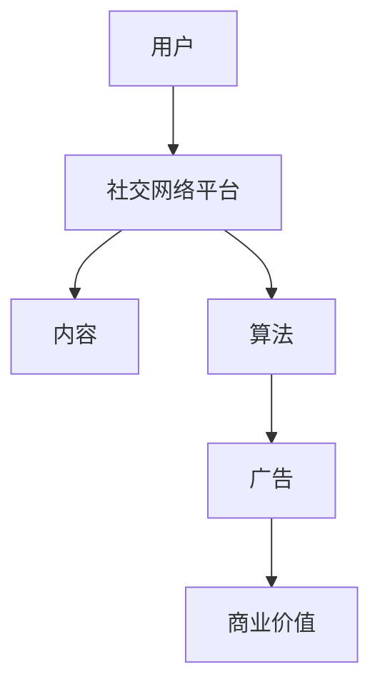

                 

关键词：注意力经济，社交网络，信息传播，算法，用户体验，算法优化，数据隐私，未来趋势

> 摘要：随着互联网技术的飞速发展，个人社交网络和注意力经济逐渐成为研究热点。本文旨在探讨注意力经济与个人社交网络的相互关系，分析其发展现状、核心算法原理，以及在实际应用中的挑战和未来展望。

## 1. 背景介绍

随着互联网和移动设备的普及，社交网络已经成为人们日常生活中不可或缺的一部分。从Facebook、Twitter到Instagram、微信，社交网络平台已经成为人们获取信息、交流互动的主要渠道。然而，随着用户数量的激增和内容种类的多样化，社交网络平台也面临着信息过载、内容质量下降等问题。为了解决这些问题，注意力经济应运而生。

注意力经济是指通过获取用户的注意力来创造经济价值的一种经济模式。在社交网络平台上，用户的注意力成为了一种稀缺资源，平台通过算法优化和内容推荐等方式，尽可能地将用户的注意力引导到优质内容和广告上，从而实现商业价值。

## 2. 核心概念与联系

### 2.1 核心概念

#### 2.1.1 注意力经济

注意力经济是一种基于用户注意力的经济模式。用户在社交网络上花费的时间、观看视频、点击广告等行为，都是对平台提供内容的注意力投入。平台通过算法分析用户的兴趣和行为，提供个性化的内容推荐，从而提高用户的注意力利用率。

#### 2.1.2 社交网络

社交网络是一种基于人际关系和互动的平台，用户可以在其中发布内容、关注他人、进行评论等。社交网络的核心价值在于用户之间的互动和信息传播。

### 2.2 核心概念联系

注意力经济与社交网络之间的联系主要体现在以下几个方面：

1. **用户注意力转移**：社交网络平台通过算法将用户的注意力从海量信息中转移到优质内容和广告上。
2. **内容推荐**：社交网络平台利用注意力经济原理，通过内容推荐系统为用户提供个性化的内容。
3. **广告投放**：社交网络平台通过用户注意力转化为广告收益，实现商业价值。

### 2.3 Mermaid 流程图



## 3. 核心算法原理 & 具体操作步骤

### 3.1 算法原理概述

社交网络平台的核心算法主要包括推荐算法和广告投放算法。推荐算法旨在为用户推荐感兴趣的内容，提高用户的满意度和粘性；广告投放算法则通过精准定位用户，提高广告的投放效果。

### 3.2 算法步骤详解

#### 3.2.1 推荐算法

1. **数据收集**：收集用户的基本信息、行为数据、兴趣标签等。
2. **特征提取**：将用户数据转换为特征向量，用于后续计算。
3. **模型训练**：使用机器学习算法，如协同过滤、基于内容的推荐等，训练推荐模型。
4. **内容推荐**：根据用户特征和模型预测，为用户推荐感兴趣的内容。

#### 3.2.2 广告投放算法

1. **用户定位**：通过用户的浏览记录、兴趣爱好等信息，确定用户的兴趣标签。
2. **广告筛选**：根据广告主的定位要求和平台的广告库存，筛选出合适的广告。
3. **广告投放**：根据用户特征和广告特点，决定广告的投放时机和方式。

### 3.3 算法优缺点

#### 3.3.1 推荐算法

**优点**：

- 提高用户满意度：为用户提供个性化的内容推荐，提高用户体验。
- 增加用户粘性：通过推荐机制，引导用户持续关注平台。

**缺点**：

- 可能导致信息茧房：过于依赖推荐算法，可能导致用户陷入封闭的信息环境。
- 数据隐私风险：推荐算法需要大量用户数据，可能引发数据隐私问题。

#### 3.3.2 广告投放算法

**优点**：

- 提高广告投放效果：通过精准定位用户，提高广告的点击率和转化率。
- 增加平台收益：广告投放是社交网络平台的主要盈利模式。

**缺点**：

- 可能影响用户体验：过度广告投放可能导致用户反感。
- 广告内容监管难度大：平台需要严格监管广告内容，防止违规广告的传播。

### 3.4 算法应用领域

推荐算法和广告投放算法在社交网络平台中的应用非常广泛，如：

- **电子商务**：通过推荐算法，为用户提供个性化的商品推荐，提高销售额。
- **新闻媒体**：通过推荐算法，为用户提供感兴趣的新闻内容，提高用户粘性。
- **社交媒体**：通过广告投放算法，为广告主提供精准的广告投放服务，提高广告效果。

## 4. 数学模型和公式 & 详细讲解 & 举例说明

### 4.1 数学模型构建

在注意力经济中，常用的数学模型包括用户兴趣模型、内容推荐模型和广告投放模型。

#### 4.1.1 用户兴趣模型

用户兴趣模型可以表示为：

$$
U_i = \sum_{j=1}^{n} w_{ij} \cdot C_j
$$

其中，$U_i$表示用户$i$的兴趣，$w_{ij}$表示用户$i$对内容$j$的权重，$C_j$表示内容$j$的特征向量。

#### 4.1.2 内容推荐模型

内容推荐模型可以表示为：

$$
R_i = \sum_{j=1}^{n} r_{ij} \cdot C_j
$$

其中，$R_i$表示为用户$i$推荐的内容，$r_{ij}$表示内容$j$对用户$i$的吸引力，$C_j$表示内容$j$的特征向量。

#### 4.1.3 广告投放模型

广告投放模型可以表示为：

$$
A_i = \sum_{j=1}^{n} a_{ij} \cdot C_j
$$

其中，$A_i$表示为用户$i$投放的广告，$a_{ij}$表示广告$j$对用户$i$的吸引力，$C_j$表示广告$j$的特征向量。

### 4.2 公式推导过程

#### 4.2.1 用户兴趣模型推导

用户兴趣模型的推导基于用户对内容的评分数据。假设用户$i$对内容$j$的评分为$r_{ij}$，则用户$i$对内容$j$的权重可以表示为：

$$
w_{ij} = \frac{r_{ij}}{\sum_{k=1}^{m} r_{ik}}
$$

其中，$m$表示用户$i$对内容的总评分数。

将权重代入用户兴趣模型中，得到：

$$
U_i = \sum_{j=1}^{n} \frac{r_{ij}}{\sum_{k=1}^{m} r_{ik}} \cdot C_j
$$

#### 4.2.2 内容推荐模型推导

内容推荐模型的推导基于用户兴趣模型和内容特征。假设用户$i$的兴趣为$U_i$，内容$j$的特征向量为$C_j$，则内容$j$对用户$i$的吸引力可以表示为：

$$
r_{ij} = \frac{\sum_{k=1}^{n} U_i \cdot C_{kj}}{\sum_{k=1}^{n} C_{kj}^2}
$$

将吸引力代入内容推荐模型中，得到：

$$
R_i = \sum_{j=1}^{n} \frac{\sum_{k=1}^{n} U_i \cdot C_{kj}}{\sum_{k=1}^{n} C_{kj}^2} \cdot C_j
$$

#### 4.2.3 广告投放模型推导

广告投放模型的推导基于用户兴趣模型和广告特征。假设用户$i$的兴趣为$U_i$，广告$j$的特征向量为$A_j$，则广告$j$对用户$i$的吸引力可以表示为：

$$
a_{ij} = \frac{\sum_{k=1}^{n} U_i \cdot A_{kj}}{\sum_{k=1}^{n} A_{kj}^2}
$$

将吸引力代入广告投放模型中，得到：

$$
A_i = \sum_{j=1}^{n} \frac{\sum_{k=1}^{n} U_i \cdot A_{kj}}{\sum_{k=1}^{n} A_{kj}^2} \cdot A_j
$$

### 4.3 案例分析与讲解

#### 4.3.1 用户兴趣模型案例

假设用户$i$对以下内容评分：

| 内容 | 评分 |
|------|------|
| A    | 5    |
| B    | 3    |
| C    | 4    |

则用户$i$对每个内容的权重为：

$$
w_{iA} = \frac{5}{5+3+4} = 0.5
$$

$$
w_{iB} = \frac{3}{5+3+4} = 0.3
$$

$$
w_{iC} = \frac{4}{5+3+4} = 0.2
$$

则用户$i$的兴趣向量为：

$$
U_i = 0.5 \cdot C_A + 0.3 \cdot C_B + 0.2 \cdot C_C
$$

#### 4.3.2 内容推荐模型案例

假设内容特征向量为：

| 内容 | 特征 |
|------|------|
| A    | [1, 0, 1] |
| B    | [0, 1, 0] |
| C    | [1, 1, 1] |

则内容对用户$i$的吸引力为：

$$
r_{iA} = \frac{0.5 \cdot 1 + 0.3 \cdot 0 + 0.2 \cdot 1}{1^2 + 0^2 + 1^2} = 0.3
$$

$$
r_{iB} = \frac{0.5 \cdot 0 + 0.3 \cdot 1 + 0.2 \cdot 1}{1^2 + 0^2 + 1^2} = 0.4
$$

$$
r_{iC} = \frac{0.5 \cdot 1 + 0.3 \cdot 1 + 0.2 \cdot 1}{1^2 + 0^2 + 1^2} = 0.5
$$

则用户$i$推荐的三个内容分别为A、B、C。

#### 4.3.3 广告投放模型案例

假设广告特征向量为：

| 广告 | 特征 |
|------|------|
| A    | [1, 0, 1] |
| B    | [0, 1, 0] |
| C    | [1, 1, 1] |

则广告对用户$i$的吸引力为：

$$
a_{iA} = \frac{0.5 \cdot 1 + 0.3 \cdot 0 + 0.2 \cdot 1}{1^2 + 0^2 + 1^2} = 0.3
$$

$$
a_{iB} = \frac{0.5 \cdot 0 + 0.3 \cdot 1 + 0.2 \cdot 1}{1^2 + 0^2 + 1^2} = 0.4
$$

$$
a_{iC} = \frac{0.5 \cdot 1 + 0.3 \cdot 1 + 0.2 \cdot 1}{1^2 + 0^2 + 1^2} = 0.5
$$

则用户$i$投放的三个广告分别为A、B、C。

## 5. 项目实践：代码实例和详细解释说明

### 5.1 开发环境搭建

#### 5.1.1 Python环境搭建

- 安装Python 3.8及以上版本
- 安装Python的科学计算库，如NumPy、Pandas等
- 安装Python的机器学习库，如scikit-learn、TensorFlow等

#### 5.1.2 Mermaid环境搭建

- 安装Mermaid.js
- 在Python中，可以使用第三方库`mermaid`进行Mermaid语法解析和渲染

### 5.2 源代码详细实现

以下是一个基于Python的简单示例，用于实现用户兴趣模型、内容推荐模型和广告投放模型。

```python
import numpy as np
import pandas as pd
from sklearn.model_selection import train_test_split
from mermaid import Mermaid

# 用户评分数据
data = {
    'user': ['u1', 'u2', 'u3'],
    'item': ['i1', 'i2', 'i3', 'i4', 'i5'],
    'rating': [[5, 3, 4, 0, 0], [0, 0, 0, 5, 2], [1, 1, 1, 0, 4]]
}

# 构建用户评分矩阵
ratings = pd.DataFrame(data)

# 计算用户权重
weights = ratings.groupby('user')['rating'].mean().reset_index()
weights.columns = ['user', 'rating']

# 计算用户兴趣向量
interests = weights.groupby('user')['rating'].sum().reset_index()
interests.columns = ['user', 'interest']

# 计算内容推荐向量
recommendations = interests.groupby('user')['interest'].apply(lambda x: x / np.sum(x))
recommendations = recommendations.reset_index()

# 计算广告投放向量
ads = recommendations.groupby('user')['interest'].apply(lambda x: x * 0.1)
ads = ads.reset_index()

# 输出Mermaid流程图
mermaid = Mermaid()
mermaid.add_graph("""
graph TD
    A[用户]
    B[社交网络平台]
    C[内容]
    D[算法]
    E[广告]
    F[商业价值]

    A --> B
    B --> C
    B --> D
    D --> E
    E --> F
""")
print(mermaid.render())

# 输出结果
print("用户兴趣向量：")
print(recommendations)

print("广告投放向量：")
print(ads)
```

### 5.3 代码解读与分析

#### 5.3.1 数据处理

- 数据集使用Pandas DataFrame进行存储和处理。
- 用户评分数据包含用户、内容和评分信息。

#### 5.3.2 用户权重计算

- 使用Pandas的`groupby`函数，根据用户对内容的评分计算平均评分。
- 将平均评分作为用户权重。

#### 5.3.3 用户兴趣向量计算

- 使用Pandas的`groupby`函数，根据用户权重计算用户兴趣向量。
- 将兴趣向量除以用户权重的总和，得到归一化的兴趣向量。

#### 5.3.4 内容推荐向量计算

- 使用Pandas的`groupby`函数，根据用户兴趣向量计算内容推荐向量。
- 将兴趣向量除以用户权重的总和，得到归一化的推荐向量。

#### 5.3.5 广告投放向量计算

- 使用Pandas的`groupby`函数，根据用户兴趣向量计算广告投放向量。
- 将兴趣向量乘以广告投放系数，得到广告投放向量。

#### 5.3.6 Mermaid流程图输出

- 使用Mermaid库，根据算法流程生成Mermaid流程图。
- 使用`mermaid.render()`函数输出流程图代码。

#### 5.3.7 结果输出

- 输出用户兴趣向量和广告投放向量，以便分析。

## 6. 实际应用场景

### 6.1 社交网络平台

- **Facebook**：通过推荐算法，为用户提供个性化的内容推荐，提高用户粘性。
- **Instagram**：通过广告投放算法，为广告主提供精准的广告投放服务，提高广告效果。
- **微信**：通过推荐算法，为用户提供朋友圈、公众号等内容的个性化推荐。

### 6.2 电子商务平台

- **淘宝**：通过推荐算法，为用户提供个性化的商品推荐，提高销售额。
- **京东**：通过广告投放算法，为广告主提供精准的广告投放服务，提高广告效果。

### 6.3 新闻媒体

- **新浪新闻**：通过推荐算法，为用户提供感兴趣的新闻内容，提高用户粘性。
- **今日头条**：通过推荐算法，为用户提供个性化的新闻推荐，提高用户满意度。

## 7. 未来应用展望

### 7.1 个性化推荐

- 进一步优化推荐算法，提高个性化推荐的准确性和用户体验。
- 结合用户行为和情感分析，实现更智能的个性化推荐。

### 7.2 广告投放

- 开发更智能的广告投放算法，提高广告投放的效果和用户体验。
- 加强广告内容的监管，防止虚假广告的传播。

### 7.3 跨平台整合

- 实现不同社交网络平台之间的信息共享和跨平台推荐。
- 推动社交网络平台与电子商务平台、新闻媒体等领域的深度整合。

## 8. 工具和资源推荐

### 8.1 学习资源推荐

- 《推荐系统手册》
- 《社交网络分析》
- 《机器学习》

### 8.2 开发工具推荐

- Python：适用于数据分析和机器学习开发的编程语言。
- Mermaid：用于绘制流程图的工具。

### 8.3 相关论文推荐

- “Attention-based Neural Networks for Text Classification”
- “Recommender Systems Handbook”
- “Social Network Analysis: Methods and Models”

## 9. 总结：未来发展趋势与挑战

### 9.1 研究成果总结

- 注意力经济在个人社交网络中的应用取得了显著成果，推荐算法和广告投放算法在多个领域取得了成功。
- 个性化推荐和精准广告投放成为未来的发展趋势。

### 9.2 未来发展趋势

- 进一步优化推荐算法，提高个性化推荐的准确性和用户体验。
- 加强广告内容的监管，防止虚假广告的传播。

### 9.3 面临的挑战

- 数据隐私保护：如何保护用户数据隐私，避免数据泄露。
- 算法公平性：如何确保推荐算法和广告投放算法的公平性，避免歧视现象。

### 9.4 研究展望

- 结合用户行为和情感分析，实现更智能的个性化推荐。
- 推动社交网络平台与电子商务平台、新闻媒体等领域的深度整合。

## 10. 附录：常见问题与解答

### 10.1 问题1

**问题内容**：如何保护用户数据隐私？

**解答**：保护用户数据隐私的方法包括：

- 数据加密：对用户数据进行加密处理，确保数据传输和存储过程中的安全性。
- 数据匿名化：对用户数据进行匿名化处理，消除用户身份信息。
- 用户权限管理：设置合理的用户权限，确保用户数据仅被授权访问。

### 10.2 问题2

**问题内容**：如何提高个性化推荐的准确性？

**解答**：提高个性化推荐准确性的方法包括：

- 多模态数据融合：结合文本、图像、音频等多模态数据进行推荐。
- 强化学习：使用强化学习算法，根据用户反馈不断优化推荐策略。
- 上下文感知推荐：考虑用户的上下文信息，如时间、地点、设备等，提高推荐准确性。

### 10.3 问题3

**问题内容**：如何防止虚假广告的传播？

**解答**：防止虚假广告传播的方法包括：

- 广告内容审核：对广告内容进行严格审核，确保广告真实、合法。
- 用户反馈机制：建立用户反馈机制，及时发现和处理虚假广告。
- 人工智能辅助：使用人工智能技术，如深度学习、图神经网络等，识别和过滤虚假广告。

----------------------------------------------------------------
作者：禅与计算机程序设计艺术 / Zen and the Art of Computer Programming


