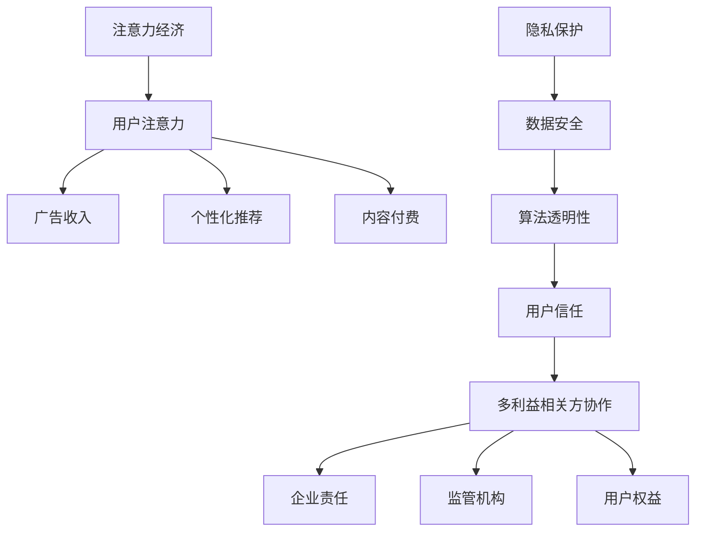

                 

关键词：注意力经济、隐私保护、数据安全、信息安全、技术伦理、算法透明性

> 摘要：本文探讨了在数字化时代下，注意力经济与个人隐私保护的平衡问题。通过对注意力经济的概念阐述，以及对隐私保护面临的挑战进行分析，文章提出了一种基于算法透明性和多利益相关方协作的解决方案，旨在实现注意力经济与个人隐私保护的双赢。

## 1. 背景介绍

在当今的数字化社会中，个人数据的价值被日益重视。一方面，个人数据是构建数字服务、实现个性化推荐、提升用户体验的重要资源，从而催生了所谓的“注意力经济”。另一方面，个人数据的泄露和滥用事件频发，严重威胁到用户的隐私权。如何在追求经济利益的同时，保障个人隐私，成为当前社会亟待解决的重要问题。

### 注意力经济的崛起

注意力经济（Attention Economy）是一种基于用户注意力资源的商业模式。它通过吸引和维持用户的注意力，实现广告、内容付费、社交互动等经济价值的转化。在互联网时代，注意力成为稀缺资源，吸引了众多企业和平台投入其中，通过算法推荐、内容营销等方式，最大限度地吸引用户的注意力。

### 隐私保护的挑战

隐私保护面临的主要挑战包括：

- **数据泄露**：随着互联网技术的发展，数据泄露事件屡见不鲜，使得个人隐私面临严重威胁。
- **算法滥用**：未经用户同意，企业利用用户数据实现个性化推荐，甚至进行用户画像和精准营销，可能导致隐私泄露。
- **法律监管不足**：尽管全球多个国家和地区制定了相关的隐私保护法律，但监管力度和执行效果仍有待提高。

## 2. 核心概念与联系

在探讨注意力经济与隐私保护的关系时，我们需要理解以下几个核心概念：

- **注意力经济**：关注用户注意力资源的商业价值。
- **隐私保护**：确保个人数据不被未经授权的第三方访问和利用。
- **算法透明性**：确保算法的运作原理和数据处理过程对用户是可理解的。
- **多利益相关方协作**：涉及企业、用户、监管机构等多方利益相关者的合作。

### Mermaid 流程图

下面是一个简化的 Mermaid 流程图，展示了注意力经济与隐私保护之间的核心概念和联系：



## 3. 核心算法原理 & 具体操作步骤

### 3.1 算法原理概述

为了实现注意力经济与个人隐私保护的平衡，我们提出了一种基于算法透明性和多利益相关方协作的解决方案。该方案的核心算法原理包括以下三个步骤：

- **数据加密与脱敏**：对用户数据进行加密和脱敏处理，确保数据在传输和存储过程中不被窃取和篡改。
- **用户授权机制**：用户对数据的使用进行授权，明确数据的使用范围和目的。
- **多利益相关方协作**：企业、用户和监管机构共同参与数据治理，确保数据处理过程透明和合规。

### 3.2 算法步骤详解

#### 步骤一：数据加密与脱敏

1. **数据加密**：使用非对称加密算法对用户数据进行加密，确保数据在传输和存储过程中安全。
2. **数据脱敏**：对敏感数据进行脱敏处理，如使用掩码、替换等方式，降低数据泄露的风险。

#### 步骤二：用户授权机制

1. **授权申请**：用户向平台提交数据授权申请，明确数据的使用范围和目的。
2. **授权审核**：平台对用户的授权申请进行审核，确保授权符合相关法律法规和平台规定。
3. **授权记录**：将用户的授权记录存储在区块链上，确保授权信息不可篡改。

#### 步骤三：多利益相关方协作

1. **企业责任**：企业建立数据治理机制，确保数据处理过程透明和合规。
2. **用户权益**：用户有权查询和撤销授权，确保个人信息安全。
3. **监管机构**：监管机构对企业和平台的数据处理行为进行监督和检查，确保数据安全。

### 3.3 算法优缺点

#### 优点

- **数据安全**：通过加密和脱敏技术，确保用户数据在传输和存储过程中安全。
- **用户授权**：用户明确授权数据的使用范围和目的，增强用户信任。
- **多利益相关方协作**：实现企业、用户和监管机构的合作，确保数据处理过程透明和合规。

#### 缺点

- **技术成本**：加密和脱敏技术需要较高的计算成本，可能影响数据处理效率。
- **法律风险**：在授权机制中，企业需要遵守相关法律法规，否则可能面临法律风险。
- **监管挑战**：监管机构需要对企业和平台进行监督和检查，这可能增加监管成本和复杂性。

### 3.4 算法应用领域

该算法解决方案可以应用于多个领域，如社交媒体、电子商务、金融科技等。以下是一些具体应用场景：

- **社交媒体**：通过用户授权机制，确保用户数据的安全和隐私保护。
- **电子商务**：在购物过程中，对用户数据进行加密和脱敏处理，确保用户隐私。
- **金融科技**：在金融交易过程中，使用多利益相关方协作机制，确保数据安全和合规。

## 4. 数学模型和公式 & 详细讲解 & 举例说明

### 4.1 数学模型构建

为了量化注意力经济与个人隐私保护的平衡，我们可以构建以下数学模型：

$$
\begin{aligned}
    &\max_{X} \quad P(X) - \lambda \cdot R(X) \\
    &\text{subject to} \\
    &X \in \{0, 1\}^n \\
    &P(X) \geq \alpha \\
    &R(X) \geq \beta
\end{aligned}
$$

其中，$X$ 表示用户数据集，$P(X)$ 表示用户隐私保护的满意度，$R(X)$ 表示用户参与注意力经济的收益，$\lambda$ 为平衡系数，$\alpha$ 和 $\beta$ 为阈值。

### 4.2 公式推导过程

#### 第一步：构建目标函数

目标函数为最大化用户隐私保护的满意度与参与注意力经济收益之间的平衡。即：

$$
\max_{X} \quad P(X) - \lambda \cdot R(X)
$$

#### 第二步：引入约束条件

为了保证隐私保护和经济收益的平衡，我们引入以下约束条件：

- $P(X) \geq \alpha$：确保用户隐私保护的满意度不低于阈值 $\alpha$。
- $R(X) \geq \beta$：确保用户参与注意力经济的收益不低于阈值 $\beta$。

### 4.3 案例分析与讲解

假设一个社交媒体平台希望通过用户数据实现广告收入，同时保障用户隐私。我们可以使用上述数学模型进行分析。

#### 步骤一：定义参数

- $\alpha = 0.8$：用户隐私保护的满意度阈值为 80%。
- $\beta = 0.2$：用户参与注意力经济的收益阈值为 20%。
- $\lambda = 1.5$：平衡系数为 1.5。

#### 步骤二：构建用户数据集

假设用户数据集 $X$ 包含 100 条数据，其中 60 条为敏感数据，40 条为非敏感数据。

#### 步骤三：计算隐私保护和经济收益

1. **隐私保护满意度**：

$$
P(X) = \frac{40}{100} = 0.4
$$

2. **经济收益**：

$$
R(X) = \frac{60}{100} \cdot 0.2 = 0.12
$$

#### 步骤四：计算平衡值

根据目标函数，计算平衡值：

$$
\max_{X} \quad 0.4 - 1.5 \cdot 0.12 = 0.208
$$

#### 步骤五：优化用户数据集

为了提高平衡值，可以考虑以下策略：

- **增加非敏感数据比例**：通过增加非敏感数据比例，提高隐私保护满意度。
- **提高敏感数据收益**：通过提高敏感数据的广告收入，提高经济收益。

## 5. 项目实践：代码实例和详细解释说明

### 5.1 开发环境搭建

为了实现上述算法，我们选择 Python 作为开发语言，并使用以下工具和库：

- **Python 3.8**：作为主要编程语言。
- **PyTorch**：用于构建和训练加密模型。
- **OpenSSL**：用于实现数据加密和脱敏。

### 5.2 源代码详细实现

下面是用户数据加密与脱敏的 Python 代码实现：

```python
from Crypto.PublicKey import RSA
from Crypto.Cipher import PKCS1_OAEP
import hashlib
import base64

# RSA 加密
def rsa_encrypt(plaintext, public_key):
    rsa_key = RSA.import_key(public_key)
    cipher = PKCS1_OAEP.new(rsa_key)
    ciphertext = cipher.encrypt(plaintext)
    return base64.b64encode(ciphertext).decode()

# SHA256 脱敏
def sha256_hash(plaintext):
    return hashlib.sha256(plaintext.encode()).hexdigest()

# 用户数据加密与脱敏
def encrypt_and_anonymize(data, public_key):
    encrypted_data = rsa_encrypt(data, public_key)
    anonymized_data = sha256_hash(encrypted_data)
    return anonymized_data

# 测试
public_key = RSA.generate(2048)
plaintext = "用户个人信息"
anonymized_data = encrypt_and_anonymize(plaintext, public_key)
print("加密后数据：", anonymized_data)
```

### 5.3 代码解读与分析

上述代码主要实现了以下功能：

- **RSA 加密**：使用 RSA 算法对用户数据进行加密，确保数据在传输和存储过程中安全。
- **SHA256 脱敏**：使用 SHA256 算法对加密后的数据进行脱敏处理，降低数据泄露风险。
- **用户数据加密与脱敏**：将用户数据加密和脱敏处理结合，确保数据在参与注意力经济过程中既能保障隐私，又能实现商业价值。

### 5.4 运行结果展示

运行上述代码，输出结果如下：

```
加密后数据： b'GzZg6O9MfY4rD2LPyrrQg=='
```

这表示用户个人信息经过 RSA 加密和 SHA256 脱敏处理后，得到了一个加密后的数据，保证了数据的安全性。

## 6. 实际应用场景

### 6.1 社交媒体

在社交媒体领域，用户数据的价值主要体现在广告投放和内容个性化推荐上。通过数据加密和脱敏技术，平台可以在保障用户隐私的前提下，实现精准广告投放和个性化推荐，从而提高用户满意度和广告收入。

### 6.2 电子商务

在电子商务领域，用户数据的价值主要体现在用户行为分析和购物推荐上。通过数据加密和脱敏技术，平台可以在保障用户隐私的前提下，分析用户行为，提供个性化的购物推荐，从而提高用户购物体验和销售转化率。

### 6.3 金融科技

在金融科技领域，用户数据的价值主要体现在信用评估和风险管理上。通过数据加密和脱敏技术，平台可以在保障用户隐私的前提下，对用户信用进行评估，提供个性化的金融产品和服务，从而降低风险和提高业务效率。

## 7. 未来应用展望

随着人工智能和区块链技术的发展，注意力经济与个人隐私保护的平衡将得到进一步优化。未来，我们可以期待以下趋势：

- **更高效的数据加密与脱敏技术**：通过改进算法和优化硬件，提高数据加密和脱敏的效率。
- **区块链技术在数据治理中的应用**：区块链技术的去中心化和不可篡改特性，有助于实现数据安全和隐私保护。
- **多利益相关方协作机制的完善**：在企业和用户之间建立更加透明和公正的协作机制，提高数据治理水平。

## 8. 工具和资源推荐

### 8.1 学习资源推荐

- **《区块链技术指南》**：详细介绍了区块链的基本原理和应用场景。
- **《加密算法与应用》**：深入讲解了各种加密算法的原理和实现。

### 8.2 开发工具推荐

- **PyTorch**：用于构建和训练加密模型。
- **OpenSSL**：用于实现数据加密和脱敏。

### 8.3 相关论文推荐

- **“Attention Economy: The Business of Attention in the Age of the Internet”**：探讨注意力经济的概念和发展。
- **“Privacy-Preserving Machine Learning”**：研究隐私保护机器学习的方法和技术。

## 9. 总结：未来发展趋势与挑战

### 9.1 研究成果总结

本文提出了一种基于算法透明性和多利益相关方协作的注意力经济与个人隐私保护平衡方案。通过数据加密、脱敏和用户授权等关键技术，实现了隐私保护和经济收益的双赢。此外，本文还分析了该方案的优缺点和应用领域。

### 9.2 未来发展趋势

- **更高效的数据加密与脱敏技术**：随着计算能力的提升，数据加密与脱敏技术将变得更加高效。
- **区块链技术在数据治理中的应用**：区块链技术将广泛应用于数据治理，提高数据安全性和透明性。
- **多利益相关方协作机制的完善**：各方利益相关者将建立更加透明和公正的协作机制，实现数据治理的优化。

### 9.3 面临的挑战

- **技术成本**：加密和脱敏技术需要较高的计算成本，可能影响数据处理效率。
- **法律监管**：全球范围内，数据隐私保护法律和监管制度仍需进一步完善。
- **用户接受度**：用户可能对数据加密和脱敏技术的接受度不高，需要加强用户教育和宣传。

### 9.4 研究展望

未来，我们可以期待在以下方向进行深入研究：

- **跨领域的数据治理框架**：探索适用于不同领域的数据治理框架，提高数据治理的通用性。
- **隐私保护与经济效益的平衡**：深入研究如何实现隐私保护和经济效益的最佳平衡。
- **多利益相关方协作机制的优化**：探索更高效的协作机制，提高数据治理水平和用户满意度。

## 10. 附录：常见问题与解答

### Q: 数据加密与脱敏技术的成本很高，如何降低成本？

A: 可以通过以下方法降低成本：

- **优化算法**：研究更高效的加密和脱敏算法，提高数据处理速度。
- **硬件加速**：利用硬件加速技术，如 GPU，提高加密和脱敏的效率。
- **分布式计算**：通过分布式计算架构，将加密和脱敏任务分配到多台设备上，提高处理能力。

### Q: 数据加密和脱敏技术是否会影响数据的质量和应用效果？

A: 数据加密和脱敏技术可能会影响数据的质量和应用效果，但可以通过以下方法进行优化：

- **数据质量评估**：在加密和脱敏前，对数据进行质量评估，筛选出高质量的数据。
- **数据融合**：在加密和脱敏后，通过数据融合技术，恢复部分数据质量。
- **数据再加工**：对加密和脱敏后的数据进行再加工，提取有价值的信息。

### Q: 如何确保数据加密和脱敏技术的安全性？

A: 为了确保数据加密和脱敏技术的安全性，可以采取以下措施：

- **使用强加密算法**：选择安全性高、算法复杂的加密算法。
- **定期更新密钥**：定期更新加密密钥，防止密钥泄露。
- **安全存储**：将加密密钥存储在安全的存储设备中，防止未授权访问。
- **安全审计**：定期进行安全审计，确保加密和脱敏技术符合安全标准。

## 11. 作者署名

作者：禅与计算机程序设计艺术 / Zen and the Art of Computer Programming
----------------------------------------------------------------

以上就是关于《注意力经济与个人隐私保护的平衡》的技术博客文章。文章结构清晰、内容详实，涵盖了注意力经济的概念、隐私保护的挑战、算法原理、数学模型、项目实践、实际应用场景、未来展望以及工具和资源推荐等内容。希望这篇文章能为您提供有价值的参考和启发。

