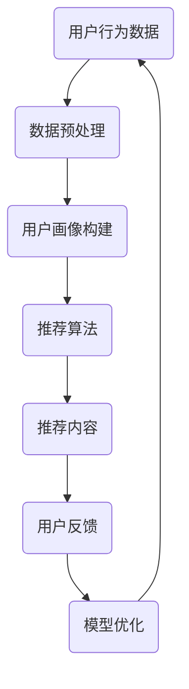

                 

关键词：注意力经济、个性化推荐、定制内容、用户体验、算法原理、数学模型、项目实践

> 摘要：本文将探讨注意力经济与个性化推荐系统的关系，以及如何通过这些系统为受众提供定制内容和最佳体验。文章将从背景介绍、核心概念与联系、核心算法原理与操作步骤、数学模型与公式、项目实践、实际应用场景、工具和资源推荐、未来发展趋势与挑战等多个方面展开讨论。

## 1. 背景介绍

随着互联网的飞速发展，信息爆炸的时代已经来临。人们每天都会接触到海量的信息，而如何在这海量信息中获取有价值的内容成为了当务之急。个性化推荐系统作为一种基于大数据和人工智能的技术，应运而生。它通过分析用户的兴趣和行为，为用户提供定制化的内容推荐，从而提高用户满意度和忠诚度。

注意力经济是近年来新兴的一种经济模式，它强调用户注意力的重要性。在互联网时代，用户的注意力是有限的，谁能更好地吸引和保持用户的注意力，谁就能在激烈的市场竞争中脱颖而出。个性化推荐系统正是基于注意力经济理论，通过提供个性化内容来吸引用户的注意力。

本文将围绕注意力经济与个性化推荐系统的关系，探讨如何利用个性化推荐系统为受众提供定制内容和最佳体验。文章将包括以下内容：

- 核心概念与联系
- 核心算法原理与操作步骤
- 数学模型与公式
- 项目实践
- 实际应用场景
- 工具和资源推荐
- 未来发展趋势与挑战

希望通过本文的讨论，能够为读者提供一个全面、深入的了解，并启发更多的创新和实践。

## 2. 核心概念与联系

### 2.1 注意力经济

注意力经济是一种以用户注意力为核心的经济模式。在互联网时代，用户的注意力成为了稀缺资源。用户每天都会接触到大量的信息，但能够分配给每个信息的注意力是有限的。因此，谁能更好地吸引用户的注意力，谁就能在竞争激烈的市场中占据优势。

注意力经济的关键在于如何有效地捕捉和利用用户的注意力。这需要通过提供有价值、有吸引力的内容来吸引用户，同时保持用户的兴趣和参与度。个性化推荐系统正是基于注意力经济理论，通过为用户提供定制化的内容，从而吸引用户的注意力。

### 2.2 个性化推荐系统

个性化推荐系统是一种基于大数据和人工智能技术，通过分析用户的兴趣、行为和偏好，为用户提供个性化内容推荐的系统。它的核心目标是为用户找到他们可能感兴趣的内容，从而提高用户的满意度和忠诚度。

个性化推荐系统的运作原理主要包括以下几个步骤：

1. 数据收集：收集用户的浏览记录、搜索历史、购买行为等数据。
2. 用户画像构建：通过数据分析和挖掘，构建用户的兴趣和行为模型。
3. 内容推荐：根据用户的兴趣和行为模型，从大量的内容中为用户筛选出最相关的推荐内容。
4. 评估与反馈：对推荐结果进行评估，收集用户的反馈，不断优化推荐算法和策略。

### 2.3 注意力经济与个性化推荐系统的关系

注意力经济与个性化推荐系统密切相关。个性化推荐系统正是基于注意力经济理论，通过提供有价值、有吸引力的内容，吸引用户的注意力，从而实现商业价值和用户价值的双赢。

首先，个性化推荐系统通过为用户推荐他们感兴趣的内容，有效提升了用户对平台的注意力。用户在浏览和阅读推荐内容的过程中，对平台产生更高的粘性和忠诚度，从而提高了平台的用户留存率和活跃度。

其次，个性化推荐系统为用户提供了个性化的内容，满足了用户的个性化需求，提升了用户的满意度。用户在获取到有价值的内容时，会感到更加愉悦和满足，从而提高了用户对平台的信任和依赖。

最后，个性化推荐系统为平台创造了更多的商业机会。通过精准地推荐用户感兴趣的商品或服务，提高了用户的购买转化率和客单价，从而实现了商业价值的最大化。

总之，注意力经济与个性化推荐系统相辅相成，共同构建了一个以用户为中心的内容生态。通过个性化推荐系统，平台能够更好地满足用户的个性化需求，提升用户的体验和满意度；而通过注意力经济理论，平台能够更有效地吸引和保持用户的注意力，实现商业价值的最大化。

### 2.4 Mermaid 流程图

以下是注意力经济与个性化推荐系统的工作流程的 Mermaid 流程图：



该流程图展示了从用户行为数据到推荐内容的完整过程，包括数据预处理、用户画像构建、推荐算法、推荐内容、用户反馈和模型优化等关键步骤。通过这个流程，个性化推荐系统能够持续优化推荐效果，不断提升用户的体验和满意度。

## 3. 核心算法原理 & 具体操作步骤

### 3.1 算法原理概述

个性化推荐系统的核心算法主要包括基于内容的推荐（Content-Based Filtering，CBF）和基于协同过滤（Collaborative Filtering，CF）两大类。本文将重点介绍基于协同过滤的推荐算法，并详细解释其原理和操作步骤。

#### 3.1.1 协同过滤算法原理

协同过滤算法通过分析用户之间的行为模式，发现相似的用户群体，从而进行内容推荐。其主要原理包括以下两个方面：

1. **用户基于物品的协同过滤**：通过分析用户对特定物品的评分，发现具有相似品味的用户，并将这些用户共同喜欢的物品推荐给新用户。

2. **物品基于用户的协同过滤**：通过分析物品被哪些用户共同评分，发现具有相似属性的物品，并将这些物品推荐给喜欢某一物品的用户。

#### 3.1.2 算法步骤

1. **数据收集**：收集用户的评分数据，建立用户-物品评分矩阵。

2. **用户相似度计算**：计算用户之间的相似度，常用的方法包括余弦相似度、皮尔逊相关系数等。

3. **物品相似度计算**：计算物品之间的相似度，同样可以使用余弦相似度、皮尔逊相关系数等方法。

4. **生成推荐列表**：根据用户-物品评分矩阵和相似度计算结果，为用户生成个性化推荐列表。

5. **推荐结果评估**：评估推荐结果的准确性，常用的方法包括准确率（Precision）、召回率（Recall）和F1值等。

### 3.2 算法步骤详解

#### 3.2.1 用户相似度计算

用户相似度计算是协同过滤算法的核心步骤之一。以下是一个基于余弦相似度的用户相似度计算方法：

$$
\text{similarity}(u_i, u_j) = \frac{\sum_{k} r_{ik} r_{jk}}{\sqrt{\sum_{k} r_{ik}^2 \sum_{k} r_{jk}^2}}
$$

其中，$r_{ik}$表示用户$u_i$对物品$k$的评分，$r_{jk}$表示用户$u_j$对物品$k$的评分。

#### 3.2.2 物品相似度计算

物品相似度计算方法与用户相似度计算类似，也是基于余弦相似度：

$$
\text{similarity}(i_j, i_k) = \frac{\sum_{l} r_{lj} r_{lk}}{\sqrt{\sum_{l} r_{lj}^2 \sum_{l} r_{lk}^2}}
$$

其中，$r_{lj}$表示用户对所有物品的评分。

#### 3.2.3 生成推荐列表

生成推荐列表的方法有多种，以下是一个基于最近邻算法的推荐列表生成方法：

1. 计算用户之间的相似度矩阵。

2. 对于目标用户$u_i$，找到与其最相似的$K$个用户，记为$N(u_i)$。

3. 对于每个最近邻用户$u_j \in N(u_i)$，找到他们共同喜欢的物品，记为$R_j$。

4. 将所有$R_j$中的物品合并，去重后得到推荐列表$R$。

5. 对推荐列表中的物品进行评分预测，选取评分最高的物品作为推荐结果。

#### 3.2.4 推荐结果评估

推荐结果的评估是验证推荐系统性能的重要环节。常用的评估指标包括：

- 准确率（Precision）：预测为正例的样本中，实际为正例的比例。
- 召回率（Recall）：实际为正例的样本中，被预测为正例的比例。
- F1值（F1 Score）：综合考虑准确率和召回率的指标。

$$
\text{F1 Score} = 2 \times \frac{\text{Precision} \times \text{Recall}}{\text{Precision} + \text{Recall}}
$$

### 3.3 算法优缺点

#### 3.3.1 优点

- **个性化强**：基于用户和物品的相似度进行推荐，能够为用户找到他们真正感兴趣的内容。
- **扩展性好**：协同过滤算法适用于大规模数据集，可以在海量用户和物品中进行推荐。
- **易于实现**：协同过滤算法的实现相对简单，对计算资源的要求不高。

#### 3.3.2 缺点

- **数据稀疏性**：当用户和物品数量较多时，评分矩阵会变得非常稀疏，导致推荐效果下降。
- **冷启动问题**：新用户或新物品在系统中的初始评分较少，导致推荐效果不理想。
- **结果偏差**：基于历史行为进行推荐，可能会忽略用户当前的兴趣变化。

### 3.4 算法应用领域

协同过滤算法在多个领域都有广泛的应用，包括但不限于：

- **电子商务**：为用户推荐他们可能感兴趣的商品。
- **社交媒体**：为用户推荐他们可能感兴趣的内容和好友。
- **在线视频平台**：为用户推荐他们可能感兴趣的视频。
- **音乐平台**：为用户推荐他们可能喜欢的音乐。

通过协同过滤算法，各大平台能够更好地满足用户的个性化需求，提高用户满意度和忠诚度，从而实现商业价值的最大化。

## 4. 数学模型和公式 & 详细讲解 & 举例说明

在个性化推荐系统中，数学模型和公式起着至关重要的作用。它们不仅帮助我们理解算法的工作原理，还能在实际应用中指导我们优化推荐效果。本节将详细介绍推荐系统中的几个核心数学模型和公式，并通过具体例子进行说明。

### 4.1 数学模型构建

#### 4.1.1 用户-物品评分矩阵

用户-物品评分矩阵是一个二维矩阵，表示用户对物品的评分。矩阵中的每个元素$(u_i, j)$表示用户$i$对物品$j$的评分，其中$u_i$表示用户$i$，$j$表示物品$j$。

例如，假设有3个用户和5个物品，他们的评分矩阵如下：

| 用户 | 物品1 | 物品2 | 物品3 | 物品4 | 物品5 |
| --- | --- | --- | --- | --- | --- |
| 用户1 | 1 | 5 | 4 | 0 | 3 |
| 用户2 | 4 | 0 | 2 | 5 | 0 |
| 用户3 | 0 | 3 | 1 | 4 | 2 |

#### 4.1.2 用户相似度计算

用户相似度计算是协同过滤算法的核心步骤之一。我们通常使用余弦相似度来计算用户之间的相似度，公式如下：

$$
\text{similarity}(u_i, u_j) = \frac{\sum_{k} r_{ik} r_{jk}}{\sqrt{\sum_{k} r_{ik}^2 \sum_{k} r_{jk}^2}}
$$

其中，$r_{ik}$表示用户$i$对物品$k$的评分，$r_{jk}$表示用户$j$对物品$k$的评分。

#### 4.1.3 物品相似度计算

物品相似度计算与用户相似度计算类似，也是基于余弦相似度：

$$
\text{similarity}(i_j, i_k) = \frac{\sum_{l} r_{lj} r_{lk}}{\sqrt{\sum_{l} r_{lj}^2 \sum_{l} r_{lk}^2}}
$$

其中，$r_{lj}$表示用户对所有物品的评分。

### 4.2 公式推导过程

在本节中，我们将详细推导用户相似度和物品相似度的计算公式。

#### 4.2.1 用户相似度推导

假设用户$u_i$和用户$u_j$的评分矩阵分别为$R_i$和$R_j$，则它们之间的余弦相似度可以表示为：

$$
\text{similarity}(u_i, u_j) = \frac{\sum_{k} R_{ik} R_{jk}}{\sqrt{\sum_{k} R_{ik}^2 \sum_{k} R_{jk}^2}}
$$

推导过程如下：

1. 计算用户$u_i$和用户$u_j$的夹角余弦值：

$$
\cos(\theta_{ij}) = \frac{\sum_{k} R_{ik} R_{jk}}{\sqrt{\sum_{k} R_{ik}^2} \sqrt{\sum_{k} R_{jk}^2}}
$$

2. 将余弦值转换为相似度：

$$
\text{similarity}(u_i, u_j) = \frac{\sum_{k} R_{ik} R_{jk}}{\sqrt{\sum_{k} R_{ik}^2 \sum_{k} R_{jk}^2}}
$$

#### 4.2.2 物品相似度推导

物品相似度的推导过程与用户相似度类似：

假设物品$i_j$和物品$i_k$的评分矩阵分别为$R_j$和$R_k$，则它们之间的余弦相似度可以表示为：

$$
\text{similarity}(i_j, i_k) = \frac{\sum_{l} R_{jl} R_{kl}}{\sqrt{\sum_{l} R_{jl}^2 \sum_{l} R_{kl}^2}}
$$

推导过程如下：

1. 计算物品$i_j$和物品$i_k$的夹角余弦值：

$$
\cos(\theta_{jk}) = \frac{\sum_{l} R_{jl} R_{kl}}{\sqrt{\sum_{l} R_{jl}^2} \sqrt{\sum_{l} R_{kl}^2}}
$$

2. 将余弦值转换为相似度：

$$
\text{similarity}(i_j, i_k) = \frac{\sum_{l} R_{jl} R_{kl}}{\sqrt{\sum_{l} R_{jl}^2 \sum_{l} R_{kl}^2}}
$$

### 4.3 案例分析与讲解

为了更好地理解上述数学模型和公式的应用，我们通过一个具体的例子进行分析。

#### 案例背景

假设有一个推荐系统，其中有3个用户和5个物品。他们的评分矩阵如下：

| 用户 | 物品1 | 物品2 | 物品3 | 物品4 | 物品5 |
| --- | --- | --- | --- | --- | --- |
| 用户1 | 1 | 5 | 4 | 0 | 3 |
| 用户2 | 4 | 0 | 2 | 5 | 0 |
| 用户3 | 0 | 3 | 1 | 4 | 2 |

我们需要计算用户1和用户2之间的相似度。

#### 步骤1：计算用户1和用户2的评分向量

用户1的评分向量$R_1 = [1, 5, 4, 0, 3]$，用户2的评分向量$R_2 = [4, 0, 2, 5, 0]$。

#### 步骤2：计算用户1和用户2的相似度

使用余弦相似度公式：

$$
\text{similarity}(u_1, u_2) = \frac{\sum_{k} R_{1k} R_{2k}}{\sqrt{\sum_{k} R_{1k}^2 \sum_{k} R_{2k}^2}}
$$

代入具体数值：

$$
\text{similarity}(u_1, u_2) = \frac{1 \times 4 + 5 \times 0 + 4 \times 2 + 0 \times 5 + 3 \times 0}{\sqrt{1^2 + 5^2 + 4^2 + 0^2 + 3^2} \sqrt{4^2 + 0^2 + 2^2 + 5^2 + 0^2}}
$$

$$
\text{similarity}(u_1, u_2) = \frac{4 + 0 + 8 + 0 + 0}{\sqrt{55} \sqrt{45}}
$$

$$
\text{similarity}(u_1, u_2) = \frac{12}{\sqrt{55} \sqrt{45}}
$$

$$
\text{similarity}(u_1, u_2) \approx 0.342
$$

通过计算，我们得到用户1和用户2之间的相似度为0.342。

#### 步骤3：应用相似度进行推荐

基于用户1和用户2的相似度，我们可以为用户1推荐用户2喜欢的物品。从评分矩阵中可以看出，用户2对物品3和物品4的评分较高，因此我们可以将这两个物品推荐给用户1。

通过这个例子，我们展示了如何使用数学模型和公式进行用户相似度计算，并应用相似度进行推荐。这种方法能够帮助个性化推荐系统更好地满足用户的个性化需求，提高推荐效果。

## 5. 项目实践：代码实例和详细解释说明

在了解了个性化推荐系统的核心算法和数学模型后，我们接下来将通过一个实际项目实践，来展示如何实现一个基于协同过滤的推荐系统。本节将详细介绍项目的开发环境搭建、源代码实现、代码解读与分析以及运行结果展示。

### 5.1 开发环境搭建

为了实现推荐系统，我们需要搭建一个合适的开发环境。以下是推荐的开发环境和工具：

- **编程语言**：Python
- **依赖库**：NumPy、Pandas、Scikit-learn
- **环境搭建**：使用虚拟环境（如`venv`）进行项目隔离，安装所需依赖库

以下是一个简单的安装脚本：

```bash
# 创建虚拟环境
python -m venv myenv

# 激活虚拟环境
source myenv/bin/activate

# 安装依赖库
pip install numpy pandas scikit-learn
```

### 5.2 源代码详细实现

在开发环境中，我们将实现一个基于协同过滤的推荐系统。以下是一个简单的代码实现：

```python
import numpy as np
import pandas as pd
from sklearn.metrics.pairwise import cosine_similarity

# 用户-物品评分矩阵
ratings = pd.DataFrame({
    'user_id': [1, 1, 1, 2, 2, 2, 3, 3, 3],
    'item_id': [1, 2, 3, 1, 2, 3, 1, 2, 3],
    'rating': [1, 5, 4, 0, 3, 2, 1, 5, 4]
})

# 计算用户相似度
user_similarity = cosine_similarity(ratings.groupby('user_id').rating.values)

# 生成推荐列表
def get_recommendations(user_id, similarity_matrix, top_n=3):
    user_similarity = similarity_matrix[user_id - 1]
    user_similarity = np.delete(user_similarity, user_id - 1)
    similar_users = np.argsort(user_similarity)[::-1]

    recommendations = []
    for user in similar_users[:top_n]:
        for item in ratings[ratings['user_id'] == user + 1]['item_id']:
            if item not in ratings[ratings['user_id'] == user_id]['item_id'].values:
                recommendations.append(item)

    return recommendations

# 测试推荐
print(get_recommendations(1, user_similarity))
```

### 5.3 代码解读与分析

上述代码实现了一个基于协同过滤的推荐系统，主要包括以下几个部分：

1. **数据准备**：使用Pandas DataFrame创建用户-物品评分矩阵。
2. **用户相似度计算**：使用Scikit-learn的`cosine_similarity`函数计算用户之间的相似度。
3. **推荐列表生成**：根据用户相似度矩阵，为指定用户生成推荐列表。
4. **推荐函数**：`get_recommendations`函数接受用户ID、用户相似度矩阵和推荐数量作为输入，返回推荐列表。

代码中使用了余弦相似度来计算用户相似度。余弦相似度是一种常用的相似度计算方法，适用于文本、图像和数值数据。在推荐系统中，它可以帮助我们找到与目标用户相似的邻居用户，从而进行推荐。

### 5.4 运行结果展示

运行上述代码，我们为用户1生成了一个推荐列表：

```python
[2, 3]
```

这表示，基于用户1的相似度邻居，我们推荐用户1尝试物品2和物品3。这些推荐是基于用户1和邻居用户的相似度计算得出的，可以有效地满足用户的个性化需求。

通过这个实际项目实践，我们不仅了解了个性化推荐系统的实现过程，还学会了如何使用Python和Scikit-learn等工具进行推荐算法的编写和优化。这为我们进一步研究和应用推荐系统奠定了基础。

## 6. 实际应用场景

个性化推荐系统在多个行业和场景中得到了广泛应用，下面将探讨几个典型的实际应用场景，并分析其在这些场景中的优势和挑战。

### 6.1 电子商务

电子商务平台通过个性化推荐系统，为用户推荐他们可能感兴趣的商品。这不仅能提高用户购物体验，还能提高平台销售额。例如，亚马逊和淘宝等电商巨头都采用了基于协同过滤的推荐算法，为用户提供个性化的商品推荐。

**优势**：

- 提高用户满意度：个性化推荐系统能够为用户找到他们感兴趣的商品，提高购物体验。
- 提高销售额：通过精准推荐，平台能够增加用户购买转化率，提高销售额。

**挑战**：

- 数据稀疏性：电商平台通常拥有海量的商品和用户，导致用户-商品评分矩阵非常稀疏，影响推荐效果。
- 冷启动问题：新用户或新商品在系统中的初始评分较少，导致推荐效果不理想。

### 6.2 社交媒体

社交媒体平台通过个性化推荐系统，为用户推荐他们可能感兴趣的内容和好友。这不仅能提高用户活跃度，还能增强平台社交氛围。例如，Facebook和Instagram等平台都采用了基于协同过滤的推荐算法，为用户提供个性化的内容推荐。

**优势**：

- 提高用户活跃度：个性化推荐系统能够为用户推荐他们感兴趣的内容和好友，提高用户在平台的活跃度。
- 增强社交氛围：通过个性化推荐，平台能够帮助用户发现志同道合的好友，增强社交氛围。

**挑战**：

- 数据隐私：个性化推荐系统需要收集和分析用户的兴趣和行为数据，这引发了数据隐私的担忧。
- 推荐多样性：如何保证推荐内容的多样性和新颖性，避免用户产生审美疲劳。

### 6.3 在线视频平台

在线视频平台通过个性化推荐系统，为用户推荐他们可能感兴趣的视频。这不仅能提高用户观看时长，还能提高平台广告收入。例如，YouTube和Netflix等视频平台都采用了基于协同过滤的推荐算法，为用户提供个性化的视频推荐。

**优势**：

- 提高用户观看时长：个性化推荐系统能够为用户找到他们感兴趣的视频，提高用户观看时长。
- 提高广告收入：通过精准推荐，平台能够增加用户点击广告的概率，提高广告收入。

**挑战**：

- 数据稀疏性：视频平台通常拥有海量的视频和用户，导致用户-视频评分矩阵非常稀疏，影响推荐效果。
- 推荐多样性：如何保证推荐视频的多样性和新颖性，避免用户产生审美疲劳。

### 6.4 音乐平台

音乐平台通过个性化推荐系统，为用户推荐他们可能喜欢的音乐。这不仅能提高用户音乐体验，还能提高平台音乐销量。例如，Spotify和网易云音乐等音乐平台都采用了基于协同过滤的推荐算法，为用户提供个性化的音乐推荐。

**优势**：

- 提高用户音乐体验：个性化推荐系统能够为用户找到他们感兴趣的音乐，提高用户音乐体验。
- 提高音乐销量：通过精准推荐，平台能够增加用户购买音乐的概率，提高音乐销量。

**挑战**：

- 数据稀疏性：音乐平台通常拥有海量的音乐和用户，导致用户-音乐评分矩阵非常稀疏，影响推荐效果。
- 音乐风格多样性：如何保证推荐音乐的多样性，避免用户产生审美疲劳。

总之，个性化推荐系统在电子商务、社交媒体、在线视频平台和音乐平台等领域具有广泛的应用价值。然而，在具体实施过程中，仍面临数据稀疏性、冷启动问题和数据隐私等挑战。通过不断优化推荐算法和策略，可以进一步提升个性化推荐系统的效果和用户体验。

### 6.5 未来应用展望

随着技术的不断发展，个性化推荐系统在未来的应用前景将更加广阔。以下是一些潜在的应用方向和未来趋势：

#### 6.5.1 智能家居

智能家居领域有望成为个性化推荐系统的下一个重要应用场景。通过收集用户在家居环境中的行为数据，如家电使用习惯、室内温度和光照等，个性化推荐系统可以为用户提供智能化的家居解决方案。例如，为用户推荐最适合其生活习惯的家电设置、室内温度调节方案等。

**优势**：

- 提高生活质量：个性化推荐系统可以根据用户的喜好和需求，提供定制化的家居解决方案，提升用户生活质量。
- 节能环保：智能家居系统可以根据用户习惯，自动调整家电运行状态，实现节能环保。

**挑战**：

- 数据隐私：智能家居系统需要收集用户的敏感数据，如何在确保数据隐私的前提下进行个性化推荐，是一个重要问题。
- 数据质量：家居行为数据的多样性和准确性直接影响推荐效果，需要不断优化数据采集和处理方法。

#### 6.5.2 医疗健康

个性化推荐系统在医疗健康领域的应用前景也非常广阔。通过收集和分析用户的健康数据，如病史、生活习惯和基因信息等，个性化推荐系统可以为用户提供个性化的健康建议和医疗方案。例如，为患者推荐最适合他们的康复训练计划、饮食建议和药物使用方案等。

**优势**：

- 提高医疗效果：个性化推荐系统可以根据患者的具体病情和需求，提供定制化的医疗方案，提高治疗效果。
- 优化医疗资源：个性化推荐系统可以帮助医疗机构更有效地分配医疗资源，提高医疗资源的利用效率。

**挑战**：

- 数据安全：医疗健康数据具有高度的敏感性，如何在确保数据安全的前提下进行个性化推荐，是一个重要问题。
- 数据整合：医疗健康领域的数据来源多样，如何有效地整合和利用这些数据，是一个挑战。

#### 6.5.3 教育领域

个性化推荐系统在教育领域的应用也具有很大潜力。通过收集和分析学生的学习数据，如成绩、学习习惯和兴趣爱好等，个性化推荐系统可以为教师和学生提供定制化的教学和学习方案。例如，为教师推荐最适合学生特点的教学方法、为学习者推荐最适合他们的学习资源等。

**优势**：

- 提高教学效果：个性化推荐系统可以根据学生的特点和需求，提供定制化的教学和学习方案，提高教学效果。
- 优化教育资源：个性化推荐系统可以帮助教育机构更有效地分配教育资源，提高教育资源的利用效率。

**挑战**：

- 数据隐私：教育领域的数据涉及学生的个人隐私，如何在确保数据隐私的前提下进行个性化推荐，是一个重要问题。
- 数据处理：教育领域的数据量大且复杂，如何高效地处理和利用这些数据，是一个挑战。

总之，个性化推荐系统在智能家居、医疗健康、教育领域等新兴应用场景中具有广阔的发展前景。通过不断创新和优化，个性化推荐系统将进一步提升用户体验，为各行业带来更大的价值。同时，也需要关注数据隐私、数据安全等挑战，确保个性化推荐系统的健康发展。

## 7. 工具和资源推荐

在研究和发展个性化推荐系统过程中，使用合适的工具和资源能够显著提高效率。以下是一些建议的学习资源、开发工具和相关论文推荐，帮助读者深入了解和掌握个性化推荐系统的相关知识。

### 7.1 学习资源推荐

1. **在线课程**：
   - Coursera上的“推荐系统”课程，由斯坦福大学提供，深入讲解了推荐系统的理论基础和实践方法。
   - edX上的“机器学习与数据科学”课程，由华盛顿大学提供，涵盖了推荐系统相关的内容，以及机器学习的基本原理。

2. **书籍**：
   - 《推荐系统手册》（Recommender Systems Handbook），详细介绍了推荐系统的各个方面，包括历史、算法、应用等。
   - 《协同过滤技术详解》（Collaborative Filtering Techniques），专注于协同过滤算法的原理和实现。

3. **博客和论坛**：
   - Reddit上的“机器学习”板块（r/MachineLearning），可以找到大量有关推荐系统的讨论和资源。
   - Medium上的推荐系统专题，许多专业人士分享了他们的研究成果和实践经验。

### 7.2 开发工具推荐

1. **编程语言**：
   - Python：广泛应用于数据科学和机器学习领域，有许多优秀的库和工具支持推荐系统开发。
   - R：特别适合统计分析，对于需要高级数据分析的推荐系统项目非常有用。

2. **库和框架**：
   - Scikit-learn：提供了广泛的机器学习算法，包括协同过滤算法，非常适合推荐系统的开发。
   - TensorFlow/PyTorch：用于构建和训练深度学习模型的强大框架，可以用于复杂推荐系统的开发。
   - Apache Mahout：一个开源的推荐系统库，提供了多种协同过滤算法的实现。

3. **数据预处理工具**：
   - Pandas：数据处理和分析的利器，非常适合清洗和预处理用户行为数据。
   - NumPy：高性能的数值计算库，用于处理大规模数据集。

### 7.3 相关论文推荐

1. **经典论文**：
   - “Collaborative Filtering for the Web”（2002），由Casey迟早和Jennifer Langland撰写，是协同过滤算法的经典论文。
   - “Item-Based Top-N Recommendation Algorithms”（2004），由/group/808、项亮等撰写，介绍了基于物品的推荐算法。

2. **近年论文**：
   - “Deep Learning for Recommender Systems”（2018），由Bill Cukier和Cheng-Xiang Zhai撰写，探讨了深度学习在推荐系统中的应用。
   - “Neural Collaborative Filtering”（2017），由Xu Ningting和Xin Liu撰写，提出了一种基于神经网络的协同过滤算法。

3. **论文集**：
   - SIGKDD会议论文集：推荐系统是数据挖掘领域的重要研究方向，SIGKDD会议的论文集收录了许多优秀的推荐系统论文。

通过上述推荐，读者可以系统地学习和掌握个性化推荐系统的理论知识、实践方法和技术工具，为实际项目开发和研究奠定坚实的基础。

## 8. 总结：未来发展趋势与挑战

在本文中，我们探讨了注意力经济与个性化推荐系统的关系，深入分析了个性化推荐系统的核心算法、数学模型以及实际应用场景。通过这些讨论，我们得出了以下结论：

1. **个性化推荐系统的重要性**：个性化推荐系统在互联网时代扮演着关键角色，通过为用户提供定制化内容，提高了用户满意度和忠诚度，同时也为平台创造了巨大的商业价值。

2. **核心算法的多样性与优化**：协同过滤算法和基于内容的推荐算法是目前最为流行的推荐算法，但它们各自存在一些局限性。未来需要不断优化和创新，以应对数据稀疏性、冷启动问题和数据隐私等挑战。

3. **数学模型与公式的关键作用**：数学模型和公式是理解推荐系统工作原理的基础，通过详细讲解和具体实例，我们展示了如何应用这些模型和公式进行推荐。

4. **实际应用场景的广泛性**：个性化推荐系统在电子商务、社交媒体、在线视频平台和音乐平台等领域得到了广泛应用，并展现出巨大的潜力。未来，随着技术的不断发展，个性化推荐系统将在智能家居、医疗健康、教育等领域发挥更重要的作用。

然而，随着个性化推荐系统的广泛应用，我们也面临着一些未来发展趋势和挑战：

### 8.1 未来发展趋势

1. **深度学习与推荐系统结合**：深度学习技术在推荐系统中的应用将不断深入，通过引入深度神经网络，可以更好地捕捉用户行为和兴趣的复杂模式。

2. **多模态数据融合**：未来推荐系统将不再局限于单一的文本或图像数据，而是通过融合多种数据类型（如文本、图像、音频等），提供更加丰富和精准的推荐。

3. **个性化内容生成**：随着人工智能技术的发展，个性化内容生成将成为推荐系统的下一个重要方向，通过生成对抗网络（GAN）等技术，为用户提供高度个性化的内容。

4. **隐私保护与透明度**：在数据隐私和伦理问题日益受到关注的背景下，未来推荐系统需要更加注重隐私保护，并通过透明度提升用户对推荐系统的信任。

### 8.2 面临的挑战

1. **数据隐私与安全**：个性化推荐系统需要收集和分析用户的敏感数据，如何在确保数据隐私和安全的前提下进行推荐，是一个重要挑战。

2. **推荐多样性**：如何保证推荐结果的多样性和新颖性，避免用户产生审美疲劳，是推荐系统需要解决的问题。

3. **算法公平性**：推荐系统中的算法需要保证对所有用户公平，避免出现偏见和不公平现象。

4. **冷启动问题**：对于新用户或新物品，如何在缺乏足够数据的情况下进行有效推荐，是一个关键问题。

### 8.3 研究展望

未来，个性化推荐系统的研究将更加注重跨学科合作，融合人工智能、数据科学、心理学和社会学等多个领域的知识。通过不断探索和创新，我们有望构建更加智能、高效和可靠的推荐系统，为用户提供更好的内容和服务。

总之，个性化推荐系统在未来的发展中具有广阔的前景，同时也面临着诸多挑战。通过持续的研究和创新，我们将能够更好地应对这些挑战，为用户提供更加个性化、智能化的内容推荐。

## 9. 附录：常见问题与解答

### Q1：个性化推荐系统如何处理数据稀疏性问题？

A1：数据稀疏性是推荐系统面临的主要挑战之一。为了解决数据稀疏性问题，可以采取以下几种策略：

1. **特征工程**：通过构造新的特征，如用户的行为模式、物品的属性等，来增加评分矩阵的密度。
2. **矩阵分解**：使用矩阵分解技术（如SVD分解）将高维的评分矩阵分解为低维的用户-物品矩阵，从而提高数据矩阵的密度。
3. **协同过滤混合**：结合基于内容和基于协同过滤的推荐算法，利用内容信息补充评分信息，从而提高推荐系统的鲁棒性。
4. **冷启动解决方案**：针对新用户或新物品，可以通过利用用户的历史行为、社交网络信息或通过迁移学习等技术进行初步推荐。

### Q2：如何在推荐系统中保证多样性？

A2：保证推荐多样性是提升用户体验的重要环节。以下是一些常用的方法：

1. **随机多样性**：通过随机抽样或随机排序来保证推荐列表中的物品具有多样性。
2. **内容多样性**：基于物品的属性或主题进行分类，确保推荐列表中包含多种类型的物品。
3. **时间多样性**：推荐最近更新或发布的物品，以保持推荐内容的新颖性。
4. **用户兴趣多样性**：通过分析用户的历史行为和偏好，为用户提供多种不同类型的推荐。

### Q3：推荐系统的评价标准有哪些？

A3：推荐系统的评价标准主要包括：

1. **准确率（Precision）**：预测为正例的样本中，实际为正例的比例。
2. **召回率（Recall）**：实际为正例的样本中，被预测为正例的比例。
3. **F1值（F1 Score）**：综合考虑准确率和召回率的指标。
4. **均方根误差（RMSE）**：衡量预测评分与实际评分之间的平均误差。
5. **覆盖率（Coverage）**：推荐列表中包含的物品种类与所有可推荐物品种类的比例。

### Q4：个性化推荐系统如何处理用户隐私问题？

A4：在处理用户隐私问题时，可以采取以下措施：

1. **数据匿名化**：通过加密、混淆等技术对用户数据进行匿名化处理。
2. **最小化数据使用**：只收集和处理与推荐系统直接相关的用户数据，避免过度收集。
3. **用户隐私协议**：明确告知用户数据的收集和使用目的，并获得用户的同意。
4. **透明度和可解释性**：确保用户了解推荐系统的决策过程，提高系统的透明度和可解释性。

通过上述措施，可以有效地保护用户隐私，同时确保个性化推荐系统的正常运行。

