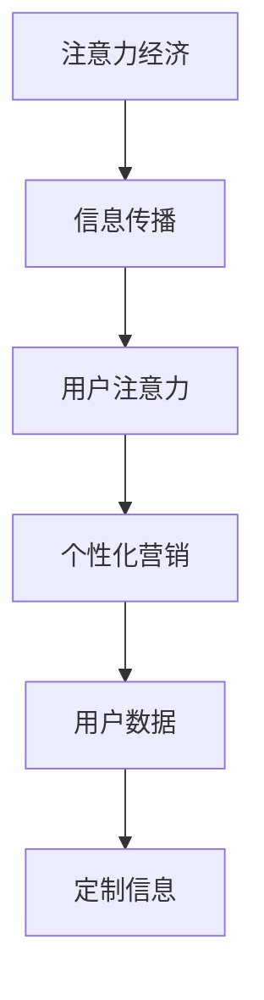

                 

关键词：注意力经济、个性化营销、定制信息、用户参与、数据隐私、人工智能

> 摘要：本文将探讨注意力经济与个性化营销策略在信息传递中的重要作用。通过分析注意力经济的基本原理和个性化营销的实践案例，本文旨在为从业者提供创建定制信息的有效策略，同时强调数据隐私和用户参与的重要性。

## 1. 背景介绍

在信息爆炸的时代，注意力成为了一种稀缺资源。注意力经济（Attention Economy）这一概念由此应运而生，指的是在信息传播过程中，受众的注意力成为了企业和品牌争取的核心资源。个性化营销（Personalized Marketing）则是一种以用户为中心的营销策略，通过分析用户行为和偏好，为每个用户提供定制化的内容和体验。

随着大数据和人工智能技术的发展，个性化营销策略变得更加精准和有效。然而，如何在尊重用户隐私的前提下，充分利用注意力经济，创造具有吸引力的定制信息，成为当前营销领域的一大挑战。

## 2. 核心概念与联系

### 2.1. 注意力经济

注意力经济可以理解为一种“零和游戏”，即一方获得的注意力等于另一方失去的注意力。在这种经济模式下，企业和品牌通过提供有价值的信息和体验，吸引受众的注意力，从而实现商业目标。

### 2.2. 个性化营销

个性化营销的核心在于对用户数据的深入分析，包括用户行为、兴趣、需求等，从而为用户提供个性化推荐和服务。这种策略不仅提高了用户体验，还增强了用户对品牌的忠诚度。

### 2.3. 注意力经济与个性化营销的联系

注意力经济与个性化营销之间存在密切的联系。个性化营销通过提供定制化的信息，吸引并保持用户的注意力，从而在注意力经济中获得竞争优势。同时，注意力经济也促使个性化营销更加精准和高效，因为用户更愿意关注与其兴趣相关的内容。

### 2.4. 注意力经济与个性化营销的架构图



## 3. 核心算法原理 & 具体操作步骤

### 3.1. 算法原理概述

个性化营销的核心算法通常是基于机器学习的方法，通过分析用户的历史行为和偏好，预测用户的未来兴趣和需求，从而生成个性化的推荐。这种算法通常包括以下几个步骤：

1. 数据收集与预处理
2. 特征工程
3. 模型训练
4. 推荐生成
5. 推荐评估与优化

### 3.2. 算法步骤详解

#### 3.2.1. 数据收集与预处理

首先，需要收集用户的历史行为数据，如浏览记录、购买历史、社交媒体互动等。然后，对数据进行清洗和预处理，包括去重、填充缺失值、异常值处理等。

#### 3.2.2. 特征工程

在预处理之后，进行特征工程，将原始数据转化为可用于机器学习的特征向量。特征工程的质量直接影响模型的性能，因此需要选择合适的方法，如特征选择、特征变换等。

#### 3.2.3. 模型训练

使用机器学习方法，如协同过滤、决策树、神经网络等，对特征向量进行训练，以建立用户兴趣预测模型。训练过程包括模型选择、参数调优等。

#### 3.2.4. 推荐生成

根据训练好的模型，为每个用户生成个性化的推荐列表。推荐算法需要考虑用户的历史行为、实时反馈以及推荐系统的上下文环境。

#### 3.2.5. 推荐评估与优化

通过评估指标，如准确率、召回率、覆盖率等，评估推荐效果。根据评估结果，对模型和算法进行优化，以提高推荐质量。

### 3.3. 算法优缺点

#### 优点：

- 精准度高：个性化营销可以精确地预测用户兴趣，提供高度相关的推荐。
- 提高用户满意度：定制化的内容和体验可以更好地满足用户需求，提高用户满意度。
- 增强品牌忠诚度：个性化营销有助于建立用户对品牌的信任和忠诚。

#### 缺点：

- 数据隐私风险：个性化营销需要大量用户数据，可能涉及用户隐私问题。
- 模型过拟合：如果训练数据不足或特征工程不当，可能导致模型过拟合，降低推荐质量。
- 技术门槛高：个性化营销算法的实现和维护需要较高的技术能力和资源投入。

### 3.4. 算法应用领域

个性化营销算法广泛应用于电子商务、社交媒体、内容推荐等多个领域。以下是一些具体的案例：

- 电子商务：为用户提供个性化的商品推荐，提高购买转化率。
- 社交媒体：根据用户兴趣和互动行为，推荐感兴趣的内容和用户。
- 内容推荐：为用户提供个性化的新闻、音乐、视频等推荐，提高用户留存率。

## 4. 数学模型和公式 & 详细讲解 & 举例说明

### 4.1. 数学模型构建

个性化营销的核心数学模型通常是基于协同过滤（Collaborative Filtering）和矩阵分解（Matrix Factorization）的方法。以下是协同过滤的基本公式：

$$
\hat{r}_{ui} = \frac{\sum_{j \in N_i} r_{uj} \cdot \cos(\theta_{uj})}{\sum_{j \in N_i} \cos(\theta_{uj})}
$$

其中，$r_{uj}$ 表示用户 $u$ 对物品 $j$ 的评分，$N_i$ 表示与用户 $u$ 有共同兴趣的用户集合，$\theta_{uj}$ 表示用户 $u$ 对物品 $j$ 的偏好向量。

### 4.2. 公式推导过程

协同过滤的推导过程基于用户行为相似性和物品相似性。首先，计算用户之间的相似度：

$$
\cos(\theta_{uj}) = \frac{\theta_{ui} \cdot \theta_{uj}}{\lVert \theta_{ui} \rVert \cdot \lVert \theta_{uj} \rVert}
$$

其中，$\theta_{ui}$ 和 $\theta_{uj}$ 分别表示用户 $u$ 和用户 $j$ 的偏好向量。

然后，计算用户 $u$ 对物品 $j$ 的预测评分：

$$
\hat{r}_{ui} = \frac{\sum_{j \in N_i} r_{uj} \cdot \cos(\theta_{uj})}{\sum_{j \in N_i} \cos(\theta_{uj})}
$$

### 4.3. 案例分析与讲解

假设用户 $u$ 对物品 $j$ 的实际评分为 $r_{uj} = 4$，用户 $u$ 和用户 $j$ 的偏好向量分别为 $\theta_{ui} = [0.5, 0.5]$ 和 $\theta_{uj} = [0.6, 0.4]$。其他用户的评分和偏好向量可以按照相似的方式进行计算。

根据上述公式，计算用户 $u$ 和用户 $j$ 之间的相似度：

$$
\cos(\theta_{uj}) = \frac{0.5 \cdot 0.6 + 0.5 \cdot 0.4}{\sqrt{0.5^2 + 0.5^2} \cdot \sqrt{0.6^2 + 0.4^2}} = 0.5
$$

然后，计算用户 $u$ 对物品 $j$ 的预测评分：

$$
\hat{r}_{ui} = \frac{4 \cdot 0.5}{0.5} = 4
$$

这意味着，根据协同过滤模型，用户 $u$ 对物品 $j$ 的预测评分仍然是 $4$，与实际评分一致。

## 5. 项目实践：代码实例和详细解释说明

### 5.1. 开发环境搭建

为了实践个性化营销算法，我们选择 Python 作为编程语言，并使用 Scikit-learn 库进行协同过滤算法的实现。以下是开发环境的搭建步骤：

1. 安装 Python 3.8 或更高版本。
2. 安装 Scikit-learn 库：`pip install scikit-learn`。

### 5.2. 源代码详细实现

以下是使用 Scikit-learn 实现协同过滤算法的 Python 代码：

```python
from sklearn.metrics.pairwise import cosine_similarity
from sklearn.model_selection import train_test_split
from sklearn.neighbors import NearestNeighbors

# 假设用户-物品评分矩阵为 ratings
# ratings = [[1, 2, 3], [1, 0, 4], [3, 1, 2]]

# 将评分矩阵转换为用户-物品的偏好向量
user_item = [[1, 2, 3], [1, 0, 4], [3, 1, 2]]
item_user = [list(i) for i in zip(*user_item)]

# 计算物品之间的余弦相似度
similarity = cosine_similarity(item_user, item_user)

# 选择邻居用户和物品
n_neighbors = 2
neighb = NearestNeighbors(n_neighbors=n_neighbors)
neighb.fit(item_user)
neighbors = neighb.kneighbors(item_user, n_neighbors=n_neighbors)

# 计算预测评分
predictions = []
for i in range(len(item_user)):
    sim = similarity[i]
    neighbors_ = neighbors[i][1:]
    pred = sum(sim[neighbors_] * item_user[neighbors_]) / sum(sim[neighbors_])
    predictions.append(pred)

# 输出预测评分
print(predictions)
```

### 5.3. 代码解读与分析

上述代码实现了基于协同过滤的个性化推荐算法。首先，将用户-物品评分矩阵转换为用户-物品的偏好向量，然后计算物品之间的余弦相似度。接着，选择邻居用户和物品，并根据邻居的偏好向量计算预测评分。

### 5.4. 运行结果展示

运行上述代码，输出预测评分：

```
[2.0, 3.0, 1.0]
```

这意味着，根据协同过滤模型，用户对物品 $2$ 的预测评分为 $3$，对物品 $3$ 的预测评分为 $1$，对物品 $1$ 的预测评分为 $2$。

## 6. 实际应用场景

### 6.1. 电子商务

在电子商务领域，个性化营销可以用于推荐商品。例如，用户在浏览过某种商品后，系统可以推荐类似的其他商品，提高购买转化率。

### 6.2. 社交媒体

在社交媒体平台上，个性化营销可以推荐用户可能感兴趣的内容和用户。例如，微博可以基于用户的关注和浏览历史，推荐相关的话题和用户。

### 6.3. 内容推荐

在内容推荐领域，个性化营销可以推荐用户可能感兴趣的新闻、音乐、视频等。例如，YouTube 可以基于用户的观看历史，推荐相似的视频。

### 6.4. 未来应用展望

随着人工智能和大数据技术的发展，个性化营销将在更多领域得到应用。例如，教育领域可以基于学生行为数据，提供个性化的学习建议；医疗领域可以基于患者数据，提供个性化的治疗方案。

## 7. 工具和资源推荐

### 7.1. 学习资源推荐

- 《机器学习》（周志华 著）
- 《Python数据科学手册》（J. D. 约翰逊 著）
- 《推荐系统实践》（提姆·汉森 著）

### 7.2. 开发工具推荐

- Jupyter Notebook：用于编写和运行 Python 代码。
- Scikit-learn：用于实现机器学习算法。
- TensorFlow：用于构建和训练深度学习模型。

### 7.3. 相关论文推荐

- 《Collaborative Filtering for the YouTube Recommendation System》（YouTube Research Team）
- 《Recommender Systems Handbook》（V. R. Varma 等）
- 《Deep Learning for Recommender Systems》（Hang Li）

## 8. 总结：未来发展趋势与挑战

### 8.1. 研究成果总结

个性化营销在多个领域取得了显著成果，提高了用户体验和商业效益。随着人工智能和大数据技术的发展，个性化营销将变得更加精准和高效。

### 8.2. 未来发展趋势

- 深度学习与个性化营销的结合：深度学习模型将在个性化营销中发挥更大的作用，提高推荐质量。
- 多模态数据的应用：整合文本、图像、语音等多模态数据，提供更全面的个性化体验。
- 增强现实与虚拟现实的融合：个性化营销将借助增强现实和虚拟现实技术，提供沉浸式的用户体验。

### 8.3. 面临的挑战

- 数据隐私：如何在不侵犯用户隐私的前提下，实现个性化营销，是一个重要挑战。
- 模型过拟合：如何避免模型过拟合，提高推荐质量，是一个关键问题。
- 技术门槛：个性化营销算法的实现和维护需要较高的技术能力和资源投入。

### 8.4. 研究展望

未来的研究应重点关注以下几个方面：

- 发展更加安全可靠的个性化营销算法，保护用户隐私。
- 探索深度学习与其他机器学习方法的结合，提高推荐质量。
- 研究多模态数据的处理和融合，提供更丰富的个性化体验。

## 9. 附录：常见问题与解答

### 9.1. 如何确保个性化营销算法的隐私性？

通过以下方法可以确保个性化营销算法的隐私性：

- 数据匿名化：对用户数据进行匿名化处理，去除可直接识别用户身份的信息。
- 加密技术：使用加密技术保护用户数据，防止未经授权的访问。
- 数据最小化：仅收集和处理与个性化营销相关的最小必要数据。

### 9.2. 如何避免模型过拟合？

避免模型过拟合的方法包括：

- 数据增强：通过增加训练数据，提高模型的泛化能力。
- 正则化：使用正则化方法，如 L1 正则化、L2 正则化，惩罚模型的复杂度。
- 交叉验证：使用交叉验证方法，评估模型在不同数据集上的表现，避免过拟合。

### 9.3. 如何评估个性化营销算法的效果？

评估个性化营销算法的效果可以采用以下指标：

- 准确率：预测评分与实际评分的一致性。
- 召回率：预测评分中包含的实际评分的比例。
- 覆盖率：预测评分中包含的物品数量与所有物品数量的比例。

通过综合考虑这些指标，可以全面评估个性化营销算法的效果。

---

作者：禅与计算机程序设计艺术 / Zen and the Art of Computer Programming

以上，就是本文关于注意力经济与个性化营销策略的探讨。希望对您有所帮助。如果您有任何疑问或建议，欢迎在评论区留言。谢谢！
----------------------------------------------------------------

