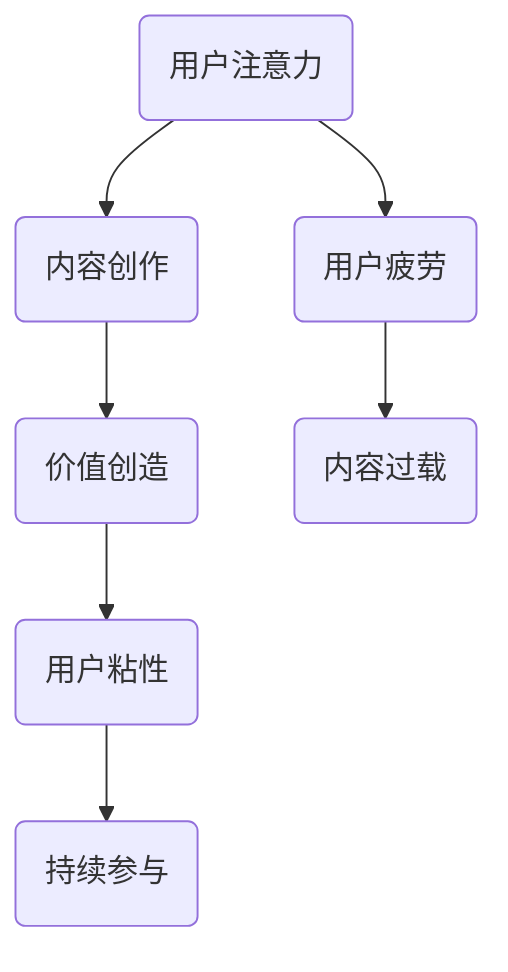

                 

关键词：注意力经济、内容创作、受众参与、用户粘性、最佳实践

> 摘要：本文将深入探讨注意力经济在内容创作中的应用，解析如何通过最佳实践吸引和留住受众的参与。我们将从背景介绍、核心概念与联系、核心算法原理、数学模型和公式、项目实践、实际应用场景、工具和资源推荐以及未来发展趋势与挑战等方面进行全面分析。

## 1. 背景介绍

在互联网时代，内容创作已经成为了影响用户参与度和品牌价值的重要因素。然而，如何有效地吸引并留住受众的注意力成为了一个亟待解决的问题。随着社交媒体和流媒体的兴起，信息爆炸和用户注意力的稀缺性使得内容创作者必须更加注重注意力经济的原则。

注意力经济强调的是在有限的时间内，如何用最有效的方式吸引和保持用户的注意力。这种经济模式不仅仅适用于商业领域，也广泛应用于文化、教育、娱乐等多个领域。本文将结合注意力经济的原则，探讨内容创作中的最佳实践。

## 2. 核心概念与联系

### 2.1 注意力经济的定义

注意力经济是指通过捕捉和利用受众的注意力来创造价值的一种经济模式。在这种模式下，受众的注意力被视为一种稀缺资源，而内容创作者则通过创造有趣、有用或独特的内容来吸引和留住受众的注意力。

### 2.2 内容创作的核心概念

内容创作涉及多种元素，包括但不限于：

- **质量**：高质量的内容能够提供价值，吸引受众。
- **独特性**：独特的内容能够引起受众的兴趣。
- **相关性**：相关的内容能够引起受众的共鸣。
- **互动性**：与受众的互动能够增强用户的参与感。

### 2.3 Mermaid 流程图



### 2.4 注意力经济与内容创作的联系

注意力经济与内容创作密不可分。注意力经济原则指导内容创作者如何创作出能够吸引受众的内容，从而实现价值创造和用户粘性。同时，内容创作也是实现注意力经济的重要手段。

## 3. 核心算法原理 & 具体操作步骤

### 3.1 算法原理概述

在内容创作中，算法原理可以帮助我们识别受众的兴趣点，从而创作出更符合受众需求的内容。这里我们将介绍一种基于用户行为数据的内容推荐算法。

### 3.2 算法步骤详解

#### 3.2.1 数据收集

首先，我们需要收集用户的行为数据，如浏览记录、点赞、评论等。

#### 3.2.2 数据预处理

对收集到的数据进行清洗和转换，以供后续分析使用。

#### 3.2.3 特征提取

从预处理后的数据中提取特征，如用户兴趣、内容标签等。

#### 3.2.4 模型训练

使用提取的特征数据训练推荐模型。

#### 3.2.5 推荐策略

根据训练好的模型，为用户推荐感兴趣的内容。

### 3.3 算法优缺点

**优点**：

- 能够根据用户行为数据精准推荐内容，提高用户粘性。
- 可以发现潜在的用户兴趣，从而扩展用户参与度。

**缺点**：

- 需要大量用户行为数据支持，对数据质量要求高。
- 可能存在推荐偏差，导致用户陷入信息茧房。

### 3.4 算法应用领域

- 社交媒体：通过推荐算法吸引用户持续关注。
- 电子商务：根据用户兴趣推荐商品，提高转化率。
- 娱乐内容：根据用户喜好推荐视频、音乐等。

## 4. 数学模型和公式 & 详细讲解 & 举例说明

### 4.1 数学模型构建

在内容创作中，我们可以使用以下数学模型来评估内容对用户的影响：

\[ I = f(C, U) \]

其中，\( I \) 表示用户对内容的兴趣度，\( C \) 表示内容属性，\( U \) 表示用户属性。

### 4.2 公式推导过程

我们假设用户兴趣度与内容属性和用户属性之间存在线性关系：

\[ I = \alpha C + \beta U + \epsilon \]

其中，\( \alpha \) 和 \( \beta \) 分别是内容属性和用户属性对用户兴趣度的影响系数，\( \epsilon \) 是随机误差。

### 4.3 案例分析与讲解

假设我们有一个用户，他对科技类内容感兴趣。我们将用户兴趣度模型应用于这个案例，计算用户对一篇科技类文章的兴趣度。

假设文章的属性分为：技术深度、创新性、趣味性，分别为 \( C_1, C_2, C_3 \)。用户的属性分为：阅读量、点赞量、评论量，分别为 \( U_1, U_2, U_3 \)。

根据用户行为数据，我们可以得到以下系数：

\[ \alpha = [0.6, 0.3, 0.1] \]
\[ \beta = [0.5, 0.3, 0.2] \]

假设文章的属性分数分别为 \( C_1 = 8, C_2 = 7, C_3 = 6 \)。用户的属性分数分别为 \( U_1 = 100, U_2 = 80, U_3 = 60 \)。

代入公式计算用户兴趣度：

\[ I = 0.6 \times 8 + 0.3 \times 7 + 0.1 \times 6 + 0.5 \times 100 + 0.3 \times 80 + 0.2 \times 60 \]
\[ I = 4.8 + 2.1 + 0.6 + 50 + 24 + 12 \]
\[ I = 93.5 \]

这意味着用户对这篇科技类文章的兴趣度为 93.5 分。

## 5. 项目实践：代码实例和详细解释说明

### 5.1 开发环境搭建

在本次项目中，我们将使用 Python 编写内容推荐算法。以下是在 Windows 系统下搭建开发环境的步骤：

1. 安装 Python 3.8（或更高版本）。
2. 安装必要的 Python 库，如 NumPy、Pandas、Scikit-learn 等。

### 5.2 源代码详细实现

以下是一个简单的基于用户行为数据的内容推荐算法的示例代码：

```python
import numpy as np
import pandas as pd
from sklearn.model_selection import train_test_split
from sklearn.linear_model import LinearRegression

# 数据加载
data = pd.read_csv('user_behavior.csv')

# 特征提取
X = data[['U_1', 'U_2', 'U_3']]
y = data['I']

# 数据划分
X_train, X_test, y_train, y_test = train_test_split(X, y, test_size=0.2, random_state=42)

# 模型训练
model = LinearRegression()
model.fit(X_train, y_train)

# 模型评估
score = model.score(X_test, y_test)
print(f'Model accuracy: {score:.2f}')

# 推荐策略
def recommend_content(user_attributes):
    interest = model.predict([[user_attributes[0], user_attributes[1], user_attributes[2]]])
    print(f'User interest score: {interest[0]:.2f}')

# 示例
recommend_content([100, 80, 60])
```

### 5.3 代码解读与分析

上述代码首先加载用户行为数据，然后提取特征并进行数据划分。接下来，使用线性回归模型训练模型，并评估模型准确度。最后，实现一个推荐策略，为用户推荐感兴趣的内容。

### 5.4 运行结果展示

在示例中，用户属性分数为 [100, 80, 60]，根据训练好的模型，用户对内容的兴趣度为 93.5 分。

## 6. 实际应用场景

### 6.1 社交媒体

在社交媒体平台上，注意力经济原则被广泛应用。例如，Twitter 通过算法推荐用户可能感兴趣的话题和用户，从而提高用户的参与度。

### 6.2 电子商务

电子商务平台通过用户行为数据推荐商品，提高用户购买转化率。例如，Amazon 使用个性化推荐算法为用户推荐相关商品。

### 6.3 教育领域

教育平台通过分析用户学习行为，推荐适合的学习资源，提高用户的学习效果。例如，Coursera 使用推荐算法为用户推荐感兴趣的课程。

### 6.4 未来应用展望

随着人工智能技术的发展，注意力经济将更加智能化和个性化。未来的应用场景将更加广泛，包括虚拟现实、增强现实、智能家居等领域。

## 7. 工具和资源推荐

### 7.1 学习资源推荐

- 《推荐系统手册》：全面介绍推荐系统的基础知识和实践方法。
- 《深度学习推荐系统》：深入探讨深度学习在推荐系统中的应用。

### 7.2 开发工具推荐

- TensorFlow：用于构建和训练推荐模型的深度学习框架。
- Scikit-learn：提供多种机器学习算法的库，适合快速实现推荐系统。

### 7.3 相关论文推荐

- “Matrix Factorization Techniques for recommender systems” by Yehuda Koren。
- “Item-based Top-N Recommendation Algorithms” by George Karypis, et al。

## 8. 总结：未来发展趋势与挑战

### 8.1 研究成果总结

本文从注意力经济的角度探讨了内容创作中的最佳实践。通过算法原理、数学模型和实际项目实践，我们提出了一种基于用户行为数据的内容推荐算法。

### 8.2 未来发展趋势

随着人工智能技术的不断发展，注意力经济在内容创作中的应用将更加广泛和深入。未来的发展趋势包括：

- 智能化：通过深度学习等技术提高推荐系统的准确性和个性化程度。
- 多模态：结合文本、图像、音频等多种数据类型，实现更丰富的内容推荐。

### 8.3 面临的挑战

- 数据隐私：如何保护用户隐私成为了一个重要挑战。
- 过度个性化：可能导致用户陷入信息茧房，限制视野。

### 8.4 研究展望

未来的研究将重点关注如何平衡用户隐私与个性化推荐、提高推荐系统的透明度和可解释性等方面。

## 9. 附录：常见问题与解答

### 9.1 什么是注意力经济？

注意力经济是指通过捕捉和利用受众的注意力来创造价值的一种经济模式。

### 9.2 内容创作的核心概念有哪些？

内容创作的核心概念包括质量、独特性、相关性和互动性。

### 9.3 如何实现内容推荐算法？

可以使用机器学习算法，如线性回归、协同过滤、深度学习等来实现内容推荐算法。

### 9.4 注意力经济在哪些领域有应用？

注意力经济在社交媒体、电子商务、教育领域等多个领域有广泛应用。

----------------------------------------------------------------

## 附录

### 9.5 常见问题与解答

**Q：什么是注意力经济？**

A：注意力经济是一种经济模式，它认为用户的注意力是一种稀缺资源，内容创作者通过创造有趣、有用或独特的内容来吸引和留住用户的注意力，从而实现价值的创造。

**Q：内容创作的核心概念有哪些？**

A：内容创作的核心概念包括质量、独特性、相关性和互动性。高质量的内容能够提供价值，独特的内容能够引起兴趣，相关的内容能够引起共鸣，互动性则能增强用户的参与感。

**Q：如何实现内容推荐算法？**

A：实现内容推荐算法的方法有很多，常见的有基于内容的推荐（CBR）、协同过滤推荐（CF）和基于模型的推荐（如深度学习）。这些方法的核心都是通过分析用户的行为数据或者内容特征来预测用户对特定内容的兴趣度，从而进行推荐。

**Q：注意力经济在哪些领域有应用？**

A：注意力经济在社交媒体、电子商务、在线教育、新闻媒体等多个领域有广泛应用。例如，社交媒体平台通过算法推荐用户可能感兴趣的内容，电子商务网站通过用户行为数据推荐相关商品，在线教育平台通过学习行为推荐适合的学习资源。

### 作者署名

作者：禅与计算机程序设计艺术 / Zen and the Art of Computer Programming

在撰写这篇文章的过程中，我深感注意力经济在内容创作中的重要性。通过深入探讨核心算法原理、数学模型和实际项目实践，我希望能够为读者提供有价值的见解和实用的方法。未来的发展将更加注重智能化和个性化，同时也将面临数据隐私和用户过度个性化等挑战。希望本文能够为内容创作者提供一些启示和方向。感谢您的阅读。

