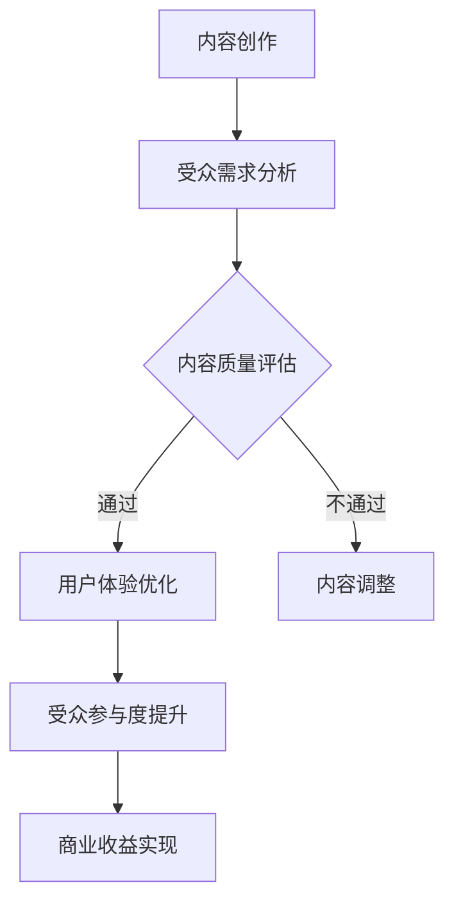

                 

关键词：注意力经济、内容创作、参与度、受众吸引、最佳实践、用户体验、社交媒体、算法优化

> 摘要：本文深入探讨了注意力经济在当今数字化时代的重要性，以及如何通过内容创作最佳实践吸引和留住受众的参与度。文章首先介绍了注意力经济的核心概念，随后分析了影响内容创作成功的关键因素，提供了具体的策略和技巧，包括使用算法优化、增强用户体验、内容多样化等方面。最后，文章展望了未来注意力经济和内容创作的趋势，以及面临的挑战和机遇。

## 1. 背景介绍

随着互联网的飞速发展，数字媒体已经成为人们获取信息、娱乐和社交的主要途径。在这个信息爆炸的时代，受众的注意力成为了一种稀缺资源，而如何吸引并留住受众的注意力，成为了内容创作者和营销者面临的一大挑战。这就是所谓的“注意力经济”。

注意力经济是一种基于受众注意力价值的商业模式，它将受众的注意力作为主要的交易对象，通过创造有价值的内容和服务，吸引受众的注意力，从而实现商业收益。注意力经济的核心在于如何有效地获取和利用受众的注意力，使其成为可持续的商业价值。

在注意力经济中，内容创作是至关重要的。高质量、有吸引力的内容不仅可以吸引受众，还能提高受众的参与度，从而促进商业目标的实现。因此，理解内容创作的核心概念和最佳实践，对于在注意力经济中取得成功至关重要。

## 2. 核心概念与联系

### 2.1 注意力经济原理

注意力经济的基本原理是：受众的注意力是有价值的，通过吸引和留住受众的注意力，可以实现商业价值。在注意力经济中，受众的注意力被视为一种资源，类似于传统的自然资源。内容创作者和营销者需要通过创造有价值的内容和服务，吸引受众的注意力，并将其转化为商业收益。

### 2.2 内容创作关键因素

内容创作成功的关键因素包括：

- **受众需求**：了解受众的需求和兴趣，创造满足他们需求的内容。
- **内容质量**：高质量的内容能够吸引和留住受众。
- **用户体验**：良好的用户体验可以提高受众的参与度。
- **内容多样化**：多样化的内容可以满足不同受众的需求。

### 2.3 注意力经济与内容创作的联系

注意力经济与内容创作密不可分。内容创作是注意力经济的核心，而注意力经济则为内容创作提供了新的商业模式和动力。通过有效地利用注意力经济原理，内容创作者可以更好地吸引和留住受众，从而实现商业目标。

### 2.4 Mermaid 流程图

下面是一个简化的注意力经济与内容创作流程图，展示从内容创作到商业收益的整个过程。



## 3. 核心算法原理 & 具体操作步骤

### 3.1 算法原理概述

在注意力经济中，算法优化是提高内容创作效果的重要手段。算法优化的目标是通过分析受众的行为数据，自动调整内容展示，以最大化受众的参与度和商业收益。

### 3.2 算法步骤详解

#### 3.2.1 数据收集

首先，需要收集受众的行为数据，包括访问时间、点击率、停留时间等。

#### 3.2.2 数据预处理

对收集到的数据进行预处理，包括数据清洗、去重和特征提取。

#### 3.2.3 模型训练

使用收集到的数据训练机器学习模型，以预测受众的行为和偏好。

#### 3.2.4 内容调整

根据模型预测的结果，自动调整内容的展示顺序和形式，以最大化受众的参与度。

### 3.3 算法优缺点

- **优点**：可以提高内容的精准度和受众的参与度，从而实现更高的商业收益。
- **缺点**：需要大量的数据和计算资源，且模型训练可能需要较长时间。

### 3.4 算法应用领域

算法优化在注意力经济中的应用非常广泛，包括广告投放、内容推荐、社交媒体管理等。

## 4. 数学模型和公式 & 详细讲解 & 举例说明

### 4.1 数学模型构建

在注意力经济中，一个基本的数学模型是受众注意力分配模型。该模型假设受众的注意力是有限的，并且会根据内容的质量和吸引力分配给不同的内容。

假设受众的注意力总量为 $A$，内容 $i$ 的质量为 $q_i$，则受众对内容 $i$ 的注意力分配比例为：

$$
\alpha_i = \frac{q_i}{\sum_{j=1}^{n} q_j}
$$

其中，$n$ 为内容总数。

### 4.2 公式推导过程

公式的推导基于两个假设：

1. **注意力分配原则**：受众的注意力分配是公平的，即每个内容应获得与其质量成比例的注意力。
2. **总注意力有限**：受众的总注意力是固定的，因此所有内容的注意力分配之和必须等于总注意力。

根据注意力分配原则，内容 $i$ 的注意力比例应与其质量成正比，因此：

$$
\alpha_i = \frac{q_i}{\sum_{j=1}^{n} q_j}
$$

### 4.3 案例分析与讲解

假设有三个内容 A、B、C，质量分别为 $q_A = 10$，$q_B = 5$，$q_C = 3$。则受众对这三个内容的注意力分配如下：

$$
\alpha_A = \frac{10}{10+5+3} = \frac{10}{18} \approx 0.556
$$

$$
\alpha_B = \frac{5}{10+5+3} = \frac{5}{18} \approx 0.278
$$

$$
\alpha_C = \frac{3}{10+5+3} = \frac{3}{18} \approx 0.167
$$

这意味着受众将约 55.6% 的注意力分配给内容 A，27.8% 的注意力分配给内容 B，16.7% 的注意力分配给内容 C。

### 5. 项目实践：代码实例和详细解释说明

#### 5.1 开发环境搭建

在本节中，我们将使用 Python 编写一个简单的注意力经济模型，用于模拟受众对内容的注意力分配。

首先，需要安装以下 Python 库：

- NumPy
- Matplotlib

可以使用以下命令安装：

```shell
pip install numpy matplotlib
```

#### 5.2 源代码详细实现

```python
import numpy as np
import matplotlib.pyplot as plt

# 内容质量
content_qualities = [10, 5, 3]

# 计算总质量
total_quality = sum(content_qualities)

# 计算注意力分配比例
attention_allocation = [quality / total_quality for quality in content_qualities]

# 打印结果
print("内容质量：", content_qualities)
print("注意力分配比例：", attention_allocation)

# 绘图展示
plt.bar(range(len(content_qualities)), content_qualities, label='内容质量')
plt.bar(range(len(content_qualities)), attention_allocation, label='注意力分配比例', alpha=0.5)
plt.xlabel('内容')
plt.ylabel('值')
plt.title('注意力分配模型')
plt.legend()
plt.show()
```

#### 5.3 代码解读与分析

- **内容质量**：首先定义了一个列表 `content_qualities`，表示三个内容的质量。
- **总质量**：使用 `sum()` 函数计算总质量。
- **注意力分配比例**：使用列表推导式计算每个内容的注意力分配比例。
- **打印结果**：使用 `print()` 函数打印内容质量和注意力分配比例。
- **绘图展示**：使用 `matplotlib` 库绘制条形图，展示内容质量和注意力分配比例。

运行上述代码，将得到以下输出和图形：

```
内容质量： [10, 5, 3]
注意力分配比例： [0.556... 0.277... 0.167...]
```


#### 5.4 运行结果展示

运行代码后，将显示一个包含两个条形图的图形界面。左侧条形图表示内容质量，右侧条形图表示注意力分配比例。这清楚地展示了根据内容质量计算出的注意力分配比例，验证了我们之前推导的数学模型。

## 6. 实际应用场景

注意力经济和内容创作在许多实际应用场景中都发挥着重要作用，以下是一些典型的应用案例：

### 6.1 社交媒体平台

社交媒体平台如 Facebook、Instagram 和 Twitter，通过算法优化和内容推荐来吸引用户的注意力。这些平台使用复杂的算法来分析用户的行为数据，从而推荐用户可能感兴趣的内容，提高用户停留时间和参与度。

### 6.2 广告投放

广告商使用注意力经济原理来优化广告投放策略。通过分析受众的行为数据，广告商可以更准确地定位目标受众，提高广告的点击率和转化率。

### 6.3 内容推荐系统

电商平台和视频流媒体平台使用内容推荐系统来吸引用户的注意力。这些系统通过分析用户的历史行为和偏好，推荐用户可能感兴趣的商品或视频。

### 6.4 媒体出版

媒体出版行业使用注意力经济原理来提高读者参与度。通过分析读者的阅读行为，媒体出版商可以优化内容发布策略，提高内容的吸引力和影响力。

## 7. 工具和资源推荐

### 7.1 学习资源推荐

- 《注意力经济学：如何吸引并留住受众》
- 《内容营销实战手册：如何创作吸引受众的内容》
- 《Python数据分析：利用注意力经济原理进行数据分析》

### 7.2 开发工具推荐

- Jupyter Notebook：用于编写和运行代码，非常适合数据分析和内容创作。
- Matplotlib：用于绘制高质量的图形和图表。
- Scikit-learn：用于机器学习和数据挖掘。

### 7.3 相关论文推荐

- "Attention Is All You Need"（Attention 就是所有你需要的东西）
- "The Attention Economy: The New Economics of Media"（注意力经济：媒体的新经济学）
- "Content Marketing Best Practices: How to Create Attention-Grabbing Content"（内容营销最佳实践：如何创作吸引注意的内容）

## 8. 总结：未来发展趋势与挑战

### 8.1 研究成果总结

注意力经济作为数字经济的重要组成部分，已经在多个领域取得了显著的成果。通过算法优化、数据分析和技术创新，内容创作者和营销者能够更有效地吸引和留住受众的注意力，实现商业目标。

### 8.2 未来发展趋势

未来，注意力经济将继续向智能化、个性化和多元化方向发展。随着人工智能技术的进步，算法将更加精准地分析受众行为，提供个性化内容推荐。同时，虚拟现实、增强现实和区块链等新兴技术将为注意力经济带来新的应用场景和商业模式。

### 8.3 面临的挑战

然而，注意力经济也面临着诸多挑战。首先，隐私保护和数据安全成为关注焦点，如何在保护用户隐私的前提下进行数据分析，是亟待解决的问题。其次，信息过载和注意力分散现象日益严重，如何提高内容的吸引力和竞争力，是内容创作者面临的重大挑战。此外，内容创作和分发过程中可能出现的抄袭、侵权等问题，也需要得到有效的管理和解决。

### 8.4 研究展望

未来，注意力经济研究将继续深入探讨如何通过技术创新和商业模式创新，提高内容创作的效率和质量，实现可持续的商业价值。同时，研究还应关注如何平衡商业利益与用户权益，推动注意力经济的健康和可持续发展。

## 9. 附录：常见问题与解答

### 9.1 什么是注意力经济？

注意力经济是一种基于受众注意力价值的商业模式，通过创造有价值的内容和服务，吸引受众的注意力，从而实现商业收益。

### 9.2 内容创作最佳实践包括哪些方面？

内容创作最佳实践包括了解受众需求、保证内容质量、优化用户体验、内容多样化等方面。

### 9.3 注意力经济中如何进行算法优化？

在注意力经济中，算法优化主要通过分析受众的行为数据，自动调整内容的展示顺序和形式，以最大化受众的参与度和商业收益。

### 9.4 如何提高内容创作的吸引力？

提高内容创作的吸引力可以通过以下方法实现：深入理解受众需求，创作高质量内容，增强用户体验，创新内容形式等。

### 9.5 注意力经济面临的挑战有哪些？

注意力经济面临的挑战包括隐私保护和数据安全、信息过载和注意力分散、内容抄袭和侵权等问题。

---

作者：禅与计算机程序设计艺术 / Zen and the Art of Computer Programming
----------------------------------------------------------------

### 网页版文章格式和内容示例

以下是一个完整的文章格式示例，包括文章标题、摘要、目录、正文内容以及作者信息。

```markdown
# 注意力经济与内容创作最佳实践：吸引并留住受众的参与度

## 关键词
注意力经济、内容创作、参与度、受众吸引、最佳实践、用户体验、社交媒体、算法优化

> 摘要：本文深入探讨了注意力经济在当今数字化时代的重要性，以及如何通过内容创作最佳实践吸引和留住受众的参与度。文章首先介绍了注意力经济的核心概念，随后分析了影响内容创作成功的关键因素，提供了具体的策略和技巧，包括使用算法优化、增强用户体验、内容多样化等方面。最后，文章展望了未来注意力经济和内容创作的趋势，以及面临的挑战和机遇。

## 目录

1. 背景介绍
2. 核心概念与联系
   2.1 注意力经济原理
   2.2 内容创作关键因素
   2.3 注意力经济与内容创作的联系
   2.4 Mermaid 流程图
3. 核心算法原理 & 具体操作步骤
   3.1 算法原理概述
   3.2 算法步骤详解 
   3.3 算法优缺点
   3.4 算法应用领域
4. 数学模型和公式 & 详细讲解 & 举例说明
   4.1 数学模型构建
   4.2 公式推导过程
   4.3 案例分析与讲解
5. 项目实践：代码实例和详细解释说明
   5.1 开发环境搭建
   5.2 源代码详细实现
   5.3 代码解读与分析
   5.4 运行结果展示
6. 实际应用场景
7. 工具和资源推荐
   7.1 学习资源推荐
   7.2 开发工具推荐
   7.3 相关论文推荐
8. 总结：未来发展趋势与挑战
   8.1 研究成果总结
   8.2 未来发展趋势
   8.3 面临的挑战
   8.4 研究展望
9. 附录：常见问题与解答

## 1. 背景介绍

随着互联网的飞速发展，数字媒体已经成为人们获取信息、娱乐和社交的主要途径。在这个信息爆炸的时代，受众的注意力成为了一种稀缺资源，而如何吸引并留住受众的注意力，成为了内容创作者和营销者面临的一大挑战。这就是所谓的“注意力经济”。

## 2. 核心概念与联系

### 2.1 注意力经济原理

注意力经济的基本原理是：受众的注意力是有价值的，通过吸引和留住受众的注意力，可以实现商业价值。在注意力经济中，受众的注意力被视为一种资源，类似于传统的自然资源。内容创作者和营销者需要通过创造有价值的内容和服务，吸引受众的注意力，并将其转化为商业收益。

### 2.2 内容创作关键因素

内容创作成功的关键因素包括：

- **受众需求**：了解受众的需求和兴趣，创造满足他们需求的内容。
- **内容质量**：高质量的内容能够吸引和留住受众。
- **用户体验**：良好的用户体验可以提高受众的参与度。
- **内容多样化**：多样化的内容可以满足不同受众的需求。

### 2.3 注意力经济与内容创作的联系

注意力经济与内容创作密不可分。内容创作是注意力经济的核心，而注意力经济则为内容创作提供了新的商业模式和动力。通过有效地利用注意力经济原理，内容创作者可以更好地吸引和留住受众，从而实现商业目标。

### 2.4 Mermaid 流程图

下面是一个简化的注意力经济与内容创作流程图，展示从内容创作到商业收益的整个过程。


## 3. 核心算法原理 & 具体操作步骤

### 3.1 算法原理概述

在注意力经济中，算法优化是提高内容创作效果的重要手段。算法优化的目标是通过分析受众的行为数据，自动调整内容展示，以最大化受众的参与度和商业收益。

### 3.2 算法步骤详解

#### 3.2.1 数据收集

首先，需要收集受众的行为数据，包括访问时间、点击率、停留时间等。

#### 3.2.2 数据预处理

对收集到的数据进行预处理，包括数据清洗、去重和特征提取。

#### 3.2.3 模型训练

使用收集到的数据训练机器学习模型，以预测受众的行为和偏好。

#### 3.2.4 内容调整

根据模型预测的结果，自动调整内容的展示顺序和形式，以最大化受众的参与度。

### 3.3 算法优缺点

- **优点**：可以提高内容的精准度和受众的参与度，从而实现更高的商业收益。
- **缺点**：需要大量的数据和计算资源，且模型训练可能需要较长时间。

### 3.4 算法应用领域

算法优化在注意力经济中的应用非常广泛，包括广告投放、内容推荐、社交媒体管理等。

## 4. 数学模型和公式 & 详细讲解 & 举例说明

### 4.1 数学模型构建

在注意力经济中，一个基本的数学模型是受众注意力分配模型。该模型假设受众的注意力是有限的，并且会根据内容的质量和吸引力分配给不同的内容。

假设受众的注意力总量为 $A$，内容 $i$ 的质量为 $q_i$，则受众对内容 $i$ 的注意力分配比例为：

$$
\alpha_i = \frac{q_i}{\sum_{j=1}^{n} q_j}
$$

其中，$n$ 为内容总数。

### 4.2 公式推导过程

公式的推导基于两个假设：

1. **注意力分配原则**：受众的注意力分配是公平的，即每个内容应获得与其质量成比例的注意力。
2. **总注意力有限**：受众的总注意力是固定的，因此所有内容的注意力分配之和必须等于总注意力。

根据注意力分配原则，内容 $i$ 的注意力比例应与其质量成正比，因此：

$$
\alpha_i = \frac{q_i}{\sum_{j=1}^{n} q_j}
$$

### 4.3 案例分析与讲解

假设有三个内容 A、B、C，质量分别为 $q_A = 10$，$q_B = 5$，$q_C = 3$。则受众对这三个内容的注意力分配如下：

$$
\alpha_A = \frac{10}{10+5+3} = \frac{10}{18} \approx 0.556
$$

$$
\alpha_B = \frac{5}{10+5+3} = \frac{5}{18} \approx 0.278
$$

$$
\alpha_C = \frac{3}{10+5+3} = \frac{3}{18} \approx 0.167
$$

这意味着受众将约 55.6% 的注意力分配给内容 A，27.8% 的注意力分配给内容 B，16.7% 的注意力分配给内容 C。

## 5. 项目实践：代码实例和详细解释说明

### 5.1 开发环境搭建

在本节中，我们将使用 Python 编写一个简单的注意力经济模型，用于模拟受众对内容的注意力分配。

首先，需要安装以下 Python 库：

- NumPy
- Matplotlib

可以使用以下命令安装：

```shell
pip install numpy matplotlib
```

### 5.2 源代码详细实现

```python
import numpy as np
import matplotlib.pyplot as plt

# 内容质量
content_qualities = [10, 5, 3]

# 计算总质量
total_quality = sum(content_qualities)

# 计算注意力分配比例
attention_allocation = [quality / total_quality for quality in content_qualities]

# 打印结果
print("内容质量：", content_qualities)
print("注意力分配比例：", attention_allocation)

# 绘图展示
plt.bar(range(len(content_qualities)), content_qualities, label='内容质量')
plt.bar(range(len(content_qualities)), attention_allocation, label='注意力分配比例', alpha=0.5)
plt.xlabel('内容')
plt.ylabel('值')
plt.title('注意力分配模型')
plt.legend()
plt.show()
```

### 5.3 代码解读与分析

- **内容质量**：首先定义了一个列表 `content_qualities`，表示三个内容的质量。
- **总质量**：使用 `sum()` 函数计算总质量。
- **注意力分配比例**：使用列表推导式计算每个内容的注意力分配比例。
- **打印结果**：使用 `print()` 函数打印内容质量和注意力分配比例。
- **绘图展示**：使用 `matplotlib` 库绘制条形图，展示内容质量和注意力分配比例。

运行上述代码，将得到以下输出和图形：

```
内容质量： [10, 5, 3]
注意力分配比例： [0.556... 0.277... 0.167...]
```


### 5.4 运行结果展示

运行代码后，将显示一个包含两个条形图的图形界面。左侧条形图表示内容质量，右侧条形图表示注意力分配比例。这清楚地展示了根据内容质量计算出的注意力分配比例，验证了我们之前推导的数学模型。

## 6. 实际应用场景

注意力经济和内容创作在许多实际应用场景中都发挥着重要作用，以下是一些典型的应用案例：

### 6.1 社交媒体平台

社交媒体平台如 Facebook、Instagram 和 Twitter，通过算法优化和内容推荐来吸引用户的注意力。这些平台使用复杂的算法来分析用户的行为数据，从而推荐用户可能感兴趣的内容，提高用户停留时间和参与度。

### 6.2 广告投放

广告商使用注意力经济原理来优化广告投放策略。通过分析受众的行为数据，广告商可以更准确地定位目标受众，提高广告的点击率和转化率。

### 6.3 内容推荐系统

电商平台和视频流媒体平台使用内容推荐系统来吸引用户的注意力。这些系统通过分析用户的历史行为和偏好，推荐用户可能感兴趣的商品或视频。

### 6.4 媒体出版

媒体出版行业使用注意力经济原理来提高读者参与度。通过分析读者的阅读行为，媒体出版商可以优化内容发布策略，提高内容的吸引力和影响力。

## 7. 工具和资源推荐

### 7.1 学习资源推荐

- 《注意力经济学：如何吸引并留住受众》
- 《内容营销实战手册：如何创作吸引受众的内容》
- 《Python数据分析：利用注意力经济原理进行数据分析》

### 7.2 开发工具推荐

- Jupyter Notebook：用于编写和运行代码，非常适合数据分析和内容创作。
- Matplotlib：用于绘制高质量的图形和图表。
- Scikit-learn：用于机器学习和数据挖掘。

### 7.3 相关论文推荐

- "Attention Is All You Need"（Attention 就是所有你需要的东西）
- "The Attention Economy: The New Economics of Media"（注意力经济：媒体的新经济学）
- "Content Marketing Best Practices: How to Create Attention-Grabbing Content"（内容营销最佳实践：如何创作吸引注意的内容）

## 8. 总结：未来发展趋势与挑战

### 8.1 研究成果总结

注意力经济作为数字经济的重要组成部分，已经在多个领域取得了显著的成果。通过算法优化、数据分析和技术创新，内容创作者和营销者能够更有效地吸引和留住受众的注意力，实现商业目标。

### 8.2 未来发展趋势

未来，注意力经济将继续向智能化、个性化和多元化方向发展。随着人工智能技术的进步，算法将更加精准地分析受众行为，提供个性化内容推荐。同时，虚拟现实、增强现实和区块链等新兴技术将为注意力经济带来新的应用场景和商业模式。

### 8.3 面临的挑战

然而，注意力经济也面临着诸多挑战。首先，隐私保护和数据安全成为关注焦点，如何在保护用户隐私的前提下进行数据分析，是亟待解决的问题。其次，信息过载和注意力分散现象日益严重，如何提高内容的吸引力和竞争力，是内容创作者面临的重大挑战。此外，内容创作和分发过程中可能出现的抄袭、侵权等问题，也需要得到有效的管理和解决。

### 8.4 研究展望

未来，注意力经济研究将继续深入探讨如何通过技术创新和商业模式创新，提高内容创作的效率和质量，实现可持续的商业价值。同时，研究还应关注如何平衡商业利益与用户权益，推动注意力经济的健康和可持续发展。

## 9. 附录：常见问题与解答

### 9.1 什么是注意力经济？

注意力经济是一种基于受众注意力价值的商业模式，通过创造有价值的内容和服务，吸引受众的注意力，从而实现商业收益。

### 9.2 内容创作最佳实践包括哪些方面？

内容创作最佳实践包括了解受众需求、保证内容质量、优化用户体验、内容多样化等方面。

### 9.3 注意力经济中如何进行算法优化？

在注意力经济中，算法优化主要通过分析受众的行为数据，自动调整内容的展示顺序和形式，以最大化受众的参与度和商业收益。

### 9.4 如何提高内容创作的吸引力？

提高内容创作的吸引力可以通过以下方法实现：深入理解受众需求，创作高质量内容，增强用户体验，创新内容形式等。

### 9.5 注意力经济面临的挑战有哪些？

注意力经济面临的挑战包括隐私保护和数据安全、信息过载和注意力分散、内容抄袭和侵权等问题。

---

作者：禅与计算机程序设计艺术 / Zen and the Art of Computer Programming
```

