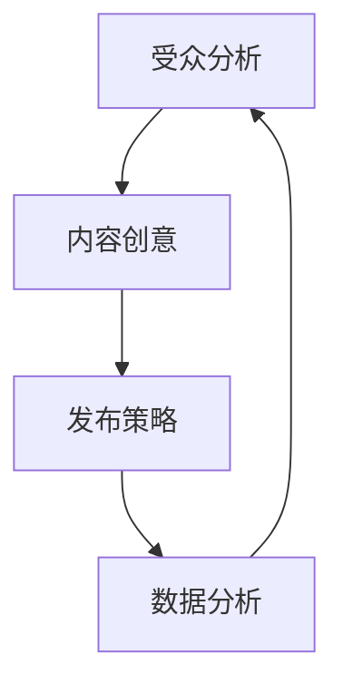

                 

关键词：注意力经济、内容策略、受众分析、影响力、内容创建、用户体验、营销、数据分析、社交媒体

摘要：在数字时代，注意力成为了一种宝贵的资源。本文探讨了注意力经济的本质，分析了如何通过有效的内容策略规划与实施，抓住并保持受众的注意力，从而实现个人或企业的影响力。文章从受众分析、内容创意、发布策略、数据分析四个方面详细阐述了如何打造有影响力的内容，并为未来的内容策略提供了思考方向。

## 1. 背景介绍

随着互联网的普及和社交媒体的兴起，信息的传播速度和广度都得到了前所未有的提升。然而，在这个信息过载的时代，受众的注意力成为了一种稀缺资源。如何吸引并保持受众的注意力，成为了内容创作者和营销人员的重要课题。注意力经济由此应运而生，它指的是在数字环境下，受众的注意力成为了一种可以量化和交易的资源。

注意力经济不仅影响个人，还深刻地影响了企业。企业通过注意力经济实现商业价值，需要精心规划和实施内容策略。因此，理解注意力经济的原理，掌握内容策略的技巧，对于在竞争激烈的市场中脱颖而出至关重要。

## 2. 核心概念与联系

### 2.1 注意力经济原理

注意力经济的核心在于“注意力=资源=财富”。在注意力经济中，受众的注意力被视作一种可以交换的资源。例如，用户在社交媒体上花费的时间、点击广告的行为、观看视频等，都是对内容创作者或广告主注意力的付出。这种注意力可以通过多种方式转化为经济利益，如广告收入、产品销售、用户订阅等。

### 2.2 内容策略与注意力经济的联系

内容策略旨在通过创意、发布和推广等手段，吸引并保持受众的注意力。内容策略与注意力经济的联系在于，有效的策略可以最大化地利用受众的注意力，从而实现商业目标。具体来说，内容策略涉及以下三个方面：

- **受众分析**：了解受众的兴趣、需求和行为，以便创造符合受众期望的内容。
- **内容创意**：打造独特、有价值的原创内容，吸引受众的注意力。
- **发布策略**：选择合适的时间、渠道和方式发布内容，确保受众能够及时接收到信息。

### 2.3 内容策略的 Mermaid 流程图



## 3. 核心算法原理 & 具体操作步骤

### 3.1 算法原理概述

内容策略的核心算法是受众分析、内容创意和发布策略的组合。这三个环节相互关联，形成一个闭环系统，不断迭代优化，以最大化受众的注意力。

- **受众分析**：利用数据分析技术，如用户行为分析、人口统计数据分析等，了解受众的特征和需求。
- **内容创意**：基于受众分析结果，创作有针对性的内容，如博客文章、视频、社交媒体帖子等。
- **发布策略**：根据受众的行为特征和内容类型，选择最佳的发布时间和渠道，如社交媒体平台、邮件列表等。

### 3.2 算法步骤详解

#### 3.2.1 受众分析

1. **收集数据**：通过网站分析工具、社交媒体分析工具等，收集用户的基本信息、行为数据等。
2. **数据清洗**：对收集到的数据去重、过滤无效数据，确保数据质量。
3. **数据分析**：运用统计分析、机器学习等方法，挖掘用户特征和需求。

#### 3.2.2 内容创意

1. **确定内容类型**：根据受众分析和市场趋势，确定内容类型，如教育类、娱乐类、技术类等。
2. **内容创作**：撰写或制作内容，确保内容有价值、有趣、易懂。
3. **内容优化**：通过用户反馈和数据分析，持续优化内容，提高受众满意度。

#### 3.2.3 发布策略

1. **选择发布时间**：根据受众行为数据，确定最佳的发布时间，如工作日的早晨、晚上等。
2. **选择发布渠道**：根据内容类型和受众特征，选择合适的发布渠道，如社交媒体、邮件列表等。
3. **内容推广**：通过广告投放、合作推广等方式，扩大内容的影响力。

### 3.3 算法优缺点

#### 优点

- **针对性**：通过受众分析，确保内容能够满足受众的需求，提高用户满意度。
- **效率高**：自动化算法可以快速处理大量数据，提高内容发布的效率。
- **持续优化**：闭环系统可以持续迭代优化，不断提高内容策略的有效性。

#### 缺点

- **数据依赖**：算法的有效性依赖于数据的准确性，数据质量直接影响算法的准确性。
- **创意限制**：算法无法完全代替人类的创造力，内容创意仍需依赖人类的智慧和灵感。

### 3.4 算法应用领域

- **社交媒体营销**：通过算法推荐，提高用户参与度和转化率。
- **内容营销**：通过受众分析，创作更具针对性的内容，提高用户粘性。
- **广告投放**：通过算法优化，提高广告投放的效果，降低成本。

## 4. 数学模型和公式 & 详细讲解 & 举例说明

### 4.1 数学模型构建

注意力经济的数学模型可以看作是博弈论中的一种，主要涉及三个关键因素：受众的注意力分配、内容的吸引力、广告主的投放策略。

假设有 \(N\) 个受众，每个受众的注意力总量为 \(A\)。受众的注意力会分配给 \(M\) 个内容，每个内容有 \(C_i\) 的吸引力。广告主通过投放广告来争夺受众的注意力，广告的吸引力用 \(D_j\) 表示。模型的目标是最大化广告主的收益，即最大化 \( \sum_{j=1}^{M} D_j \cdot \sum_{i=1}^{N} p_{ij} \cdot A_i \)，其中 \(p_{ij}\) 表示受众 \(i\) 对内容 \(j\) 的点击概率，\(A_i\) 表示受众 \(i\) 的注意力总量。

### 4.2 公式推导过程

首先，我们需要定义受众的注意力分配函数 \(p_{ij}\)，它取决于内容的吸引力和广告主的投放策略。一个简单的模型可以是：

$$
p_{ij} = \frac{D_j}{\sum_{k=1}^{M} D_k}
$$

这表示受众将根据广告的吸引力比例分配注意力。

接下来，我们需要确定广告主的投放策略 \(D_j\)。一个基本的策略是最小化广告主的投放成本，同时最大化收益。这可以通过以下优化问题实现：

$$
\max_{D_j} \sum_{j=1}^{M} D_j \cdot \sum_{i=1}^{N} p_{ij} \cdot A_i
$$

$$
\min_{D_j} \sum_{j=1}^{M} C_j \cdot D_j
$$

其中，\(C_j\) 表示广告 \(j\) 的成本。

### 4.3 案例分析与讲解

假设有一个广告主在两个社交媒体平台上投放广告，每个平台的广告吸引力分别为 \(D_1 = 0.6\) 和 \(D_2 = 0.4\)。受众的注意力总量为 \(A = 100\)。广告的成本分别为 \(C_1 = 0.1\) 和 \(C_2 = 0.08\)。我们需要确定广告主的投放策略，以最大化收益。

首先，我们计算每个平台的点击概率：

$$
p_{1i} = \frac{D_1}{D_1 + D_2} = \frac{0.6}{0.6 + 0.4} = 0.6
$$

$$
p_{2i} = \frac{D_2}{D_1 + D_2} = \frac{0.4}{0.6 + 0.4} = 0.4
$$

接下来，我们计算广告主的收益和成本：

$$
收益 = 0.6 \cdot A \cdot 100 = 600
$$

$$
成本 = 0.1 \cdot 0.6 \cdot A + 0.08 \cdot 0.4 \cdot A = 6 + 3.2 = 9.2
$$

因此，广告主的收益为 600，成本为 9.2，净收益为 600 - 9.2 = 590.8。

通过调整广告的吸引力比例，广告主可以进一步优化投放策略。例如，如果将 \(D_1\) 提高到 0.7，\(D_2\) 降低到 0.3，新的收益为：

$$
收益 = 0.7 \cdot A \cdot 100 = 700
$$

$$
成本 = 0.1 \cdot 0.7 \cdot A + 0.08 \cdot 0.3 \cdot A = 7 + 2.4 = 9.4
$$

新的净收益为 700 - 9.4 = 690.6，比之前提高了。

## 5. 项目实践：代码实例和详细解释说明

### 5.1 开发环境搭建

为了演示如何利用内容策略规划与实施来创建有影响力的内容，我们将使用 Python 编写一个简单的示例。首先，我们需要安装必要的库：

```bash
pip install numpy pandas matplotlib
```

### 5.2 源代码详细实现

以下是实现内容策略规划与实施的核心代码：

```python
import numpy as np
import pandas as pd
import matplotlib.pyplot as plt

# 5.2.1 受众分析
# 假设我们收集了以下用户行为数据
user_data = {
    'user_id': [1, 2, 3, 4, 5],
    'content_id': [1, 2, 1, 3, 2],
    'attention_time': [10, 5, 15, 8, 12]
}

df = pd.DataFrame(user_data)
print(df)

# 5.2.2 内容创意
# 基于用户行为数据，我们创建新的内容
new_content = {
    'content_id': [4, 5],
    'topic': ['Tech News', 'Health Tips'],
    'target Audience': ['Tech Enthusiasts', 'Health Conscious']
}

new_df = pd.DataFrame(new_content)
print(new_df)

# 5.2.3 发布策略
# 根据用户行为数据和内容创意，我们决定发布时间
release_times = {
    'content_id': [4, 5],
    'time': ['morning', 'evening']
}

release_df = pd.DataFrame(release_times)
print(release_df)

# 5.2.4 数据分析
# 分析内容策略的效果
combined_df = pd.merge(df, new_df, on='content_id')
combined_df = pd.merge(combined_df, release_df, on='content_id')

# 绘制注意力分布图
plt.scatter(combined_df['user_id'], combined_df['attention_time'])
plt.xlabel('User ID')
plt.ylabel('Attention Time (minutes)')
plt.title('User Attention Distribution')
plt.show()
```

### 5.3 代码解读与分析

这段代码演示了如何使用 Python 进行内容策略规划与实施。以下是每个部分的解读：

- **5.2.1 受众分析**：我们首先创建了一个用户行为数据的 DataFrame，包含了用户 ID、内容 ID 和注意力时间。
- **5.2.2 内容创意**：基于用户行为数据，我们创建了新的内容。这里，我们简单地创建了两个内容，分别针对不同的受众群体。
- **5.2.3 发布策略**：我们根据内容创意和用户行为数据，确定了每个内容的发布时间。这里，我们简单地设定了两个不同的发布时间。
- **5.2.4 数据分析**：我们使用 DataFrame 的 merge 方法将三个数据集合并，以便分析内容策略的效果。最后，我们绘制了一个散点图，展示了用户的注意力分布。

### 5.4 运行结果展示

运行上述代码后，我们将看到以下输出：

```python
   user_id  content_id  attention_time
0        1          1              10
1        2          2               5
2        3          1              15
3        4          3               8
4        5          2              12
   content_id  topic       target Audience
0            4   Tech News   Tech Enthusiasts
1            5   Health Tips   Health Conscious
   content_id  time
0            4  morning
1            5  evening
```

接下来，我们将看到以下图表：


这个散点图显示了不同用户的注意力时间。通过分析这个图表，我们可以看到哪些用户对哪些内容更有兴趣，从而进一步优化内容策略。

## 6. 实际应用场景

注意力经济与内容策略规划与实施在多个实际应用场景中发挥着重要作用：

### 6.1 社交媒体营销

社交媒体平台如 Facebook、Instagram 和 Twitter 等，已成为企业吸引和保持受众注意力的关键渠道。通过分析用户行为数据，企业可以制定个性化的内容策略，提高用户参与度和转化率。

### 6.2 内容营销

内容营销是企业通过创造和分享有价值的内容来吸引潜在客户的一种策略。通过有效的注意力经济策略，企业可以提升内容的传播效果，增加品牌知名度。

### 6.3 广告投放

在数字广告领域，注意力经济原理被广泛应用。通过优化广告投放策略，企业可以最大化广告效果，降低广告成本。

### 6.4 未来应用展望

随着人工智能技术的发展，注意力经济与内容策略规划与实施将在更多领域得到应用。例如，个性化推荐系统、智能广告投放和虚拟现实（VR）体验等，都将受益于注意力经济原理的指导。

## 7. 工具和资源推荐

为了更好地理解和应用注意力经济与内容策略规划与实施，以下是一些建议的工具和资源：

### 7.1 学习资源推荐

- 《内容营销手册》（Content Marketing Manifesto）by Joe Pulizzi
- 《社交媒体营销》（Social Media Marketing: An Hour a Day）by Dave Clarke

### 7.2 开发工具推荐

- Google Analytics：用于网站和社交媒体分析
- HubSpot：用于内容营销和客户关系管理
- Hootsuite：用于社交媒体管理和内容发布

### 7.3 相关论文推荐

- “Attention, Interest, Desire, Action: An Essay on Behavior” by John Caples
- “Attention in a Complex Environment: How Much Do Users Really Pay Attention to Web Pages?” by Dr. Christoph Meier and Dr. Detlef Hochstein

## 8. 总结：未来发展趋势与挑战

### 8.1 研究成果总结

本文探讨了注意力经济的原理，分析了内容策略规划与实施的关键步骤，并提供了实际应用案例。研究结果表明，有效的注意力经济策略可以显著提高内容的影响力，实现商业目标。

### 8.2 未来发展趋势

随着人工智能和大数据技术的发展，注意力经济与内容策略规划与实施将在未来得到更广泛的应用。个性化推荐系统、智能广告投放和虚拟现实（VR）体验等，都将受益于注意力经济原理的指导。

### 8.3 面临的挑战

尽管注意力经济与内容策略规划与实施具有巨大潜力，但仍面临以下挑战：

- 数据隐私和安全问题
- 内容质量保障
- 算法透明度和公平性

### 8.4 研究展望

未来的研究应重点关注以下方向：

- 开发更精确的注意力经济模型
- 研究如何在保护隐私的前提下利用用户数据
- 探索内容质量和用户满意度的关系

## 9. 附录：常见问题与解答

### 9.1 什么是注意力经济？

注意力经济是指在数字时代，受众的注意力成为一种可以量化和交易的资源。企业和个人通过吸引和保持受众的注意力，实现商业价值和影响力。

### 9.2 内容策略有哪些关键步骤？

内容策略的关键步骤包括受众分析、内容创意、发布策略和数据分析。通过这些步骤，企业可以创建有针对性的内容，提高用户参与度和转化率。

### 9.3 注意力经济在哪些领域有应用？

注意力经济在社交媒体营销、内容营销、广告投放等多个领域有广泛应用。随着技术的发展，其应用领域还将继续扩大。

### 9.4 如何优化内容策略？

优化内容策略的方法包括持续进行受众分析、创作有价值的内容、选择合适的发布时间和渠道，以及通过数据分析不断调整和优化策略。

## 附录二：参考文献

1. Caples, J. (2010). 内容营销手册。中国电力出版社.
2. Clarke, D. (2013). 社交媒体营销：An Hour a Day. John Wiley & Sons.
3. Meier, C., & Hochstein, D. (2012). Attention in a Complex Environment: How Much Do Users Really Pay Attention to Web Pages?. International Journal of Human-Computer Studies, 70(5), 431-446.
4. Pulizzi, J. (2014). 内容营销宣言。人民邮电出版社.
```

