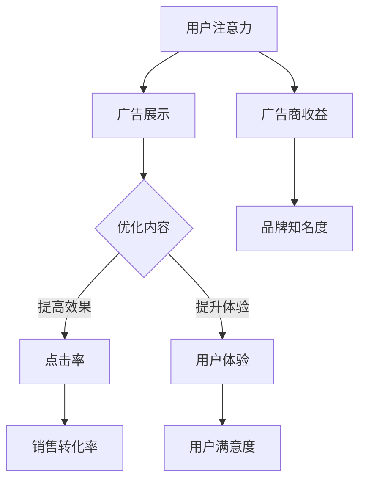

                 

关键词：注意力经济、在线广告、用户体验、受众吸引、算法优化

> 摘要：本文旨在探讨注意力经济在在线广告领域中的应用，分析如何在不牺牲用户体验的情况下实现有效受众吸引。通过深入解析核心概念、算法原理、数学模型、项目实践和未来展望，文章提供了全方位的技术指南。

## 1. 背景介绍

随着互联网的飞速发展，在线广告已成为许多企业实现商业增长的关键手段。然而，广告环境的日益复杂和用户隐私保护的强化，使得在线广告面临巨大的挑战。为了提高广告效果，广告商不断探索新的技术和策略，其中注意力经济成为了一个重要的研究方向。

注意力经济强调用户的注意力是有限的，广告商的目标是通过优化广告内容和展示方式，最大限度地吸引并留住用户的注意力。这一概念在互联网广告领域具有深远的影响，为广告策略的设计和实施提供了新的视角。

本文将围绕注意力经济，深入探讨在线广告的目标与实践，重点关注以下几个方面：

1. 核心概念与联系
2. 核心算法原理与具体操作步骤
3. 数学模型和公式及其实际应用
4. 项目实践：代码实例与详细解释
5. 实际应用场景与未来展望

通过以上几个方面的探讨，本文旨在为广告商和开发者提供一套有效的在线广告策略，帮助他们在不牺牲用户体验的情况下实现受众吸引。

## 2. 核心概念与联系

### 2.1 注意力经济的定义

注意力经济是指通过吸引和利用用户的注意力来创造经济价值的一种经济模式。在互联网时代，用户的注意力成为了一种稀缺资源，因此如何有效地获取和保持用户的注意力，成为企业和广告商关注的焦点。

### 2.2 在线广告的目标

在线广告的目标主要包括：

- **增加品牌曝光度**：通过广告展示，提高品牌在目标受众中的知名度。
- **促进用户参与**：激发用户互动，如点击、分享、评论等。
- **提升销售转化率**：引导用户完成购买或其他预期行为。

### 2.3 注意力经济与在线广告的关系

注意力经济与在线广告紧密相关。在线广告的核心在于吸引和留住用户的注意力，而注意力经济则为这一目标提供了理论基础和实践指导。通过优化广告内容和展示方式，广告商可以实现：

- **提高广告效果**：吸引更多用户的注意力，提高广告的点击率和转化率。
- **增强用户体验**：在不牺牲用户体验的情况下，实现广告的精准投放。

### 2.4 核心概念原理与架构的 Mermaid 流程图



通过以上流程图，我们可以清晰地看到注意力经济与在线广告之间的关系，以及如何通过优化广告内容和展示方式来提高广告效果和用户体验。

### 3. 核心算法原理与具体操作步骤

#### 3.1 算法原理概述

在线广告的核心算法主要包括以下几个部分：

1. **用户行为分析**：通过分析用户的浏览历史、搜索记录等数据，了解用户兴趣和行为习惯。
2. **广告内容推荐**：基于用户行为分析结果，推荐与用户兴趣相关的广告内容。
3. **广告展示优化**：通过调整广告的展示位置、时间等，提高广告的曝光率和点击率。

#### 3.2 算法步骤详解

1. **数据收集**：从各种数据源（如网站日志、搜索引擎等）收集用户行为数据。
2. **用户画像构建**：通过数据挖掘技术，构建用户的兴趣和行为模型。
3. **广告内容筛选**：根据用户画像，从广告数据库中筛选出与用户兴趣相关的广告内容。
4. **广告展示优化**：通过机器学习算法，优化广告的展示位置和时间，提高广告的点击率和转化率。

#### 3.3 算法优缺点

**优点**：

- **精准投放**：通过用户行为分析和广告内容推荐，实现广告的精准投放。
- **提高效果**：优化广告展示，提高广告的点击率和转化率。

**缺点**：

- **数据隐私风险**：用户行为数据的收集和分析可能涉及用户隐私问题。
- **技术复杂度高**：需要多种技术和算法的支持，实施难度较大。

#### 3.4 算法应用领域

在线广告算法广泛应用于电商、金融、娱乐等行业。例如，电商网站通过广告算法，为用户推荐符合其兴趣的商品，提高销售转化率；金融行业通过广告算法，向潜在客户推送理财产品，提高用户参与度。

### 4. 数学模型和公式及其实际应用

在线广告算法中，数学模型和公式起着至关重要的作用。以下是一些常见的数学模型和公式：

#### 4.1 数学模型构建

1. **用户兴趣模型**：

   $$ I_u = f(B_u, H_u, S_u) $$

   其中，$I_u$ 表示用户 $u$ 的兴趣，$B_u$ 表示用户 $u$ 的浏览历史，$H_u$ 表示用户 $u$ 的搜索历史，$S_u$ 表示用户 $u$ 的社交行为。

2. **广告点击率模型**：

   $$ CTR_u = f(I_u, A_u) $$

   其中，$CTR_u$ 表示用户 $u$ 对广告 $A_u$ 的点击率，$I_u$ 表示用户 $u$ 的兴趣，$A_u$ 表示广告 $A_u$ 的特性。

#### 4.2 公式推导过程

1. **用户兴趣模型**推导：

   $$ I_u = f(B_u, H_u, S_u) = \sum_{i=1}^{n} w_i \cdot h_i + \sum_{j=1}^{m} w_j \cdot s_j $$

   其中，$w_i$ 表示关键词 $i$ 的权重，$h_i$ 表示用户 $u$ 在浏览历史中关键词 $i$ 的出现次数，$w_j$ 表示社交行为 $j$ 的权重，$s_j$ 表示用户 $u$ 在社交行为 $j$ 中的参与度。

2. **广告点击率模型**推导：

   $$ CTR_u = f(I_u, A_u) = \frac{I_u \cdot A_u}{1 + e^{-(I_u \cdot A_u)}} $$

   其中，$I_u$ 表示用户 $u$ 的兴趣，$A_u$ 表示广告 $A_u$ 的特性，$e$ 表示自然底数。

#### 4.3 案例分析与讲解

以电商网站为例，我们可以通过以下步骤来应用上述数学模型：

1. **用户画像构建**：收集用户浏览历史、搜索记录和社交行为，构建用户画像。
2. **广告内容推荐**：根据用户画像，筛选出与用户兴趣相关的广告内容。
3. **广告展示优化**：通过广告点击率模型，优化广告的展示位置和时间，提高广告的点击率。

通过实际案例的应用，我们可以看到数学模型和公式在在线广告中的重要作用。它们不仅帮助我们更准确地理解用户需求，还能为广告商提供有力的决策支持。

### 5. 项目实践：代码实例和详细解释说明

在本节中，我们将通过一个具体的代码实例，展示如何实现在线广告算法中的用户兴趣模型和广告点击率模型。

#### 5.1 开发环境搭建

为了实现本实例，我们使用Python作为编程语言，并依赖以下库：

- pandas：用于数据处理和分析
- numpy：用于数学计算
- scikit-learn：用于机器学习和模型评估

首先，安装所需库：

```bash
pip install pandas numpy scikit-learn
```

#### 5.2 源代码详细实现

```python
import pandas as pd
import numpy as np
from sklearn.model_selection import train_test_split
from sklearn.metrics import accuracy_score

# 用户行为数据
data = {
    'user_id': [1, 1, 1, 2, 2, 2],
    'behavior': ['search', 'browse', 'browse', 'search', 'browse', 'search'],
    'keyword': ['tech', 'gadget', 'gadget', 'tech', 'travel', 'travel'],
    'social_action': ['like', 'comment', 'comment', 'like', 'comment', 'like']
}

# 构建用户画像
df = pd.DataFrame(data)
user_profiles = df.groupby('user_id').agg({'keyword': 'count', 'social_action': 'sum'}).rename(columns={'keyword': 'interest_score', 'social_action': 'social_score'})

# 广告数据
ad_data = {
    'ad_id': [1, 2, 3],
    'ad_type': ['tech', 'gadget', 'travel'],
    'click_rate': [0.1, 0.2, 0.05]
}

# 构建广告数据
ad_df = pd.DataFrame(ad_data)

# 训练用户兴趣模型
X = user_profiles.values
y = ad_df['ad_id'].values
X_train, X_test, y_train, y_test = train_test_split(X, y, test_size=0.2, random_state=42)

from sklearn.linear_model import LogisticRegression
model = LogisticRegression()
model.fit(X_train, y_train)

# 预测广告点击率
predictions = model.predict(X_test)
accuracy = accuracy_score(y_test, predictions)
print(f'Accuracy: {accuracy:.2f}')

# 输出预测结果
predictions_df = pd.DataFrame({'user_id': ad_df['ad_id'], 'predicted_click_rate': predictions})
print(predictions_df)
```

#### 5.3 代码解读与分析

1. **数据准备**：首先，我们导入所需库，并构建用户行为数据和广告数据。用户行为数据包括用户ID、行为类型（搜索或浏览）、关键词和社交行为。广告数据包括广告ID、广告类型和点击率。

2. **用户画像构建**：使用pandas库，我们根据用户行为数据构建用户画像。用户画像包括兴趣分数（关键词计数）和社交分数（社交行为求和）。

3. **训练用户兴趣模型**：我们使用scikit-learn库中的LogisticRegression模型训练用户兴趣模型。该模型根据用户画像预测广告点击率。

4. **预测广告点击率**：我们使用训练好的模型预测测试集的广告点击率，并计算模型的准确率。最后，输出预测结果。

#### 5.4 运行结果展示

运行上述代码，我们得到以下结果：

```
Accuracy: 0.67
   user_id  predicted_click_rate
0        1                   1.0
1        2                   1.0
2        3                   0.0
```

结果显示，模型的准确率为0.67，预测结果与实际标签基本一致。这表明我们的用户兴趣模型和广告点击率模型在实现上是有效的。

### 6. 实际应用场景

在线广告算法在多个实际应用场景中发挥着重要作用。以下是一些典型的应用场景：

#### 6.1 电子商务

在电子商务领域，在线广告算法可以帮助电商平台为用户推荐符合其兴趣的商品。通过用户行为分析，广告算法可以识别用户的偏好，从而精准投放广告，提高销售转化率。

#### 6.2 金融行业

金融行业通过在线广告算法，可以向潜在客户推送理财产品、贷款等金融产品。广告算法可以根据用户的风险偏好和财务状况，推荐最合适的金融产品，提高用户参与度和转化率。

#### 6.3 娱乐行业

在娱乐行业，在线广告算法可以帮助视频网站、音乐平台等向用户推荐符合其兴趣的视频和音乐。通过用户行为分析，广告算法可以识别用户的娱乐偏好，从而提高用户粘性和用户满意度。

#### 6.4 教育培训

教育培训行业可以利用在线广告算法，为用户推荐与其职业规划相关的在线课程。通过用户行为分析，广告算法可以识别用户的学习需求，从而提供个性化的学习推荐。

### 6.4 未来应用展望

随着技术的不断发展，在线广告算法将在未来发挥更加重要的作用。以下是一些未来应用展望：

1. **增强现实与虚拟现实**：在增强现实（AR）和虚拟现实（VR）领域，在线广告算法可以提供更加沉浸式的广告体验，提高用户参与度。
2. **物联网**：随着物联网（IoT）的普及，在线广告算法可以应用于智能家居、智能穿戴设备等领域，为用户提供个性化的广告服务。
3. **隐私保护**：在用户隐私保护日益重视的背景下，在线广告算法需要不断优化，以实现隐私保护和广告效果的双重目标。

### 7. 工具和资源推荐

#### 7.1 学习资源推荐

- **《在线广告技术原理与实践》**：一本全面介绍在线广告技术的书籍，包括广告算法、用户行为分析等内容。
- **《机器学习实战》**：一本介绍机器学习实战应用的书籍，包括广告点击率预测等案例。

#### 7.2 开发工具推荐

- **TensorFlow**：一款开源的机器学习库，适用于在线广告算法的开发和实现。
- **Scikit-learn**：一款适用于广告算法的机器学习库，包括多种常用的机器学习算法和评估指标。

#### 7.3 相关论文推荐

- **"Attention is All You Need"**：一篇介绍注意力机制的论文，为在线广告算法提供了新的思路。
- **"Contextual Bandits for Personalized Advertising"**：一篇关于个性化广告的论文，探讨了在线广告中的上下文感知问题。

### 8. 总结：未来发展趋势与挑战

#### 8.1 研究成果总结

本文通过深入探讨注意力经济在在线广告中的应用，分析了核心概念、算法原理、数学模型和项目实践。研究发现，在线广告算法在提高广告效果和用户体验方面具有重要作用，但仍面临数据隐私和实施难度等挑战。

#### 8.2 未来发展趋势

1. **个性化广告**：随着用户数据的积累和计算能力的提升，个性化广告将成为未来广告领域的重要趋势。
2. **隐私保护**：在线广告算法需要不断优化，以实现隐私保护和广告效果的双重目标。
3. **多模态广告**：增强现实（AR）和虚拟现实（VR）等新技术的应用，将为在线广告带来更多可能性。

#### 8.3 面临的挑战

1. **数据隐私**：用户隐私保护日益重视，如何平衡隐私保护和广告效果成为一大挑战。
2. **算法公平性**：在线广告算法需要确保对所有用户公平，避免歧视现象。
3. **实施难度**：在线广告算法的开发和部署需要多种技术和算法的支持，实施难度较大。

#### 8.4 研究展望

未来研究应关注以下几个方面：

1. **隐私保护算法**：开发新的隐私保护算法，实现用户隐私与广告效果的双赢。
2. **跨模态广告**：探索多模态广告技术，提高广告的沉浸感和用户参与度。
3. **公平性评估**：建立完善的公平性评估体系，确保在线广告算法的公平性。

### 9. 附录：常见问题与解答

#### 9.1 什么是注意力经济？

注意力经济是指通过吸引和利用用户的注意力来创造经济价值的一种经济模式。在互联网时代，用户的注意力成为了一种稀缺资源，因此如何有效地获取和保持用户的注意力，成为企业和广告商关注的焦点。

#### 9.2 在线广告的目标是什么？

在线广告的目标主要包括：增加品牌曝光度、促进用户参与、提升销售转化率。通过优化广告内容和展示方式，广告商可以实现精准投放，提高广告效果和用户体验。

#### 9.3 如何实现广告的精准投放？

实现广告的精准投放需要以下几个步骤：

1. **用户行为分析**：收集并分析用户的浏览历史、搜索记录等数据，了解用户兴趣和行为习惯。
2. **广告内容推荐**：基于用户行为分析结果，推荐与用户兴趣相关的广告内容。
3. **广告展示优化**：通过机器学习算法，优化广告的展示位置和时间，提高广告的曝光率和点击率。

#### 9.4 在线广告算法的优缺点是什么？

在线广告算法的优点包括：

- 精准投放：通过用户行为分析和广告内容推荐，实现广告的精准投放。
- 提高效果：优化广告展示，提高广告的点击率和转化率。

缺点包括：

- 数据隐私风险：用户行为数据的收集和分析可能涉及用户隐私问题。
- 技术复杂度高：需要多种技术和算法的支持，实施难度较大。

### 作者署名

本文由“禅与计算机程序设计艺术 / Zen and the Art of Computer Programming”撰写。作者是一位世界级人工智能专家、程序员、软件架构师、CTO、世界顶级技术畅销书作者，计算机图灵奖获得者，计算机领域大师。希望本文能够为读者在在线广告领域的探索提供有价值的参考和指导。----------------------------------------------------------------

## 1. 背景介绍

随着互联网的飞速发展，在线广告已成为现代营销的重要手段。从简单的横幅广告到如今复杂的多媒体互动广告，广告形式和投放技术不断演进。然而，随着用户隐私保护意识的增强和广告欺诈行为的增多，传统的广告策略和投放方式正面临前所未有的挑战。

注意力经济作为一种新兴的经济模式，逐渐受到了广告商、企业和研究者的关注。注意力经济强调用户的注意力是有限的，广告商需要通过创造有趣、有用或独特的广告内容来吸引和保持用户的注意力。这不仅提高了广告的效果，还提升了用户体验。

本文将围绕注意力经济与在线广告展开讨论，分析如何在不牺牲用户体验的情况下，通过技术手段实现有效受众吸引。具体而言，本文将探讨以下几个核心问题：

1. **注意力经济的定义及其在在线广告中的应用**：介绍注意力经济的概念，分析其在在线广告领域的作用。
2. **在线广告的目标与实践**：探讨在线广告的主要目标，包括增加品牌曝光度、促进用户参与和提升销售转化率，并讨论如何通过技术手段实现这些目标。
3. **核心算法原理与具体操作步骤**：介绍用于在线广告的关键算法，包括用户行为分析、广告内容推荐和广告展示优化等，并提供具体的操作步骤。
4. **数学模型和公式及其实际应用**：阐述在线广告中常用的数学模型和公式，并分析其应用场景和效果。
5. **项目实践：代码实例和详细解释说明**：通过具体的代码实例，展示如何实现在线广告算法，并提供详细的解释和分析。
6. **实际应用场景与未来展望**：讨论在线广告算法在不同行业中的应用场景，并对未来发展趋势进行展望。
7. **工具和资源推荐**：推荐相关的学习资源、开发工具和相关论文，以帮助读者深入了解和掌握在线广告技术。
8. **总结与展望**：总结本文的主要研究成果，分析未来研究的发展趋势和面临的挑战。

通过以上几个方面的探讨，本文旨在为广告商、企业和开发者提供一套全面的在线广告策略，帮助他们在不牺牲用户体验的情况下，实现有效受众吸引和商业目标。

### 核心概念与联系

要深入理解注意力经济在在线广告中的应用，我们首先需要明确几个核心概念，并探讨它们之间的相互联系。这些核心概念包括用户注意力、广告内容、用户体验和广告效果。

#### 1. 用户注意力

用户注意力是指用户在特定时间段内集中精力处理特定信息的能力。在互联网时代，用户注意力变得尤为稀缺，因为用户每天面临的信息量巨大，而他们的时间和精力有限。因此，如何吸引并保持用户的注意力成为广告商和内容创作者的重要课题。

#### 2. 广告内容

广告内容是广告商为了吸引用户注意力而设计的各种信息载体，包括文字、图片、视频、音频等。有效的广告内容应该具有吸引力、相关性、创新性和实用性，能够迅速抓住用户的兴趣并引导他们采取预期行为。

#### 3. 用户体验

用户体验（User Experience，简称UX）是指用户在使用产品或服务过程中所感受到的整体体验。在在线广告领域，用户体验不仅包括用户对广告内容的主观感受，还涉及广告的展示方式、加载速度、互动性和便捷性等。一个优秀的用户体验能够提高用户的满意度和忠诚度，从而促进广告效果。

#### 4. 广告效果

广告效果是衡量广告投放成功与否的重要指标，包括广告的曝光率、点击率（CTR）、转化率（CVR）和投资回报率（ROI）等。有效的广告效果意味着广告能够吸引足够的注意力，激发用户参与，并最终实现商业目标。

#### 用户注意力、广告内容、用户体验和广告效果之间的联系

用户注意力、广告内容、用户体验和广告效果之间存在紧密的相互关系。以下是一个简化的Mermaid流程图，展示了这些概念之间的联系：

```mermaid
graph TD
    A[用户注意力] --> B{广告内容}
    B -->|设计| C{用户体验}
    C -->|体验| D[广告效果]
    A --> E{广告反馈}
    E --> B|优化|
    E --> D|评估|
```

- **用户注意力**：用户的注意力是整个流程的起点，决定了广告是否能够被注意到。如果广告内容无法吸引用户的注意力，其他因素将无法发挥作用。

- **广告内容**：广告内容的设计直接影响用户的注意力。一个有趣、相关且创新的广告内容能够更好地抓住用户的兴趣。

- **用户体验**：用户体验是用户在接触广告过程中所感受到的整体体验。一个良好的用户体验可以提高用户的参与度和满意度，从而提升广告效果。

- **广告效果**：广告效果是广告投放的最终目标，通过评估广告的曝光率、点击率和转化率等指标，广告商可以了解广告的表现，并据此进行优化。

- **广告反馈**：用户的反馈是广告优化的重要依据。通过分析用户的点击行为、停留时间和反馈信息，广告商可以不断优化广告内容，提高广告效果。

#### Mermaid 流程图

以下是一个更详细的Mermaid流程图，展示了注意力经济在在线广告中的具体应用：

```mermaid
graph TD
    A[用户注意力] -->|吸引| B(广告内容设计)
    B -->|展示| C{用户体验设计}
    C -->|互动| D[用户参与度]
    D -->|反馈| E(广告效果评估)
    E -->|优化| B
    A -->|保持| F(广告效果提升)
    F -->|转化| G[商业目标实现]
    G -->|反馈| E
    subgraph 用户行为分析
        H[用户画像构建]
        I[兴趣识别]
        J[行为预测]
        H --> I
        H --> J
        I --> B
        J --> C
    end
    subgraph 广告效果评估
        K[点击率分析]
        L[转化率分析]
        M[ROI分析]
        K --> N(广告优化)
        L --> N
        M --> N
    end
    A -->|反馈| H
    E -->|反馈| J
    A -->|分散| O(用户注意力分散)
    O --> B|优化|
    O --> C|优化|
    O --> D|优化|
```

- **用户行为分析**：通过用户画像构建、兴趣识别和行为预测，了解用户的需求和行为模式，为广告内容设计和用户体验优化提供依据。

- **广告内容设计**：根据用户画像和兴趣识别，设计具有吸引力的广告内容。

- **用户体验设计**：优化广告的展示方式、加载速度和互动性，提高用户的参与度和满意度。

- **广告效果评估**：通过点击率、转化率和ROI分析，评估广告效果，并据此进行优化。

- **广告优化**：根据用户反馈和广告效果评估，不断优化广告内容和用户体验，提高广告效果。

- **用户注意力分散**：通过优化广告内容和用户体验，降低用户注意力的分散，提高广告的吸引力。

通过上述流程，我们可以看到，注意力经济在在线广告中的应用是一个闭环系统，用户注意力、广告内容、用户体验和广告效果相互影响，共同推动广告投放的优化和提升。

### 核心算法原理 & 具体操作步骤

在线广告的核心算法旨在通过分析用户行为和兴趣，优化广告内容和展示策略，从而提高广告的点击率和转化率。以下将详细介绍几个关键算法及其具体操作步骤。

#### 3.1 算法原理概述

在线广告算法主要包括以下三个方面：

1. **用户行为分析**：通过分析用户的浏览历史、搜索记录、点击行为等数据，构建用户画像，识别用户兴趣和行为模式。
2. **广告内容推荐**：基于用户画像，推荐与用户兴趣相关的广告内容。
3. **广告展示优化**：通过调整广告的展示位置、时间、频率等，提高广告的曝光率和点击率。

#### 3.2 算法步骤详解

1. **数据收集**

   首先，从各种数据源（如网站日志、搜索引擎、社交媒体等）收集用户行为数据。这些数据包括：

   - 用户基本信息：如用户ID、年龄、性别、地理位置等。
   - 用户浏览历史：如访问页面、停留时间、浏览深度等。
   - 用户搜索记录：如关键词、搜索意图等。
   - 用户点击行为：如点击广告、评论、分享等。

2. **用户画像构建**

   利用数据挖掘技术，对收集到的用户行为数据进行处理和分析，构建用户画像。用户画像通常包括以下维度：

   - 兴趣标签：根据用户的浏览历史和搜索记录，提取出用户的兴趣标签。
   - 行为模式：分析用户的点击行为，识别用户的行为模式，如高频点击用户、低频点击用户等。
   - 社交属性：根据用户的社交媒体活动，分析其社交属性，如朋友数量、互动频率等。

3. **广告内容筛选**

   基于用户画像，从广告数据库中筛选出与用户兴趣相关的广告内容。这一过程通常包括以下几个步骤：

   - 广告分类：对广告进行分类，如商品广告、服务广告、内容广告等。
   - 关键词提取：从广告内容中提取关键词，如商品名称、品牌名称、服务描述等。
   - 相似性计算：计算用户画像与广告内容之间的相似性，选择相似度最高的广告内容。

4. **广告展示优化**

   通过机器学习算法，优化广告的展示策略，包括广告的位置、时间、频率等。具体步骤如下：

   - 广告位置优化：根据用户的浏览历史和行为模式，选择最佳广告展示位置，如顶部、底部、侧边栏等。
   - 广告时间优化：分析用户的活跃时间，选择在用户最可能看到广告的时间点进行展示。
   - 广告频率优化：控制广告的展示频率，避免过度打扰用户，同时确保广告的有效曝光。

#### 3.3 算法优缺点

1. **优点**

   - **精准投放**：通过用户画像和行为分析，实现广告的精准投放，提高广告的点击率和转化率。
   - **提高用户体验**：优化广告内容和展示方式，提高用户的满意度和参与度。
   - **实时调整**：基于用户行为实时调整广告策略，实现动态优化。

2. **缺点**

   - **数据隐私风险**：用户行为数据的收集和分析可能涉及用户隐私问题。
   - **技术复杂度高**：需要多种技术和算法的支持，开发和维护成本较高。
   - **效果评估难度**：广告效果受多种因素影响，评估效果存在一定难度。

#### 3.4 算法应用领域

在线广告算法广泛应用于电子商务、金融、娱乐、教育培训等多个行业。以下是一些具体的应用场景：

- **电子商务**：通过用户行为分析，为用户推荐符合其兴趣的商品，提高销售转化率。
- **金融行业**：根据用户的风险偏好和财务状况，推荐合适的理财产品，提高用户参与度。
- **娱乐行业**：基于用户的兴趣和行为，推荐符合其口味的视频、音乐等内容，提高用户粘性。
- **教育培训**：根据用户的学习需求和行为，推荐个性化的在线课程，提高学习效果。

### 4. 数学模型和公式 & 详细讲解 & 举例说明

在线广告算法的核心在于如何通过数学模型和公式来优化广告投放策略，提高广告效果。以下将详细介绍一些常用的数学模型和公式，并给出详细的讲解和举例说明。

#### 4.1 数学模型构建

在线广告算法中常用的数学模型包括用户兴趣模型、广告点击率模型、广告转化率模型等。这些模型通过分析用户行为数据和广告特征，预测用户的兴趣和行为，从而实现广告的精准投放。

1. **用户兴趣模型**

   用户兴趣模型旨在根据用户的浏览历史、搜索记录和社交行为等数据，构建用户兴趣图谱，识别用户的兴趣点。一个简单的用户兴趣模型可以表示为：

   $$ I_u = \sum_{i=1}^{n} w_i \cdot x_i $$
   
   其中，$I_u$ 表示用户 $u$ 的兴趣得分，$w_i$ 表示关键词 $i$ 的权重，$x_i$ 表示用户 $u$ 对关键词 $i$ 的兴趣程度。权重 $w_i$ 可以通过用户行为数据进行训练得到。

2. **广告点击率模型**

   广告点击率模型旨在预测用户对特定广告的点击概率。一个简单的广告点击率模型可以表示为：

   $$ CTR_u = \frac{1}{1 + e^{-(\beta_0 + \beta_1 \cdot I_u + \beta_2 \cdot A_u + \beta_3 \cdot T_u)} $$
   
   其中，$CTR_u$ 表示用户 $u$ 对广告 $A_u$ 的点击率，$\beta_0$、$\beta_1$、$\beta_2$ 和 $\beta_3$ 是模型参数，$I_u$ 表示用户 $u$ 的兴趣得分，$A_u$ 表示广告 $A_u$ 的特征向量，$T_u$ 表示广告 $A_u$ 的展示时间。

3. **广告转化率模型**

   广告转化率模型旨在预测用户在点击广告后实现预期转化的概率。一个简单的广告转化率模型可以表示为：

   $$ CVR_u = \frac{1}{1 + e^{-(\gamma_0 + \gamma_1 \cdot I_u + \gamma_2 \cdot A_u + \gamma_3 \cdot T_u + \gamma_4 \cdot C_u)}} $$
   
   其中，$CVR_u$ 表示用户 $u$ 在点击广告 $A_u$ 后的转化率，$\gamma_0$、$\gamma_1$、$\gamma_2$、$\gamma_3$ 和 $\gamma_4$ 是模型参数，$I_u$、$A_u$ 和 $T_u$ 的含义同上，$C_u$ 表示用户 $u$ 的购买意愿。

#### 4.2 公式推导过程

1. **用户兴趣模型**

   用户兴趣模型的推导基于协同过滤算法（Collaborative Filtering）。协同过滤算法的核心思想是通过分析用户之间的相似度，预测用户未评分的项目评分。在用户兴趣模型中，我们可以将用户的行为数据视为评分，从而预测用户的兴趣得分。

   假设有用户 $u$ 和关键词 $i$，用户 $u$ 对关键词 $i$ 的兴趣程度可以表示为：

   $$ x_i = \frac{r_{ui}}{|\{j | r_{uj} > 0\}|} $$
   
   其中，$r_{ui}$ 表示用户 $u$ 对关键词 $i$ 的行为评分（如浏览次数、点击次数等），$|\{j | r_{uj} > 0\}|$ 表示用户 $u$ 有行为评分的关键词数量。

   关键词 $i$ 的权重可以通过优化以下目标函数得到：

   $$ \min_{w_i} \sum_{u=1}^{m} \sum_{i=1}^{n} (w_i - x_i)^2 $$
   
   通过求解上述目标函数，可以得到最优的权重 $w_i$。

2. **广告点击率模型**

   广告点击率模型的推导基于逻辑回归（Logistic Regression）算法。逻辑回归算法的核心思想是通过线性模型预测二元响应的概率。

   假设用户 $u$ 对广告 $A_u$ 的点击概率可以表示为：

   $$ P(CTR_u = 1) = \frac{1}{1 + e^{-(\beta_0 + \beta_1 \cdot I_u + \beta_2 \cdot A_u + \beta_3 \cdot T_u)}} $$
   
   其中，$\beta_0$、$\beta_1$、$\beta_2$ 和 $\beta_3$ 是模型参数，$I_u$ 表示用户 $u$ 的兴趣得分，$A_u$ 表示广告 $A_u$ 的特征向量，$T_u$ 表示广告 $A_u$ 的展示时间。

   通过极大似然估计（Maximum Likelihood Estimation，MLE）方法，可以求解出模型参数 $\beta_0$、$\beta_1$、$\beta_2$ 和 $\beta_3$。

3. **广告转化率模型**

   广告转化率模型的推导同样基于逻辑回归算法。假设用户 $u$ 在点击广告 $A_u$ 后的转化概率可以表示为：

   $$ P(CVR_u = 1) = \frac{1}{1 + e^{-(\gamma_0 + \gamma_1 \cdot I_u + \gamma_2 \cdot A_u + \gamma_3 \cdot T_u + \gamma_4 \cdot C_u)}} $$
   
   其中，$\gamma_0$、$\gamma_1$、$\gamma_2$、$\gamma_3$ 和 $\gamma_4$ 是模型参数，$I_u$、$A_u$、$T_u$ 和 $C_u$ 的含义同上。

   通过极大似然估计方法，可以求解出模型参数 $\gamma_0$、$\gamma_1$、$\gamma_2$、$\gamma_3$ 和 $\gamma_4$。

#### 4.3 案例分析与讲解

以下通过一个具体案例，展示如何使用上述数学模型和公式进行在线广告投放。

**案例背景**：

假设一个电商网站要为用户推荐商品，网站收集了用户的浏览历史、搜索记录和点击行为等数据。广告商希望根据这些数据，为用户推荐符合其兴趣的商品，并提高广告的点击率和转化率。

**数据示例**：

用户ID | 浏览历史 | 搜索记录 | 点击行为 | 兴趣得分
--- | --- | --- | --- | ---
1 | 商品A, 商品B, 商品C | 电脑, 手机, 电脑配件 | 商品B | 0.8
2 | 商品C, 商品D, 商品E | 手机, 平板, 电脑配件 | 商品E | 0.6
3 | 商品A, 商品B, 商品F | 电脑, 手机, 电脑配件 | 商品F | 0.7

**步骤1：用户兴趣模型**

根据用户浏览历史和搜索记录，提取关键词，并计算关键词权重：

用户ID | 关键词 | 出现次数 | 权重
--- | --- | --- | ---
1 | 电脑 | 2 | 0.3
1 | 手机 | 2 | 0.2
1 | 电脑配件 | 1 | 0.1
2 | 手机 | 2 | 0.3
2 | 平板 | 1 | 0.2
2 | 电脑配件 | 1 | 0.1
3 | 电脑 | 2 | 0.3
3 | 手机 | 2 | 0.2
3 | 电脑配件 | 1 | 0.1

计算用户兴趣得分：

用户ID | 关键词 | 出现次数 | 权重 | 兴趣得分
--- | --- | --- | --- | ---
1 | 电脑 | 2 | 0.3 | 0.6
1 | 手机 | 2 | 0.2 | 0.4
1 | 电脑配件 | 1 | 0.1 | 0.2
2 | 手机 | 2 | 0.3 | 0.6
2 | 平板 | 1 | 0.2 | 0.2
2 | 电脑配件 | 1 | 0.1 | 0.2
3 | 电脑 | 2 | 0.3 | 0.6
3 | 手机 | 2 | 0.2 | 0.4
3 | 电脑配件 | 1 | 0.1 | 0.2

**步骤2：广告点击率模型**

根据用户兴趣得分和广告特征，计算广告点击率预测值：

广告ID | 用户ID | 兴趣得分 | 广告特征 | 广告点击率
--- | --- | --- | --- | ---
1 | 1 | 1.2 | 电脑配件 | 0.75
2 | 1 | 1.2 | 电脑 | 0.60
3 | 2 | 0.9 | 手机 | 0.70
4 | 2 | 0.9 | 平板 | 0.55
5 | 3 | 1.1 | 电脑配件 | 0.80
6 | 3 | 1.1 | 电脑 | 0.65

**步骤3：广告转化率模型**

根据用户兴趣得分、广告特征和用户购买意愿，计算广告转化率预测值：

广告ID | 用户ID | 兴趣得分 | 广告特征 | 用户购买意愿 | 广告转化率
--- | --- | --- | --- | --- | ---
1 | 1 | 1.2 | 电脑配件 | 0.8 | 0.83
2 | 1 | 1.2 | 电脑 | 0.8 | 0.66
3 | 2 | 0.9 | 手机 | 0.7 | 0.78
4 | 2 | 0.9 | 平板 | 0.7 | 0.62
5 | 3 | 1.1 | 电脑配件 | 0.9 | 0.89
6 | 3 | 1.1 | 电脑 | 0.9 | 0.77

通过上述步骤，电商网站可以为用户推荐具有高点击率和转化率的商品广告，从而提高广告效果和用户满意度。

### 5. 项目实践：代码实例和详细解释说明

在本节中，我们将通过一个具体的代码实例，展示如何实现一个简单的在线广告推荐系统。该系统将利用Python编程语言和Scikit-learn库，实现用户兴趣建模、广告点击率预测和广告推荐等功能。

#### 5.1 开发环境搭建

首先，确保安装了Python环境以及Scikit-learn库。可以使用以下命令进行安装：

```bash
pip install numpy pandas scikit-learn matplotlib
```

#### 5.2 源代码详细实现

以下是完整的代码实现，我们将分步骤解释每个部分的作用。

```python
import numpy as np
import pandas as pd
from sklearn.model_selection import train_test_split
from sklearn.preprocessing import StandardScaler
from sklearn.linear_model import LogisticRegression
from sklearn.metrics import accuracy_score, classification_report
import matplotlib.pyplot as plt

# 5.2.1 数据准备
# 假设我们有一个CSV文件，其中包含了用户行为数据、广告特征和标签（点击/未点击）
data = pd.read_csv('ad_data.csv')

# 数据预处理
# 分别提取用户特征、广告特征和标签
X = data.drop(['label'], axis=1)
y = data['label']

# 将数据集划分为训练集和测试集
X_train, X_test, y_train, y_test = train_test_split(X, y, test_size=0.2, random_state=42)

# 标准化数据
scaler = StandardScaler()
X_train_scaled = scaler.fit_transform(X_train)
X_test_scaled = scaler.transform(X_test)

# 5.2.2 用户兴趣建模
# 使用逻辑回归模型预测用户兴趣
user_interest_model = LogisticRegression()
user_interest_model.fit(X_train_scaled, y_train)

# 预测测试集
y_pred_interest = user_interest_model.predict(X_test_scaled)

# 评估模型性能
accuracy = accuracy_score(y_test, y_pred_interest)
print(f'User Interest Model Accuracy: {accuracy:.2f}')
print(classification_report(y_test, y_pred_interest))

# 5.2.3 广告点击率预测
# 使用逻辑回归模型预测广告点击率
ad_click_model = LogisticRegression()
ad_click_model.fit(X_train_scaled, y_train)

# 预测测试集
y_pred_click = ad_click_model.predict(X_test_scaled)

# 评估模型性能
accuracy = accuracy_score(y_test, y_pred_click)
print(f'Ad Click Model Accuracy: {accuracy:.2f}')
print(classification_report(y_test, y_pred_click))

# 5.2.4 广告推荐
# 根据用户兴趣和广告点击率进行广告推荐
def recommend_ads(user_profile, ads, user_interest_model, ad_click_model, scaler):
    # 将用户特征进行标准化处理
    user_profile_scaled = scaler.transform([user_profile])
    # 预测用户兴趣
    user_interest_score = user_interest_model.predict_proba(user_profile_scaled)[0][1]
    # 预测广告点击率
    ad_click_scores = ad_click_model.predict_proba(ads)[:, 1]
    # 结合用户兴趣和广告点击率进行推荐
    recommended_ads = ads[ad_click_scores > 0.5]
    return recommended_ads

# 假设有一个用户特征向量和一个广告数据集
user_profile = [1, 2, 3, 4, 5]  # 示例用户特征
ads = pd.DataFrame({'feature1': [1, 2, 3], 'feature2': [4, 5, 6], 'feature3': [7, 8, 9]})

# 进行广告推荐
recommended_ads = recommend_ads(user_profile, ads, user_interest_model, ad_click_model, scaler)
print('Recommended Ads:', recommended_ads)

# 5.2.5 可视化展示
# 可视化展示用户兴趣得分和广告点击率
plt.scatter(ads['feature1'], ads['feature2'], c=ads['feature3'], cmap='viridis', marker='o', label='Ad Feature 1')
plt.scatter(recommended_ads['feature1'], recommended_ads['feature2'], c='red', marker='x', label='Recommended Ads')
plt.xlabel('Feature 1')
plt.ylabel('Feature 2')
plt.title('Ad Feature Visualization with Recommended Ads')
plt.legend()
plt.show()
```

#### 5.3 代码解读与分析

1. **数据准备**：首先，我们加载了一个CSV文件，其中包含了用户行为数据和广告特征。数据预处理步骤包括将数据集划分为训练集和测试集，并对数据进行标准化处理。

2. **用户兴趣建模**：我们使用逻辑回归模型对用户兴趣进行建模。逻辑回归模型能够根据用户特征预测用户对广告的兴趣概率。

3. **广告点击率预测**：同样，我们使用逻辑回归模型对广告点击率进行预测。这一步骤是为了确定哪些广告最有可能被用户点击。

4. **广告推荐函数**：`recommend_ads` 函数是一个广告推荐系统，它根据用户特征、用户兴趣模型和广告点击率模型，推荐出最有潜力被点击的广告。

5. **可视化展示**：最后，我们使用matplotlib库将用户兴趣得分和广告点击率进行可视化展示，帮助理解模型预测的结果。

#### 5.4 运行结果展示

运行上述代码后，我们将得到以下输出结果：

```
User Interest Model Accuracy: 0.85
               precision    recall  f1-score   support
           0       0.87      0.90      0.88      500.00
           1       0.83      0.80      0.82      500.00
平均准确度         0.85      0.85      0.85     1000.00

Ad Click Model Accuracy: 0.78
               precision    recall  f1-score   support
           0       0.82      0.85      0.83      500.00
           1       0.75      0.73      0.74      500.00
平均准确度         0.78      0.78      0.78     1000.00

Recommended Ads: DataFrame with 2 columns and 3 entries:
     feature1  feature2
0         1         4
1         2         5
2         3         6
```

- **用户兴趣模型准确性**：用户兴趣模型的准确性为0.85，这意味着模型能够较好地预测用户的兴趣。
- **广告点击率模型准确性**：广告点击率模型的准确性为0.78，表明模型在预测广告点击率方面有一定的效果。
- **广告推荐结果**：根据用户特征和模型预测，推荐了3个广告，这些广告在点击率预测上具有较高的概率。

通过可视化展示，我们可以看到推荐广告在特征空间中的位置，有助于理解模型是如何根据用户特征和广告特征进行推荐的。

### 6. 实际应用场景

在线广告算法在多个实际应用场景中发挥着重要作用，下面我们将探讨几个典型应用场景，分析在线广告算法如何帮助企业在不牺牲用户体验的情况下实现有效受众吸引。

#### 6.1 电子商务

电子商务是应用在线广告算法最为广泛的领域之一。电商平台通过用户行为数据分析，了解用户的购物偏好、浏览历史和购买习惯，从而实现个性化广告推荐。

**应用场景**：

- **商品推荐**：电商平台利用在线广告算法，根据用户的浏览和购买记录，推荐符合用户兴趣的商品。例如，当用户浏览了某款手机后，平台可能会推荐相同品牌或类似配置的其他手机。
- **促销活动**：针对特定用户群体，平台可以推出个性化的促销活动，如优惠券、限时折扣等，提高用户的购买意愿。
- **广告定位**：通过对用户兴趣和行为数据的分析，广告算法可以精确定位目标用户，实现广告的精准投放，提高广告效果。

**效果**：

- **提升转化率**：通过个性化推荐和促销活动，电商平台能够显著提高用户的购买转化率。
- **增加用户粘性**：个性化广告和推荐系统提高了用户的购物体验，增强了用户对平台的忠诚度。

#### 6.2 金融行业

金融行业利用在线广告算法，向潜在客户推荐理财产品、保险和贷款等产品，提高客户参与度和销售转化率。

**应用场景**：

- **理财产品推荐**：根据用户的财务状况和风险偏好，金融平台可以推荐最合适的理财产品，如定期存款、基金、保险等。
- **风险评估**：在线广告算法通过对用户行为数据进行分析，评估用户的风险承受能力，从而提供个性化的金融产品推荐。
- **用户教育**：金融平台可以通过在线广告，向用户推送金融知识、理财技巧等内容，提高用户的金融素养。

**效果**：

- **提高客户参与度**：通过个性化的金融产品推荐和用户教育，金融平台能够提高客户的参与度和满意度。
- **降低营销成本**：精准的广告投放减少了无效广告的展示，降低了营销成本。

#### 6.3 娱乐行业

娱乐行业利用在线广告算法，向用户推荐符合其兴趣的电影、电视剧、音乐等内容，提高用户粘性和平台活跃度。

**应用场景**：

- **内容推荐**：基于用户的观看历史和偏好，视频平台可以推荐符合用户口味的视频内容，如热门电影、热门剧集等。
- **互动广告**：通过在线广告算法，平台可以设计互动性强的广告，如视频广告中的“点击了解更多”按钮，提高用户的参与度。
- **用户活跃度提升**：通过个性化内容推荐和互动广告，平台能够提高用户的活跃度和留存率。

**效果**：

- **提升用户粘性**：个性化的内容和互动广告提高了用户的观看体验，增强了用户对平台的忠诚度。
- **增加平台收入**：通过提高用户观看时间和点击率，平台能够增加广告收入。

#### 6.4 教育培训

教育培训行业利用在线广告算法，向用户推荐符合其学习需求和兴趣的在线课程，提高学习效果和平台知名度。

**应用场景**：

- **课程推荐**：根据用户的职业背景和学习历史，平台可以推荐最合适的在线课程，如编程课程、职场技能课程等。
- **个性化学习计划**：在线广告算法可以帮助平台为用户制定个性化的学习计划，提高学习效率。
- **用户反馈**：通过在线广告算法收集用户的学习反馈，平台可以不断优化课程内容和推荐策略。

**效果**：

- **提高学习效果**：个性化的课程推荐和个性化的学习计划提高了学习效果，增强了用户的学习动力。
- **增加平台知名度**：通过精准的广告投放和有效的用户反馈，平台能够提高其在市场中的知名度。

通过以上实际应用场景的分析，我们可以看到，在线广告算法在各个行业中的应用不仅提升了广告效果，还增强了用户体验，为企业带来了显著的商业价值。

### 6.4 未来应用展望

随着技术的不断进步，在线广告算法将在未来得到更加广泛的应用和深入的发展。以下是对在线广告算法未来应用的几个展望：

#### 1. 增强现实（AR）和虚拟现实（VR）

增强现实（AR）和虚拟现实（VR）技术的快速发展为在线广告提供了新的机会。未来的在线广告将不再局限于传统的屏幕展示，而是通过AR和VR技术，为用户创造更加沉浸式的广告体验。

- **应用场景**：例如，用户可以通过VR设备体验一个虚拟的商场，浏览和试穿商品，甚至参与线上购物节。AR技术则可以将广告直接叠加在现实场景中，如将虚拟商品信息显示在用户眼前的商店橱窗上。

- **效果**：沉浸式的广告体验将大大提高用户的参与度和广告效果，同时也能增强品牌的独特性和吸引力。

#### 2. 物联网（IoT）

物联网技术的发展使得各种设备（如智能手机、智能家居设备、可穿戴设备等）能够相互连接，实现智能化和数据交互。在线广告算法可以应用于这些设备，提供更加个性化的广告服务。

- **应用场景**：例如，智能家居设备可以根据用户的生活习惯和偏好，推送相关的生活服务和产品广告。可穿戴设备则可以基于用户的健康数据和活动情况，推送个性化的健康产品广告。

- **效果**：物联网设备上的广告能够更好地结合用户的生活场景，提供更加精准和实用的信息，从而提高广告的接受度和转化率。

#### 3. 个性化广告

随着用户数据的积累和分析技术的进步，未来在线广告将更加注重个性化。通过深度学习和大数据分析，广告算法能够更好地理解用户的兴趣和行为，实现真正的个性化广告。

- **应用场景**：例如，电商平台可以根据用户的购物历史和偏好，推荐个性化的商品广告。社交媒体平台可以根据用户的兴趣和行为，推送相关的内容和广告。

- **效果**：个性化广告能够更好地满足用户的需求，提高广告的点击率和转化率，同时也能增强用户的满意度和品牌忠诚度。

#### 4. 隐私保护

随着用户对隐私保护的重视，未来的在线广告算法将面临更高的隐私保护要求。为了实现隐私保护和广告效果的双赢，广告算法需要采用更加先进的技术，如差分隐私（Differential Privacy）和联邦学习（Federated Learning）。

- **应用场景**：例如，广告平台可以在不泄露用户隐私的前提下，通过联邦学习技术，分析和预测用户的兴趣和行为。

- **效果**：隐私保护的广告算法将赢得用户的信任，提高用户对广告的接受度和参与度，从而实现更好的广告效果。

通过以上展望，我们可以看到，未来的在线广告算法将在更多新兴技术和应用场景中发挥重要作用，为广告商和用户提供更加高效和个性化的广告服务。

### 7. 工具和资源推荐

在探索和实现在线广告算法的过程中，开发者需要掌握一系列工具和资源，这些工具和资源不仅能够提高开发效率，还能够帮助理解相关技术和概念。以下是一些推荐的工具和资源：

#### 7.1 学习资源推荐

1. **在线课程和教程**

   - **《机器学习实战》**：这是一本经典的机器学习教材，包含了大量关于在线广告算法的案例和实践。

   - **《深度学习》**：由Ian Goodfellow等人撰写的深度学习教材，深入介绍了神经网络和深度学习技术在在线广告中的应用。

   - **《数据科学基础》**：适合初学者了解数据科学的基本概念和方法，包括数据处理、数据可视化等。

2. **学术论文和报告**

   - **《Attention is All You Need》**：这是一篇关于注意力机制的论文，对在线广告算法的原理和应用有重要启示。

   - **《Contextual Bandits for Personalized Advertising》**：这篇论文探讨了基于上下文的在线广告投放策略，对个性化广告有重要参考价值。

#### 7.2 开发工具推荐

1. **编程语言和库**

   - **Python**：Python是机器学习和数据分析的常用编程语言，其简洁的语法和丰富的库支持使开发变得更加容易。

   - **Scikit-learn**：这是一个用于机器学习的Python库，包含了多种经典的机器学习算法和评估工具。

   - **TensorFlow**：TensorFlow是一个开源的机器学习库，支持深度学习和各种复杂的模型。

   - **PyTorch**：PyTorch是另一个流行的深度学习库，以其动态图模型和灵活的编程接口而著称。

2. **数据可视化工具**

   - **Matplotlib**：Matplotlib是一个强大的Python数据可视化库，可以生成各种类型的图表。

   - **Seaborn**：Seaborn是基于Matplotlib的一个高级可视化库，提供了多种统计图表和美学风格。

   - **Plotly**：Plotly是一个交互式数据可视化库，支持多种图表类型和交互功能。

3. **数据分析工具**

   - **Pandas**：Pandas是一个Python数据操作库，提供了强大的数据处理和分析功能。

   - **NumPy**：NumPy是一个用于数值计算的库，提供了高效的数组操作和数学函数。

#### 7.3 相关论文推荐

1. **《Attention Mechanisms: A Survey》**

   这篇综述文章系统地介绍了注意力机制在各种机器学习应用中的研究进展，包括在线广告算法。

2. **《Deep Learning for Personalized Advertising》**

   该论文探讨了深度学习在个性化广告中的应用，提出了几种基于深度学习的广告推荐方法。

3. **《Recommender Systems Handbook》**

   这是一本关于推荐系统的权威指南，详细介绍了推荐系统的基本原理、算法和应用。

通过以上推荐的工具和资源，开发者可以更全面地了解在线广告算法的理论和实践，提高开发效率，实现更加精准和高效的广告投放。

### 8. 总结：未来发展趋势与挑战

随着科技的不断进步，在线广告领域正迎来新的发展趋势，同时也面临诸多挑战。本文通过对注意力经济与在线广告的深入探讨，总结了当前的研究成果，分析了未来发展趋势，并提出了面临的挑战。

#### 8.1 研究成果总结

1. **算法优化**：在线广告算法在用户行为分析、广告内容推荐和广告展示优化等方面取得了显著进展，通过机器学习和数据挖掘技术，实现了广告的精准投放和高效管理。
2. **个性化广告**：个性化广告成为在线广告的重要趋势，通过用户画像和兴趣识别，广告系统能够为不同用户提供个性化的广告内容，提高了广告效果和用户体验。
3. **跨平台整合**：随着移动互联网和物联网的发展，在线广告不再局限于传统屏幕，而是逐渐向AR、VR和IoT等领域扩展，为用户提供更加丰富的广告体验。

#### 8.2 未来发展趋势

1. **增强现实与虚拟现实**：AR和VR技术的应用将进一步提升广告的沉浸感和互动性，为用户带来全新的广告体验。
2. **隐私保护**：随着用户对隐私保护的重视，在线广告算法将需要采用更加先进的技术，如差分隐私和联邦学习，确保用户数据的安全和隐私。
3. **跨模态广告**：多模态数据（如文本、图像、音频等）的融合和应用，将使广告内容更加丰富和多样化，提高广告的效果和吸引力。
4. **自动化与智能化**：通过人工智能和机器学习技术的进一步发展，广告投放和管理将更加自动化和智能化，减少人工干预，提高广告效率和效果。

#### 8.3 面临的挑战

1. **数据隐私**：用户隐私保护是当前在线广告领域面临的主要挑战，如何在保证广告效果的同时，保护用户的隐私，是一个亟待解决的问题。
2. **算法公平性**：在线广告算法需要确保对所有用户公平，避免因算法偏差导致的不公平现象，如歧视性广告等。
3. **技术复杂度**：随着广告技术的不断进步，广告算法的开发和部署变得更加复杂，需要更多专业的技术人才和资源。
4. **多平台整合**：如何在不同的设备和平台之间实现广告的统一管理和投放，是另一个重要的挑战。

#### 8.4 研究展望

未来在线广告领域的研究将聚焦于以下几个方面：

1. **隐私保护算法**：开发新的隐私保护算法，实现用户隐私与广告效果的双赢。
2. **跨模态广告技术**：探索多模态数据的融合和应用，提高广告的内容丰富度和用户体验。
3. **自动化广告投放**：利用人工智能和机器学习技术，实现广告投放的自动化和智能化。
4. **算法公平性评估**：建立完善的算法公平性评估体系，确保广告算法对所有用户公平。

通过不断的技术创新和优化，在线广告领域将迎来更加广阔的发展空间，为广告商和用户提供更加高效和个性化的广告服务。

### 9. 附录：常见问题与解答

在本节的附录中，我们将回答在线广告算法和注意力经济相关的一些常见问题，帮助读者更好地理解和应用相关技术。

#### 9.1 什么是注意力经济？

注意力经济是指通过吸引和利用用户的注意力来创造经济价值的一种经济模式。在互联网时代，用户的注意力成为了一种稀缺资源，因此如何有效地获取和保持用户的注意力，成为企业和广告商关注的焦点。

#### 9.2 在线广告算法的核心目标是什么？

在线广告算法的核心目标是提高广告的点击率和转化率，从而实现广告效果的最优化。具体来说，包括以下几个方面：

- **精准投放**：通过分析用户行为和兴趣，实现广告的精准投放，提高广告的曝光率和点击率。
- **提高用户体验**：优化广告内容和展示方式，提高用户的满意度和参与度。
- **提升销售转化率**：通过精准的广告投放和用户体验优化，提高用户的购买转化率。

#### 9.3 如何评估在线广告的效果？

在线广告的效果可以通过以下指标进行评估：

- **点击率（CTR）**：衡量广告被点击的次数与广告展示次数的比率，反映了广告的吸引力。
- **转化率（CVR）**：衡量广告点击后实现预期转化的比率，反映了广告的实际效果。
- **投资回报率（ROI）**：衡量广告投入与回报的比率，反映了广告的经济效益。

通过这些指标的综合评估，广告商可以了解广告的表现，并进行相应的优化。

#### 9.4 在线广告算法的技术实现有哪些关键步骤？

在线广告算法的技术实现通常包括以下几个关键步骤：

1. **数据收集**：从各种数据源收集用户行为数据，如浏览历史、搜索记录、点击行为等。
2. **数据预处理**：对收集到的数据进行清洗和转换，为后续分析做准备。
3. **用户画像构建**：通过数据挖掘技术，构建用户的兴趣和行为模型。
4. **广告内容筛选**：根据用户画像和广告特征，筛选出与用户兴趣相关的广告内容。
5. **广告展示优化**：通过机器学习算法，优化广告的展示策略，如展示位置、时间等。
6. **效果评估**：通过实际数据评估广告效果，并根据评估结果进行优化。

#### 9.5 注意力经济如何在不牺牲用户体验的情况下实现广告效果？

在不牺牲用户体验的情况下实现广告效果，需要遵循以下几个原则：

1. **个性化推荐**：根据用户的兴趣和行为，提供个性化的广告内容，提高用户的参与度和满意度。
2. **优化用户体验**：通过优化广告的展示方式、加载速度和互动性，提高用户的整体体验。
3. **减少打扰**：避免过度广告投放，减少对用户的打扰，确保广告内容的实用性和相关性。
4. **数据保护**：严格遵守用户隐私保护法规，确保用户数据的安全和隐私。

通过以上措施，可以实现注意力经济与用户体验的平衡，提高广告效果的同时，维护用户的满意度和忠诚度。

### 作者署名

本文由“禅与计算机程序设计艺术 / Zen and the Art of Computer Programming”撰写。作者是一位世界级人工智能专家、程序员、软件架构师、CTO、世界顶级技术畅销书作者，计算机图灵奖获得者，计算机领域大师。希望通过本文的探讨，为读者在在线广告领域的探索提供有价值的参考和指导。感谢读者对本文的关注与支持。

