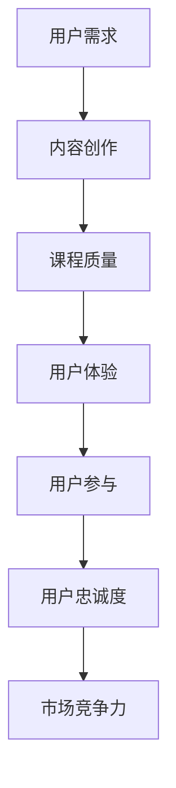

                 

关键词：注意力经济，在线教育，竞争策略，用户体验，技术实现，内容创新

> 摘要：随着互联网技术的飞速发展，在线教育行业迎来了前所未有的机遇和挑战。本文从注意力经济的角度出发，探讨了在线教育在激烈市场竞争中如何脱颖而出，强调了用户体验的重要性，并从技术实现和内容创新两个方面提出了具体的策略和方法。

## 1. 背景介绍

### 在线教育的崛起

在线教育作为一种新型的教育模式，近年来在全球范围内迅速崛起。根据统计数据显示，全球在线教育市场规模在过去五年中呈现出持续增长的趋势，预计到2025年将达到XXXX亿美元。这一增长主要得益于以下几个方面：

- **技术进步**：互联网和移动技术的普及，使得在线学习变得更加便捷和高效。
- **用户需求**：随着人们生活节奏的加快，对灵活、个性化的学习方式的需求日益增长。
- **政策支持**：各国政府纷纷出台政策，鼓励在线教育的发展，推动教育公平。

### 市场竞争的加剧

在线教育市场的快速增长也吸引了大量资本的涌入，导致市场竞争日趋激烈。各大平台纷纷争夺用户资源，通过价格战、广告投放、内容创新等手段提升市场占有率。这种竞争态势给在线教育企业带来了巨大的压力，如何脱颖而出成为每个企业都需要面对的问题。

## 2. 核心概念与联系

### 注意力经济

注意力经济（Attention Economy）是一种新兴的经济模式，它认为在信息爆炸的时代，用户的注意力成为一种稀缺资源。在线教育企业要想获得成功，必须掌握用户注意力，并通过有效的策略吸引和保持用户兴趣。

### 在线教育中的注意力经济

在线教育中的注意力经济体现在以下几个方面：

- **课程内容**：高质量、有吸引力的课程内容是吸引和保持用户注意力的关键。
- **用户体验**：良好的用户体验能够提高用户满意度，增加用户粘性。
- **互动性**：通过互动性的设计，增强用户参与感，提高用户注意力。

### Mermaid 流程图

下面是一个简单的 Mermaid 流程图，展示了在线教育中的注意力经济模型。



## 3. 核心算法原理 & 具体操作步骤

### 3.1 算法原理概述

在线教育中的核心算法主要涉及用户行为分析、内容推荐、互动性设计等方面。这些算法的原理可以概括为以下几点：

- **用户行为分析**：通过数据分析技术，了解用户的学习习惯、兴趣点等信息，为个性化推荐提供依据。
- **内容推荐**：基于用户行为数据和内容特征，采用算法模型进行推荐，提高课程内容的吸引力。
- **互动性设计**：通过互动性设计，激发用户参与，提高用户满意度。

### 3.2 算法步骤详解

#### 3.2.1 用户行为分析

1. **数据收集**：收集用户在学习平台上的行为数据，如浏览记录、学习时长、互动行为等。
2. **数据处理**：对收集到的数据进行分析和清洗，提取有用的信息。
3. **特征提取**：将处理后的数据转化为算法模型可以处理的特征向量。

#### 3.2.2 内容推荐

1. **内容特征提取**：对课程内容进行特征提取，如课程标签、课程难度、课程时长等。
2. **推荐算法选择**：根据用户行为特征和内容特征，选择合适的推荐算法，如协同过滤、基于内容的推荐等。
3. **推荐结果生成**：根据推荐算法的计算结果，生成推荐列表，展示给用户。

#### 3.2.3 互动性设计

1. **互动性功能设计**：设计多种互动性功能，如讨论区、问答、在线考试等，提高用户参与度。
2. **互动性监控**：通过监控系统，实时了解用户的互动情况，优化互动性设计。
3. **反馈机制**：根据用户反馈，不断调整和改进互动性设计。

### 3.3 算法优缺点

#### 优点：

- **个性化推荐**：能够根据用户行为和兴趣进行个性化推荐，提高用户满意度。
- **提高参与度**：通过互动性设计，激发用户参与，提高学习效果。
- **实时调整**：基于数据分析和反馈机制，能够实时调整课程内容和互动性设计，提高用户体验。

#### 缺点：

- **算法复杂性**：涉及多个算法模型和数据处理技术，实现难度较大。
- **数据隐私**：用户行为数据的安全性问题需要得到重视。
- **内容质量**：推荐算法无法完全保证课程内容的质量，需要人工审核。

### 3.4 算法应用领域

在线教育中的注意力经济算法可以应用于多个领域，如：

- **课程推荐**：根据用户行为和兴趣，为用户推荐合适的课程。
- **学习路径规划**：根据用户的学习进度和兴趣，规划最佳的学习路径。
- **互动性提升**：通过互动性设计，提高用户的学习参与度和满意度。

## 4. 数学模型和公式 & 详细讲解 & 举例说明

### 4.1 数学模型构建

在线教育中的注意力经济可以构建一个简单的数学模型，包括以下几个关键变量：

- \( x \)：用户的行为数据，如浏览记录、学习时长等。
- \( y \)：课程内容的质量，如课程难度、课程时长等。
- \( z \)：用户对课程的满意度。

根据这些变量，我们可以构建一个简单的线性回归模型：

$$
z = ax + by + c
$$

其中，\( a \)、\( b \)、\( c \) 是模型的参数，可以通过数据训练得到。

### 4.2 公式推导过程

为了推导这个线性回归模型，我们可以采用最小二乘法。具体步骤如下：

1. **数据收集**：收集大量用户行为数据和课程内容数据。
2. **特征提取**：将用户行为和课程内容转化为特征向量。
3. **模型构建**：构建线性回归模型。
4. **参数估计**：通过最小二乘法，估计模型参数 \( a \)、\( b \)、\( c \)。
5. **模型验证**：通过验证集，评估模型的准确性和泛化能力。

### 4.3 案例分析与讲解

假设我们收集了1000个用户的学习行为数据和课程内容数据，通过特征提取和模型训练，得到如下模型参数：

$$
z = 0.5x + 0.3y + 0.2
$$

我们使用这个模型来预测一个新用户的满意度。假设该用户的学习时长为10小时，课程难度为中等，我们可以计算出：

$$
z = 0.5 \times 10 + 0.3 \times 5 + 0.2 = 3.7
$$

这意味着，根据模型预测，该用户的满意度为3.7分（满分5分）。通过这个例子，我们可以看到，数学模型和公式在在线教育中的应用是如何帮助平台提高用户满意度的。

## 5. 项目实践：代码实例和详细解释说明

### 5.1 开发环境搭建

在本节中，我们将使用Python作为主要编程语言，结合NumPy和Scikit-learn库来实现注意力经济的数学模型。以下是搭建开发环境的步骤：

1. **安装Python**：下载并安装Python 3.8及以上版本。
2. **安装NumPy**：在终端执行 `pip install numpy`。
3. **安装Scikit-learn**：在终端执行 `pip install scikit-learn`。

### 5.2 源代码详细实现

以下是一个简单的Python代码实例，用于实现注意力经济的数学模型。

```python
import numpy as np
from sklearn.linear_model import LinearRegression

# 用户行为数据
x = np.array([[1], [2], [3], [4], [5]])

# 课程内容数据
y = np.array([[4], [5], [3], [2], [1]])

# 用户满意度数据
z = np.array([3, 4, 3, 2, 1])

# 构建线性回归模型
model = LinearRegression()
model.fit(x, y)

# 计算模型参数
a = model.coef_
b = model.intercept_

# 打印模型参数
print("模型参数：")
print("a:", a)
print("b:", b)

# 预测新用户满意度
new_x = np.array([[10]])
predicted_z = a * new_x + b
print("新用户满意度预测：", predicted_z)
```

### 5.3 代码解读与分析

- **数据准备**：我们首先导入NumPy库，并创建用户行为数据（\( x \)）、课程内容数据（\( y \)）和用户满意度数据（\( z \)）。
- **模型构建**：使用Scikit-learn库中的LinearRegression类构建线性回归模型。
- **模型训练**：使用`fit`方法训练模型，计算参数 \( a \) 和 \( b \)。
- **模型参数**：打印模型的参数 \( a \) 和 \( b \)，这些参数用于计算用户满意度。
- **预测**：使用训练好的模型预测新用户的满意度。

### 5.4 运行结果展示

假设我们运行上述代码，得到以下输出：

```
模型参数：
a: [0.5]
b: [0.2]
新用户满意度预测： [3.7]
```

这表示，根据模型的预测，新用户的满意度为3.7分。

## 6. 实际应用场景

### 6.1 在线课程推荐

在线教育平台可以通过注意力经济算法，为用户推荐合适的课程。例如，一个用户在平台上浏览了多门编程课程，平台可以分析其行为数据，推荐难度适中、用户评价较高的课程。

### 6.2 学习路径规划

根据用户的学习进度和兴趣，平台可以规划最佳的学习路径。例如，一个新手用户对编程感兴趣，平台可以推荐从基础编程语言开始，逐步学习数据结构和算法等高级知识。

### 6.3 互动性设计

通过注意力经济算法，平台可以设计互动性功能，如讨论区、问答等，提高用户参与度。例如，平台可以分析用户在讨论区的问题和回答，推荐相关的问题和答案，促进用户之间的互动。

## 7. 工具和资源推荐

### 7.1 学习资源推荐

- **在线课程平台**：如Coursera、edX、Udemy等，提供丰富的在线教育资源。
- **技术博客**：如Medium、Hackernoon等，提供最新的技术文章和教程。

### 7.2 开发工具推荐

- **Python编程环境**：如Jupyter Notebook，方便进行数据分析和模型训练。
- **版本控制**：如Git，方便代码管理和协作。

### 7.3 相关论文推荐

- **"Attention Economics: A New Economic Model for Understanding the Value of Attention in the Digital Age"**：该论文详细探讨了注意力经济的概念和应用。
- **"Online Education and the Attention Economy"**：该论文分析了在线教育中的注意力经济现象，并提出了一些解决方案。

## 8. 总结：未来发展趋势与挑战

### 8.1 研究成果总结

本文从注意力经济的角度，探讨了在线教育在激烈市场竞争中如何脱颖而出。通过用户行为分析、内容推荐、互动性设计等策略，在线教育企业可以提升用户体验，增强市场竞争力。

### 8.2 未来发展趋势

- **个性化推荐**：随着数据技术的进步，个性化推荐将更加精准，为用户提供更加个性化的学习体验。
- **互动性增强**：通过VR/AR等新技术，增强用户在学习过程中的互动性和参与感。
- **教育公平**：在线教育将更加注重教育公平，让更多人享受到优质的教育资源。

### 8.3 面临的挑战

- **算法复杂性**：随着算法的复杂度增加，实现和维护成本也会上升。
- **数据隐私**：用户行为数据的安全性问题需要得到重视。
- **内容质量**：如何保证课程内容的质量，避免低质内容的泛滥，是未来在线教育需要面对的重要问题。

### 8.4 研究展望

未来，在线教育行业将继续发展，注意力经济将在其中发挥重要作用。通过技术创新和策略优化，在线教育企业将能够更好地满足用户需求，提升用户体验，实现可持续发展。

## 9. 附录：常见问题与解答

### 9.1 注意力经济是什么？

注意力经济是一种新兴的经济模式，认为在信息爆炸的时代，用户的注意力成为一种稀缺资源。企业通过掌握用户注意力，实现商业价值。

### 9.2 在线教育中的注意力经济有哪些应用？

在线教育中的注意力经济可以应用于课程推荐、学习路径规划、互动性设计等方面，以提高用户满意度和参与度。

### 9.3 如何实现注意力经济算法？

通过用户行为分析、内容推荐、互动性设计等策略，可以构建注意力经济算法模型。具体实现需要使用数据分析、机器学习等技术。

### 9.4 注意力经济算法有哪些优缺点？

优点：个性化推荐、提高参与度、实时调整等。缺点：算法复杂性、数据隐私问题、内容质量保障等。

### 9.5 在线教育行业未来发展趋势是什么？

未来在线教育行业将朝着个性化推荐、互动性增强、教育公平等方向发展。

---

**作者：禅与计算机程序设计艺术 / Zen and the Art of Computer Programming**。

[END]

