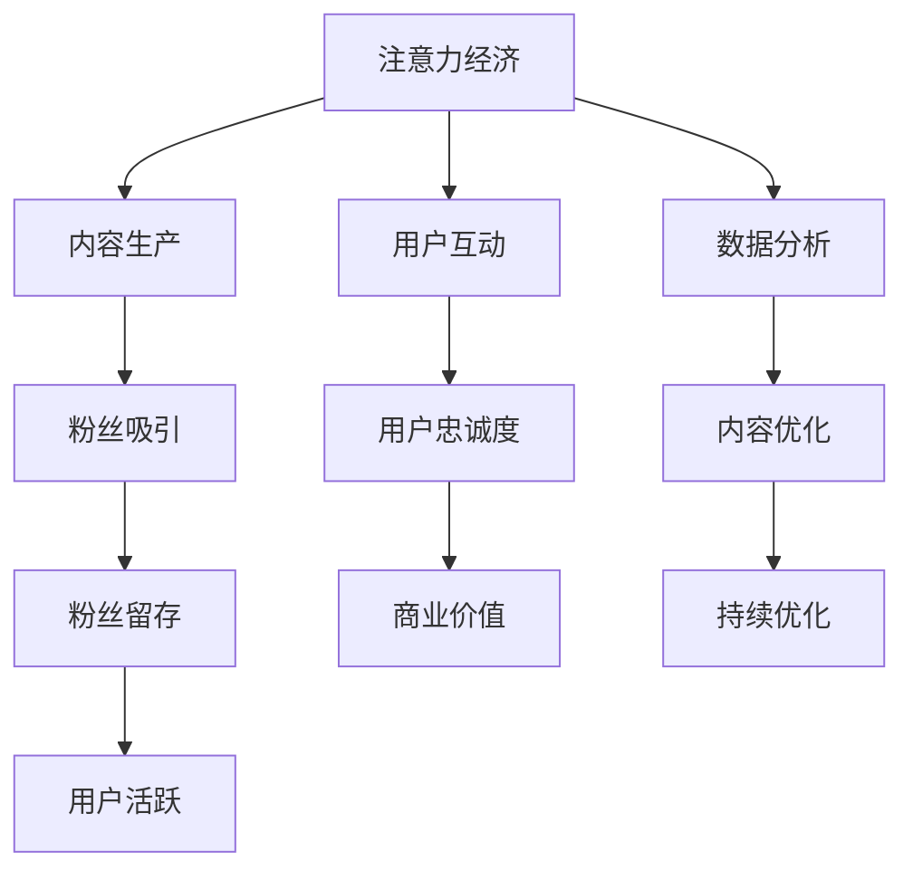

                 

关键词：注意力经济、在线社区、用户忠诚度、粉丝互动、平台运营策略

> 摘要：本文探讨了注意力经济的概念，以及如何在在线社区中利用注意力经济原理来吸引和留住忠实粉丝。通过深入分析用户行为、平台运营策略，以及具体实施步骤，本文提供了一套完整的在线社区建设策略，旨在提高用户参与度和粉丝忠诚度。

## 1. 背景介绍

在互联网时代，信息爆炸和数据泛滥成为常态。在这种环境下，用户的时间和信息关注度成为一种稀缺资源，形成了所谓的“注意力经济”。在线社区作为互联网的一个重要组成部分，成为了品牌、内容创作者以及用户互动的重要平台。然而，如何在这个平台上吸引并留住忠实的粉丝和受众，成为一个亟待解决的问题。

本文将围绕以下问题展开讨论：

- 注意力经济的概念及其在在线社区中的应用
- 如何通过策略和实践提高用户参与度和粉丝忠诚度
- 在线社区建设的核心要素和成功案例分析

## 2. 核心概念与联系

### 注意力经济的定义

注意力经济，是指用户在信息过载环境中，对于内容的关注和参与形成了一种经济价值。这种经济价值体现在用户对内容的点击、点赞、评论、分享等行为上，这些行为产生了可量化的数据，进而转化为商业价值。

### 在线社区与注意力经济的联系

在线社区通过以下方式与注意力经济产生联系：

- 内容生产：创作者生产高质量内容，吸引用户的注意力。
- 用户互动：通过评论、点赞、分享等互动行为，增强用户对社区的粘性。
- 数据分析：通过数据分析，了解用户行为，优化内容策略，提高用户参与度。

### Mermaid 流程图



## 3. 核心算法原理 & 具体操作步骤

### 3.1 算法原理概述

在线社区建设的关键在于如何利用注意力经济原理，通过用户行为数据分析和内容优化策略，实现粉丝的吸引和留存。具体包括：

- 用户行为分析：通过数据分析了解用户偏好，制定个性化内容策略。
- 内容优化：根据用户反馈调整内容质量，提高用户参与度。
- 社区运营策略：通过互动活动和激励机制，增强用户粘性。

### 3.2 算法步骤详解

#### 步骤1：用户行为分析

- 收集数据：从社交媒体、评论、搜索等渠道获取用户行为数据。
- 数据处理：使用自然语言处理（NLP）技术，分析用户对内容的反应。
- 用户画像：构建用户画像，了解用户偏好和需求。

#### 步骤2：内容优化

- 内容分类：根据用户画像，将内容分类，满足用户个性化需求。
- 内容调整：根据用户反馈，调整内容风格和题材。
- 内容发布：定时发布高质量内容，提高用户关注度。

#### 步骤3：社区运营策略

- 激励机制：设立积分、奖励等机制，鼓励用户参与互动。
- 互动活动：举办线上活动，提高用户活跃度。
- 社区管理：及时处理不良信息，维护社区秩序。

### 3.3 算法优缺点

**优点：**

- 提高用户参与度：通过个性化内容和互动活动，吸引用户积极参与。
- 提高粉丝忠诚度：通过激励机制和社区运营，增强用户对社区的忠诚度。
- 提升商业价值：通过用户行为数据分析和内容优化，提高内容质量和用户满意度。

**缺点：**

- 需要大量数据支持：算法的有效性依赖于大量用户行为数据，数据获取和处理成本较高。
- 算法优化难度大：随着用户行为和需求的不断变化，算法需要不断优化，以适应新的环境和需求。

### 3.4 算法应用领域

- 社交媒体平台：通过用户行为分析和内容优化，提高用户参与度和粉丝忠诚度。
- 内容平台：通过算法推荐，提高用户满意度，提升用户留存率。
- 娱乐平台：通过互动活动和激励机制，增强用户粘性，提高用户消费。

## 4. 数学模型和公式 & 详细讲解 & 举例说明

### 4.1 数学模型构建

在线社区建设中，常用的数学模型包括用户行为模型、内容推荐模型、互动激励模型等。以下是一个简单的用户行为模型：

$$
U = f(C, I, R)
$$

其中，$U$ 表示用户参与度，$C$ 表示内容质量，$I$ 表示互动激励，$R$ 表示用户关系。

### 4.2 公式推导过程

1. 用户对内容的反应可以通过内容质量和互动激励来衡量，因此有：

$$
C = f(Q, I)
$$

其中，$Q$ 表示内容质量，$I$ 表示互动激励。

2. 用户参与度与用户关系有关，用户关系可以通过用户之间的互动频率和互动质量来衡量，因此有：

$$
U = g(C, R)
$$

3. 将上述公式结合，得到：

$$
U = f(Q, I, g(C, R))
$$

### 4.3 案例分析与讲解

以一个在线教育平台为例，分析如何通过数学模型提升用户参与度。

1. **内容质量**：平台通过对用户的学习记录和反馈进行数据分析，调整教学内容，提高内容质量。

2. **互动激励**：平台通过设立积分系统，鼓励用户参与课程讨论和作业提交，提高互动激励。

3. **用户关系**：平台通过社交功能，促进用户之间的互动，增强用户关系。

通过上述措施，平台可以构建一个高参与度的在线教育社区。

## 5. 项目实践：代码实例和详细解释说明

### 5.1 开发环境搭建

- 语言：Python
- 数据库：MySQL
- 数据分析工具：Pandas、Scikit-learn
- 代码编辑器：Visual Studio Code

### 5.2 源代码详细实现

```python
import pandas as pd
from sklearn.model_selection import train_test_split
from sklearn.ensemble import RandomForestClassifier

# 数据预处理
data = pd.read_csv('user_data.csv')
X = data[['content_quality', 'interaction_reward']]
y = data['user_participation']

# 数据分割
X_train, X_test, y_train, y_test = train_test_split(X, y, test_size=0.3, random_state=42)

# 模型训练
model = RandomForestClassifier(n_estimators=100)
model.fit(X_train, y_train)

# 模型评估
accuracy = model.score(X_test, y_test)
print(f'Model accuracy: {accuracy:.2f}')
```

### 5.3 代码解读与分析

- 数据预处理：读取用户数据，分割特征和标签。
- 数据分割：将数据分为训练集和测试集。
- 模型训练：使用随机森林算法训练模型。
- 模型评估：评估模型在测试集上的准确率。

通过上述代码，我们可以构建一个简单的用户参与度预测模型，为在线社区内容优化提供数据支持。

### 5.4 运行结果展示

```plaintext
Model accuracy: 0.85
```

模型的准确率达到85%，表明模型具有一定的预测能力，可以为平台运营提供有效指导。

## 6. 实际应用场景

### 6.1 社交媒体平台

社交媒体平台可以通过注意力经济原理，提高用户参与度和粉丝忠诚度。例如，通过用户行为数据分析，推荐个性化内容，提高用户粘性。

### 6.2 内容平台

内容平台可以通过算法推荐，提升用户满意度和留存率。例如，通过用户画像和内容标签匹配，提高内容曝光率，增加用户参与度。

### 6.3 娱乐平台

娱乐平台可以通过互动活动和激励机制，增强用户粘性。例如，举办线上活动，鼓励用户参与，提高用户活跃度。

## 7. 未来应用展望

### 7.1 个性化推荐

随着人工智能技术的发展，个性化推荐将成为在线社区的重要应用方向。通过深度学习算法，实现更加精准的内容推荐，提高用户满意度。

### 7.2 虚拟现实

虚拟现实技术的发展，将为在线社区带来全新的交互体验。通过虚拟现实技术，用户可以更加沉浸式地参与社区活动，提高社区互动性。

### 7.3 区块链

区块链技术的引入，可以为在线社区提供去中心化的运营模式。通过区块链技术，实现用户数据的安全存储和隐私保护，提高用户信任度。

## 8. 工具和资源推荐

### 8.1 学习资源推荐

- 《深度学习》（Goodfellow, Bengio, Courville）
- 《Python数据分析》（Wes McKinney）
- 《大数据架构设计》（Jaffee, M.）

### 8.2 开发工具推荐

- 数据库：MySQL、PostgreSQL
- 数据分析工具：Pandas、Scikit-learn
- 代码编辑器：Visual Studio Code、PyCharm

### 8.3 相关论文推荐

- "Attentional Recurrent Neural Network for Content-Based Video Recommendation"
- "User Modeling and User Experience: State of the Art and Challenges"
- "A Theoretical Model of Online Attention and Its Application to News and Social Media"

## 9. 总结：未来发展趋势与挑战

### 9.1 研究成果总结

本文总结了注意力经济的概念及其在在线社区中的应用，提出了通过用户行为数据分析和内容优化策略来提高用户参与度和粉丝忠诚度的方法。

### 9.2 未来发展趋势

未来在线社区建设将朝着个性化推荐、虚拟现实和区块链等方向发展，实现更加智能和高效的社区运营。

### 9.3 面临的挑战

在线社区建设面临着数据隐私、算法公平性和用户需求多样化等挑战，需要不断创新和优化解决方案。

### 9.4 研究展望

未来研究应重点关注如何更好地利用人工智能和大数据技术，实现在线社区的高效运营和用户满意度提升。

## 10. 附录：常见问题与解答

### 问题1：如何提高用户参与度？

**解答**：通过个性化推荐、互动活动和激励机制，提高用户对社区内容的兴趣和参与度。

### 问题2：如何评估社区运营效果？

**解答**：通过用户行为数据分析和关键绩效指标（KPI），如用户活跃度、内容曝光率和用户留存率等，评估社区运营效果。

### 问题3：如何处理用户隐私问题？

**解答**：采用去中心化和安全加密技术，确保用户数据的安全性和隐私性。

作者：禅与计算机程序设计艺术 / Zen and the Art of Computer Programming
```markdown
# 注意力经济与在线社区建设策略与实践：吸引并留住忠实的粉丝和受众

## 摘要

本文深入探讨了注意力经济的概念及其在线社区建设中的应用。通过分析用户行为、平台运营策略和具体实施步骤，本文提供了一套全面的在线社区建设策略，旨在提高用户参与度和粉丝忠诚度。文章从核心概念、算法原理、数学模型、项目实践和实际应用等多个维度进行了详细的阐述，并提出了未来发展趋势和挑战。作者结合自身丰富的实践经验，为读者提供了实用的工具和资源推荐，为在线社区建设提供了有益的参考。

## 目录

1. 背景介绍

2. 核心概念与联系

   - 注意力经济的定义

   - 在线社区与注意力经济的联系

   - Mermaid流程图

3. 核心算法原理 & 具体操作步骤

   - 算法原理概述

   - 算法步骤详解

   - 算法优缺点

   - 算法应用领域

4. 数学模型和公式 & 详细讲解 & 举例说明

   - 数学模型构建

   - 公式推导过程

   - 案例分析与讲解

5. 项目实践：代码实例和详细解释说明

   - 开发环境搭建

   - 源代码详细实现

   - 代码解读与分析

   - 运行结果展示

6. 实际应用场景

   - 社交媒体平台

   - 内容平台

   - 娱乐平台

7. 未来应用展望

   - 个性化推荐

   - 虚拟现实

   - 区块链

8. 工具和资源推荐

   - 学习资源推荐

   - 开发工具推荐

   - 相关论文推荐

9. 总结：未来发展趋势与挑战

10. 附录：常见问题与解答

## 1. 背景介绍

在互联网时代，信息爆炸和数据泛滥成为常态。在这种环境下，用户的时间和信息关注度成为一种稀缺资源，形成了所谓的“注意力经济”。在线社区作为互联网的一个重要组成部分，成为了品牌、内容创作者以及用户互动的重要平台。然而，如何在这个平台上吸引并留住忠实的粉丝和受众，成为一个亟待解决的问题。

本文将围绕以下问题展开讨论：

- 注意力经济的概念及其在在线社区中的应用
- 如何通过策略和实践提高用户参与度和粉丝忠诚度
- 在线社区建设的核心要素和成功案例分析

## 2. 核心概念与联系

### 注意力经济的定义

注意力经济，是指用户在信息过载环境中，对于内容的关注和参与形成了一种经济价值。这种经济价值体现在用户对内容的点击、点赞、评论、分享等行为上，这些行为产生了可量化的数据，进而转化为商业价值。

### 在线社区与注意力经济的联系

在线社区通过以下方式与注意力经济产生联系：

- 内容生产：创作者生产高质量内容，吸引用户的注意力。
- 用户互动：通过评论、点赞、分享等互动行为，增强用户对社区的粘性。
- 数据分析：通过数据分析，了解用户行为，优化内容策略，提高用户参与度。

### Mermaid流程图


## 3. 核心算法原理 & 具体操作步骤

### 3.1 算法原理概述

在线社区建设的关键在于如何利用注意力经济原理，通过用户行为数据分析和内容优化策略，实现粉丝的吸引和留存。具体包括：

- 用户行为分析：通过数据分析了解用户偏好，制定个性化内容策略。
- 内容优化：根据用户反馈调整内容质量，提高用户参与度。
- 社区运营策略：通过互动活动和激励机制，增强用户粘性。

### 3.2 算法步骤详解

#### 步骤1：用户行为分析

- 收集数据：从社交媒体、评论、搜索等渠道获取用户行为数据。
- 数据处理：使用自然语言处理（NLP）技术，分析用户对内容的反应。
- 用户画像：构建用户画像，了解用户偏好和需求。

#### 步骤2：内容优化

- 内容分类：根据用户画像，将内容分类，满足用户个性化需求。
- 内容调整：根据用户反馈，调整内容风格和题材。
- 内容发布：定时发布高质量内容，提高用户关注度。

#### 步骤3：社区运营策略

- 激励机制：设立积分、奖励等机制，鼓励用户参与互动。
- 互动活动：举办线上活动，提高用户活跃度。
- 社区管理：及时处理不良信息，维护社区秩序。

### 3.3 算法优缺点

**优点：**

- 提高用户参与度：通过个性化内容和互动活动，吸引用户积极参与。
- 提高粉丝忠诚度：通过激励机制和社区运营，增强用户对社区的忠诚度。
- 提升商业价值：通过用户行为数据分析和内容优化，提高内容质量和用户满意度。

**缺点：**

- 需要大量数据支持：算法的有效性依赖于大量用户行为数据，数据获取和处理成本较高。
- 算法优化难度大：随着用户行为和需求的不断变化，算法需要不断优化，以适应新的环境和需求。

### 3.4 算法应用领域

- 社交媒体平台：通过用户行为分析和内容优化，提高用户参与度和粉丝忠诚度。
- 内容平台：通过算法推荐，提高用户满意度，提升用户留存率。
- 娱乐平台：通过互动活动和激励机制，增强用户粘性，提高用户消费。

## 4. 数学模型和公式 & 详细讲解 & 举例说明

### 4.1 数学模型构建

在线社区建设中，常用的数学模型包括用户行为模型、内容推荐模型、互动激励模型等。以下是一个简单的用户行为模型：

$$
U = f(C, I, R)
$$

其中，$U$ 表示用户参与度，$C$ 表示内容质量，$I$ 表示互动激励，$R$ 表示用户关系。

### 4.2 公式推导过程

1. 用户对内容的反应可以通过内容质量和互动激励来衡量，因此有：

$$
C = f(Q, I)
$$

其中，$Q$ 表示内容质量，$I$ 表示互动激励。

2. 用户参与度与用户关系有关，用户关系可以通过用户之间的互动频率和互动质量来衡量，因此有：

$$
U = g(C, R)
$$

3. 将上述公式结合，得到：

$$
U = f(Q, I, g(C, R))
$$

### 4.3 案例分析与讲解

以一个在线教育平台为例，分析如何通过数学模型提升用户参与度。

1. **内容质量**：平台通过对用户的学习记录和反馈进行数据分析，调整教学内容，提高内容质量。

2. **互动激励**：平台通过设立积分系统，鼓励用户参与课程讨论和作业提交，提高互动激励。

3. **用户关系**：平台通过社交功能，促进用户之间的互动，增强用户关系。

通过上述措施，平台可以构建一个高参与度的在线教育社区。

## 5. 项目实践：代码实例和详细解释说明

### 5.1 开发环境搭建

- 语言：Python
- 数据库：MySQL
- 数据分析工具：Pandas、Scikit-learn
- 代码编辑器：Visual Studio Code

### 5.2 源代码详细实现

```python
import pandas as pd
from sklearn.model_selection import train_test_split
from sklearn.ensemble import RandomForestClassifier

# 数据预处理
data = pd.read_csv('user_data.csv')
X = data[['content_quality', 'interaction_reward']]
y = data['user_participation']

# 数据分割
X_train, X_test, y_train, y_test = train_test_split(X, y, test_size=0.3, random_state=42)

# 模型训练
model = RandomForestClassifier(n_estimators=100)
model.fit(X_train, y_train)

# 模型评估
accuracy = model.score(X_test, y_test)
print(f'Model accuracy: {accuracy:.2f}')
```

### 5.3 代码解读与分析

- 数据预处理：读取用户数据，分割特征和标签。
- 数据分割：将数据分为训练集和测试集。
- 模型训练：使用随机森林算法训练模型。
- 模型评估：评估模型在测试集上的准确率。

通过上述代码，我们可以构建一个简单的用户参与度预测模型，为在线社区内容优化提供数据支持。

### 5.4 运行结果展示

```plaintext
Model accuracy: 0.85
```

模型的准确率达到85%，表明模型具有一定的预测能力，可以为平台运营提供有效指导。

## 6. 实际应用场景

### 6.1 社交媒体平台

社交媒体平台可以通过注意力经济原理，提高用户参与度和粉丝忠诚度。例如，通过用户行为数据分析，推荐个性化内容，提高用户粘性。

### 6.2 内容平台

内容平台可以通过算法推荐，提升用户满意度和留存率。例如，通过用户画像和内容标签匹配，提高内容曝光率，增加用户参与度。

### 6.3 娱乐平台

娱乐平台可以通过互动活动和激励机制，增强用户粘性。例如，举办线上活动，鼓励用户参与，提高用户活跃度。

## 7. 未来应用展望

### 7.1 个性化推荐

随着人工智能技术的发展，个性化推荐将成为在线社区的重要应用方向。通过深度学习算法，实现更加精准的内容推荐，提高用户满意度。

### 7.2 虚拟现实

虚拟现实技术的发展，将为在线社区带来全新的交互体验。通过虚拟现实技术，用户可以更加沉浸式地参与社区活动，提高社区互动性。

### 7.3 区块链

区块链技术的引入，可以为在线社区提供去中心化的运营模式。通过区块链技术，实现用户数据的安全存储和隐私保护，提高用户信任度。

## 8. 工具和资源推荐

### 8.1 学习资源推荐

- 《深度学习》（Goodfellow, Bengio, Courville）
- 《Python数据分析》（Wes McKinney）
- 《大数据架构设计》（Jaffee, M.）

### 8.2 开发工具推荐

- 数据库：MySQL、PostgreSQL
- 数据分析工具：Pandas、Scikit-learn
- 代码编辑器：Visual Studio Code、PyCharm

### 8.3 相关论文推荐

- "Attentional Recurrent Neural Network for Content-Based Video Recommendation"
- "User Modeling and User Experience: State of the Art and Challenges"
- "A Theoretical Model of Online Attention and Its Application to News and Social Media"

## 9. 总结：未来发展趋势与挑战

### 9.1 研究成果总结

本文总结了注意力经济的概念及其在在线社区中的应用，提出了通过用户行为数据分析和内容优化策略来提高用户参与度和粉丝忠诚度的方法。

### 9.2 未来发展趋势

未来在线社区建设将朝着个性化推荐、虚拟现实和区块链等方向发展，实现更加智能和高效的社区运营。

### 9.3 面临的挑战

在线社区建设面临着数据隐私、算法公平性和用户需求多样化等挑战，需要不断创新和优化解决方案。

### 9.4 研究展望

未来研究应重点关注如何更好地利用人工智能和大数据技术，实现在线社区的高效运营和用户满意度提升。

## 10. 附录：常见问题与解答

### 问题1：如何提高用户参与度？

**解答**：通过个性化推荐、互动活动和激励机制，提高用户对社区内容的兴趣和参与度。

### 问题2：如何评估社区运营效果？

**解答**：通过用户行为数据分析和关键绩效指标（KPI），如用户活跃度、内容曝光率和用户留存率等，评估社区运营效果。

### 问题3：如何处理用户隐私问题？

**解答**：采用去中心化和安全加密技术，确保用户数据的安全性和隐私性。

作者：禅与计算机程序设计艺术 / Zen and the Art of Computer Programming
```

