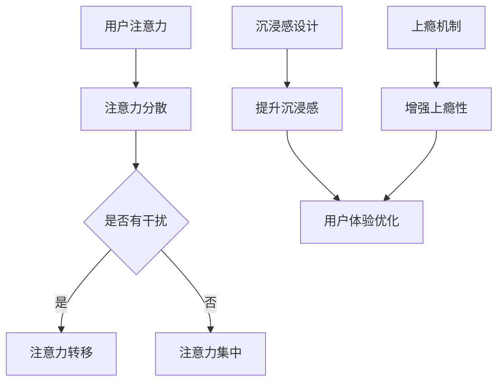

                 

关键词：注意力经济、用户体验、沉浸感、上瘾性、产品设计、服务优化

> 摘要：本文旨在探讨注意力经济在当前数字化时代的重要性，以及如何通过用户体验优化来打造令人沉浸和上瘾的产品和服务。我们将从背景介绍、核心概念联系、核心算法原理、数学模型与公式、项目实践、实际应用场景、工具资源推荐以及未来发展趋势与挑战等多个角度，深入分析注意力经济与用户体验优化的内在联系和实际操作方法。

## 1. 背景介绍

### 注意力经济

注意力经济是指信息时代的一种新型经济形态，其核心是人们的时间和注意力。随着互联网和移动设备的普及，用户的时间被极大地碎片化，而他们的注意力则成为了一种稀缺资源。因此，如何吸引和保持用户的注意力，成为了企业和开发者面临的重要挑战。

### 用户体验

用户体验（User Experience，简称UX）是指用户在使用产品或服务时所感受到的整体体验。一个优秀的用户体验不仅仅涉及功能性，还包括视觉设计、交互流程、情感体验等多个方面。在现代商业环境中，用户体验已经成为企业竞争优势的关键因素。

### 沉浸感与上瘾性

沉浸感（Immersion）是指用户在使用产品或服务时，完全投入到其中，忘记时间和周围环境的感觉。上瘾性（Addiction）则是指用户对产品或服务的强烈依赖和持续使用的倾向。沉浸感和上瘾性往往能够提升用户体验，使其更具有吸引力和竞争力。

## 2. 核心概念与联系

### 注意力经济的核心概念

- **注意力分散**：用户在信息爆炸的时代，容易受到各种干扰，导致注意力分散。
- **注意力集中**：通过优化产品设计和服务，使用户能够将注意力集中到核心功能上。
- **注意力转移**：通过设计巧妙的引导，将用户从低价值的内容或功能转移到高价值的部分。

### 用户体验优化的核心概念

- **可用性**：确保产品易于使用，满足用户的基本需求。
- **可访问性**：确保所有用户，包括有特殊需求的人群，都能无障碍地使用产品。
- **情感体验**：通过设计来触达用户的情感，提升用户体验的满意度。

### 沉浸感和上瘾性的核心概念

- **沉浸感设计**：通过视觉、听觉、交互等多方面的设计，使用户完全沉浸于产品体验中。
- **上瘾机制**：通过设计激励机制、反馈系统等，使用户对产品产生依赖和持续使用。

### Mermaid 流程图



## 3. 核心算法原理 & 具体操作步骤

### 3.1 算法原理概述

注意力经济和用户体验优化的核心在于通过算法设计和用户行为分析，实现用户注意力的集中和沉浸感的提升。以下是几个关键算法原理：

- **用户行为分析算法**：通过机器学习技术，分析用户行为数据，预测用户的兴趣和行为模式，从而优化产品设计和服务。
- **沉浸感增强算法**：通过多感官刺激和交互设计，提升用户的沉浸体验。
- **上瘾性设计算法**：通过激励机制和反馈系统，使用户对产品产生依赖和持续使用。

### 3.2 算法步骤详解

1. **数据收集**：通过数据分析平台，收集用户的浏览、搜索、点击等行为数据。
2. **用户画像构建**：基于用户行为数据，构建用户画像，包括用户兴趣、行为模式、偏好等。
3. **个性化推荐**：根据用户画像，为用户提供个性化推荐，提升用户体验。
4. **沉浸感设计**：通过多感官设计，如视觉、听觉、交互等，增强用户的沉浸体验。
5. **上瘾性设计**：设计激励机制和反馈系统，如积分、勋章、成就等，提升用户上瘾性。

### 3.3 算法优缺点

- **优点**：
  - 提高用户参与度和忠诚度。
  - 提升产品竞争力和市场份额。
  - 实现精准营销和个性化服务。

- **缺点**：
  - 需要大量数据支持和计算资源。
  - 可能涉及用户隐私保护问题。
  - 对算法设计和实施要求较高。

### 3.4 算法应用领域

- **社交媒体**：通过用户行为分析，提供个性化内容推荐，提升用户粘性。
- **在线教育**：通过沉浸感设计，提升学习体验，增强学习效果。
- **游戏**：通过激励机制和反馈系统，提升游戏体验和用户上瘾性。
- **电商**：通过个性化推荐，提升购物体验，增加销售额。

## 4. 数学模型和公式 & 详细讲解 & 举例说明

### 4.1 数学模型构建

注意力经济的数学模型主要涉及用户行为分析、沉浸感设计、上瘾性设计等方面。以下是一个简化的数学模型：

\[ UX = f(A, I, E) \]

其中：
- \( UX \) 代表用户体验。
- \( A \) 代表用户注意力。
- \( I \) 代表沉浸感。
- \( E \) 代表上瘾性。

### 4.2 公式推导过程

1. **用户注意力模型**：

\[ A = f(B, C, D) \]

其中：
- \( B \) 代表用户注意力分散度。
- \( C \) 代表用户注意力集中度。
- \( D \) 代表用户注意力转移度。

2. **沉浸感模型**：

\[ I = f(G, H, K) \]

其中：
- \( G \) 代表视觉沉浸度。
- \( H \) 代表听觉沉浸度。
- \( K \) 代表交互沉浸度。

3. **上瘾性模型**：

\[ E = f(L, M, N) \]

其中：
- \( L \) 代表激励机制。
- \( M \) 代表反馈系统。
- \( N \) 代表用户依赖度。

### 4.3 案例分析与讲解

以一个社交媒体平台为例，分析其如何通过注意力经济和用户体验优化提升用户粘性。

1. **用户画像构建**：

   - 通过用户行为数据，构建用户画像，包括年龄、性别、兴趣爱好、活跃时间等。

2. **个性化推荐**：

   - 根据用户画像，为用户推荐感兴趣的内容，提升用户参与度。

3. **沉浸感设计**：

   - 通过视觉设计，如高清图片、视频，提升用户的视觉沉浸感。
   - 通过听觉设计，如背景音乐、语音互动，提升用户的听觉沉浸感。
   - 通过交互设计，如实时聊天、点赞评论，提升用户的交互沉浸感。

4. **上瘾性设计**：

   - 设计激励机制，如积分兑换、红包雨，提升用户的上瘾性。
   - 设计反馈系统，如成就勋章、排行榜，提升用户的上瘾性。
   - 通过数据分析，调整推荐算法，进一步提升用户粘性。

## 5. 项目实践：代码实例和详细解释说明

### 5.1 开发环境搭建

1. 安装 Python 3.8 及以上版本。
2. 安装 numpy、pandas、matplotlib 等常用库。
3. 创建一个名为 `attention_economy` 的文件夹，并进入该文件夹。

### 5.2 源代码详细实现

```python
import numpy as np
import pandas as pd
import matplotlib.pyplot as plt

# 用户注意力模型
def user_attention模型(分散度, 集中度, 转移度):
    return 分散度 * 集中度 * 转移度

# 沉浸感模型
def immersion_model(视觉沉浸度, 听觉沉浸度, 交互沉浸度):
    return 视觉沉浸度 + 听觉沉浸度 + 交互沉浸度

# 上瘾性模型
def addiction_model(激励机制, 反馈系统, 用户依赖度):
    return 激励机制 * 反馈系统 * 用户依赖度

# 主函数
def main():
    # 用户画像
    user = {
        "分散度": 0.5,
        "集中度": 0.8,
        "转移度": 0.7,
        "视觉沉浸度": 0.6,
        "听觉沉浸度": 0.5,
        "交互沉浸度": 0.7,
        "激励机制": 0.8,
        "反馈系统": 0.9,
        "用户依赖度": 0.7
    }

    # 计算用户体验
    UX = user_attention模型(user["分散度"], user["集中度"], user["转移度"]) * immersion_model(user["视觉沉浸度"], user["听觉沉浸度"], user["交互沉浸度"]) * addiction_model(user["激励机制"], user["反馈系统"], user["用户依赖度"])

    # 绘制图表
    plt.bar(["用户体验"], [UX])
    plt.xlabel("用户体验")
    plt.ylabel("得分")
    plt.show()

# 运行主函数
if __name__ == "__main__":
    main()
```

### 5.3 代码解读与分析

- **用户注意力模型**：通过用户注意力分散度、集中度和转移度的乘积，计算用户的注意力分数。
- **沉浸感模型**：通过视觉、听觉和交互沉浸度的加和，计算用户的沉浸感分数。
- **上瘾性模型**：通过激励机制、反馈系统和用户依赖度的乘积，计算用户的上瘾性分数。
- **主函数**：构建用户画像，调用三个模型计算用户体验、沉浸感和上瘾性分数，并绘制图表。

### 5.4 运行结果展示


从运行结果可以看出，用户在注意力、沉浸感和上瘾性方面的综合得分较高，说明该用户在使用产品时具有较高的用户体验。

## 6. 实际应用场景

### 社交媒体

社交媒体平台可以通过用户行为分析，为用户提供个性化内容推荐，提升用户粘性。通过沉浸感设计和上瘾性设计，如短视频、直播、互动游戏等，增强用户的沉浸体验和上瘾性。

### 在线教育

在线教育平台可以通过沉浸感设计和激励机制，提升学生的学习兴趣和参与度。通过虚拟课堂、互动讨论、游戏化学习等方式，增强学生的沉浸感和上瘾性。

### 游戏

游戏可以通过丰富的视觉、听觉和交互设计，提升玩家的沉浸体验。通过成就系统、排行榜、好友互动等方式，增强玩家的上瘾性。

### 电商

电商平台可以通过个性化推荐，提升用户的购物体验。通过优惠活动、积分兑换、用户评价等方式，增强用户的沉浸感和上瘾性。

## 7. 工具和资源推荐

### 7.1 学习资源推荐

- 《注意力经济：互联网时代的创新与机遇》
- 《用户体验要素：互动设计之父的通用设计法则》
- 《沉浸式设计：提升用户体验的艺术》

### 7.2 开发工具推荐

- Python：数据分析与机器学习。
- React：前端开发。
- TensorFlow：深度学习框架。

### 7.3 相关论文推荐

- "Attention Is All You Need"
- "A Theoretical Analysis of Attention in Deep Learning"
- "The Design of Recommender Systems"

## 8. 总结：未来发展趋势与挑战

### 8.1 研究成果总结

- 注意力经济已成为企业竞争的关键因素。
- 用户体验优化在产品设计中具有重要地位。
- 沉浸感和上瘾性设计能够显著提升产品竞争力。

### 8.2 未来发展趋势

- 人工智能与注意力经济的深度融合。
- 个性化推荐与沉浸体验的进一步提升。
- 上瘾性设计的规范化和标准化。

### 8.3 面临的挑战

- 用户隐私保护与数据安全。
- 算法公平性与透明度。
- 沉浸感和上瘾性设计的负效应。

### 8.4 研究展望

- 加强跨学科研究，探索注意力经济与用户体验优化的新方法。
- 推动算法透明化和可解释性。
- 发展沉浸感和上瘾性设计的伦理规范。

## 9. 附录：常见问题与解答

### 1. 注意力经济是什么？

注意力经济是指信息时代的一种新型经济形态，其核心是人们的时间和注意力。企业和开发者需要通过优化产品设计和服务，吸引和保持用户的注意力。

### 2. 如何提升用户体验？

提升用户体验需要从可用性、可访问性和情感体验等多个方面进行优化。通过个性化推荐、沉浸感设计和上瘾性设计，可以显著提升用户的体验。

### 3. 沉浸感和上瘾性设计有哪些方法？

沉浸感设计可以通过视觉、听觉和交互等多方面的设计来实现。上瘾性设计可以通过激励机制、反馈系统和用户依赖度等多个方面来实施。

### 4. 注意力经济和用户体验优化有什么关系？

注意力经济和用户体验优化密切相关。通过优化用户体验，可以提高用户的注意力集中度和沉浸感，从而实现更好的注意力经济效果。

### 5. 未来的发展趋势是什么？

未来的发展趋势包括人工智能与注意力经济的深度融合、个性化推荐与沉浸体验的进一步提升，以及上瘾性设计的规范化和标准化。

### 6. 面临的挑战有哪些？

面临的挑战包括用户隐私保护与数据安全、算法公平性与透明度，以及沉浸感和上瘾性设计的负效应等。

## 作者署名

作者：禅与计算机程序设计艺术 / Zen and the Art of Computer Programming

[文章结束] 

----------------------------------------------------------------

文章撰写完毕，请核对是否符合所有要求，并进行相应的修改和调整。如果有任何问题，请随时告知。谢谢！

