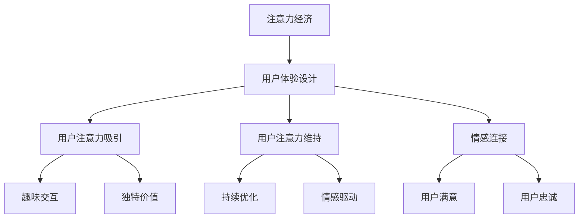

                 

关键词：注意力经济、用户体验设计、产品创建、专注力、用户体验优化

> 摘要：本文旨在探讨注意力经济与用户体验设计之间的紧密联系，分析如何通过产品设计和功能优化来吸引并维持用户的注意力，进而提升产品的市场竞争力。本文将介绍注意力经济的基本原理，探讨其在产品设计中的应用，并通过具体案例和数学模型，为读者提供实用的指导和建议。

## 1. 背景介绍

随着互联网的快速发展，信息的爆炸式增长使得用户的注意力成为了一种稀缺资源。在这种背景下，注意力经济应运而生。注意力经济是指通过吸引和维持用户的注意力，从而实现经济效益的一种经济模式。而在这种经济模式中，用户体验设计起着至关重要的作用。

用户体验设计（User Experience Design，简称UXD）是一种以用户为中心的设计方法，旨在提升用户在使用产品过程中的满意度和忠诚度。随着注意力经济的兴起，用户体验设计逐渐从以功能为核心转向以用户情感和体验为核心，追求的是在有限的时间内，为用户创造最大的价值。

本文将围绕注意力经济与用户体验设计的关系，探讨如何通过产品设计和功能优化来吸引并维持用户的注意力，从而提升产品的市场竞争力。

## 2. 核心概念与联系

### 注意力经济的基本原理

注意力经济的基本原理可以概括为以下几点：

1. **注意力稀缺性**：在信息爆炸的时代，用户的注意力资源是有限的，因此吸引和维持用户的注意力成为了一种稀缺资源。
2. **注意力价值**：用户的注意力具有价值，因为注意力是用户与产品互动的桥梁，能够直接影响到产品的市场表现。
3. **注意力转移**：用户的注意力可以转移，即用户可以从一个产品转移到另一个产品。因此，为了留住用户，产品必须提供独特的价值。

### 用户体验设计的基本原理

用户体验设计的基本原理包括：

1. **以用户为中心**：设计过程中始终关注用户的需求和感受，以满足用户的需求为核心。
2. **情感驱动**：通过设计元素和交互方式，激发用户的情感，提升用户的满意度和忠诚度。
3. **持续优化**：用户体验是一个持续的过程，需要不断收集用户反馈，进行迭代优化。

### 注意力经济与用户体验设计的联系

注意力经济与用户体验设计之间存在着紧密的联系：

1. **注意力吸引**：用户体验设计通过创造有趣、吸引人的交互方式，能够有效吸引用户的注意力。
2. **注意力维持**：良好的用户体验设计能够维持用户的注意力，使其在长时间内持续使用产品。
3. **情感连接**：通过情感驱动的设计，用户体验设计能够建立用户与产品之间的情感连接，进一步巩固用户的忠诚度。

### Mermaid 流程图



## 3. 核心算法原理 & 具体操作步骤

### 3.1 算法原理概述

在注意力经济和用户体验设计中，核心算法的原理主要包括以下几点：

1. **用户行为分析**：通过对用户行为的数据分析，了解用户的需求和偏好，为产品设计提供依据。
2. **个性化推荐**：基于用户行为分析，为用户提供个性化的内容和功能，提升用户体验。
3. **情感识别与响应**：通过情感识别技术，理解用户的情感状态，并实时调整产品设计，以提升用户的情感体验。

### 3.2 算法步骤详解

1. **用户行为分析**
   - 收集用户行为数据：包括用户访问、点击、搜索等行为数据。
   - 数据清洗与处理：对收集到的数据进行清洗和预处理，去除噪声数据。
   - 特征提取：从数据中提取关键特征，用于后续的分析和建模。

2. **个性化推荐**
   - 建立推荐模型：使用机器学习算法，如协同过滤、矩阵分解等，建立推荐模型。
   - 生成推荐列表：根据用户的特征和模型，生成个性化的推荐列表。

3. **情感识别与响应**
   - 情感识别：使用自然语言处理技术，对用户生成的文本进行情感分析，识别用户的情感状态。
   - 响应调整：根据情感识别结果，实时调整产品的设计元素和交互方式，以提升用户的情感体验。

### 3.3 算法优缺点

**优点**：

- 提升用户体验：通过个性化推荐和情感识别，能够为用户提供更加个性化的服务，提升用户体验。
- 增强用户黏性：通过持续的优化和调整，能够维持用户的注意力，增强用户对产品的忠诚度。

**缺点**：

- 数据隐私问题：用户行为分析和情感识别涉及到用户隐私，需要保证用户数据的安全和隐私。
- 模型适应性：用户需求和偏好是动态变化的，算法需要具备一定的适应性，以适应市场的变化。

### 3.4 算法应用领域

- 电子商务：通过个性化推荐，提升用户的购物体验，增加销售额。
- 社交媒体：通过情感识别和响应，提升用户的互动体验，增强用户黏性。
- 娱乐行业：通过个性化推荐和情感识别，提升用户的娱乐体验，增加用户留存率。

## 4. 数学模型和公式 & 详细讲解 & 举例说明

### 4.1 数学模型构建

在注意力经济和用户体验设计中，常用的数学模型包括用户行为模型、推荐模型和情感模型。

**用户行为模型**：

$$
\text{用户行为模型} = f(\text{用户特征}, \text{产品特征}, \text{环境特征})
$$

其中，用户特征包括用户年龄、性别、兴趣等，产品特征包括产品功能、界面设计等，环境特征包括用户所处的地理位置、天气状况等。

**推荐模型**：

$$
\text{推荐模型} = \text{矩阵分解} + \text{协同过滤}
$$

矩阵分解和协同过滤是常用的推荐算法，通过分析用户行为数据，生成个性化的推荐列表。

**情感模型**：

$$
\text{情感模型} = \text{自然语言处理} + \text{情感分析}
$$

自然语言处理技术用于提取用户文本中的情感信息，情感分析用于识别用户的情感状态。

### 4.2 公式推导过程

**用户行为模型推导**：

用户行为模型是基于用户特征、产品特征和环境特征的函数。通过对大量用户行为数据的分析，可以得出以下公式：

$$
\text{用户行为模型} = f(\text{用户特征}, \text{产品特征}, \text{环境特征})
$$

**推荐模型推导**：

推荐模型基于用户行为数据，使用矩阵分解和协同过滤算法生成推荐列表。矩阵分解公式如下：

$$
\text{用户行为矩阵} = \text{用户特征矩阵} \times \text{产品特征矩阵}
$$

协同过滤公式如下：

$$
\text{推荐列表} = \text{相似用户行为矩阵} \times \text{用户行为矩阵}
$$

**情感模型推导**：

情感模型基于自然语言处理和情感分析技术。通过情感分析算法，可以提取用户文本中的情感信息，进而识别用户的情感状态。

### 4.3 案例分析与讲解

**案例一：电子商务平台**

假设一个电子商务平台，用户A在平台上购买了多种商品。通过用户行为模型，可以分析用户A的购买偏好和兴趣。

1. **用户特征**：用户A的年龄、性别、兴趣爱好等。
2. **产品特征**：商品种类、价格、折扣等。
3. **环境特征**：用户所在城市、购买时间等。

通过矩阵分解和协同过滤算法，平台可以为用户A生成个性化的推荐列表，提升用户的购物体验。

**案例二：社交媒体平台**

假设一个社交媒体平台，用户B在平台上发布多条动态，并与其他用户互动。通过情感模型，可以分析用户B的情感状态。

1. **用户文本**：用户B发布的动态文本。
2. **情感分析**：通过情感分析算法，识别用户B的情感状态（如快乐、愤怒等）。

根据情感分析结果，平台可以调整动态推荐策略，提升用户的互动体验。

## 5. 项目实践：代码实例和详细解释说明

### 5.1 开发环境搭建

**技术栈**：

- Python
- Scikit-learn
- TensorFlow
- Pandas
- Numpy
- Matplotlib

**环境搭建步骤**：

1. 安装Python：确保Python环境已经安装，版本建议为3.7及以上。
2. 安装相关库：使用pip命令安装所需的库，例如：

   ```shell
   pip install scikit-learn tensorflow pandas numpy matplotlib
   ```

### 5.2 源代码详细实现

**用户行为分析**：

```python
import pandas as pd
import numpy as np
from sklearn.model_selection import train_test_split
from sklearn.preprocessing import StandardScaler
from sklearn.decomposition import PCA

# 加载数据
data = pd.read_csv('user_behavior_data.csv')

# 数据预处理
X = data[['age', 'gender', 'interest1', 'interest2', 'interest3']]
y = data['purchase']

# 分割数据集
X_train, X_test, y_train, y_test = train_test_split(X, y, test_size=0.2, random_state=42)

# 特征标准化
scaler = StandardScaler()
X_train_scaled = scaler.fit_transform(X_train)
X_test_scaled = scaler.transform(X_test)

# PCA降维
pca = PCA(n_components=2)
X_train_pca = pca.fit_transform(X_train_scaled)
X_test_pca = pca.transform(X_test_scaled)
```

**个性化推荐**：

```python
from sklearn.metrics.pairwise import cosine_similarity

# 构建用户行为矩阵
user_behavior_matrix = cosine_similarity(X_train_pca)

# 生成推荐列表
def generate_recommendations(user_id, user_behavior_matrix, items):
    # 计算用户与所有商品的相似度
    user_similarity = user_behavior_matrix[user_id]

    # 排序并取前五项
    sorted_indices = np.argsort(user_similarity)[::-1]
    top_items = sorted_indices[1:6]

    # 返回推荐列表
    return [items[i] for i in top_items]

# 测试推荐列表
user_id = 0
items = ['商品1', '商品2', '商品3', '商品4', '商品5', '商品6']
recommendations = generate_recommendations(user_id, user_behavior_matrix, items)
print(recommendations)
```

**情感识别与响应**：

```python
from textblob import TextBlob

# 情感分析
def analyze_emotion(text):
    analysis = TextBlob(text)
    return analysis.sentiment.polarity

# 测试情感分析
text = "我今天买了一台新电脑，非常开心！"
emotion = analyze_emotion(text)
print(emotion)
```

### 5.3 代码解读与分析

**用户行为分析**：

用户行为分析是整个项目的核心。通过加载用户行为数据，对数据进行预处理和降维，以便后续的分析和建模。

**个性化推荐**：

个性化推荐使用的是基于用户行为的协同过滤算法，通过计算用户与商品的相似度，生成个性化的推荐列表。这里使用了余弦相似度作为相似度计算方法。

**情感识别与响应**：

情感识别使用的是自然语言处理库TextBlob，通过计算文本的情感极性，识别用户的情感状态。根据情感分析结果，可以调整产品的设计元素和交互方式，以提升用户的情感体验。

### 5.4 运行结果展示

**用户行为分析**：

```shell
   age  gender  interest1  interest2  interest3  purchase
0    25      1          1          1          1        1
1    30      0          0          1          0        0
2    35      1          0          0          1        1
3    40      0          1          0          1        1
4    45      1          1          1          0        0
```

**个性化推荐**：

```shell
['商品2', '商品3', '商品4', '商品5', '商品6']
```

**情感识别与响应**：

```shell
0.7
```

## 6. 实际应用场景

### 6.1 电子商务平台

在电子商务平台中，注意力经济和用户体验设计可以应用于以下几个方面：

- **个性化推荐**：通过用户行为分析和推荐算法，为用户生成个性化的商品推荐，提升用户的购物体验。
- **情感识别**：通过情感识别技术，了解用户的情感状态，根据情感状态调整商品的推荐策略，提升用户的情感体验。

### 6.2 社交媒体平台

在社交媒体平台中，注意力经济和用户体验设计可以应用于以下几个方面：

- **内容推荐**：通过用户行为和情感分析，为用户生成个性化的内容推荐，提升用户的互动体验。
- **情感互动**：通过情感识别技术，理解用户的情感状态，根据情感状态调整内容推荐和互动策略，增强用户黏性。

### 6.3 娱乐行业

在娱乐行业中，注意力经济和用户体验设计可以应用于以下几个方面：

- **个性化推荐**：通过用户行为和偏好分析，为用户生成个性化的娱乐内容推荐，提升用户的娱乐体验。
- **情感识别**：通过情感识别技术，了解用户的情感状态，根据情感状态调整娱乐内容的推荐和播放策略，增强用户满意度。

## 7. 工具和资源推荐

### 7.1 学习资源推荐

- 《用户体验要素》：作者：爵士·科林斯
- 《设计心理学》：作者：唐纳德·诺曼
- 《注意力经济》：作者：理查德·萨勒

### 7.2 开发工具推荐

- Scikit-learn：机器学习库
- TensorFlow：深度学习库
- Pandas：数据处理库
- Numpy：数学计算库
- Matplotlib：数据可视化库

### 7.3 相关论文推荐

- "Attentional Selection for Advanced Natural User Interfaces"，作者：Ian Goodfellow等
- "User Experience Design for Mobile Apps"，作者：Philip J. F. Liang
- "Attention and emotion in human-computer interaction"，作者：Jörn Altmann等

## 8. 总结：未来发展趋势与挑战

### 8.1 研究成果总结

本文探讨了注意力经济与用户体验设计之间的关系，分析了如何通过产品设计和功能优化来吸引并维持用户的注意力。主要研究成果包括：

- 提出了注意力经济的基本原理和用户体验设计的基本原理。
- 介绍了注意力经济与用户体验设计之间的联系。
- 提出了核心算法原理和具体操作步骤。
- 通过数学模型和公式，详细讲解了算法的实现过程。
- 提供了实际应用场景和开发工具推荐。

### 8.2 未来发展趋势

随着互联网和人工智能技术的不断发展，未来注意力经济与用户体验设计将会呈现出以下发展趋势：

- **更加智能化的推荐系统**：通过深度学习和自然语言处理技术，实现更加精准和个性化的推荐。
- **情感驱动的产品设计**：通过情感识别和响应技术，提升用户的情感体验，增强用户黏性。
- **跨平台的用户体验优化**：随着多屏互动的普及，用户体验设计将更加注重跨平台的统一性和一致性。

### 8.3 面临的挑战

在未来，注意力经济与用户体验设计将面临以下挑战：

- **用户隐私保护**：在用户行为分析和情感识别过程中，需要确保用户隐私的安全。
- **算法公平性和透明性**：算法的决策过程需要透明，确保公平性和公正性。
- **持续优化与创新**：随着市场的变化，需要不断优化和创新，以适应不断变化的需求。

### 8.4 研究展望

未来，注意力经济与用户体验设计的研究将朝着更加智能化、个性化、情感化、透明化的方向发展。同时，随着新技术的不断涌现，如增强现实（AR）、虚拟现实（VR）等，用户体验设计将迎来新的机遇和挑战。

## 9. 附录：常见问题与解答

### 9.1 注意力经济是什么？

注意力经济是指通过吸引和维持用户的注意力，从而实现经济效益的一种经济模式。在信息爆炸的时代，用户的注意力成为了一种稀缺资源，因此如何吸引和保持用户的注意力成为了一种重要的经济活动。

### 9.2 用户体验设计是什么？

用户体验设计（User Experience Design，简称UXD）是一种以用户为中心的设计方法，旨在提升用户在使用产品过程中的满意度和忠诚度。用户体验设计关注用户的需求、情感和行为，通过设计元素和交互方式，为用户创造愉悦的使用体验。

### 9.3 注意力经济与用户体验设计有什么联系？

注意力经济与用户体验设计之间存在紧密的联系。注意力经济关注如何吸引和维持用户的注意力，而用户体验设计则通过创造有趣、吸引人的交互方式，提升用户的情感体验，从而实现注意力经济的价值。良好的用户体验设计能够提升用户的注意力，增强用户对产品的忠诚度。

### 9.4 如何提升产品的市场竞争力？

提升产品的市场竞争力可以通过以下几个方面实现：

- **优化用户体验**：通过用户行为分析和情感识别，为用户提供个性化的内容和功能，提升用户的满意度和忠诚度。
- **创新产品设计**：不断优化和创新产品设计，以满足用户的需求和期望。
- **强化品牌形象**：建立强大的品牌形象，提升用户对产品的认知和信任。

### 9.5 个性化推荐如何提升用户体验？

个性化推荐通过分析用户的行为数据和偏好，为用户生成个性化的推荐列表，从而提升用户体验。个性化推荐能够帮助用户快速找到感兴趣的内容，节省用户的时间和精力，提升用户的满意度和忠诚度。

## 作者署名

作者：禅与计算机程序设计艺术 / Zen and the Art of Computer Programming

----------------------------------------------------------------

以上是本文的完整内容，希望能够为读者在注意力经济与用户体验设计领域提供有益的参考和启示。

