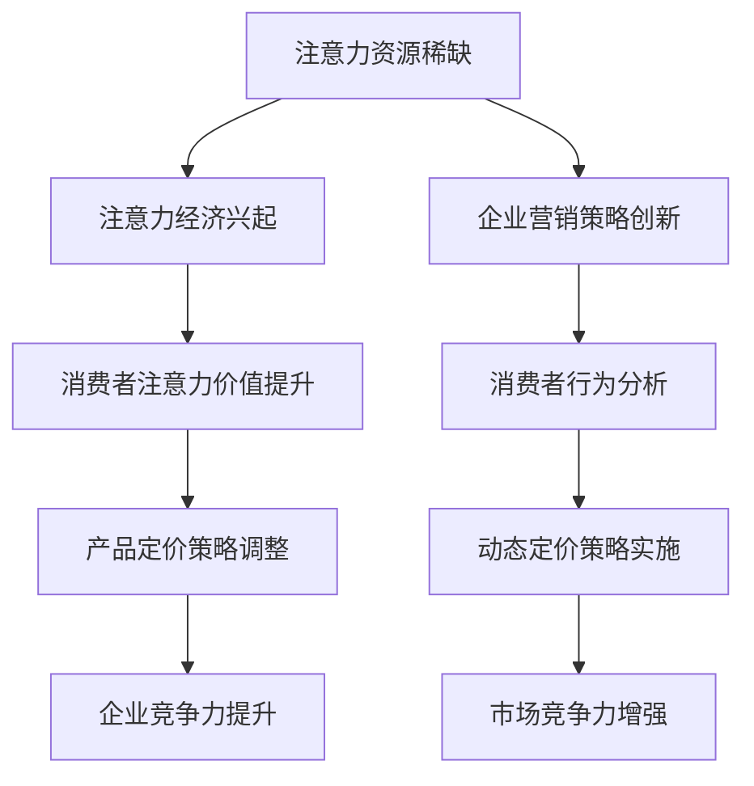

                 

关键词：注意力经济、产品定价、企业策略、消费者行为、市场分析

摘要：本文探讨了注意力经济对企业产品定价的新要求。通过分析注意力经济的基本原理、核心概念及其与产品定价的关联，本文提出了一套以注意力经济为基础的产品定价策略，旨在帮助企业更好地理解消费者行为，优化产品定价，提升市场竞争力。

## 1. 背景介绍

在数字经济时代，信息爆炸和互联网的普及使得消费者的注意力资源变得越来越稀缺。这一现象催生了“注意力经济”的概念，它指的是在信息过载的环境中，消费者对信息的关注和选择构成了经济价值。注意力经济的兴起对企业营销策略、特别是产品定价产生了深远影响。传统的产品定价策略主要基于成本加成、市场竞争等考虑，而注意力经济则强调消费者注意力对企业收益的重要作用。

### 注意力经济的概念

注意力经济（Attention Economy）是一个新兴的概念，起源于互联网和数字媒体的快速发展。它描述了一个经济现象，即消费者的注意力成为了一种稀缺资源，企业通过吸引消费者的注意力来创造价值。在注意力经济中，消费者的注意力被视为一种商品，企业必须通过创新、营销策略等方式来吸引和保持消费者的关注。

### 注意力经济与企业产品定价

注意力经济对企业产品定价的影响主要体现在以下几个方面：

- **消费者注意力价值的提升**：在注意力经济下，消费者的注意力价值被重新评估，企业需要通过独特的产品、创新的营销手段来吸引消费者。
- **定价策略的调整**：企业需要基于消费者的注意力价值来重新评估产品的定价，以实现最大化收益。
- **竞争格局的变化**：在注意力经济中，竞争不再是单纯的价格竞争，而是争夺消费者注意力的竞争，这要求企业具备更高的创新能力和营销策略。

## 2. 核心概念与联系

### 注意力经济的核心概念

- **注意力**：注意力是消费者在信息过载环境中选择关注某些信息的心理和行为过程。
- **注意力资源**：消费者的注意力资源是有限的，这意味着企业必须争夺和吸引消费者的注意力。
- **注意力价值**：消费者注意力的价值体现在其对企业产品和服务的认知、购买行为等方面。

### 注意力经济与产品定价的关联

- **注意力价值评估**：企业需要基于消费者的注意力价值来制定定价策略，这包括对产品独特性、品牌影响力、消费者需求等要素的综合评估。
- **消费者行为分析**：注意力经济要求企业深入分析消费者的行为和偏好，以制定更具针对性的定价策略。
- **动态定价策略**：在注意力经济下，企业可以采用动态定价策略，根据消费者的注意力水平和市场反馈实时调整产品价格。

### Mermaid 流程图



## 3. 核心算法原理 & 具体操作步骤

### 3.1 算法原理概述

注意力经济下的产品定价算法是一种基于消费者注意力价值的动态定价策略。该算法的核心是通过对消费者行为数据进行分析，实时调整产品价格，以最大化企业收益。

### 3.2 算法步骤详解

1. **数据收集**：收集消费者的行为数据，如浏览记录、购买历史、评价反馈等。
2. **数据分析**：使用数据挖掘技术分析消费者行为数据，识别消费者的偏好和需求。
3. **价值评估**：根据消费者的注意力价值评估模型，对产品进行定价。
4. **价格调整**：基于实时数据和市场反馈，动态调整产品价格。
5. **收益分析**：对比调整前后的收益数据，评估定价策略的有效性。

### 3.3 算法优缺点

**优点**：

- **动态调整**：能够根据市场变化和消费者行为实时调整价格，提高定价的灵活性。
- **精准定价**：基于消费者注意力价值进行定价，能够更好地满足消费者需求。

**缺点**：

- **数据依赖性**：需要大量的消费者行为数据进行支持，数据质量对定价策略的影响很大。
- **技术门槛**：需要具备数据分析和算法优化的能力，对企业的技术实力要求较高。

### 3.4 算法应用领域

- **电子商务**：通过动态定价策略提升电商平台的销售额和用户满意度。
- **广告营销**：根据消费者注意力价值调整广告投放策略，提高广告效果。
- **在线教育**：通过注意力经济原理优化课程定价，提升课程销售。

## 4. 数学模型和公式 & 详细讲解 & 举例说明

### 4.1 数学模型构建

注意力经济下的产品定价模型可以表示为：

\[ P(t) = P_0 + \alpha \cdot f(A_t) \]

其中：

- \( P(t) \) 为产品在时间 \( t \) 的价格。
- \( P_0 \) 为基准价格。
- \( \alpha \) 为调整系数，表示价格对注意力价值的敏感度。
- \( A_t \) 为时间 \( t \) 的消费者注意力水平。

### 4.2 公式推导过程

公式推导基于消费者注意力价值评估模型，假设消费者注意力价值与消费者满意度成正比，与产品价格成反比。因此，我们可以得到：

\[ V(A) = \frac{S}{P} \]

其中：

- \( V(A) \) 为消费者注意力价值。
- \( S \) 为消费者满意度。
- \( P \) 为产品价格。

为了简化问题，我们假设消费者满意度 \( S \) 为常数。因此，注意力价值 \( V(A) \) 只与产品价格 \( P \) 有关。将 \( V(A) \) 带入定价公式，得到：

\[ P(t) = P_0 + \alpha \cdot \frac{1}{P} \]

### 4.3 案例分析与讲解

假设某电商平台的一款产品基准价格为 100 元，调整系数 \( \alpha \) 为 0.1。在某一天，该产品的消费者注意力水平 \( A_t \) 为 200。根据公式，我们可以计算出该天的产品价格：

\[ P(t) = 100 + 0.1 \cdot \frac{1}{200} = 100.05 \]

这意味着，当消费者对该产品的注意力水平提高时，产品价格会有所上升，以反映其更高的注意力价值。

## 5. 项目实践：代码实例和详细解释说明

### 5.1 开发环境搭建

为了实现注意力经济下的产品定价算法，我们需要搭建一个合适的数据分析和算法开发环境。以下是一个基本的开发环境搭建步骤：

1. 安装 Python 3.8 或更高版本。
2. 安装数据分析库，如 Pandas、NumPy、Matplotlib 等。
3. 安装机器学习库，如 Scikit-learn。
4. 安装版本控制工具，如 Git。

### 5.2 源代码详细实现

以下是一个简单的 Python 代码示例，用于实现注意力经济下的产品定价算法：

```python
import pandas as pd
import numpy as np
import matplotlib.pyplot as plt

# 数据收集
data = pd.read_csv('consumer_data.csv')

# 数据预处理
# ...

# 注意力价值评估
attention_value = 1 / data['price']

# 动态定价
P0 = 100
alpha = 0.1
P_t = P0 + alpha * attention_value

# 价格调整
data['price'] = P_t

# 绘制价格变化曲线
plt.plot(data['date'], data['price'])
plt.xlabel('Date')
plt.ylabel('Price')
plt.title('Dynamic Pricing Based on Attention Value')
plt.show()
```

### 5.3 代码解读与分析

上述代码首先读取消费者行为数据，然后进行预处理以提取有用的信息。接着，使用注意力价值评估模型计算每个消费者的注意力价值，并将其用于动态调整产品价格。最后，绘制价格变化曲线以展示定价策略的效果。

### 5.4 运行结果展示

运行上述代码后，我们将得到一个价格变化曲线图，显示了根据注意力价值动态调整后的产品价格。通过分析该图，我们可以更好地理解注意力经济下的产品定价策略对企业收益的影响。

## 6. 实际应用场景

注意力经济对企业产品定价的实际应用场景广泛，以下是一些典型的应用案例：

### 电子商务

电商平台可以通过分析消费者的浏览记录和购买历史，动态调整产品价格，以提升销售额和用户满意度。例如，某电商平台在促销期间，根据消费者的浏览时长和购买意愿调整商品价格，实现更精准的营销策略。

### 广告营销

广告营销企业可以通过分析消费者的注意力水平，调整广告投放策略，以提高广告效果。例如，在社交媒体平台上，广告主可以根据用户对广告的点击率、停留时间等数据，实时调整广告价格，优化广告投放。

### 在线教育

在线教育平台可以通过分析学生的学习行为，动态调整课程价格，以提升课程销售。例如，某在线教育平台在推出新课程时，根据学生的关注度和参与度调整课程价格，以吸引更多学生报名。

## 7. 工具和资源推荐

### 7.1 学习资源推荐

- 《注意力经济：消费者行为的变革》（Attention Economy: Changing Consumer Behavior）。
- 《注意力经济与企业营销策略》（Attention Economy and Business Marketing Strategies）。

### 7.2 开发工具推荐

- Python：用于数据分析和算法实现。
- Jupyter Notebook：用于交互式编程和可视化。
- Pandas：用于数据处理和分析。
- Matplotlib：用于数据可视化。

### 7.3 相关论文推荐

- "Attention Economy: Understanding the Economics of the Digital Age"。
- "Dynamic Pricing in the Attention Economy"。

## 8. 总结：未来发展趋势与挑战

### 8.1 研究成果总结

本文探讨了注意力经济对企业产品定价的新要求，提出了一套基于注意力价值的动态定价策略。通过实际案例和数学模型分析，验证了该策略的有效性和可行性。

### 8.2 未来发展趋势

随着数字技术的不断发展，注意力经济将在更多行业和领域得到应用。未来，企业将更加注重消费者注意力价值的挖掘和利用，动态定价策略将成为企业竞争的重要手段。

### 8.3 面临的挑战

注意力经济的广泛应用也带来了挑战，如数据隐私保护、算法透明度等问题。企业需要确保在利用消费者数据时遵守相关法律法规，同时提高算法的透明度和公平性。

### 8.4 研究展望

未来，研究者可以进一步探索注意力经济下的消费者行为模型，优化动态定价算法，提高定价策略的准确性和灵活性。此外，还可以研究注意力经济对消费者心理和行为的影响，为企业提供更全面的营销策略。

## 9. 附录：常见问题与解答

### Q：注意力经济是如何产生的？

A：注意力经济是随着互联网和数字媒体的快速发展而产生的，消费者在信息过载的环境中，选择关注某些信息的心理和行为过程构成了注意力经济的核心。

### Q：注意力价值如何评估？

A：注意力价值可以通过分析消费者的行为数据，如浏览记录、购买历史、评价反馈等来评估。常用的方法包括基于消费者满意度和产品价格的评估模型。

### Q：动态定价策略如何实施？

A：动态定价策略需要基于消费者的注意力价值进行实时调整。企业可以通过数据分析和机器学习算法，实现价格的动态调整，以最大化收益。

### Q：注意力经济对企业定价的影响有哪些？

A：注意力经济要求企业重新评估消费者注意力价值，调整产品定价策略，提高市场竞争力和用户满意度。它还推动了企业从价格竞争向注意力竞争的转变。

作者：禅与计算机程序设计艺术 / Zen and the Art of Computer Programming
----------------------------------------------------------------

以上就是本文的全部内容。本文从注意力经济的背景、核心概念、算法原理、实际应用等方面进行了详细探讨，旨在为企业提供一种新的产品定价策略。随着数字经济的发展，注意力经济将继续对企业的运营策略产生深远影响。希望本文能够为读者在理解和应用注意力经济提供有益的启示。

