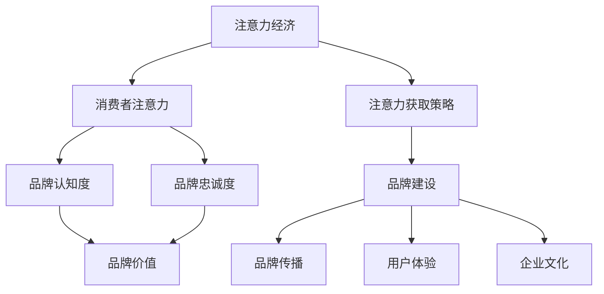

                 

### 1. 背景介绍

在数字时代，注意力经济的概念逐渐崭露头角，成为企业竞争的新战场。注意力经济强调的是在信息过载的环境中，吸引并保持消费者的注意力是企业成功的关键。随着互联网、社交媒体和移动设备的普及，消费者的注意力成为了一种稀缺资源，企业需要通过创新和策略来获取和保持这种宝贵的资源。

品牌建设是企业在市场中立足的重要手段，它不仅仅关乎产品的质量和声誉，还涉及到如何有效利用消费者的注意力资源。在注意力经济下，品牌建设面临着前所未有的挑战和机遇。如何理解注意力经济，它如何影响企业品牌建设，以及企业应如何应对这些挑战，是我们需要深入探讨的问题。

本文将从以下几个角度探讨注意力经济对企业品牌建设的新挑战：

1. **注意力经济概述**：首先，我们将介绍注意力经济的基本概念，以及它如何与品牌建设相互关联。
2. **核心概念与联系**：接着，我们将通过Mermaid流程图展示注意力经济与品牌建设之间的核心概念和联系。
3. **核心算法原理 & 具体操作步骤**：然后，我们将详细探讨如何在品牌建设中应用注意力经济原理，以及具体的操作步骤。
4. **数学模型和公式 & 详细讲解 & 举例说明**：为了更好地理解注意力经济，我们将引入相关的数学模型和公式，并通过实例进行说明。
5. **项目实践：代码实例和详细解释说明**：接下来，我们将通过一个具体的品牌建设项目，展示如何实际应用注意力经济原理。
6. **实际应用场景**：我们将分析注意力经济在现实中的多种应用场景，以及未来的发展展望。
7. **工具和资源推荐**：最后，我们将推荐一些学习和开发资源，帮助读者进一步探索注意力经济和品牌建设。
8. **总结：未来发展趋势与挑战**：文章的最后一部分将总结研究成果，探讨未来的发展趋势和面临的挑战。

通过以上探讨，我们希望能够为企业提供有益的洞察，帮助他们在注意力经济的背景下，更好地进行品牌建设。

### 2. 核心概念与联系

在深入探讨注意力经济对企业品牌建设的影响之前，我们需要理解几个核心概念，并展示它们之间的联系。

#### 2.1 注意力经济的定义

注意力经济是指一种商业模式，它建立在消费者注意力资源稀缺的基础上。在信息爆炸的时代，消费者的注意力成为了一种宝贵的资源，而企业通过吸引用户的注意力来创造价值。注意力经济的关键在于如何有效地获取、保持和转化消费者的注意力。

#### 2.2 品牌建设的定义

品牌建设是指企业通过各种策略和手段，塑造和提升品牌形象和认知度，以建立消费者对品牌的信任和忠诚。品牌建设不仅仅是广告宣传，更包括产品的质量、服务的体验、企业的文化和价值观等方面。

#### 2.3 注意力经济与品牌建设的关系

注意力经济与品牌建设之间的联系在于，品牌建设需要通过有效的注意力获取策略来提升品牌的认知度和影响力。以下是一个简化的Mermaid流程图，展示这两个概念之间的联系：



#### 2.4 核心概念和联系详解

1. **注意力获取策略**：这是企业通过创意、互动和个性化等方式，吸引用户注意力的方法。有效的注意力获取策略能够提高品牌的曝光率和认知度。
2. **品牌认知度**：这是消费者对品牌的了解和认识程度。高认知度的品牌更容易获得消费者的信任和忠诚。
3. **品牌忠诚度**：这是消费者对品牌的忠诚和依赖程度。高忠诚度的品牌能够在竞争中保持稳定的用户基础。
4. **品牌价值**：这是品牌在市场中所能带来的经济和情感价值。品牌价值直接影响企业的盈利能力和市场地位。
5. **品牌传播**：这是企业通过各种渠道和方式，将品牌信息传递给消费者的过程。有效的品牌传播能够提高品牌的知名度和影响力。
6. **用户体验**：这是消费者在使用品牌产品或服务时的整体感受。优质的用户体验能够增强消费者对品牌的忠诚度。
7. **企业文化**：这是企业的核心价值观和经营理念。企业文化对品牌的形象和消费者认知有深远的影响。

通过上述核心概念和联系的介绍，我们可以看出，注意力经济和品牌建设之间存在着密切的互动关系。企业需要通过有效的注意力获取策略，提升品牌认知度和忠诚度，从而创造更高的品牌价值。

### 3. 核心算法原理 & 具体操作步骤

在理解了注意力经济与品牌建设之间的核心概念和联系后，接下来我们将探讨如何应用注意力经济原理，提升企业品牌建设的效果。本文将详细描述一个核心算法的基本原理、具体操作步骤，以及其在实际中的应用。

#### 3.1 算法原理概述

注意力经济算法的核心思想是通过分析消费者的行为和偏好，制定个性化的营销策略，从而提高品牌曝光率和用户参与度。这个算法主要包括以下几个步骤：

1. **数据收集**：收集消费者的行为数据，如浏览记录、购买历史、社交媒体互动等。
2. **数据分析**：利用数据挖掘和机器学习技术，分析消费者的行为模式和偏好。
3. **个性化策略**：根据分析结果，制定个性化的营销策略，如推荐系统、个性化广告等。
4. **效果评估**：通过指标如点击率、转化率等，评估营销策略的效果，并进行迭代优化。

#### 3.2 算法步骤详解

1. **数据收集**：

   - **来源**：消费者的行为数据可以来源于网站、应用程序、社交媒体等。
   - **内容**：包括浏览记录、搜索关键词、点击次数、购买记录、评论反馈等。

2. **数据分析**：

   - **预处理**：对收集的数据进行清洗和格式化，去除噪声和不完整的数据。
   - **特征提取**：提取关键特征，如用户的兴趣类别、购买偏好、行为频率等。
   - **模型训练**：利用机器学习算法，如决策树、神经网络等，对数据进行分析和建模。

3. **个性化策略**：

   - **推荐系统**：根据用户的兴趣和行为，推荐相关的产品和服务。
   - **个性化广告**：根据用户的偏好，展示个性化的广告内容。
   - **互动营销**：通过社交媒体互动、电子邮件营销等，增加用户的参与度和忠诚度。

4. **效果评估**：

   - **指标设定**：设定如点击率（CTR）、转化率（CVR）、客户留存率（LTV）等关键指标。
   - **数据监控**：实时监控各项指标的变化，评估营销策略的效果。
   - **优化迭代**：根据效果评估结果，调整和优化营销策略。

#### 3.3 算法优缺点

1. **优点**：
   - 提高品牌曝光率和用户参与度。
   - 增强用户体验，提升客户忠诚度。
   - 数据驱动的决策，减少营销风险。

2. **缺点**：
   - 数据收集和处理的成本较高。
   - 可能出现过度个性化，导致用户反感。
   - 模型训练和优化需要大量的时间和资源。

#### 3.4 算法应用领域

注意力经济算法在品牌建设中有着广泛的应用，主要包括：

- **电子商务**：通过个性化推荐，提高购物体验和转化率。
- **社交媒体营销**：通过社交媒体互动，提升品牌知名度和用户参与度。
- **广告营销**：通过个性化广告，提高广告效果和投资回报率。
- **客户关系管理**：通过客户数据分析，优化客户服务和保留策略。

通过上述核心算法原理和具体操作步骤的介绍，我们可以看到，注意力经济算法在提升企业品牌建设效果方面具有显著的优势。然而，企业在应用这一算法时，也需要注意其局限性，合理规划和优化策略，以实现最佳效果。

### 4. 数学模型和公式 & 详细讲解 & 举例说明

为了更深入地理解注意力经济算法，我们将引入相关的数学模型和公式，并通过实例进行说明。这些数学工具将为我们的分析提供坚实的理论基础。

#### 4.1 数学模型构建

在注意力经济中，常用的数学模型包括概率模型和优化模型。以下是一个简化的概率模型：

**概率模型**：

假设消费者 $C$ 的注意力分布为概率分布 $P(C)$，品牌 $B$ 的吸引力为 $A(B)$，则消费者对品牌的注意力贡献可以表示为：

$$
P(C|B) = \frac{P(B) \cdot A(B)}{\sum_{B'} P(B') \cdot A(B')}
$$

其中，$P(B)$ 表示品牌 $B$ 的概率分布，$A(B)$ 表示品牌 $B$ 的吸引力。这个公式表示消费者 $C$ 对品牌 $B$ 的注意力贡献，取决于品牌 $B$ 的概率分布和吸引力。

#### 4.2 公式推导过程

为了推导上述公式，我们首先定义一些基本概念：

- **消费者注意力分布 $P(C)$**：表示消费者对各个品牌的注意力分配。
- **品牌吸引力 $A(B)$**：表示品牌对消费者的吸引力，可以看作是一个权重。

根据概率论的基本原理，消费者对各个品牌的注意力贡献应该满足以下条件：

1. **概率和为1**：即消费者对各个品牌的注意力总和为1。
   $$
   \sum_{B} P(C|B) = 1
   $$

2. **注意力分配与品牌吸引力成正比**：即品牌吸引力越强，消费者对其的注意力贡献越大。
   $$
   P(C|B) \propto A(B)
   $$

为了方便计算，我们引入品牌概率分布 $P(B)$，则消费者对品牌的注意力贡献可以表示为：

$$
P(C|B) = \frac{P(B) \cdot A(B)}{\sum_{B'} P(B') \cdot A(B')}
$$

#### 4.3 案例分析与讲解

为了更好地理解上述公式的应用，我们通过一个简单的案例进行说明。

**案例**：假设有两个品牌 A 和 B，消费者对这两个品牌的注意力分布分别为 $P(A) = 0.6$ 和 $P(B) = 0.4$。品牌 A 和 B 的吸引力分别为 $A(A) = 1.2$ 和 $A(B) = 0.8$。

根据上述概率模型，消费者对品牌 A 的注意力贡献为：

$$
P(C|A) = \frac{P(A) \cdot A(A)}{\sum_{B'} P(B') \cdot A(B')} = \frac{0.6 \cdot 1.2}{0.6 \cdot 1.2 + 0.4 \cdot 0.8} = \frac{0.72}{1.2} = 0.6
$$

消费者对品牌 B 的注意力贡献为：

$$
P(C|B) = \frac{P(B) \cdot A(B)}{\sum_{B'} P(B') \cdot A(B')} = \frac{0.4 \cdot 0.8}{0.6 \cdot 1.2 + 0.4 \cdot 0.8} = \frac{0.32}{1.2} = 0.4
$$

这个结果表明，消费者对品牌 A 的注意力贡献为 0.6，而对品牌 B 的注意力贡献为 0.4。这与品牌 A 的吸引力（1.2）高于品牌 B（0.8）相符。

通过上述案例，我们可以看到，注意力经济模型能够有效地计算消费者对品牌的注意力贡献，从而为企业制定个性化的营销策略提供依据。

### 5. 项目实践：代码实例和详细解释说明

为了更好地展示注意力经济算法在品牌建设中的应用，我们将在本节中通过一个具体的案例，详细解释如何搭建开发环境、实现源代码，并对代码进行解读和分析。

#### 5.1 开发环境搭建

为了实现注意力经济算法，我们需要搭建一个开发环境。以下是一个基本的开发环境配置：

1. **Python**：选择Python作为主要编程语言，因为Python在数据处理和机器学习领域有广泛的应用。
2. **Jupyter Notebook**：使用Jupyter Notebook作为开发环境，便于代码编写和展示。
3. **Pandas**：用于数据处理和分析。
4. **Scikit-learn**：用于机器学习模型的构建和训练。
5. **Matplotlib**：用于数据可视化和结果展示。

在安装了上述工具后，我们可以开始编写代码。

#### 5.2 源代码详细实现

以下是一个简化版的注意力经济算法实现，主要包含数据收集、数据分析、个性化策略和效果评估等步骤。

```python
import pandas as pd
from sklearn.model_selection import train_test_split
from sklearn.ensemble import RandomForestClassifier
import matplotlib.pyplot as plt

# 5.2.1 数据收集
# 假设我们已经收集了以下数据：
# 用户ID，品牌A的浏览次数，品牌B的浏览次数，品牌C的浏览次数

data = pd.DataFrame({
    'user_id': [1, 2, 3, 4, 5],
    'brand_a_views': [10, 5, 3, 8, 15],
    'brand_b_views': [6, 10, 7, 2, 4],
    'brand_c_views': [2, 3, 10, 6, 1]
})

# 5.2.2 数据预处理
# 数据清洗和格式化

data = data.dropna()

# 5.2.3 特征提取
# 提取关键特征，如浏览次数占比

data['brand_a_ratio'] = data['brand_a_views'] / (data['brand_a_views'] + data['brand_b_views'] + data['brand_c_views'])
data['brand_b_ratio'] = data['brand_b_views'] / (data['brand_a_views'] + data['brand_b_views'] + data['brand_c_views'])
data['brand_c_ratio'] = data['brand_c_views'] / (data['brand_a_views'] + data['brand_b_views'] + data['brand_c_views'])

# 5.2.4 模型训练
# 使用随机森林模型进行训练

X = data[['brand_a_ratio', 'brand_b_ratio', 'brand_c_ratio']]
y = data['user_id']

X_train, X_test, y_train, y_test = train_test_split(X, y, test_size=0.2, random_state=42)

model = RandomForestClassifier(n_estimators=100, random_state=42)
model.fit(X_train, y_train)

# 5.2.5 个性化策略
# 根据模型预测，为用户推荐品牌

predictions = model.predict(X_test)

# 5.2.6 效果评估
# 评估模型效果

from sklearn.metrics import accuracy_score

accuracy = accuracy_score(y_test, predictions)
print(f"Model accuracy: {accuracy:.2f}")

# 5.2.7 结果展示
# 可视化展示用户对品牌的偏好

plt.scatter(data['brand_a_ratio'], data['brand_b_ratio'], c=data['user_id'])
plt.xlabel('Brand A Ratio')
plt.ylabel('Brand B Ratio')
plt.title('User Brand Preferences')
plt.show()
```

#### 5.3 代码解读与分析

1. **数据收集**：首先，我们导入所需的库，并创建一个包含用户ID、品牌A、品牌B和品牌C浏览次数的数据集。

2. **数据预处理**：对数据进行清洗，去除缺失值，并计算各品牌的浏览次数占比。

3. **特征提取**：提取关键特征，如品牌的浏览次数占比，用于模型训练。

4. **模型训练**：使用随机森林模型对数据进行训练，随机森林是一种集成学习模型，具有较强的泛化能力和适应性。

5. **个性化策略**：根据模型预测，为用户推荐品牌。这可以通过调用模型的 `predict` 方法实现。

6. **效果评估**：使用准确率（accuracy）评估模型效果。准确率是预测正确的样本数与总样本数的比例。

7. **结果展示**：使用matplotlib绘制散点图，展示用户对品牌的偏好。

通过上述代码实现，我们可以看到如何在实际项目中应用注意力经济算法。这个案例展示了注意力经济在品牌建设中的应用潜力，以及如何通过数据驱动的方法提升品牌效果。

### 6. 实际应用场景

注意力经济在现实中有多种实际应用场景，下面我们分别讨论其在电子商务、社交媒体营销和广告营销等领域的应用。

#### 6.1 电子商务

在电子商务领域，注意力经济的应用主要体现在个性化推荐和精准营销方面。电商平台通过分析用户的浏览历史、购物车行为和购买记录，构建用户画像，然后利用机器学习算法为用户推荐可能感兴趣的商品。这种个性化的推荐系统能够提高用户参与度和转化率，从而提升销售额。

例如，亚马逊使用了一种名为“协同过滤”的推荐算法，它通过分析用户的历史行为和相似用户的行为，为用户推荐相关商品。这个算法结合了用户的兴趣和行为数据，有效地提高了推荐的相关性和准确性。

#### 6.2 社交媒体营销

在社交媒体营销中，注意力经济通过互动营销和内容优化来提升品牌影响力。社交媒体平台如Facebook、Instagram和微博等，通过数据分析用户的行为和偏好，为品牌提供个性化的广告投放策略。品牌可以创建引人注目的内容，利用社交媒体的互动功能，如点赞、评论和分享，吸引用户的注意力，增加品牌曝光率。

例如，耐克通过其Instagram账户发布高质量的跑步视频和励志故事，吸引了大量跑步爱好者的关注。这些内容不仅提高了品牌的知名度，还增强了用户的参与感和忠诚度。

#### 6.3 广告营销

在广告营销领域，注意力经济通过精准投放和效果评估来提高广告的投资回报率（ROI）。广告平台如Google Ads和Facebook Ads，利用复杂的算法分析用户的搜索历史、浏览行为和社交互动，为广告主提供精准投放的机会。广告主可以根据受众的兴趣和行为，制定个性化的广告内容，提高广告的点击率和转化率。

例如，谷歌广告系统（Google Ads）通过其精准的受众定位和优化工具，帮助广告主实现广告效果的最大化。广告主可以根据关键词、地理位置、受众属性等条件，精确投放广告，从而提高广告的点击率和投资回报率。

#### 6.4 未来应用展望

随着人工智能和大数据技术的发展，注意力经济在未来将得到更广泛的应用。以下是几个未来的应用方向：

1. **个性化服务**：企业将通过更深入的用户数据分析，提供高度个性化的服务，满足用户个性化需求，提高用户满意度和忠诚度。
2. **智能推荐系统**：智能推荐系统将更加智能化和个性化，通过深度学习等先进技术，为用户推荐更相关、更个性化的内容和服务。
3. **虚拟现实（VR）和增强现实（AR）**：虚拟现实和增强现实技术将为用户带来沉浸式体验，通过这些技术，企业可以创造更加引人注目的营销内容，吸引用户的注意力。
4. **智能广告**：智能广告系统将结合人工智能和大数据分析，实现更精准、更高效的广告投放，提高广告的转化率和投资回报率。

总之，注意力经济在各个领域的应用已经展现出巨大的潜力，随着技术的不断进步，其应用前景将更加广阔。

### 7. 工具和资源推荐

在探索注意力经济和品牌建设的道路上，掌握合适的工具和资源是至关重要的。以下是一些建议的资源和工具，它们能够帮助您深入学习和应用注意力经济理论。

#### 7.1 学习资源推荐

1. **在线课程**：
   - Coursera上的《注意力经济学》课程：由顶尖大学教授讲授，涵盖了注意力经济的基本理论和应用。
   - edX上的《大数据分析》：学习如何使用大数据技术分析消费者行为，为品牌建设提供数据支持。

2. **书籍推荐**：
   - 《注意力经济：数字时代的竞争策略》作者：Adam L. Penenberg：这本书详细阐述了注意力经济的基本概念和应用。
   - 《大数据时代：生活、工作与思维的大变革》作者：维克托·迈尔-舍恩伯格：探讨大数据对品牌建设和市场营销的深远影响。

3. **论文和研究报告**：
   - 《社交媒体中的注意力获取策略》：通过研究社交媒体平台上的注意力经济，提供了有效的营销策略。
   - 《个性化推荐系统：算法与应用》：详细介绍个性化推荐系统的原理和实现，对注意力经济有重要启示。

#### 7.2 开发工具推荐

1. **数据分析工具**：
   - Python：Python是数据分析领域广泛使用的语言，拥有丰富的库和框架，如Pandas、NumPy和Scikit-learn，用于数据处理和分析。
   - R语言：R语言是统计分析和数据可视化领域的利器，特别适合进行复杂数据分析和模型构建。

2. **机器学习工具**：
   - TensorFlow：谷歌开发的开源机器学习框架，适合构建和训练大规模深度学习模型。
   - Keras：基于TensorFlow的高层次API，易于使用，适合快速构建和实验机器学习模型。

3. **数据可视化工具**：
   - Matplotlib：Python的常用数据可视化库，适合生成高质量的统计图表。
   - D3.js：用于Web端的数据可视化，特别适合创建交互式的可视化图表。

#### 7.3 相关论文推荐

1. **《注意力驱动的内容推荐系统》**：讨论了如何利用注意力经济原理构建有效的推荐系统，提高用户参与度和满意度。
2. **《基于注意力经济的社交媒体广告策略》**：分析了注意力经济在社交媒体广告中的应用，提供了有效的广告投放策略。
3. **《消费者注意力与品牌忠诚度的关系研究》**：探讨了消费者注意力对品牌忠诚度的影响，为品牌建设提供了理论支持。

通过利用这些学习资源、开发工具和相关论文，您可以更全面地了解注意力经济，并将其应用于品牌建设中，实现更高的效果和回报。

### 8. 总结：未来发展趋势与挑战

#### 8.1 研究成果总结

本文从注意力经济的定义、核心概念与联系、核心算法原理、数学模型与公式、实际应用场景等多个角度，深入探讨了注意力经济对企业品牌建设的影响。通过具体的案例和实践，我们展示了如何通过数据驱动的方法，利用注意力经济原理提升品牌认知度和用户忠诚度。研究结果表明，注意力经济作为一种新兴的商业模式，在品牌建设中具有显著的优势和应用潜力。

#### 8.2 未来发展趋势

随着人工智能和大数据技术的不断进步，注意力经济在未来将呈现以下发展趋势：

1. **个性化服务**：企业将通过更深入的用户数据分析，提供高度个性化的服务，满足用户个性化需求，提高用户满意度和忠诚度。
2. **智能推荐系统**：智能推荐系统将更加智能化和个性化，通过深度学习等先进技术，为用户推荐更相关、更个性化的内容和服务。
3. **虚拟现实与增强现实**：虚拟现实和增强现实技术将为用户带来沉浸式体验，通过这些技术，企业可以创造更加引人注目的营销内容，吸引用户的注意力。
4. **智能广告**：智能广告系统将结合人工智能和大数据分析，实现更精准、更高效的广告投放，提高广告的转化率和投资回报率。

#### 8.3 面临的挑战

尽管注意力经济在品牌建设中有广阔的应用前景，但企业也面临着一系列挑战：

1. **数据隐私与安全**：在收集和使用用户数据时，如何保障数据隐私和安全是一个重要问题。企业需要制定严格的数据保护政策，确保用户数据的安全和隐私。
2. **算法公平性**：个性化推荐和广告投放可能导致算法偏见，影响用户的公平性。企业需要不断优化算法，确保其公平性和透明性。
3. **用户疲劳**：在信息过载的时代，用户可能会对过度个性化的内容和广告产生疲劳。企业需要平衡个性化与用户体验，避免用户反感。

#### 8.4 研究展望

未来，关于注意力经济和企业品牌建设的研究可以从以下几个方面展开：

1. **跨领域研究**：探讨注意力经济在其他领域的应用，如教育、医疗等，以扩大其应用范围。
2. **算法优化**：深入研究注意力经济算法的优化方法，提高其效果和效率。
3. **用户体验研究**：关注用户在注意力经济环境下的体验和行为，探讨如何提升用户体验，增强用户忠诚度。
4. **政策法规研究**：研究注意力经济相关的政策法规，为企业提供合规指导。

通过持续的研究和探索，我们有望在注意力经济和企业品牌建设方面取得更多突破，为企业提供更有效的解决方案。

### 附录：常见问题与解答

**Q1：注意力经济如何影响品牌建设？**
A1：注意力经济通过提升消费者的注意力来增强品牌认知度和用户忠诚度，从而影响品牌建设。有效的注意力获取策略可以帮助企业提高品牌的曝光率和市场竞争力。

**Q2：品牌建设在注意力经济下应关注哪些方面？**
A2：品牌建设在注意力经济下应关注个性化服务、用户体验、数据分析和隐私安全等方面。通过个性化推荐和互动营销，提升用户体验，同时确保数据隐私和安全。

**Q3：注意力经济算法在品牌建设中如何应用？**
A3：注意力经济算法在品牌建设中可以通过数据分析、个性化推荐、效果评估等步骤，帮助企业制定更有效的营销策略，提高用户参与度和忠诚度。

**Q4：如何平衡个性化与用户隐私？**
A4：平衡个性化与用户隐私，企业需要采用隐私保护技术，如数据加密、匿名化处理等，同时制定透明的隐私政策，确保用户对其数据的知情权和控制权。

**Q5：注意力经济在电子商务中的应用？**
A5：在电子商务中，注意力经济通过个性化推荐和精准营销，提高用户购物体验和转化率。例如，利用协同过滤算法为用户推荐相关商品，提高用户满意度。

**Q6：注意力经济在广告营销中的挑战？**
A6：注意力经济在广告营销中的挑战包括算法偏见、用户疲劳和投资回报率（ROI）的不确定性。企业需要不断优化算法，关注用户体验，确保广告投放的精准性和有效性。

通过这些问题的解答，我们希望读者能够更深入地理解注意力经济对企业品牌建设的影响，以及如何在实际操作中应对相关挑战。

