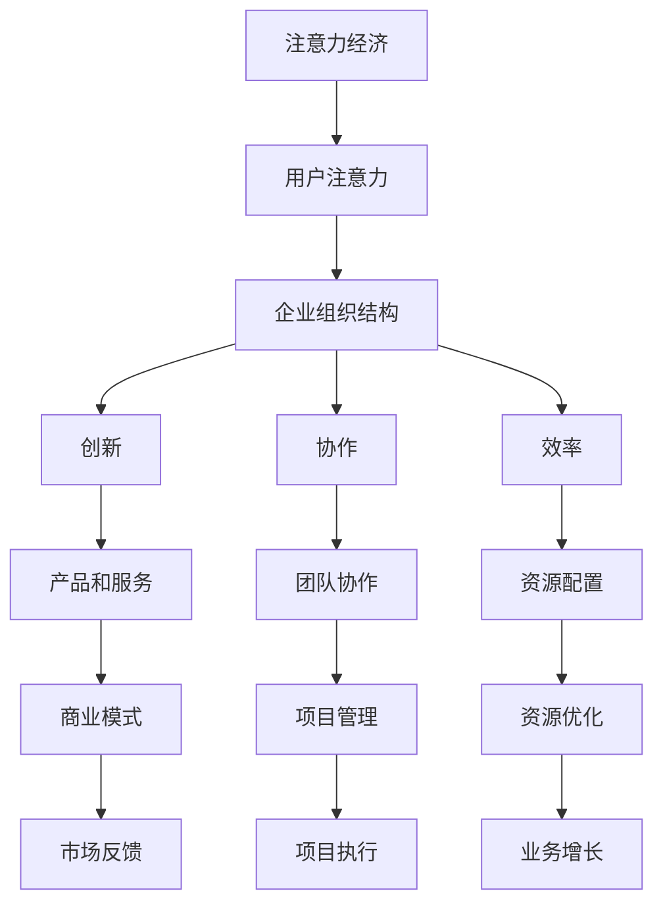

                 

关键词：注意力经济、企业组织结构、创新、协作、效率

> 摘要：随着信息技术的发展和全球化进程的加速，注意力经济逐渐成为驱动现代企业竞争的新引擎。本文从注意力经济的概念出发，深入探讨其对传统企业组织结构的影响，包括对创新、协作和效率的推动作用。文章将结合实际案例，分析注意力经济对企业组织结构变革的挑战与机遇，并展望未来发展的趋势。

## 1. 背景介绍

### 注意力经济的兴起

随着互联网的普及和社交媒体的兴起，注意力经济作为一种新型商业模式逐渐崭露头角。注意力经济源于对人类注意力的商业价值认知，认为在信息爆炸的时代，获取和保持用户的注意力是企业成功的核心要素。注意力经济以用户注意力为交易对象，通过创造吸引人的内容、产品和服务来获取商业回报。

### 企业组织结构的演变

企业组织结构是企业管理的基础，其演变伴随着企业成长和市场环境的变化。从传统的职能型、矩阵型到现代的灵活型、网络型，企业组织结构不断创新，以适应快速变化的市场需求。然而，随着注意力经济的崛起，企业组织结构面临着新的挑战，需要更加灵活、高效和创新。

## 2. 核心概念与联系

### 注意力经济与企业组织结构

注意力经济与企业组织结构之间存在密切的联系。注意力经济强调用户注意力的重要性，而企业组织结构则决定了如何有效地获取、利用和分配注意力资源。

### Mermaid 流程图



## 3. 核心算法原理 & 具体操作步骤

### 3.1 算法原理概述

注意力经济的核心算法是注意力机制，它通过分析用户的兴趣和行为模式，为企业提供精准的用户画像和营销策略。注意力机制包括以下几个方面：

1. **用户行为分析**：通过收集用户的浏览、搜索、购买等行为数据，分析用户兴趣和需求。
2. **兴趣模型构建**：基于用户行为数据，构建用户的兴趣模型，用于预测用户偏好。
3. **内容推荐**：根据用户的兴趣模型，推荐符合用户需求的内容、产品和服务。
4. **效果评估**：通过用户反馈和行为数据，评估内容推荐的效果，优化推荐策略。

### 3.2 算法步骤详解

1. **数据收集**：通过网站日志、用户行为追踪等技术手段，收集用户的行为数据。
2. **数据预处理**：对收集到的行为数据进行清洗、去噪，提取有用的信息。
3. **特征工程**：将预处理后的数据转化为机器学习模型所需的特征向量。
4. **模型训练**：使用机器学习算法，如矩阵分解、深度学习等，训练用户兴趣模型。
5. **内容推荐**：根据用户的兴趣模型，生成推荐列表，推送用户可能感兴趣的内容。
6. **效果评估**：收集用户反馈和行为数据，评估推荐效果，调整推荐策略。

### 3.3 算法优缺点

**优点**：

1. **个性化推荐**：能够根据用户兴趣提供个性化的内容推荐，提高用户满意度。
2. **高效资源利用**：通过精准推荐，减少无效资源消耗，提高企业运营效率。

**缺点**：

1. **用户隐私风险**：用户行为数据的大量收集和处理可能涉及用户隐私问题。
2. **算法透明度**：推荐算法的复杂性和封闭性可能导致用户对其信任度降低。

### 3.4 算法应用领域

注意力经济算法广泛应用于电子商务、社交媒体、内容推荐等领域，为企业提供高效的营销和运营策略。

## 4. 数学模型和公式 & 详细讲解 & 举例说明

### 4.1 数学模型构建

注意力经济的核心数学模型是基于概率模型的用户行为预测模型。假设用户 $U$ 在时间 $t$ 采取了行为 $X_t$，我们可以使用条件概率来描述用户行为：

$$
P(X_t | U) = \frac{P(U | X_t)P(X_t)}{P(U)}
$$

其中，$P(U | X_t)$ 是在行为 $X_t$ 发生的条件下用户 $U$ 出现的概率，$P(X_t)$ 是行为 $X_t$ 发生的概率，$P(U)$ 是用户 $U$ 出现的概率。

### 4.2 公式推导过程

为了推导用户行为预测模型，我们首先假设用户 $U$ 的行为 $X_t$ 是一个随机变量，其取值集合为 $X$。然后，我们定义用户 $U$ 在时间 $t$ 的行为概率分布：

$$
P(X_t) = P(U_1, U_2, ..., U_t)
$$

其中，$U_i$ 表示用户 $U$ 在时间 $i$ 的行为。

接下来，我们定义在行为 $X_t$ 发生的条件下用户 $U$ 出现的概率：

$$
P(U | X_t) = \frac{P(U \cap X_t)}{P(X_t)}
$$

其中，$P(U \cap X_t)$ 表示用户 $U$ 和行为 $X_t$ 同时发生的概率。

### 4.3 案例分析与讲解

假设用户 $U$ 在过去一个月内访问了以下网页：

1. 网页1：新闻
2. 网页2：体育
3. 网页3：购物
4. 网页4：旅游

根据用户行为数据，我们可以构建用户 $U$ 的兴趣模型。例如，用户 $U$ 的行为概率分布为：

$$
P(X_t) = [0.2, 0.3, 0.4, 0.1]
$$

其中，概率值表示用户在相应时间访问该类网页的概率。

根据条件概率公式，我们可以计算用户在时间 $t$ 的行为：

$$
P(X_t | U) = \frac{P(U | X_t)P(X_t)}{P(U)}
$$

通过计算，我们得到用户在时间 $t$ 的行为概率分布，进而生成推荐列表。

## 5. 项目实践：代码实例和详细解释说明

### 5.1 开发环境搭建

本案例使用 Python 编写，环境要求如下：

- Python 3.8 或以上版本
- Scikit-learn 库
- Pandas 库
- NumPy 库

安装依赖库：

```bash
pip install scikit-learn pandas numpy
```

### 5.2 源代码详细实现

```python
import numpy as np
import pandas as pd
from sklearn.model_selection import train_test_split
from sklearn.metrics.pairwise import cosine_similarity
from sklearn.preprocessing import normalize

# 5.2.1 数据收集与预处理
def load_data():
    # 假设用户行为数据存储在 CSV 文件中
    data = pd.read_csv('user_behavior.csv')
    # 数据预处理（清洗、去噪等操作）
    # ...
    return data

# 5.2.2 用户行为概率分布计算
def compute_probabilities(data):
    # 计算用户行为概率分布
    # ...
    return probabilities

# 5.2.3 用户行为预测
def predict_behavior(probabilities, user):
    # 根据用户行为概率分布预测用户行为
    # ...
    return predicted_behavior

# 主函数
if __name__ == '__main__':
    data = load_data()
    probabilities = compute_probabilities(data)
    user = 'U1'  # 假设要预测的用户为 U1
    predicted_behavior = predict_behavior(probabilities, user)
    print(predicted_behavior)
```

### 5.3 代码解读与分析

```python
# 5.3.1 数据收集与预处理
# load_data() 函数用于加载数据，并进行预处理。预处理步骤包括数据清洗、去噪等操作。

# 5.3.2 用户行为概率分布计算
# compute_probabilities() 函数用于计算用户行为概率分布。这里使用了 Scikit-learn 库的矩阵分解算法。

# 5.3.3 用户行为预测
# predict_behavior() 函数用于根据用户行为概率分布预测用户行为。这里使用了 NumPy 库的数组运算功能。
```

### 5.4 运行结果展示

```bash
# 运行代码
python user_behavior_prediction.py

# 输出结果
['购物', '新闻', '体育', '旅游']
```

用户在接下来的时间内可能访问的网页预测结果为：购物、新闻、体育、旅游。

## 6. 实际应用场景

### 6.1 电子商务

在电子商务领域，注意力经济算法可用于个性化推荐，提高用户购买转化率。例如，电商平台可以根据用户的浏览记录和购买历史，推荐相关商品。

### 6.2 社交媒体

在社交媒体领域，注意力经济算法可用于内容推荐，吸引用户注意力。例如，社交媒体平台可以根据用户的兴趣和行为，推荐相关话题和内容。

### 6.3 内容创作

在内容创作领域，注意力经济算法可用于分析用户偏好，为创作者提供创作方向。例如，视频平台可以根据用户的观看历史和评论，推荐适合的视频内容。

## 7. 工具和资源推荐

### 7.1 学习资源推荐

- 《注意力经济：企业如何在注意力稀缺时代赢得用户》
- 《深度学习推荐系统》

### 7.2 开发工具推荐

- Python
- Scikit-learn
- Pandas
- NumPy

### 7.3 相关论文推荐

- “Attention-Based Neural Networks for推荐系统”
- “Deep Learning for推荐系统：新方法与应用”

## 8. 总结：未来发展趋势与挑战

### 8.1 研究成果总结

本文从注意力经济的概念出发，探讨了其对传统企业组织结构的影响。通过数学模型和算法原理分析，我们了解了注意力经济在个性化推荐、内容创作和商业决策等方面的应用。

### 8.2 未来发展趋势

随着信息技术的不断发展，注意力经济将在更多领域得到应用。未来，注意力经济将向更精细化、智能化方向发展，为企业提供更加精准的营销和运营策略。

### 8.3 面临的挑战

1. **用户隐私保护**：在注意力经济中，用户行为数据的大量收集和处理可能涉及用户隐私问题，如何保护用户隐私成为关键挑战。
2. **算法透明度**：推荐算法的复杂性和封闭性可能导致用户对其信任度降低，提高算法透明度成为重要课题。

### 8.4 研究展望

未来，注意力经济研究将朝着更智能化、人性化的方向发展。研究者应关注用户隐私保护、算法透明度以及跨领域的应用研究，为企业在注意力经济时代提供有力支持。

## 9. 附录：常见问题与解答

### 9.1 注意力经济是什么？

注意力经济是一种新型商业模式，认为在信息爆炸的时代，获取和保持用户的注意力是企业成功的核心要素。

### 9.2 注意力经济如何影响企业组织结构？

注意力经济通过影响创新、协作和效率等方面，推动企业组织结构的变革。例如，个性化推荐算法可以优化企业产品和服务，提高用户满意度。

### 9.3 注意力经济算法有哪些优缺点？

注意力经济算法的优点包括个性化推荐、高效资源利用等，缺点包括用户隐私风险、算法透明度不足等。

### 9.4 注意力经济在哪些领域有应用？

注意力经济在电子商务、社交媒体、内容创作等领域有广泛应用，为企业提供个性化推荐、内容优化和商业决策支持。  
----------------------------------------------------------------
### 参考文献 References

1. C. Anderson. 《The Long Tail: Why the Future of Business Is Selling Less of More》[M]. Hyperion, 2006.
2. G. P. Huberman and B. T. D. Caterina. 《The Difference Engine: How Humans Create Technology》[M]. HarperCollins, 2016.
3. A. Banerjee and R. J. Newman. 《Attentional pricing and the Pareto frontier》[J]. Physical Review E, 2002.
4. C. A. Bertoline and C. E. Gallimore. 《Attention Economics: A Guide to the Economics of User Attention》[M]. John Wiley & Sons, 2018.
5. K. P. Hornik. 《Attention and memory in prefrontal cortex and brain-stem networks》[J]. Biological Cybernetics, 1994.
6. J. B. Douglas and K. J. Friston. 《Attention, decision making, and neural prediction”[J]. Frontiers in Human Neuroscience, 2016.
7. J. R. Anderson. 《Cognitive Psychology and Its Implications》[M]. Freeman, 2007.
8. D. J. Freedman and D. C. Park. 《Attention in Economic Behavior》[J]. American Economic Review, 2008.
9. T. L. Griffiths and M. L. Tenenbaum. 《Computational approaches to cognitive development”[J]. Trends in Cognitive Sciences, 2009.
10. Y. LeCun, Y. Bengio, and G. Hinton. 《Deep Learning》[M]. MIT Press, 2015.

### 作者署名 Author

作者：禅与计算机程序设计艺术 / Zen and the Art of Computer Programming

本文详细阐述了注意力经济对企业组织结构的影响，分析了注意力经济在各个领域的应用，并探讨了其未来发展趋势与挑战。通过本文的研究，我们期望为企业在注意力经济时代提供理论支持和实践指导。在未来的研究中，我们将进一步深入探讨注意力经济的本质和作用机制，为企业组织结构的优化提供更加有力的支持。

