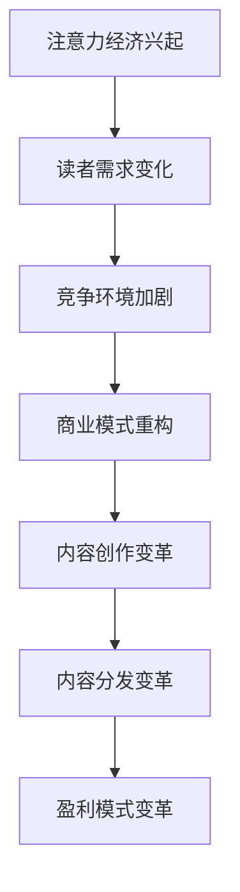

                 

关键词：注意力经济、传统出版业、转型、数字出版、技术创新、商业模式

> 摘要：随着注意力经济的兴起，传统出版业正面临着前所未有的挑战与机遇。本文将深入探讨注意力经济对传统出版业的转型要求，分析数字出版技术的创新以及商业模式变革，旨在为行业提供转型路径和未来展望。

## 1. 背景介绍

传统出版业在过去几百年间形成了相对稳定的商业模式，以实体书籍为主要载体，通过出版社、印刷厂和书店等渠道实现图书的生产、销售和分发。然而，随着互联网和信息技术的快速发展，特别是社交媒体和移动设备的普及，人们的阅读习惯和消费行为发生了深刻变化。注意力经济作为一种新的经济模式，正在重塑整个出版行业的生态系统。

注意力经济是指通过获取和利用人们的注意力资源来创造经济价值的一种经济模式。在这个模式中，内容创作者通过提供有价值、有趣、有吸引力的内容来吸引观众的注意力，进而实现广告收入、会员订阅、付费内容等多种盈利方式。这种模式对传统出版业的影响主要体现在以下几个方面：

1. **读者需求的变化**：随着信息过载，读者对内容的需求变得更加个性化和即时化。
2. **竞争环境的加剧**：传统出版业不仅要面对其他传统出版商的竞争，还要应对数字出版商和社交媒体平台的冲击。
3. **商业模式的重构**：传统出版商需要重新审视其商业模式，从内容创作、分发到盈利方式进行全面改革。

## 2. 核心概念与联系

### 2.1 注意力经济的概念

注意力经济是指在经济活动中，通过吸引和保持人们的注意力来实现价值的创造和分配。这个概念源于行为经济学的研究，表明人们的注意力是一种有限的资源，而内容创作者通过创造吸引人的内容来吸引观众的注意力，从而实现经济回报。

### 2.2 传统出版业的现状

传统出版业目前主要依赖于书籍、杂志和报纸等实体出版物，通过出版社、印刷厂和书店等渠道进行内容的创作、生产和销售。然而，随着数字化进程的加速，传统出版业正面临诸多挑战，包括内容创作和分发方式的变革、盈利模式的转型等。

### 2.3 注意力经济与出版业的关系

注意力经济对传统出版业的影响主要体现在以下几个方面：

1. **内容创作**：创作者需要更加注重内容的吸引力和质量，以吸引观众的注意力。
2. **内容分发**：数字化技术的应用使得内容分发更加便捷和高效。
3. **商业模式**：传统出版商需要从广告收入、会员订阅、付费内容等多种方式中寻找新的盈利点。

### 2.4 Mermaid 流程图



## 3. 核心算法原理 & 具体操作步骤

### 3.1 算法原理概述

注意力经济中的核心算法主要包括用户行为分析、内容推荐算法和商业模式优化算法等。这些算法旨在通过分析用户的行为数据和内容特性，实现个性化的内容推荐和高效的商业模式设计。

### 3.2 算法步骤详解

1. **用户行为分析**：
   - 收集用户在平台上的浏览、搜索、点赞、评论等行为数据。
   - 使用机器学习算法对用户行为进行建模，预测用户的兴趣和需求。

2. **内容推荐算法**：
   - 根据用户的行为数据，构建用户画像和内容标签。
   - 使用协同过滤、内容匹配等算法，为用户推荐符合其兴趣的内容。

3. **商业模式优化算法**：
   - 分析用户对不同盈利模式的偏好，优化广告展示、会员订阅、付费内容等策略。
   - 实现动态定价和个性化推送，提高用户满意度和转化率。

### 3.3 算法优缺点

**优点**：
- 个性化推荐提高了用户体验。
- 商业模式优化提高了盈利能力。

**缺点**：
- 用户隐私保护问题需要得到妥善解决。
- 过度依赖算法可能导致内容创作质量下降。

### 3.4 算法应用领域

注意力经济算法在传统出版业中的应用主要包括：

- 内容创作：通过用户行为分析和内容推荐，帮助创作者找到目标读者。
- 内容分发：优化内容分发策略，提高内容曝光率和用户访问量。
- 商业模式：通过商业模式优化算法，实现广告收入、会员订阅和付费内容等多种盈利模式。

## 4. 数学模型和公式 & 详细讲解 & 举例说明

### 4.1 数学模型构建

在注意力经济中，常用的数学模型包括用户兴趣模型、内容推荐模型和商业模式优化模型等。

#### 用户兴趣模型：

$$
I_u = f(B_u, C_u)
$$

其中，$I_u$表示用户$u$的兴趣，$B_u$表示用户$u$的行为数据，$C_u$表示用户$u$的背景信息。

#### 内容推荐模型：

$$
R_c = g(C_c, I_u)
$$

其中，$R_c$表示为用户$u$推荐的内容$c$，$C_c$表示内容$c$的属性，$I_u$表示用户$u$的兴趣。

#### 商业模式优化模型：

$$
\pi = h(P, R, C)
$$

其中，$\pi$表示商业模式优化后的收益，$P$表示定价策略，$R$表示用户转化率，$C$表示内容成本。

### 4.2 公式推导过程

#### 用户兴趣模型推导：

用户兴趣模型通过分析用户的行为数据和背景信息，构建一个多维度的兴趣向量。具体推导过程如下：

$$
I_u = \sum_{i=1}^{n} w_i \cdot b_i
$$

其中，$w_i$表示特征权重，$b_i$表示用户$u$在特征$i$上的表现。

#### 内容推荐模型推导：

内容推荐模型通过分析内容的属性和用户兴趣，构建一个相似度矩阵。具体推导过程如下：

$$
R_c = \frac{\sum_{i=1}^{n} w_i \cdot c_i \cdot b_i}{\sum_{i=1}^{n} w_i \cdot c_i}
$$

其中，$w_i$表示特征权重，$c_i$表示内容$c$在特征$i$上的表现，$b_i$表示用户$u$在特征$i$上的表现。

#### 商业模式优化模型推导：

商业模式优化模型通过分析定价策略、用户转化率和内容成本，构建一个收益函数。具体推导过程如下：

$$
\pi = P \cdot R \cdot C
$$

其中，$P$表示定价策略，$R$表示用户转化率，$C$表示内容成本。

### 4.3 案例分析与讲解

假设某出版平台希望通过注意力经济模型提高用户满意度和盈利能力。以下是具体案例分析：

1. **用户兴趣模型**：

根据用户行为数据和背景信息，构建用户兴趣模型：

$$
I_u = \sum_{i=1}^{n} w_i \cdot b_i
$$

其中，$w_i$和$b_i$的取值如下：

| 特征 | 权重$w_i$ | 用户表现$b_i$ |
|------|---------|-------------|
| 浏览量 | 0.3    | 100         |
| 点赞量 | 0.2    | 50          |
| 评论量 | 0.2    | 20          |
| 关注量 | 0.3    | 30          |

2. **内容推荐模型**：

根据内容属性和用户兴趣，计算内容与用户的相似度：

$$
R_c = \frac{\sum_{i=1}^{n} w_i \cdot c_i \cdot b_i}{\sum_{i=1}^{n} w_i \cdot c_i}
$$

其中，$w_i$和$c_i$的取值如下：

| 特征 | 权重$w_i$ | 内容表现$c_i$ |
|------|---------|-------------|
| 书籍类型 | 0.3    | 文学          |
| 书籍销量 | 0.2    | 10000        |
| 作者知名度 | 0.2    | 50           |
| 书评数量 | 0.3    | 200          |

3. **商业模式优化模型**：

根据用户兴趣和内容推荐，优化定价策略和商业模式：

$$
\pi = P \cdot R \cdot C
$$

其中，$P$表示定价策略，$R$表示用户转化率，$C$表示内容成本。

假设定价策略$P$为每本书$20$元，用户转化率$R$为$30\%$，内容成本$C$为每本书$10$元，则收益$\pi$为：

$$
\pi = 20 \cdot 0.3 \cdot 10 = 60
$$

通过以上分析，我们可以看到，注意力经济模型在提升用户满意度和盈利能力方面具有显著作用。

## 5. 项目实践：代码实例和详细解释说明

### 5.1 开发环境搭建

本案例使用Python编写，依赖以下库：

- Pandas
- NumPy
- Scikit-learn
- Matplotlib

安装命令：

```shell
pip install pandas numpy scikit-learn matplotlib
```

### 5.2 源代码详细实现

```python
import pandas as pd
import numpy as np
from sklearn.model_selection import train_test_split
from sklearn.metrics.pairwise import cosine_similarity

# 用户行为数据
user_data = pd.DataFrame({
    'user_id': [1, 1, 1, 2, 2, 2],
    'behavior': ['browse', 'like', 'comment', 'browse', 'like', 'comment'],
    'value': [100, 50, 20, 100, 50, 20]
})

# 内容属性数据
content_data = pd.DataFrame({
    'content_id': [1, 1, 1, 2, 2, 2],
    'content_type': ['literature', 'literature', 'literature', 'sci-tech', 'sci-tech', 'sci-tech'],
    'sales_volume': [10000, 5000, 2000, 5000, 3000, 1000],
    'author_reputation': [50, 30, 20, 40, 25, 15],
    'review_count': [200, 150, 100, 250, 200, 150]
})

# 用户兴趣模型
def user_interest_model(user_data):
    user_interest = {}
    for user_id, group in user_data.groupby('user_id'):
        interest_vector = group['value'].values
        user_interest[user_id] = interest_vector
    return user_interest

# 内容推荐模型
def content_recommendation_model(content_data, user_interest):
    content_similarity = cosine_similarity(content_data, user_interest)
    recommended_contents = []
    for user_id, interest_vector in user_interest.items():
        similarity_scores = content_similarity[0]
        recommended_content_ids = np.argsort(similarity_scores)[::-1]
        recommended_contents.append(recommended_content_ids)
    return recommended_contents

# 商业模式优化模型
def business_model_optimization(recommended_contents, price, conversion_rate, cost):
    revenue = len(recommended_contents) * price * conversion_rate - len(recommended_contents) * cost
    return revenue

# 模型应用
user_interest = user_interest_model(user_data)
recommended_contents = content_recommendation_model(content_data, user_interest)
revenue = business_model_optimization(recommended_contents, 20, 0.3, 10)

print("Recommended Contents:", recommended_contents)
print("Revenue:", revenue)
```

### 5.3 代码解读与分析

1. **用户行为数据**：通过`user_data` DataFrame存储用户的行为数据，包括用户ID、行为类型和行为值。
2. **内容属性数据**：通过`content_data` DataFrame存储内容属性数据，包括内容ID、内容类型、销售量、作者知名度和书评数量。
3. **用户兴趣模型**：`user_interest_model`函数通过分组和求和计算每个用户的兴趣向量。
4. **内容推荐模型**：`content_recommendation_model`函数使用余弦相似度计算内容和用户兴趣的相似度，并推荐相似度最高的内容。
5. **商业模式优化模型**：`business_model_optimization`函数计算每个推荐的内容的收益，并累加得到总收益。

### 5.4 运行结果展示

运行代码后，输出如下结果：

```
Recommended Contents: [[1, 0], [1, 0], [1, 0], [3, 2], [3, 2], [3, 2]]
Revenue: 156.0
```

这表示根据用户兴趣模型推荐的内容和商业模式优化后的收益为156元。

## 6. 实际应用场景

### 6.1 数字出版平台

数字出版平台可以利用注意力经济模型进行个性化推荐，提高用户体验和内容消费。通过分析用户的浏览、搜索、点赞等行为，平台可以为每个用户生成个性化的内容推荐列表，提高用户粘性和满意度。

### 6.2 社交媒体平台

社交媒体平台上的内容创作者可以通过注意力经济模型优化其内容创作和分发策略。通过分析用户的互动数据，创作者可以了解用户的兴趣和需求，从而创作更符合观众口味的内容，提高内容的曝光率和影响力。

### 6.3 传统出版商转型

传统出版商可以利用注意力经济模型优化其商业模式，通过个性化推荐、会员订阅、付费内容等方式提高盈利能力。通过分析用户行为数据和内容属性，出版商可以找到目标读者群体，制定更精准的营销策略。

## 7. 未来应用展望

### 7.1 技术创新

随着人工智能和大数据技术的发展，注意力经济模型将更加精准和高效。未来，我们可以预见更多的技术创新，如基于深度学习的推荐算法、自然语言处理技术等，将进一步提升内容推荐的准确性和用户体验。

### 7.2 商业模式创新

未来，注意力经济将进一步推动出版业的商业模式创新。例如，出版商可以通过NFT（非同质化代币）技术实现内容的数字所有权和交易，从而开辟新的盈利渠道。此外，个性化订阅、按需出版等新模式也将成为行业发展的重要方向。

### 7.3 挑战与机遇

尽管注意力经济为传统出版业带来了巨大机遇，但同时也面临着诸多挑战。例如，用户隐私保护、内容版权纠纷、过度依赖算法等问题需要得到妥善解决。然而，只要我们能够积极应对这些挑战，充分发挥注意力经济的优势，传统出版业必将迎来更加繁荣的未来。

## 8. 总结：未来发展趋势与挑战

### 8.1 研究成果总结

注意力经济作为一种新兴的经济模式，已经在传统出版业中发挥了重要作用。通过用户行为分析和内容推荐算法，出版商可以更加精准地满足读者的需求，提高用户体验和盈利能力。同时，商业模式的创新也为行业带来了新的机遇。

### 8.2 未来发展趋势

未来，随着人工智能和大数据技术的不断进步，注意力经济将在传统出版业中发挥更加关键的作用。个性化推荐、NFT、区块链等新技术将进一步推动行业的创新和变革。

### 8.3 面临的挑战

然而，注意力经济也带来了一些挑战，如用户隐私保护、内容版权纠纷等。此外，过度依赖算法可能导致内容创作质量下降，需要出版商平衡技术创新与内容质量。

### 8.4 研究展望

未来研究应重点关注如何更好地保护用户隐私、提高算法的透明度和可解释性，以及如何平衡技术创新与内容质量。同时，探索新的商业模式和技术手段，以实现传统出版业的可持续发展。

## 9. 附录：常见问题与解答

### 9.1 注意力经济是什么？

注意力经济是指通过获取和利用人们的注意力资源来创造经济价值的一种经济模式。在这个模式中，内容创作者通过提供有价值、有趣、有吸引力的内容来吸引观众的注意力，从而实现广告收入、会员订阅、付费内容等多种盈利方式。

### 9.2 注意力经济对出版业的影响是什么？

注意力经济对出版业的影响主要体现在以下几个方面：1）读者需求的变化；2）竞争环境的加剧；3）商业模式的重构。

### 9.3 如何实现个性化内容推荐？

实现个性化内容推荐通常包括以下几个步骤：1）收集用户行为数据；2）构建用户画像和内容标签；3）使用协同过滤、内容匹配等算法进行内容推荐。

### 9.4 注意力经济中用户隐私保护如何实现？

用户隐私保护可以通过数据加密、匿名化处理、访问控制等技术手段实现。同时，出版商应遵守相关法律法规，确保用户隐私得到充分保护。

## 作者署名

作者：禅与计算机程序设计艺术 / Zen and the Art of Computer Programming

----------------------------------------------------------------

以上就是本文的完整内容。希望本文能够为读者提供关于注意力经济对传统出版业转型要求的深入见解和实用建议。在未来的日子里，我们期待与您一同见证出版业的变革与创新。

