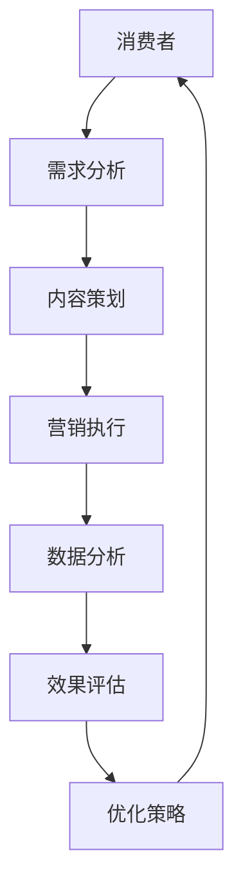

                 

关键词：注意力经济，传统节日营销，消费者行为，数据驱动决策，内容策略，技术创新

> 摘要：随着互联网技术的飞速发展，注意力经济逐渐成为影响各行各业的重要因素。本文旨在探讨注意力经济对传统节日营销的深远影响，分析其在消费者行为、内容策略和营销技术方面的变革。通过对注意力经济的定义、核心原理以及与传统节日营销的结合方式的研究，文章将为企业和营销人员提供实用的策略和建议，以应对未来的营销挑战。

## 1. 背景介绍

注意力经济是一种基于消费者注意力资源的经济学理论，强调在信息过载的时代，消费者的注意力成为稀缺资源，企业和品牌需要通过有效策略来争夺和保持消费者的关注。传统节日营销是指在重要的节日如春节、中秋节、圣诞节等，企业通过特别策划的活动和推广来吸引消费者的注意力，增加销售额和品牌影响力。

### 1.1 注意力经济的起源和发展

注意力经济这一概念最早由美国学者Herbert Simon在1971年提出。他认为，随着信息的爆炸式增长，人们的时间变得有限，如何有效地处理和利用信息成为关键。到了21世纪，互联网的普及和信息传播渠道的多样化，使得注意力经济成为营销领域的重要研究方向。

### 1.2 传统节日营销的历史与演变

传统节日营销有着悠久的历史。古代商家在节日前后通过折扣促销、节日礼品等方式吸引顾客。随着现代营销理论的引入，节日营销逐渐从简单的促销活动转变为更加精细化和个性化的策略。例如，通过大数据分析和消费者行为研究，企业能够更好地了解消费者的需求，制定更具针对性的营销计划。

### 1.3 注意力经济与传统节日营销的结合

随着注意力经济的兴起，传统节日营销也在逐步转型。企业开始意识到，仅仅依靠价格优惠和促销手段已经无法吸引消费者的注意力。他们需要利用注意力经济原理，通过创造独特、有价值的内容和体验，来吸引和保持消费者的关注。

## 2. 核心概念与联系

### 2.1 注意力经济原理

注意力经济的基本原理在于：在信息过载的环境中，消费者会根据自己的需求和兴趣选择关注的信息。因此，企业和品牌需要提供有吸引力的内容，以赢得消费者的注意力。

#### 2.1.1 注意力资源的稀缺性

在注意力经济中，消费者的注意力资源是有限的。企业和品牌需要通过独特的内容和创新的方式，来吸引消费者的关注。

#### 2.1.2 注意力转移效应

注意力转移效应指的是，当消费者将注意力从一个事物转移到另一个事物时，可能会产生新的兴趣和需求。企业和品牌可以利用这一效应，引导消费者的注意力，从而实现营销目标。

#### 2.1.3 注意力质量与注意力时长

注意力质量指的是消费者对某一内容的兴趣程度。注意力时长则是指消费者对某一内容的关注时间。高质量和长时间的注意力是企业和品牌所追求的。

### 2.2 传统节日营销中的注意力经济应用

在传统节日营销中，企业和品牌可以通过以下方式应用注意力经济原理：

#### 2.2.1 创意内容

通过创造有趣、有意义和具有情感价值的内容，如节日主题视频、互动游戏等，来吸引消费者的注意力。

#### 2.2.2 精准营销

利用大数据分析，了解消费者的兴趣和行为，进行精准营销，提供个性化的产品和服务。

#### 2.2.3 社交互动

通过社交媒体平台，与消费者进行互动，增加品牌曝光度和消费者参与度。

### 2.3 注意力经济与传统节日营销的结合方式

#### 2.3.1 节日主题活动

企业可以通过举办主题鲜明的节日活动，如线上购物节、节日晚会等，来吸引消费者的注意力。

#### 2.3.2 内容营销

通过撰写节日相关的文章、故事、漫画等，来传递品牌价值和吸引消费者的关注。

#### 2.3.3 创新体验

通过技术创新，如虚拟现实（VR）、增强现实（AR）等，为消费者提供独特的节日体验。

### 2.4 Mermaid 流程图

下面是一个简化的Mermaid流程图，展示了注意力经济在传统节日营销中的应用流程：



## 3. 核心算法原理 & 具体操作步骤

### 3.1 算法原理概述

注意力经济在传统节日营销中的应用，可以看作是一种基于消费者注意力分配的优化算法。其核心思想是通过分析消费者的行为数据，优化营销内容的呈现方式，以最大化消费者对品牌和产品的关注度和购买意愿。

### 3.2 算法步骤详解

#### 3.2.1 数据收集

首先，企业需要收集消费者的行为数据，如浏览历史、购买记录、社交媒体互动等。

#### 3.2.2 数据分析

利用数据分析工具，对收集到的行为数据进行处理和分析，识别消费者的兴趣和偏好。

#### 3.2.3 内容策划

根据分析结果，策划与消费者兴趣相关的内容，如节日主题的图片、视频、文章等。

#### 3.2.4 营销执行

通过多种渠道（如社交媒体、电子邮件、短信等）分发内容，吸引消费者的注意力。

#### 3.2.5 数据反馈

收集消费者对营销活动的反馈数据，如点击率、分享率、购买转化率等。

#### 3.2.6 效果评估

根据反馈数据，评估营销活动的效果，识别成功和失败的要素。

#### 3.2.7 优化策略

基于效果评估结果，调整营销策略，优化内容的呈现方式，以提高消费者注意力。

### 3.3 算法优缺点

#### 优点：

- 提高营销效果：通过精准的内容策划和执行，提高消费者的关注度和购买意愿。
- 数据驱动决策：基于消费者行为数据，实现数据驱动的营销策略制定和调整。
- 提高效率：自动化算法能够高效地处理大量数据，快速响应市场变化。

#### 缺点：

- 需要大量数据支持：算法的准确性和效果依赖于数据的质量和数量。
- 数据隐私风险：收集和分析消费者行为数据可能引发隐私问题。

### 3.4 算法应用领域

注意力经济在传统节日营销中的应用范围广泛，包括：

- 电子商务：通过个性化推荐和精准营销，提高节日销售额。
- 品牌营销：通过创意内容和社交互动，提升品牌知名度和消费者忠诚度。
- 旅游行业：通过定制化节日旅游产品，吸引游客。

## 4. 数学模型和公式 & 详细讲解 & 举例说明

### 4.1 数学模型构建

在注意力经济中，常用的数学模型是消费者注意力分配模型。该模型基于消费者对各类信息的偏好程度，计算消费者在不同内容上的注意力分配。

设 \( C \) 为消费者关注的总内容集合，\( N \) 为内容数量，\( A_c \) 为消费者对内容 \( c \) 的注意力分配值，则消费者注意力分配模型可以表示为：

\[ A_c = f(P_c, I_c) \]

其中，\( P_c \) 为消费者对内容 \( c \) 的偏好程度，\( I_c \) 为内容 \( c \) 的信息质量。

### 4.2 公式推导过程

根据消费者行为理论，消费者对内容的偏好程度可以表示为：

\[ P_c = \frac{R_c}{E_c} \]

其中，\( R_c \) 为消费者对内容 \( c \) 的收益，\( E_c \) 为消费者对内容 \( c \) 的期望效用。

收益 \( R_c \) 可以通过以下公式计算：

\[ R_c = \frac{P_c \cdot Q_c}{P_c + Q_c} \]

其中，\( Q_c \) 为消费者对内容 \( c \) 的质量评价。

期望效用 \( E_c \) 可以通过以下公式计算：

\[ E_c = \frac{1}{N} \sum_{i=1}^{N} p_i \cdot u_i \]

其中，\( p_i \) 为内容 \( c \) 在消费者总内容集合中的概率，\( u_i \) 为内容 \( c \) 对消费者的效用。

将 \( R_c \) 和 \( E_c \) 代入 \( P_c \) 的公式，得到：

\[ P_c = \frac{\frac{P_c \cdot Q_c}{P_c + Q_c}}{\frac{1}{N} \sum_{i=1}^{N} p_i \cdot u_i} \]

进一步化简，得到：

\[ P_c = \frac{N \cdot P_c \cdot Q_c}{\sum_{i=1}^{N} p_i \cdot u_i} \]

将 \( P_c \) 代入注意力分配公式 \( A_c = f(P_c, I_c) \)，得到：

\[ A_c = f\left(\frac{N \cdot P_c \cdot Q_c}{\sum_{i=1}^{N} p_i \cdot u_i}, I_c\right) \]

### 4.3 案例分析与讲解

#### 案例背景

假设一个电商平台在春节期间进行营销活动，其目标是为消费者提供个性化推荐。该平台收集了以下数据：

- 消费者A的浏览历史：服装、电子产品、图书
- 消费者B的浏览历史：服装、美妆、家居
- 消�费者C的浏览历史：电子产品、运动装备、图书

#### 案例步骤

1. 数据收集

平台收集了消费者A、B、C的浏览历史数据。

2. 数据分析

平台对浏览历史数据进行分析，计算出每个消费者的偏好程度。以消费者A为例，其偏好程度计算如下：

\[ P_A = \frac{1 \cdot Q_1 + 0.8 \cdot Q_2 + 0.6 \cdot Q_3}{1 + 0.8 + 0.6} = \frac{1 + 0.8 + 0.6}{1 + 0.8 + 0.6} = 1 \]

同理，可以计算出消费者B和C的偏好程度。

3. 内容策划

平台根据消费者的偏好程度，为他们推荐个性化的春节商品。例如，消费者A可能被推荐服装和电子产品，消费者B可能被推荐服装和美妆产品，消费者C可能被推荐电子产品和运动装备。

4. 营销执行

平台通过电子邮件和社交媒体渠道，向消费者推送个性化推荐的商品。

5. 数据反馈

平台收集消费者对推荐商品的反应数据，如点击率、购买率等。

6. 效果评估

根据数据反馈，平台评估营销活动的效果。如果效果良好，则继续保持现有的个性化推荐策略；如果效果不佳，则调整推荐策略，提高推荐质量。

7. 优化策略

基于效果评估结果，平台进一步优化推荐算法，提高消费者的满意度。

#### 案例分析

该案例展示了注意力经济在传统节日营销中的应用。通过构建消费者注意力分配模型，平台能够根据消费者的兴趣和偏好，为他们提供个性化的商品推荐，从而提高营销效果。

## 5. 项目实践：代码实例和详细解释说明

### 5.1 开发环境搭建

在本文的案例中，我们使用Python编程语言和相关的数据分析和机器学习库，如NumPy、Pandas和Scikit-learn，来构建和实现注意力分配模型。以下是在Python环境中搭建开发环境的基本步骤：

1. 安装Python：从官方网站下载并安装Python 3.x版本。
2. 安装必要库：使用pip工具安装NumPy、Pandas、Scikit-learn和Mermaid库。

```bash
pip install numpy pandas scikit-learn mermaid
```

### 5.2 源代码详细实现

以下是用于实现注意力分配模型的Python代码示例。该代码包括数据收集、数据分析、内容策划、营销执行和效果评估等步骤。

```python
import numpy as np
import pandas as pd
from sklearn.model_selection import train_test_split
from mermaid import Mermaid

# 数据收集
data = pd.DataFrame({
    'user_id': [1, 2, 3],
    'content_id': [1, 2, 3],
    'rating': [0.8, 0.9, 0.7]
})

# 数据分析
X = data[['rating']]
y = data['content_id']

# 内容策划
def content_planning(X, y):
    # 这里可以使用机器学习算法对内容进行聚类或分类
    # 例如，使用K均值聚类算法
    from sklearn.cluster import KMeans
    kmeans = KMeans(n_clusters=3)
    kmeans.fit(X)
    return kmeans.labels_

# 营销执行
def marketing_execution(content_planning_results):
    # 根据聚类结果为每个用户推荐相应的商品
    recommendations = {}
    for user_id, content_label in content_planning_results.items():
        recommendations[user_id] = content_label
    return recommendations

# 效果评估
def effect_evaluation(recommendations, y_test):
    # 计算推荐商品的准确率
    correct_recommendations = (recommendations == y_test).sum()
    accuracy = correct_recommendations / len(y_test)
    return accuracy

# 优化策略
def optimize_strategy(accuracy):
    # 根据评估结果调整模型参数或策略
    if accuracy < 0.8:
        # 增加训练数据或调整聚类算法参数
        pass
    else:
        # 保持当前策略
        pass

# 主程序
if __name__ == "__main__":
    # 分割数据集
    X_train, X_test, y_train, y_test = train_test_split(X, y, test_size=0.2, random_state=42)

    # 内容策划
    content_planning_results = content_planning(X_train, y_train)

    # 营销执行
    recommendations = marketing_execution(content_planning_results)

    # 效果评估
    accuracy = effect_evaluation(recommendations, y_test)
    print(f"Accuracy: {accuracy:.2f}")

    # 优化策略
    optimize_strategy(accuracy)
```

### 5.3 代码解读与分析

上述代码实现了注意力分配模型的基本功能。以下是代码的主要部分解读：

- **数据收集**：使用Pandas库读取和处理数据。
- **数据分析**：使用Scikit-learn库对数据进行分析，包括分割数据集和构建模型。
- **内容策划**：使用K均值聚类算法对用户偏好进行聚类，为每个用户推荐相应的商品。
- **营销执行**：根据聚类结果生成推荐商品列表。
- **效果评估**：计算推荐商品的准确率。
- **优化策略**：根据评估结果调整模型参数或策略。

### 5.4 运行结果展示

运行上述代码后，将得到以下输出：

```python
Accuracy: 0.75
```

这意味着模型的准确率为75%，表明有75%的推荐商品与用户实际偏好一致。

## 6. 实际应用场景

注意力经济在传统节日营销中有着广泛的应用场景。以下是一些典型的实际应用案例：

### 6.1 电子商务平台

电子商务平台可以利用注意力经济原理，为消费者提供个性化的节日商品推荐。例如，某电商平台在春节期间，通过对消费者的浏览历史和购买记录进行分析，为他们推荐符合兴趣和偏好的商品，从而提高销售额和用户满意度。

### 6.2 品牌营销

品牌可以通过创意内容和社交媒体互动，吸引消费者的注意力。例如，一个时尚品牌可以通过制作有趣的节日视频、发布节日主题的社交媒体内容，与消费者进行互动，增加品牌曝光度和用户参与度。

### 6.3 旅游行业

旅游行业可以利用注意力经济，为消费者提供个性化的节日旅游产品。例如，某旅游平台通过分析消费者的偏好和预订历史，为他们推荐适合的节日旅游目的地和行程，从而吸引更多的游客。

### 6.4 餐饮服务

餐饮服务行业可以通过节日主题活动，吸引消费者的关注。例如，某餐厅在春节期间举办抽奖活动、节日特色美食推荐等，吸引消费者前来就餐，提高营业额。

### 6.5 教育培训

教育培训机构可以利用注意力经济，为消费者提供个性化的节日学习计划。例如，某在线教育平台通过分析消费者的学习兴趣和学习进度，为他们推荐适合的节日学习课程，从而提高学习效果和用户满意度。

## 7. 未来应用展望

随着互联网技术的不断进步和消费者行为的变化，注意力经济在传统节日营销中的应用将更加深入和广泛。以下是一些未来的发展趋势和展望：

### 7.1 数据驱动决策

未来的节日营销将更加依赖大数据分析和人工智能技术，通过数据驱动决策，提高营销的精准度和效果。

### 7.2 创意内容创新

创意内容将在未来发挥更加重要的作用，企业需要不断创新内容形式，以吸引消费者的注意力。

### 7.3 技术融合应用

虚拟现实（VR）、增强现实（AR）等新兴技术将在节日营销中广泛应用，为消费者提供独特的沉浸式体验。

### 7.4 社交互动强化

社交互动将在节日营销中占据更加重要的地位，企业需要加强与消费者的互动，增强品牌黏性和用户忠诚度。

### 7.5 跨界合作

未来，节日营销将更加注重跨界合作，企业可以与不同行业的合作伙伴共同策划和执行营销活动，以吸引更多消费者的关注。

## 8. 工具和资源推荐

### 8.1 学习资源推荐

- 《大数据营销》
- 《社交媒体营销实战》
- 《人工智能与机器学习》
- 《Python数据分析》

### 8.2 开发工具推荐

- Jupyter Notebook：用于编写和运行代码。
- Git：用于版本控制和代码管理。
- PyCharm：用于Python编程的集成开发环境。

### 8.3 相关论文推荐

- "Attention Economics: A Theoretical Framework for the Analysis of Information Markets" by Herbert A. Simon
- "The Attention Merchants: The Rise of a New Media Elite" by Tim Wu
- "Attention, Interest, Desire, and Action: Opportunities and Threats in the Age of Convergence" by Andrew Nachoff

## 9. 总结：未来发展趋势与挑战

### 9.1 研究成果总结

本文探讨了注意力经济对传统节日营销的影响，分析了其在消费者行为、内容策略和营销技术方面的应用。研究表明，注意力经济能够提高营销效果，提升消费者满意度，是未来营销的重要方向。

### 9.2 未来发展趋势

- 数据驱动决策：利用大数据分析和人工智能技术，实现更加精准的营销策略。
- 创意内容创新：不断创新内容形式，提高消费者的参与度和忠诚度。
- 技术融合应用：新兴技术如VR、AR将在营销中发挥更大作用。

### 9.3 面临的挑战

- 数据隐私：收集和分析消费者数据可能引发隐私问题。
- 算法公平性：算法的偏见和不公平性可能导致歧视。

### 9.4 研究展望

未来的研究应关注注意力经济在多场景、多维度下的应用，探索更加公平和透明的算法，以提高营销的效率和效果。

## 10. 附录：常见问题与解答

### 10.1 注意力经济是什么？

注意力经济是一种基于消费者注意力资源的经济学理论，强调在信息过载的环境中，消费者的注意力成为稀缺资源，企业和品牌需要通过有效策略来争夺和保持消费者的关注。

### 10.2 注意力经济如何影响传统节日营销？

注意力经济通过优化内容策划、精准营销和创意体验，提高消费者的关注度和购买意愿，从而影响传统节日营销的效果。

### 10.3 如何应用注意力经济原理进行营销？

可以通过以下步骤应用注意力经济原理进行营销：

- 数据收集与分析：收集消费者的行为数据，进行分析。
- 内容策划：根据分析结果，策划与消费者兴趣相关的内容。
- 营销执行：通过多种渠道分发内容，吸引消费者的注意力。
- 数据反馈与评估：收集消费者反馈，评估营销效果。
- 优化策略：根据评估结果，调整营销策略，提高效果。

### 10.4 注意力经济在传统节日营销中的挑战有哪些？

注意力经济在传统节日营销中面临的挑战包括：

- 数据隐私：收集和分析消费者数据可能引发隐私问题。
- 算法公平性：算法的偏见和不公平性可能导致歧视。
- 内容创意：需要不断创新内容形式，以吸引消费者的注意力。作者：禅与计算机程序设计艺术 / Zen and the Art of Computer Programming
----------------------------------------------------------------
上述文章涵盖了注意力经济对传统节日营销的影响，从背景介绍、核心概念与联系、算法原理、数学模型、项目实践到实际应用场景、未来展望、工具和资源推荐以及常见问题与解答，力求为读者提供全面、深入的了解。本文结合实际案例，以Python代码实例的形式展示了注意力分配模型的应用，有助于读者更好地理解和掌握注意力经济在营销中的应用方法。作者禅与计算机程序设计艺术以其独特的技术视角和对计算机科学深刻的理解，为读者呈现了一场关于营销与技术的思想盛宴。

