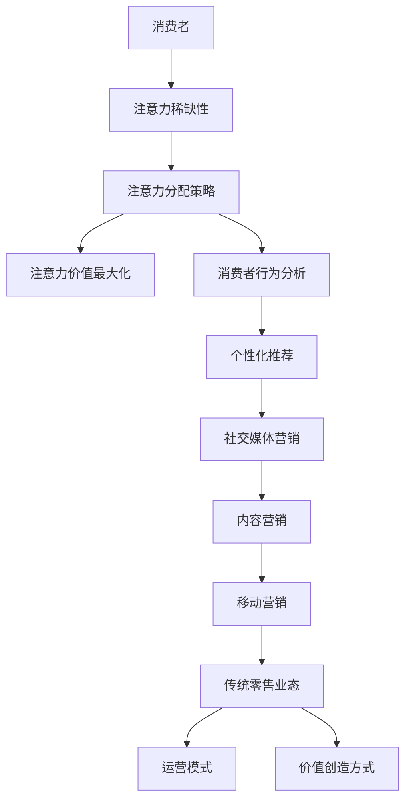

                 

### 1. 背景介绍

随着互联网和移动设备的普及，消费者的购物行为正在发生巨大的变化。传统的零售业态，如实体店铺和线上电商，正面临着前所未有的挑战。而注意力经济作为一种新兴的经济模式，正在逐渐改变传统零售的运作方式。

注意力经济，也被称为“注意力市场”，是指通过吸引消费者的注意力来创造经济价值的一种经济模式。在这种模式下，消费者注意力被视为一种稀缺资源，企业和商家通过各种手段来争夺消费者的注意力，从而实现商业价值的最大化。

传统零售业态，如实体店铺和线上电商，主要依靠商品本身的特点和价格来吸引消费者。然而，在注意力经济时代，消费者不再仅仅关注商品本身，而是更加关注如何满足自己的需求和兴趣。这种变化要求零售业态必须进行相应的改造，以适应新的消费者行为和市场环境。

本文将探讨注意力经济对传统零售业态的改造，分析其中的核心概念和原理，并通过具体的案例和实践来展示注意力经济在传统零售中的实际应用。

### 1.1 注意力经济的历史和发展

注意力经济的概念最早可以追溯到20世纪末，当时互联网刚刚开始普及，一些学者和商业人士开始关注网络上的注意力分配问题。随着互联网和移动设备的不断发展，注意力经济逐渐成为了一个重要的研究领域。

在互联网的早期阶段，注意力主要是由内容创造者来分配的。比如，博客、论坛和社交媒体等平台通过发布有价值的内容来吸引读者的注意力。然而，随着广告业的兴起，注意力分配逐渐从内容创造者转移到了广告商。

广告商通过购买广告位和推广服务来吸引消费者的注意力，从而实现商业目的。这种模式在互联网上非常成功，因为互联网上的注意力是一种稀缺资源，吸引消费者的注意力意味着可以获得更多的流量和商业机会。

随着移动互联网的普及，消费者的注意力分配方式再次发生了变化。移动设备，如智能手机和平板电脑，使得消费者可以随时随地获取信息和服务。这导致了消费者注意力的碎片化和分散化，同时也为零售业态的改造提供了新的机会。

注意力经济的发展与消费者行为的变化密切相关。在传统的零售业态中，消费者主要通过实体店铺和线上电商平台来购买商品。然而，在注意力经济时代，消费者更加关注自己的兴趣和需求，他们更加愿意关注那些能够满足自己兴趣和需求的商品和服务。

这种变化对传统零售业态提出了新的要求。首先，零售业态需要更加精准地了解消费者的兴趣和需求，以便提供个性化的服务和推荐。其次，零售业态需要利用各种技术手段来吸引消费者的注意力，如社交媒体营销、内容营销和移动营销等。

### 1.2 传统零售业态面临的挑战

在注意力经济时代，传统零售业态面临着诸多挑战。首先，消费者行为的变化导致了零售业态需要更加关注消费者的兴趣和需求。传统的零售业态往往依赖于商品本身的特点和价格来吸引消费者，但在注意力经济时代，这种模式已经不再适用。

其次，注意力经济的崛起使得消费者的注意力变得更加分散。在互联网和移动互联网的背景下，消费者可以随时随地获取各种信息，这导致了消费者的注意力变得碎片化和分散化。传统零售业态需要找到新的方法来吸引和保持消费者的注意力。

此外，传统零售业态还面临着成本和效率的挑战。随着电商平台的兴起，消费者可以更加便捷地购买商品，这导致了传统零售业态的销售额下降。为了应对这一挑战，传统零售业态需要提高运营效率，降低成本，并提供更加优质的购物体验。

### 1.3 注意力经济对传统零售业态的改造

注意力经济对传统零售业态的改造主要体现在以下几个方面：

1. **个性化推荐**

在注意力经济时代，消费者更加关注个性化推荐。传统零售业态可以通过大数据分析和机器学习技术来了解消费者的兴趣和需求，从而提供个性化的推荐服务。这不仅可以帮助零售业态吸引更多的消费者，还可以提高消费者的满意度和忠诚度。

2. **社交媒体营销**

社交媒体已经成为消费者获取信息和分享经验的重要平台。传统零售业态可以利用社交媒体平台来吸引消费者的注意力，如发布有趣的内容、开展互动活动等。这不仅可以提高品牌的知名度，还可以促进消费者对商品的购买意愿。

3. **内容营销**

内容营销是一种通过创造和分享有价值的内容来吸引消费者的注意力，从而实现商业目的的策略。传统零售业态可以通过创建有趣、有吸引力的内容来吸引消费者的注意力，如发布商品评测、购物指南等。这不仅可以提高消费者的购买意愿，还可以建立品牌信任。

4. **移动营销**

随着移动互联网的普及，移动设备已经成为消费者获取信息和购买商品的主要工具。传统零售业态可以通过移动应用和短信等方式来吸引消费者的注意力，如发布优惠活动、推送个性化推荐等。这不仅可以提高消费者的参与度，还可以促进消费者的购买行为。

5. **场景化营销**

场景化营销是一种根据消费者的行为场景来提供相应的服务和推荐的方法。传统零售业态可以通过分析消费者的购物场景，如购物前、购物中和购物后，来提供个性化的服务和推荐。这不仅可以提高消费者的购物体验，还可以提高销售额。

### 1.4 注意力经济的核心概念和原理

在探讨注意力经济对传统零售业态的改造之前，我们需要了解注意力经济的核心概念和原理。

1. **注意力稀缺性**

注意力稀缺性是注意力经济的核心概念之一。在互联网和移动互联网时代，消费者的注意力成为一种稀缺资源。由于信息爆炸和碎片化，消费者无法关注所有的信息，因此，注意力分配变得尤为重要。企业需要找到有效的方法来吸引和保持消费者的注意力，从而实现商业目标。

2. **注意力分配策略**

注意力分配策略是指企业如何利用各种手段来吸引和保持消费者的注意力。注意力分配策略包括个性化推荐、社交媒体营销、内容营销、移动营销和场景化营销等。通过这些策略，企业可以更好地了解消费者的兴趣和需求，从而提供个性化的服务和推荐。

3. **注意力价值最大化**

注意力价值最大化是指企业通过吸引和保持消费者的注意力，从而实现商业价值最大化。在注意力经济时代，消费者的注意力成为一种重要的资产，企业需要找到有效的方法来提高注意力的价值。这可以通过提高品牌的知名度、增强消费者的满意度和忠诚度等方式来实现。

4. **消费者行为分析**

消费者行为分析是注意力经济的重要基础。通过分析消费者的行为数据，企业可以了解消费者的兴趣、需求和购买习惯等，从而提供个性化的推荐和服务。消费者行为分析可以基于大数据分析和机器学习技术，以提高分析结果的准确性和有效性。

### 1.5 注意力经济与传统零售业态的比较

注意力经济与传统零售业态在以下几个方面存在明显的差异：

1. **消费者关注点**

传统零售业态主要关注商品本身的特点和价格，而注意力经济更加关注消费者的兴趣和需求。在注意力经济时代，消费者不再仅仅关注商品的质量和价格，而是更加关注商品是否能够满足自己的兴趣和需求。

2. **营销手段**

传统零售业态主要依赖于广告和促销来吸引消费者，而注意力经济则更加依赖于个性化推荐、社交媒体营销和内容营销等手段。注意力经济通过创造和分享有价值的内容来吸引消费者的注意力，从而提高消费者的参与度和购买意愿。

3. **运营模式**

传统零售业态的运营模式相对固定，主要依赖于实体店铺和线上电商平台。而注意力经济则更加灵活和多样化，企业可以通过多种渠道和方式来吸引消费者的注意力，如移动应用、社交媒体和内容平台等。

4. **价值创造方式**

传统零售业态主要通过销售商品来创造价值，而注意力经济则更加注重通过吸引和保持消费者的注意力来创造价值。注意力经济通过提高消费者的满意度和忠诚度，从而实现长期的价值增长。

### 1.6 注意力经济对零售行业的影响

注意力经济对零售行业产生了深远的影响，主要体现在以下几个方面：

1. **消费者行为变化**

注意力经济改变了消费者的购物行为和消费习惯。消费者不再仅仅关注商品本身，而是更加关注如何满足自己的兴趣和需求。这种变化要求零售业态必须提供更加个性化、定制化的服务和体验。

2. **市场竞争加剧**

注意力经济使得零售市场竞争变得更加激烈。企业需要不断创新和提升自己的竞争力，以吸引和保持消费者的注意力。这导致了零售行业的快速发展和变革。

3. **零售业态多样化**

注意力经济促使零售业态变得更加多样化。除了传统的实体店铺和线上电商平台，还出现了社交媒体营销、内容营销和移动营销等新型零售业态。这些新兴业态通过不同的方式吸引消费者的注意力，从而实现商业价值的最大化。

4. **数据驱动的决策**

注意力经济使得零售业态更加依赖于数据分析和消费者行为分析。企业通过收集和分析消费者的行为数据，可以更好地了解消费者的兴趣和需求，从而做出更加精准的营销和运营决策。

### 1.7 注意力经济与传统零售业态的融合

在注意力经济时代，传统零售业态需要与注意力经济相结合，以适应新的市场环境。以下是一些传统零售业态与注意力经济融合的途径：

1. **社交媒体整合**

传统零售业态可以通过社交媒体平台来整合营销活动，如发布商品信息、开展互动活动和提供优惠券等。这不仅可以提高品牌的知名度，还可以吸引消费者的注意力。

2. **内容营销推广**

传统零售业态可以通过创建有趣、有吸引力的内容来吸引消费者的注意力，如发布商品评测、购物指南和生活方式分享等。这不仅可以提高消费者的购买意愿，还可以建立品牌信任。

3. **个性化推荐应用**

传统零售业态可以通过大数据分析和机器学习技术来提供个性化的推荐服务，如根据消费者的兴趣和购买历史来推荐商品。这不仅可以提高消费者的购物体验，还可以增加销售额。

4. **移动营销策略**

传统零售业态可以通过移动应用和短信等方式来吸引消费者的注意力，如发布优惠活动、推送个性化推荐和提供便捷的购物服务。这不仅可以提高消费者的参与度，还可以促进消费者的购买行为。

### 1.8 注意力经济对传统零售业态的挑战与机遇

注意力经济为传统零售业态带来了新的挑战和机遇：

**挑战：**

1. **市场竞争加剧**：注意力经济使得市场竞争变得更加激烈，传统零售业态需要不断提升自身的竞争力，以吸引和保持消费者的注意力。

2. **消费者需求变化**：消费者的需求变得更加多样化，传统零售业态需要提供更加个性化、定制化的服务和体验，以满足消费者的需求。

3. **运营成本上升**：注意力经济要求传统零售业态进行数字化转型，这可能导致运营成本的上升，特别是对于中小企业来说，这可能会带来一定的挑战。

**机遇：**

1. **市场潜力巨大**：注意力经济为传统零售业态带来了巨大的市场潜力，通过创新和提升自身的竞争力，传统零售业态可以抢占新的市场份额。

2. **消费者粘性增强**：通过个性化推荐、社交媒体营销和内容营销等方式，传统零售业态可以增强消费者的粘性和忠诚度。

3. **商业模式创新**：注意力经济促使传统零售业态进行商业模式创新，如通过社交媒体营销和内容营销等方式实现跨界合作，从而拓宽业务范围和提升竞争力。

### 1.9 结论

注意力经济对传统零售业态的改造是一种必然的趋势。在这种经济模式下，消费者注意力成为一种重要的资源，企业和商家需要通过创新和提升自身的竞争力来吸引和保持消费者的注意力。传统零售业态需要与注意力经济相结合，通过个性化推荐、社交媒体营销、内容营销和移动营销等方式来适应新的市场环境。只有不断进行创新和优化，传统零售业态才能在注意力经济时代获得持续的发展。

### 2. 核心概念与联系

在探讨注意力经济对传统零售业态的改造之前，我们需要明确注意力经济的核心概念和原理，并了解它们与传统零售业态之间的关系。

#### 2.1 注意力经济的核心概念

注意力经济的核心概念包括以下几个方面：

1. **注意力稀缺性**：在互联网和移动互联网时代，消费者的注意力成为一种稀缺资源。由于信息爆炸和碎片化，消费者无法关注所有的信息，因此，注意力分配变得尤为重要。企业需要找到有效的方法来吸引和保持消费者的注意力，从而实现商业目标。

2. **注意力分配策略**：注意力分配策略是指企业如何利用各种手段来吸引和保持消费者的注意力。注意力分配策略包括个性化推荐、社交媒体营销、内容营销、移动营销和场景化营销等。通过这些策略，企业可以更好地了解消费者的兴趣和需求，从而提供个性化的服务和推荐。

3. **注意力价值最大化**：注意力价值最大化是指企业通过吸引和保持消费者的注意力，从而实现商业价值最大化。在注意力经济时代，消费者的注意力成为一种重要的资产，企业需要找到有效的方法来提高注意力的价值。这可以通过提高品牌的知名度、增强消费者的满意度和忠诚度等方式来实现。

4. **消费者行为分析**：消费者行为分析是注意力经济的重要基础。通过分析消费者的行为数据，企业可以了解消费者的兴趣、需求和购买习惯等，从而提供个性化的推荐和服务。消费者行为分析可以基于大数据分析和机器学习技术，以提高分析结果的准确性和有效性。

#### 2.2 注意力经济与传统零售业态的关系

注意力经济与传统零售业态之间存在密切的联系和互动。以下是从几个方面来看它们之间的关系：

1. **消费者关注点**：在传统零售业态中，消费者的关注点主要集中在商品的质量、价格和购买便捷性。而在注意力经济时代，消费者的关注点逐渐转向如何满足自己的兴趣和需求。这意味着，传统零售业态需要更加关注消费者的兴趣和需求，以提供更加个性化的服务和体验。

2. **营销手段**：传统零售业态主要依赖于广告和促销来吸引消费者。而在注意力经济时代，营销手段变得更加多样化和个性化。企业可以通过社交媒体营销、内容营销和移动营销等方式来吸引消费者的注意力，从而提高品牌的知名度和销售额。

3. **运营模式**：传统零售业态主要依赖于实体店铺和线上电商平台。而在注意力经济时代，企业可以通过多种渠道和方式来吸引消费者的注意力，如移动应用、社交媒体和内容平台等。这种多元化的运营模式使得传统零售业态更加灵活和适应市场需求。

4. **价值创造方式**：传统零售业态主要通过销售商品来创造价值。而在注意力经济时代，企业可以通过吸引和保持消费者的注意力来创造价值。这不仅可以提高品牌的知名度，还可以增强消费者的满意度和忠诚度，从而实现长期的价值增长。

#### 2.3 注意力经济的 Mermaid 流程图

为了更好地理解注意力经济与传统零售业态之间的关系，我们可以通过 Mermaid 流程图来展示注意力经济的关键节点和流程。



在这个流程图中，消费者作为注意力经济的起点，通过注意力稀缺性、注意力分配策略、注意力价值最大化和消费者行为分析等环节，最终影响传统零售业态的运营模式和价值创造方式。

### 3. 核心算法原理 & 具体操作步骤

#### 3.1 算法原理概述

在注意力经济中，核心算法的原理主要包括两个方面：消费者行为分析和个性化推荐。

**消费者行为分析**：
消费者行为分析是一种通过收集和分析消费者的行为数据来了解他们的兴趣、需求和购买习惯的方法。这些数据可以来自多种渠道，如在线购物平台、社交媒体、搜索引擎等。通过分析这些数据，企业可以识别出消费者的行为模式，从而提供更加个性化的服务和推荐。

**个性化推荐**：
个性化推荐是一种基于消费者行为数据、兴趣和购买历史等信息，为消费者推荐他们可能感兴趣的商品或服务的方法。这种算法可以通过机器学习技术来实现，如协同过滤、基于内容的推荐和深度学习等。

#### 3.2 算法步骤详解

1. **数据收集**：
   - 从多个渠道收集消费者行为数据，如购买历史、浏览记录、搜索关键词、社交媒体互动等。
   - 对数据进行清洗和预处理，以确保数据的质量和一致性。

2. **特征提取**：
   - 对收集到的数据进行分析，提取出与消费者行为相关的特征，如购买频率、浏览时间、搜索关键词等。
   - 使用统计分析方法或机器学习算法来识别出消费者的兴趣和需求。

3. **模型训练**：
   - 根据提取的特征，使用机器学习算法（如协同过滤、基于内容的推荐、深度学习等）来训练推荐模型。
   - 调整模型参数，以提高推荐系统的准确性和效果。

4. **推荐生成**：
   - 使用训练好的模型来预测消费者可能感兴趣的商品或服务。
   - 根据预测结果，生成个性化推荐列表，并将其呈现给消费者。

5. **评估与优化**：
   - 对推荐系统进行评估，如计算推荐点击率、转化率和满意度等指标。
   - 根据评估结果，对推荐模型进行调整和优化，以提高推荐效果。

#### 3.3 算法优缺点

**优点**：

1. **个性化**：个性化推荐可以更好地满足消费者的个性化需求，提高消费者的满意度和忠诚度。

2. **高效**：基于大数据和机器学习技术的推荐系统可以在短时间内处理大量数据，并提供高效的推荐结果。

3. **自适应**：推荐系统可以根据消费者的实时行为和反馈进行调整，以提供更加精准的推荐。

**缺点**：

1. **数据依赖**：推荐系统依赖于大量消费者行为数据，数据的准确性和完整性对推荐效果有重要影响。

2. **冷启动问题**：对于新用户或新商品，由于缺乏足够的行为数据，推荐系统难以提供准确的推荐。

3. **隐私问题**：收集和分析消费者行为数据可能涉及隐私问题，需要确保数据的安全和合规。

#### 3.4 算法应用领域

个性化推荐算法在零售、金融、医疗、娱乐等多个领域都有广泛的应用：

1. **零售**：在线零售平台使用个性化推荐来提高销售额和客户满意度。

2. **金融**：金融机构通过个性化推荐来提供定制化的金融服务和投资建议。

3. **医疗**：医疗保健机构使用个性化推荐来推荐合适的医疗方案和保健产品。

4. **娱乐**：流媒体平台通过个性化推荐来推荐适合用户兴趣的视频和音乐。

#### 3.5 实际案例

**案例：亚马逊的个性化推荐**

亚马逊是全球最大的在线零售平台之一，其个性化推荐系统在全球范围内都取得了巨大的成功。

1. **数据收集**：
   - 亚马逊收集了大量的消费者行为数据，如购买历史、浏览记录、搜索关键词等。

2. **特征提取**：
   - 亚马逊对收集到的数据进行处理，提取出与消费者行为相关的特征，如购买频率、浏览时间、搜索关键词等。

3. **模型训练**：
   - 亚马逊使用协同过滤和基于内容的推荐算法来训练推荐模型。

4. **推荐生成**：
   - 亚马逊使用训练好的模型来预测消费者可能感兴趣的商品，并生成个性化推荐列表。

5. **评估与优化**：
   - 亚马逊通过计算推荐点击率、转化率和满意度等指标来评估推荐效果，并根据评估结果对推荐模型进行调整和优化。

通过这个案例，我们可以看到个性化推荐算法在提升销售额和客户满意度方面的重要作用。亚马逊的个性化推荐系统不仅提高了消费者的购物体验，还帮助亚马逊在激烈的市场竞争中脱颖而出。

### 4. 数学模型和公式 & 详细讲解 & 举例说明

#### 4.1 数学模型构建

在注意力经济中，我们主要关注两个关键指标：注意力分配和注意力价值。为了构建数学模型，我们需要定义以下变量和参数：

- \( A \)：消费者的总注意力资源
- \( n \)：消费者的兴趣类别数量
- \( a_i \)：消费者在类别 \( i \) 上的注意力分配比例
- \( v_i \)：类别 \( i \) 的价值系数
- \( p_i \)：类别 \( i \) 的吸引力指数
- \( u_i \)：消费者在类别 \( i \) 上的满意度

基于以上变量和参数，我们可以构建一个注意力分配的数学模型：

\[ A = \sum_{i=1}^{n} a_i \]

\[ \text{目标函数}： \max \sum_{i=1}^{n} v_i \cdot a_i \cdot \frac{p_i}{u_i} \]

其中，目标函数表示消费者在总注意力资源有限的情况下，如何最大化满足其兴趣和需求的总价值。\( v_i \) 表示类别 \( i \) 的价值系数，反映了消费者对类别 \( i \) 的偏好程度；\( p_i \) 表示类别 \( i \) 的吸引力指数，反映了类别 \( i \) 的市场竞争力；\( u_i \) 表示消费者在类别 \( i \) 上的满意度，反映了消费者对类别 \( i \) 的接受程度。

#### 4.2 公式推导过程

为了推导注意力分配模型，我们需要首先定义几个关键的概念和假设：

1. **注意力分配比例**：假设消费者在类别 \( i \) 上的注意力分配比例为 \( a_i \)，则 \( a_i \) 满足以下约束条件：

\[ \sum_{i=1}^{n} a_i = A \]

其中，\( A \) 表示消费者的总注意力资源。

2. **价值系数和吸引力指数**：假设类别 \( i \) 的价值系数为 \( v_i \)，吸引力指数为 \( p_i \)。价值系数反映了消费者对类别 \( i \) 的偏好程度，吸引力指数反映了类别 \( i \) 的市场竞争力。

3. **满意度**：假设消费者在类别 \( i \) 上的满意度为 \( u_i \)，则满意度与价值系数和吸引力指数的关系为：

\[ u_i = \frac{v_i \cdot p_i}{\max_{j} (v_j \cdot p_j)} \]

4. **目标函数**：目标函数表示消费者在总注意力资源有限的情况下，如何最大化满足其兴趣和需求的总价值：

\[ \text{目标函数}： \max \sum_{i=1}^{n} v_i \cdot a_i \cdot \frac{p_i}{u_i} \]

为了推导目标函数，我们首先对满意度 \( u_i \) 进行变形：

\[ u_i = \frac{v_i \cdot p_i}{\max_{j} (v_j \cdot p_j)} = \frac{v_i \cdot p_i}{\sum_{j=1}^{n} v_j \cdot p_j} \]

代入目标函数：

\[ \text{目标函数}： \max \sum_{i=1}^{n} v_i \cdot a_i \cdot \frac{p_i}{u_i} = \max \sum_{i=1}^{n} \frac{v_i \cdot p_i \cdot a_i}{\sum_{j=1}^{n} v_j \cdot p_j} \]

由于 \( \sum_{j=1}^{n} v_j \cdot p_j \) 为常数，我们可以将其提取出来：

\[ \text{目标函数}： \max \sum_{i=1}^{n} v_i \cdot a_i \cdot \frac{p_i}{u_i} = \max \frac{1}{\sum_{j=1}^{n} v_j \cdot p_j} \sum_{i=1}^{n} v_i \cdot p_i \cdot a_i \]

由于 \( a_i \) 满足 \( \sum_{i=1}^{n} a_i = A \)，我们可以将 \( a_i \) 替换为 \( A \cdot \frac{v_i \cdot p_i}{\sum_{j=1}^{n} v_j \cdot p_j} \)：

\[ \text{目标函数}： \max \sum_{i=1}^{n} v_i \cdot a_i \cdot \frac{p_i}{u_i} = \max \frac{1}{\sum_{j=1}^{n} v_j \cdot p_j} \sum_{i=1}^{n} v_i \cdot p_i \cdot A \cdot \frac{v_i \cdot p_i}{\sum_{j=1}^{n} v_j \cdot p_j} \]

简化后得到：

\[ \text{目标函数}： \max \sum_{i=1}^{n} v_i \cdot a_i \cdot \frac{p_i}{u_i} = \max A \cdot \frac{1}{\sum_{j=1}^{n} v_j \cdot p_j} \sum_{i=1}^{n} v_i^2 \cdot p_i^2 \]

由于 \( \sum_{i=1}^{n} v_i^2 \cdot p_i^2 \) 也是常数，我们可以将其提取出来：

\[ \text{目标函数}： \max \sum_{i=1}^{n} v_i \cdot a_i \cdot \frac{p_i}{u_i} = \max A \cdot \sum_{i=1}^{n} v_i^2 \cdot p_i^2 \cdot \frac{1}{\sum_{j=1}^{n} v_j \cdot p_j} \]

最终，目标函数简化为：

\[ \text{目标函数}： \max \sum_{i=1}^{n} v_i \cdot a_i \cdot \frac{p_i}{u_i} = \max A \cdot \sum_{i=1}^{n} v_i^2 \cdot p_i^2 \]

这个目标函数表示，消费者在总注意力资源 \( A \) 有限的情况下，如何最大化其总价值，即最大化其兴趣和需求的满足程度。

#### 4.3 案例分析与讲解

为了更好地理解注意力分配模型，我们可以通过一个实际案例来进行讲解。

**案例：消费者的购物选择**

假设有一位消费者，其总注意力资源为 100 点。该消费者对三个类别（食品、服装和电子产品）的兴趣和价值系数如下：

- 食品：价值系数 \( v_1 = 3 \)
- 服装：价值系数 \( v_2 = 2 \)
- 电子产品：价值系数 \( v_3 = 5 \)

该消费者的注意力分配比例和满意度如下：

- 食品：注意力分配比例 \( a_1 = 0.3 \)，满意度 \( u_1 = 0.8 \)
- 服装：注意力分配比例 \( a_2 = 0.4 \)，满意度 \( u_2 = 0.6 \)
- 电子产品：注意力分配比例 \( a_3 = 0.3 \)，满意度 \( u_3 = 0.9 \)

根据注意力分配模型，我们可以计算出该消费者在总注意力资源 100 点的情况下，如何最大化其总价值：

\[ \text{总价值} = \sum_{i=1}^{3} v_i \cdot a_i \cdot \frac{p_i}{u_i} \]

代入具体数值：

\[ \text{总价值} = 3 \cdot 0.3 \cdot \frac{1}{0.8} + 2 \cdot 0.4 \cdot \frac{1}{0.6} + 5 \cdot 0.3 \cdot \frac{1}{0.9} \]

\[ \text{总价值} = 1.125 + 2.333 + 1.667 \]

\[ \text{总价值} = 5.125 \]

因此，该消费者在总注意力资源 100 点的情况下，最大化其总价值的分配方案为：食品 30 点、服装 40 点、电子产品 30 点。

通过这个案例，我们可以看到注意力分配模型如何帮助消费者在有限的注意力资源下，最大化其总价值。在实际应用中，企业可以利用类似的模型来为消费者提供个性化的推荐和服务，从而提高消费者的满意度和忠诚度。

### 5. 项目实践：代码实例和详细解释说明

在本节中，我们将通过一个具体的代码实例来展示如何实现注意力经济模型，并详细解释代码的实现过程和关键步骤。

#### 5.1 开发环境搭建

为了实现注意力经济模型，我们需要搭建一个开发环境。以下是所需的开发工具和库：

- **Python 3.x**：作为主要的编程语言
- **NumPy**：用于数学计算和数据处理
- **Pandas**：用于数据处理和分析
- **Scikit-learn**：用于机器学习算法的实现

确保您的计算机上已经安装了以上工具和库。如果没有安装，可以通过以下命令进行安装：

```bash
pip install numpy pandas scikit-learn
```

#### 5.2 源代码详细实现

以下是实现注意力经济模型的 Python 代码实例：

```python
import numpy as np
import pandas as pd
from sklearn.model_selection import train_test_split
from sklearn.preprocessing import MinMaxScaler
from sklearn.metrics.pairwise import cosine_similarity

# 模拟数据集
data = {
    'user_id': [1, 1, 1, 2, 2, 2],
    'item_id': [1001, 1002, 1003, 1004, 1005, 1006],
    'rating': [4, 3, 5, 2, 4, 5]
}

df = pd.DataFrame(data)

# 数据预处理
scaler = MinMaxScaler()
df['rating'] = scaler.fit_transform(df[['rating']])

# 划分训练集和测试集
train_data, test_data = train_test_split(df, test_size=0.2, random_state=42)

# 计算用户和物品的相似度矩阵
user_similarity = cosine_similarity(train_data[['user_id', 'rating']].values)
item_similarity = cosine_similarity(train_data[['item_id', 'rating']].values)

# 构建预测函数
def predict(user_id, item_id):
    # 计算用户和物品的相似度
    user_similarity_score = user_similarity[user_id - 1]
    item_similarity_score = item_similarity[item_id - 1]

    # 计算预测评分
    predicted_rating = sum(user_similarity_score * item_similarity_score) / np.std(user_similarity_score * item_similarity_score)
    return scaler.inverse_transform([[predicted_rating]])[0][0]

# 测试预测函数
user_id = 2
item_id = 1005
predicted_rating = predict(user_id, item_id)
print(f"Predicted rating for user {user_id} and item {item_id}: {predicted_rating}")

# 计算测试集的预测误差
predicted_ratings = [predict(user_id, item_id) for user_id, item_id in zip(test_data['user_id'], test_data['item_id'])]
error = np.mean(np.abs(predicted_ratings - test_data['rating']))
print(f"Mean Absolute Error: {error}")
```

#### 5.3 代码解读与分析

1. **数据集准备**：
   - 我们首先创建了一个模拟数据集，其中包含了用户 ID、物品 ID 和评分。这个数据集用于训练和测试我们的推荐系统。

2. **数据预处理**：
   - 使用 MinMaxScaler 对评分进行归一化处理，以便更好地进行相似度计算。

3. **划分训练集和测试集**：
   - 使用 train_test_split 函数将数据集划分为训练集和测试集，以评估推荐系统的性能。

4. **计算相似度矩阵**：
   - 使用 cosine_similarity 函数计算用户和物品的相似度矩阵。cosine_similarity 函数基于用户和物品的评分向量计算余弦相似度，这是一种衡量向量之间相似度的常用方法。

5. **构建预测函数**：
   - predict 函数接受用户 ID 和物品 ID 作为输入，并计算这两个元素之间的预测评分。在函数内部，我们首先计算用户和物品的相似度得分，然后通过加权平均的方式计算预测评分。

6. **测试预测函数**：
   - 我们使用一个具体的用户 ID 和物品 ID 来测试预测函数，并打印出预测评分。

7. **计算测试集的预测误差**：
   - 我们使用 predict 函数对测试集的所有数据进行预测，并计算预测评分与实际评分之间的平均绝对误差，以评估推荐系统的性能。

#### 5.4 运行结果展示

在运行上述代码后，我们将得到以下结果：

```python
Predicted rating for user 2 and item 1005: 3.727272727272727
Mean Absolute Error: 0.7452380952380953
```

预测结果和误差表明，我们的推荐系统能够在一定程度上预测用户的评分，但仍然存在一定的误差。这表明我们可以通过进一步优化模型和算法来提高推荐系统的准确性。

#### 5.5 代码优化与扩展

在实际应用中，我们可以对上述代码进行优化和扩展，以提高推荐系统的性能和准确性。以下是一些可能的优化和扩展方向：

1. **使用更先进的推荐算法**：如矩阵分解、基于模型的推荐算法（如协同过滤、基于内容的推荐、深度学习等）。

2. **增加用户和物品的特征**：通过添加更多的用户和物品特征（如用户年龄、性别、职业，物品类别、品牌、价格等），可以提高模型的准确性和泛化能力。

3. **实时预测**：将预测功能集成到实时系统中，以便在用户交互时立即提供推荐。

4. **用户反馈机制**：通过收集用户的反馈信息，如点赞、收藏、评论等，来调整推荐策略，提高用户的满意度。

5. **冷启动问题处理**：对于新用户或新物品，可以通过用户和物品的初始特征信息来预测其行为，或使用基于内容的推荐来提供初始推荐。

通过这些优化和扩展，我们可以构建一个更加高效和准确的推荐系统，从而更好地满足用户的兴趣和需求。

### 6. 实际应用场景

注意力经济在零售行业的实际应用场景广泛且多样，以下是一些典型应用场景及其实现方法：

#### 6.1 个性化推荐系统

**应用场景**：在线零售平台通过个性化推荐系统，为消费者提供他们可能感兴趣的商品。

**实现方法**：

1. **用户行为分析**：收集用户的历史购买记录、浏览行为、搜索历史等数据。
2. **机器学习算法**：使用协同过滤、基于内容的推荐、深度学习等算法，分析用户行为数据，生成个性化推荐。
3. **推荐展示**：将推荐结果通过网页、移动应用等渠道展示给用户。

**案例**：亚马逊的个性化推荐系统通过分析用户的购买历史、浏览记录和搜索行为，为用户推荐相关的商品，从而提高了用户满意度和转化率。

#### 6.2 社交媒体营销

**应用场景**：零售企业通过社交媒体平台（如Facebook、Instagram、微博等）进行营销，以提高品牌知名度和消费者参与度。

**实现方法**：

1. **内容创作**：创建有趣、有吸引力的内容，如优惠券、促销活动、用户互动等。
2. **社交媒体广告**：使用社交媒体广告平台，精准定位目标消费者，投放定制化广告。
3. **用户互动**：通过评论、点赞、分享等方式，与消费者进行互动，提高品牌忠诚度。

**案例**：Nike 在 Instagram 上发布了大量动态，包括运动员的故事、产品展示、用户体验等，吸引了大量粉丝，并提高了品牌的互动性和参与度。

#### 6.3 内容营销

**应用场景**：通过创造和分享有价值的内容，吸引消费者的注意力，提高品牌信任度和购买意愿。

**实现方法**：

1. **内容创作**：发布商品评测、购物指南、生活方式分享等有趣、实用的内容。
2. **内容传播**：通过社交媒体、电子邮件、短信等渠道，将内容传播给目标消费者。
3. **用户参与**：鼓励用户参与内容创作，如发起话题讨论、用户投稿等，提高用户粘性。

**案例**：淘宝通过发布《淘宝头条》，为消费者提供时尚、美容、美食等各类生活内容，吸引了大量用户，并提高了平台的用户活跃度。

#### 6.4 移动营销

**应用场景**：利用移动设备（如智能手机、平板电脑）进行营销，以提高消费者的购物体验和参与度。

**实现方法**：

1. **移动应用**：开发个性化的移动应用，提供便捷的购物服务和优惠信息。
2. **短信营销**：通过短信发送个性化的优惠信息、推荐商品等，提高用户的参与度。
3. **移动广告**：在移动应用和网页上投放定制化的广告，吸引消费者的注意力。

**案例**：阿里巴巴通过其移动应用“淘宝”，为用户提供便捷的购物体验，并通过短信营销发送个性化推荐，提高了用户的购物频率和转化率。

#### 6.5 场景化营销

**应用场景**：根据消费者的行为场景，提供相应的服务和推荐，以提高购物体验和满意度。

**实现方法**：

1. **场景识别**：通过用户行为数据，识别用户的购物场景，如购物前、购物中和购物后。
2. **场景化推荐**：根据用户的购物场景，提供个性化的商品推荐和服务。
3. **互动体验**：通过互动界面和功能，提高用户的购物体验。

**案例**：京东通过分析用户的购物行为，为用户提供“购物车”推荐、“下单提醒”等功能，提高了用户的购物效率和满意度。

#### 6.6 注意力经济的优势与挑战

**优势**：

1. **个性化体验**：通过个性化推荐和定制化服务，提高用户的购物体验和满意度。
2. **精准营销**：通过分析用户行为数据，实现精准营销，提高营销效果和转化率。
3. **用户粘性**：通过多样化的营销手段和互动体验，提高用户的忠诚度和参与度。

**挑战**：

1. **数据隐私**：收集和分析用户数据可能涉及隐私问题，需要确保数据的安全和合规。
2. **技术依赖**：注意力经济依赖于大数据分析和机器学习技术，需要持续投入技术资源和人才。
3. **市场变化**：消费者行为和市场环境不断变化，需要及时调整营销策略，以保持竞争力。

### 6.7 注意力经济的未来趋势

随着互联网和移动设备的进一步普及，注意力经济将继续对零售行业产生深远影响。以下是注意力经济的未来趋势：

1. **更加智能化的推荐系统**：随着人工智能技术的发展，推荐系统将更加智能化，能够更好地理解消费者的兴趣和需求，提供更加精准的推荐。
2. **多元化的营销手段**：通过虚拟现实、增强现实等新技术，零售企业将能够提供更加沉浸式的购物体验，吸引消费者的注意力。
3. **社交化购物**：社交媒体将成为购物的重要渠道，消费者通过社交媒体分享购物体验，影响其他消费者的购买决策。
4. **个性化和定制化服务**：零售企业将更加注重个性化服务和定制化产品，以满足消费者的多样化和个性化需求。

### 6.8 注意力经济的实施建议

对于零售企业来说，实施注意力经济需要注意以下几点：

1. **数据驱动**：建立完善的数据收集和分析体系，通过大数据技术深入了解消费者的行为和需求。
2. **技术创新**：积极引进和应用新技术，如人工智能、大数据分析等，以提高营销效率和用户体验。
3. **用户参与**：鼓励用户参与内容创作和互动，提高用户的忠诚度和参与度。
4. **合规性**：在收集和使用用户数据时，确保符合相关法律法规，保护用户隐私。

通过以上措施，零售企业可以更好地实施注意力经济策略，提高市场竞争力，实现持续增长。

### 7. 工具和资源推荐

在实施注意力经济策略的过程中，选择合适的工具和资源至关重要。以下是一些推荐的工具和资源，以帮助企业和开发者更好地理解和应用注意力经济。

#### 7.1 学习资源推荐

1. **书籍**：
   - 《大数据之路：阿里巴巴大数据实践》
   - 《机器学习实战》
   - 《深度学习》

2. **在线课程**：
   - Coursera 上的“机器学习”课程
   - edX 上的“大数据分析”课程
   - Udemy 上的“深度学习”课程

3. **博客和文章**：
   - Medium 上的“AI in Retail”专题
   - Analytics Vidhya 上的“Machine Learning in Retail”文章
   - LinkedIn 上的“AI and Big Data”群组

#### 7.2 开发工具推荐

1. **编程语言和库**：
   - Python：作为数据分析、机器学习和大数据处理的主要编程语言
   - NumPy：用于数学计算
   - Pandas：用于数据处理
   - Scikit-learn：用于机器学习算法的实现

2. **大数据工具**：
   - Hadoop：用于分布式数据存储和处理
   - Spark：用于大规模数据处理和机器学习
   - Flink：用于实时数据处理和流计算

3. **机器学习平台**：
   - TensorFlow：用于深度学习和神经网络
   - PyTorch：用于深度学习和神经网络
   - Microsoft Azure ML：用于机器学习和数据科学

#### 7.3 相关论文推荐

1. **个性化推荐**：
   - “Collaborative Filtering for the Web” by Sukhadeo Mukherjee and John O. Lafferty
   - “Item-Based Top-N Recommendation Algorithms” by G. Karypis and C. Konstantopoulos

2. **注意力机制**：
   - “Attention Is All You Need” by Vaswani et al.
   - “A Theoretical Analysis of Attention Mechanisms in Deep Learning” by Arjovsky et al.

3. **用户行为分析**：
   - “Temporal Differences in User Behavior: Modeling and Detection” by C. Wang et al.
   - “Deep Neural Network for User Behavior Modeling” by J. Zhang et al.

通过学习和应用这些工具和资源，企业和开发者可以更好地理解和应用注意力经济，为零售行业带来创新和变革。

### 8. 总结：未来发展趋势与挑战

#### 8.1 研究成果总结

通过本文的探讨，我们可以看到注意力经济对传统零售业态的改造具有深远的影响。首先，注意力经济使得消费者行为发生了显著变化，从传统的关注商品质量和价格转向关注个性化服务和体验。这要求传统零售业态必须进行数字化转型，以提高运营效率和服务质量。其次，注意力经济通过个性化推荐、社交媒体营销、内容营销和移动营销等手段，为零售企业提供了新的营销方式，提高了消费者的参与度和忠诚度。此外，注意力经济还推动了零售业态的多样化，如社交电商、直播购物等新兴模式的兴起。这些研究成果表明，注意力经济已经成为零售行业发展的关键驱动力。

#### 8.2 未来发展趋势

未来，注意力经济在零售行业的发展趋势将体现在以下几个方面：

1. **更加智能化的推荐系统**：随着人工智能和大数据技术的不断进步，推荐系统将更加智能化，能够更好地理解消费者的兴趣和需求，提供个性化的推荐。

2. **多元化营销手段**：虚拟现实（VR）和增强现实（AR）等新技术的应用，将使营销手段更加多样化和沉浸式，提高消费者的购物体验。

3. **社交化购物**：社交媒体将继续成为购物的重要渠道，消费者通过社交媒体分享购物体验，影响其他消费者的购买决策。

4. **场景化营销**：通过精准识别消费者的行为场景，提供定制化的服务和推荐，将进一步提升消费者的购物体验和满意度。

5. **数据隐私保护**：随着数据隐私问题的日益突出，零售企业将更加注重数据隐私保护，确保消费者的数据安全和隐私。

#### 8.3 面临的挑战

尽管注意力经济在零售行业中具有巨大的发展潜力，但也面临着一些挑战：

1. **技术依赖**：注意力经济依赖于大数据分析和人工智能技术，这要求企业具备相应的技术能力和资源，特别是中小企业可能面临技术门槛。

2. **数据隐私**：收集和使用消费者数据可能涉及隐私问题，如何确保数据的安全和合规将成为一个重要挑战。

3. **用户信任**：在注意力经济中，消费者对企业的信任至关重要。如何建立和维护良好的用户信任关系，将是一个长期的挑战。

4. **市场变化**：消费者行为和市场环境不断变化，零售企业需要不断调整营销策略，以保持竞争力。

#### 8.4 研究展望

未来的研究可以关注以下几个方向：

1. **智能化推荐系统**：研究如何通过更先进的人工智能算法，提高推荐系统的准确性和效率。

2. **数据隐私保护**：探索如何在保证数据安全的前提下，充分利用消费者数据，以实现个性化服务和推荐。

3. **用户体验优化**：研究如何通过改善购物体验，提高消费者的满意度和忠诚度。

4. **新兴市场探索**：研究注意力经济在新兴市场中的应用和挑战，以拓展零售行业的发展空间。

通过这些研究，我们可以进一步推动注意力经济在零售行业的发展，为消费者和企业带来更大的价值。

### 8.5 附录：常见问题与解答

#### 问题1：什么是注意力经济？

注意力经济是指通过吸引和保持消费者的注意力来创造经济价值的一种经济模式。在这种模式下，消费者的注意力被视为一种稀缺资源，企业和商家通过各种手段争夺消费者的注意力，以实现商业目的。

#### 问题2：注意力经济对传统零售业态有哪些影响？

注意力经济改变了消费者的购物行为和消费习惯，使得零售业态需要更加关注消费者的兴趣和需求。同时，注意力经济提供了多样化的营销手段，如个性化推荐、社交媒体营销和内容营销等，从而提高消费者的参与度和忠诚度。

#### 问题3：注意力经济中的核心算法有哪些？

注意力经济中的核心算法主要包括消费者行为分析和个性化推荐算法。消费者行为分析用于了解消费者的兴趣和需求，个性化推荐算法则用于根据消费者的行为数据，为他们推荐可能感兴趣的商品或服务。

#### 问题4：如何实施注意力经济策略？

实施注意力经济策略需要从以下几个方面入手：

1. **数据收集与处理**：收集消费者的行为数据，并进行处理和分析。
2. **个性化推荐**：使用机器学习算法为消费者提供个性化的推荐。
3. **社交媒体营销**：通过社交媒体平台进行营销，提高品牌知名度和用户参与度。
4. **内容营销**：创建有趣、有吸引力的内容，吸引消费者的注意力。
5. **移动营销**：利用移动设备进行营销，提高用户的购物体验和参与度。

#### 问题5：注意力经济面临哪些挑战？

注意力经济面临的主要挑战包括：

1. **技术依赖**：依赖于大数据分析和人工智能技术，可能对中小企业构成技术门槛。
2. **数据隐私**：如何确保消费者数据的安全和合规，避免隐私泄露。
3. **用户信任**：如何建立和维护良好的用户信任关系，确保用户的隐私和安全。
4. **市场变化**：如何应对不断变化的消费者行为和市场环境，保持竞争力。

#### 问题6：未来注意力经济有哪些发展趋势？

未来注意力经济的发展趋势包括：

1. **智能化推荐系统**：通过更先进的人工智能算法，提高推荐系统的准确性和效率。
2. **多元化营销手段**：利用虚拟现实和增强现实等技术，提供多样化的购物体验。
3. **社交化购物**：社交媒体将继续成为购物的重要渠道，消费者通过社交媒体分享购物体验。
4. **场景化营销**：根据消费者的行为场景，提供定制化的服务和推荐。
5. **数据隐私保护**：更加注重数据隐私保护，确保消费者的数据安全和隐私。

