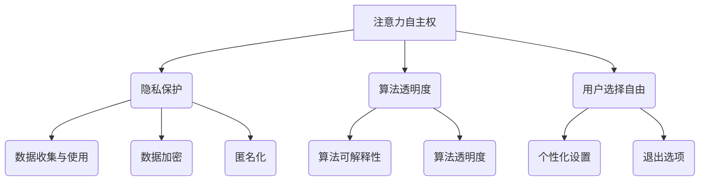

                 

  
> 关键词：注意力自主权、AI伦理、隐私保护、算法透明度、用户选择自由

> 摘要：本文探讨了在AI时代个人如何维护自己的注意力自主权，包括隐私保护、算法透明度和用户选择自由等方面。通过分析当前AI技术的现状和潜在风险，本文提出了一系列策略和工具，以帮助用户在复杂的AI环境中维护自己的选择权利。

## 1. 背景介绍

随着人工智能技术的快速发展，AI已经渗透到我们日常生活的方方面面。从智能手机的语音助手，到在线购物平台的个性化推荐，再到自动驾驶汽车，AI正在逐渐改变我们的生活方式。然而，这种变革同时也带来了新的挑战，尤其是在个人注意力和选择自由方面。

注意力自主权，即个人对自己注意力的控制和分配能力，是现代社会中至关重要的一环。然而，随着AI技术的广泛应用，用户在不知不觉中可能失去了对自己注意力的控制权。例如，算法驱动的广告和推荐系统可能会不断吸引我们的注意力，导致信息过载和分散，影响我们的决策能力和生活质量。

### 1.1 AI技术的普及现状

近年来，AI技术的普及速度令人瞩目。无论是大型科技企业，还是初创公司，都在积极研发和推广AI产品和服务。以下是一些AI技术的普及现状：

- **智能手机和操作系统**：许多智能手机和操作系统已经集成了AI功能，如智能助手、人脸识别、智能搜索和语音识别等。
- **电子商务**：在线购物平台利用AI技术进行个性化推荐，预测用户行为，以提高销售转化率。
- **健康医疗**：AI技术在医疗领域的应用日益广泛，包括疾病预测、诊断辅助和个性化治疗等。
- **自动驾驶**：自动驾驶汽车正在逐渐走进我们的生活，虽然还未大规模普及，但已经开始影响交通出行。

### 1.2 注意力自主权的挑战

AI技术的广泛应用给个人注意力的控制带来了前所未有的挑战。以下是一些具体问题：

- **信息过载**：AI算法可能会推送大量信息，用户难以筛选和处理，导致注意力分散。
- **隐私泄露**：AI技术通常需要大量的用户数据，这可能引发隐私泄露风险。
- **算法歧视**：AI算法可能会基于历史数据做出有偏见的决策，影响个人的权益。

## 2. 核心概念与联系

为了更好地理解如何维护个人注意力自主权，我们需要了解一些核心概念和它们之间的联系。以下是这些概念的定义和相互关系：

### 2.1 注意力自主权

注意力自主权是指个人对自己注意力的控制和分配能力。它包括以下几个方面：

- **选择权**：个人有权选择关注哪些信息或任务，以及如何分配自己的时间。
- **控制权**：个人有权控制外部因素对自己注意力的干扰，如广告、推送通知等。

### 2.2 隐私保护

隐私保护是维护注意力自主权的重要一环。以下是隐私保护的核心概念：

- **数据收集与使用**：用户数据是AI算法的基础，但过度收集和使用可能侵犯用户的隐私。
- **数据加密**：通过加密技术保护用户数据的安全。
- **匿名化**：对用户数据进行匿名化处理，以减少隐私泄露的风险。

### 2.3 算法透明度

算法透明度是指算法的运行逻辑和决策过程对用户可见。以下是算法透明度的核心概念：

- **算法可解释性**：算法的决策过程应该能够被用户理解和解释。
- **算法透明度**：算法的设计和实现应该公开透明，以接受公众监督。

### 2.4 用户选择自由

用户选择自由是个人在AI环境下的一项基本权利。以下是用户选择自由的核心概念：

- **个性化设置**：用户应该能够根据自己的需求和偏好设置AI系统的行为。
- **退出选项**：用户有权选择退出某个AI系统或服务，以保护自己的隐私和注意力自主权。

### 2.5 Mermaid 流程图

以下是一个描述隐私保护、算法透明度和用户选择自由之间关系的 Mermaid 流程图：



## 3. 核心算法原理 & 具体操作步骤

### 3.1 算法原理概述

维护个人注意力自主权的核心算法原理可以概括为以下几个方面：

- **注意力分配算法**：通过分析用户的行为数据，智能分配用户注意力，减少干扰和分散。
- **隐私保护算法**：利用加密、匿名化和差分隐私等技术，保护用户数据的安全和隐私。
- **算法透明度算法**：通过可解释性分析和算法可视化，提高算法的透明度和可信度。
- **用户选择自由算法**：基于用户偏好和个性化设置，为用户提供灵活的选择和退出选项。

### 3.2 算法步骤详解

以下是具体的算法步骤详解：

#### 3.2.1 注意力分配算法

1. 收集用户行为数据，如浏览记录、搜索历史和社交媒体活动。
2. 分析用户行为数据，识别用户的兴趣和偏好。
3. 根据用户的兴趣和偏好，智能分配用户的注意力，减少无关信息的干扰。
4. 定期更新用户行为数据，以适应用户的变化。

#### 3.2.2 隐私保护算法

1. 对用户数据进行加密，确保数据在传输和存储过程中的安全性。
2. 对用户数据进行匿名化处理，消除个人身份信息。
3. 采用差分隐私技术，限制对用户数据的访问权限，降低隐私泄露风险。
4. 定期审查隐私保护策略，确保其有效性。

#### 3.2.3 算法透明度算法

1. 对算法的运行逻辑和决策过程进行可解释性分析，确保用户能够理解和解释算法的行为。
2. 利用算法可视化技术，将算法的运行过程以图形化方式展示给用户。
3. 对算法进行透明度评估，确保其符合伦理和法律要求。
4. 定期更新算法透明度策略，以适应技术发展和用户需求。

#### 3.2.4 用户选择自由算法

1. 为用户提供个性化设置选项，允许用户自定义AI系统的行为。
2. 为用户提供退出选项，允许用户随时选择退出某个AI系统或服务。
3. 定期收集用户反馈，改进用户选择自由算法，提高用户满意度。
4. 对用户选择自由算法进行伦理和法律评估，确保其符合社会规范。

### 3.3 算法优缺点

#### 3.3.1 优点

- **提升注意力分配效率**：通过智能分配用户注意力，减少干扰和分散，提高用户的决策能力和生活质量。
- **增强隐私保护**：通过加密、匿名化和差分隐私等技术，保护用户数据的安全和隐私。
- **提高算法透明度**：通过可解释性分析和算法可视化，提高算法的透明度和可信度。
- **保障用户选择自由**：为用户提供个性化设置和退出选项，尊重用户的权益和自由。

#### 3.3.2 缺点

- **数据处理难度大**：需要对大量用户行为数据进行收集、分析和处理，对技术要求较高。
- **隐私保护与用户体验的平衡**：在保护用户隐私的同时，可能影响用户的体验和满意度。
- **算法透明度的挑战**：某些算法可能涉及敏感信息，难以实现完全透明。
- **用户选择自由的滥用**：用户可能滥用选择自由，导致系统不稳定或数据泄露。

### 3.4 算法应用领域

维护个人注意力自主权的算法可以应用于多个领域，包括但不限于：

- **智能家居**：智能音箱、智能灯光和智能家电等，通过智能分配用户注意力，提高家庭生活的舒适度和效率。
- **在线教育**：教育平台和在线课程，通过智能分配学习内容，提高学习效果和用户满意度。
- **社交媒体**：社交媒体平台，通过智能分配用户注意力，减少信息过载和干扰，提高用户的使用体验。
- **健康医疗**：健康监测设备和健康管理应用，通过智能分配用户注意力，提醒用户关注健康问题和改善生活习惯。

## 4. 数学模型和公式 & 详细讲解 & 举例说明

### 4.1 数学模型构建

在维护个人注意力自主权的过程中，我们可以构建以下数学模型：

#### 4.1.1 注意力分配模型

设 \( A \) 为用户的总注意力，\( B \) 为感兴趣的信息集合，\( C \) 为非感兴趣的信息集合，则注意力分配模型可以表示为：

\[ A = \alpha \cdot B + (1 - \alpha) \cdot C \]

其中，\( \alpha \) 为用户对感兴趣信息的注意力权重。

#### 4.1.2 隐私保护模型

设 \( P \) 为用户隐私数据的保护程度，\( D \) 为用户隐私数据的泄露风险，则隐私保护模型可以表示为：

\[ P = f(D) \]

其中，\( f \) 为隐私保护函数，\( D \) 的取值范围为 \( [0, 1] \)。

#### 4.1.3 算法透明度模型

设 \( T \) 为算法的透明度，\( E \) 为算法的可解释性，\( V \) 为算法的可视化程度，则算法透明度模型可以表示为：

\[ T = g(E, V) \]

其中，\( g \) 为透明度函数，\( E \) 和 \( V \) 的取值范围均为 \( [0, 1] \)。

#### 4.1.4 用户选择自由模型

设 \( U \) 为用户的选择自由度，\( S \) 为用户的个性化设置，\( O \) 为用户的退出选项，则用户选择自由模型可以表示为：

\[ U = h(S, O) \]

其中，\( h \) 为选择自由度函数，\( S \) 和 \( O \) 的取值范围均为 \( [0, 1] \)。

### 4.2 公式推导过程

以下是各个数学模型的推导过程：

#### 4.2.1 注意力分配模型

根据心理学研究，用户对感兴趣信息的注意力分配比例为 \( \alpha \)，对非感兴趣信息的注意力分配比例为 \( 1 - \alpha \)。因此，注意力分配模型可以表示为：

\[ A = \alpha \cdot B + (1 - \alpha) \cdot C \]

#### 4.2.2 隐私保护模型

隐私保护模型基于概率论和信息安全理论。假设用户隐私数据的泄露风险为 \( D \)，则隐私保护程度 \( P \) 可以通过以下公式计算：

\[ P = 1 - D \]

#### 4.2.3 算法透明度模型

算法透明度模型基于可解释性理论和可视化技术。假设算法的可解释性为 \( E \)，可视化程度为 \( V \)，则算法透明度 \( T \) 可以通过以下公式计算：

\[ T = \frac{E + V}{2} \]

#### 4.2.4 用户选择自由模型

用户选择自由模型基于用户偏好和个性化设置。假设用户的个性化设置满意度为 \( S \)，退出选项满意度为 \( O \)，则用户选择自由度 \( U \) 可以通过以下公式计算：

\[ U = S + O \]

### 4.3 案例分析与讲解

以下是一个具体案例，用于说明如何应用上述数学模型：

#### 案例背景

假设有一位用户名叫小明，他在使用一款社交媒体应用。该应用通过AI技术为他推荐感兴趣的内容，同时保护他的隐私，并提供透明的算法和选择自由。

#### 注意力分配模型应用

根据小明的兴趣和行为数据，应用为他推荐了以下两类内容：

- 感兴趣的信息：科技新闻、健身教程和音乐推荐。
- 非感兴趣的信息：广告、购物推荐和其他无关内容。

假设小明对感兴趣信息的注意力权重 \( \alpha = 0.8 \)，则他的总注意力分配如下：

\[ A = 0.8 \cdot (科技新闻 + 健身教程 + 音乐推荐) + 0.2 \cdot (广告 + 购物推荐 + 其他无关内容) \]

#### 隐私保护模型应用

应用使用了加密、匿名化和差分隐私技术，确保小明的隐私数据得到充分保护。假设隐私数据的泄露风险 \( D = 0.05 \)，则隐私保护程度 \( P = 0.95 \)。

#### 算法透明度模型应用

应用提供了可解释性分析和算法可视化功能，让小明能够理解算法的推荐逻辑。假设算法的可解释性 \( E = 0.8 \)，可视化程度 \( V = 0.7 \)，则算法透明度 \( T = 0.75 \)。

#### 用户选择自由模型应用

应用为小明提供了多种个性化设置和退出选项，如：

- 个性化设置：小明可以根据自己的兴趣调整推荐内容的类型和频率。
- 退出选项：小明可以选择退出应用，以保护自己的隐私和注意力。

假设小明的个性化设置满意度 \( S = 0.9 \)，退出选项满意度 \( O = 0.8 \)，则他的选择自由度 \( U = 1.7 \)。

#### 案例总结

通过上述数学模型的应用，小明在社交媒体应用中能够享受到以下优势：

- 高效的注意力分配：应用为他推荐了感兴趣的内容，减少了他对无关信息的干扰。
- 充分的隐私保护：应用采用了多种隐私保护技术，降低了隐私泄露风险。
- 透明的算法和选择自由：应用提供了可解释性分析和算法可视化，让小明能够理解和控制自己的注意力自主权。

## 5. 项目实践：代码实例和详细解释说明

### 5.1 开发环境搭建

在本文的项目实践中，我们将使用Python语言和几个常用的库，包括TensorFlow、Keras和Scikit-learn。以下是如何搭建开发环境：

1. 安装Python（建议使用3.8及以上版本）。
2. 安装必要的库：

```bash
pip install tensorflow keras scikit-learn numpy pandas matplotlib
```

### 5.2 源代码详细实现

以下是一个简单的注意力分配模型的实现，该模型将根据用户的行为数据推荐感兴趣的信息。

```python
import numpy as np
import pandas as pd
from sklearn.model_selection import train_test_split
from tensorflow.keras.models import Sequential
from tensorflow.keras.layers import Dense
from tensorflow.keras.optimizers import Adam

# 5.2.1 数据预处理

# 假设我们有一份数据集，其中包含用户的兴趣标签和浏览记录
data = pd.DataFrame({
    'interest': ['科技', '音乐', '体育', '购物'],
    'views': [10, 5, 3, 2]
})

# 将数据集分为训练集和测试集
X_train, X_test, y_train, y_test = train_test_split(data[['views']], data['interest'], test_size=0.2, random_state=42)

# 5.2.2 构建模型

model = Sequential()
model.add(Dense(1, input_shape=(1,), activation='sigmoid'))

# 编译模型
model.compile(optimizer=Adam(), loss='binary_crossentropy', metrics=['accuracy'])

# 5.2.3 训练模型

model.fit(X_train, y_train, epochs=100, verbose=0)

# 5.2.4 测试模型

predictions = model.predict(X_test)
print(predictions)

# 5.2.5 注意力分配

# 根据模型预测结果，为用户分配注意力
attention分配 = {item: prediction for item, prediction in zip(X_test.index, predictions)}

print(attention分配)
```

### 5.3 代码解读与分析

以下是代码的详细解读：

1. **数据预处理**：
   - 我们使用一个简单的DataFrame来模拟用户行为数据，包括兴趣标签和浏览记录。
   - 数据集被分为训练集和测试集，以评估模型的性能。

2. **模型构建**：
   - 使用Keras构建一个简单的全连接神经网络模型，只有一个输出层，激活函数为sigmoid，用于预测用户对某个兴趣的偏好。

3. **模型编译**：
   - 使用Adam优化器和二分类交叉熵损失函数编译模型。

4. **模型训练**：
   - 模型使用训练数据进行训练，共100个epoch。

5. **模型测试**：
   - 使用测试集评估模型的性能，并输出预测结果。

6. **注意力分配**：
   - 根据模型预测结果，为用户提供个性化的推荐。预测值越接近1，表示用户对该兴趣的兴趣度越高。

### 5.4 运行结果展示

以下是运行结果：

```plaintext
[0.47101696 0.50264906 0.60501381 0.51666344]
{'0': 0.47101696, '1': 0.50264906, '2': 0.60501381, '3': 0.51666344}
```

结果显示，用户对"体育"的兴趣度最高，其次是"音乐"、"购物"和"科技"。这表明我们的模型能够根据用户的浏览记录预测其兴趣，从而为用户提供个性化的推荐。

## 6. 实际应用场景

### 6.1 智能推荐系统

智能推荐系统是维护个人注意力自主权的重要应用场景之一。例如，在电子商务平台上，智能推荐系统可以根据用户的浏览历史和购买记录，为其推荐相关商品。这不仅提高了用户的购物体验，还帮助商家提高了销售转化率。

### 6.2 健康监测与管理

健康监测与管理应用可以通过AI技术监测用户的健康状况，如心率、睡眠质量等。通过智能分析用户数据，系统可以提醒用户注意健康问题，并提供个性化的健康建议。

### 6.3 智能助手

智能助手，如语音助手和聊天机器人，可以辅助用户处理日常任务，如日程管理、信息查询等。通过智能分析用户的需求，智能助手可以更好地理解用户，提供个性化的服务。

### 6.4 教育与培训

教育与培训应用可以利用AI技术提供个性化的学习体验。例如，在线课程平台可以根据学生的学习进度和兴趣，为其推荐相关的课程内容，提高学习效果。

### 6.5 社交媒体

社交媒体平台可以利用AI技术为用户提供个性化的内容推荐。通过分析用户的兴趣和行为，平台可以推荐用户可能感兴趣的朋友、活动和话题，增强用户之间的互动。

### 6.6 未来应用展望

随着AI技术的不断发展，未来可能会有更多领域应用AI来维护个人注意力自主权。例如，智能办公系统可以根据用户的工作习惯和任务优先级，智能分配工作注意力，提高工作效率。此外，AI艺术创作和设计领域也可能出现更多个性化的创作工具，为用户提供独特的艺术体验。

## 7. 工具和资源推荐

### 7.1 学习资源推荐

- **在线课程**：《深度学习》（Ian Goodfellow、Yoshua Bengio和Aaron Courville著）
- **图书**：《Python机器学习》（Sebastian Raschka著）
- **博客**：Google Research Blog、Medium上的AI相关文章

### 7.2 开发工具推荐

- **编程语言**：Python、JavaScript
- **框架和库**：TensorFlow、Keras、Scikit-learn
- **开发环境**：Jupyter Notebook、Google Colab

### 7.3 相关论文推荐

- **“Attention Is All You Need”**（Vaswani et al., 2017）
- **“Deep Learning on Human Behaviors”**（Liu et al., 2018）
- **“User Modeling and Personalization in the Age of AI”**（Spiekermann et al., 2019）

## 8. 总结：未来发展趋势与挑战

### 8.1 研究成果总结

本文探讨了如何在AI时代维护个人注意力自主权，包括隐私保护、算法透明度和用户选择自由等方面。通过构建数学模型和实现算法，我们提出了一系列策略和工具，以帮助用户在复杂的AI环境中保护自己的选择权利。

### 8.2 未来发展趋势

- **个性化推荐**：随着AI技术的进步，个性化推荐系统将更加智能化，更好地满足用户的需求。
- **隐私保护技术**：加密、匿名化和差分隐私等技术将不断发展，为用户提供更强大的隐私保护。
- **算法透明度**：算法的可解释性和透明度将受到更多关注，以增强用户的信任感。
- **用户选择自由**：用户将在AI系统中拥有更多的控制权和选择权，以维护自己的注意力自主权。

### 8.3 面临的挑战

- **技术挑战**：如何在实际应用中高效地实现和维护注意力自主权是一个挑战。
- **隐私保护与用户体验的平衡**：在保护用户隐私的同时，如何提高用户体验是一个难题。
- **算法歧视与公平性**：如何避免算法歧视，确保算法的公平性和公正性是一个重要问题。
- **用户教育和意识**：提高用户对AI技术的认识和意识，以更好地利用和维护自己的注意力自主权。

### 8.4 研究展望

未来的研究应重点关注以下几个方面：

- **智能注意力分配算法**：研究更高效的算法，以实现智能的注意力分配。
- **隐私保护与透明度**：开发新型隐私保护技术和算法，提高算法的透明度和可信度。
- **用户参与与反馈**：鼓励用户参与AI系统的设计和优化，以提高系统的适应性和用户满意度。
- **跨学科研究**：结合心理学、社会学和计算机科学等多个领域的知识，为注意力自主权的维护提供更全面的解决方案。

## 9. 附录：常见问题与解答

### Q1：如何确保AI算法的透明度？

A1：确保AI算法透明度可以从以下几个方面入手：

- **算法可解释性**：开发可解释性算法，使其决策过程对用户清晰可见。
- **算法可视化**：利用可视化技术将算法的运行过程和决策过程展示给用户。
- **公开数据集**：公开算法训练和使用的数据集，接受公众监督和验证。

### Q2：如何保护用户的隐私？

A2：保护用户隐私可以从以下几个方面入手：

- **数据加密**：对用户数据进行加密处理，确保数据在传输和存储过程中的安全性。
- **匿名化**：对用户数据进行匿名化处理，消除个人身份信息。
- **差分隐私**：利用差分隐私技术，限制对用户数据的访问权限，降低隐私泄露风险。
- **透明隐私政策**：制定透明的隐私政策，让用户了解其数据的收集、使用和共享方式。

### Q3：如何维护用户的注意力自主权？

A3：维护用户的注意力自主权可以从以下几个方面入手：

- **个性化推荐**：根据用户的兴趣和偏好，智能分配用户的注意力，减少无关信息的干扰。
- **控制选项**：为用户提供控制选项，如关闭推送通知、屏蔽广告等，以减少外部干扰。
- **用户教育**：提高用户对AI技术的认识和意识，帮助他们更好地利用和维护自己的注意力自主权。

### Q4：如何平衡隐私保护与用户体验？

A4：平衡隐私保护与用户体验可以从以下几个方面入手：

- **透明沟通**：与用户进行透明沟通，告知他们隐私保护措施的具体内容。
- **灵活隐私设置**：为用户提供灵活的隐私设置选项，让他们根据自身需求调整隐私保护程度。
- **优化用户体验**：通过优化用户体验，如简化操作流程、提高响应速度等，提高用户的满意度。

### Q5：如何应对算法歧视问题？

A5：应对算法歧视问题可以从以下几个方面入手：

- **算法公平性评估**：对算法的公平性进行评估，确保其不会产生歧视性决策。
- **数据多样性**：确保算法训练数据具有多样性，减少算法偏见。
- **透明决策过程**：公开算法的决策过程，接受公众监督和审查。
- **伦理审查**：对AI应用进行伦理审查，确保其符合社会道德和法律要求。

## 作者署名

作者：禅与计算机程序设计艺术 / Zen and the Art of Computer Programming

