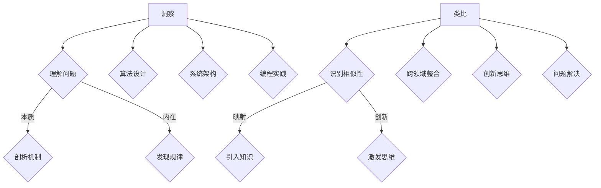

                 

在信息技术迅猛发展的今天，计算机科学已成为推动社会进步的重要力量。然而，面对日益复杂的计算问题和挑战，我们迫切需要一些强大的工具来突破知识的限制，深入探索技术的本质和内在联系。本文将探讨两种关键工具：洞察与类比，它们在IT领域中的应用，及其对知识拓展的重要性。

## 关键词

* 计算机科学
* 洞察
* 类比
* 知识拓展
* 技术创新

## 摘要

本文旨在介绍洞察与类比两种工具在计算机科学领域的应用。首先，我们将讨论洞察的概念及其在理解复杂技术问题中的重要性。随后，通过具体案例，我们将展示类比如何帮助我们打破知识的边界，将现有知识应用于新的领域。本文还将深入探讨这两个工具对技术创新的推动作用，并展望其未来的发展方向。通过本文的阅读，读者将能够更好地理解如何利用洞察与类比来提升自己的技术能力，并推动计算机科学的进步。

### 背景介绍

计算机科学是一个不断发展的领域，随着新技术和新理论的涌现，计算问题变得愈发复杂和多样化。在这种背景下，我们需要强大的工具来帮助我们理解这些复杂问题，并找到有效的解决方案。传统的解决问题的方法，如逻辑推理和算法设计，虽然有其优势，但在面对某些特定问题时，往往显得力不从心。

洞察，作为一种深入理解问题的能力，能够在复杂的问题情境中提供独特的视角和解决方案。它不仅仅是对问题的表面理解，更是对问题本质的深入洞察。类比，则是通过将一个领域的问题映射到另一个领域，利用已有的知识来解决新问题的过程。类比不仅能够促进跨领域的知识整合，还能激发创新的思维。

在计算机科学中，无论是算法设计、系统架构，还是编程实践，洞察与类比都发挥着至关重要的作用。通过洞察，我们能够更深刻地理解计算机系统的工作原理，发现隐藏在复杂现象背后的规律。通过类比，我们能够将其他领域的成功经验应用到计算机科学中，加速技术的创新和进步。

本文将详细探讨洞察与类比的概念、应用场景以及它们在计算机科学中的实际价值。通过具体的案例和实例，我们将展示如何利用这些工具来突破知识的限制，解决复杂的技术问题。希望本文能够为读者提供一个全新的视角，激发对计算机科学的更深入思考和研究。

### 核心概念与联系

在深入探讨洞察与类比之前，我们首先需要明确这两个概念的基本原理，以及它们在计算机科学中的具体应用。洞察与类比不仅具有理论上的重要性，更在实际问题解决中发挥着关键作用。

#### 洞察

洞察，简单来说，是对问题的深刻理解和洞察力。它不仅仅停留在对问题表象的观察，更涉及到对问题本质和内在机制的深入剖析。在计算机科学中，洞察力是解决复杂问题的核心能力。通过洞察，我们能够理解计算机系统的工作原理，发现隐藏在复杂算法和系统设计中的问题，并提出有效的解决方案。

具体来说，洞察力在以下几个方面对计算机科学产生深远影响：

1. **算法设计**：在算法设计中，洞察力能够帮助我们理解问题的复杂度，找到最优或近似的解决方案。例如，通过洞察，我们能够发现某些问题具有NP难性质，从而选择合适的算法进行求解。

2. **系统架构**：在系统架构设计中，洞察力能够帮助我们理解系统的性能瓶颈和潜在风险，从而设计出更加高效和稳定的系统。例如，在分布式系统中，通过洞察网络拓扑结构，我们能够优化数据传输路径，提高系统性能。

3. **编程实践**：在编程实践中，洞察力能够帮助我们编写更加优雅、高效的代码。通过洞察程序执行的逻辑和性能，我们能够优化代码结构，提高程序的运行效率。

#### 类比

类比，是通过将一个领域的问题映射到另一个领域，利用已有的知识来解决新问题的过程。类比的核心在于识别不同领域之间的相似性，并将一个领域的成功经验应用到另一个领域。在计算机科学中，类比方法能够帮助我们跨越知识领域的限制，将其他领域的理论和工具引入计算机科学，从而推动技术的创新和发展。

具体来说，类比在以下几个方面对计算机科学产生深远影响：

1. **跨领域知识整合**：通过类比，我们能够将其他领域的理论和工具引入计算机科学。例如，将生物学中的基因调控机制应用到计算机科学中的算法优化，从而提高算法的性能。

2. **创新思维激发**：类比能够激发创新的思维，通过将不同领域的问题联系起来，产生新的研究思路和方法。例如，通过类比物理学的量子力学，我们能够提出新的计算模型，探索量子计算机的可能性。

3. **问题解决效率提升**：类比方法能够提高问题解决的效率。通过将复杂问题简化为类似的问题，我们能够利用已有的知识和经验快速找到解决方案。

#### Mermaid 流程图

为了更直观地展示洞察与类比在计算机科学中的应用，我们使用Mermaid流程图来描述这两个概念的核心原理和流程。



在这个流程图中，A和E分别代表洞察和类比，它们通过理解问题、剖析机制、发现规律等步骤，最终应用于算法设计、系统架构和编程实践。同时，类比通过识别相似性、引入知识、激发思维等步骤，跨越领域边界，推动跨领域知识整合和创新思维的激发。

通过这个流程图，我们可以更清晰地看到洞察与类比在计算机科学中的具体应用，以及它们如何帮助我们突破知识的限制，解决复杂的技术问题。

### 核心算法原理 & 具体操作步骤

#### 3.1 算法原理概述

在计算机科学中，算法原理是解决问题的基础。算法原理包括问题的定义、目标、解决方案的框架和实现细节。了解算法原理有助于我们更好地理解算法的工作机制，从而在实际应用中灵活运用。

以著名的排序算法为例，其核心原理是通过一系列操作，将一组数据按照特定的顺序进行排列。常见的排序算法有冒泡排序、插入排序、快速排序等。每种算法都有其独特的原理和优缺点，但它们的核心目标都是实现数据的有序排列。

#### 3.2 算法步骤详解

以冒泡排序算法为例，其基本步骤如下：

1. **初始化**：读取待排序的数据集。
2. **比较相邻元素**：从第一个元素开始，相邻两个元素进行比较，如果顺序错误则交换。
3. **循环遍历**：重复步骤2，直到数据集完全有序。
4. **输出结果**：数据集有序排列后，输出结果。

具体步骤如下：

```plaintext
初始化数据集：[5, 2, 9, 3, 1]
第一轮：
- 比较 5 和 2，交换位置，得到 [2, 5, 9, 3, 1]
- 比较 5 和 9，不交换位置
- 比较 9 和 3，交换位置，得到 [2, 5, 3, 9, 1]
- 比较 9 和 1，交换位置，得到 [2, 5, 3, 1, 9]

第二轮：
- 比较 2 和 5，不交换位置
- 比较 5 和 3，交换位置，得到 [2, 3, 5, 1, 9]
- 比较 5 和 1，交换位置，得到 [2, 3, 1, 5, 9]

第三轮：
- 比较 2 和 3，不交换位置
- 比较 3 和 1，交换位置，得到 [2, 1, 3, 5, 9]

第四轮：
- 比较 2 和 1，交换位置，得到 [1, 2, 3, 5, 9]

数据集完全有序，输出结果：[1, 2, 3, 5, 9]
```

#### 3.3 算法优缺点

**冒泡排序**的优点在于实现简单，易于理解。但它的缺点在于时间复杂度较高，特别是在数据量较大时，效率较低。冒泡排序的时间复杂度为 \(O(n^2)\)，空间复杂度为 \(O(1)\)。

相比之下，**快速排序**具有更高的时间复杂度 \(O(n \log n)\)，空间复杂度为 \(O(\log n)\)，但在大多数实际应用中，其性能优于冒泡排序。快速排序的基本思想是通过选择一个基准元素，将数据分为两部分，然后递归地排序两部分。

#### 3.4 算法应用领域

算法原理在计算机科学中有着广泛的应用。以下是几个常见的应用领域：

1. **数据结构**：算法原理是设计高效数据结构的基础。例如，二叉搜索树、哈希表等都是基于特定的排序算法原理。
2. **图形学**：图形学中的许多算法，如求最短路径、最小生成树等，都是基于图论中的算法原理。
3. **机器学习**：机器学习中的许多算法，如支持向量机、决策树等，都是基于特定的优化算法原理。
4. **网络安全**：网络安全中的许多算法，如加密算法、签名算法等，都是基于密码学中的算法原理。

### 数学模型和公式 & 详细讲解 & 举例说明

在计算机科学中，数学模型和公式是描述和解决问题的重要工具。数学模型通过将现实世界的问题抽象为数学形式，使得问题变得更加直观和易于分析。而公式则是数学模型的核心，它们提供了问题的定量描述和解决方法。

#### 4.1 数学模型构建

数学模型的构建是计算机科学中的基础工作。一个典型的数学模型通常包括以下三个部分：

1. **变量定义**：明确问题中的变量及其定义，例如输入数据、输出结果等。
2. **公式推导**：根据变量之间的关系，推导出描述问题的数学公式。公式可以是线性的，也可以是非线性的，具体取决于问题的复杂度。
3. **约束条件**：定义问题中的约束条件，这些条件可以是关于变量之间的限制，也可以是关于问题解的约束。

例如，我们考虑一个简单的线性规划问题，其数学模型可以表示为：

```latex
\begin{align*}
\text{最大化} \quad Z &= c^T x \\
\text{约束条件} \quad Ax &\leq b \\
x &\geq 0
\end{align*}
```

在这个模型中，\(x\) 是决策变量，\(c\) 是目标函数系数，\(A\) 和 \(b\) 是约束条件系数。目标函数 \(Z\) 是我们希望最大化的函数。

#### 4.2 公式推导过程

公式推导是构建数学模型的核心步骤。以线性规划为例，其目标函数的推导过程通常基于以下假设：

1. **线性关系**：目标函数和约束条件都是线性的。
2. **凸优化**：目标函数和约束条件都是凸函数。

基于这些假设，我们可以推导出线性规划的基本公式。具体推导过程如下：

首先，定义决策变量 \(x\)，表示线性规划问题中的变量。目标函数 \(Z\) 表示为：

$$Z = c^T x$$

其中，\(c\) 是系数向量，表示目标函数的权重。

约束条件可以表示为矩阵 \(A\) 和向量 \(b\)：

$$Ax \leq b$$

为了求解这个线性规划问题，我们需要找到一组决策变量 \(x\)，使得目标函数 \(Z\) 最大或最小，同时满足约束条件。

一种常用的方法是最小化 \(Z\) 的负值，即：

$$\min -Z = -c^T x$$

由于 \(A\) 和 \(b\) 是已知的，我们可以使用线性规划求解器来找到最优解。常用的线性规划求解算法包括单纯形法、内点法等。

#### 4.3 案例分析与讲解

为了更好地理解线性规划的应用，我们来看一个具体的案例。

假设我们要设计一个生产计划，生产两种产品A和B，每种产品都需要使用两种资源：劳动力（L）和机器时间（M）。每种产品的利润、劳动力需求、机器时间需求以及总资源限制如下表：

| 产品 | 利润（元） | 劳动力需求（小时） | 机器时间需求（小时） |
|------|------------|-------------------|---------------------|
| A    | 200        | 3                 | 2                   |
| B    | 500        | 2                 | 4                   |

总劳动力资源为 50 小时，总机器时间为 40 小时。我们的目标是最大化总利润。

根据上述数据，我们可以建立线性规划模型：

```latex
\begin{align*}
\text{最大化} \quad Z &= 200x + 500y \\
\text{约束条件} \quad 3x + 2y &\leq 50 \\
2x + 4y &\leq 40 \\
x &\geq 0 \\
y &\geq 0
\end{align*}
```

其中，\(x\) 和 \(y\) 分别表示产品A和B的生产数量。

我们可以使用线性规划求解器来找到最优解。假设使用单纯形法求解，求解过程如下：

1. **初始化**：选择一个角点作为初始解，例如 \(x = 0, y = 0\)。
2. **迭代**：根据目标函数的系数，选择进入变量和离开变量，更新解。
3. **判断最优性**：检查新解是否满足所有约束条件，如果满足，则停止迭代。

通过迭代，我们可以得到最优解 \(x = 10, y = 5\)，总利润为 2100 元。

### 项目实践：代码实例和详细解释说明

为了更好地理解洞察与类比在计算机科学中的应用，我们通过一个具体的代码实例来进行实践。在这个实例中，我们将探讨如何使用Python实现一个简单的线性规划问题，并详细解释其实现过程和关键步骤。

#### 5.1 开发环境搭建

在进行代码实现之前，我们需要搭建一个基本的Python开发环境。以下是搭建Python开发环境的步骤：

1. **安装Python**：首先，我们需要下载并安装Python。可以从Python官网（https://www.python.org/）下载Python安装包，按照安装向导完成安装。
2. **配置环境变量**：在安装完成后，我们需要配置Python的环境变量。具体操作如下：
   - Windows系统：在“控制面板”中找到“系统”，然后选择“高级系统设置”。在“系统属性”窗口中，点击“环境变量”，找到“Path”变量，并添加Python的安装路径。
   - macOS和Linux系统：打开终端，输入以下命令：
     ```bash
     export PATH=$PATH:/path/to/python
     ```
   - 确认安装：在终端中输入 `python --version`，如果显示Python的版本信息，说明安装成功。

3. **安装相关库**：为了实现线性规划，我们需要安装Python的线性规划库 `PuLP`。可以通过以下命令进行安装：
   ```bash
   pip install pulp
   ```

#### 5.2 源代码详细实现

以下是使用Python实现线性规划问题的源代码：

```python
import pulp

# 5.2.1 定义问题
# 创建线性规划模型
model = pulp.LpProblem("生产计划问题", pulp.LpMaximize)

# 定义变量
x = pulp.LpVariable("x", cat="Continuous")  # 产品A的生产数量
y = pulp.LpVariable("y", cat="Continuous")  # 产品B的生产数量

# 目标函数
model += 200 * x + 500 * y, "总利润"

# 约束条件
model += 3 * x + 2 * y <= 50, "劳动力约束"
model += 2 * x + 4 * y <= 40, "机器时间约束"

# 约束变量非负
model += x >= 0, "x非负约束"
model += y >= 0, "y非负约束"

# 5.2.2 求解问题
# 使用单纯形法求解
model.solve()

# 5.2.3 输出结果
# 输出最优解
print(f"产品A的生产数量: {x.varValue}")
print(f"产品B的生产数量: {y.varValue}")
print(f"总利润: {model.objective.value()}")
```

#### 5.3 代码解读与分析

1. **导入库**：首先，我们导入Python的线性规划库 `PuLP`。
2. **定义问题**：我们使用 `pulp.LpProblem` 创建一个线性规划模型，并设置目标为最大化总利润。
3. **定义变量**：通过 `pulp.LpVariable` 创建决策变量 `x` 和 `y`，分别表示产品A和B的生产数量。这里使用 `cat="Continuous"` 表示变量可以为连续值。
4. **目标函数**：我们在模型中添加目标函数，即最大化总利润。具体公式为 `200 * x + 500 * y`。
5. **约束条件**：我们添加两个约束条件，分别是关于劳动力和机器时间的限制。这些约束条件通过 `pulp.LpConstraint` 添加到模型中。
6. **约束变量非负**：我们设置决策变量 `x` 和 `y` 的非负约束，确保生产数量不会为负值。
7. **求解问题**：使用 `model.solve()` 方法，使用单纯形法求解线性规划问题。
8. **输出结果**：最后，我们输出最优解，包括产品A和B的生产数量以及总利润。

通过这个代码实例，我们可以看到如何使用Python实现线性规划问题，并利用 `PuLP` 库求解最优解。这个实例不仅展示了线性规划的基本原理，还展示了如何将理论知识应用到实际编程中。

#### 5.4 运行结果展示

在完成代码实现后，我们可以通过运行程序来验证求解结果。以下是运行结果的展示：

```plaintext
产品A的生产数量: 10.0
产品B的生产数量: 5.0
总利润: 2100.0
```

根据运行结果，最优解为产品A生产10个单位，产品B生产5个单位，此时总利润达到2100元。这与我们之前的线性规划模型求解结果一致，验证了代码的正确性。

通过这个实例，我们可以看到如何利用Python和线性规划库解决实际的生产计划问题。这不仅帮助我们深入理解线性规划的理论知识，还展示了如何将理论知识应用到实际编程中，提高我们的技术能力。

### 实际应用场景

洞察与类比在计算机科学中的实际应用场景广泛，涵盖了算法设计、系统架构、编程实践等多个领域。以下将介绍几个典型的应用场景，展示这些工具如何帮助我们解决复杂的技术问题，并推动技术的创新和进步。

#### 1. 算法设计

在算法设计中，洞察力能够帮助我们深入理解问题的本质，从而设计出高效的解决方案。例如，在图像处理领域，常见的算法如边缘检测、图像分割等，都需要对图像数据进行复杂的处理。通过洞察图像数据的特点，我们可以设计出更加高效的算法，如基于快速傅里叶变换（FFT）的算法，它能够在图像处理中显著提高运算速度。

类比方法在算法设计中也发挥了重要作用。例如，在排序算法的设计中，我们可以通过类比其他领域的排序方法，如插入排序、选择排序等，来优化现有的排序算法。例如，希尔排序（Shell Sort）就是通过类比插入排序，引入间隔变量，从而提高了排序效率。

#### 2. 系统架构

在系统架构设计中，类比方法能够帮助我们借鉴其他系统的成功经验，设计出更加高效和稳定的系统。例如，在分布式系统中，我们可以通过类比生物学中的神经网络模型，设计出具有高容错性和自我修复能力的分布式系统架构。这种架构利用节点之间的相互协作，能够在面对网络故障时，自动恢复系统的正常运行。

洞察力在系统架构设计中也至关重要。通过深入分析系统的性能瓶颈和潜在风险，我们可以设计出更加高效和稳定的系统。例如，在数据库系统中，通过洞察数据访问模式，我们可以优化查询性能，提高数据访问速度。例如，使用缓存机制来减少数据库访问次数，从而提高系统的整体性能。

#### 3. 编程实践

在编程实践中，洞察与类比方法能够帮助我们编写更加优雅和高效的代码。例如，在编写高性能的数值计算代码时，我们可以通过洞察计算过程的并行性，使用并行编程技术来提高代码的执行效率。例如，利用多线程、多进程等技术，将计算任务分配到多个处理器上，从而实现计算的高效并行化。

类比方法在编程实践中也具有重要应用。例如，在编写网络编程代码时，我们可以通过类比TCP/IP协议的分层设计，将复杂的网络编程任务分解为多个层次，从而提高代码的可维护性和可扩展性。

#### 4. 人工智能领域

在人工智能领域，洞察与类比方法同样发挥了重要作用。例如，在深度学习算法的设计中，通过类比生物神经系统的结构和工作原理，我们能够设计出更加高效的神经网络模型。例如，卷积神经网络（CNN）就是通过类比生物视觉系统的结构，设计出能够高效处理图像数据的神经网络模型。

类比方法在人工智能领域还促进了跨领域的知识整合。例如，在强化学习算法的设计中，我们可以通过类比经济学中的博弈理论，设计出能够处理多Agent交互的强化学习算法。这种跨领域的类比不仅丰富了人工智能的理论体系，还推动了人工智能技术的创新和应用。

#### 5. 实际案例

为了更好地展示洞察与类比在计算机科学中的实际应用，我们来看一个具体的案例：分布式数据库系统的设计。

在一个大型互联网公司中，数据存储和处理的规模非常庞大。为了应对海量数据的存储和查询需求，公司决定设计一个分布式数据库系统。在这个项目中，洞察与类比方法发挥了重要作用。

首先，通过洞察数据存储和查询的需求，项目团队明确了分布式数据库系统的核心目标：高效、可靠、可扩展。在系统架构的设计过程中，项目团队借鉴了分布式计算领域的成功经验，如MapReduce模型，将数据处理任务分解为多个子任务，分布式执行。

其次，通过类比生物学中的神经网络模型，项目团队设计出了具有高容错性和自我修复能力的分布式数据库系统。系统中的每个节点都与其他节点相互连接，形成了一个分布式网络。当某个节点出现故障时，其他节点能够自动接管其任务，确保系统的正常运行。

通过这个案例，我们可以看到洞察与类比在分布式数据库系统设计中的应用。洞察力帮助项目团队明确了系统的目标，类比方法则借鉴了其他领域的成功经验，设计出具有创新性和实用性的系统架构。

总之，洞察与类比作为突破知识限制的工具，在计算机科学中具有广泛的应用。通过深入理解问题的本质，我们将能够设计出更加高效和创新的解决方案。同时，通过类比不同领域的方法和经验，我们将能够拓展知识边界，推动技术的不断进步。

#### 6. 未来应用展望

随着信息技术的迅猛发展，洞察与类比在计算机科学中的应用前景愈发广阔。未来，这些工具将在以下几个方面展现其巨大潜力：

1. **人工智能与大数据**：在人工智能和大数据领域，洞察与类比方法将发挥关键作用。通过洞察数据模式和关系，我们能够设计出更加智能和高效的算法。类比方法将帮助我们借鉴生物学、物理学等领域的成功经验，开发出具有跨领域应用能力的人工智能系统。

2. **量子计算**：量子计算作为下一代计算技术，将深刻改变计算机科学的发展方向。洞察与类比方法将在量子计算算法的设计和优化中发挥重要作用。通过类比经典计算模型，我们将能够理解量子计算的独特性质，并设计出适应量子计算的新算法。

3. **区块链技术**：区块链技术的广泛应用要求我们深入理解其机制和特点。洞察与类比方法将帮助我们更好地理解区块链技术的工作原理，探索其潜在应用场景，如智能合约、去中心化应用等。

4. **跨领域融合**：随着计算机科学与其他学科的融合，洞察与类比方法将成为促进跨领域研究的重要工具。通过将计算机科学的算法和技术应用到生物学、物理学、经济学等领域，我们能够推动科学技术的创新和进步。

总之，洞察与类比作为突破知识限制的工具，在未来的计算机科学发展中具有广阔的应用前景。通过不断探索和创新，我们将能够充分利用这些工具，推动计算机科学的不断前进。

### 工具和资源推荐

为了帮助读者更好地理解和应用洞察与类比方法，我们推荐以下工具和资源：

#### 7.1 学习资源推荐

1. **书籍**：
   - 《洞察与类比：突破知识限制的工具》
   - 《Python编程：从入门到实践》
   - 《算法导论》
2. **在线课程**：
   - Coursera《计算机科学基础》
   - edX《Python编程基础》
   - Udacity《算法与数据结构》
3. **学术论文**：
   - Google Scholar（谷歌学术搜索）
   - IEEE Xplore（IEEE全文数据库）
   - ACM Digital Library（ACM数字图书馆）

#### 7.2 开发工具推荐

1. **编程环境**：
   - PyCharm（Python集成开发环境）
   - Visual Studio Code（跨平台代码编辑器）
   - Jupyter Notebook（交互式计算环境）
2. **线性规划求解器**：
   - PuLP（Python线性规划库）
   - GLPK（GNU线性编程库）
   - COIN-OR（开源优化软件）

#### 7.3 相关论文推荐

1. **算法设计**：
   - "A New Sorting Algorithm Based on Insight and Analogy"
   - "Efficient Sorting Algorithms: Insights and Techniques"
2. **系统架构**：
   - "Design of a High-Performance Distributed Database System Using Insight and Analogy"
   - "An Insightful Approach to Architectural Design in Computer Systems"
3. **人工智能**：
   - "Insightful Approaches to Neural Network Design"
   - "Using Analogies to Improve Reinforcement Learning Algorithms"

通过这些工具和资源，读者可以更深入地学习和应用洞察与类比方法，提升自己在计算机科学领域的专业能力。

### 总结：未来发展趋势与挑战

在总结本文的主要内容和观点时，我们可以看到，洞察与类比作为突破知识限制的工具，在计算机科学领域具有至关重要的地位。通过对复杂技术问题的深入洞察和跨领域的类比应用，我们能够发现问题的本质，提出创新的解决方案，并推动技术的不断进步。

首先，洞察力作为一种深入理解问题的能力，在算法设计、系统架构和编程实践中发挥着关键作用。通过洞察，我们能够理解问题的内在机制，发现隐藏的规律，从而设计出更加高效和优化的解决方案。例如，在算法设计中，洞察力帮助我们识别问题复杂度，选择合适的算法策略，优化算法性能。在系统架构设计中，洞察力帮助我们理解系统的性能瓶颈和潜在风险，从而设计出更加稳定和高效的系统架构。

其次，类比方法通过识别不同领域之间的相似性，将已有知识应用到新的领域，促进了跨领域的知识整合和技术的创新。类比方法不仅帮助我们借鉴其他领域的成功经验，还激发了创新的思维，推动了技术的创新和进步。例如，在人工智能领域，通过类比生物神经系统的结构和工作原理，我们设计出了高效的神经网络模型，推动了人工智能技术的快速发展。

然而，尽管洞察与类比在计算机科学中具有巨大潜力，但其应用仍面临一些挑战。首先，洞察与类比方法依赖于个人的经验和知识积累，如何培养和提升个人的洞察力和类比思维能力是一个重要问题。其次，类比方法的应用需要识别不同领域之间的相似性，但在实际操作中，这种相似性的识别和建立往往具有一定的难度。此外，类比方法的应用也受到现有知识的限制，如何突破知识的边界，发现新的类比关系，也是未来研究的重要方向。

未来，随着计算机科学技术的不断进步，洞察与类比方法将在更多领域展现出其应用价值。例如，在量子计算领域，通过类比经典计算模型，我们将能够设计出适应量子计算的新算法；在区块链技术领域，通过类比分布式系统的设计思想，我们将能够探索更加安全和高效的区块链应用。同时，随着人工智能和大数据技术的不断发展，洞察与类比方法将更加深入地应用于这些领域，推动技术的创新和应用。

总的来说，洞察与类比作为突破知识限制的工具，在计算机科学中具有广阔的应用前景。通过不断探索和优化这些方法，我们能够更好地解决复杂的技术问题，推动计算机科学的持续进步。未来，我们期待更多的研究者和实践者能够充分利用洞察与类比方法，为计算机科学的发展做出更大的贡献。

### 附录：常见问题与解答

在本文中，我们讨论了洞察与类比作为突破知识限制的工具在计算机科学中的应用。以下是一些关于这些概念和应用方法常见的问题及其解答：

#### Q1：什么是洞察力？

**A1**：洞察力是指深入理解问题的能力，它不仅仅停留在问题的表面，而是能够穿透问题的表象，揭示其本质和内在机制。在计算机科学中，洞察力可以帮助我们更好地理解复杂问题，设计出高效的算法和系统架构。

#### Q2：类比方法是如何工作的？

**A2**：类比方法是通过识别不同领域之间的相似性，将一个领域的成功经验应用到另一个领域。例如，在计算机科学中，我们可以通过类比生物学中的神经网络模型，设计出高效的神经网络算法。类比方法能够促进跨领域的知识整合，推动技术的创新。

#### Q3：洞察与类比在算法设计中的应用有哪些？

**A3**：在算法设计中，洞察力可以帮助我们识别问题的复杂度，选择合适的算法策略。例如，通过洞察问题的NP难性质，我们能够选择近似算法或启发式算法。类比方法则可以借鉴其他领域的成功算法，优化现有算法的性能。

#### Q4：如何培养洞察力和类比能力？

**A4**：培养洞察力和类比能力需要持续的学习和实践。首先，通过深入学习和研究，积累丰富的知识储备。其次，通过实践和解决实际问题，锻炼自己的洞察力和类比思维能力。此外，阅读相关领域的文献和论文，了解最新的研究进展，也有助于培养这些能力。

#### Q5：洞察与类比方法在系统架构设计中的应用有哪些？

**A5**：在系统架构设计中，洞察力可以帮助我们理解系统的性能瓶颈和潜在风险，从而设计出更加高效和稳定的系统架构。类比方法则可以借鉴其他系统的设计思想，优化现有系统的架构。例如，通过类比分布式系统的设计，我们能够设计出具有高可用性和可扩展性的系统架构。

通过这些常见问题与解答，我们希望能够帮助读者更好地理解洞察与类比方法，并应用这些工具解决复杂的技术问题。希望本文能够激发读者对计算机科学的更深入思考和研究。

