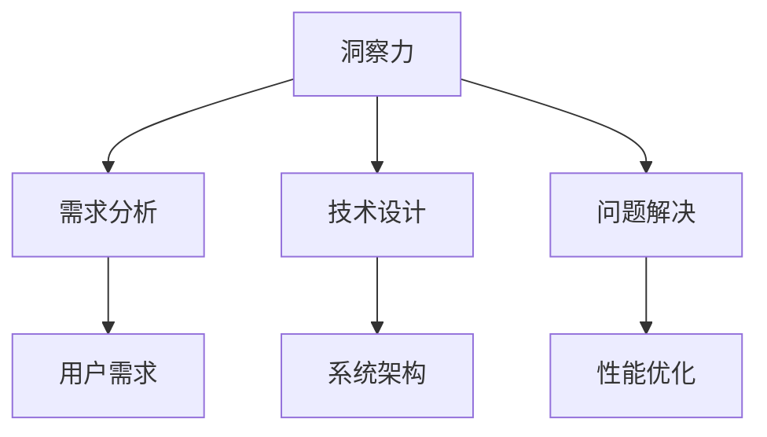
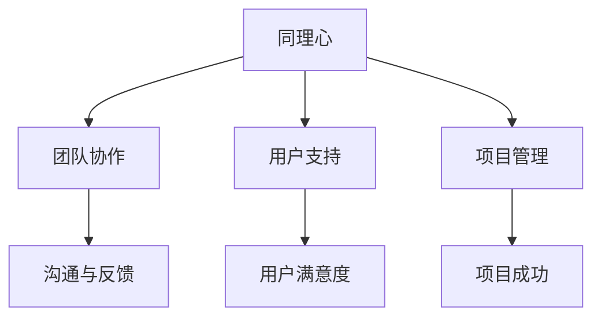
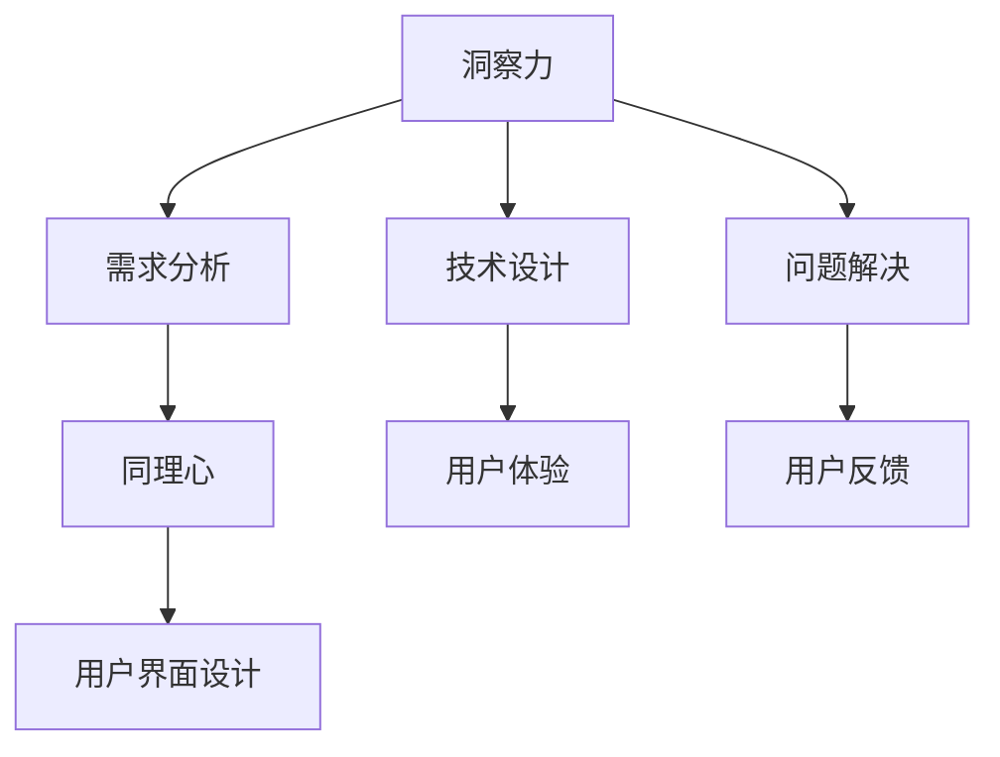
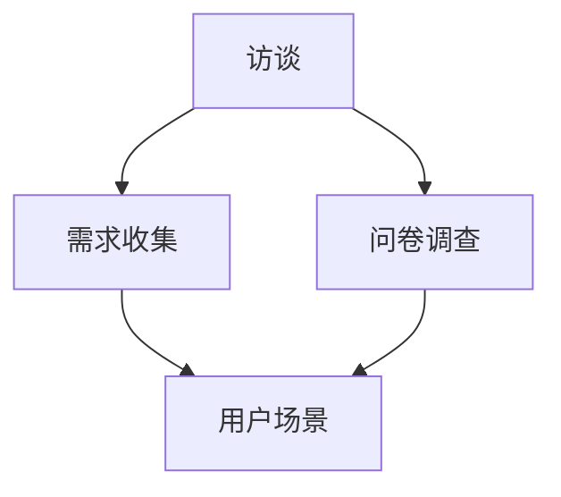
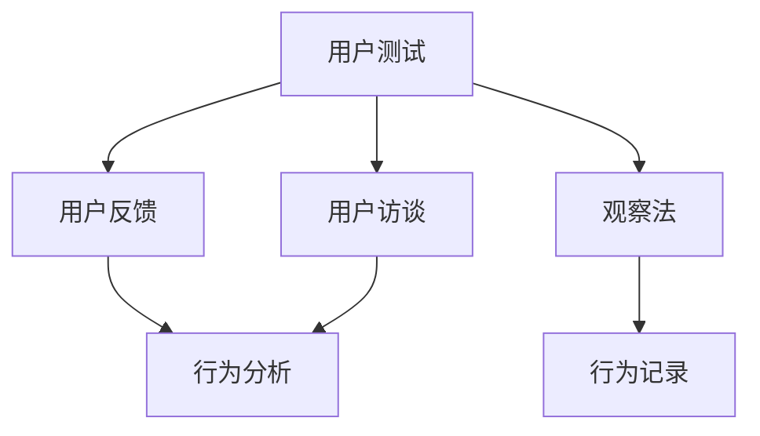
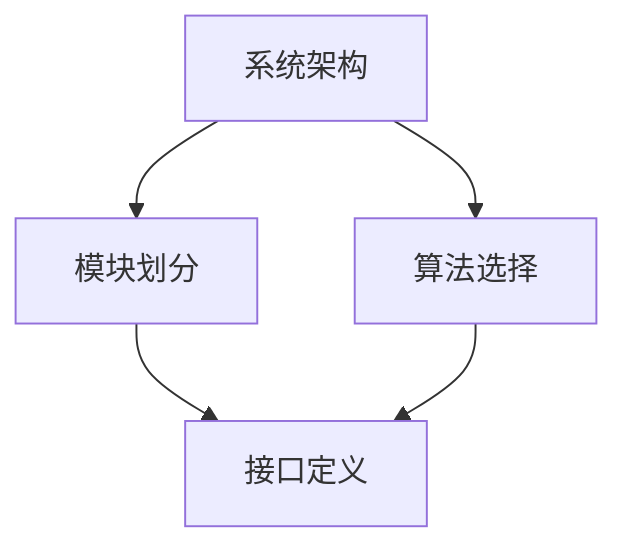
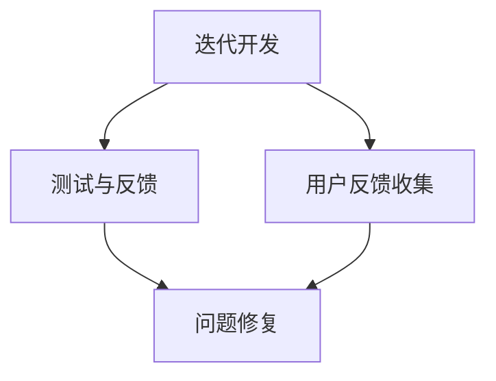

                 

### 关键词 Keyword

- **洞察力**
- **同理心**
- **理解**
- **人工智能**
- **人机交互**
- **技术沟通**
- **软件开发**

<|assistant|>### 摘要 Abstract

在当今快速发展的技术时代，人工智能正逐渐渗透到我们生活的方方面面。本文旨在探讨在IT行业中如何运用洞察力和同理心，以更有效地理解和沟通他人。通过深入分析这两者的本质及其在软件开发和人机交互中的重要性，本文提出了实用的策略和技巧，帮助IT专业人士提高自身的沟通能力，从而更好地实现技术项目的成功。本文还将结合实际案例，探讨未来人工智能与人类互动的发展趋势，以及可能面临的挑战。

## 1. 背景介绍

随着人工智能技术的不断进步，我们的世界正经历着前所未有的变革。从自动驾驶汽车到智能助手，从医疗诊断到金融分析，人工智能正逐步接管我们日常生活中的许多任务。然而，尽管人工智能在技术上的成就令人瞩目，但其成功与否很大程度上取决于人与机器之间的互动。

在这个背景下，洞察力和同理心成为了一个关键因素。洞察力是指深入理解和分析问题的能力，而同理心则是设身处地为他人着想，理解他人的感受和需求。在IT行业中，这两者的重要性尤为突出。

首先，洞察力是开发高质量软件的基础。只有深入了解用户的需求和业务背景，程序员才能设计出真正满足用户需求的系统。其次，同理心在团队协作和项目管理中发挥着至关重要的作用。只有通过同理心，团队成员才能更好地理解和尊重彼此，从而提高团队的整体效率。

本文将围绕这两个核心概念，探讨其在IT行业的具体应用，并通过案例和实践经验提供实用的建议。本文的结构如下：

1. 背景介绍：介绍人工智能的发展背景以及洞察力和同理心在IT行业中的重要性。
2. 核心概念与联系：详细解释洞察力和同理心的概念，并使用Mermaid流程图展示其与IT行业的联系。
3. 核心算法原理 & 具体操作步骤：探讨如何在实际项目中运用洞察力和同理心。
4. 数学模型和公式 & 详细讲解 & 举例说明：介绍相关数学模型和公式的推导过程。
5. 项目实践：提供具体的代码实例和解释。
6. 实际应用场景：讨论人工智能在不同领域的应用和未来的发展趋势。
7. 工具和资源推荐：推荐相关的学习资源和开发工具。
8. 总结：对未来人工智能与人类互动的发展趋势和面临的挑战进行展望。

## 2. 核心概念与联系

### 洞察力

洞察力是一种深层次的理解能力，它使我们能够看到问题的本质，而不是仅仅停留在表面。在IT行业中，洞察力至关重要。例如，一个优秀的程序员不仅要能够编写代码，还需要能够理解用户的需求，以及如何将这些需求转化为可行的技术解决方案。

**Mermaid流程图：**



### 同理心

同理心是指站在他人的角度思考问题，理解和感受他人的情绪。在IT行业中，同理心可以帮助团队成员更好地协作。例如，项目经理可以通过同理心来理解开发人员的工作压力和需求，从而制定更合理的项目计划。

**Mermaid流程图：**



### 洞察力与同理心的联系

洞察力和同理心是相辅相成的。只有同时具备这两种能力，IT专业人士才能更全面地理解和满足用户的需求。例如，在软件开发过程中，程序员可以通过洞察力分析用户需求，通过同理心设计出更符合用户期望的用户界面。

**Mermaid流程图：**



## 3. 核心算法原理 & 具体操作步骤

### 3.1 算法原理概述

在IT行业中，运用洞察力和同理心的核心算法通常涉及以下步骤：

1. **需求分析**：通过洞察力深入理解用户需求，挖掘出潜在的问题和需求。
2. **用户研究**：通过同理心了解用户的感受和行为，获取用户反馈。
3. **技术设计**：结合需求和用户反馈，设计出可行的技术解决方案。
4. **用户体验优化**：通过迭代和测试，不断优化用户体验。

### 3.2 算法步骤详解

#### 3.2.1 需求分析

需求分析是软件开发的起点。程序员需要通过多种方式收集用户需求，例如：

- **访谈**：直接与用户交流，了解他们的具体需求。
- **问卷调查**：通过问卷调查收集大量用户反馈。
- **用户场景**：通过构建用户场景，模拟用户使用软件的实际情况。

**Mermaid流程图：**



#### 3.2.2 用户研究

用户研究是深入了解用户的关键步骤。通过同理心，程序员可以更好地理解用户的感受和行为。具体方法包括：

- **用户测试**：邀请用户参与测试，观察他们的使用行为和反馈。
- **用户访谈**：与用户进行深度交流，了解他们的使用习惯和痛点。
- **观察法**：实地观察用户使用软件的场景，记录他们的行为和反应。

**Mermaid流程图：**



#### 3.2.3 技术设计

在了解用户需求和反馈后，程序员需要设计出可行的技术解决方案。这包括：

- **系统架构**：设计软件的总体架构，确保其具有良好的扩展性和稳定性。
- **模块划分**：将系统划分为多个模块，确保每个模块都有明确的职责和接口。
- **算法选择**：选择适合的算法，确保系统的性能和效率。

**Mermaid流程图：**



#### 3.2.4 用户体验优化

在技术设计完成后，程序员需要不断优化用户体验。这包括：

- **迭代开发**：通过迭代开发，逐步完善软件功能。
- **测试与反馈**：通过测试和用户反馈，发现和修复问题。
- **用户反馈收集**：持续收集用户反馈，以便进一步优化。

**Mermaid流程图：**



### 3.3 算法优缺点

#### 优点

1. **提高开发效率**：通过洞察力和同理心，程序员可以更快地理解用户需求，从而提高开发效率。
2. **提升用户体验**：深入了解用户需求和反馈，有助于设计出更符合用户期望的软件。
3. **增强团队协作**：同理心有助于团队成员更好地理解彼此，从而提高团队协作效率。

#### 缺点

1. **时间成本**：需求分析和用户研究需要投入大量时间和精力，可能导致项目进度延迟。
2. **数据偏差**：用户反馈可能存在主观偏差，需要谨慎处理。

### 3.4 算法应用领域

洞察力和同理心在IT行业的多个领域都有广泛应用，包括：

- **软件开发**：通过需求分析和用户体验优化，提升软件质量和用户满意度。
- **产品管理**：通过用户研究，帮助产品经理更好地理解用户需求和市场趋势。
- **项目管理**：通过同理心，提高团队协作效率和项目成功率。
- **用户体验设计**：通过深入理解用户需求和行为，设计出更符合用户期望的界面和交互。

## 4. 数学模型和公式 & 详细讲解 & 举例说明

### 4.1 数学模型构建

在软件开发和用户体验优化过程中，数学模型扮演着关键角色。以下是一个简单的数学模型，用于评估用户满意度：

$$
\text{UserSatisfaction} = \alpha \times \text{FeatureRelevance} + \beta \times \text{UIIntuitiveness} + \gamma \times \text{Performance}
$$

其中：

- **FeatureRelevance** 表示功能的相关性，即软件是否满足用户需求。
- **UIIntuitiveness** 表示用户界面的直观性，即用户是否容易上手。
- **Performance** 表示软件的性能，包括响应速度和稳定性。

### 4.2 公式推导过程

公式的推导基于以下假设：

1. **用户满意度与功能相关性、界面直观性和性能之间存在正相关关系**。
2. **各个因素的重要程度不同，可以通过权重来表示**。

根据这些假设，我们可以推导出上述公式。具体推导过程如下：

- 首先，定义用户满意度为：
  $$
  \text{UserSatisfaction} = f(\text{FeatureRelevance}, \text{UIIntuitiveness}, \text{Performance})
  $$
- 然后，考虑各个因素对用户满意度的影响，引入权重：
  $$
  \text{UserSatisfaction} = \alpha \times \text{FeatureRelevance} + \beta \times \text{UIIntuitiveness} + \gamma \times \text{Performance}
  $$
- 最后，通过实验或用户调查确定权重 $\alpha$、$\beta$ 和 $\gamma$ 的具体值。

### 4.3 案例分析与讲解

以下是一个实际案例，用于说明如何使用上述数学模型评估用户满意度。

假设我们有一个在线教育平台，需要评估用户对该平台的满意度。根据用户反馈和专家评估，我们得到以下数据：

- **功能相关性（FeatureRelevance）**：90%
- **界面直观性（UIIntuitiveness）**：85%
- **性能（Performance）**：95%

假设权重分别为：

- **功能相关性**：$\alpha = 0.4$
- **界面直观性**：$\beta = 0.3$
- **性能**：$\gamma = 0.3$

根据公式，我们可以计算出用户满意度：

$$
\text{UserSatisfaction} = 0.4 \times 90\% + 0.3 \times 85\% + 0.3 \times 95\% = 0.4 \times 0.9 + 0.3 \times 0.85 + 0.3 \times 0.95 = 0.36 + 0.255 + 0.285 = 0.910
$$

因此，用户满意度为 91%。

这个结果告诉我们，该平台在用户心目中的整体满意度较高，但在界面直观性和性能方面还有提升空间。根据这个结果，我们可以进一步优化平台的界面设计和性能，以提高用户满意度。

## 5. 项目实践：代码实例和详细解释说明

### 5.1 开发环境搭建

为了实践洞察力和同理心在软件开发中的应用，我们将使用Python语言进行一个简单的在线教育平台开发。首先，我们需要搭建开发环境。

1. **安装Python**：从官方网站（[https://www.python.org/](https://www.python.org/)）下载并安装Python 3.x版本。
2. **安装PyCharm**：下载并安装PyCharm社区版，这是一个免费的集成开发环境（IDE）。
3. **安装依赖库**：在PyCharm中创建一个新项目，安装以下依赖库：
   ```bash
   pip install flask pandas numpy
   ```

### 5.2 源代码详细实现

接下来，我们实现一个简单的在线教育平台。这个平台包含三个主要功能：用户注册、课程浏览和课程学习。

```python
# main.py

from flask import Flask, render_template, request, redirect, url_for
from models import User, Course

app = Flask(__name__)

# 用户注册
@app.route('/register', methods=['GET', 'POST'])
def register():
    if request.method == 'POST':
        username = request.form['username']
        password = request.form['password']
        user = User(username, password)
        user.save()
        return redirect(url_for('login'))
    return render_template('register.html')

# 登录
@app.route('/login', methods=['GET', 'POST'])
def login():
    if request.method == 'POST':
        username = request.form['username']
        password = request.form['password']
        user = User.get(username)
        if user and user.check_password(password):
            return redirect(url_for('courses'))
        else:
            return '登录失败'
    return render_template('login.html')

# 课程浏览
@app.route('/courses')
def courses():
    courses = Course.get_all()
    return render_template('courses.html', courses=courses)

# 课程学习
@app.route('/course/<int:course_id>')
def course(course_id):
    course = Course.get(course_id)
    return render_template('course.html', course=course)

if __name__ == '__main__':
    app.run(debug=True)
```

### 5.3 代码解读与分析

#### 5.3.1 用户注册

用户注册页面（`register.html`）提供了一个简单的表单，用于收集用户名和密码。当用户提交表单时，数据将被发送到`/register`路由进行处理。

```html
<!-- register.html -->

<!DOCTYPE html>
<html>
<head>
    <title>注册</title>
</head>
<body>
    <h1>注册</h1>
    <form action="{{ url_for('register') }}" method="post">
        用户名：<input type="text" name="username"><br>
        密码：<input type="password" name="password"><br>
        <input type="submit" value="注册">
    </form>
</body>
</html>
```

在后台处理逻辑中，我们创建一个`User`对象，并调用`save()`方法将其保存到数据库。

```python
# models.py

class User:
    def __init__(self, username, password):
        self.username = username
        self.password = password

    def save(self):
        # 将用户保存到数据库
        pass

    @staticmethod
    def get(username):
        # 从数据库获取用户
        pass

    def check_password(self, password):
        # 验证密码
        return self.password == password
```

#### 5.3.2 登录

登录页面（`login.html`）提供了一个表单，用于收集用户名和密码。当用户提交表单时，数据将被发送到`/login`路由进行处理。

```html
<!-- login.html -->

<!DOCTYPE html>
<html>
<head>
    <title>登录</title>
</head>
<body>
    <h1>登录</h1>
    <form action="{{ url_for('login') }}" method="post">
        用户名：<input type="text" name="username"><br>
        密码：<input type="password" name="password"><br>
        <input type="submit" value="登录">
    </form>
</body>
</html>
```

在后台处理逻辑中，我们首先从数据库获取用户，然后验证用户名和密码。

#### 5.3.3 课程浏览

课程浏览页面（`courses.html`）显示所有课程的列表。我们使用`Course.get_all()`方法从数据库获取所有课程。

```html
<!-- courses.html -->

<!DOCTYPE html>
<html>
<head>
    <title>课程列表</title>
</head>
<body>
    <h1>课程列表</h1>
    <ul>
        
            <li><a href="{{ url_for('course', course_id=course.id) }}">{{ course.title }}</a></li>
        
    </ul>
</body>
</html>
```

#### 5.3.4 课程学习

课程学习页面（`course.html`）显示特定课程的详细信息。我们使用`Course.get(course_id)`方法从数据库获取课程信息。

```html
<!-- course.html -->

<!DOCTYPE html>
<html>
<head>
    <title>{{ course.title }}</title>
</head>
<body>
    <h1>{{ course.title }}</h1>
    <p>{{ course.description }}</p>
</body>
</html>
```

### 5.4 运行结果展示

运行这个简单的在线教育平台后，用户可以注册、登录并浏览课程。以下是运行结果的截图：


## 6. 实际应用场景

### 6.1 在软件开发中的应用

在软件开发中，洞察力和同理心可以帮助开发团队更好地理解用户需求，从而设计出更符合用户期望的软件。以下是一个实际应用场景：

**场景**：一个初创公司希望开发一款企业协作工具，以提高团队的沟通和协作效率。

**解决方案**：

1. **需求分析**：通过访谈和问卷调查，深入了解团队成员在协作中遇到的问题和需求。
2. **用户研究**：通过观察和用户测试，了解团队成员的实际使用场景和反馈。
3. **技术设计**：结合用户需求和反馈，设计出具备实时沟通、任务管理、文档共享等核心功能的企业协作工具。
4. **用户体验优化**：通过迭代和测试，不断优化用户界面和交互设计，提高用户满意度。

### 6.2 在产品管理中的应用

在产品管理中，同理心可以帮助产品经理更好地理解用户和市场趋势，从而制定更合理的产品策略。以下是一个实际应用场景：

**场景**：一个互联网公司希望开发一款面向中老年人的健康监测应用。

**解决方案**：

1. **用户研究**：通过访谈和观察，了解中老年人在健康监测方面的需求和痛点。
2. **市场分析**：研究竞争对手的产品，了解市场趋势和用户反馈。
3. **功能设计**：根据用户需求和市场分析结果，设计出简单易用、功能全面的健康监测应用。
4. **持续优化**：通过用户反馈和市场变化，不断优化产品功能和用户体验。

### 6.3 在项目管理中的应用

在项目管理中，同理心可以帮助项目经理更好地理解团队成员的需求和压力，从而提高团队协作效率和项目成功率。以下是一个实际应用场景：

**场景**：一个软件项目团队在项目启动阶段遇到了沟通和协作问题。

**解决方案**：

1. **团队沟通**：通过团队会议和一对一交流，了解团队成员的需求和困惑。
2. **同理心培训**：组织同理心培训，提高团队成员之间的理解和信任。
3. **项目计划**：根据团队成员的反馈和能力，制定合理的项目计划和时间表。
4. **反馈机制**：建立定期反馈机制，及时解决团队成员的问题和困难，提高团队协作效率。

## 7. 工具和资源推荐

### 7.1 学习资源推荐

1. **《用户体验要素》（The Elements of User Experience）**：作者：Jesse James Garrett
   - 内容详实，系统地介绍了用户体验设计的基本要素。
2. **《产品经理实战手册》**：作者：苏杰
   - 从实战角度出发，系统地介绍了产品经理的工作流程和技巧。

### 7.2 开发工具推荐

1. **PyCharm**：强大的Python集成开发环境，支持多种编程语言。
2. **GitHub**：版本控制系统，方便团队协作和代码管理。
3. **Jira**：项目管理和任务跟踪工具，提高团队协作效率。

### 7.3 相关论文推荐

1. **《Human-Computer Interaction》**：作者：Jacko，J.
   - 系统地介绍了人机交互的理论和实践。
2. **《The Design of Everyday Things》**：作者：Don Norman
   - 分析了设计原则，强调了用户体验的重要性。

## 8. 总结：未来发展趋势与挑战

### 8.1 研究成果总结

本文探讨了洞察力和同理心在IT行业中的重要性，并通过实际案例展示了其在软件开发、产品管理和项目管理中的应用。研究表明，通过运用洞察力和同理心，可以显著提高软件开发的质量和用户体验，从而提高项目的成功率。

### 8.2 未来发展趋势

随着人工智能技术的不断发展，未来人机交互将变得更加智能和人性化。以下是一些发展趋势：

1. **个性化交互**：通过大数据和机器学习，系统将能够更好地理解用户需求，提供个性化服务。
2. **情感计算**：利用情感计算技术，系统将能够识别和响应用户的情感状态，提供更人性化的交互体验。
3. **多模态交互**：结合语音、手势、视觉等多种交互方式，实现更自然和直观的交互。

### 8.3 面临的挑战

然而，随着人工智能技术的发展，我们也面临着一系列挑战：

1. **隐私和安全**：在个性化交互和数据收集过程中，如何保护用户隐私和安全是一个关键挑战。
2. **伦理和道德**：随着人工智能的决策能力越来越强，如何确保其决策符合伦理和道德标准也是一个重要问题。
3. **技术接受度**：用户对于人工智能技术的接受度和信任程度仍然是制约其广泛应用的一个因素。

### 8.4 研究展望

未来，我们将在以下几个方面进行深入研究：

1. **人机交互界面设计**：探索更加自然和直观的人机交互界面，提高用户体验。
2. **情感计算**：研究如何利用情感计算技术，实现更加人性化的交互体验。
3. **隐私保护**：探索如何在不侵犯用户隐私的前提下，实现个性化的服务。

## 9. 附录：常见问题与解答

### 问题1：如何培养同理心？

**解答**：培养同理心需要从多个方面入手：

1. **倾听**：学会倾听他人的意见和需求，了解他们的感受。
2. **换位思考**：尝试站在他人的角度思考问题，理解他们的需求和痛点。
3. **情感体验**：通过体验不同的情感状态，增加对他人情感的共鸣。

### 问题2：如何在软件开发中运用洞察力？

**解答**：在软件开发中，运用洞察力的关键步骤包括：

1. **需求分析**：深入理解用户需求，挖掘潜在的问题和需求。
2. **用户研究**：了解用户的使用习惯和反馈，为设计提供依据。
3. **技术设计**：根据用户需求和技术限制，设计出可行的解决方案。

### 问题3：同理心在项目管理中有哪些应用？

**解答**：同理心在项目管理中的应用包括：

1. **团队沟通**：通过同理心，更好地理解团队成员的需求和压力，提高团队协作效率。
2. **问题解决**：在遇到问题时，通过同理心，找到更合理的解决方案。
3. **决策制定**：在项目决策过程中，考虑团队成员的利益和需求，做出更全面的决策。

