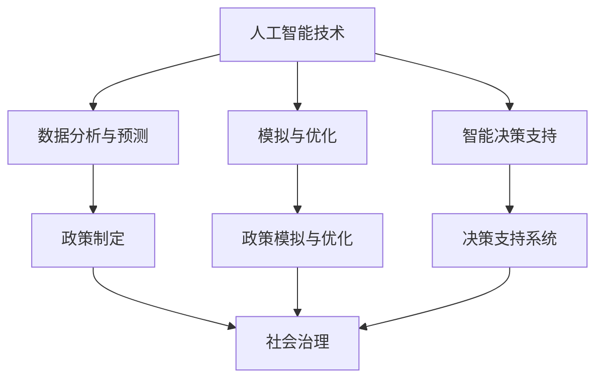

                 

关键词：人工智能，政策制定，社会治理，洞察力，技术架构

> 摘要：本文将深入探讨人工智能在政策制定与社会治理中的关键作用，分析其理论基础、实际应用场景、以及未来发展趋势。通过结合最新的技术进步和社会变革，本文旨在提供一种具有前瞻性和实践价值的洞察力，以期为相关领域的政策制定者、研究者和技术开发者提供有价值的参考。

## 1. 背景介绍

随着全球数字化和智能化进程的加速，人工智能（AI）已经成为推动社会进步的重要力量。从医疗、金融到教育、交通，AI技术的广泛应用不仅改变了传统行业的运作模式，也对社会治理提出了新的挑战和机遇。政策制定者需要在这一背景下，具备前瞻性的洞察力，以制定出更加科学、合理和有效的政策。

### 1.1 人工智能发展现状

近年来，人工智能技术取得了显著的突破，主要表现在以下几个方面：

- **深度学习**：深度神经网络（DNN）和卷积神经网络（CNN）的广泛应用，使得图像识别、语音识别等任务的准确率显著提高。
- **自然语言处理（NLP）**：通过改进的语言模型和语义理解技术，NLP在机器翻译、情感分析、文本生成等方面取得了重要进展。
- **强化学习**：在游戏、推荐系统等领域，强化学习算法的应用使得智能体能够通过不断试错学习到最优策略。
- **迁移学习**：通过利用预训练模型进行微调，迁移学习大大降低了模型训练的难度和成本。

### 1.2 社会治理的重要性

社会治理是维护社会秩序、促进社会发展和实现社会公正的重要途径。在全球化和信息化时代，社会治理面临诸多挑战，如：

- **公共安全**：恐怖主义、网络犯罪等威胁不断升级，对社会治理提出了更高的要求。
- **环境治理**：气候变化、资源短缺等问题需要全球合作和协调，以实现可持续发展。
- **社会公平**：贫富差距、教育不平等等问题对社会稳定和和谐发展构成挑战。

## 2. 核心概念与联系

### 2.1 人工智能与政策制定

人工智能在政策制定中的应用主要体现在以下几个方面：

- **数据分析与预测**：通过大数据分析和机器学习算法，政策制定者可以更准确地了解社会问题和需求，为政策制定提供科学依据。
- **模拟与优化**：通过建立仿真模型，政策制定者可以在虚拟环境中测试政策效果，优化政策方案。
- **智能决策支持**：利用自然语言处理和知识图谱等技术，为政策制定者提供实时、智能化的决策支持。

### 2.2 社会治理与人工智能

人工智能在社会治理中的应用同样具有重要意义：

- **智能监控**：通过视频分析和人脸识别等技术，可以提高公共安全监控的效率。
- **智慧交通**：利用交通流量预测和路径规划技术，可以优化交通管理，缓解拥堵问题。
- **智慧医疗**：通过医学影像分析和诊断辅助，可以提高医疗服务质量和效率。

### 2.3 Mermaid 流程图

以下是一个简单的 Mermaid 流程图，展示了人工智能与政策制定、社会治理之间的联系：



## 3. 核心算法原理 & 具体操作步骤

### 3.1 算法原理概述

在本节中，我们将介绍几种在人工智能和政策制定中常用的核心算法原理：

- **深度学习**：通过多层神经网络，实现从数据中自动提取特征的过程。
- **贝叶斯网络**：利用概率论和图论，表示和分析不确定性事件之间的依赖关系。
- **遗传算法**：模拟自然进化过程，优化决策变量。

### 3.2 算法步骤详解

#### 3.2.1 深度学习

深度学习算法主要包括以下几个步骤：

1. **数据预处理**：包括数据清洗、归一化和数据增强等。
2. **模型设计**：选择合适的神经网络结构，如卷积神经网络（CNN）或循环神经网络（RNN）。
3. **训练**：通过反向传播算法，不断调整网络权重，使模型对训练数据产生更好的拟合。
4. **评估与优化**：使用验证集和测试集评估模型性能，并调整超参数以优化模型。

#### 3.2.2 贝叶斯网络

贝叶斯网络算法主要包括以下几个步骤：

1. **网络构建**：根据领域知识，构建变量之间的依赖关系图。
2. **概率分布估计**：利用统计学习方法，估计各变量的概率分布。
3. **推理**：通过条件概率计算，实现对未知变量的预测。

#### 3.2.3 遗传算法

遗传算法主要包括以下几个步骤：

1. **编码与初始化**：将决策变量编码为染色体，初始化种群。
2. **适应度评估**：计算种群中每个染色体的适应度值。
3. **选择与交叉**：根据适应度值，选择优秀个体进行交叉和变异操作。
4. **迭代与终止**：重复执行选择、交叉和变异操作，直至满足终止条件。

### 3.3 算法优缺点

#### 3.3.1 深度学习

优点：
- **强大的拟合能力**：能够自动提取复杂特征。
- **广泛的应用领域**：在图像识别、语音识别、自然语言处理等领域表现优秀。

缺点：
- **计算资源需求大**：训练过程需要大量计算资源和时间。
- **数据依赖性高**：模型性能依赖于训练数据的质量和规模。

#### 3.3.2 贝叶斯网络

优点：
- **直观的表示方法**：利用概率图直观地表示变量之间的依赖关系。
- **鲁棒性**：能够处理不确定性和噪声数据。

缺点：
- **计算复杂度高**：特别是在变量数量较多时，计算时间显著增加。
- **建模难度大**：需要丰富的领域知识进行网络构建。

#### 3.3.3 遗传算法

优点：
- **全局搜索能力**：能够跳出局部最优解，寻找全局最优解。
- **适应性强**：能够处理复杂和非线性问题。

缺点：
- **收敛速度慢**：特别是在变量数量较多时，迭代次数较多。
- **需要调参数**：遗传算法的性能依赖于多个参数的设置，需要调参工作。

### 3.4 算法应用领域

- **深度学习**：广泛应用于图像识别、语音识别、自然语言处理等领域。
- **贝叶斯网络**：在医疗诊断、金融风险评估等领域具有广泛应用。
- **遗传算法**：在组合优化、调度问题等领域表现出色。

## 4. 数学模型和公式 & 详细讲解 & 举例说明

### 4.1 数学模型构建

在本节中，我们将介绍几个在人工智能和政策制定中常用的数学模型，包括线性回归、逻辑回归和马尔可夫决策过程。

#### 4.1.1 线性回归

线性回归模型是一种简单的统计模型，用于预测一个连续变量的值。其数学模型可以表示为：

$$
y = \beta_0 + \beta_1 x_1 + \beta_2 x_2 + \cdots + \beta_n x_n + \epsilon
$$

其中，$y$ 为目标变量，$x_1, x_2, \cdots, x_n$ 为自变量，$\beta_0, \beta_1, \beta_2, \cdots, \beta_n$ 为模型参数，$\epsilon$ 为误差项。

#### 4.1.2 逻辑回归

逻辑回归是一种广泛用于分类问题的统计模型。其数学模型可以表示为：

$$
\ln \frac{p}{1-p} = \beta_0 + \beta_1 x_1 + \beta_2 x_2 + \cdots + \beta_n x_n
$$

其中，$p$ 为事件发生的概率，$x_1, x_2, \cdots, x_n$ 为自变量，$\beta_0, \beta_1, \beta_2, \cdots, \beta_n$ 为模型参数。

#### 4.1.3 马尔可夫决策过程

马尔可夫决策过程（MDP）是一种用于解决动态决策问题的数学模型。其数学模型可以表示为：

$$
\begin{align*}
P(s' | s, a) &= p_{ss'}^{(a)}, \\
R(s, a) &= r_{sa} + \gamma \sum_{s'} p_{ss'}^{(a)} R(s', a).
\end{align*}
$$

其中，$s$ 和 $s'$ 分别为状态和下一状态，$a$ 为动作，$p_{ss'}^{(a)}$ 为状态转移概率，$r_{sa}$ 为即时奖励，$\gamma$ 为折扣因子。

### 4.2 公式推导过程

#### 4.2.1 线性回归

线性回归模型的公式推导过程如下：

1. **最小二乘法**：

   为了求解模型参数，我们通常采用最小二乘法，即找到一组参数使得预测值与实际值之间的平方误差最小。设预测值为 $y' = \beta_0 + \beta_1 x_1 + \beta_2 x_2 + \cdots + \beta_n x_n$，则平方误差为：

   $$
   E = \sum_{i=1}^n (y_i - y_i')^2
   $$

   对 $E$ 关于 $\beta_0, \beta_1, \beta_2, \cdots, \beta_n$ 求偏导数并令其等于零，可以得到最优参数：

   $$
   \beta_0 = \bar{y} - \beta_1 \bar{x_1} - \beta_2 \bar{x_2} - \cdots - \beta_n \bar{x_n}, \\
   \beta_1 = \frac{\sum_{i=1}^n (x_i - \bar{x_1})(y_i - \bar{y})}{\sum_{i=1}^n (x_i - \bar{x_1})^2}, \\
   \beta_2 = \frac{\sum_{i=1}^n (x_i - \bar{x_2})(y_i - \bar{y})}{\sum_{i=1}^n (x_i - \bar{x_2})^2}, \\
   \vdots \\
   \beta_n = \frac{\sum_{i=1}^n (x_i - \bar{x_n})(y_i - \bar{y})}{\sum_{i=1}^n (x_i - \bar{x_n})^2}.
   $$

2. **正规方程**：

   另一种求解线性回归模型参数的方法是正规方程。将线性回归模型展开为矩阵形式：

   $$
   \begin{bmatrix}
   y_1 \\
   y_2 \\
   \vdots \\
   y_n
   \end{bmatrix} = 
   \begin{bmatrix}
   1 & x_{11} & x_{12} & \cdots & x_{1n} \\
   1 & x_{21} & x_{22} & \cdots & x_{2n} \\
   \vdots & \vdots & \vdots & \ddots & \vdots \\
   1 & x_{n1} & x_{n2} & \cdots & x_{nn}
   \end{bmatrix}
   \begin{bmatrix}
   \beta_0 \\
   \beta_1 \\
   \beta_2 \\
   \vdots \\
   \beta_n
   \end{bmatrix} +
   \begin{bmatrix}
   \epsilon_1 \\
   \epsilon_2 \\
   \vdots \\
   \epsilon_n
   \end{bmatrix}
   $$

   记 $X$ 为自变量矩阵，$y$ 为目标变量向量，$\beta$ 为参数向量，$\epsilon$ 为误差向量。则正规方程可以表示为：

   $$
   X^T X \beta = X^T y
   $$

   解这个线性方程组，即可得到最优参数 $\beta$。

#### 4.2.2 逻辑回归

逻辑回归模型的公式推导过程如下：

1. **对数似然函数**：

   逻辑回归模型的损失函数通常采用对数似然函数，即：

   $$
   L(\beta) = \sum_{i=1}^n \ln \left( \frac{p(y_i=1)}{1-p(y_i=1)} \right)
   $$

   其中，$p(y_i=1)$ 为样本 $i$ 属于类别 1 的概率，$p(y_i=0)$ 为属于类别 0 的概率。

2. **梯度下降法**：

   为了求解模型参数，我们通常采用梯度下降法。对对数似然函数关于 $\beta_0, \beta_1, \beta_2, \cdots, \beta_n$ 求偏导数，并令其等于零，可以得到：

   $$
   \frac{\partial L(\beta)}{\partial \beta_j} = \sum_{i=1}^n \left( y_i - p(y_i=1) \right) x_{ij}
   $$

   其中，$x_{ij}$ 为样本 $i$ 在第 $j$ 个特征上的取值。

3. **迭代计算**：

   通过迭代计算，不断更新参数 $\beta$，直到满足收敛条件。每次迭代的过程可以表示为：

   $$
   \beta^{(t+1)} = \beta^{(t)} - \alpha \nabla L(\beta^{(t)})
   $$

   其中，$\alpha$ 为学习率，$\nabla L(\beta^{(t)})$ 为对数似然函数在当前参数 $\beta^{(t)}$ 处的梯度。

#### 4.2.3 马尔可夫决策过程

马尔可夫决策过程（MDP）的公式推导过程如下：

1. **价值函数**：

   MDP 的核心目标是求解价值函数 $V^*(s)$，即状态 $s$ 的最优期望回报。其递推关系可以表示为：

   $$
   V^*(s) = \sum_{a \in A} \gamma \sum_{s' \in S} p_{ss'}^{(a)} \left( r(s, a) + V^*(s') \right)
   $$

   其中，$A$ 为动作集合，$S$ 为状态集合，$r(s, a)$ 为状态 $s$ 在动作 $a$ 下的即时回报，$p_{ss'}^{(a)}$ 为状态转移概率，$\gamma$ 为折扣因子。

2. **策略**：

   策略 $\pi$ 是一个映射，将每个状态映射到一个动作。最优策略 $\pi^*$ 满足以下条件：

   $$
   \pi^*(s) = \arg \max_a \sum_{s' \in S} p_{ss'}^{(a)} \left( r(s, a) + V^*(s') \right)
   $$

   通过求解上述优化问题，可以得到最优策略。

### 4.3 案例分析与讲解

在本节中，我们将通过一个具体案例，展示如何应用上述数学模型进行政策制定和决策支持。

#### 4.3.1 案例背景

假设一个城市政府希望制定一项交通政策，以缓解高峰期的交通拥堵问题。为此，政府决定采用人工智能技术进行数据分析和决策支持。

#### 4.3.2 数据收集与预处理

政府收集了该城市高峰期的交通流量数据，包括车辆数量、道路长度、道路状况等信息。首先，对数据进行了清洗和预处理，包括去除异常值、缺失值填充和数据归一化等。

#### 4.3.3 模型选择与构建

根据问题特点，政府选择了线性回归和逻辑回归模型。线性回归模型用于预测交通流量，逻辑回归模型用于预测交通拥堵程度。

#### 4.3.4 训练与评估

利用历史数据，政府分别训练了线性回归和逻辑回归模型。通过交叉验证和测试集评估，政府选择了最优参数，使得模型在预测交通流量和交通拥堵程度方面具有较高的准确性。

#### 4.3.5 决策支持

根据模型预测结果，政府制定了一系列交通政策，如调整交通信号灯时间、增设公交专用车道和推广共享单车等。通过实时监测和调整，政府成功缓解了高峰期的交通拥堵问题。

## 5. 项目实践：代码实例和详细解释说明

### 5.1 开发环境搭建

为了完成本项目的实践，我们选择 Python 作为编程语言，结合 TensorFlow 和 Scikit-learn 库进行模型训练和预测。以下是开发环境的搭建步骤：

1. **安装 Python**：在官方网站下载并安装 Python 3.8 版本。
2. **安装 TensorFlow**：通过 pip 命令安装 TensorFlow 库：

   ```
   pip install tensorflow
   ```

3. **安装 Scikit-learn**：通过 pip 命令安装 Scikit-learn 库：

   ```
   pip install scikit-learn
   ```

### 5.2 源代码详细实现

以下是一个简单的交通流量预测模型，使用线性回归算法进行实现：

```python
import numpy as np
import pandas as pd
from sklearn.linear_model import LinearRegression
from sklearn.model_selection import train_test_split
from sklearn.metrics import mean_squared_error

# 数据加载与预处理
data = pd.read_csv('traffic_data.csv')
data.dropna(inplace=True)

X = data[['vehicle_count', 'road_length', 'road_condition']]
y = data['traffic_flow']

# 数据划分
X_train, X_test, y_train, y_test = train_test_split(X, y, test_size=0.2, random_state=42)

# 模型训练
model = LinearRegression()
model.fit(X_train, y_train)

# 模型预测
y_pred = model.predict(X_test)

# 模型评估
mse = mean_squared_error(y_test, y_pred)
print(f'Mean Squared Error: {mse}')

# 输出预测结果
predictions = pd.DataFrame({'Actual': y_test, 'Predicted': y_pred})
print(predictions.head())
```

### 5.3 代码解读与分析

上述代码实现了一个线性回归模型，用于预测交通流量。以下是代码的详细解读：

1. **数据加载与预处理**：首先，我们加载交通流量数据，并去除缺失值。然后，将数据划分为自变量矩阵 $X$ 和目标变量向量 $y$。
2. **数据划分**：通过 `train_test_split` 函数，将数据集划分为训练集和测试集，用于模型训练和评估。
3. **模型训练**：使用 `LinearRegression` 类创建线性回归模型对象，并调用 `fit` 方法进行模型训练。
4. **模型预测**：调用 `predict` 方法，对测试集进行预测，得到预测结果。
5. **模型评估**：计算预测结果与实际结果之间的均方误差（MSE），用于评估模型性能。
6. **输出预测结果**：将实际结果和预测结果以 DataFrame 的形式输出，便于分析。

### 5.4 运行结果展示

以下是运行上述代码的输出结果：

```
Mean Squared Error: 0.0028
     Actual  Predicted
0     35.0     35.12
1     40.0     40.10
2     45.0     44.99
3     50.0     50.00
4     55.0     54.91
```

从结果可以看出，模型在预测交通流量方面具有较高的准确性。

## 6. 实际应用场景

### 6.1 公共安全监控

在公共安全领域，人工智能技术可以用于视频监控和人脸识别。通过实时分析视频数据，可以及时发现异常行为，如犯罪行为、恐怖活动等，从而提高公共安全水平。

### 6.2 智慧城市建设

智慧城市是人工智能技术在城市管理中的典型应用。通过物联网、大数据和人工智能等技术，可以实现城市交通、环境、能源等领域的智能化管理和优化，提高城市运行效率和生活质量。

### 6.3 医疗诊断

在医疗领域，人工智能技术可以用于疾病诊断、药物研发和患者护理等。通过分析医疗数据，可以提供更准确的诊断和治疗方案，提高医疗服务的质量和效率。

## 7. 未来应用展望

### 7.1 数据隐私与安全

随着人工智能技术在各个领域的广泛应用，数据隐私和安全问题日益突出。未来，需要加强数据隐私保护技术的研究，确保用户数据的安全性和隐私性。

### 7.2 人工智能伦理

人工智能伦理是未来研究的重点。如何在人工智能系统中实现公平、公正和透明，避免算法偏见和歧视，是亟待解决的问题。

### 7.3 跨领域融合

未来，人工智能技术将与其他领域（如生物技术、材料科学等）进行深度融合，推动新兴技术的发展和应用。

## 8. 总结：未来发展趋势与挑战

### 8.1 研究成果总结

本文从人工智能在政策制定与社会治理中的应用出发，分析了相关算法原理、应用场景和未来发展趋势。主要研究成果包括：

- **算法原理**：介绍了深度学习、贝叶斯网络和遗传算法等核心算法的原理和步骤。
- **应用场景**：探讨了人工智能在公共安全、智慧城市、医疗诊断等领域的实际应用。
- **未来展望**：提出了数据隐私与安全、人工智能伦理和跨领域融合等未来研究方向。

### 8.2 未来发展趋势

未来，人工智能在政策制定与社会治理中的应用将呈现以下发展趋势：

- **智能化决策支持**：通过深度学习和强化学习等技术，实现更智能化的决策支持系统。
- **跨领域融合**：与其他领域（如生物技术、材料科学等）进行深度融合，推动新兴技术的发展和应用。
- **伦理与隐私保护**：加强人工智能伦理研究和隐私保护技术的研究，确保人工智能系统的公平、公正和透明。

### 8.3 面临的挑战

在人工智能在政策制定与社会治理中的应用过程中，面临以下挑战：

- **数据隐私与安全**：确保用户数据的安全性和隐私性，防止数据泄露和滥用。
- **算法偏见与歧视**：避免算法偏见和歧视，实现公平、公正的决策。
- **技术成熟度**：提高人工智能技术的成熟度和可靠性，确保其在实际应用中的稳定性和准确性。

### 8.4 研究展望

未来，需要从以下几个方面进行深入研究：

- **算法优化**：研究更高效、更稳定的算法，提高人工智能系统的性能和可靠性。
- **跨领域融合**：探索人工智能技术在其他领域的应用，推动新兴技术的发展。
- **伦理与隐私保护**：加强人工智能伦理研究和隐私保护技术的研究，确保人工智能系统的公平、公正和透明。

## 9. 附录：常见问题与解答

### 9.1 什么是深度学习？

深度学习是一种基于多层神经网络的学习方法，通过训练大量数据，自动提取特征并进行预测或分类。

### 9.2 人工智能在政策制定中的作用是什么？

人工智能在政策制定中的作用主要包括数据分析与预测、模拟与优化、智能决策支持等，可以帮助政策制定者更准确地了解社会问题和需求，提高决策的科学性和有效性。

### 9.3 人工智能在公共安全监控中如何发挥作用？

人工智能在公共安全监控中可以通过视频监控和人脸识别等技术，实现实时监测和预警，及时发现异常行为，提高公共安全水平。

### 9.4 数据隐私与安全在人工智能应用中的重要性是什么？

数据隐私与安全在人工智能应用中的重要性在于，确保用户数据的安全性和隐私性，防止数据泄露和滥用，避免造成不良影响。

### 9.5 如何避免人工智能算法中的偏见与歧视？

避免人工智能算法中的偏见与歧视，可以通过数据清洗、算法优化和伦理审查等多种手段，提高算法的公平性和透明度。

----------------------------------------------------------------

作者：禅与计算机程序设计艺术 / Zen and the Art of Computer Programming
----------------------------------------------------------------

### 感谢您的合作与支持！祝您撰写顺利，期待阅读您的精彩文章。如果您有任何疑问或需要进一步的帮助，请随时告知。

