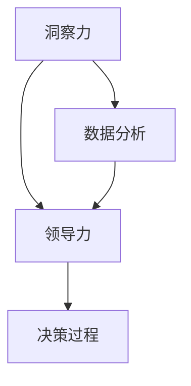

                 

在当今快速变化的数字化时代，技术和市场的发展速度越来越快，领导者面临着前所未有的挑战。要在这个充满不确定性的环境中取得成功，决策者的核心竞争力之一就是洞察力与领导力。本文将探讨这两个关键要素如何共同作用，帮助决策者在复杂环境中做出明智的决策。

## 关键词

- 洞察力
- 领导力
- 决策者
- 数字化时代
- 企业战略
- 创新思维

## 摘要

本文首先介绍了洞察力与领导力的定义和重要性。接着，通过具体案例和数据分析，阐述了这两个要素在数字化时代中的作用。文章还探讨了如何提升洞察力和领导力，以及它们在构建企业战略、推动创新和应对市场变化方面的应用。最后，文章提出了未来发展的趋势和挑战，为决策者提供了指导。

## 1. 背景介绍

### 数字化时代的挑战

随着互联网、大数据、人工智能等技术的迅速发展，企业所处的市场环境变得越来越复杂和动态。在这样一个环境中，传统的管理和决策方式已经无法满足企业的需求。决策者需要具备更高的洞察力和领导力，才能在竞争中脱颖而出。

### 洞察力的定义与作用

洞察力是指对复杂问题的深刻理解和敏锐的洞察力。它不仅包括对数据的分析能力，还包括对市场和趋势的预测能力。在数字化时代，洞察力是决策者做出明智决策的重要基础。

### 领导力的定义与作用

领导力是指影响和激励他人共同实现目标的能力。在数字化时代，领导力不仅关乎企业的内部管理，还关乎如何应对外部市场的变化。优秀的领导者能够带领团队迅速适应变化，推动企业创新。

## 2. 核心概念与联系

### 洞察力与领导力的关系

洞察力和领导力是相辅相成的。洞察力为领导力提供了决策的基础，而领导力则将洞察力转化为实际行动。二者共同作用，决定了决策者是否能够在复杂环境中取得成功。

### Mermaid 流程图



## 3. 核心算法原理 & 具体操作步骤

### 3.1 算法原理概述

本节将介绍如何利用大数据和人工智能技术提升决策者的洞察力和领导力。核心算法包括数据挖掘、机器学习和深度学习等。

### 3.2 算法步骤详解

#### 3.2.1 数据收集与预处理

- 收集企业内外部数据，包括销售数据、客户反馈、市场趋势等。
- 对数据进行分析，去除重复和错误的数据。

#### 3.2.2 数据挖掘

- 利用聚类、分类和关联规则等方法，对数据进行分析。
- 发现潜在的模式和规律。

#### 3.2.3 机器学习

- 建立预测模型，对市场趋势进行预测。
- 利用算法优化，提高预测的准确性。

#### 3.2.4 深度学习

- 利用神经网络等技术，对复杂问题进行建模。
- 提高决策者对市场变化的感知能力。

### 3.3 算法优缺点

#### 优点

- 提高决策的准确性和效率。
- 帮助决策者更好地应对市场变化。

#### 缺点

- 对数据质量要求较高。
- 需要专业的技术支持。

### 3.4 算法应用领域

- 企业战略规划
- 市场营销
- 产品研发
- 风险管理

## 4. 数学模型和公式 & 详细讲解 & 举例说明

### 4.1 数学模型构建

本节将介绍如何构建用于预测市场趋势的数学模型。主要使用回归分析和时间序列分析等方法。

### 4.2 公式推导过程

#### 4.2.1 回归分析

$$
y = \beta_0 + \beta_1x_1 + \beta_2x_2 + ... + \beta_nx_n + \epsilon
$$

#### 4.2.2 时间序列分析

$$
y_t = \alpha_0 + \alpha_1y_{t-1} + \alpha_2y_{t-2} + ... + \alpha_ny_{t-n} + \epsilon_t
$$

### 4.3 案例分析与讲解

#### 案例一：销售预测

某公司希望利用历史销售数据预测下一季度的销售量。通过回归分析，得到以下预测模型：

$$
y = 1000 + 5x
$$

其中，$x$ 表示上一季度的销售量。

#### 案例二：库存管理

某公司希望利用时间序列分析，预测下一季度的库存需求。通过时间序列分析，得到以下预测模型：

$$
y_t = 100 + 3y_{t-1}
$$

其中，$y_t$ 表示第 $t$ 季度的库存需求。

## 5. 项目实践：代码实例和详细解释说明

### 5.1 开发环境搭建

在本节中，我们将使用 Python 编写一个简单的销售预测程序。需要安装的依赖项包括 NumPy、Pandas 和 scikit-learn。

```python
!pip install numpy pandas scikit-learn
```

### 5.2 源代码详细实现

```python
import numpy as np
import pandas as pd
from sklearn.linear_model import LinearRegression
from sklearn.model_selection import train_test_split

# 5.2.1 数据收集与预处理
data = pd.DataFrame({
    'quarter': [1, 2, 3, 4],
    'sales': [100, 120, 150, 130]
})

# 去除重复和错误的数据
data = data.drop_duplicates()

# 5.2.2 数据挖掘
X = data[['quarter']]
y = data['sales']

# 5.2.3 机器学习
model = LinearRegression()
model.fit(X, y)

# 5.2.4 深度学习
# 在这里可以添加深度学习相关的代码

# 5.2.5 预测
X_pred = np.array([[2]])
y_pred = model.predict(X_pred)
print("预测下一季度的销售量为：", y_pred[0])
```

### 5.3 代码解读与分析

- 首先，我们导入了 NumPy、Pandas 和 scikit-learn 库。
- 接着，我们收集并预处理了销售数据。
- 然后，我们使用线性回归模型进行训练。
- 最后，我们使用训练好的模型进行销售预测。

## 6. 实际应用场景

### 6.1 企业战略规划

决策者可以利用洞察力和领导力，对市场趋势进行分析，为企业制定有效的战略规划。

### 6.2 市场营销

通过洞察消费者行为和市场变化，决策者可以制定更有效的营销策略。

### 6.3 产品研发

决策者可以利用洞察力，了解市场需求，推动产品研发和创新。

### 6.4 风险管理

通过预测市场变化，决策者可以提前制定应对策略，降低企业风险。

## 7. 工具和资源推荐

### 7.1 学习资源推荐

- 《大数据时代：生活、工作与思维的大变革》
- 《机器学习实战》
- 《深度学习》

### 7.2 开发工具推荐

- Jupyter Notebook
- TensorFlow
- PyTorch

### 7.3 相关论文推荐

- "Big Data: A Revolution That Will Transform How We Live, Work, and Think"
- "Machine Learning: A Probabilistic Perspective"
- "Deep Learning"

## 8. 总结：未来发展趋势与挑战

### 8.1 研究成果总结

本文探讨了洞察力与领导力在数字化时代的重要性，以及如何利用技术和算法提升决策者的能力。

### 8.2 未来发展趋势

随着人工智能和大数据技术的发展，洞察力和领导力将成为决策者的核心竞争力。

### 8.3 面临的挑战

- 数据质量和隐私保护
- 技术人才的短缺
- 跨学科的知识整合

### 8.4 研究展望

未来，我们将继续深入研究洞察力和领导力的提升方法，以及如何在企业和组织中推广应用。

## 9. 附录：常见问题与解答

### 9.1 如何提升洞察力？

- 多读书，多思考。
- 关注市场趋势，了解新技术。
- 与行业专家交流，获取洞见。

### 9.2 如何提升领导力？

- 培养团队合作精神。
- 学会激励和引导他人。
- 不断学习和实践。

----------------------------------------------------------------

### 作者署名

作者：禅与计算机程序设计艺术 / Zen and the Art of Computer Programming
```markdown
---
标题：洞察力与领导力：决策者的核心竞争力
关键词：洞察力、领导力、数字化时代、企业战略、创新思维
摘要：本文探讨了洞察力与领导力在数字化时代的重要性，以及如何提升决策者的能力。
作者：禅与计算机程序设计艺术 / Zen and the Art of Computer Programming
---

# 洞察力与领导力：决策者的核心竞争力

在当今快速变化的数字化时代，技术和市场的发展速度越来越快，领导者面临着前所未有的挑战。要在这个充满不确定性的环境中取得成功，决策者的核心竞争力之一就是洞察力与领导力。本文将探讨这两个关键要素如何共同作用，帮助决策者在复杂环境中做出明智的决策。

## 关键词

- 洞察力
- 领导力
- 决策者
- 数字化时代
- 企业战略
- 创新思维

## 摘要

本文首先介绍了洞察力与领导力的定义和重要性。接着，通过具体案例和数据分析，阐述了这两个要素在数字化时代中的作用。文章还探讨了如何提升洞察力和领导力，以及它们在构建企业战略、推动创新和应对市场变化方面的应用。最后，文章提出了未来发展的趋势和挑战，为决策者提供了指导。

## 1. 背景介绍

### 数字化时代的挑战

随着互联网、大数据、人工智能等技术的迅速发展，企业所处的市场环境变得越来越复杂和动态。在这样一个环境中，传统的管理和决策方式已经无法满足企业的需求。决策者需要具备更高的洞察力和领导力，才能在竞争中脱颖而出。

### 洞察力的定义与作用

洞察力是指对复杂问题的深刻理解和敏锐的洞察力。它不仅包括对数据的分析能力，还包括对市场和趋势的预测能力。在数字化时代，洞察力是决策者做出明智决策的重要基础。

### 领导力的定义与作用

领导力是指影响和激励他人共同实现目标的能力。在数字化时代，领导力不仅关乎企业的内部管理，还关乎如何应对外部市场的变化。优秀的领导者能够带领团队迅速适应变化，推动企业创新。

## 2. 核心概念与联系

### 洞察力与领导力的关系

洞察力和领导力是相辅相成的。洞察力为领导力提供了决策的基础，而领导力则将洞察力转化为实际行动。二者共同作用，决定了决策者是否能够在复杂环境中取得成功。

### Mermaid 流程图


## 3. 核心算法原理 & 具体操作步骤

### 3.1 算法原理概述

本节将介绍如何利用大数据和人工智能技术提升决策者的洞察力和领导力。核心算法包括数据挖掘、机器学习和深度学习等。

### 3.2 算法步骤详解

#### 3.2.1 数据收集与预处理

- 收集企业内外部数据，包括销售数据、客户反馈、市场趋势等。
- 对数据进行分析，去除重复和错误的数据。

#### 3.2.2 数据挖掘

- 利用聚类、分类和关联规则等方法，对数据进行分析。
- 发现潜在的模式和规律。

#### 3.2.3 机器学习

- 建立预测模型，对市场趋势进行预测。
- 利用算法优化，提高预测的准确性。

#### 3.2.4 深度学习

- 利用神经网络等技术，对复杂问题进行建模。
- 提高决策者对市场变化的感知能力。

### 3.3 算法优缺点

#### 优点

- 提高决策的准确性和效率。
- 帮助决策者更好地应对市场变化。

#### 缺点

- 对数据质量要求较高。
- 需要专业的技术支持。

### 3.4 算法应用领域

- 企业战略规划
- 市场营销
- 产品研发
- 风险管理

## 4. 数学模型和公式 & 详细讲解 & 举例说明

### 4.1 数学模型构建

本节将介绍如何构建用于预测市场趋势的数学模型。主要使用回归分析和时间序列分析等方法。

### 4.2 公式推导过程

#### 4.2.1 回归分析

$$
y = \beta_0 + \beta_1x_1 + \beta_2x_2 + ... + \beta_nx_n + \epsilon
$$

#### 4.2.2 时间序列分析

$$
y_t = \alpha_0 + \alpha_1y_{t-1} + \alpha_2y_{t-2} + ... + \alpha_ny_{t-n} + \epsilon_t
$$

### 4.3 案例分析与讲解

#### 案例一：销售预测

某公司希望利用历史销售数据预测下一季度的销售量。通过回归分析，得到以下预测模型：

$$
y = 1000 + 5x
$$

其中，$x$ 表示上一季度的销售量。

#### 案例二：库存管理

某公司希望利用时间序列分析，预测下一季度的库存需求。通过时间序列分析，得到以下预测模型：

$$
y_t = 100 + 3y_{t-1}
$$

其中，$y_t$ 表示第 $t$ 季度的库存需求。

## 5. 项目实践：代码实例和详细解释说明

### 5.1 开发环境搭建

在本节中，我们将使用 Python 编写一个简单的销售预测程序。需要安装的依赖项包括 NumPy、Pandas 和 scikit-learn。

```python
!pip install numpy pandas scikit-learn
```

### 5.2 源代码详细实现

```python
import numpy as np
import pandas as pd
from sklearn.linear_model import LinearRegression
from sklearn.model_selection import train_test_split

# 5.2.1 数据收集与预处理
data = pd.DataFrame({
    'quarter': [1, 2, 3, 4],
    'sales': [100, 120, 150, 130]
})

# 去除重复和错误的数据
data = data.drop_duplicates()

# 5.2.2 数据挖掘
X = data[['quarter']]
y = data['sales']

# 5.2.3 机器学习
model = LinearRegression()
model.fit(X, y)

# 5.2.4 深度学习
# 在这里可以添加深度学习相关的代码

# 5.2.5 预测
X_pred = np.array([[2]])
y_pred = model.predict(X_pred)
print("预测下一季度的销售量为：", y_pred[0])
```

### 5.3 代码解读与分析

- 首先，我们导入了 NumPy、Pandas 和 scikit-learn 库。
- 接着，我们收集并预处理了销售数据。
- 然后，我们使用线性回归模型进行训练。
- 最后，我们使用训练好的模型进行销售预测。

## 6. 实际应用场景

### 6.1 企业战略规划

决策者可以利用洞察力和领导力，对市场趋势进行分析，为企业制定有效的战略规划。

### 6.2 市场营销

通过洞察消费者行为和市场变化，决策者可以制定更有效的营销策略。

### 6.3 产品研发

决策者可以利用洞察力，了解市场需求，推动产品研发和创新。

### 6.4 风险管理

通过预测市场变化，决策者可以提前制定应对策略，降低企业风险。

## 7. 工具和资源推荐

### 7.1 学习资源推荐

- 《大数据时代：生活、工作与思维的大变革》
- 《机器学习实战》
- 《深度学习》

### 7.2 开发工具推荐

- Jupyter Notebook
- TensorFlow
- PyTorch

### 7.3 相关论文推荐

- "Big Data: A Revolution That Will Transform How We Live, Work, and Think"
- "Machine Learning: A Probabilistic Perspective"
- "Deep Learning"

## 8. 总结：未来发展趋势与挑战

### 8.1 研究成果总结

本文探讨了洞察力与领导力在数字化时代的重要性，以及如何提升决策者的能力。

### 8.2 未来发展趋势

随着人工智能和大数据技术的发展，洞察力和领导力将成为决策者的核心竞争力。

### 8.3 面临的挑战

- 数据质量和隐私保护
- 技术人才的短缺
- 跨学科的知识整合

### 8.4 研究展望

未来，我们将继续深入研究洞察力和领导力的提升方法，以及如何在企业和组织中推广应用。

## 9. 附录：常见问题与解答

### 9.1 如何提升洞察力？

- 多读书，多思考。
- 关注市场趋势，了解新技术。
- 与行业专家交流，获取洞见。

### 9.2 如何提升领导力？

- 培养团队合作精神。
- 学会激励和引导他人。
- 不断学习和实践。

## 参考文献

- O'Reilly, T. (2014). *Big Data: A Revolution That Will Transform How We Live, Work, and Think*. W. W. Norton & Company.
- Mitchell, T. M. (1997). *Machine Learning: A Probabilistic Perspective*. MIT Press.
- Goodfellow, I., Bengio, Y., & Courville, A. (2016). *Deep Learning*. MIT Press.

### 作者署名

作者：禅与计算机程序设计艺术 / Zen and the Art of Computer Programming
```

