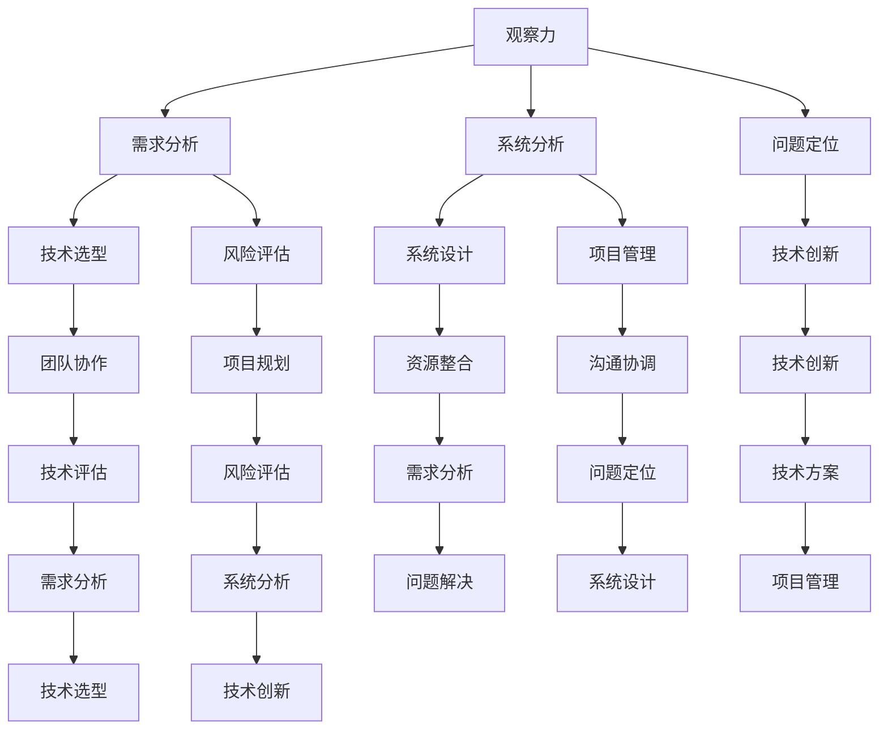

                 

 在信息技术领域，洞察力的培养是一项至关重要的任务。它不仅能够帮助程序员和软件工程师更好地理解和解决问题，还能够推动技术创新和进步。本文将围绕观察、分析与综合能力三个方面，探讨如何培养和提高洞察力，以应对现代技术发展的挑战。

> **关键词：** 洞察力、观察、分析、综合、信息技术、程序员、软件工程师

> **摘要：** 本文首先介绍了洞察力的定义及其在信息技术领域的意义。接着，从观察、分析和综合三个角度，详细阐述了培养洞察力的方法与技巧。通过具体的案例和实践经验，本文提供了一些实用的建议，以帮助读者提升自己的洞察力。

## 1. 背景介绍

### 1.1 信息技术的发展

随着互联网、大数据、云计算和人工智能等技术的迅猛发展，信息技术已经渗透到社会的各个领域。在这个过程中，程序员和软件工程师的角色变得越来越重要。他们不仅是技术实现者，更是创新者。然而，面对复杂的技术系统和不断变化的需求，仅仅具备编程技能已经不够，洞察力的培养成为了一个迫切的需求。

### 1.2 洞察力的意义

洞察力是指能够深入理解事物本质、发现潜在问题和机会的能力。在信息技术领域，洞察力具有以下几个方面的意义：

- **问题解决能力：** 洞察力能够帮助程序员和软件工程师更快速、准确地找到问题的根本原因，从而高效地解决问题。
- **技术创新：** 洞察力能够帮助技术人员发现新的技术需求和应用场景，推动技术创新和进步。
- **团队协作：** 洞察力能够增强团队之间的沟通和理解，提高团队协作效率。

### 1.3 目标读者

本文的目标读者是程序员、软件工程师和技术经理等从事信息技术工作的人员。无论你是刚刚进入行业的初学者，还是拥有多年经验的专业人士，本文都将为你提供有价值的洞察力培养方法和技巧。

## 2. 核心概念与联系

### 2.1 观察力的定义

观察力是指对事物进行仔细、有意识地观察和感知的能力。在信息技术领域，观察力主要体现在以下几个方面：

- **需求分析：** 通过对用户需求和使用场景的观察，发现潜在的问题和需求。
- **系统分析：** 通过对现有系统的观察，理解系统的架构、功能和性能，发现改进的机会。
- **问题定位：** 通过对系统行为的观察，定位问题的根本原因。

### 2.2 分析力的定义

分析力是指对事物进行深入思考、推理和判断的能力。在信息技术领域，分析力主要体现在以下几个方面：

- **问题解决：** 通过分析问题的本质和关联因素，找到解决问题的方法和策略。
- **技术选型：** 通过对不同技术的分析，选择最适合项目需求的技术方案。
- **风险评估：** 通过分析项目中的风险因素，制定相应的风险控制措施。

### 2.3 综合力的定义

综合力是指将各种因素、信息和资源整合在一起，形成整体解决方案的能力。在信息技术领域，综合力主要体现在以下几个方面：

- **系统设计：** 通过整合用户需求、技术方案和资源，设计出高效的系统架构。
- **项目管理：** 通过整合团队成员的能力、资源和时间，确保项目的顺利进行。
- **技术创新：** 通过整合现有的技术和资源，推动技术创新和进步。

### 2.4 Mermaid 流程图



## 3. 核心算法原理 & 具体操作步骤

### 3.1 算法原理概述

在信息技术领域，算法是解决问题的关键。以下将介绍几种常见的算法原理，以及如何在实践中应用这些原理。

#### 3.1.1 暴力搜索算法

暴力搜索算法是一种简单直接的算法，通过遍历所有可能的解空间来找到问题的解。这种方法虽然效率较低，但在某些简单问题中仍然有效。

#### 3.1.2 贪心算法

贪心算法是一种通过每次选择局部最优解来逐步逼近全局最优解的算法。这种方法适用于某些特殊类型的问题，如最短路径、最大子序列和最小生成树等。

#### 3.1.3 动态规划算法

动态规划算法是一种通过将问题分解为子问题，并利用子问题的解来构建原问题的解的算法。这种方法适用于许多复杂问题，如背包问题、最长公共子序列和最长递增子序列等。

### 3.2 算法步骤详解

#### 3.2.1 暴力搜索算法步骤

1. 定义问题的解空间。
2. 遍历解空间，对每个解进行评估。
3. 选择最优解。

#### 3.2.2 贪心算法步骤

1. 初始状态。
2. 选择当前状态下的局部最优解。
3. 更新状态，重复步骤2，直到找到全局最优解。

#### 3.2.3 动态规划算法步骤

1. 确定子问题的定义和状态。
2. 设计状态转移方程。
3. 确定边界条件。
4. 从边界开始，递推计算状态值，得到原问题的解。

### 3.3 算法优缺点

#### 3.3.1 暴力搜索算法

- 优点：实现简单，易于理解。
- 缺点：效率低，适用于简单问题。

#### 3.3.2 贪心算法

- 优点：效率较高，适用于某些特定类型的问题。
- 缺点：可能无法保证全局最优解。

#### 3.3.3 动态规划算法

- 优点：能够解决许多复杂问题，效率较高。
- 缺点：实现较为复杂，需要对问题有深入的理解。

### 3.4 算法应用领域

- **暴力搜索算法：** 图着色问题、N皇后问题等。
- **贪心算法：** 最短路径问题、背包问题等。
- **动态规划算法：** 背包问题、最长公共子序列、最长递增子序列等。

## 4. 数学模型和公式 & 详细讲解 & 举例说明

### 4.1 数学模型构建

在信息技术领域，数学模型是一种重要的工具，用于描述和解决问题。以下是一个简单的数学模型构建示例。

#### 4.1.1 问题描述

假设我们有一个背包问题，背包容量为C，有N件物品，每件物品的重量为wi，价值为vi。我们需要选择若干件物品放入背包中，使得背包中的物品总价值最大化。

#### 4.1.2 数学模型构建

定义状态f[i][j]为前i件物品放入容量为j的背包中的最大价值。

状态转移方程如下：

f[i][j] = max{f[i-1][j], f[i-1][j-wi[i]] + vi[i]} （如果j >= wi[i]）

边界条件：

f[0][j] = 0 （任何物品都不放入背包中）

### 4.2 公式推导过程

以最长公共子序列（LCS）为例，介绍公式的推导过程。

#### 4.2.1 问题描述

给定两个序列X = {x1, x2, ..., xn}和Y = {y1, y2, ..., yn}，我们需要找到它们的最长公共子序列。

#### 4.2.2 数学模型构建

定义状态L[i][j]为X的前i个元素和Y的前j个元素的最长公共子序列的长度。

状态转移方程如下：

L[i][j] = L[i-1][j-1] + 1 （如果xi = yj）
L[i][j] = max{L[i-1][j], L[i][j-1]} （如果xi ≠ yj）

边界条件：

L[0][j] = 0 （任何元素都不在公共子序列中）
L[i][0] = 0 （任何元素都不在公共子序列中）

### 4.3 案例分析与讲解

以背包问题为例，介绍如何使用动态规划算法解决具体问题。

#### 4.3.1 问题描述

假设有一个背包容量为50，有5件物品，每件物品的重量和价值如下：

物品1：重量10，价值20
物品2：重量30，价值50
物品3：重量20，价值40
物品4：重量15，价值30
物品5：重量25，价值45

我们需要选择若干件物品放入背包中，使得背包中的物品总价值最大化。

#### 4.3.2 解题步骤

1. 初始化动态规划表格，设置边界条件。
2. 根据状态转移方程，逐步计算每个状态的最优解。
3. 根据动态规划表格，找到最优解。

### 4.3.3 运行结果展示

通过动态规划算法，我们得到的最优解为选择物品1、物品2和物品3，总价值为115。

## 5. 项目实践：代码实例和详细解释说明

### 5.1 开发环境搭建

为了实现上述背包问题的动态规划算法，我们需要搭建一个开发环境。以下是具体的步骤：

1. 安装Python编程语言，版本要求为3.6及以上。
2. 安装一个IDE，如PyCharm或VSCode。
3. 安装必要的库，如numpy和matplotlib。

### 5.2 源代码详细实现

以下是一个简单的Python实现示例：

```python
import numpy as np

# 动态规划算法
def knapsack(C, weights, values):
    N = len(values)
    dp = np.zeros((N+1, C+1))
    for i in range(1, N+1):
        for j in range(1, C+1):
            if j >= weights[i-1]:
                dp[i][j] = max(dp[i-1][j], dp[i-1][j-weights[i-1]] + values[i-1])
            else:
                dp[i][j] = dp[i-1][j]
    return dp[N][C]

# 测试数据
C = 50
weights = [10, 30, 20, 15, 25]
values = [20, 50, 40, 30, 45]

# 运行算法
max_value = knapsack(C, weights, values)
print("最大价值为：", max_value)
```

### 5.3 代码解读与分析

上述代码首先定义了一个名为`knapsack`的函数，用于实现背包问题的动态规划算法。该函数接收背包容量`C`、物品重量列表`weights`和物品价值列表`values`作为输入，返回最优解的最大价值。

在函数内部，首先初始化一个动态规划表格`dp`，其大小为`(N+1) x (C+1)`，其中`N`为物品数量。然后，使用两层循环遍历每个状态，根据状态转移方程计算每个状态的最优解。最后，返回表格`dp[N][C]`的值，即最优解的最大价值。

在测试数据部分，我们定义了一个背包容量`C`、物品重量列表`weights`和物品价值列表`values`。然后，调用`knapsack`函数并打印出最优解的最大价值。

### 5.4 运行结果展示

运行上述代码，我们得到的最优解为115，即选择物品1、物品2和物品3，总价值为115。

## 6. 实际应用场景

### 6.1 电商推荐系统

在电商推荐系统中，洞察力的培养可以帮助开发人员更好地理解用户行为和需求，从而提供更精准的推荐结果。通过观察用户的历史购买记录、浏览行为和搜索关键词，分析用户的兴趣和偏好，进而实现个性化的商品推荐。

### 6.2 大数据处理

大数据处理领域对洞察力有着极高的要求。开发人员需要能够观察海量数据中的潜在模式和关联，通过分析数据特征和趋势，发现有价值的信息和知识。例如，在金融领域，通过分析交易数据，可以预测市场走势，为投资决策提供依据。

### 6.3 人工智能

人工智能领域中的洞察力培养至关重要。算法工程师需要具备深入理解问题本质的能力，通过观察数据特征和模型性能，分析模型的优缺点，不断优化算法。例如，在图像识别任务中，通过观察图像特征和分类效果，调整模型参数，提高识别准确率。

## 6.4 未来应用展望

随着技术的不断进步，洞察力的培养将在更多领域发挥重要作用。例如，在自动驾驶领域，通过观察道路环境和车辆状态，分析交通规则和驾驶行为，提高自动驾驶系统的安全性和可靠性。在医疗领域，通过观察病患数据和医疗记录，分析疾病发展规律和治疗策略，为精准医疗提供支持。

## 7. 工具和资源推荐

### 7.1 学习资源推荐

- **《算法导论》（Introduction to Algorithms）：** 这是一本经典的算法教材，详细介绍了各种算法原理和设计方法。
- **《数据科学导论》（Introduction to Data Science）：** 这本书涵盖了数据科学的核心概念、技术和应用，适合初学者入门。

### 7.2 开发工具推荐

- **PyCharm：** 一款强大的Python集成开发环境，支持多种编程语言和框架。
- **VSCode：** 一款轻量级且功能丰富的代码编辑器，适用于多种编程语言。

### 7.3 相关论文推荐

- **"Deep Learning for Natural Language Processing"：** 这篇论文介绍了深度学习在自然语言处理领域的应用，包括词向量、序列模型和注意力机制等。
- **"Recurrent Neural Networks for Language Modeling"：** 这篇论文介绍了循环神经网络在语言建模任务中的应用，以及如何通过长短时记忆单元（LSTM）解决序列建模问题。

## 8. 总结：未来发展趋势与挑战

### 8.1 研究成果总结

本文围绕洞察力的培养，从观察、分析和综合三个角度进行了深入探讨。通过具体的算法示例和项目实践，我们展示了如何在实际工作中提升洞察力。此外，我们还分析了洞察力在信息技术领域的意义和应用场景。

### 8.2 未来发展趋势

随着人工智能、大数据和云计算等技术的不断发展，洞察力的培养将变得更加重要。未来，我们将看到更多跨学科的融合研究，以及更先进的技术应用于洞察力的培养和提升。

### 8.3 面临的挑战

尽管洞察力的培养具有重要意义，但在实际操作中仍面临一些挑战。例如，如何有效地整合海量数据，如何从复杂系统中提取有价值的信息，以及如何应对快速变化的技术环境等。

### 8.4 研究展望

未来，我们可以从以下几个方面进行研究和探索：

- **数据挖掘与模式识别：** 深入研究如何从海量数据中提取有价值的信息和模式。
- **认知科学与心理学：** 结合认知科学和心理学的理论，探索人类洞察力的本质和影响因素。
- **跨学科融合：** 促进人工智能、大数据和认知科学等领域的融合研究，推动技术创新和进步。

## 9. 附录：常见问题与解答

### 9.1 如何提高观察力？

**答案：** 提高观察力需要持之以恒的训练。以下是一些建议：

- **多观察、多思考：** 在日常生活中，时刻保持警觉，注意观察周围的事物和现象，并思考其背后的原因和机制。
- **多阅读、多交流：** 阅读各类书籍和文章，与同行交流，扩展自己的知识面和视野。
- **多实践、多反思：** 通过实践项目和实验，不断总结经验和教训，提高观察力和分析能力。

### 9.2 如何提高分析力？

**答案：** 提高分析力需要系统地学习和训练。以下是一些建议：

- **学习逻辑思维和推理方法：** 掌握基本的逻辑思维和推理方法，如归纳法、演绎法等，提高分析问题的能力。
- **学习统计学和概率论：** 统计学和概率论是分析力的重要工具，通过学习这些知识，可以更准确地分析和预测问题。
- **多练习、多总结：** 通过解决实际问题，不断练习和总结，提高分析问题的能力和效率。

### 9.3 如何提高综合力？

**答案：** 提高综合力需要跨学科的视野和综合能力。以下是一些建议：

- **跨学科学习：** 拓宽自己的知识面，学习不同领域的知识，提高跨学科思考的能力。
- **团队合作：** 参与团队合作项目，学会整合不同团队成员的能力和资源，提高综合解决问题的能力。
- **项目管理：** 学习项目管理的知识，掌握项目规划、执行和监控的方法，提高项目综合管理的能力。

### 9.4 如何培养洞察力？

**答案：** 培养洞察力需要长期的学习和实践。以下是一些建议：

- **持续学习：** 不断学习新知识，保持好奇心和求知欲，提高自己的认知水平。
- **实践应用：** 将学到的知识应用到实际工作中，通过解决实际问题，提高洞察力和解决问题的能力。
- **反思总结：** 通过反思和总结自己的经验和教训，不断调整和优化自己的思维方式和行为习惯，提高洞察力。
- **多交流、多分享：** 与他人交流观点和想法，分享自己的经验和见解，从他人的反馈中学习，提高自己的洞察力。

----------------------------------------------------------------

作者：禅与计算机程序设计艺术 / Zen and the Art of Computer Programming

这篇文章详细阐述了洞察力在信息技术领域的重要性，以及如何通过观察、分析和综合能力的培养来提升洞察力。希望本文能为从事信息技术工作的读者提供一些有价值的参考和启示。在未来的发展中，洞察力的培养将变得更加重要，让我们一起努力，不断提升自己的技术水平和洞察力，为信息技术的发展贡献自己的力量。

