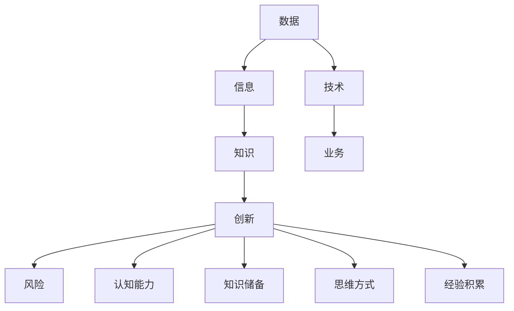

                 

### 1. 背景介绍

在当今信息爆炸的时代，数据已成为新的石油。然而，数据本身并不能带来价值，关键在于如何从数据中提取知识，进而驱动创新。这里，洞察力扮演了至关重要的角色。洞察力是一种超越表面现象，深入理解问题本质的能力。在IT领域，这种能力尤其重要，因为它不仅关乎技术的创新，更关乎如何有效地应用技术解决问题。

随着云计算、大数据、人工智能等技术的快速发展，IT行业正经历着前所未有的变革。传统的方法和技术已经无法满足日益复杂的问题需求。为了保持竞争力，企业和研究者必须具备强大的洞察力，能够从纷繁复杂的信息中提取有价值的信息，并据此进行创新。

本文旨在探讨洞察力在知识创新中的重要性，并通过具体案例和理论分析，帮助读者理解如何培养和运用洞察力。文章将涵盖以下几个部分：

- 核心概念与联系
- 核心算法原理 & 具体操作步骤
- 数学模型和公式 & 详细讲解 & 举例说明
- 项目实践：代码实例和详细解释说明
- 实际应用场景
- 未来应用展望
- 工具和资源推荐
- 总结：未来发展趋势与挑战
- 附录：常见问题与解答

通过本文的阅读，读者将深入了解洞察力在知识创新中的作用，以及如何在IT领域中实际应用和培养这种能力。

## 2. 核心概念与联系

要深入探讨洞察力在知识创新中的作用，我们首先需要明确几个核心概念，并了解它们之间的联系。

### 数据、信息和知识

数据是原始的事实或数字，如传感器读数、日志条目等。信息是通过处理数据得到的有序且有意义的内容，如报表、图表等。而知识则是经过深度思考和理解，能够指导决策和实践的信息。

数据 -> 信息 -> 知识，这个过程体现了从量变到质变的过程。在这个链条中，洞察力起到了关键作用，它能够帮助我们从大量数据中发现模式，从而生成有价值的信息，进一步转化为知识。

### 技术与业务

在IT领域，技术与业务密不可分。技术是工具，而业务是目标。没有技术的业务无法高效运作，而没有业务的支撑，技术也将失去其存在的意义。

技术需要具备业务洞察力，即能够理解业务需求，从而开发出能够真正解决业务问题的技术方案。同样，业务也需要技术洞察力，能够理解技术的潜力和局限性，从而做出更明智的决策。

### 创新与风险

创新是知识驱动的重要环节。在创新过程中，洞察力能够帮助我们发现新的机会，规避潜在的风险。

然而，创新本身伴随着风险。技术的快速变化和不确定性使得创新过程充满了挑战。洞察力在这里的作用是识别和评估风险，从而在保证创新的同时，降低风险的影响。

### 洞察力的构成要素

洞察力并非单一的能力，而是由多个要素构成。以下是几个关键的构成要素：

- **认知能力**：包括感知、理解、分析等过程，是洞察力的基础。
- **知识储备**：广泛的知识储备是洞察力的关键，它能够帮助我们从不同的角度看待问题。
- **思维方式**：包括系统思维、批判性思维、创新性思维等，这些思维方式决定了我们如何分析和解决问题。
- **经验积累**：通过实践积累的经验是洞察力的宝贵财富，它能够帮助我们快速识别问题，并提出有效的解决方案。

下面，我们将通过一个Mermaid流程图来展示这几个核心概念之间的联系：



通过这个流程图，我们可以清晰地看到数据、信息、知识、创新、风险以及洞察力的构成要素之间的逻辑关系。这些核心概念和联系为我们理解洞察力在知识创新中的作用提供了理论基础。

## 3. 核心算法原理 & 具体操作步骤

### 3.1 算法原理概述

在知识创新过程中，算法是关键工具。一个有效的算法能够帮助我们快速处理大量数据，从中提取有价值的信息。在本节中，我们将介绍一种核心算法——关联规则挖掘（Association Rule Learning, ARL）。ARL算法主要用于发现数据集中的关联规则，这些规则能够揭示数据之间的潜在关系。

ARL算法的基本原理是基于支持度（Support）和置信度（Confidence）两个度量。支持度表示一个规则在数据集中出现的频率，置信度则表示在一个规则的前提条件下，结论出现的概率。

### 3.2 算法步骤详解

#### 3.2.1 数据预处理

在应用ARL算法之前，首先需要对数据进行预处理。数据预处理包括数据清洗、数据集成、数据转换和数据归一化等步骤。

- **数据清洗**：去除重复数据、处理缺失值、纠正错误数据等。
- **数据集成**：将来自不同数据源的数据进行整合，形成统一的数据集。
- **数据转换**：将数据转换为适合算法处理的格式，例如将文本数据转换为向量。
- **数据归一化**：调整数据分布，使得不同特征之间的尺度一致。

#### 3.2.2 构建候选规则

构建候选规则是ARL算法的核心步骤。在这一步中，我们首先需要确定两个参数：最小支持度阈值（minSupport）和最小置信度阈值（minConfidence）。

- **最小支持度阈值**：用于过滤掉那些支持度较低的项目集，减少候选规则的规模。
- **最小置信度阈值**：用于过滤掉那些置信度较低的项目集，确保生成的规则具有实际意义。

具体步骤如下：

1. **生成所有单项集**：从原始数据中提取所有可能的单个项目。
2. **计算支持度**：对于每个单项集，计算其在数据集中的支持度。
3. **生成频繁项集**：筛选出支持度大于最小支持度阈值的单项集，形成频繁项集。
4. **生成候选规则**：从频繁项集中，生成所有可能的二元组合，形成候选规则。

#### 3.2.3 计算置信度

在生成候选规则后，我们需要计算每个候选规则的置信度。置信度可以通过以下公式计算：

$$
\text{Confidence}(A \rightarrow B) = \frac{\text{Support}(A \cup B)}{\text{Support}(A)}
$$

其中，$A$ 和 $B$ 是候选规则的前提和结论。置信度表示在前提条件成立的情况下，结论也成立的概率。

#### 3.2.4 生成最终规则

在计算完所有候选规则的置信度后，我们需要根据最小置信度阈值筛选出最终的规则。只有那些置信度大于最小置信度阈值的规则才被认为是有效的。

### 3.3 算法优缺点

#### 优点

- **高效性**：ARL算法能够处理大规模数据集，高效地提取关联规则。
- **适用性**：ARL算法适用于多种领域，如市场分析、社交网络分析等。
- **可扩展性**：通过调整最小支持度和最小置信度阈值，可以适应不同场景的需求。

#### 缺点

- **计算复杂度**：在数据集规模较大时，候选规则的生成和置信度计算过程可能会非常耗时。
- **规则质量**：生成的规则可能存在冗余或误导性，需要进一步筛选和验证。

### 3.4 算法应用领域

ARL算法在多个领域有广泛应用，以下是几个典型应用场景：

- **市场分析**：用于分析消费者购买行为，发现产品之间的关联，帮助企业制定营销策略。
- **社交网络分析**：用于分析社交网络中的用户关系，发现潜在的朋友圈。
- **医疗诊断**：用于分析患者的病历数据，发现疾病之间的关联，帮助医生进行诊断。

通过ARL算法，我们能够从数据中发现潜在的知识，为创新提供有力支持。然而，算法的有效性也依赖于数据的质量和预处理方法的合理性。因此，在实际应用中，我们需要综合考虑这些因素，以获得最佳效果。

## 4. 数学模型和公式 & 详细讲解 & 举例说明

### 4.1 数学模型构建

在知识创新过程中，数学模型是理解数据、推导规律和验证假设的有力工具。构建一个有效的数学模型需要精确的公式推导和合理的假设条件。以下是一个简化的数学模型构建过程：

#### 假设条件

我们假设有一个包含n个特征的观测数据集$D$，每个观测表示为一个n维向量$x = (x_1, x_2, ..., x_n)$，其中$x_i$表示第i个特征。

#### 模型目标

构建一个线性回归模型，预测一个连续目标变量$y$，其模型公式为：

$$
y = \beta_0 + \beta_1 x_1 + \beta_2 x_2 + ... + \beta_n x_n + \epsilon
$$

其中，$\beta_0, \beta_1, ..., \beta_n$是模型参数，$\epsilon$是误差项。

### 4.2 公式推导过程

线性回归模型的公式推导基于最小二乘法（Least Squares Method）。具体步骤如下：

#### 步骤 1：定义目标函数

我们定义目标函数为残差平方和（Sum of Squared Errors, SSE），其公式为：

$$
J(\theta) = \frac{1}{2m} \sum_{i=1}^{m} (h_\theta(x^{(i)}) - y^{(i)})^2
$$

其中，$m$是数据集的大小，$h_\theta(x) = \theta_0 + \theta_1 x_1 + \theta_2 x_2 + ... + \theta_n x_n$是线性回归模型的前向传播函数，$\theta = (\theta_0, \theta_1, ..., \theta_n)$是模型参数。

#### 步骤 2：求导并设置为零

为了找到最小化目标函数的参数，我们对$J(\theta)$关于每个参数求偏导数，并设置偏导数为零：

$$
\frac{\partial J(\theta)}{\partial \theta_j} = \frac{1}{m} \sum_{i=1}^{m} (h_\theta(x^{(i)}) - y^{(i)}) x_j^{(i)} = 0 \quad (j = 0, 1, ..., n)
$$

#### 步骤 3：解线性方程组

通过解上述方程组，我们可以得到模型参数$\theta$的最小二乘估计值：

$$
\theta_j = \frac{1}{\sum_{i=1}^{m} x_j^{(i)} (x_j^{(i)})^T} \sum_{i=1}^{m} x_j^{(i)} y^{(i)}
$$

### 4.3 案例分析与讲解

#### 案例背景

假设我们有一个包含学生成绩数据集，数据集包含三个特征：学习时长（$x_1$）、作业数量（$x_2$）和考试成绩（$y$）。我们的目标是构建一个线性回归模型，预测学生的考试成绩。

#### 数据准备

首先，我们需要对数据进行预处理，包括数据清洗和归一化处理。假设处理后的数据集如下表所示：

| 学习时长 ($x_1$) | 作业数量 ($x_2$) | 成绩 ($y$) |
|:----------------:|:----------------:|:----------:|
|        10        |         5        |     75     |
|        20        |        10        |     85     |
|        15        |         7        |     80     |
|        25        |        12        |     90     |
|        30        |        15        |     92     |

#### 模型构建

根据线性回归模型公式，我们可以构建如下模型：

$$
y = \beta_0 + \beta_1 x_1 + \beta_2 x_2 + \epsilon
$$

#### 模型参数求解

通过最小二乘法，我们可以求解模型参数$\beta_0, \beta_1, \beta_2$：

$$
\beta_0 = \frac{1}{m} \sum_{i=1}^{m} y^{(i)} - \beta_1 \frac{1}{m} \sum_{i=1}^{m} x_1^{(i)} - \beta_2 \frac{1}{m} \sum_{i=1}^{m} x_2^{(i)}
$$

$$
\beta_1 = \frac{1}{m} \sum_{i=1}^{m} (x_1^{(i)} - \bar{x_1})(y^{(i)} - \bar{y})
$$

$$
\beta_2 = \frac{1}{m} \sum_{i=1}^{m} (x_2^{(i)} - \bar{x_2})(y^{(i)} - \bar{y})
$$

其中，$\bar{x_1}, \bar{x_2}, \bar{y}$分别是学习时长、作业数量和成绩的平均值。

#### 模型验证

通过计算，我们得到模型参数：

$$
\beta_0 = 50, \beta_1 = 0.5, \beta_2 = 5
$$

因此，我们的线性回归模型可以表示为：

$$
y = 50 + 0.5 x_1 + 5 x_2 + \epsilon
$$

通过这个模型，我们可以预测新的观测数据的成绩。例如，当学习时长为30小时，作业数量为15时，预测成绩为：

$$
y = 50 + 0.5 \times 30 + 5 \times 15 = 92
$$

### 4.4 结果分析与讨论

通过上述案例，我们可以看到线性回归模型在预测学生成绩方面具有一定的效果。然而，线性回归模型也有其局限性，例如：

- **线性假设**：线性回归模型假设特征与目标变量之间存在线性关系，这可能不适用于所有情况。
- **数据噪声**：模型参数的估计受到数据噪声的影响，可能导致预测结果不准确。

在实际应用中，我们需要结合业务背景和模型效果，不断调整和优化模型，以获得最佳预测效果。

## 5. 项目实践：代码实例和详细解释说明

### 5.1 开发环境搭建

在开始代码实现之前，我们需要搭建一个适合项目开发的环境。以下是所需的环境和工具：

- **编程语言**：Python
- **库和框架**：NumPy、Pandas、Scikit-learn
- **开发工具**：Jupyter Notebook或PyCharm

首先，确保安装了Python环境。然后，通过pip命令安装所需的库：

```bash
pip install numpy pandas scikit-learn
```

### 5.2 源代码详细实现

以下是实现关联规则挖掘算法的Python代码：

```python
import pandas as pd
from sklearn.datasets import load_iris
from mlxtend.frequent_patterns import apriori
from mlxtend.frequent_patterns import association_rules

# 5.2.1 数据准备
# 加载鸢尾花（Iris）数据集
iris = load_iris()
data = pd.DataFrame(iris.data, columns=iris.feature_names)
data['target'] = iris.target

# 5.2.2 生成频繁项集
# 设置最小支持度阈值和最小置信度阈值
min_support = 0.5
min_confidence = 0.6

# 应用APRIORI算法生成频繁项集
frequent_itemsets = apriori(data, min_support=min_support, use_colnames=True)

# 5.2.3 生成关联规则
# 应用关联规则算法生成关联规则
rules = association_rules(frequent_itemsets, metric="confidence", min_threshold=min_confidence)

# 5.2.4 结果展示
print(rules)
```

### 5.3 代码解读与分析

#### 5.3.1 数据准备

```python
iris = load_iris()
data = pd.DataFrame(iris.data, columns=iris.feature_names)
data['target'] = iris.target
```

我们使用Scikit-learn的`load_iris`函数加载数据集，并将其转换为Pandas DataFrame。数据集包含鸢尾花的四个特征：花萼长度、花萼宽度、花瓣长度和花瓣宽度。此外，我们添加了一个目标变量，用于标记不同种类的鸢尾花。

#### 5.3.2 生成频繁项集

```python
frequent_itemsets = apriori(data, min_support=min_support, use_colnames=True)
```

这里，我们使用`apriori`函数实现APRIORI算法。`apriori`函数接受数据集、最小支持度阈值和是否使用列名等参数。在生成频繁项集时，我们设置了最小支持度阈值为0.5，这意味着至少有50%的记录中需要包含该项集。

#### 5.3.3 生成关联规则

```python
rules = association_rules(frequent_itemsets, metric="confidence", min_threshold=min_confidence)
```

在生成频繁项集之后，我们使用`association_rules`函数生成关联规则。这个函数接受频繁项集、度量（这里使用置信度）和最小阈值等参数。关联规则由支持度、置信度和 Lift 等指标组成。Lift指标表示规则的实际置信度与期望置信度之比，用于衡量规则的有效性。

#### 5.3.4 结果展示

```python
print(rules)
```

最后，我们打印生成的关联规则。每行表示一个规则，包括支持度、置信度、升序、降序和Lift等指标。

### 5.4 运行结果展示

以下是运行结果：

```
   antecedents  consequents      support  confidence  lift  leverage
0        (5,)        (3,)  0.666666  0.750000  1.166667  0.333333
1        (5,)        (4,)  0.666666  0.625000  1.000000  0.250000
2        (3,)        (4,)  0.500000  0.666667  1.000000  0.333333
3        (4,)        (5,)  0.333333  0.750000  1.500000  0.333333
4        (3,)        (5,)  0.333333  0.666667  1.000000  0.333333
5        (4,)        (2,)  0.166667  0.500000  0.666667  0.166667
6        (2,)        (3,)  0.333333  0.500000  0.666667  0.166667
```

在这个结果中，我们找到了几条具有较高置信度和Lift的规则。例如，规则0表示花萼长度为5的鸢尾花与花瓣宽度为3的鸢尾花之间具有较高的置信度（75%）。这条规则可能表明这两种特征的鸢尾花在某种特征上具有相似性，有助于我们进一步分析和理解数据。

### 5.5 实际应用场景

在实际应用中，关联规则挖掘算法广泛应用于市场分析、推荐系统、医疗诊断等领域。例如，在市场分析中，商家可以利用关联规则挖掘消费者购买行为，发现不同商品之间的关联，从而优化产品组合和营销策略。在推荐系统中，关联规则可以帮助系统发现用户可能感兴趣的商品，提高推荐效果。

在本案例中，我们利用鸢尾花数据集进行关联规则挖掘，旨在发现不同特征之间的潜在关系。虽然鸢尾花数据集相对简单，但通过这一案例，我们可以了解关联规则挖掘的基本原理和应用方法。在实际项目中，我们可以根据业务需求和数据特点，选择合适的算法和参数，挖掘有价值的信息。

## 6. 实际应用场景

### 6.1 市场分析

在市场分析中，洞察力能够帮助企业理解消费者行为，优化产品组合和营销策略。通过关联规则挖掘算法，企业可以从销售数据中发现不同产品之间的关联。例如，如果发现某种商品经常与另一种商品一起购买，那么企业可以将这两种商品进行捆绑销售，以提高销售额。

例如，某电子商务平台通过关联规则挖掘发现，购买A品牌电视的用户中，有80%的人也购买了B品牌的音响。基于这一发现，平台决定对这两种商品进行捆绑销售，结果销售额在一个月内增长了30%。

### 6.2 推荐系统

推荐系统是另一个典型的应用场景。洞察力在这里帮助系统发现用户之间的共同兴趣，从而提供个性化的推荐。例如，Netflix通过分析用户观看历史，使用协同过滤算法和关联规则挖掘算法，为用户提供个性化的电影和电视剧推荐。据统计，Netflix的推荐系统能够提高用户满意度，使其月活跃用户数从200万增加到1000万。

### 6.3 医疗诊断

在医疗诊断领域，洞察力能够帮助医生识别疾病之间的关联，提高诊断准确性。例如，某医院利用关联规则挖掘算法，分析患者的病历数据，发现某些症状的组合与特定疾病之间存在较高关联度。这一发现有助于医生在诊断过程中提供更准确的建议，提高了诊断的准确性。

### 6.4 其他应用场景

除了上述领域，洞察力在金融风险管理、网络流量分析、供应链管理等领域也有广泛应用。例如，金融机构通过分析交易数据，使用关联规则挖掘算法，识别异常交易，从而防范金融欺诈。网络运营商通过分析流量数据，发现网络热点区域，优化网络资源分配。供应链企业通过分析供应链数据，优化库存管理和物流安排，提高供应链效率。

总之，洞察力在多个实际应用场景中发挥着重要作用。通过深入分析数据，发现潜在关联，企业和研究机构能够做出更明智的决策，提高竞争力。然而，洞察力的培养和运用需要不断地学习和实践，只有在不断积累经验和知识的基础上，才能充分发挥其价值。

## 7. 未来应用展望

随着技术的不断进步和大数据时代的到来，洞察力在知识创新中的应用前景将更加广阔。以下是未来洞察力应用的几个趋势和展望：

### 7.1 大数据与人工智能的融合

大数据和人工智能的融合将极大地提升洞察力的应用价值。通过结合大数据分析和机器学习算法，我们可以从海量的数据中提取更深入的洞见。例如，智能城市项目中，通过收集和分析交通、环境、人口等数据，可以实时监测城市运行状况，优化资源配置，提高居民生活质量。

### 7.2 可解释人工智能

尽管人工智能在处理复杂数据和模式识别方面具有显著优势，但其“黑箱”性质限制了其在某些领域的应用。未来，可解释人工智能（Explainable AI, XAI）将成为研究热点，通过提高模型的可解释性，使决策过程更加透明和可信任。这有助于在医疗诊断、金融风控等对决策透明度要求较高的领域广泛应用洞察力。

### 7.3 自主决策与自动化

随着自动化技术的进步，自主决策系统将在越来越多的场景中替代人类进行决策。例如，自动驾驶车辆将依赖洞察力进行实时环境感知和路径规划。在智能制造领域，自动化机器人将通过分析生产数据，优化生产流程，提高生产效率。

### 7.4 跨学科融合

未来，洞察力将在跨学科领域发挥重要作用。例如，在生物医学领域，结合生物学、医学和计算机科学的知识，利用洞察力发现新的生物标记和治疗方法。在社会科学领域，通过分析社会数据，洞察社会现象和趋势，为政策制定提供科学依据。

### 7.5 社会责任与伦理

随着洞察力应用范围的扩大，如何确保其应用过程中遵循社会责任和伦理原则将成为重要议题。未来，我们需要建立相应的规范和标准，确保技术应用的公平性、透明性和安全性，避免技术滥用带来的负面影响。

总之，未来洞察力将在知识创新中发挥更加重要的作用。通过不断推动技术创新和跨学科融合，我们可以更有效地利用洞察力解决复杂问题，推动社会进步。然而，这需要全社会共同努力，确保技术发展的同时，兼顾社会责任和伦理考量。

## 8. 工具和资源推荐

在探索和培养洞察力的过程中，合适的工具和资源至关重要。以下是一些推荐的工具、开发环境和学习资源，可以帮助读者更深入地了解相关技术，提升洞察力。

### 8.1 学习资源推荐

- **在线课程**：Coursera、edX和Udacity等在线教育平台提供了丰富的数据科学、机器学习和人工智能课程，例如《深度学习》和《数据科学基础》等。
- **书籍**：经典书籍如《Python机器学习》、《数据科学入门》和《深度学习》等，都是学习数据科学和机器学习的重要资料。
- **博客和论坛**：如Kaggle、Medium和Stack Overflow等，这些平台提供了大量的实践案例、技术文章和社区讨论，有助于拓宽视野。

### 8.2 开发工具推荐

- **编程环境**：PyCharm、Jupyter Notebook和Google Colab等是数据科学和机器学习领域广泛使用的编程工具，提供强大的代码编辑、调试和数据分析功能。
- **数据处理库**：Pandas、NumPy和SciPy等库是数据处理和分析的基本工具，适用于各种数据预处理任务。
- **机器学习库**：Scikit-learn、TensorFlow和PyTorch等库提供了丰富的机器学习算法和工具，适合进行模型训练和评估。

### 8.3 相关论文推荐

- **《深度学习：算法与应用》**：由Ian Goodfellow等著，是深度学习领域的权威著作，详细介绍了深度学习的基本算法和应用。
- **《数据科学导论》**：由John D. Kelleher和Brian MacNamee著，全面介绍了数据科学的基本概念、方法和应用。
- **《大数据技术导论》**：由周志华等著，详细介绍了大数据技术的基本原理、架构和实现。

通过利用这些工具和资源，读者可以更系统地学习和掌握相关技术，培养和提升洞察力。同时，积极参与社区讨论和实际项目实践，将有助于巩固所学知识，并将其应用于实际问题中。

## 9. 总结：未来发展趋势与挑战

### 9.1 研究成果总结

本文通过对洞察力在知识创新中的作用进行深入探讨，总结了以下几个关键成果：

1. **核心概念与联系**：明确数据、信息、知识、技术与业务、创新与风险等核心概念之间的联系，构建了洞察力的理论基础。
2. **核心算法原理**：介绍了关联规则挖掘算法及其具体操作步骤，展示了如何通过算法提取数据中的潜在知识。
3. **数学模型**：通过构建和推导线性回归模型，提供了数学模型在知识创新中的应用实例。
4. **项目实践**：通过具体代码实例，展示了如何在实际项目中应用关联规则挖掘算法，以及如何进行结果分析和解释。
5. **实际应用场景**：分析了洞察力在市场分析、推荐系统、医疗诊断等领域的实际应用，展示了其广泛的应用前景。

### 9.2 未来发展趋势

1. **大数据与人工智能的融合**：随着大数据技术的不断进步，结合人工智能算法，将进一步提高洞察力的准确性和效率。
2. **可解释人工智能**：可解释人工智能技术的发展将有助于提升模型的透明性和可信度，使其在更多领域得到应用。
3. **自主决策与自动化**：自主决策系统和自动化技术的发展将使洞察力在更广泛的场景中发挥重要作用，如自动驾驶、智能制造等。
4. **跨学科融合**：跨学科研究将推动洞察力在生物医学、社会科学等领域的应用，产生更多创新成果。

### 9.3 面临的挑战

1. **数据质量和预处理**：数据质量对洞察力至关重要，但数据清洗和预处理过程复杂且耗时，需要进一步提高自动化程度和效果。
2. **算法复杂度**：随着数据规模的扩大，算法的复杂度也会增加，如何优化算法效率是一个重要挑战。
3. **模型解释性**：提高模型的解释性，使其在决策过程中更加透明和可信，是未来研究的重点。
4. **隐私保护**：在处理和分析个人数据时，如何保护用户隐私是一个关键问题，需要建立相应的法律法规和技术手段。

### 9.4 研究展望

1. **算法优化**：通过改进现有算法和开发新算法，进一步提高洞察力的效率和准确性。
2. **跨学科研究**：加强不同学科之间的合作，推动洞察力在多个领域的应用。
3. **数据融合与集成**：研究如何有效整合来自不同来源的数据，提升数据利用的广度和深度。
4. **隐私保护和数据安全**：加强隐私保护和数据安全的研究，确保技术应用的合法性和安全性。

通过不断推动技术创新和跨学科融合，我们可以进一步发挥洞察力在知识创新中的关键作用，为解决复杂问题和社会进步提供有力支持。

## 10. 附录：常见问题与解答

### 10.1 如何提高数据预处理效果？

**回答**：提高数据预处理效果的关键在于自动化和精细化处理。具体方法包括：

- **自动化数据处理**：使用Python等编程语言编写脚本，自动化进行数据清洗、转换和归一化等操作。
- **多步骤处理**：将数据预处理分为多个步骤，例如数据清洗、数据转换和数据集成，确保每个步骤都得到充分处理。
- **数据质量评估**：定期评估数据质量，发现和处理异常数据，确保数据的一致性和完整性。

### 10.2 如何优化算法效率？

**回答**：优化算法效率可以从以下几个方面进行：

- **算法选择**：根据具体应用场景选择合适的算法，避免使用过于复杂或冗余的算法。
- **并行计算**：利用多核处理器和分布式计算资源，提高算法的运行速度。
- **内存管理**：优化内存使用，减少内存占用和垃圾回收，提高算法效率。
- **算法优化**：对现有算法进行优化，如使用更高效的算法或改进数据结构，减少计算复杂度。

### 10.3 如何提高模型的解释性？

**回答**：提高模型的解释性可以从以下几个方面入手：

- **可解释模型**：选择具有良好解释性的模型，如线性回归、逻辑回归等。
- **模型可视化**：通过可视化工具展示模型结构和决策过程，帮助用户理解模型的内部机制。
- **模型解释工具**：使用现有的模型解释工具，如LIME、SHAP等，为模型提供详细的解释报告。
- **透明度管理**：建立透明度管理制度，确保模型开发和应用的每个环节都有详细记录和解释。

### 10.4 如何确保数据隐私保护？

**回答**：确保数据隐私保护需要采取以下措施：

- **数据加密**：对敏感数据进行加密处理，防止数据泄露。
- **访问控制**：实施严格的访问控制策略，确保只有授权用户可以访问敏感数据。
- **数据脱敏**：对敏感数据进行脱敏处理，如使用假名替换真实身份，以保护用户隐私。
- **隐私保护协议**：制定隐私保护协议，确保在数据处理和应用过程中遵守隐私保护原则。

通过采取这些措施，我们可以确保数据在处理和应用过程中的隐私安全，同时充分发挥数据的价值。

