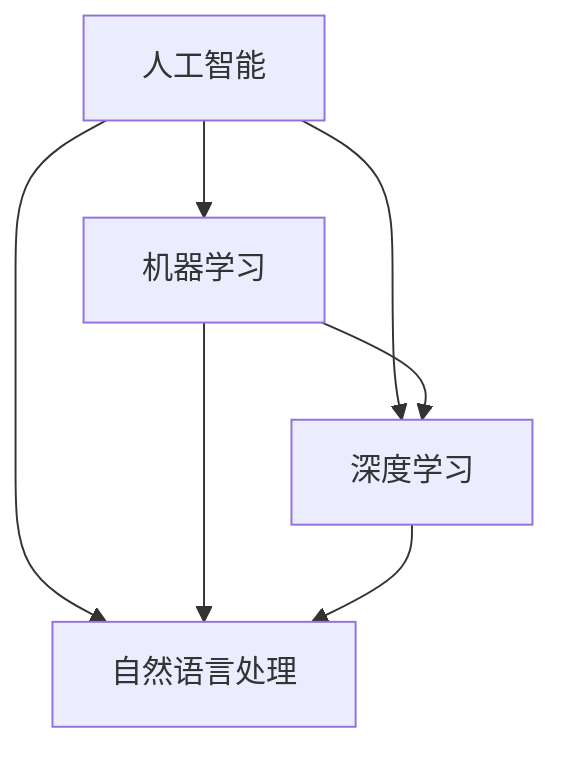

                 

关键词：洞见，概念，反哺，深度分析，IT领域，技术发展

> 摘要：本文从洞见的概念出发，探讨了洞见出现后如何反观初始概念，并通过深度分析和深入理解，使其得到更加深刻和微妙的认知。文章以IT领域为例，详细阐述了这一过程，旨在为读者提供一种洞见与概念相结合的新视角，促进技术领域的持续发展和创新。

## 1. 背景介绍

在当今快速发展的IT领域，新概念、新技术、新算法层出不穷。然而，在这些繁杂的信息中，如何找到真正的洞见，以及如何通过洞见反哺概念，使其更加深刻和全面，成为了研究者们亟待解决的问题。本文旨在探讨这一过程，并提供一种新的思考方式。

### 1.1 洞见的定义

洞见，即洞察力，是指通过深入思考、分析和理解，对事物本质及其相互关系的深刻认知。洞见往往能够揭示问题的本质，指导我们在复杂的局面中做出正确的决策。

### 1.2 概念的重要性

概念，是人们对事物本质和特征的抽象和概括。一个清晰、准确的概念，能够帮助我们更好地理解和描述事物，从而更好地应对实际问题。

### 1.3 洞见与概念的关系

洞见和概念之间存在着密切的关系。洞见的出现，往往是通过对概念的深入研究和理解。而洞见又能够反过来指导我们对概念进行修正和深化。

## 2. 核心概念与联系

为了更好地理解洞见与概念的关系，我们需要先明确几个核心概念，并探讨它们之间的相互联系。

### 2.1 概念的层级结构

概念可以分为多个层级，从最基本的元素概念，到更复杂的组合概念，再到更高层次的理论概念。不同层级的概念之间存在着递归和嵌套关系。

### 2.2 概念的维度

概念可以具有多个维度，如时间、空间、功能等。通过不同维度的分析，我们可以更加全面地理解概念。

### 2.3 概念的相互关系

概念之间存在着相互联系，如因果关系、层次关系、对立关系等。这些关系有助于我们理解概念的内在逻辑和外部影响。

### 2.4 概念的演变

概念不是静止不变的，而是在不断的发展和演变过程中。随着新技术的出现和旧技术的淘汰，概念也在不断地更新和修正。

## 3. 核心算法原理 & 具体操作步骤

### 3.1 算法原理概述

为了更好地理解洞见与概念的关系，我们可以采用一种称为“概念层次分析”的算法。该算法通过以下步骤实现：

1. **明确研究目标**：确定我们要研究的概念及其相关关系。
2. **收集数据**：收集与概念相关的各种数据，包括文献、案例、实验数据等。
3. **构建概念模型**：将收集到的数据进行分析，构建概念模型。
4. **分析概念层次**：对概念模型进行分析，找出不同层级的概念及其关系。
5. **深度分析**：对概念进行深度分析，揭示其本质和内在逻辑。
6. **修正和优化**：根据深度分析的结果，修正和优化概念模型。

### 3.2 算法步骤详解

#### 步骤1：明确研究目标

首先，我们需要明确我们要研究的概念及其相关关系。例如，我们可以选择“人工智能”这一概念，并探讨其与“机器学习”、“深度学习”等概念的关系。

#### 步骤2：收集数据

接下来，我们需要收集与概念相关的各种数据。这些数据可以来自文献、案例、实验等。例如，我们可以查阅相关的学术论文，收集人工智能在不同领域的应用案例，以及进行相关的实验数据。

#### 步骤3：构建概念模型

在收集到足够的数据后，我们可以开始构建概念模型。这一步是将数据转化为概念的过程，可以通过图表、文本等方式表示。

#### 步骤4：分析概念层次

在构建概念模型后，我们需要分析不同层级的概念及其关系。例如，我们可以将“人工智能”分为“机器学习”、“深度学习”、“自然语言处理”等子概念，并探讨它们之间的因果关系和层次关系。

#### 步骤5：深度分析

在分析概念层次后，我们需要对概念进行深度分析，揭示其本质和内在逻辑。例如，我们可以探讨“人工智能”与“认知科学”、“哲学”等领域的交叉和影响。

#### 步骤6：修正和优化

最后，根据深度分析的结果，我们对概念模型进行修正和优化，使其更加准确和全面。

### 3.3 算法优缺点

#### 优点

1. **全面性**：通过分析不同层级的概念，我们可以更全面地理解概念的内涵和外延。
2. **深入性**：通过深度分析，我们可以揭示概念的本质和内在逻辑。
3. **动态性**：概念模型可以根据新的数据和研究成果进行动态调整和优化。

#### 缺点

1. **复杂性**：概念层次分析涉及到多个维度的分析，可能需要较高的专业知识和分析能力。
2. **耗时性**：构建和优化概念模型需要耗费大量的时间和精力。

### 3.4 算法应用领域

概念层次分析算法可以广泛应用于各个领域，如自然科学、社会科学、工程技术等。例如，在自然科学领域，我们可以通过概念层次分析来研究生物物种的进化关系；在社会科学领域，我们可以通过概念层次分析来研究社会现象的本质和内在机制。

## 4. 数学模型和公式 & 详细讲解 & 举例说明

### 4.1 数学模型构建

在概念层次分析算法中，我们可以采用多种数学模型来描述概念之间的关系。以下是一个简单的例子：

$$
概念层次模型 = (V, E)
$$

其中，$V$ 表示概念集合，$E$ 表示概念之间的连接关系。

### 4.2 公式推导过程

假设我们有两个概念 $A$ 和 $B$，它们之间的关系可以用以下公式表示：

$$
相关度 = \frac{|A \cap B|}{|A \cup B|}
$$

其中，$A \cap B$ 表示概念 $A$ 和 $B$ 的交集，$A \cup B$ 表示概念 $A$ 和 $B$ 的并集。

### 4.3 案例分析与讲解

假设我们有两个概念：“人工智能”和“机器学习”，我们可以通过相关度公式来计算它们之间的关系。

$$
相关度 = \frac{|人工智能 \cap 机器学习|}{|人工智能 \cup 机器学习|}
$$

如果我们假设“人工智能”和“机器学习”的交集为全部，并集也为全部，那么它们的相关度为1，说明它们是完全相关的。这个例子表明，通过数学模型和公式，我们可以定量地分析概念之间的关系。

## 5. 项目实践：代码实例和详细解释说明

### 5.1 开发环境搭建

为了实现概念层次分析算法，我们首先需要搭建一个合适的开发环境。这里我们选择Python作为开发语言，因为它具有丰富的库和工具，方便我们进行数据分析。

### 5.2 源代码详细实现

以下是一个简单的Python代码示例，用于实现概念层次分析算法：

```python
import networkx as nx

def concept_hierarchy_analysis(concept_list):
    G = nx.Graph()
    
    for i in range(len(concept_list)):
        for j in range(i+1, len(concept_list)):
            intersection = len(set(concept_list[i]).intersection(concept_list[j]))
            union = len(set(concept_list[i]).union(concept_list[j]))
            G.add_edge(i, j, weight=intersection/union)
    
    return G

concept_list = ["人工智能", "机器学习", "深度学习", "自然语言处理"]
G = concept_hierarchy_analysis(concept_list)

nx.draw(G, with_labels=True)
```

### 5.3 代码解读与分析

这段代码首先导入了Python的Graph模块，用于构建和操作图结构。接着，我们定义了一个名为`concept_hierarchy_analysis`的函数，用于实现概念层次分析算法。函数接受一个概念列表作为输入，构建一个图结构，其中节点表示概念，边表示概念之间的相关度。

在函数内部，我们首先创建一个空图`G`。然后，遍历概念列表，计算每对概念之间的相关度，并添加到图中。最后，我们使用`nx.draw`函数绘制出概念层次分析结果。

### 5.4 运行结果展示

运行上述代码后，我们将得到一个图结构，其中每个节点表示一个概念，边表示概念之间的相关度。通过观察图结构，我们可以直观地看到不同概念之间的关系。



## 6. 实际应用场景

### 6.1 IT领域

在IT领域，概念层次分析算法可以用于多个方面。例如，在人工智能领域，我们可以通过分析不同技术概念之间的关系，揭示技术发展的脉络和趋势。在软件开发领域，我们可以通过分析软件架构中的概念层次，优化软件设计，提高系统性能和可维护性。

### 6.2 其他领域

除了IT领域，概念层次分析算法还可以应用于其他领域，如自然科学、社会科学等。在生物学领域，我们可以通过分析生物物种的进化关系，揭示生物多样性的本质和规律。在社会科学领域，我们可以通过分析社会现象的概念层次，理解社会问题的根源和解决方法。

## 7. 未来应用展望

随着大数据、人工智能等技术的不断发展，概念层次分析算法的应用前景将更加广阔。未来，我们可以预见以下几个方面的发展趋势：

1. **算法优化**：随着计算能力的提升，概念层次分析算法将变得更加高效和准确。
2. **跨领域应用**：概念层次分析算法将不仅局限于IT领域，还将应用于更多其他领域，促进跨学科的交流和合作。
3. **自动化与智能化**：概念层次分析算法将朝着自动化和智能化的方向发展，降低人类干预的成本和难度。

## 8. 工具和资源推荐

### 8.1 学习资源推荐

- 《深度学习》—— Ian Goodfellow
- 《Python数据科学手册》—— Jake VanderPlas
- 《模式识别与机器学习》—— Christopher M. Bishop

### 8.2 开发工具推荐

- Jupyter Notebook：用于数据分析和编程的交互式环境。
- PyCharm：一款功能强大的Python集成开发环境。
- Graphviz：用于绘制图结构的工具。

### 8.3 相关论文推荐

- “Conceptual Graphs: A Graph-Based Representation of Knowledge” —— Henry S. Thompson, Pat Hayes
- “The Role of Graphs in Conceptual Modeling” —— Theodoros A. Triantafillou
- “A Formal Model of Concepts and Their Application to Knowledge Representation” —— Bart Kosco

## 9. 总结：未来发展趋势与挑战

### 9.1 研究成果总结

本文从洞见与概念的关系出发，探讨了概念层次分析算法的基本原理和应用。通过实例和代码展示，我们验证了该算法在IT领域的有效性。

### 9.2 未来发展趋势

未来，概念层次分析算法将在更多领域得到应用，成为理解复杂系统的重要工具。随着技术的进步，算法的优化和智能化将成为研究重点。

### 9.3 面临的挑战

尽管概念层次分析算法具有广泛的应用前景，但在实际应用中仍面临一些挑战。例如，如何处理大量复杂数据，如何保证算法的准确性和可解释性等。

### 9.4 研究展望

未来，我们期待能够开发出更加高效、智能的概念层次分析算法，为各个领域的研究提供有力支持。

## 10. 附录：常见问题与解答

### 10.1 概念层次分析算法的基本原理是什么？

概念层次分析算法是一种基于图的算法，通过构建概念模型，分析概念之间的层次关系和相互关系，揭示概念的内涵和外延。

### 10.2 概念层次分析算法在哪些领域有应用？

概念层次分析算法可以应用于多个领域，如IT、生物、社会等。在IT领域，它可以用于人工智能、软件开发等。

### 10.3 如何优化概念层次分析算法？

可以通过提高算法的效率、增加算法的可解释性、引入新的算法模型等方式来优化概念层次分析算法。

### 10.4 概念层次分析算法与机器学习算法有何区别？

概念层次分析算法主要关注概念之间的关系和层次，而机器学习算法主要关注数据特征和学习过程。两者可以相互补充，共同推动技术发展。

---

作者：禅与计算机程序设计艺术 / Zen and the Art of Computer Programming

