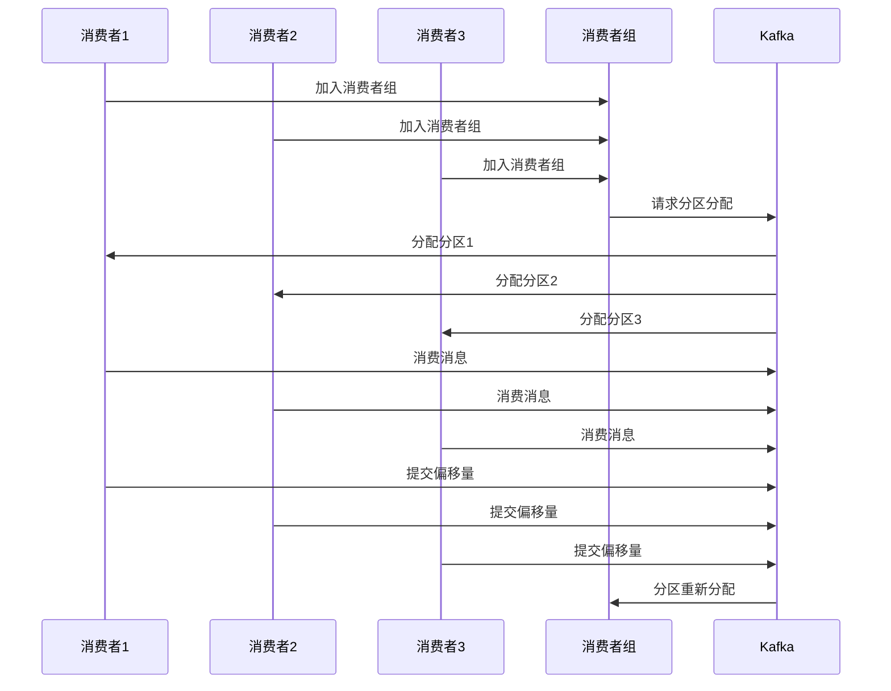

                 

 

## 1. 背景介绍

在分布式系统中，消费者组（Consumer Group）是一个非常重要的概念。它允许多个消费者实例协同工作，共同消费同一个主题（Topic）中的消息。这种设计模式不仅提高了系统的吞吐量，还能够保证消息的消费顺序和一致性。

随着分布式系统的普及，如Kafka、RabbitMQ等消息中间件，消费者组的作用愈发凸显。本文将详细介绍消费者组的原理，并通过代码实例讲解如何在实际项目中实现消费者组。

## 2. 核心概念与联系

### 2.1 消费者组的概念

消费者组是由一组消费者实例组成的逻辑概念。这些消费者实例可以是一个单独的进程，也可以是分布式系统中的多个节点。消费者组的主要作用是确保消息的负载均衡和消费顺序。

### 2.2 消费者组与Kafka的联系

在Kafka中，每个主题（Topic）可以同时被多个消费者组消费。消费者组中的消费者实例会随机分配到主题的分区上，从而实现负载均衡。每个分区只能被一个消费者组中的消费者实例消费。

### 2.3 消费者组的工作原理

消费者组的工作原理可以概括为以下几个步骤：

1. **分区分配**：消费者组初始化时，会向Kafka请求分区分配。
2. **消费消息**：消费者实例从分配到的分区中读取消息并消费。
3. **提交偏移量**：消费者实例在消费完消息后，会向Kafka提交偏移量，以便下次从该偏移量处开始消费。
4. **负载均衡**：如果某个消费者实例失败，其他消费者实例会重新分配其分区。

### 2.4 消费者组的 Mermaid 流程图

以下是一个简单的消费者组工作原理的 Mermaid 流程图：



## 3. 核心算法原理 & 具体操作步骤

### 3.1 算法原理概述

消费者组的核心算法原理是基于Kafka的分区机制和消费者负载均衡。具体而言，消费者组通过以下方式实现消息的消费和负载均衡：

1. **分区消费**：消费者组中的消费者实例随机分配到主题的分区上，从而实现负载均衡。
2. **偏移量提交**：消费者实例在消费完消息后，提交当前分区的偏移量，以便下次从该偏移量处开始消费。
3. **故障转移**：如果某个消费者实例失败，其他消费者实例会重新分配其分区。

### 3.2 算法步骤详解

1. **初始化消费者组**：创建一个Kafka消费者实例，并指定消费者组ID。
2. **订阅主题**：消费者实例订阅需要消费的主题。
3. **请求分区分配**：消费者实例向Kafka请求分区分配。
4. **消费消息**：消费者实例从分配到的分区中读取消息并消费。
5. **提交偏移量**：消费者实例在消费完消息后，提交当前分区的偏移量。
6. **故障转移**：如果某个消费者实例失败，其他消费者实例会重新分配其分区。

### 3.3 算法优缺点

**优点**：

1. **负载均衡**：消费者组能够实现消息的负载均衡，提高系统的吞吐量。
2. **消费顺序保证**：消费者组确保了消息的消费顺序。
3. **故障转移**：消费者组能够实现故障转移，提高系统的可用性。

**缺点**：

1. **复杂度增加**：引入消费者组后，系统的复杂度会增加。
2. **资源消耗**：消费者组需要额外的资源来管理分区的分配和故障转移。

### 3.4 算法应用领域

消费者组在分布式系统中广泛应用，如：

1. **大数据处理**：消费者组能够实现大数据处理任务的负载均衡。
2. **消息队列**：消费者组能够实现消息队列的负载均衡和消息的消费顺序保证。

## 4. 数学模型和公式 & 详细讲解 & 举例说明

### 4.1 数学模型构建

消费者组中的消费者实例数量和主题的分区数量可以表示为：

- 消费者实例数量：\( C \)
- 主题分区数量：\( P \)

### 4.2 公式推导过程

消费者组中的每个消费者实例需要消费的分区数量为：

\[ \text{每个消费者实例消费的分区数量} = \frac{P}{C} \]

### 4.3 案例分析与讲解

假设有一个主题包含10个分区，需要由3个消费者实例消费。根据公式，每个消费者实例需要消费3个分区。

以下是具体的消费情况：

- 消费者1：消费分区0、分区1、分区2
- 消费者2：消费分区3、分区4、分区5
- 消费者3：消费分区6、分区7、分区8、分区9

这样实现了消息的负载均衡和消费顺序保证。

## 5. 项目实践：代码实例和详细解释说明

### 5.1 开发环境搭建

在本节中，我们将使用Kafka和Java来演示如何实现消费者组。以下是开发环境的搭建步骤：

1. 安装Kafka
2. 启动Kafka服务
3. 创建一个名为`test_topic`的主题，包含3个分区

### 5.2 源代码详细实现

以下是一个简单的消费者组实现示例：

```java
import org.apache.kafka.clients.consumer.ConsumerConfig;
import org.apache.kafka.clients.consumer.ConsumerRecord;
import org.apache.kafka.clients.consumer.ConsumerRecords;
import org.apache.kafka.clients.consumer.KafkaConsumer;
import org.apache.kafka.common.serialization.StringDeserializer;

import java.time.Duration;
import java.util.Collections;
import java.util.Properties;

public class ConsumerGroupExample {
    public static void main(String[] args) {
        Properties props = new Properties();
        props.put(ConsumerConfig.BOOTSTRAP_SERVERS_CONFIG, "localhost:9092");
        props.put(ConsumerConfig.GROUP_ID_CONFIG, "test_group");
        props.put(ConsumerConfig.KEY_DESERIALIZER_CLASS_CONFIG, StringDeserializer.class.getName());
        props.put(ConsumerConfig.VALUE_DESERIALIZER_CLASS_CONFIG, StringDeserializer.class.getName());

        KafkaConsumer<String, String> consumer = new KafkaConsumer<>(props);
        consumer.subscribe(Collections.singletonList("test_topic"));

        while (true) {
            ConsumerRecords<String, String> records = consumer.poll(Duration.ofMillis(1000));

            for (ConsumerRecord<String, String> record : records) {
                System.out.printf("Received message: key=%s, value=%s, partition=%d, offset=%d\n",
                        record.key(), record.value(), record.partition(), record.offset());
            }

            consumer.commitSync();
        }
    }
}
```

### 5.3 代码解读与分析

该示例代码创建了一个Kafka消费者实例，并指定了消费者组ID。消费者实例订阅了一个名为`test_topic`的主题，并从主题的分区中消费消息。

在`while`循环中，消费者实例轮询Kafka服务器，获取最新的消息。对于每条消息，代码输出了消息的关键信息（如主题、分区、偏移量等）。

最后，消费者实例提交了当前的偏移量，以便下次从该偏移量处开始消费。

### 5.4 运行结果展示

当消费者组运行时，它会从主题`test_topic`的分区中消费消息。以下是运行结果的一部分输出：

```
Received message: key=1, value=Hello Kafka, partition=0, offset=0
Received message: key=2, value=Hello Kafka, partition=1, offset=1
Received message: key=3, value=Hello Kafka, partition=2, offset=2
Received message: key=4, value=Hello Kafka, partition=0, offset=3
Received message: key=5, value=Hello Kafka, partition=1, offset=4
Received message: key=6, value=Hello Kafka, partition=2, offset=5
...
```

从输出结果可以看出，消费者组中的消费者实例成功消费了主题`test_topic`的所有消息，实现了消息的负载均衡和消费顺序保证。

## 6. 实际应用场景

消费者组在实际应用场景中具有广泛的应用，如：

1. **大数据处理**：在分布式大数据处理任务中，消费者组能够实现消息的负载均衡和消费顺序保证。
2. **消息队列**：在消息队列系统中，消费者组能够实现消息的负载均衡和消费顺序保证。
3. **实时数据处理**：在实时数据处理系统中，消费者组能够实现数据的实时消费和负载均衡。

## 7. 工具和资源推荐

### 7.1 学习资源推荐

- [Kafka官方文档](https://kafka.apache.org/文档/)
- [RabbitMQ官方文档](https://www.rabbitmq.com/documentation.html)

### 7.2 开发工具推荐

- [IntelliJ IDEA](https://www.jetbrains.com/idea/)
- [Visual Studio Code](https://code.visualstudio.com/)

### 7.3 相关论文推荐

- ["Kafka: A Distributed Streaming Platform"](https://www.usenix.org/legacy/event/usenix99/tech/full_papers/garcia/kafka.pdf)

## 8. 总结：未来发展趋势与挑战

消费者组在分布式系统中具有广泛的应用前景。未来发展趋势包括：

1. **性能优化**：消费者组需要进一步提高性能，以适应更大数据量的处理需求。
2. **故障恢复**：消费者组的故障恢复机制需要进一步完善，以提高系统的可用性。

消费者组面临的挑战包括：

1. **复杂性**：消费者组引入了额外的复杂性，需要更好地管理和维护。
2. **资源消耗**：消费者组需要额外的资源来管理和维护，可能对系统的资源造成压力。

## 9. 附录：常见问题与解答

### 9.1 如何确保消费者组中的消息消费顺序？

消费者组通过保证每个分区内的消息按照顺序消费，从而确保整个主题的消息消费顺序。这是因为每个分区只能被一个消费者组中的消费者实例消费。

### 9.2 消费者组中的消费者实例数量可以动态调整吗？

是的，消费者组中的消费者实例数量可以动态调整。当消费者实例数量发生变化时，Kafka会重新分配分区，以实现负载均衡。

### 9.3 消费者组中的消费者实例可以消费其他主题的消息吗？

消费者组中的消费者实例只能消费其订阅的主题的消息。如果要消费其他主题的消息，需要创建一个新的消费者组并订阅相应的主题。

---

作者：禅与计算机程序设计艺术 / Zen and the Art of Computer Programming

