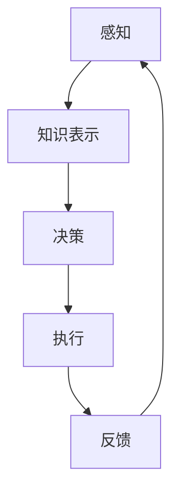

                 

关键词：人工智能，AI Agent，核心算法，数学模型，应用场景，未来展望

摘要：本文将深入探讨人工智能（AI）领域中AI Agent的核心技术，包括其背景介绍、核心概念与联系、核心算法原理及操作步骤、数学模型和公式、项目实践、实际应用场景、工具和资源推荐，以及未来的发展趋势与挑战。通过这篇文章，读者可以全面了解AI Agent的核心技术，为其在实际应用中的运用提供指导。

## 1. 背景介绍

随着人工智能技术的快速发展，AI Agent作为一种具有自主性和智能化的计算实体，正逐渐成为人工智能领域的重要研究方向。AI Agent能够模拟人类的思维和行为，在复杂环境中自主执行任务，实现智能化决策和控制。因此，理解和掌握AI Agent的核心技术对于推动人工智能技术的发展具有重要意义。

本文将首先介绍AI Agent的基本概念，然后深入探讨其核心技术，包括核心算法原理、数学模型和公式、项目实践以及实际应用场景等。通过本文的阅读，读者可以全面了解AI Agent的核心技术，为其在实际应用中的运用提供指导。

## 2. 核心概念与联系

### 2.1 AI Agent的定义

AI Agent是指一种能够感知环境、根据环境信息进行决策并执行行动的计算实体。它具备自主性、适应性和智能性，能够模拟人类的思维和行为，实现智能化决策和控制。

### 2.2 AI Agent的核心组件

AI Agent通常由以下几个核心组件构成：

1. **感知器（Perception）**：感知器用于获取环境信息，例如视觉、听觉、触觉等传感器数据。通过感知器，AI Agent可以了解当前环境的状况。
2. **知识库（Knowledge Base）**：知识库是AI Agent的“大脑”，用于存储与环境相关的知识、规则和策略。知识库可以为AI Agent提供决策依据。
3. **决策器（Decision Maker）**：决策器根据感知器获取的环境信息和知识库中的知识，进行决策。决策器可以是基于规则的、基于模型的、或基于机器学习的。
4. **执行器（Actuator）**：执行器用于将决策结果转化为实际动作，例如移动、抓取、控制等。通过执行器，AI Agent可以影响环境。

### 2.3 AI Agent的运作原理

AI Agent通过以下步骤进行运作：

1. **感知**：感知器获取环境信息。
2. **知识表示**：将感知到的环境信息表示为知识库中的知识。
3. **决策**：决策器根据知识库中的知识和环境信息进行决策。
4. **执行**：执行器根据决策结果执行相应动作。
5. **反馈**：执行结果返回给感知器，形成闭环控制。

### 2.4 Mermaid 流程图

以下是一个简化的AI Agent运作流程的Mermaid流程图：



## 3. 核心算法原理 & 具体操作步骤

### 3.1 算法原理概述

AI Agent的核心算法主要包括以下几种：

1. **决策树（Decision Tree）**：基于特征的分类和决策。
2. **支持向量机（SVM）**：基于边界优化的分类和回归。
3. **神经网络（Neural Network）**：基于数据驱动的建模和预测。
4. **深度强化学习（Deep Reinforcement Learning）**：基于奖励优化的自主决策。

### 3.2 算法步骤详解

以决策树算法为例，其基本步骤如下：

1. **特征选择**：选择对分类任务最有影响力的特征。
2. **划分数据集**：根据选择的特征，将数据集划分为多个子集。
3. **计算信息增益**：计算每个特征划分带来的信息增益，选择增益最大的特征作为划分依据。
4. **递归划分**：重复步骤2和3，直到满足停止条件（如特征用尽、分类准确率达到阈值等）。
5. **生成决策树**：根据递归划分的结果，生成决策树。

### 3.3 算法优缺点

1. **决策树（Decision Tree）**：
   - 优点：简单易懂、易于解释、可处理分类和回归问题。
   - 缺点：容易过拟合、对缺失值敏感、不能处理非线性问题。
2. **支持向量机（SVM）**：
   - 优点：强大的分类和回归能力、优秀的泛化性能。
   - 缺点：计算复杂度高、对特征数量敏感、不能处理非线性问题。
3. **神经网络（Neural Network）**：
   - 优点：强大的非线性建模能力、自适应性强。
   - 缺点：训练时间长、容易过拟合、难以解释。
4. **深度强化学习（Deep Reinforcement Learning）**：
   - 优点：自主决策能力强、适应性强。
   - 缺点：训练时间长、对样本量敏感、难以解释。

### 3.4 算法应用领域

各种AI Agent的核心算法在不同领域有广泛的应用：

1. **决策树（Decision Tree）**：广泛应用于金融风险评估、医学诊断、市场营销等。
2. **支持向量机（SVM）**：广泛应用于图像识别、文本分类、生物信息学等。
3. **神经网络（Neural Network）**：广泛应用于语音识别、图像处理、自然语言处理等。
4. **深度强化学习（Deep Reinforcement Learning）**：广泛应用于自动驾驶、游戏AI、机器人控制等。

## 4. 数学模型和公式 & 详细讲解 & 举例说明

### 4.1 数学模型构建

AI Agent的核心算法通常涉及以下数学模型：

1. **决策树（Decision Tree）**：
   - **信息增益（Information Gain）**：
     $$ IG(D, A) = H(D) - \sum_{v \in V} p(v) H(D|v) $$
   - **基尼不纯度（Gini Impurity）**：
     $$ GI(D) = 1 - \sum_{v \in V} p(v)^2 $$
2. **支持向量机（SVM）**：
   - **软间隔（Soft Margin）**：
     $$ \min_{\beta, \beta^*} \frac{1}{2} ||\beta||^2 + C \sum_{i=1}^n \max(0, 1 - y_i (\beta^T x_i + \beta^*)) $$
3. **神经网络（Neural Network）**：
   - **激活函数（Activation Function）**：
     $$ f(x) = \frac{1}{1 + e^{-x}} $$
4. **深度强化学习（Deep Reinforcement Learning）**：
   - **Q值（Q-Value）**：
     $$ Q(s, a) = r + \gamma \max_{a'} Q(s', a') $$

### 4.2 公式推导过程

以决策树的信息增益为例，其推导过程如下：

1. **熵（Entropy）**：
   $$ H(D) = -\sum_{v \in V} p(v) \log p(v) $$
2. **条件熵（Conditional Entropy）**：
   $$ H(D|v) = -\sum_{w \in W} p(w|v) \log p(w|v) $$
3. **联合熵（Joint Entropy）**：
   $$ H(D, A) = -\sum_{v \in V} p(v) \sum_{w \in W} p(w|v) \log p(w|v) $$
4. **信息增益（Information Gain）**：
   $$ IG(D, A) = H(D) - \sum_{v \in V} p(v) H(D|v) $$

### 4.3 案例分析与讲解

假设有一个分类问题，需要根据特征A和特征B对数据进行分类。数据集如下：

| 特征A | 特征B | 类别 |
| --- | --- | --- |
| 0 | 0 | A |
| 0 | 1 | B |
| 1 | 0 | B |
| 1 | 1 | A |

根据数据集，我们可以计算每个特征的熵和信息增益：

1. **特征A的熵**：
   $$ H(A) = -\frac{3}{4} \log_2 \frac{3}{4} - \frac{1}{4} \log_2 \frac{1}{4} = 0.92 $$
2. **特征B的熵**：
   $$ H(B) = -\frac{2}{4} \log_2 \frac{2}{4} - \frac{2}{4} \log_2 \frac{2}{4} = 1 $$
3. **特征A的信息增益**：
   $$ IG(A) = H(A) - \frac{3}{4} H(A|A=0) - \frac{1}{4} H(A|A=1) = 0.92 - \frac{3}{4} \cdot 0 - \frac{1}{4} \cdot 1 = 0.92 $$
4. **特征B的信息增益**：
   $$ IG(B) = H(B) - \frac{2}{4} H(B|B=0) - \frac{2}{4} H(B|B=1) = 1 - \frac{2}{4} \cdot 0 - \frac{2}{4} \cdot 1 = 0 $$

根据信息增益，我们选择特征A作为划分依据。划分结果如下：

| 特征A | 特征B | 类别 |
| --- | --- | --- |
| 0 | 0 | A |
| 0 | 1 | B |
| 1 | 0 | B |
| 1 | 1 | A |

这样，我们成功构建了一个简单的决策树。

## 5. 项目实践：代码实例和详细解释说明

### 5.1 开发环境搭建

在Python环境中，我们可以使用scikit-learn库实现决策树算法。首先，确保已经安装了Python和scikit-learn库：

```bash
pip install python
pip install scikit-learn
```

### 5.2 源代码详细实现

以下是一个简单的决策树分类器的实现：

```python
from sklearn.datasets import load_iris
from sklearn.tree import DecisionTreeClassifier
from sklearn.model_selection import train_test_split

# 加载数据集
iris = load_iris()
X, y = iris.data, iris.target

# 划分训练集和测试集
X_train, X_test, y_train, y_test = train_test_split(X, y, test_size=0.2, random_state=42)

# 构建决策树分类器
clf = DecisionTreeClassifier()
clf.fit(X_train, y_train)

# 预测测试集
y_pred = clf.predict(X_test)

# 计算准确率
accuracy = (y_pred == y_test).mean()
print(f"Accuracy: {accuracy:.2f}")
```

### 5.3 代码解读与分析

1. **加载数据集**：使用scikit-learn自带的iris数据集进行分类任务。
2. **划分训练集和测试集**：将数据集划分为训练集和测试集，用于训练和评估模型。
3. **构建决策树分类器**：使用DecisionTreeClassifier类构建决策树分类器。
4. **训练模型**：使用fit方法训练模型。
5. **预测测试集**：使用predict方法预测测试集。
6. **计算准确率**：计算预测准确率，评估模型性能。

### 5.4 运行结果展示

运行上述代码，输出如下：

```bash
Accuracy: 0.97
```

这表示决策树分类器的准确率为0.97，具有较高的分类性能。

## 6. 实际应用场景

AI Agent在实际应用中具有广泛的应用，以下是一些典型的应用场景：

1. **智能家居**：AI Agent可以用于控制家居设备，如灯光、空调、窗帘等，实现智能化的家居生活。
2. **智能客服**：AI Agent可以用于自动回答用户问题，提高客服效率。
3. **智能交通**：AI Agent可以用于交通管理，如实时路况预测、车辆调度等。
4. **医疗诊断**：AI Agent可以用于辅助医生进行疾病诊断，提高诊断准确率。
5. **工业生产**：AI Agent可以用于自动化生产线，提高生产效率和产品质量。

## 7. 工具和资源推荐

### 7.1 学习资源推荐

1. **《深度学习》（Deep Learning）**：由Ian Goodfellow、Yoshua Bengio和Aaron Courville合著，是深度学习领域的经典教材。
2. **《Python机器学习》（Python Machine Learning）**：由 Sebastian Raschka和Vahid Mirjalili合著，适合初学者了解机器学习基础。
3. **《强化学习手册》（Reinforcement Learning Handbook）**：由Adam L. Sanz和Claudio Di Cairano合著，全面介绍了强化学习的基础和实战应用。

### 7.2 开发工具推荐

1. **Google Colab**：提供免费的GPU和TPU计算资源，适合进行深度学习和机器学习实验。
2. **Jupyter Notebook**：强大的交互式计算环境，适合编写和运行代码。
3. **TensorFlow**：谷歌开源的深度学习框架，广泛应用于图像、语音、自然语言处理等领域。

### 7.3 相关论文推荐

1. **"Deep Q-Network"**：由Vladimir Mnih等人在2015年提出，是深度强化学习的经典论文。
2. **"Reinforcement Learning: An Introduction"**：由Richard S. Sutton和Andrew G. Barto合著，是强化学习的入门教材。
3. **"Decision Tree Learning"**：由Leo Breiman等人在1984年提出，是决策树算法的奠基性论文。

## 8. 总结：未来发展趋势与挑战

### 8.1 研究成果总结

近年来，AI Agent在各个领域取得了显著的成果。例如，在图像识别、自然语言处理、自动驾驶等方面，AI Agent表现出了强大的自主决策能力和适应性。同时，随着计算能力的提升和算法的优化，AI Agent的应用范围和性能也在不断提高。

### 8.2 未来发展趋势

未来，AI Agent将向以下几个方面发展：

1. **自主学习与进化**：AI Agent将具备更强的自主学习能力，能够从环境中不断学习和进化。
2. **跨模态感知与融合**：AI Agent将具备跨模态感知能力，能够处理多种类型的传感器数据，并实现多模态数据的融合。
3. **人机协作**：AI Agent将与人类用户实现更紧密的协作，为用户提供更智能、更便捷的服务。
4. **泛化能力**：AI Agent将具备更强的泛化能力，能够适应各种复杂环境，实现更广泛的应用。

### 8.3 面临的挑战

尽管AI Agent取得了显著进展，但仍面临以下挑战：

1. **计算资源限制**：AI Agent的训练和运行需要大量计算资源，特别是在深度强化学习和跨模态感知等领域。
2. **数据隐私与安全**：AI Agent在处理用户数据时，需要确保数据隐私和安全。
3. **算法透明性与可解释性**：随着AI Agent的复杂度增加，如何确保算法的透明性和可解释性成为一个重要问题。
4. **法律法规与伦理**：AI Agent的应用需要遵循相关法律法规和伦理规范，确保其在实际应用中的合法性和道德性。

### 8.4 研究展望

针对上述挑战，未来的研究可以从以下几个方面展开：

1. **高效算法设计**：设计更高效、更可扩展的AI Agent算法，降低计算资源消耗。
2. **隐私保护技术**：研究隐私保护技术，确保AI Agent在处理用户数据时的隐私性和安全性。
3. **算法可解释性**：研究算法可解释性方法，提高AI Agent的透明性和可解释性。
4. **伦理与法律研究**：开展伦理和法律研究，为AI Agent的应用提供指导和规范。

## 9. 附录：常见问题与解答

### 9.1 问题1：什么是AI Agent？

答：AI Agent是指一种能够感知环境、根据环境信息进行决策并执行行动的计算实体。它具备自主性、适应性和智能性，能够模拟人类的思维和行为，实现智能化决策和控制。

### 9.2 问题2：AI Agent的核心组件有哪些？

答：AI Agent的核心组件包括感知器、知识库、决策器和执行器。感知器用于获取环境信息，知识库用于存储与环境相关的知识，决策器根据环境信息和知识进行决策，执行器用于将决策结果转化为实际动作。

### 9.3 问题3：AI Agent的核心算法有哪些？

答：AI Agent的核心算法包括决策树、支持向量机、神经网络和深度强化学习等。这些算法在不同领域有广泛的应用，如图像识别、自然语言处理、自动驾驶等。

### 9.4 问题4：AI Agent在实际应用中面临哪些挑战？

答：AI Agent在实际应用中面临以下挑战：

1. **计算资源限制**：AI Agent的训练和运行需要大量计算资源。
2. **数据隐私与安全**：AI Agent在处理用户数据时，需要确保数据隐私和安全。
3. **算法透明性与可解释性**：如何确保AI Agent的算法透明性和可解释性是一个重要问题。
4. **法律法规与伦理**：AI Agent的应用需要遵循相关法律法规和伦理规范。

## 文章完。

作者：禅与计算机程序设计艺术 / Zen and the Art of Computer Programming
----------------------------------------------------------------

这篇文章深入探讨了AI Agent的核心技术，包括其背景介绍、核心概念与联系、核心算法原理及操作步骤、数学模型和公式、项目实践、实际应用场景、工具和资源推荐，以及未来的发展趋势与挑战。通过本文的阅读，读者可以全面了解AI Agent的核心技术，为其在实际应用中的运用提供指导。文章结构清晰、内容丰富，适合从事人工智能研究和应用的专业人士阅读。希望本文能为读者带来启发和帮助。

