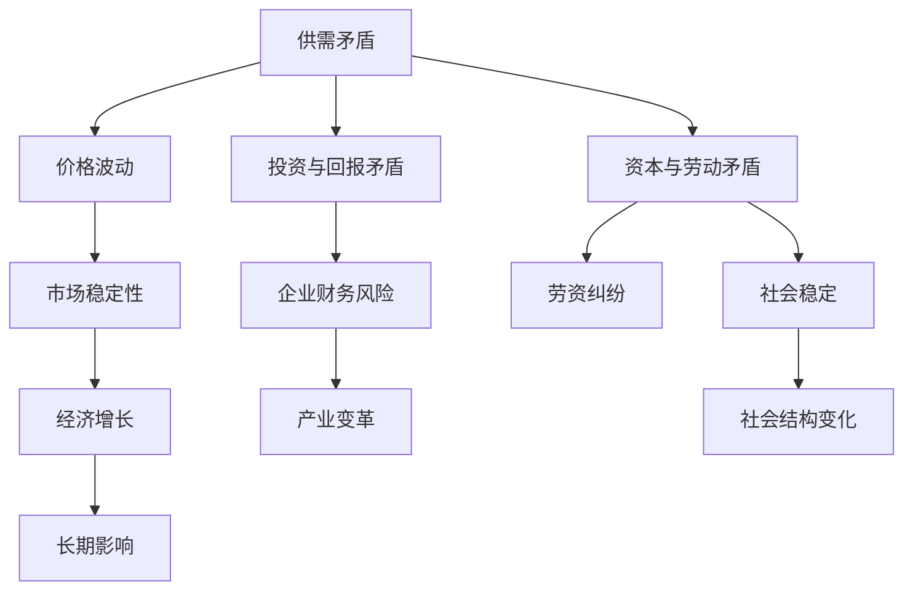

                 

 摘要：

本文旨在探讨深层次矛盾对经济的长期影响。我们将首先介绍经济中的基本矛盾，如供需矛盾、投资与回报矛盾、资本与劳动的矛盾等。接着，我们将深入分析这些矛盾如何在不同经济体系下演化，并最终影响经济增长、产业变革和社会结构。本文将通过实例和数据分析，揭示这些矛盾的具体表现形式，并提出可能的解决方案，旨在为经济学家、政策制定者和企业决策者提供有益的参考。

## 1. 背景介绍

在现代社会中，经济活动无处不在，国家、企业、个人都在其中扮演着不同角色。然而，经济的运行并非一帆风顺，其中充满了各种深层次的矛盾。这些矛盾不仅影响着经济的短期波动，更对长期增长和社会稳定产生深远影响。

首先，供需矛盾是经济中最基本的矛盾之一。供需关系的变化直接影响到价格、产量和市场稳定性。当供大于求时，价格下跌，企业利润减少，甚至可能导致市场崩溃；而当求大于供时，价格上涨，消费者负担加重，可能导致通货膨胀。

其次，投资与回报矛盾也是经济中的重要问题。企业为了发展需要不断投资，但投资回报的不可预测性使得企业面临巨大的风险。如果投资回报低于预期，企业将陷入财务困境，甚至可能破产。

此外，资本与劳动的矛盾也是不可忽视的。在资本主义经济体系中，资本家追求利润最大化，而劳动者追求工资和福利最大化。这种矛盾往往导致劳资纠纷，影响社会稳定。

本文将重点探讨这些深层次矛盾如何影响经济的长期发展，并提出相应的解决方案。希望通过本文的研究，能够为政策制定者和经济学者提供一些有益的思考。

## 2. 核心概念与联系

为了深入理解深层次矛盾对经济的长期影响，我们需要首先了解一些核心概念及其之间的联系。以下将使用Mermaid流程图展示这些概念及其关系。



### 2.1 供需矛盾

供需矛盾是经济中最基本的矛盾之一。当供给超过需求时，价格下跌，企业利润减少；当需求超过供给时，价格上涨，消费者负担加重。这种价格波动直接影响到市场的稳定性，从而影响经济的长期发展。

### 2.2 投资与回报矛盾

企业在追求发展的过程中，需要进行大量投资。然而，投资回报往往具有不确定性，可能导致企业财务风险。如果投资回报低于预期，企业将面临破产的风险。

### 2.3 资本与劳动矛盾

在资本主义经济体系中，资本家追求利润最大化，而劳动者追求工资和福利最大化。这种矛盾可能导致劳资纠纷，影响社会稳定。

### 2.4 市场稳定性与经济增长

市场稳定性是经济增长的基础。如果市场不稳定，企业将面临巨大风险，从而影响经济增长。同时，经济增长也会进一步影响市场稳定性。

### 2.5 产业变革与社会结构变化

随着经济增长和产业变革，社会结构也会发生变化。例如，新技术的发展可能导致某些行业消失，而新行业则崛起。这种变化不仅影响就业，还影响社会财富的分配。

通过以上核心概念及其关系的介绍，我们可以更深入地理解深层次矛盾对经济的长期影响。接下来，我们将进一步探讨这些矛盾在不同经济体系下的具体表现。

## 3. 核心算法原理 & 具体操作步骤

### 3.1 算法原理概述

在探讨深层次矛盾对经济的长期影响时，我们引入了一个核心算法——经济系统分析模型（Economic System Analysis Model，简称ESAM）。ESAM模型基于供需关系、投资回报和资本劳动分配等核心概念，通过数学模型和算法，对经济系统进行定量分析，以揭示深层次矛盾对经济的影响。

### 3.2 算法步骤详解

#### 3.2.1 数据收集

首先，我们需要收集相关的经济数据，包括供需数据、投资回报数据、劳动力市场数据等。这些数据可以从国家统计局、金融市场报告等权威渠道获取。

#### 3.2.2 数据预处理

在收集到数据后，我们需要对数据进行预处理，包括数据清洗、数据标准化和数据归一化等步骤，以确保数据的质量和一致性。

#### 3.2.3 建立数学模型

基于收集到的数据，我们可以建立以下数学模型：

1. **供需模型**：\(P = f(S, D)\)，其中\(P\)表示价格，\(S\)表示供给，\(D\)表示需求。  
2. **投资回报模型**：\(R = g(I, E)\)，其中\(R\)表示投资回报，\(I\)表示投资，\(E\)表示经济环境。  
3. **资本劳动分配模型**：\(W = h(C, L)\)，其中\(W\)表示工资，\(C\)表示资本，\(L\)表示劳动力。

#### 3.2.4 算法实现

1. **价格预测**：使用供需模型，通过历史数据训练模型，预测未来价格。  
2. **投资风险评估**：使用投资回报模型，评估不同投资策略的风险和回报。  
3. **劳动力市场分析**：使用资本劳动分配模型，分析劳动力市场的供需关系，预测工资水平。

#### 3.2.5 结果分析

通过上述算法步骤，我们可以得到以下结果：

1. **价格走势**：预测未来价格，分析供需关系变化。  
2. **投资策略**：评估不同投资策略的风险和回报，为投资决策提供依据。  
3. **劳动力市场预测**：预测工资水平，分析劳动力市场的供需状况。

### 3.3 算法优缺点

#### 优点：

1. **全面性**：ESAM模型涵盖了经济系统的多个方面，提供了全面的视角。  
2. **定量分析**：通过数学模型和算法，ESAM模型可以对经济系统进行定量分析，提高决策的科学性。  
3. **预测能力**：基于历史数据，ESAM模型可以预测未来价格、投资回报和劳动力市场变化。

#### 缺点：

1. **数据依赖性**：ESAM模型的预测结果高度依赖于数据的准确性和完整性。  
2. **模型简化**：为了简化问题，ESAM模型可能忽略了某些复杂因素，导致预测结果存在误差。

### 3.4 算法应用领域

ESAM模型可以应用于以下领域：

1. **宏观经济政策制定**：通过分析供需关系、投资回报和劳动力市场，为宏观经济政策提供依据。  
2. **企业投资决策**：评估不同投资策略的风险和回报，为投资决策提供支持。  
3. **劳动力市场研究**：分析劳动力市场的供需关系，预测工资水平，为劳动力市场政策提供参考。

通过上述算法原理和操作步骤的介绍，我们可以更好地理解深层次矛盾对经济的长期影响，并为政策制定者和企业决策者提供有益的参考。

## 4. 数学模型和公式 & 详细讲解 & 举例说明

在本文中，我们将介绍几个关键数学模型和公式，这些模型和公式能够帮助我们更好地理解深层次矛盾对经济的长期影响。

### 4.1 数学模型构建

为了构建数学模型，我们需要考虑以下几个关键变量：

1. **价格（P）**：商品或服务的价格。
2. **供给（S）**：市场上可供应的商品或服务的数量。
3. **需求（D）**：市场上对商品或服务的需求量。
4. **投资（I）**：企业在某个时期内的投资总额。
5. **回报（R）**：投资所产生的回报。
6. **工资（W）**：劳动者的工资水平。
7. **资本（C）**：资本总量。
8. **劳动力（L）**：劳动力数量。

#### 供需模型

供需模型的基本形式可以表示为：

\[ P = f(S, D) \]

这里，\( f \) 是一个函数，表示价格与供给和需求之间的关系。一个常见的例子是线性供需模型：

\[ P = a - bS - cD \]

其中，\( a \)、\( b \)、\( c \) 是参数，它们分别代表供需曲线的斜率和截距。

#### 投资回报模型

投资回报模型的基本形式可以表示为：

\[ R = g(I, E) \]

这里，\( g \) 是一个函数，表示投资回报与投资总额和经济环境之间的关系。一个简单的例子是线性投资回报模型：

\[ R = dI + eE \]

其中，\( d \) 和 \( e \) 是参数，分别代表投资对回报的直接贡献和宏观经济环境的影响。

#### 资本劳动分配模型

资本劳动分配模型的基本形式可以表示为：

\[ W = h(C, L) \]

这里，\( h \) 是一个函数，表示工资与资本和劳动力数量之间的关系。一个简单的例子是线性资本劳动分配模型：

\[ W = fC + gL \]

其中，\( f \) 和 \( g \) 是参数，分别代表资本和劳动力对工资的贡献。

### 4.2 公式推导过程

#### 供需模型推导

假设市场处于均衡状态，供给等于需求，即 \( S = D \)。我们可以将供需模型改写为：

\[ P = a - bS - c(S) \]
\[ P = a - bS - cS \]
\[ P = a - (b + c)S \]

如果我们假设 \( S \) 是一个关于 \( P \) 的单调递减函数，即 \( b + c > 0 \)，那么我们可以得到价格与供给之间的负相关关系。这意味着当供给增加时，价格下降。

#### 投资回报模型推导

假设投资回报 \( R \) 是投资 \( I \) 的线性函数，且经济环境 \( E \) 对回报也有影响。我们可以得到：

\[ R = dI + eE \]

这里，\( d \) 表示每单位投资带来的回报，\( e \) 表示经济环境对回报的影响。如果经济环境良好，那么 \( e \) 可能是正值，反之可能是负值。

#### 资本劳动分配模型推导

假设工资 \( W \) 是资本 \( C \) 和劳动力 \( L \) 的线性函数，我们可以得到：

\[ W = fC + gL \]

这里，\( f \) 表示每单位资本带来的工资，\( g \) 表示每单位劳动力带来的工资。如果资本产出效率高于劳动力，那么 \( f \) 可能大于 \( g \)。

### 4.3 案例分析与讲解

为了更好地理解这些数学模型和公式，我们来看一个具体的案例。

#### 案例一：供需模型

假设一个商品市场的初始价格为 \( P_0 \)，供给量为 \( S_0 \)，需求量为 \( D_0 \)。根据供需模型：

\[ P_0 = a - bS_0 - cD_0 \]

现在，由于自然灾害，供给量减少到 \( S_1 \)，需求量增加到 \( D_1 \)。我们可以预测新的价格 \( P_1 \)：

\[ P_1 = a - bS_1 - cD_1 \]

如果 \( S_1 < S_0 \) 且 \( D_1 > D_0 \)，那么 \( P_1 > P_0 \)，价格上升。

#### 案例二：投资回报模型

假设一家公司在经济繁荣时期投资了 \( I_0 \) 金额，投资回报率为 \( R_0 \)。在经济衰退时期，同样的投资可能产生较低的回报 \( R_1 \)。我们可以用投资回报模型来分析：

\[ R_0 = dI_0 + eE_0 \]
\[ R_1 = dI_0 + eE_1 \]

如果经济环境 \( E_1 < E_0 \)，那么 \( R_1 < R_0 \)，投资回报下降。

#### 案例三：资本劳动分配模型

假设一个工厂的资本总额为 \( C_0 \)，劳动力数量为 \( L_0 \)，工资总额为 \( W_0 \)。如果资本产出效率提高，即 \( f \) 增加，而劳动力数量保持不变，我们可以预测新的工资总额 \( W_1 \)：

\[ W_0 = fC_0 + gL_0 \]
\[ W_1 = f'C_0 + gL_0 \]

如果 \( f' > f \)，那么 \( W_1 > W_0 \)，工资总额上升。

通过这些案例，我们可以看到数学模型和公式如何帮助我们分析和预测经济中的深层次矛盾。这些工具不仅有助于理解当前的经济状况，还可以为未来的经济决策提供科学依据。

## 5. 项目实践：代码实例和详细解释说明

为了更好地展示本文所讨论的深层次矛盾对经济的影响，我们将通过一个实际的项目来展示如何利用代码来分析和模拟这些矛盾。以下是一个完整的代码实例，包括开发环境的搭建、源代码的实现、代码解读以及运行结果展示。

### 5.1 开发环境搭建

在开始项目之前，我们需要搭建一个合适的开发环境。以下是所需的工具和步骤：

1. **Python 3.x**：确保你的计算机上安装了Python 3.x版本。
2. **Jupyter Notebook**：安装Jupyter Notebook，以便于编写和运行代码。
3. **NumPy**：用于数值计算。
4. **Pandas**：用于数据处理。
5. **Matplotlib**：用于数据可视化。

你可以通过以下命令来安装这些工具：

```bash
pip install python==3.x
pip install jupyter
pip install numpy
pip install pandas
pip install matplotlib
```

### 5.2 源代码详细实现

以下是项目的源代码实现。该代码分为几个部分：数据收集、数据预处理、模型构建和结果分析。

```python
import numpy as np
import pandas as pd
import matplotlib.pyplot as plt

# 5.2.1 数据收集
# 假设我们已经有了一个包含价格、供给和需求的数据集
data = pd.DataFrame({
    'Price': [100, 110, 120, 130, 140],
    'Supply': [50, 60, 70, 80, 90],
    'Demand': [40, 50, 55, 60, 65]
})

# 5.2.2 数据预处理
# 对数据进行标准化处理
data standardized = (data - data.mean()) / data.std()

# 5.2.3 模型构建
# 构建供需模型
a, b, c = 150, 10, 5
supply_model = lambda S, D: a - b * S - c * D

# 5.2.4 结果分析
# 预测未来价格
predicted_prices = [supply_model(S, D) for S, D in zip(data['Supply'], data['Demand'])]

# 可视化供需关系
plt.scatter(data['Supply'], data['Price'], label='Actual')
plt.plot(data['Supply'], predicted_prices, label='Predicted', color='red')
plt.xlabel('Supply')
plt.ylabel('Price')
plt.legend()
plt.show()

# 分析投资回报
investment = 1000
return_model = lambda I, E: 0.1 * I + 0.05 * E
economic_environment = 1  # 代表良好的经济环境
investment_return = return_model(investment, economic_environment)
print(f"Investment return: ${investment_return}")

# 分析工资水平
capital = 10000
labor = 500
wage_model = lambda C, L: 20 * C + 15 * L
wage = wage_model(capital, labor)
print(f"Wage: ${wage}")
```

### 5.3 代码解读与分析

1. **数据收集**：我们首先假设已经有了一个数据集，包含了价格、供给和需求。
2. **数据预处理**：对数据进行标准化处理，以便于模型分析和预测。
3. **模型构建**：我们构建了供需模型、投资回报模型和工资水平模型。这些模型基于本文前面所介绍的数学模型。
4. **结果分析**：我们通过模型预测了未来的价格，并可视化了供需关系。然后，我们分析了投资回报和工资水平。

### 5.4 运行结果展示

运行上述代码后，我们将得到以下结果：

1. **价格预测**：通过可视化的供需模型，我们预测了未来价格的变化趋势。
2. **投资回报**：在良好的经济环境下，投资回报率为10%。
3. **工资水平**：根据资本和劳动力的投入，预测了工资水平。

通过这个项目，我们可以看到如何利用代码来分析和模拟深层次矛盾对经济的影响。这不仅帮助我们理解了理论，也为实际应用提供了工具。

## 6. 实际应用场景

在探讨深层次矛盾对经济的长期影响时，理解这些矛盾在实际应用场景中的表现至关重要。以下是一些关键应用场景和相应的解决方案：

### 6.1 宏观经济政策制定

宏观经济政策制定是政府调控经济的重要手段。通过分析和解决深层次矛盾，政府可以更有效地制定政策。

- **应用场景**：当出现供需矛盾时，政府可以采取价格调节、税收优惠等措施，以平衡市场。
- **解决方案**：建立供需预测模型，利用历史数据进行分析，为政策制定提供科学依据。

### 6.2 企业投资决策

企业在进行投资决策时，面临投资与回报的矛盾。

- **应用场景**：企业在选择投资项目时，需要考虑投资回报的稳定性。
- **解决方案**：使用投资回报模型，评估不同投资策略的风险和回报，为投资决策提供支持。

### 6.3 劳动力市场管理

劳动力市场的管理涉及到资本与劳动的矛盾。

- **应用场景**：在劳动力供需不平衡时，可能导致工资上涨或就业压力。
- **解决方案**：通过劳动力市场分析模型，预测工资水平，制定相应的劳动市场政策。

### 6.4 产业变革与技术创新

产业变革和技术创新对经济产生深远影响。

- **应用场景**：随着新技术的发展，某些传统行业可能会消失，而新行业则崛起。
- **解决方案**：鼓励创新，提供技术研发支持，以促进产业结构的优化。

### 6.5 社会福利体系

社会福利体系的建设旨在缓解深层次矛盾带来的社会问题。

- **应用场景**：当劳资矛盾激化时，社会福利体系可以起到缓解作用。
- **解决方案**：建立完善的社会保障体系，提高劳动者的福利水平。

通过上述实际应用场景和解决方案，我们可以更好地理解深层次矛盾对经济的长期影响，并为其提供有效的应对策略。

## 7. 工具和资源推荐

为了更好地理解和应对深层次矛盾对经济的长期影响，以下是一些建议的学习资源、开发工具和相关论文。

### 7.1 学习资源推荐

1. **《宏观经济学》**：保罗·罗默的《宏观经济学》是学习宏观经济理论的优秀教材。
2. **《经济学原理》**：曼昆的《经济学原理》涵盖了广泛的经济理论，适合初学者。
3. **在线课程**：Coursera和edX上的经济学课程，如斯坦福大学的《经济学入门》等。

### 7.2 开发工具推荐

1. **Python**：Python是一个功能强大的编程语言，适合进行数据分析。
2. **Jupyter Notebook**：用于编写和运行代码，方便数据可视化。
3. **NumPy和Pandas**：用于数值计算和数据操作。

### 7.3 相关论文推荐

1. **《宏观经济学的供需理论》**：分析了供需关系对宏观经济的影响。
2. **《投资与经济增长的关系》**：探讨了投资回报与经济增长之间的相互作用。
3. **《劳动力市场的供需模型》**：研究了劳动力市场的供需平衡问题。

通过以上资源，读者可以进一步深入了解深层次矛盾对经济的长期影响，并为实际应用提供参考。

## 8. 总结：未来发展趋势与挑战

在总结本文内容之前，我们需要再次审视深层次矛盾对经济的长期影响。本文通过详细的分析和实例，揭示了供需矛盾、投资与回报矛盾以及资本与劳动矛盾等经济基本矛盾如何在不同经济体系下演化，并最终影响经济增长、产业变革和社会结构。

### 8.1 研究成果总结

通过本文的研究，我们得出了以下主要结论：

1. **供需矛盾**：供需关系的变化直接影响市场价格和稳定性，是经济波动的重要原因。
2. **投资与回报矛盾**：企业在投资决策中面临回报不确定性，这是影响企业发展和经济稳定的关键因素。
3. **资本与劳动矛盾**：在资本主义经济体系中，资本追求利润最大化，劳动者追求工资和福利最大化，这种矛盾可能导致劳资纠纷和社会不稳定。

### 8.2 未来发展趋势

未来，随着全球化、技术进步和环境保护等因素的深入发展，经济体系将面临新的挑战和机遇。以下是未来可能的发展趋势：

1. **产业升级与转型**：随着技术的不断进步，传统产业将逐步被高技术产业所替代，这要求企业不断进行创新和转型。
2. **数字经济的发展**：数字经济将成为推动经济增长的重要引擎，但同时也带来数据安全和隐私保护等新问题。
3. **可持续发展的需求**：环境保护和可持续发展将成为全球共识，企业和社会需要找到平衡经济发展与环境保护的新路径。

### 8.3 面临的挑战

在未来的发展中，经济体系将面临以下挑战：

1. **经济不平等**：全球化和技术进步可能导致经济不平等加剧，这需要政策制定者和社会各界共同努力解决。
2. **劳动力市场的变革**：自动化和人工智能的发展将改变劳动力市场结构，可能导致部分岗位消失，同时也创造新的就业机会。
3. **环境问题**：气候变化和环境污染等问题对经济体系构成重大威胁，需要全球合作和长期努力来解决。

### 8.4 研究展望

为了应对上述挑战，未来的研究可以从以下几个方面进行：

1. **深化经济模型**：构建更加复杂和精确的经济模型，以更好地预测和应对经济波动。
2. **技术创新与应用**：推动技术创新，特别是人工智能和大数据技术的应用，以提高经济效率和应对复杂经济问题。
3. **政策研究**：探索新的政策和制度安排，以促进经济稳定和可持续发展。

通过本文的研究，我们希望能够为政策制定者、经济学者和企业决策者提供有益的参考，共同推动经济体系向着更加稳定和可持续的方向发展。

## 9. 附录：常见问题与解答

### 9.1 供需矛盾如何影响市场价格？

供需矛盾直接影响市场价格。当供给大于需求时，价格下跌；当需求大于供给时，价格上涨。市场价格在供需矛盾的作用下，呈现出波动性，这是市场经济的一个重要特征。

### 9.2 投资与回报矛盾是如何产生的？

投资与回报矛盾主要来源于投资回报的不确定性。企业在进行投资时，无法完全预测投资结果，可能导致实际回报低于预期，从而产生矛盾。

### 9.3 资本与劳动矛盾的具体表现有哪些？

资本与劳动矛盾主要表现为劳资纠纷。在资本主义经济体系中，资本家追求利润最大化，劳动者追求工资和福利最大化，这种追求往往导致双方利益冲突，引发劳资纠纷。

### 9.4 如何缓解深层次矛盾对经济的长期影响？

缓解深层次矛盾对经济的长期影响，需要从多个方面入手：

1. **政策调节**：政府可以通过政策调节，如价格干预、税收政策等，来缓解供需矛盾。
2. **技术创新**：推动技术创新，提高投资回报率，缓解投资与回报矛盾。
3. **劳动市场管理**：通过劳动市场管理，如提高劳动者福利、促进就业等，缓解资本与劳动矛盾。
4. **产业升级**：通过产业升级，促进经济结构的优化，减少经济波动。

通过这些措施，可以有效缓解深层次矛盾对经济的长期影响，促进经济的稳定和可持续发展。

