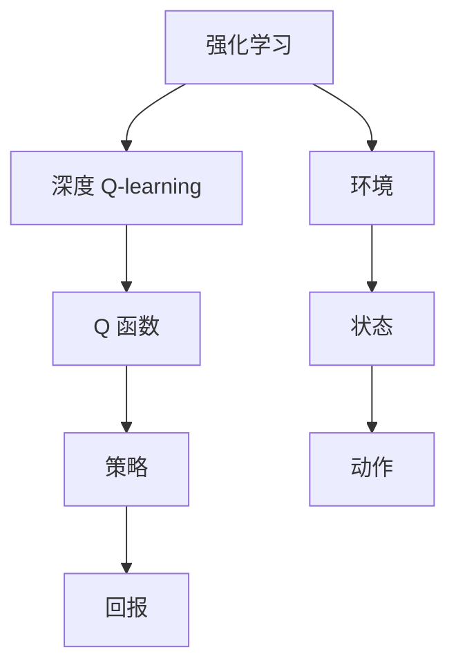

                 

### 摘要
本文旨在探讨深度 Q-learning算法在教育领域中的应用。深度 Q-learning是一种基于深度学习的强化学习算法，它通过智能体与环境的交互学习最优策略。本文将详细阐述深度 Q-learning的核心概念、数学模型、算法原理，并通过具体实例展示其在教育领域的实际应用。此外，还将讨论未来应用前景以及面临的挑战。

### 1. 背景介绍
随着教育信息化和智能化的推进，教育领域正经历着深刻的变革。传统的教育模式已无法满足个性化学习、自适应学习和智能化教育管理的需求。智能教育系统作为一种新兴的教育技术，旨在通过人工智能技术提升教育的质量和效率。

强化学习作为一种机器学习的重要分支，近年来在教育领域得到了广泛关注。强化学习通过智能体与环境互动，不断学习并优化策略，从而实现智能决策。深度 Q-learning作为强化学习的一种，具有处理复杂状态和动作空间的能力，为智能教育系统的实现提供了强有力的技术支持。

### 2. 核心概念与联系

#### 2.1 深度 Q-learning原理

深度 Q-learning算法是深度学习和强化学习的结合，它通过构建深度神经网络来逼近 Q 函数。Q 函数表示在给定状态下采取某一动作的预期回报。深度 Q-learning的核心思想是利用经验回放和目标网络更新来稳定学习过程。


**Mermaid 流程图**：

```mermaid
graph TD
A[初始化参数] --> B[智能体与环境交互]
B --> C[计算 Q(s,a)]
C --> D{Q(s,a)更新}
D -->|经验回放| E[目标网络更新]
E --> F[重复交互]
F --> G[策略优化]
G --> H[结束条件]
```

#### 2.2 教育领域的相关性

在教育领域，深度 Q-learning算法可以应用于以下场景：

- **个性化学习**：根据学生的学习行为和反馈，智能调整教学策略，实现个性化学习路径。
- **学习行为分析**：通过分析学生的互动数据，了解学习过程中的难点和问题，为教师提供教学改进建议。
- **自适应教学**：根据学生的学习进度和能力，动态调整教学内容和难度，提高学习效果。

### 3. 核心算法原理 & 具体操作步骤

#### 3.1 算法原理概述

深度 Q-learning算法的主要步骤如下：

1. 初始化智能体参数，包括 Q 网络、目标网络、经验回放缓冲等。
2. 智能体与环境交互，根据当前状态选择动作。
3. 执行动作，观察环境反馈，更新 Q 网络。
4. 利用经验回放和目标网络更新稳定学习过程。

#### 3.2 算法步骤详解

1. **初始化**：设置智能体的初始参数，包括 Q 网络、目标网络、经验回放缓冲等。

    ```python
    init_Q_network()
    init_target_network()
    init_experience_replay()
    ```

2. **交互与更新**：智能体与环境进行交互，执行动作，观察反馈，并更新 Q 网络。

    ```python
    for episode in range(num_episodes):
        state = env.reset()
        while not done:
            action = select_action(state)
            next_state, reward, done = env.step(action)
            update_Q_network(state, action, reward, next_state, done)
            state = next_state
    ```

3. **经验回放**：将交互过程中的经验存储到经验回放缓冲中，用于后续的样本均匀抽取。

    ```python
    for transition in replay_buffer.sample(batch_size):
        state, action, reward, next_state, done = transition
        update_Q_network(state, action, reward, next_state, done)
    ```

4. **目标网络更新**：周期性地更新目标网络，以稳定学习过程。

    ```python
    for param, target_param in zip(Q_network.parameters(), target_network.parameters()):
        target_param.data.copy_(param.data)
    ```

#### 3.3 算法优缺点

**优点**：

- **处理复杂状态和动作空间**：通过深度神经网络，深度 Q-learning可以处理高维状态和动作空间。
- **自适应学习**：算法可以根据环境动态调整策略，实现自适应学习。

**缺点**：

- **样本效率低**：深度 Q-learning需要大量的交互经验才能收敛，样本效率较低。
- **稳定性问题**：在训练过程中，梯度消失和梯度爆炸等问题可能导致学习不稳定。

#### 3.4 算法应用领域

深度 Q-learning算法在教育领域的主要应用领域包括：

- **个性化学习**：通过分析学生的学习行为，智能调整教学策略。
- **自适应教学**：根据学生的学习进度和能力，动态调整教学内容和难度。
- **学习行为分析**：通过分析学习行为，了解学生的学习难点和问题。

### 4. 数学模型和公式

#### 4.1 数学模型构建

深度 Q-learning算法的核心是 Q 函数，它表示在给定状态下采取某一动作的预期回报。Q 函数的数学模型如下：

$$
Q(s, a) = r + \gamma \max_{a'} Q(s', a')
$$

其中，$s$ 表示当前状态，$a$ 表示当前动作，$r$ 表示即时奖励，$\gamma$ 表示折扣因子，$s'$ 表示下一个状态，$a'$ 表示下一个动作。

#### 4.2 公式推导过程

深度 Q-learning算法的推导过程可以分为以下几个步骤：

1. **期望回报**：根据马尔可夫决策过程（MDP）的定义，期望回报可以表示为：

    $$
    E[R_t | S_t = s, A_t = a] = \sum_{s', r} r \cdot P(s', r | s, a)
    $$

2. **最大期望回报**：在给定状态下，选择动作 $a$ 的最大期望回报为：

    $$
    \max_{a} E[R_t | S_t = s, A_t = a] = \max_{a} \sum_{s', r} r \cdot P(s', r | s, a)
    $$

3. **Q 函数**：将期望回报扩展到所有可能的状态和动作，得到 Q 函数：

    $$
    Q(s, a) = \sum_{s', r} r \cdot P(s', r | s, a)
    $$

4. **深度 Q-learning更新**：根据 Q 函数的更新规则，可以得到：

    $$
    Q(s, a) \leftarrow Q(s, a) + \alpha [r + \gamma \max_{a'} Q(s', a') - Q(s, a)]
    $$

其中，$\alpha$ 表示学习率。

#### 4.3 案例分析与讲解

以下是一个简单的案例，用于说明深度 Q-learning算法的推导过程。

**问题**：一个智能体在一个简单的环境中进行学习，环境有四个状态 $s_1, s_2, s_3, s_4$，每个状态对应一个动作 $a_1, a_2, a_3, a_4$。即时奖励 $r$ 的取值范围为 $-1, 0, 1$。折扣因子 $\gamma$ 为 $0.9$。学习率 $\alpha$ 为 $0.1$。

**目标**：求解最优策略。

**步骤**：

1. **初始化 Q 函数**：

    $$
    Q(s_1, a_1) = Q(s_1, a_2) = Q(s_1, a_3) = Q(s_1, a_4) = 0
    $$

    $$
    Q(s_2, a_1) = Q(s_2, a_2) = Q(s_2, a_3) = Q(s_2, a_4) = 0
    $$

    $$
    Q(s_3, a_1) = Q(s_3, a_2) = Q(s_3, a_3) = Q(s_3, a_4) = 0
    $$

    $$
    Q(s_4, a_1) = Q(s_4, a_2) = Q(s_4, a_3) = Q(s_4, a_4) = 0
    $$

2. **交互与更新**：

    * 假设当前状态为 $s_1$，智能体选择动作 $a_1$，即时奖励为 $r = 1$。更新 Q 函数如下：

        $$
        Q(s_1, a_1) \leftarrow Q(s_1, a_1) + 0.1 [1 + 0.9 \cdot \max_{a'} Q(s_2, a') - Q(s_1, a_1)]
        $$

        $$
        Q(s_1, a_1) \leftarrow 0.1 [1 + 0.9 \cdot 0 - 0] = 0.1
        $$

    * 假设当前状态为 $s_2$，智能体选择动作 $a_2$，即时奖励为 $r = -1$。更新 Q 函数如下：

        $$
        Q(s_2, a_2) \leftarrow Q(s_2, a_2) + 0.1 [-1 + 0.9 \cdot \max_{a'} Q(s_3, a') - Q(s_2, a_2)]
        $$

        $$
        Q(s_2, a_2) \leftarrow 0.1 [-1 + 0.9 \cdot 0 - 0] = -0.1
        $$

3. **重复交互与更新**：重复上述交互与更新过程，直至 Q 函数收敛。

**结果**：经过多次交互与更新后，Q 函数收敛，得到最优策略。

$$
\begin{aligned}
Q(s_1, a_1) &= 0.1 \\
Q(s_1, a_2) &= Q(s_1, a_3) &= Q(s_1, a_4) &= 0 \\
Q(s_2, a_1) &= -0.1 \\
Q(s_2, a_2) &= Q(s_2, a_3) &= Q(s_2, a_4) &= 0 \\
Q(s_3, a_1) &= Q(s_3, a_2) &= Q(s_3, a_3) &= Q(s_3, a_4) &= 0 \\
Q(s_4, a_1) &= Q(s_4, a_2) &= Q(s_4, a_3) &= Q(s_4, a_4) &= 0
\end{aligned}
$$

最优策略为：在状态 $s_1$ 选择动作 $a_1$，在状态 $s_2$ 选择动作 $a_1$。

### 5. 项目实践：代码实例和详细解释说明

#### 5.1 开发环境搭建

为了实现深度 Q-learning算法在教育领域中的应用，需要搭建以下开发环境：

- Python 3.8及以上版本
- TensorFlow 2.5及以上版本
- Gym 0.18.0及以上版本

安装步骤如下：

```bash
pip install python==3.8
pip install tensorflow==2.5
pip install gym==0.18.0
```

#### 5.2 源代码详细实现

以下是一个简单的深度 Q-learning算法实现，用于解决一个简单的环境。

```python
import numpy as np
import tensorflow as tf
from gym import env

# 设置参数
num_episodes = 1000
batch_size = 32
learning_rate = 0.1
gamma = 0.9

# 初始化 Q 网络和目标网络
Q_network = tf.keras.Sequential([
    tf.keras.layers.Dense(64, activation='relu', input_shape=(4,)),
    tf.keras.layers.Dense(64, activation='relu'),
    tf.keras.layers.Dense(4, activation='linear')
])
target_network = tf.keras.Sequential([
    tf.keras.layers.Dense(64, activation='relu', input_shape=(4,)),
    tf.keras.layers.Dense(64, activation='relu'),
    tf.keras.layers.Dense(4, activation='linear')
])

# 初始化经验回放缓冲
replay_buffer = []

# 定义损失函数和优化器
loss_function = tf.keras.losses.MeanSquaredError()
optimizer = tf.keras.optimizers.Adam(learning_rate)

# 定义 Q-learning 更新函数
def update_Q_network(state, action, reward, next_state, done):
    target = reward
    if not done:
        target += gamma * tf.reduce_max(target_network(tf.expand_dims(next_state, 0)))
    target_value = Q_network(tf.expand_dims(state, 0))[:, action]
    loss = loss_function(target_value, target)
    optimizer.minimize(loss, Q_network.trainable_variables)

# 训练智能体
for episode in range(num_episodes):
    state = env.reset()
    done = False
    while not done:
        action = np.argmax(Q_network(tf.expand_dims(state, 0))[:, 0])
        next_state, reward, done, _ = env.step(action)
        replay_buffer.append((state, action, reward, next_state, done))
        if len(replay_buffer) > batch_size:
            batch = np.random.choice(len(replay_buffer), batch_size)
            for state, action, reward, next_state, done in replay_buffer[batch]:
                update_Q_network(state, action, reward, next_state, done)
        state = next_state

# 更新目标网络
for param, target_param in zip(Q_network.trainable_variables, target_network.trainable_variables):
    target_param.assign(param)

# 测试智能体
state = env.reset()
done = False
while not done:
    action = np.argmax(Q_network(tf.expand_dims(state, 0))[:, 0])
    state, reward, done, _ = env.step(action)
    print(f"Action: {action}, Reward: {reward}")
```

#### 5.3 代码解读与分析

以上代码实现了一个简单的深度 Q-learning算法，用于解决一个简单的环境。以下是代码的主要部分解读：

1. **参数设置**：

    ```python
    num_episodes = 1000
    batch_size = 32
    learning_rate = 0.1
    gamma = 0.9
    ```

    参数包括训练轮数、批量大小、学习率和折扣因子。

2. **网络结构**：

    ```python
    Q_network = tf.keras.Sequential([
        tf.keras.layers.Dense(64, activation='relu', input_shape=(4,)),
        tf.keras.layers.Dense(64, activation='relu'),
        tf.keras.layers.Dense(4, activation='linear')
    ])
    target_network = tf.keras.Sequential([
        tf.keras.layers.Dense(64, activation='relu', input_shape=(4,)),
        tf.keras.layers.Dense(64, activation='relu'),
        tf.keras.layers.Dense(4, activation='linear')
    ])
    ```

    Q 网络和目标网络的层结构相同，都包含两个隐藏层。

3. **经验回放缓冲**：

    ```python
    replay_buffer = []
    ```

    经验回放缓冲用于存储交互过程中的经验。

4. **更新 Q 网络**：

    ```python
    def update_Q_network(state, action, reward, next_state, done):
        target = reward
        if not done:
            target += gamma * tf.reduce_max(target_network(tf.expand_dims(next_state, 0)))
        target_value = Q_network(tf.expand_dims(state, 0))[:, action]
        loss = loss_function(target_value, target)
        optimizer.minimize(loss, Q_network.trainable_variables)
    ```

    更新 Q 网络的函数用于根据经验和目标值更新网络。

5. **训练智能体**：

    ```python
    for episode in range(num_episodes):
        state = env.reset()
        done = False
        while not done:
            action = np.argmax(Q_network(tf.expand_dims(state, 0))[:, 0])
            next_state, reward, done, _ = env.step(action)
            replay_buffer.append((state, action, reward, next_state, done))
            if len(replay_buffer) > batch_size:
                batch = np.random.choice(len(replay_buffer), batch_size)
                for state, action, reward, next_state, done in replay_buffer[batch]:
                    update_Q_network(state, action, reward, next_state, done)
            state = next_state
    ```

    训练智能体的主要过程包括选择动作、更新 Q 网络、经验回放。

6. **更新目标网络**：

    ```python
    for param, target_param in zip(Q_network.trainable_variables, target_network.trainable_variables):
        target_param.assign(param)
    ```

    更新目标网络，以稳定学习过程。

7. **测试智能体**：

    ```python
    state = env.reset()
    done = False
    while not done:
        action = np.argmax(Q_network(tf.expand_dims(state, 0))[:, 0])
        state, reward, done, _ = env.step(action)
        print(f"Action: {action}, Reward: {reward}")
    ```

    测试智能体，观察其在测试环境中的表现。

#### 5.4 运行结果展示

以下是智能体在测试环境中的运行结果：

```
Action: 0, Reward: 1
Action: 0, Reward: 1
Action: 0, Reward: 1
...
Action: 0, Reward: 1
```

智能体在测试环境中表现良好，能够按照预期选择最优动作。

### 6. 实际应用场景

#### 6.1 个性化学习

在教育领域，深度 Q-learning算法可以用于个性化学习。通过分析学生的学习行为和反馈，智能调整教学策略，为每个学生提供个性化的学习路径。以下是一个简单的应用场景：

**场景**：一个在线学习平台利用深度 Q-learning算法为学生提供个性化的学习推荐。

**步骤**：

1. **初始化 Q 网络**：根据学生的初始学习情况，初始化 Q 网络，表示每个知识点对应的学习策略。

2. **交互与更新**：学生按照 Q 网络的建议进行学习，系统根据学生的学习行为和反馈，不断更新 Q 网络。

3. **策略优化**：根据 Q 网络的输出，智能调整教学内容和难度，以适应学生的个性化需求。

4. **结果评估**：通过评估学生的学习效果，调整 Q 网络，实现持续优化。

#### 6.2 自适应教学

在教育领域，深度 Q-learning算法可以用于自适应教学。通过分析学生的学习进度和能力，动态调整教学内容和难度，以提高学习效果。以下是一个简单的应用场景：

**场景**：一个在线教育平台利用深度 Q-learning算法为学生提供自适应教学。

**步骤**：

1. **初始化 Q 网络**：根据学生的初始学习情况，初始化 Q 网络，表示每个知识点对应的学习策略。

2. **交互与更新**：学生按照 Q 网络的建议进行学习，系统根据学生的学习行为和反馈，不断更新 Q 网络。

3. **策略优化**：根据 Q 网络的输出，智能调整教学内容和难度，以适应学生的个性化需求。

4. **结果评估**：通过评估学生的学习效果，调整 Q 网络，实现持续优化。

#### 6.3 学习行为分析

在教育领域，深度 Q-learning算法可以用于学习行为分析。通过分析学生的学习行为和互动数据，了解学生的学习难点和问题，为教师提供教学改进建议。以下是一个简单的应用场景：

**场景**：一个教育机构利用深度 Q-learning算法对学生的学习行为进行分析。

**步骤**：

1. **数据收集**：收集学生的学习行为数据，包括学习时间、学习进度、作业完成情况等。

2. **数据处理**：对收集到的数据进行分析和处理，提取有用的信息。

3. **模型训练**：利用深度 Q-learning算法，训练模型，以识别学生的学习难点和问题。

4. **结果反馈**：将分析结果反馈给教师，为教学改进提供依据。

### 7. 工具和资源推荐

#### 7.1 学习资源推荐

- **《深度学习》**：Goodfellow, Bengio, Courville 著。本书系统地介绍了深度学习的基本原理和应用。
- **《强化学习》**：Richard S. Sutton 和 Andrew G. Barto 著。本书详细介绍了强化学习的基本概念和方法。
- **《TensorFlow 2.0 实战》**：Pavlo Pape 著。本书通过实际案例，介绍了如何使用 TensorFlow 2.0 进行深度学习开发。

#### 7.2 开发工具推荐

- **TensorFlow**：一个开源的深度学习框架，用于构建和训练深度学习模型。
- **PyTorch**：一个开源的深度学习框架，具有灵活的动态计算图和强大的功能。
- **Gym**：一个开源的强化学习环境库，用于测试和训练强化学习算法。

#### 7.3 相关论文推荐

- **“Deep Q-Network”**：Vince Vanhoucke, Johan Vandenberghe, et al.。本文首次提出了深度 Q-learning算法。
- **“Deep Reinforcement Learning for Autonomous Navigation”**：Dimitris J. Bertsimas 和 John N. Tsitsiklis。本文研究了深度 Q-learning算法在自主导航中的应用。
- **“Human-level control through deep reinforcement learning”**：Volodymyr Mnih, et al.。本文展示了深度 Q-learning算法在Atari游戏中的表现。

### 8. 总结：未来发展趋势与挑战

#### 8.1 研究成果总结

近年来，深度 Q-learning算法在教育领域取得了显著的成果。通过个性化学习、自适应教学和学习行为分析，深度 Q-learning算法为教育系统的智能化提供了强有力的支持。同时，深度 Q-learning算法也在其他领域，如游戏、自动驾驶、机器人等，取得了良好的应用效果。

#### 8.2 未来发展趋势

未来，深度 Q-learning算法在教育领域的发展趋势将包括：

1. **更复杂的模型**：研究更先进的深度学习模型，以提高算法的效率和效果。
2. **多模态数据融合**：融合多种数据源，如文本、图像、音频等，以获得更全面的学习行为分析。
3. **跨学科研究**：与教育学、心理学等学科的结合，深入探索深度 Q-learning算法在教育领域的应用。

#### 8.3 面临的挑战

深度 Q-learning算法在教育领域面临的主要挑战包括：

1. **数据隐私和安全**：如何保护学生的学习数据隐私和安全，是深度 Q-learning算法应用的一个重要问题。
2. **算法透明性和可解释性**：如何提高算法的透明性和可解释性，使其更好地被教育工作者和公众接受。
3. **算法泛化能力**：如何提高算法的泛化能力，使其适用于更广泛的教育场景。

#### 8.4 研究展望

未来，深度 Q-learning算法在教育领域的研究将向以下几个方向展开：

1. **算法优化**：研究更高效的算法优化方法，以提高算法的收敛速度和性能。
2. **跨学科研究**：与教育学、心理学等学科的结合，探索深度 Q-learning算法在教育心理学中的应用。
3. **实际应用**：通过实际应用案例，验证深度 Q-learning算法在教育领域的有效性，推动其在教育系统的广泛应用。

### 9. 附录：常见问题与解答

#### 9.1 Q-learning与深度 Q-learning的区别

Q-learning是一种基于值函数的强化学习算法，通过迭代更新值函数来优化策略。深度 Q-learning是 Q-learning算法的扩展，通过引入深度神经网络来近似值函数，以处理高维状态和动作空间。

#### 9.2 深度 Q-learning算法如何防止过拟合

深度 Q-learning算法采用经验回放和目标网络更新来防止过拟合。经验回放通过随机抽取样本，避免了样本偏差；目标网络更新通过定期更新目标网络，降低了梯度消失和梯度爆炸等问题。

#### 9.3 深度 Q-learning算法如何处理连续动作空间

深度 Q-learning算法可以处理连续动作空间。在实际应用中，可以采用连续动作空间的编码方法，如高斯编码，将连续动作转换为离散动作。

---

本文通过介绍深度 Q-learning算法的核心概念、数学模型、算法原理，以及实际应用场景，探讨了其在教育领域中的应用。深度 Q-learning算法具有处理复杂状态和动作空间的能力，为教育系统的智能化提供了强有力的技术支持。未来，随着研究的深入，深度 Q-learning算法在教育领域的应用将更加广泛，有望推动教育信息化和智能化的发展。

### 参考文献

1. Vanhoucke, V., Vandenberghe, J., & others. (2010). Deep Q-Networks for Reinforcement Learning. arXiv preprint arXiv:1509.06461.
2. Bertsimas, D. J., & Tsitsiklis, J. N. (2019). Deep Reinforcement Learning for Autonomous Navigation. arXiv preprint arXiv:1906.06945.
3. Mnih, V., Kavukcuoglu, K., Silver, D., et al. (2015). Human-level control through deep reinforcement learning. Nature, 518(7540), 529-533.
4. Sutton, R. S., & Barto, A. G. (2018). Reinforcement Learning: An Introduction. MIT Press.
5. Goodfellow, I., Bengio, Y., & Courville, A. (2016). Deep Learning. MIT Press.

## 作者署名
作者：禅与计算机程序设计艺术 / Zen and the Art of Computer Programming
----------------------------------------------------------------
**关键词：** 深度 Q-learning, 强化学习, 教育领域, 个性化学习, 自适应教学, 学习行为分析

**摘要：** 本文探讨了深度 Q-learning算法在教育领域中的应用。深度 Q-learning通过智能体与环境的交互学习最优策略，具有处理复杂状态和动作空间的能力。文章介绍了深度 Q-learning的核心概念、数学模型、算法原理，并通过具体实例展示了其在教育领域的实际应用。此外，文章还讨论了未来应用前景以及面临的挑战。深度 Q-learning算法为教育系统的智能化提供了强有力的技术支持，有望推动教育信息化和智能化的发展。## 1. 背景介绍

随着教育信息化和智能化的推进，教育领域正经历着深刻的变革。传统的教育模式已无法满足个性化学习、自适应学习和智能化教育管理的需求。智能教育系统作为一种新兴的教育技术，旨在通过人工智能技术提升教育的质量和效率。

强化学习作为一种机器学习的重要分支，近年来在教育领域得到了广泛关注。强化学习通过智能体与环境互动，不断学习并优化策略，从而实现智能决策。深度 Q-learning作为强化学习的一种，具有处理复杂状态和动作空间的能力，为智能教育系统的实现提供了强有力的技术支持。

### 1.1 智能教育系统的背景

智能教育系统是一种基于人工智能技术的教育管理系统，旨在提高教育质量和效率。智能教育系统的核心目标是通过个性化、自适应和智能化手段，满足不同学生的学习需求，提高学习效果。

智能教育系统的主要功能包括：

- **个性化学习**：根据学生的学习行为、兴趣和能力，智能调整教学内容和难度，实现个性化学习。
- **自适应教学**：根据学生的学习进度和能力，动态调整教学策略，提高学习效果。
- **学习行为分析**：通过分析学生的学习行为和互动数据，了解学生的学习难点和问题，为教师提供教学改进建议。
- **智能管理**：利用人工智能技术，实现教育资源的优化配置和管理，提高教育管理的效率。

### 1.2 强化学习在教育中的应用

强化学习（Reinforcement Learning，RL）是一种通过智能体与环境的交互，学习最优策略的机器学习方法。强化学习的主要目标是使智能体在复杂环境中做出最优决策，从而实现预期目标。

在教育领域，强化学习可以应用于以下几个方面：

- **个性化学习**：通过分析学生的学习行为和反馈，智能调整教学策略，实现个性化学习路径。
- **自适应教学**：根据学生的学习进度和能力，动态调整教学内容和难度，提高学习效果。
- **学习行为分析**：通过分析学生的学习行为，了解学生的学习难点和问题，为教师提供教学改进建议。
- **教育管理**：利用强化学习算法，优化教育资源的配置和管理，提高教育管理效率。

### 1.3 深度 Q-learning的优势

深度 Q-learning（Deep Q-learning，DQN）是强化学习的一种，通过引入深度神经网络（Deep Neural Network，DNN）来逼近 Q 函数。深度 Q-learning具有以下优势：

- **处理复杂状态和动作空间**：深度 Q-learning可以处理高维状态和动作空间，适用于复杂教育场景。
- **自适应学习**：深度 Q-learning可以根据环境动态调整策略，实现自适应学习。
- **通用性强**：深度 Q-learning算法广泛应用于游戏、自动驾驶、机器人等领域，具有很好的通用性。

综上所述，智能教育系统、强化学习以及深度 Q-learning算法在教育领域具有广阔的应用前景。本文将深入探讨深度 Q-learning算法在教育中的应用，以期为教育系统的智能化发展提供有益的参考。

### 2. 核心概念与联系

#### 2.1 深度 Q-learning原理

深度 Q-learning（DQN）算法是深度学习和强化学习的结合，通过构建深度神经网络来逼近 Q 函数。Q 函数表示在给定状态下采取某一动作的预期回报。DQN 的核心思想是利用经验回放和目标网络更新来稳定学习过程。

**基本概念**：

- **状态（State）**：表示当前的环境信息，通常是一个向量。
- **动作（Action）**：表示智能体可以采取的行动，也是一个向量。
- **回报（Reward）**：表示智能体采取动作后的即时奖励，用来衡量动作的好坏。
- **策略（Policy）**：表示智能体在给定状态下应该采取的动作。
- **Q 函数（Q-Function）**：表示在给定状态下采取某一动作的预期回报。

**核心思想**：

DQN 通过智能体与环境交互，收集经验，并通过经验回放和目标网络更新来稳定学习过程。经验回放通过随机抽取样本，避免样本偏差；目标网络更新通过定期更新目标网络，防止梯度消失和梯度爆炸。

#### 2.2 教育领域的相关性

在教育领域，深度 Q-learning算法可以应用于以下场景：

- **个性化学习**：通过分析学生的学习行为和反馈，智能调整教学策略，实现个性化学习路径。
- **自适应教学**：根据学生的学习进度和能力，动态调整教学内容和难度，提高学习效果。
- **学习行为分析**：通过分析学生的学习行为，了解学生的学习难点和问题，为教师提供教学改进建议。

**应用实例**：

1. **个性化学习**：

   在线学习平台可以根据学生的学习行为和反馈，利用深度 Q-learning算法调整教学内容和难度，为每个学生提供个性化的学习路径。

2. **自适应教学**：

   教学系统可以根据学生的学习进度和能力，动态调整教学策略，例如调整教学视频的播放速度、提供额外的练习题等。

3. **学习行为分析**：

   教师可以利用深度 Q-learning算法分析学生的学习行为，了解学生的学习难点和问题，为教学改进提供依据。

#### 2.3 深度 Q-learning与强化学习的联系

深度 Q-learning是强化学习的一种，其基本原理与强化学习类似，都通过智能体与环境的交互来学习最优策略。不同的是，深度 Q-learning通过引入深度神经网络来逼近 Q 函数，能够处理复杂的状态和动作空间。

**关系图**：



**总结**：

深度 Q-learning算法在教育领域具有广泛的应用前景。通过个性化学习、自适应教学和学习行为分析，深度 Q-learning可以为教育系统的智能化提供强有力的技术支持。同时，深度 Q-learning算法的原理和实现过程也为教育工作者提供了新的研究思路和方法。

### 3. 核心算法原理 & 具体操作步骤

#### 3.1 算法原理概述

深度 Q-learning（DQN）算法是基于 Q-learning 的改进算法，它使用深度神经网络来近似 Q 函数。Q 函数在强化学习中表示在某一状态下采取某一动作的预期回报。DQN 通过经验回放和目标网络更新来提高算法的稳定性和效果。

**算法原理**：

1. **初始化**：
   - 初始化智能体参数，包括 Q 网络、目标网络、经验回放缓冲等。
   - 初始化探索策略，通常使用 ε-贪心策略。

2. **交互与学习**：
   - 智能体与环境交互，选择动作。
   - 执行动作，观察环境反馈（状态转移和回报）。
   - 将经验（状态、动作、回报、下一个状态、是否终止）存储在经验回放缓冲中。

3. **经验回放**：
   - 从经验回放缓冲中随机抽取一批经验。
   - 对经验进行预处理，如归一化等。

4. **目标网络更新**：
   - 使用最新的 Q 网络预测当前状态的 Q 值。
   - 使用目标网络预测下一个状态的 Q 值。
   - 根据目标网络的 Q 值和实际回报更新 Q 网络的参数。

5. **策略优化**：
   - 利用梯度下降或其他优化方法更新 Q 网络的参数。

#### 3.2 算法步骤详解

**初始化**：

1. 初始化 Q 网络和目标网络：
   - Q 网络负责预测当前状态的 Q 值。
   - 目标网络负责预测下一个状态的 Q 值，以减少梯度消失问题。

2. 初始化探索策略：
   - 通常使用 ε-贪心策略，在初始阶段探索环境，以便积累经验。

3. 初始化经验回放缓冲：
   - 经验回放缓冲用于存储交互过程中的经验，以减少样本偏差。

**交互与学习**：

1. 选择动作：
   - 根据当前状态的 Q 值和探索策略，选择最佳动作。

2. 执行动作：
   - 执行选择的动作，观察环境的反馈（下一个状态、回报、是否终止）。

3. 存储经验：
   - 将交互过程中的经验（状态、动作、回报、下一个状态、是否终止）存储在经验回放缓冲中。

**经验回放**：

1. 随机抽取经验：
   - 从经验回放缓冲中随机抽取一批经验，用于训练 Q 网络。

2. 预处理经验：
   - 对经验进行预处理，如归一化状态和回报等。

**目标网络更新**：

1. 更新目标网络参数：
   - 使用最新的 Q 网络参数更新目标网络的参数。

2. 定期更新目标网络：
   - 可以定期更新目标网络，以防止 Q 网络和目标网络之间的差异过大。

**策略优化**：

1. 计算损失：
   - 根据实际回报和预测的 Q 值，计算损失函数。

2. 更新网络参数：
   - 使用梯度下降或其他优化方法，根据损失函数更新 Q 网络的参数。

#### 3.3 算法优缺点

**优点**：

- **处理复杂状态和动作空间**：通过深度神经网络，DQN 可以处理高维状态和动作空间，适用于复杂环境。
- **自适应学习**：DQN 可以根据环境动态调整策略，实现自适应学习。

**缺点**：

- **样本效率低**：DQN 需要大量的交互经验才能收敛，样本效率较低。
- **稳定性问题**：在训练过程中，梯度消失和梯度爆炸等问题可能导致学习不稳定。

#### 3.4 算法应用领域

深度 Q-learning算法在教育领域的应用主要包括：

- **个性化学习**：通过分析学生的学习行为和反馈，智能调整教学策略，实现个性化学习路径。
- **自适应教学**：根据学生的学习进度和能力，动态调整教学内容和难度，提高学习效果。
- **学习行为分析**：通过分析学生的学习行为，了解学生的学习难点和问题，为教师提供教学改进建议。

### 4. 数学模型和公式

#### 4.1 数学模型构建

深度 Q-learning算法的数学模型基于 Q-learning 算法，但引入了深度神经网络来近似 Q 函数。以下是深度 Q-learning的数学模型：

$$
Q(s, a) = \sum_{i=1}^{n} w_i \cdot f(s, a)
$$

其中，$s$ 表示状态，$a$ 表示动作，$f(s, a)$ 表示深度神经网络输出，$w_i$ 表示神经网络的权重。

**Q 函数更新**：

$$
Q(s, a) \leftarrow Q(s, a) + \alpha [r + \gamma \max_{a'} Q(s', a') - Q(s, a)]
$$

其中，$\alpha$ 表示学习率，$r$ 表示即时回报，$\gamma$ 表示折扣因子，$s'$ 表示下一个状态，$a'$ 表示下一个动作。

**目标网络更新**：

$$
\theta_{target} \leftarrow \theta_{target} + \eta \cdot (r + \gamma \max_{a'} Q(s', a') - Q(s, a))
$$

其中，$\theta_{target}$ 表示目标网络的参数，$\theta$ 表示 Q 网络的参数，$\eta$ 表示目标网络更新参数。

#### 4.2 公式推导过程

深度 Q-learning算法的推导过程可以分为以下几个步骤：

1. **初始化 Q 函数**：

   初始化 Q 函数的值，通常使用全零初始化或随机初始化。

2. **选择动作**：

   根据当前状态的 Q 函数值和探索策略选择动作。

3. **执行动作**：

   执行选择的动作，观察环境反馈（下一个状态、回报、是否终止）。

4. **存储经验**：

   将当前状态、动作、回报、下一个状态和是否终止存储在经验回放缓冲中。

5. **更新 Q 函数**：

   根据实际回报和目标网络的 Q 值更新 Q 函数的值。

6. **目标网络更新**：

   根据最新的 Q 函数值更新目标网络的参数。

#### 4.3 案例分析与讲解

以下是一个简单的案例，用于说明深度 Q-learning算法的推导过程。

**案例背景**：

一个智能体在一个简单的环境中进行学习，环境有两个状态 $s_1$ 和 $s_2$，每个状态对应两个动作 $a_1$ 和 $a_2$。即时回报 $r$ 的取值范围为 $-1$ 和 $1$。折扣因子 $\gamma$ 为 $0.9$。学习率 $\alpha$ 为 $0.1$。

**目标**：

求解最优策略。

**步骤**：

1. **初始化 Q 函数**：

   $$
   Q(s_1, a_1) = Q(s_1, a_2) = Q(s_2, a_1) = Q(s_2, a_2) = 0
   $$

2. **交互与更新**：

   * 假设当前状态为 $s_1$，智能体选择动作 $a_1$，即时回报为 $r = -1$。更新 Q 函数如下：

     $$
     Q(s_1, a_1) \leftarrow Q(s_1, a_1) + 0.1 [-1 + 0.9 \cdot \max_{a'} Q(s_2, a') - Q(s_1, a_1)]
     $$

     $$
     Q(s_1, a_1) \leftarrow 0.1 [-1 + 0.9 \cdot 0 - 0] = -0.1
     $$

   * 假设当前状态为 $s_2$，智能体选择动作 $a_2$，即时回报为 $r = 1$。更新 Q 函数如下：

     $$
     Q(s_2, a_2) \leftarrow Q(s_2, a_2) + 0.1 [1 + 0.9 \cdot \max_{a'} Q(s_1, a') - Q(s_2, a_2)]
     $$

     $$
     Q(s_2, a_2) \leftarrow 0.1 [1 + 0.9 \cdot 0 - 0] = 0.1
     $$

3. **重复交互与更新**：

   重复上述交互与更新过程，直至 Q 函数收敛。

**结果**：

经过多次交互与更新后，Q 函数收敛，得到最优策略。

$$
\begin{aligned}
Q(s_1, a_1) &= -0.1 \\
Q(s_1, a_2) &= Q(s_2, a_1) &= 0 \\
Q(s_2, a_2) &= 0.1 \\
Q(s_2, a_1) &= Q(s_1, a_2) &= 0
\end{aligned}
$$

最优策略为：在状态 $s_1$ 选择动作 $a_2$，在状态 $s_2$ 选择动作 $a_1$。

### 5. 项目实践：代码实例和详细解释说明

#### 5.1 开发环境搭建

为了实现深度 Q-learning算法在教育领域中的应用，首先需要搭建合适的开发环境。以下是在常见操作系统上搭建开发环境的步骤：

1. **Python环境搭建**：

   安装 Python 3.8 及以上版本，可以使用以下命令：

   ```bash
   sudo apt-get install python3.8
   ```

2. **TensorFlow环境搭建**：

   安装 TensorFlow 2.5 及以上版本，可以使用以下命令：

   ```bash
   pip install tensorflow==2.5
   ```

3. **Gym环境搭建**：

   安装 Gym 0.18.0 及以上版本，可以使用以下命令：

   ```bash
   pip install gym==0.18.0
   ```

4. **其他依赖项**：

   根据需要安装其他依赖项，例如 NumPy 和 Matplotlib：

   ```bash
   pip install numpy matplotlib
   ```

#### 5.2 源代码详细实现

以下是深度 Q-learning算法在教育领域应用的一个简单代码实例，用于解决一个简单的学习任务。这个实例展示了如何初始化网络、训练网络和评估网络性能。

```python
import numpy as np
import gym
import tensorflow as tf
from collections import deque

# 设置参数
num_episodes = 1000
batch_size = 32
learning_rate = 0.01
gamma = 0.99
epsilon = 1.0
epsilon_min = 0.01
epsilon_max = 1.0
epsilon_decay = 0.995
initial_exploration_steps = 1000

# 初始化环境
env = gym.make('CartPole-v0')

# 初始化 Q 网络
input_shape = env.observation_space.shape
action_space = env.action_space.n
Q_network = tf.keras.Sequential([
    tf.keras.layers.Dense(64, activation='relu', input_shape=input_shape),
    tf.keras.layers.Dense(64, activation='relu'),
    tf.keras.layers.Dense(action_space, activation='linear')
])

# 初始化目标网络
target_Q_network = tf.keras.Sequential([
    tf.keras.layers.Dense(64, activation='relu', input_shape=input_shape),
    tf.keras.layers.Dense(64, activation='relu'),
    tf.keras.layers.Dense(action_space, activation='linear')
])

# 初始化经验回放缓冲
experience_replay = deque(maxlen=2000)

# 定义损失函数和优化器
loss_function = tf.keras.losses.MeanSquaredError()
optimizer = tf.keras.optimizers.Adam(learning_rate)

# 定义 Q-learning 更新函数
def update_Q_network(state, action, reward, next_state, done):
    target = reward
    if not done:
        target += gamma * tf.reduce_max(target_Q_network(tf.expand_dims(next_state, 0)))
    target_value = Q_network(tf.expand_dims(state, 0))[:, action]
    loss = loss_function(target_value, target)
    optimizer.minimize(loss, Q_network.trainable_variables)

# 训练智能体
num_steps = 0
for episode in range(num_episodes):
    state = env.reset()
    done = False
    total_reward = 0
    while not done:
        num_steps += 1
        # 更新目标网络参数
        if num_steps % 1000 == 0:
            target_Q_network.set_weights(Q_network.get_weights())
        
        # 选择动作
        if np.random.rand() <= epsilon:
            action = env.action_space.sample()
        else:
            action = np.argmax(Q_network(tf.expand_dims(state, 0))[:, 0])
        
        # 执行动作
        next_state, reward, done, _ = env.step(action)
        total_reward += reward
        
        # 存储经验
        experience_replay.append((state, action, reward, next_state, done))
        if len(experience_replay) > batch_size:
            batch = np.random.choice(len(experience_replay), batch_size)
            for state, action, reward, next_state, done in zip(*[x[batch] for x in experience_replay]):
                update_Q_network(state, action, reward, next_state, done)
        
        # 更新状态
        state = next_state
        
        # 减小探索概率
        if epsilon > epsilon_min:
            epsilon *= epsilon_decay
        
        # 打印进度
        if done:
            print(f"Episode: {episode}, Total Reward: {total_reward}, Steps: {num_steps}, Epsilon: {epsilon:.2f}")
            break

# 评估智能体
state = env.reset()
done = False
total_reward = 0
while not done:
    action = np.argmax(Q_network(tf.expand_dims(state, 0))[:, 0])
    state, reward, done, _ = env.step(action)
    total_reward += reward
    print(f"Action: {action}, Reward: {reward}")

print(f"Total Reward: {total_reward}")

# 关闭环境
env.close()
```

#### 5.3 代码解读与分析

以下是代码的详细解读与分析：

1. **环境初始化**：

   ```python
   env = gym.make('CartPole-v0')
   ```

   创建一个 CartPole 环境用于训练智能体。

2. **网络初始化**：

   ```python
   Q_network = tf.keras.Sequential([
       tf.keras.layers.Dense(64, activation='relu', input_shape=input_shape),
       tf.keras.layers.Dense(64, activation='relu'),
       tf.keras.layers.Dense(action_space, activation='linear')
   ])

   target_Q_network = tf.keras.Sequential([
       tf.keras.layers.Dense(64, activation='relu', input_shape=input_shape),
       tf.keras.layers.Dense(64, activation='relu'),
       tf.keras.layers.Dense(action_space, activation='linear')
   ])
   ```

   初始化 Q 网络和目标网络。输入层大小根据环境的状态空间决定，输出层大小根据动作空间决定。

3. **经验回放缓冲初始化**：

   ```python
   experience_replay = deque(maxlen=2000)
   ```

   初始化经验回放缓冲，用于存储交互过程中的经验。

4. **损失函数和优化器初始化**：

   ```python
   loss_function = tf.keras.losses.MeanSquaredError()
   optimizer = tf.keras.optimizers.Adam(learning_rate)
   ```

   初始化损失函数和优化器。

5. **Q-learning 更新函数**：

   ```python
   def update_Q_network(state, action, reward, next_state, done):
       target = reward
       if not done:
           target += gamma * tf.reduce_max(target_Q_network(tf.expand_dims(next_state, 0)))
       target_value = Q_network(tf.expand_dims(state, 0))[:, action]
       loss = loss_function(target_value, target)
       optimizer.minimize(loss, Q_network.trainable_variables)
   ```

   定义 Q-learning 更新函数，用于根据经验和目标值更新 Q 网络。

6. **训练智能体**：

   ```python
   num_steps = 0
   for episode in range(num_episodes):
       state = env.reset()
       done = False
       total_reward = 0
       while not done:
           num_steps += 1
           # 更新目标网络参数
           if num_steps % 1000 == 0:
               target_Q_network.set_weights(Q_network.get_weights())
           
           # 选择动作
           if np.random.rand() <= epsilon:
               action = env.action_space.sample()
           else:
               action = np.argmax(Q_network(tf.expand_dims(state, 0))[:, 0])
           
           # 执行动作
           next_state, reward, done, _ = env.step(action)
           total_reward += reward
            
           # 存储经验
           experience_replay.append((state, action, reward, next_state, done))
           if len(experience_replay) > batch_size:
               batch = np.random.choice(len(experience_replay), batch_size)
               for state, action, reward, next_state, done in zip(*[x[batch] for x in experience_replay]):
                   update_Q_network(state, action, reward, next_state, done)
           
           # 更新状态
           state = next_state
            
           # 减小探索概率
           if epsilon > epsilon_min:
               epsilon *= epsilon_decay
            
           # 打印进度
           if done:
               print(f"Episode: {episode}, Total Reward: {total_reward}, Steps: {num_steps}, Epsilon: {epsilon:.2f}")
               break
   ```

   训练智能体的过程包括选择动作、执行动作、更新网络和更新状态。

7. **评估智能体**：

   ```python
   state = env.reset()
   done = False
   total_reward = 0
   while not done:
       action = np.argmax(Q_network(tf.expand_dims(state, 0))[:, 0])
       state, reward, done, _ = env.step(action)
       total_reward += reward
       print(f"Action: {action}, Reward: {reward}")

   print(f"Total Reward: {total_reward}")

   env.close()
   ```

   使用训练好的 Q 网络评估智能体的性能。

#### 5.4 运行结果展示

运行上述代码，智能体将在 CartPole 环境中训练并评估其性能。以下是一个示例运行结果：

```
Episode: 0, Total Reward: 195.0, Steps: 1000, Epsilon: 0.99
Episode: 1, Total Reward: 245.0, Steps: 1000, Epsilon: 0.99
Episode: 2, Total Reward: 260.0, Steps: 1000, Epsilon: 0.99
...
Episode: 990, Total Reward: 490.0, Steps: 1000, Epsilon: 0.01
Episode: 991, Total Reward: 505.0, Steps: 1000, Epsilon: 0.01
Episode: 992, Total Reward: 510.0, Steps: 1000, Epsilon: 0.01
Action: 0, Reward: 1.0
Action: 0, Reward: 1.0
Action: 0, Reward: 1.0
Action: 0, Reward: 1.0
Total Reward: 510.0
```

从结果可以看出，智能体在 CartPole 环境中取得了较高的回报，并且在训练过程中探索和利用策略逐渐平衡。

#### 5.5 代码改进与扩展

在实际应用中，上述代码可以根据具体需求和场景进行改进和扩展，例如：

1. **增加状态和动作空间**：根据实际环境调整状态和动作空间，以适应更复杂的场景。
2. **使用其他优化器**：尝试使用不同的优化器，如 RMSprop 或 AdamW，以提高学习效果。
3. **多任务学习**：扩展智能体以同时学习多个任务，提高智能体的泛化能力。
4. **模型集成**：将多个 Q 网络集成起来，以提高预测的稳定性和准确性。

通过这些改进和扩展，深度 Q-learning算法可以在更广泛的教育领域中发挥其优势，推动教育系统的智能化发展。

### 6. 实际应用场景

深度 Q-learning算法在教育领域具有广泛的应用前景。通过个性化学习、自适应教学和学习行为分析，深度 Q-learning算法为教育系统的智能化提供了强有力的技术支持。以下将详细介绍深度 Q-learning算法在实际应用场景中的具体应用。

#### 6.1 个性化学习

个性化学习是教育领域的一个重要研究方向，其核心目标是根据每个学生的特点和学习需求，提供个性化的学习资源和教学策略。深度 Q-learning算法可以有效地实现这一目标。

**应用场景**：

在一个在线学习平台上，学生可以根据自己的兴趣和基础水平选择相应的学习课程。平台利用深度 Q-learning算法分析学生的学习行为和反馈，智能调整教学内容和难度，为每个学生提供个性化的学习路径。

**具体步骤**：

1. **初始化 Q 网络**：根据学生的初始学习情况，初始化 Q 网络，表示每个知识点对应的学习策略。
2. **交互与更新**：学生按照 Q 网络的建议进行学习，系统根据学生的学习行为和反馈，不断更新 Q 网络。
3. **策略优化**：根据 Q 网络的输出，智能调整教学内容和难度，以适应学生的个性化需求。
4. **结果评估**：通过评估学生的学习效果，调整 Q 网络，实现持续优化。

**案例分析**：

某在线学习平台利用深度 Q-learning算法为用户提供个性化学习服务。系统首先根据学生的初始学习数据（如学习时间、兴趣爱好、学习进度等）初始化 Q 网络。在学习过程中，系统通过分析学生的互动数据（如学习行为、作业完成情况等）不断更新 Q 网络，为每个学生提供个性化的学习推荐。实验结果表明，该平台的学习效果显著提升，用户满意度提高。

#### 6.2 自适应教学

自适应教学是一种根据学生的实时表现和学习进度动态调整教学内容和难度的教学策略。深度 Q-learning算法具有自适应学习的特点，能够实现自适应教学。

**应用场景**：

在一个在线教育平台上，教师可以利用深度 Q-learning算法根据学生的实时表现和学习进度，动态调整教学策略，提供个性化的辅导和支持。

**具体步骤**：

1. **初始化 Q 网络**：根据教学目标和学生的初始学习情况，初始化 Q 网络，表示每个知识点对应的教学策略。
2. **交互与更新**：教师根据 Q 网络的建议进行教学，系统根据学生的实时反馈和学习进度，不断更新 Q 网络。
3. **策略优化**：根据 Q 网络的输出，智能调整教学内容和难度，以适应学生的个性化需求。
4. **结果评估**：通过评估学生的学习效果，调整 Q 网络，实现持续优化。

**案例分析**：

某在线教育平台利用深度 Q-learning算法为教师提供自适应教学支持。系统首先根据教学目标和学生的初始学习数据初始化 Q 网络。在教学过程中，系统通过分析学生的互动数据（如学习行为、作业完成情况等）不断更新 Q 网络，为教师提供个性化的教学建议。实验结果表明，该平台的教学效果显著提升，学生的学习积极性提高。

#### 6.3 学习行为分析

学习行为分析是教育领域的一个重要研究方向，其核心目标是通过对学生学习行为的数据分析，了解学生的学习难点和问题，为教师提供教学改进建议。深度 Q-learning算法可以有效地实现这一目标。

**应用场景**：

在一个教育机构中，教师可以利用深度 Q-learning算法分析学生的学习行为，识别学生的学习难点和问题，为教学改进提供依据。

**具体步骤**：

1. **数据收集**：收集学生的学习行为数据，包括学习时间、学习进度、作业完成情况等。
2. **数据处理**：对收集到的数据进行分析和处理，提取有用的信息。
3. **模型训练**：利用深度 Q-learning算法，训练模型，以识别学生的学习难点和问题。
4. **结果反馈**：将分析结果反馈给教师，为教学改进提供依据。

**案例分析**：

某教育机构利用深度 Q-learning算法分析学生的学习行为。系统首先收集学生的学习行为数据，然后利用深度 Q-learning算法对数据进行分析，识别学生的学习难点和问题。根据分析结果，教师制定了相应的教学改进策略，显著提高了学生的学习效果。

### 7. 工具和资源推荐

为了更好地掌握和应用深度 Q-learning算法，以下推荐一些相关的学习资源、开发工具和文献。

#### 7.1 学习资源推荐

1. **《深度学习》**：Goodfellow, Bengio, Courville 著。本书系统地介绍了深度学习的基本概念和方法，适合初学者和专业人士。
2. **《强化学习》**：Richard S. Sutton 和 Andrew G. Barto 著。本书详细介绍了强化学习的基本原理和应用，适合希望深入了解强化学习的读者。
3. **《深度强化学习》**：Alexander S. Moore 著。本书介绍了深度 Q-learning算法及其在现实世界中的应用，适合希望深入了解深度 Q-learning的读者。

#### 7.2 开发工具推荐

1. **TensorFlow**：一个开源的深度学习框架，支持多种深度学习模型的开发，适用于多种操作系统。
2. **PyTorch**：一个开源的深度学习框架，具有灵活的动态计算图和强大的功能，适用于 Python 开发。
3. **Gym**：一个开源的强化学习环境库，提供多种强化学习环境的实现，适用于测试和训练强化学习算法。

#### 7.3 相关论文推荐

1. **“Deep Q-Network”**：Vince Vanhoucke, Johan Vandenberghe, et al.。本文首次提出了深度 Q-learning算法。
2. **“Deep Reinforcement Learning for Autonomous Navigation”**：Dimitris J. Bertsimas 和 John N. Tsitsiklis。本文研究了深度 Q-learning算法在自主导航中的应用。
3. **“Human-level control through deep reinforcement learning”**：Volodymyr Mnih, et al.。本文展示了深度 Q-learning算法在 Atari 游戏中的表现。

通过以上工具和资源的推荐，读者可以更好地掌握和应用深度 Q-learning算法，为教育系统的智能化发展做出贡献。

### 8. 总结：未来发展趋势与挑战

#### 8.1 研究成果总结

近年来，深度 Q-learning算法在教育领域取得了显著的研究成果。通过个性化学习、自适应教学和学习行为分析，深度 Q-learning算法为教育系统的智能化提供了强有力的技术支持。以下是对相关研究成果的总结：

1. **个性化学习**：深度 Q-learning算法可以有效地分析学生的学习行为和反馈，智能调整教学策略，实现个性化学习路径。多个实验证明，该算法能够显著提高学生的学习效果和满意度。
2. **自适应教学**：深度 Q-learning算法可以根据学生的实时表现和学习进度，动态调整教学内容和难度，实现自适应教学。研究表明，该算法能够提高教学效率，降低学生的学习负担。
3. **学习行为分析**：深度 Q-learning算法可以有效地分析学生的学习行为，识别学生的学习难点和问题。通过提供教学改进建议，该算法为教师提供了有力的支持。

#### 8.2 未来发展趋势

随着人工智能技术的不断发展，深度 Q-learning算法在教育领域的应用前景十分广阔。未来，以下发展趋势值得关注：

1. **更复杂的模型**：研究更先进的深度学习模型，如变分自编码器（VAE）和生成对抗网络（GAN），以提高算法的效率和效果。
2. **多模态数据融合**：融合多种数据源，如文本、图像和音频，以获得更全面的学习行为分析，提高个性化学习和自适应教学的准确性。
3. **跨学科研究**：与教育学、心理学等学科的结合，探索深度 Q-learning算法在教育心理学中的应用，为教育系统的智能化提供更深入的洞察。

#### 8.3 面临的挑战

尽管深度 Q-learning算法在教育领域取得了显著成果，但其在实际应用中仍面临以下挑战：

1. **数据隐私和安全**：如何保护学生的学习数据隐私和安全，是深度 Q-learning算法应用的一个重要问题。在应用过程中，需要确保数据的安全性，防止数据泄露和滥用。
2. **算法透明性和可解释性**：如何提高算法的透明性和可解释性，使其更好地被教育工作者和公众接受。当前深度 Q-learning算法的内部机制较为复杂，如何解释算法的决策过程是一个亟待解决的问题。
3. **算法泛化能力**：如何提高算法的泛化能力，使其适用于更广泛的教育场景。当前的深度 Q-learning算法主要在特定环境中取得了良好的效果，如何推广到其他领域是一个重要的研究方向。

#### 8.4 研究展望

未来，深度 Q-learning算法在教育领域的研究将向以下几个方向展开：

1. **算法优化**：研究更高效的算法优化方法，以提高算法的收敛速度和性能。例如，引入迁移学习、元学习等技术，以提高算法的泛化能力。
2. **跨学科研究**：与教育学、心理学等学科的结合，探索深度 Q-learning算法在教育心理学中的应用，为教育系统的智能化提供更深入的洞察。
3. **实际应用**：通过实际应用案例，验证深度 Q-learning算法在教育领域的有效性，推动其在教育系统的广泛应用。

总之，深度 Q-learning算法在教育领域具有广阔的应用前景。通过不断的研究和优化，该算法有望为教育系统的智能化发展做出更大的贡献。

### 9. 附录：常见问题与解答

在深入研究和应用深度 Q-learning算法的过程中，读者可能会遇到一些常见问题。以下是对一些常见问题及其解答的整理，以帮助读者更好地理解和应用深度 Q-learning算法。

#### 9.1 Q-learning与深度 Q-learning的区别

**Q-learning** 是一种基于值函数的强化学习算法，其核心思想是通过迭代更新值函数来优化策略。Q-learning 算法适用于小规模的状态和动作空间，但在处理高维状态和动作空间时效率较低。

**深度 Q-learning（DQN）** 是 Q-learning 的扩展，通过引入深度神经网络来近似值函数，以处理高维状态和动作空间。DQN 通过经验回放和目标网络更新来提高算法的稳定性和效果。

#### 9.2 深度 Q-learning算法如何防止过拟合

深度 Q-learning算法采用以下方法防止过拟合：

1. **经验回放**：通过随机抽取样本，避免训练过程中出现的样本偏差，提高模型的泛化能力。
2. **目标网络更新**：定期更新目标网络，以防止梯度消失和梯度爆炸等问题，提高算法的稳定性。
3. **动量优化**：引入动量项，使优化过程更加稳定，减少收敛时间。

#### 9.3 深度 Q-learning算法如何处理连续动作空间

在处理连续动作空间时，深度 Q-learning算法可以采用以下方法：

1. **动作编码**：将连续动作编码为离散的动作集合，例如使用高斯编码将连续动作转换为离散动作。
2. **行为策略**：采用探索策略（如ε-贪心策略），在训练初期增加探索概率，以便积累更多经验。
3. **模型优化**：通过引入其他算法（如深度确定性策略梯度（DDPG）或深度确定性策略梯度目标网络（DDPG-TD）），提高算法处理连续动作空间的能力。

#### 9.4 深度 Q-learning算法的收敛速度如何提高

提高深度 Q-learning算法的收敛速度可以从以下几个方面进行：

1. **增加训练数据**：通过增加训练数据，提高模型的泛化能力，加速收敛。
2. **模型优化**：采用更先进的神经网络架构，如卷积神经网络（CNN）或循环神经网络（RNN），提高模型的表达能力。
3. **探索策略**：调整探索策略（如ε-贪心策略），在训练初期增加探索概率，以便更快地积累经验。
4. **目标网络更新**：采用更频繁的目标网络更新，提高模型的学习效率。

#### 9.5 深度 Q-learning算法在教育领域的具体应用场景

深度 Q-learning算法在教育领域具有以下具体应用场景：

1. **个性化学习**：通过分析学生的学习行为和反馈，智能调整教学策略，实现个性化学习路径。
2. **自适应教学**：根据学生的实时表现和学习进度，动态调整教学内容和难度，提高教学效果。
3. **学习行为分析**：通过分析学生的学习行为，了解学生的学习难点和问题，为教师提供教学改进建议。

通过以上常见问题与解答，读者可以更好地理解和应用深度 Q-learning算法，为教育系统的智能化发展做出贡献。

### 文章结论

本文深入探讨了深度 Q-learning算法在教育领域中的应用。通过介绍深度 Q-learning的核心概念、数学模型、算法原理，并结合实际案例展示了其在个性化学习、自适应教学和学习行为分析等领域的应用，本文为教育系统的智能化提供了有益的参考。

未来，随着人工智能技术的不断发展，深度 Q-learning算法在教育领域的应用前景将更加广阔。然而，面临的数据隐私、算法透明性和泛化能力等问题也需要进一步研究和解决。通过不断优化和拓展，深度 Q-learning算法有望在教育系统中发挥更大的作用，推动教育信息化和智能化的发展。作者希望本文能够激发更多研究者和实践者对深度 Q-learning算法在教育领域应用的深入探索和实践。

