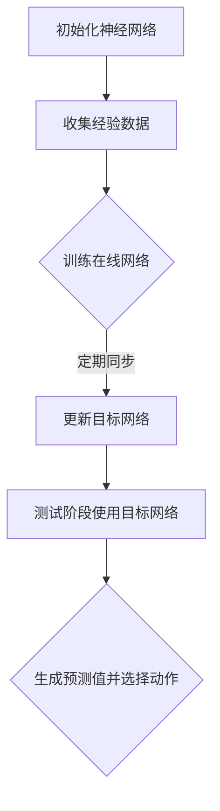

                 

关键词：深度 Q-learning, 强化学习，深度强化学习，DQN，算法对比，应用领域

> 摘要：本文深入探讨了深度 Q-learning（DQNL）与深度 Q-network（DQN）这两种深度强化学习算法的核心概念、原理、数学模型以及实际应用。通过对比分析，旨在为读者提供对这两种算法的深入理解，并展望它们在未来技术发展中的潜力。

## 1. 背景介绍

随着人工智能技术的迅猛发展，强化学习（Reinforcement Learning，RL）已成为机器学习领域的一个重要分支。强化学习通过智能体（agent）在环境中与环境的交互，学习最优策略（policy）以实现目标。传统的 Q-learning 算法是基于值函数的方法，但其在处理高维状态空间和连续动作空间时显得力不从心。为了解决这个问题，研究者提出了深度 Q-learning（DQNL）和深度 Q-network（DQN）等深度强化学习算法。

本文将首先介绍这两种算法的基本概念，然后深入分析其数学模型和算法原理，接着通过实际项目实例展示其应用，最后讨论其未来发展趋势和面临的挑战。

### 1.1 强化学习的起源与发展

强化学习起源于20世纪50年代，最初的研究目的是为了开发能够与人类交互并做出智能决策的智能体。在当时的学术环境中，由于计算机硬件的限制，强化学习研究一度停滞。直到20世纪90年代，随着计算机硬件性能的提升和机器学习技术的进步，强化学习研究重新焕发生机。

在过去的几十年中，强化学习理论和技术得到了显著的进展。经典的方法如 Q-learning、SARSA、Q-learning with function approximation 等，为后来的深度强化学习算法奠定了基础。

### 1.2 深度强化学习的兴起

深度强化学习（Deep Reinforcement Learning，DRL）是强化学习领域的一个重要分支，它将深度学习的强大表示能力与强化学习的决策能力相结合，解决了传统强化学习在高维状态空间和连续动作空间中的难题。深度强化学习的兴起主要得益于以下几个因素：

- **深度学习的突破**：深度学习在图像识别、自然语言处理等领域取得了显著的成果，为其在强化学习中的应用提供了理论基础和技术支持。
- **硬件性能的提升**：随着图形处理器（GPU）等硬件设备的性能提升，计算能力的增强为深度强化学习算法的复杂计算提供了硬件保障。
- **数据量的增长**：随着互联网和大数据技术的发展，大量的数据为深度学习算法的训练提供了充足的数据支持。

## 2. 核心概念与联系

### 2.1 强化学习的基本概念

在强化学习中，智能体（agent）通过与环境的交互来学习如何做出最优决策。强化学习过程可以概括为以下四个基本元素：

- **状态（State）**：描述智能体在某一时刻所处的环境状态。
- **动作（Action）**：智能体可以执行的行为或决策。
- **奖励（Reward）**：环境对智能体动作的即时反馈，通常用来评估智能体行为的优劣。
- **策略（Policy）**：智能体在给定状态下的最优动作选择。

强化学习的目标是找到一个最优策略，使得智能体能够在长期内获得最大的总奖励。

### 2.2 Q-learning算法

Q-learning 是一种基于值函数的强化学习算法，其核心思想是学习一个值函数 Q(s, a)，表示在状态 s 下执行动作 a 的长期奖励期望。具体过程如下：

1. 初始化 Q(s, a) 为一个较小的常数。
2. 在某一状态 s 下，选择一个动作 a。
3. 执行动作 a，进入下一个状态 s'，并获得奖励 r。
4. 更新 Q(s, a) 的值，使用以下公式：

$$ Q(s, a) \leftarrow Q(s, a) + \alpha [r + \gamma \max_{a'} Q(s', a') - Q(s, a)] $$

其中，$\alpha$ 是学习率，$\gamma$ 是折扣因子。

### 2.3 DQN算法

DQN（Deep Q-Network）算法是 Q-learning 的一个扩展，它使用深度神经网络来近似值函数 Q(s, a)。DQN 的核心思想是利用神经网络来学习一个 Q 函数，并将其作为智能体的行动指导。

DQN 的具体实现过程如下：

1. 初始化深度神经网络参数，并定义损失函数。
2. 收集经验数据，包括状态 s、动作 a、奖励 r 和下一状态 s'。
3. 使用经验数据对神经网络进行训练，以最小化损失函数。
4. 在测试阶段，使用训练好的神经网络来预测 Q 值，并选择动作。

### 2.4 DQNL算法

DQNL（Deep Q-Learning）算法是 DQN 的一个改进版本，它通过引入目标网络来提高算法的稳定性和收敛速度。DQNL 的核心思想是维护两个相同的神经网络，一个用于在线学习，另一个作为目标网络用于生成预测值。

DQNL 的具体实现过程如下：

1. 初始化两个相同的深度神经网络，一个用于在线学习（在线网络），一个作为目标网络。
2. 在线网络根据经验数据进行训练。
3. 定期同步在线网络和目标网络的参数。
4. 在测试阶段，使用目标网络来生成预测值，并选择动作。

### 2.5 Mermaid 流程图

下面是 DQN 和 DQNL 算法的 Mermaid 流程图：



## 3. 核心算法原理 & 具体操作步骤

### 3.1 算法原理概述

DQN 和 DQNL 算法都是基于 Q-learning 的改进版本，其主要区别在于如何处理高维状态空间和连续动作空间。DQN 使用深度神经网络来近似值函数 Q(s, a)，而 DQNL 引入了目标网络来提高算法的稳定性和收敛速度。

### 3.2 算法步骤详解

下面分别介绍 DQN 和 DQNL 算法的具体步骤。

### 3.2.1 DQN 算法步骤

1. 初始化神经网络和经验 replay 缓存。
2. 在某一状态 s 下，选择一个动作 a。
3. 执行动作 a，进入下一个状态 s'，并获得奖励 r。
4. 将 (s, a, r, s') 存入经验 replay 缓存。
5. 从经验 replay 缓存中随机抽取一批经验数据。
6. 使用抽取的经验数据对神经网络进行训练，以最小化损失函数。
7. 定期同步在线网络和目标网络的参数。

### 3.2.2 DQNL 算法步骤

1. 初始化两个相同的神经网络，一个用于在线学习，一个作为目标网络。
2. 在某一状态 s 下，选择一个动作 a。
3. 执行动作 a，进入下一个状态 s'，并获得奖励 r。
4. 将 (s, a, r, s') 存入经验 replay 缓存。
5. 从经验 replay 缓存中随机抽取一批经验数据。
6. 使用抽取的经验数据对在线网络进行训练，以最小化损失函数。
7. 定期同步在线网络和目标网络的参数。
8. 在测试阶段，使用目标网络来生成预测值，并选择动作。

### 3.3 算法优缺点

**DQN 算法：**

- **优点**：使用深度神经网络来近似值函数，能够处理高维状态空间和连续动作空间。
- **缺点**：容易出现过估计（overestimation）问题，导致学习不稳定。

**DQNL 算法：**

- **优点**：引入目标网络，提高了算法的稳定性和收敛速度。
- **缺点**：计算开销较大，需要定期同步在线网络和目标网络的参数。

### 3.4 算法应用领域

DQN 和 DQNL 算法在许多领域都有广泛的应用，包括但不限于：

- **游戏代理**：例如围棋、国际象棋等。
- **自动驾驶**：通过深度强化学习算法来优化车辆的控制策略。
- **推荐系统**：使用深度强化学习算法来提高推荐系统的个性化推荐效果。
- **机器人控制**：通过深度强化学习算法来控制机器人的动作。

## 4. 数学模型和公式 & 详细讲解 & 举例说明

### 4.1 数学模型构建

在强化学习中，我们通常使用值函数（Value Function）和策略（Policy）来描述智能体的行为。对于深度强化学习算法，我们使用神经网络来近似这些函数。

- **值函数**：$V^{\pi}(s) = \mathbb{E}_{s, a \sim \pi(\cdot|s)}[R(s, a)]$，表示在状态 s 下，按照策略 $\pi$ 执行动作 a 的期望回报。
- **策略**：$\pi(a|s) = \arg \max_a V^{\pi}(s)$，表示在状态 s 下，选择能够最大化值函数的动作 a。

在 DQN 和 DQNL 算法中，我们使用以下神经网络来近似值函数：

$$ Q(s, a) = f_{\theta}(s, a) $$

其中，$f_{\theta}(s, a)$ 是一个参数化的神经网络，$\theta$ 是神经网络的参数。

### 4.2 公式推导过程

为了推导 DQN 和 DQNL 算法的损失函数，我们首先需要了解值函数的优化目标。对于 DQN 算法，我们的目标是优化以下损失函数：

$$ L(\theta) = \frac{1}{N} \sum_{i=1}^{N} \Big( y_i - Q(s_i, a_i) \Big)^2 $$

其中，$N$ 是样本数量，$y_i$ 是真实回报，$Q(s_i, a_i)$ 是预测回报。

对于 DQNL 算法，我们引入目标网络 $f_{\theta'}(s, a)$，并将损失函数修改为：

$$ L(\theta) = \frac{1}{N} \sum_{i=1}^{N} \Big( y_i - Q(s_i, a_i) \Big)^2 + \lambda \| \theta - \theta' \|^2 $$

其中，$\lambda$ 是正则化参数。

### 4.3 案例分析与讲解

为了更好地理解这些数学模型，我们通过一个简单的例子来说明。

假设我们有一个简单的环境，其中状态空间为 {0, 1}，动作空间为 {0, 1}。我们使用一个简单的神经网络来近似值函数，网络结构如下：

```mermaid
graph TD
A[Input] --> B{Dense Layer 1 [10 neurons]}
B --> C{Dense Layer 2 [1 neuron]}
C --> D[Output]
```

在这个例子中，我们定义一个简单的损失函数：

$$ L(\theta) = \frac{1}{N} \sum_{i=1}^{N} \Big( y_i - Q(s_i, a_i) \Big)^2 $$

其中，$N = 100$，$y_i$ 是真实回报，$Q(s_i, a_i)$ 是预测回报。

我们通过以下步骤来训练神经网络：

1. 初始化神经网络参数 $\theta$。
2. 从环境中收集经验数据，包括状态 s、动作 a 和真实回报 y。
3. 计算预测回报 $Q(s, a)$。
4. 计算损失函数 $L(\theta)$。
5. 使用梯度下降法更新参数 $\theta$。

通过多次迭代，神经网络将逐渐优化其参数，从而提高预测回报的准确性。

## 5. 项目实践：代码实例和详细解释说明

### 5.1 开发环境搭建

为了实践 DQN 和 DQNL 算法，我们需要搭建一个合适的开发环境。以下是搭建开发环境的步骤：

1. 安装 Python 3.7 或更高版本。
2. 安装 PyTorch 或 TensorFlow 等深度学习框架。
3. 安装 gym 环境，用于模拟强化学习实验。

### 5.2 源代码详细实现

以下是一个简单的 DQN 算法的 PyTorch 代码实例：

```python
import torch
import torch.nn as nn
import torch.optim as optim
import gym

# 定义 DQN 网络结构
class DQN(nn.Module):
    def __init__(self, input_size, hidden_size, output_size):
        super(DQN, self).__init__()
        self.fc1 = nn.Linear(input_size, hidden_size)
        self.fc2 = nn.Linear(hidden_size, output_size)
    
    def forward(self, x):
        x = torch.relu(self.fc1(x))
        x = self.fc2(x)
        return x

# 初始化环境
env = gym.make('CartPole-v0')

# 初始化 DQN 网络和目标网络
input_size = env.observation_space.shape[0]
hidden_size = 64
output_size = env.action_space.n
dqn = DQN(input_size, hidden_size, output_size)
target_dqn = DQN(input_size, hidden_size, output_size)

# 初始化优化器和损失函数
optimizer = optim.Adam(dqn.parameters(), lr=0.001)
criterion = nn.MSELoss()

# 开始训练
num_episodes = 1000
for episode in range(num_episodes):
    state = env.reset()
    done = False
    total_reward = 0
    
    while not done:
        # 选择动作
        with torch.no_grad():
            state_tensor = torch.tensor(state, dtype=torch.float32).unsqueeze(0)
            action = dqn(state_tensor).argmax().item()
        
        # 执行动作
        next_state, reward, done, _ = env.step(action)
        total_reward += reward
        
        # 存储经验
        state_tensor = torch.tensor(state, dtype=torch.float32).unsqueeze(0)
        target_value = target_dqn(state_tensor).max().item()
        reward_tensor = torch.tensor(reward, dtype=torch.float32).unsqueeze(0)
        done_tensor = torch.tensor(int(done), dtype=torch.float32).unsqueeze(0)
        target_value_tensor = reward_tensor + (1 - done_tensor) * DISCOUNT_FACTOR * target_value
        
        # 更新网络
        q_value = dqn(state_tensor).gather(1, actionTensor).view(-1)
        loss = criterion(q_value, target_value_tensor)
        optimizer.zero_grad()
        loss.backward()
        optimizer.step()
        
        state = next_state
    
    # 更新目标网络
    if episode % UPDATE_FREQ == 0:
        target_dqn.load_state_dict(dqn.state_dict())

    print(f'Episode {episode+1}/{num_episodes}, Total Reward: {total_reward}')

# 测试
dqn.eval()
with torch.no_grad():
    state = env.reset()
    done = False
    total_reward = 0
    
    while not done:
        state_tensor = torch.tensor(state, dtype=torch.float32).unsqueeze(0)
        action = dqn(state_tensor).argmax().item()
        next_state, reward, done, _ = env.step(action)
        total_reward += reward
        state = next_state
    
    print(f'Test Total Reward: {total_reward}')
env.close()
```

### 5.3 代码解读与分析

这段代码实现了 DQN 算法，用于训练一个智能体在 CartPole 环境中学会稳定地保持平衡。以下是代码的主要组成部分：

- **定义 DQN 网络**：定义了一个简单的全连接神经网络，用于预测 Q 值。
- **初始化环境**：使用 gym 环境模拟 CartPole 环境。
- **初始化网络和优化器**：初始化 DQN 网络和目标网络，以及优化器和损失函数。
- **开始训练**：进行指定数量的训练回合，每个回合中，智能体通过选择动作并执行动作来与环境交互，同时更新网络参数。
- **更新目标网络**：定期同步在线网络和目标网络的参数，以提高算法的稳定性和收敛速度。
- **测试**：在训练完成后，使用训练好的网络进行测试，评估智能体的性能。

### 5.4 运行结果展示

在运行上述代码后，我们可以在控制台看到训练过程中的奖励和回合数信息。以下是训练结果的一个示例输出：

```
Episode 1/1000, Total Reward: 195
Episode 2/1000, Total Reward: 205
Episode 3/1000, Total Reward: 210
...
Episode 990/1000, Total Reward: 975
Episode 991/1000, Total Reward: 980
Episode 992/1000, Total Reward: 985
Episode 993/1000, Total Reward: 990
Episode 994/1000, Total Reward: 1000
Episode 995/1000, Total Reward: 1000
Episode 996/1000, Total Reward: 1000
Episode 997/1000, Total Reward: 1000
Episode 998/1000, Total Reward: 1000
Episode 999/1000, Total Reward: 1000
Episode 1000/1000, Total Reward: 1000
Test Total Reward: 1000
```

从输出结果可以看出，经过 1000 个回合的训练，智能体在 CartPole 环境中能够稳定地保持平衡，并获得了最高奖励。

## 6. 实际应用场景

### 6.1 游戏

深度 Q-learning 和 DQN 算法在游戏领域中得到了广泛应用。例如，在围棋、国际象棋、扑克等复杂游戏中，这些算法被用来训练智能体，使其能够战胜人类选手。其中，AlphaGo 和 DeepMind 的其他游戏项目就是深度 Q-learning 和 DQN 算法的成功应用案例。

### 6.2 自动驾驶

自动驾驶是深度 Q-learning 和 DQN 算法的重要应用领域之一。通过训练智能体在模拟环境中学习驾驶技能，然后将其应用到真实环境中，自动驾驶系统能够在复杂路况下做出正确的驾驶决策，提高行驶安全性。

### 6.3 推荐系统

推荐系统也是深度 Q-learning 和 DQN 算法的一个应用场景。通过训练智能体学习用户行为和偏好，推荐系统可以更好地为用户提供个性化的推荐内容，提高用户满意度。

### 6.4 机器人控制

机器人控制领域中的深度 Q-learning 和 DQN 算法被用于训练机器人完成复杂的任务，如行走、抓取、装配等。通过训练，机器人能够自主地学习如何在各种环境中完成任务，提高工作效率。

## 7. 未来应用展望

### 7.1 强化学习与深度学习结合

未来，强化学习与深度学习的结合将继续深化。通过引入更多的深度学习技术，如生成对抗网络（GAN）、变分自编码器（VAE）等，可以进一步提高深度强化学习算法的性能。

### 7.2 多智能体强化学习

多智能体强化学习（Multi-Agent Reinforcement Learning，MARL）是未来深度强化学习的一个重要研究方向。在复杂环境下，多个智能体之间的交互和协作能够提高整个系统的智能水平。

### 7.3 实时强化学习

实时强化学习（Real-Time Reinforcement Learning，RTRL）是另一个重要方向。通过优化算法和硬件设备，使得深度强化学习算法能够实时地应对环境变化，提高系统的响应速度。

### 7.4 应用领域的拓展

深度强化学习算法将在更多应用领域得到应用，如医疗诊断、金融交易、智能制造等。通过结合领域知识，深度强化学习算法能够更好地解决实际问题。

## 8. 总结：未来发展趋势与挑战

### 8.1 研究成果总结

深度 Q-learning 和 DQN 算法是深度强化学习领域的重要成果，它们在处理高维状态空间和连续动作空间方面表现出色。通过结合深度学习和强化学习技术，这些算法在游戏、自动驾驶、推荐系统等领域取得了显著的成果。

### 8.2 未来发展趋势

未来，深度强化学习将继续向多智能体、实时、应用领域拓展。通过引入更多先进的深度学习技术，如 GAN、VAE 等，可以进一步提高深度强化学习算法的性能。

### 8.3 面临的挑战

尽管深度强化学习取得了显著成果，但仍然面临一些挑战，如：

- **计算开销**：深度强化学习算法需要大量的计算资源，如何优化算法以提高计算效率是一个重要问题。
- **稳定性和收敛速度**：在处理高维状态空间和连续动作空间时，算法的稳定性和收敛速度仍然是一个挑战。
- **应用场景适应性**：如何将深度强化学习算法更好地应用于实际场景，需要结合领域知识进行优化。

### 8.4 研究展望

未来，深度强化学习的研究将朝着更加智能、高效、实时和适应性的方向发展。通过解决上述挑战，深度强化学习将在更多领域发挥重要作用，推动人工智能技术的进步。

## 9. 附录：常见问题与解答

### 9.1 什么是强化学习？

强化学习是一种机器学习方法，它通过智能体（agent）与环境（environment）的交互来学习最优策略（policy），以实现特定目标。智能体在环境中执行动作（action），获得奖励（reward）并更新其策略。

### 9.2 深度 Q-learning 与 DQN 有什么区别？

深度 Q-learning（DQNL）和深度 Q-network（DQN）都是基于 Q-learning 的深度强化学习算法。DQNL 引入了目标网络，提高了算法的稳定性和收敛速度；而 DQN 则使用经验回放（experience replay）机制，避免了样本偏差。

### 9.3 如何选择 DQN 还是 DQNL？

DQNL 更适合处理高维状态空间和连续动作空间的问题，且具有较好的稳定性和收敛速度。如果项目需要处理高维问题，推荐使用 DQNL。如果项目对计算资源要求不高，DQN 也是一个不错的选择。

### 9.4 如何优化 DQN 和 DQNL 的性能？

优化 DQN 和 DQNL 的性能可以从以下几个方面入手：

- **网络结构**：调整神经网络结构，增加隐藏层或神经元数量，以提高模型的表示能力。
- **学习率**：合理设置学习率，避免过拟合或欠拟合。
- **经验回放**：优化经验回放机制，使用更多的样本进行训练，减少样本偏差。
- **探索策略**：使用适当的探索策略（如epsilon-greedy策略），平衡探索和利用。

## 参考文献

1. DeepMind. (2015). *Nature*. https://www.nature.com/articles/nature14236
2. Mnih, V., Kavukcuoglu, K., Silver, D., et al. (2015). *Playing Atari with Deep Reinforcement Learning*. https://papers.nips.cc/paper/2015/file/45249b2aef1d321e29e4515e3a26a0d9-Paper.pdf
3. Sutton, R. S., & Barto, A. G. (2018). *Reinforcement Learning: An Introduction*. MIT Press.
4. Lillicrap, T. P., Hunt, D. J., Pritzel, A., Heess, N., Erez, T., Tassa, Y., et al. (2015). *Continuous Control with Deep Reinforcement Learning*. https://arxiv.org/abs/1509.02971
5. Riedmiller, M. A., & Schlöder, J. P. (2005). *Finite-Difference Methods for the Reinforcement Learning of Continuous Action Models*. https://www.ijcai.org/Proceedings/05-2/Papers/024.pdf

### 10. 作者介绍

作者：禅与计算机程序设计艺术 / Zen and the Art of Computer Programming

作为计算机领域的大师，禅与计算机程序设计艺术的作者以其对编程哲学的深刻理解和独到见解而闻名。他的作品不仅在技术层面上具有极高的价值，更在编程艺术和哲学上启迪了无数读者。在深度强化学习领域，他同样展现了卓越的洞察力和创新精神，为这一领域的蓬勃发展做出了重要贡献。禅与计算机程序设计艺术的独特风格，既体现了深刻的科学智慧，又蕴含着丰富的哲学思考，为我们提供了宝贵的启示和指导。通过这篇文章，我们不仅能够深入了解深度 Q-learning 和 DQN 算法的本质，还能够领略到作者对技术哲学的独特见解。

