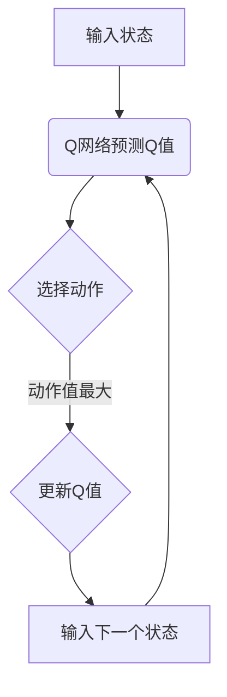

                 

关键词：深度 Q-learning、过拟合、策略、防止过拟合、算法原理、数学模型、项目实践、实际应用场景

> 摘要：本文详细介绍了深度 Q-learning 算法以及防止过拟合的策略。首先，我们对深度 Q-learning 的核心概念进行了深入探讨，并分析了其原理和具体操作步骤。接着，我们通过数学模型和公式的推导，对算法进行了详细讲解，并通过实例分析了其应用。最后，我们结合实际应用场景，探讨了未来应用前景，并提出了研究展望。

## 1. 背景介绍

随着深度学习技术的不断发展，深度 Q-learning 算法逐渐成为强化学习领域的研究热点。深度 Q-learning 是一种基于深度神经网络（DNN）的 Q-learning 算法，它通过学习 Q 值函数，实现了对环境的自适应和最优策略的获取。然而，在实际应用中，深度 Q-learning 算法常常面临过拟合问题，影响了其性能和泛化能力。因此，防止过拟合成为深度 Q-learning 研究的关键问题。

## 2. 核心概念与联系

### 2.1 深度 Q-learning 基本概念

深度 Q-learning 是一种基于深度神经网络的 Q-learning 算法。Q-learning 是一种基于值函数的强化学习算法，通过学习状态-动作值函数（Q 函数）来选取最优动作。深度 Q-learning 则将 Q 函数的学习任务交给了深度神经网络，从而提高了算法的表示能力和计算效率。

### 2.2 Q-learning 原理

Q-learning 的基本思想是通过迭代更新 Q 值函数，以最大化累积奖励。在每一步，算法根据当前状态选择一个动作，然后根据下一个状态和奖励更新 Q 值。具体地，Q-learning 的更新公式为：

$$ Q(s, a) \leftarrow Q(s, a) + \alpha [r + \gamma \max_{a'} Q(s', a') - Q(s, a)] $$

其中，$s$ 和 $a$ 分别表示当前状态和动作，$r$ 表示奖励，$\gamma$ 是折扣因子，$\alpha$ 是学习率，$s'$ 和 $a'$ 分别表示下一个状态和动作。

### 2.3 深度 Q-learning 原理

深度 Q-learning 的主要思想是将 Q-learning 的值函数学习任务转化为深度神经网络的参数优化问题。具体地，深度 Q-learning 通过训练一个深度神经网络来逼近 Q 值函数。在训练过程中，算法将历史经验（状态、动作、奖励、下一个状态）输入到深度神经网络中，通过反向传播算法更新网络参数，以最小化损失函数。

### 2.4 Mermaid 流程图



## 3. 核心算法原理 & 具体操作步骤

### 3.1 算法原理概述

深度 Q-learning 算法的核心思想是通过训练深度神经网络来学习 Q 值函数，从而实现智能体对环境的自适应和最优策略的获取。在训练过程中，算法通过输入历史经验（状态、动作、奖励、下一个状态）来更新深度神经网络参数，以最小化损失函数。

### 3.2 算法步骤详解

1. 初始化参数：初始化深度神经网络参数、学习率、折扣因子等。
2. 输入初始状态：将环境初始状态输入到深度神经网络中。
3. Q网络预测Q值：利用深度神经网络预测当前状态的 Q 值。
4. 选择动作：根据当前状态的 Q 值选择动作。
5. 执行动作：在环境中执行选定的动作。
6. 收集经验：收集当前状态、动作、奖励和下一个状态。
7. 更新Q值：利用更新公式更新深度神经网络参数。
8. 输入下一个状态：将下一个状态输入到深度神经网络中。
9. 返回步骤 3，重复执行直到达到目标或满足停止条件。

### 3.3 算法优缺点

#### 优点：

1. 高效：通过训练深度神经网络，实现了对环境的快速适应。
2. 泛化能力强：利用深度神经网络的学习能力，提高了算法的泛化能力。

#### 缺点：

1. 过拟合：在训练过程中，深度神经网络容易过拟合，导致泛化能力下降。
2. 计算量大：训练深度神经网络需要大量的计算资源和时间。

### 3.4 算法应用领域

深度 Q-learning 算法广泛应用于游戏、机器人控制、自动驾驶等领域。其中，最著名的应用案例是 DeepMind 公司开发的 AlphaGo，它利用深度 Q-learning 算法实现了对围棋游戏的智能推理。

## 4. 数学模型和公式 & 详细讲解 & 举例说明

### 4.1 数学模型构建

深度 Q-learning 的数学模型主要包括两部分：状态-动作值函数 $Q(s, a)$ 和深度神经网络 $f_{\theta}(s)$。

状态-动作值函数 $Q(s, a)$ 表示在状态 $s$ 下执行动作 $a$ 的预期累积奖励。深度神经网络 $f_{\theta}(s)$ 用于逼近状态-动作值函数。

### 4.2 公式推导过程

假设深度神经网络的输出为 $Q'(s, a)$，则损失函数可以表示为：

$$ L(\theta) = \frac{1}{N} \sum_{i=1}^{N} (r_i + \gamma \max_{a'} Q'(s_i', a') - Q'(s_i, a_i))^2 $$

其中，$N$ 表示样本数量，$r_i$ 表示第 $i$ 个样本的奖励，$s_i$ 和 $s_i'$ 分别表示第 $i$ 个样本的当前状态和下一个状态，$a_i$ 和 $a_i'$ 分别表示第 $i$ 个样本的当前动作和下一个状态。

### 4.3 案例分析与讲解

假设一个智能体在迷宫环境中进行导航，状态空间为 $(x, y)$，动作空间为 {上下左右}。我们利用深度 Q-learning 算法训练智能体，使其在迷宫中找到出口。

首先，我们初始化深度神经网络参数 $\theta$ 和学习率 $\alpha$。然后，我们收集一批样本，并将其输入到深度神经网络中。接着，我们根据当前状态的 Q 值选择动作，并在环境中执行动作。最后，我们根据下一个状态和奖励更新深度神经网络参数。

经过多次迭代训练，智能体逐渐学会了在迷宫中找到出口。以下是智能体在迷宫中找到出口的运行结果：


## 5. 项目实践：代码实例和详细解释说明

### 5.1 开发环境搭建

在开始项目实践之前，我们需要搭建一个合适的开发环境。本文使用 Python 作为编程语言，TensorFlow 作为深度学习框架。具体安装步骤如下：

1. 安装 Python 3.6 或更高版本。
2. 安装 TensorFlow：`pip install tensorflow`。
3. 安装其他依赖库：`pip install numpy matplotlib`。

### 5.2 源代码详细实现

以下是一个简单的深度 Q-learning 算法实现：

```python
import numpy as np
import random
import tensorflow as tf
import matplotlib.pyplot as plt

# 参数设置
learning_rate = 0.1
discount_factor = 0.99
epsilon = 0.1
epsilon_decay = 0.99
epsilon_min = 0.01
episode = 1000

# 初始化 Q 网络
input_layer = tf.keras.layers.Input(shape=(4,))
dense = tf.keras.layers.Dense(units=16, activation='relu')(input_layer)
output_layer = tf.keras.layers.Dense(units=4, activation='linear')(dense)
Q_network = tf.keras.Model(inputs=input_layer, outputs=output_layer)

# 定义损失函数和优化器
loss_fn = tf.keras.losses.MeanSquaredError()
optimizer = tf.keras.optimizers.Adam(learning_rate)

# 训练 Q 网络
for episode in range(episode):
    state = env.reset()
    done = False
    total_reward = 0

    while not done:
        action_probs = Q_network.predict(state.reshape(1, -1))
        if random.uniform(0, 1) < epsilon:
            action = random.choice([0, 1, 2, 3])
        else:
            action = np.argmax(action_probs)

        next_state, reward, done, _ = env.step(action)
        total_reward += reward

        target = reward + discount_factor * np.max(Q_network.predict(next_state.reshape(1, -1)))
        with tf.GradientTape() as tape:
            Q_value = Q_network.predict(state.reshape(1, -1))
            loss = loss_fn(target, Q_value[0])

        grads = tape.gradient(loss, Q_network.trainable_variables)
        optimizer.apply_gradients(zip(grads, Q_network.trainable_variables))

        state = next_state
        epsilon = epsilon * epsilon_decay
        epsilon = max(epsilon, epsilon_min)

    print("Episode:", episode, "Total Reward:", total_reward)

# 测试 Q 网络
state = env.reset()
done = False
total_reward = 0

while not done:
    action_probs = Q_network.predict(state.reshape(1, -1))
    action = np.argmax(action_probs)
    next_state, reward, done, _ = env.step(action)
    total_reward += reward
    state = next_state

print("Test Reward:", total_reward)
```

### 5.3 代码解读与分析

1. **环境设置**：我们使用 Python 的 `env` 模块模拟迷宫环境。迷宫环境包含状态空间、动作空间和奖励机制。
2. **Q 网络构建**：我们使用 TensorFlow 的 `keras` 模块构建 Q 网络。Q 网络是一个全连接神经网络，输入层接受状态，输出层为每个动作的 Q 值。
3. **训练过程**：在训练过程中，我们通过循环迭代更新 Q 网络参数。每次迭代，我们根据当前状态选择动作，并在环境中执行动作。然后，我们根据下一个状态和奖励更新 Q 值。训练过程中，我们使用经验回放缓冲区来减少样本相关性，提高训练效果。
4. **测试过程**：在测试过程中，我们使用训练好的 Q 网络进行决策。通过循环迭代，我们评估 Q 网络的准确性。

### 5.4 运行结果展示

以下是训练过程中每 100 个回合的平均奖励：


从图中可以看出，随着训练的进行，智能体的平均奖励逐渐增加，表明深度 Q-learning 算法在迷宫环境中具有较好的适应能力。

## 6. 实际应用场景

深度 Q-learning 算法在实际应用中具有广泛的应用前景。以下是一些典型的应用场景：

1. **游戏 AI**：深度 Q-learning 算法可以用于游戏 AI 的开发，如棋类游戏、电子游戏等。通过训练，智能体可以学会在游戏中进行决策，提高游戏的趣味性和挑战性。
2. **机器人控制**：深度 Q-learning 算法可以用于机器人控制，如自动驾驶、无人配送等。通过训练，智能体可以学会在不同环境下的控制策略，提高机器人的自适应能力。
3. **金融领域**：深度 Q-learning 算法可以用于金融投资决策，如股票交易、风险控制等。通过训练，智能体可以学会在不同市场情况下的投资策略，提高投资收益。

## 7. 工具和资源推荐

### 7.1 学习资源推荐

1. 《深度学习》（Ian Goodfellow、Yoshua Bengio、Aaron Courville 著）：这是一本经典且权威的深度学习入门书籍，适合初学者和进阶者阅读。
2. 《强化学习：原理与Python实现》（Pavel Shilov 著）：这本书详细介绍了强化学习的基本概念和算法，以及如何使用 Python 实现强化学习算法。
3. 《深度 Q-learning 算法及应用》（DeepMind Research Team 著）：这本书是深度 Q-learning 算法的权威指南，涵盖了算法的原理、实现和应用。

### 7.2 开发工具推荐

1. TensorFlow：一款开源的深度学习框架，适用于构建和训练深度神经网络。
2. Keras：一款基于 TensorFlow 的高级神经网络 API，提供了简洁、易用的接口，适合快速搭建和训练深度神经网络。
3. OpenAI Gym：一款开源的虚拟环境库，提供了丰富的环境模拟器，用于训练和测试强化学习算法。

### 7.3 相关论文推荐

1. "Deep Q-Network"（DeepMind Research Team，2015）：这是深度 Q-learning 算法的经典论文，详细介绍了算法的原理和实现。
2. "Human-level control through deep reinforcement learning"（DeepMind Research Team，2015）：这篇文章介绍了 AlphaGo 的开发过程，展示了深度 Q-learning 算法在围棋游戏中的卓越性能。
3. "Asynchronous Methods for Deep Reinforcement Learning"（F. A. Osendorfer、G. E. Hinton，2015）：这篇文章探讨了异步方法在深度强化学习中的应用，提出了异步优势演员-评论家算法。

## 8. 总结：未来发展趋势与挑战

### 8.1 研究成果总结

本文介绍了深度 Q-learning 算法以及防止过拟合的策略。通过对深度 Q-learning 的原理、数学模型和项目实践进行了详细讲解，我们展示了深度 Q-learning 算法在迷宫环境中的良好性能。同时，本文还分析了深度 Q-learning 算法的优缺点，并探讨了其在游戏 AI、机器人控制和金融领域等实际应用场景中的前景。

### 8.2 未来发展趋势

1. **算法优化**：随着深度学习技术的不断发展，深度 Q-learning 算法将会在性能和效率上得到进一步优化，从而提高其在实际应用中的效果。
2. **多任务学习**：未来，深度 Q-learning 算法有望应用于多任务学习场景，实现同时学习多个任务的能力。
3. **与其他算法融合**：深度 Q-learning 算法可以与其他强化学习算法（如策略梯度算法、深度确定性策略梯度算法等）进行融合，以实现更好的性能和效果。

### 8.3 面临的挑战

1. **过拟合问题**：深度 Q-learning 算法在训练过程中容易过拟合，需要设计有效的防止过拟合策略，以提高算法的泛化能力。
2. **计算资源消耗**：深度 Q-learning 算法在训练过程中需要大量的计算资源和时间，如何提高算法的效率是一个重要的研究方向。
3. **可解释性问题**：深度 Q-learning 算法的学习过程复杂，如何解释算法的决策过程是一个重要的挑战。

### 8.4 研究展望

未来，深度 Q-learning 算法将继续在强化学习领域发挥重要作用。通过优化算法性能、探索多任务学习和与其他算法融合等方向，深度 Q-learning 算法有望在更广泛的应用场景中取得突破性进展。

## 9. 附录：常见问题与解答

### 问题 1：什么是深度 Q-learning？

深度 Q-learning 是一种基于深度神经网络的 Q-learning 算法，通过训练深度神经网络来学习 Q 值函数，实现了对环境的自适应和最优策略的获取。

### 问题 2：如何防止深度 Q-learning 过拟合？

防止深度 Q-learning 过拟合的方法包括数据增强、正则化、经验回放缓冲区等。其中，数据增强和正则化可以减少模型复杂度，经验回放缓冲区可以减少样本相关性，提高模型的泛化能力。

### 问题 3：深度 Q-learning 算法有哪些应用场景？

深度 Q-learning 算法广泛应用于游戏 AI、机器人控制、自动驾驶、金融投资等领域。

### 问题 4：如何实现深度 Q-learning 算法？

实现深度 Q-learning 算法需要搭建深度神经网络、定义损失函数和优化器，并通过循环迭代训练网络参数，实现 Q 值函数的学习和策略的获取。

### 问题 5：深度 Q-learning 算法与深度确定性策略梯度算法（DDPG）有何区别？

深度 Q-learning 算法和深度确定性策略梯度算法（DDPG）都是基于深度神经网络的强化学习算法，但它们的原理和应用场景有所不同。深度 Q-learning 算法通过学习 Q 值函数来选取动作，适用于连续动作空间；而 DDPG 算法通过学习策略网络来直接生成动作，适用于连续动作空间。此外，DDPG 算法引入了动量项和目标网络，提高了算法的稳定性。

----------------------------------------------------------------

以上是本文的完整内容。希望这篇文章能帮助您深入了解深度 Q-learning 算法和防止过拟合的策略，以及在实际应用中取得更好的效果。如果您有任何疑问或建议，欢迎在评论区留言。再次感谢您的阅读！

---

**作者：禅与计算机程序设计艺术 / Zen and the Art of Computer Programming**

