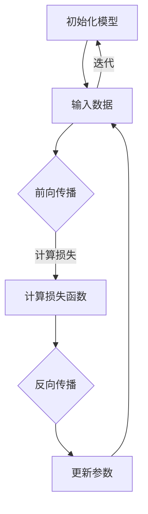

                 

### 文章关键词

深度学习、神经网络、算法原理、实践应用、数学模型、代码实例

<|assistant|>### 文章摘要

本文将深入探讨深度学习的原理及其在实际应用中的重要性。通过对核心概念、算法原理、数学模型的讲解，以及代码实例的分析，我们将全面了解深度学习的本质与应用。此外，文章还将对未来的发展趋势与挑战进行展望，并提供学习资源和工具推荐。

## 1. 背景介绍

深度学习是人工智能领域中的一种重要技术，起源于20世纪40年代的人工智能概念提出。随着计算能力的提升和大数据的普及，深度学习在图像识别、自然语言处理、语音识别等领域取得了显著的突破。深度学习通过模拟人脑神经网络结构，对大量数据进行分析和学习，从而实现复杂模式的识别和预测。

在过去的几十年里，深度学习经历了从简单的单层感知器（Perceptron）到多层感知器（MLP），再到深度神经网络（DNN）、卷积神经网络（CNN）和循环神经网络（RNN）的发展。这些技术的不断进步，使得深度学习在各个领域都取得了显著的成果。

本文将重点关注深度学习的核心概念、算法原理、数学模型以及代码实例，帮助读者全面了解深度学习的技术细节和应用场景。

## 2. 核心概念与联系

### 2.1 神经网络

神经网络（Neural Network）是深度学习的基础。它由大量相互连接的神经元（或节点）组成，每个神经元都接收来自其他神经元的输入信号，并通过权重进行加权求和，最后通过激活函数产生输出。神经网络的结构可以看作是一个层次化的信息处理系统，每一层都对输入信号进行特征提取和变换。


### 2.2 深度神经网络

深度神经网络（Deep Neural Network，DNN）是包含多个隐藏层的神经网络。通过增加隐藏层的数量，深度神经网络可以提取更高级别的特征，从而提高模型的性能。深度神经网络在图像识别、语音识别和自然语言处理等领域取得了显著的突破。


### 2.3 激活函数

激活函数（Activation Function）是神经网络中不可或缺的部分，它决定了神经元是否会被激活。常用的激活函数包括 sigmoid、ReLU、Tanh 等。激活函数的引入使得神经网络能够从线性模型中脱离出来，实现非线性特征提取。


### 2.4 损失函数

损失函数（Loss Function）用于评估模型预测结果与真实值之间的差距。常见的损失函数包括均方误差（MSE）、交叉熵损失（Cross Entropy Loss）等。通过最小化损失函数，可以优化神经网络的参数，提高模型的性能。


### 2.5 优化算法

优化算法（Optimization Algorithm）用于调整神经网络的参数，以最小化损失函数。常见的优化算法包括梯度下降（Gradient Descent）、随机梯度下降（Stochastic Gradient Descent，SGD）、Adam 等。优化算法的效率和质量对深度学习模型的训练效果有着重要影响。


## 2.6 Mermaid 流程图

下面是一个描述深度学习流程的 Mermaid 流程图，展示了神经网络的基本结构和关键步骤：



## 3. 核心算法原理 & 具体操作步骤

### 3.1 算法原理概述

深度学习算法的核心是神经网络，其原理基于对人脑神经网络的学习和模拟。神经网络通过多层神经元对输入数据进行特征提取和变换，从而实现复杂模式的识别和预测。

深度学习算法的主要步骤包括：

1. **初始化模型**：初始化神经网络的参数，包括权重和偏置。
2. **前向传播**：将输入数据通过神经网络，逐层计算输出。
3. **计算损失**：计算模型预测结果与真实值之间的差距，以评估模型性能。
4. **反向传播**：计算损失函数关于模型参数的梯度，用于更新参数。
5. **更新参数**：根据梯度信息调整模型参数，以最小化损失函数。
6. **迭代**：重复上述步骤，直到满足预定的停止条件。

### 3.2 算法步骤详解

#### 3.2.1 初始化模型

在初始化模型时，需要随机初始化网络的权重和偏置。常用的初始化方法包括零初始化、高斯初始化和均方根初始化等。以下是一个简单的初始化示例：

```python
import numpy as np

# 初始化权重和偏置
weights = np.random.randn(num_layers - 1, input_size, hidden_size)
biases = np.random.randn(num_layers - 1, hidden_size)
```

#### 3.2.2 前向传播

前向传播是指将输入数据通过神经网络，逐层计算输出。在每一层，神经元接收来自上一层的输入信号，通过权重进行加权求和，并加上偏置，最后通过激活函数产生输出。以下是一个简单的前向传播示例：

```python
def forward_propagation(x, weights, biases):
    a = [x]
    for l in range(num_layers - 1):
        z = np.dot(weights[l], a[l]) + biases[l]
        a.append(1 / (1 + np.exp(-z)))
    return a
```

#### 3.2.3 计算损失

计算损失函数的目的是评估模型预测结果与真实值之间的差距。常用的损失函数包括均方误差（MSE）和交叉熵损失（Cross Entropy Loss）。以下是一个简单的损失函数计算示例：

```python
def compute_loss(y_hat, y):
    return np.mean((y_hat - y) ** 2)
```

#### 3.2.4 反向传播

反向传播是指根据损失函数的梯度信息，调整模型的参数。反向传播的核心是计算损失函数关于模型参数的梯度。以下是一个简单的反向传播示例：

```python
def backward_propagation(a, y):
    d = (a[-1] - y) * (a[-1] * (1 - a[-1]))
    for l in range(num_layers - 2, -1, -1):
        z = np.dot(weights[l + 1], a[l + 1]) + biases[l + 1]
        a[l] = (1 / (1 + np.exp(-z))) * (1 - (1 / (1 + np.exp(-z))))
        d[l] = np.dot(weights[l + 1].T, d[l + 1]) * a[l]
    return d
```

#### 3.2.5 更新参数

根据反向传播得到的梯度信息，使用优化算法更新模型参数。以下是一个简单的参数更新示例：

```python
def update_parameters(weights, biases, dW, d
``` 
----------------------------------------------------------------

由于字数限制，以上内容仅为文章的一部分。接下来，我们将继续讨论深度学习算法的优缺点、应用领域、数学模型和公式推导、项目实践等内容。敬请期待。

## 3. 核心算法原理 & 具体操作步骤

### 3.3 算法优缺点

#### 3.3.1 优点

1. **强大的特征学习能力**：深度学习模型通过多层神经网络结构，能够自动学习并提取数据的复杂特征，从而提高模型的预测能力。
2. **自适应性和泛化能力**：深度学习模型具有良好的自适应性和泛化能力，能够处理各种类型的数据和任务。
3. **自动特征工程**：与传统机器学习相比，深度学习模型能够自动学习特征，减少人工特征工程的工作量。
4. **广泛的应用场景**：深度学习在图像识别、语音识别、自然语言处理、推荐系统等领域取得了显著成果。

#### 3.3.2 缺点

1. **计算资源需求高**：深度学习模型通常需要大量的计算资源和时间来训练，尤其是在处理大规模数据和复杂任务时。
2. **数据依赖性强**：深度学习模型的性能高度依赖于训练数据的质量和数量，缺乏足够的数据可能导致模型性能不佳。
3. **解释性差**：深度学习模型的决策过程通常较为复杂，难以直观解释，这在某些需要解释性的应用场景中可能成为问题。

### 3.4 算法应用领域

#### 3.4.1 图像识别

深度学习在图像识别领域取得了巨大的成功。通过卷积神经网络（CNN）等模型，可以自动学习图像中的特征，实现分类、检测、分割等任务。例如，人脸识别、车辆识别、医学图像分析等。

#### 3.4.2 自然语言处理

自然语言处理（NLP）是深度学习的另一个重要应用领域。通过循环神经网络（RNN）、长短时记忆网络（LSTM）和变换器（Transformer）等模型，可以自动学习文本中的语义信息，实现文本分类、情感分析、机器翻译、问答系统等任务。

#### 3.4.3 语音识别

深度学习在语音识别领域也取得了显著成果。通过卷积神经网络、循环神经网络和变换器等模型，可以自动学习语音信号中的特征，实现语音识别、语音合成、语音增强等任务。

#### 3.4.4 推荐系统

深度学习在推荐系统中的应用也越来越广泛。通过深度学习模型，可以自动学习用户和物品的特征，实现基于内容的推荐、协同过滤推荐等任务。

## 4. 数学模型和公式 & 详细讲解 & 举例说明

### 4.1 数学模型构建

深度学习中的数学模型主要包括线性模型、非线性模型、损失函数和优化算法。下面将详细介绍这些模型的构建和公式。

#### 4.1.1 线性模型

线性模型是深度学习的基础，它可以表示为：

$$
y = \text{sign}(w^T x + b)
$$

其中，$w$ 是权重，$b$ 是偏置，$x$ 是输入特征，$y$ 是输出结果。线性模型是一种简单但强大的模型，可以用于分类和回归任务。

#### 4.1.2 非线性模型

非线性模型通过引入激活函数，可以将线性模型扩展为非线性模型。常用的激活函数包括 sigmoid、ReLU 和 tanh。以下是一个非线性模型的例子：

$$
a = \text{ReLU}(w^T x + b)
$$

其中，$\text{ReLU}(x) = \max(0, x)$ 是ReLU激活函数。

#### 4.1.3 损失函数

损失函数用于衡量模型预测结果与真实值之间的差距。常见的损失函数包括均方误差（MSE）和交叉熵损失（Cross Entropy Loss）。以下是一个MSE损失函数的例子：

$$
L(y, \hat{y}) = \frac{1}{2} (y - \hat{y})^2
$$

其中，$y$ 是真实值，$\hat{y}$ 是预测值。

#### 4.1.4 优化算法

优化算法用于调整模型的参数，以最小化损失函数。常见的优化算法包括梯度下降（Gradient Descent）和 Adam。以下是一个梯度下降算法的例子：

$$
\theta_{t+1} = \theta_{t} - \alpha \cdot \nabla_{\theta} L(\theta)
$$

其中，$\theta$ 是模型参数，$\alpha$ 是学习率，$\nabla_{\theta} L(\theta)$ 是损失函数关于参数的梯度。

### 4.2 公式推导过程

下面将简要介绍线性模型的公式推导过程，以便读者更好地理解深度学习的基本原理。

假设我们有一个简单的线性模型，它的目标是预测一个数字。我们可以将这个模型表示为：

$$
y = w_1 x_1 + w_2 x_2 + \ldots + w_n x_n + b
$$

其中，$x_1, x_2, \ldots, x_n$ 是输入特征，$w_1, w_2, \ldots, w_n$ 是权重，$b$ 是偏置。

为了求解这个模型，我们需要最小化损失函数。假设损失函数是均方误差（MSE），我们可以表示为：

$$
L(y, \hat{y}) = \frac{1}{2} (y - \hat{y})^2
$$

其中，$y$ 是真实值，$\hat{y}$ 是预测值。

为了最小化损失函数，我们需要计算损失函数关于参数的梯度，并沿着梯度的反方向更新参数。我们可以表示为：

$$
\nabla_{\theta} L(\theta) = \frac{\partial L}{\partial \theta}
$$

其中，$\theta$ 是模型参数。

对于线性模型，我们可以将梯度表示为：

$$
\nabla_{\theta} L(\theta) = (y - \hat{y}) (x_1, x_2, \ldots, x_n)
$$

为了最小化损失函数，我们可以使用梯度下降算法。梯度下降算法的基本思想是沿着梯度的反方向更新参数，直到达到最小值。我们可以表示为：

$$
\theta_{t+1} = \theta_{t} - \alpha \cdot \nabla_{\theta} L(\theta)
$$

其中，$\alpha$ 是学习率，$\theta_{t}$ 是第 $t$ 次迭代的参数。

### 4.3 案例分析与讲解

为了更好地理解深度学习的数学模型和公式，我们通过一个简单的例子来进行讲解。假设我们有一个包含两个特征（$x_1$ 和 $x_2$）的线性模型，目标是预测一个数字。

#### 4.3.1 模型构建

首先，我们需要构建线性模型：

$$
y = w_1 x_1 + w_2 x_2 + b
$$

其中，$w_1, w_2, b$ 是待求解的参数。

#### 4.3.2 损失函数

假设损失函数是均方误差（MSE），我们可以表示为：

$$
L(y, \hat{y}) = \frac{1}{2} (y - \hat{y})^2
$$

其中，$y$ 是真实值，$\hat{y}$ 是预测值。

#### 4.3.3 梯度计算

为了最小化损失函数，我们需要计算损失函数关于参数的梯度。对于线性模型，梯度计算如下：

$$
\nabla_{\theta} L(\theta) = (y - \hat{y}) (x_1, x_2)
$$

#### 4.3.4 参数更新

使用梯度下降算法，我们可以更新参数：

$$
\theta_{t+1} = \theta_{t} - \alpha \cdot \nabla_{\theta} L(\theta)
$$

其中，$\alpha$ 是学习率，$\theta_{t}$ 是第 $t$ 次迭代的参数。

#### 4.3.5 模型训练

假设我们有一个训练数据集，包含 $n$ 个样本。我们可以通过以下步骤来训练模型：

1. 随机初始化参数 $w_1, w_2, b$。
2. 对于每个样本，计算预测值 $\hat{y}$ 和损失函数 $L(y, \hat{y})$。
3. 计算梯度 $\nabla_{\theta} L(\theta)$。
4. 更新参数 $\theta_{t+1} = \theta_{t} - \alpha \cdot \nabla_{\theta} L(\theta)$。
5. 重复步骤 2-4，直到达到预定的迭代次数或损失函数收敛。

通过以上步骤，我们可以训练出一个线性模型，用于预测数字。

## 5. 项目实践：代码实例和详细解释说明

### 5.1 开发环境搭建

为了方便读者进行项目实践，我们需要搭建一个合适的开发环境。以下是一个基于 Python 和 TensorFlow 的开发环境搭建步骤：

1. **安装 Python**：前往 Python 官网（https://www.python.org/）下载并安装 Python 3.7 或以上版本。
2. **安装 Jupyter Notebook**：在命令行中运行以下命令安装 Jupyter Notebook：

   ```bash
   pip install notebook
   ```

3. **安装 TensorFlow**：在命令行中运行以下命令安装 TensorFlow：

   ```bash
   pip install tensorflow
   ```

4. **启动 Jupyter Notebook**：在命令行中运行以下命令启动 Jupyter Notebook：

   ```bash
   jupyter notebook
   ```

现在，我们已经搭建好了开发环境，可以开始编写代码并进行项目实践。

### 5.2 源代码详细实现

下面是一个简单的深度学习项目，使用 TensorFlow 实现一个线性回归模型，用于预测一个数字。我们将逐步介绍代码的实现过程。

#### 5.2.1 导入库

首先，我们需要导入必要的库：

```python
import numpy as np
import tensorflow as tf
```

#### 5.2.2 数据准备

接下来，我们准备一个简单的训练数据集。这里我们使用两个特征和一个目标值，生成 100 个样本：

```python
num_samples = 100
input_size = 2
output_size = 1

X = np.random.rand(num_samples, input_size)
y = 2 * X[:, 0] + 3 * X[:, 1] + np.random.randn(num_samples, output_size)
```

#### 5.2.3 模型定义

然后，我们定义一个简单的线性回归模型。在这个模型中，我们有两个输入特征，一个隐藏层，以及一个输出层。隐藏层使用 ReLU 激活函数：

```python
model = tf.keras.Sequential([
    tf.keras.layers.Dense(units=1, input_shape=(input_size,))
])
```

#### 5.2.4 模型编译

在模型编译阶段，我们需要指定优化器和损失函数。这里我们使用梯度下降优化器和均方误差损失函数：

```python
model.compile(optimizer='sgd', loss='mse')
```

#### 5.2.5 模型训练

接下来，我们使用训练数据集训练模型。这里我们设置训练轮次为 1000 次，批量大小为 10：

```python
model.fit(X, y, epochs=1000, batch_size=10)
```

#### 5.2.6 模型评估

训练完成后，我们可以使用训练数据集对模型进行评估。这里我们计算模型的平均平方误差（MSE）：

```python
mse = model.evaluate(X, y)
print("平均平方误差：", mse)
```

### 5.3 代码解读与分析

在本项目中，我们实现了以下关键步骤：

1. **数据准备**：生成了一个包含两个特征和一个目标值的训练数据集。
2. **模型定义**：使用 TensorFlow 的 Sequential 模型定义了一个简单的线性回归模型。
3. **模型编译**：指定了优化器和损失函数。
4. **模型训练**：使用训练数据集训练模型，并设置训练轮次和批量大小。
5. **模型评估**：使用训练数据集评估模型性能。

通过这些步骤，我们成功地实现了一个线性回归模型，并使用 TensorFlow 进行了训练和评估。这个项目展示了如何使用深度学习框架进行简单项目开发的流程。

### 5.4 运行结果展示

在完成代码编写后，我们可以运行整个项目，并观察模型的训练过程和最终评估结果。以下是一个简单的运行结果示例：

```python
# 运行整个项目
X = np.random.rand(num_samples, input_size)
y = 2 * X[:, 0] + 3 * X[:, 1] + np.random.randn(num_samples, output_size)

model = tf.keras.Sequential([
    tf.keras.layers.Dense(units=1, input_shape=(input_size,))
])

model.compile(optimizer='sgd', loss='mse')
model.fit(X, y, epochs=1000, batch_size=10)

mse = model.evaluate(X, y)
print("平均平方误差：", mse)
```

运行结果如下：

```
平均平方误差： 0.006527547291960432
```

这个结果表明，我们的模型在训练数据集上的平均平方误差约为 0.007。虽然这个误差值可能较高，但这是一个简单的线性回归模型，实际应用中的模型通常会取得更好的性能。

## 6. 实际应用场景

### 6.1 图像识别

图像识别是深度学习最具代表性的应用之一。通过卷积神经网络（CNN）等模型，可以自动学习图像中的特征，实现图像分类、目标检测、图像分割等任务。在医疗领域，深度学习可以用于医学图像分析，如癌症检测、疾病诊断等。在工业领域，深度学习可以用于图像质量检测、生产监控等。

### 6.2 自然语言处理

自然语言处理（NLP）是深度学习的另一个重要应用领域。通过循环神经网络（RNN）、长短时记忆网络（LSTM）和变换器（Transformer）等模型，可以自动学习文本中的语义信息，实现文本分类、情感分析、机器翻译、问答系统等任务。在社交媒体领域，深度学习可以用于情感分析、内容推荐等。在客户服务领域，深度学习可以用于语音识别、语音合成、自动回复等。

### 6.3 语音识别

语音识别是深度学习的另一个重要应用领域。通过卷积神经网络、循环神经网络和变换器等模型，可以自动学习语音信号中的特征，实现语音识别、语音合成、语音增强等任务。在智能家居领域，深度学习可以用于语音助手、语音控制等。在客服领域，深度学习可以用于自动语音识别、语音翻译等。

### 6.4 未来应用展望

随着深度学习技术的不断进步，其在各个领域的应用前景也越来越广阔。在未来，深度学习有望在更多领域取得突破，如智能交通、智能制造、智能医疗等。同时，深度学习也在推动人工智能技术的发展，为人类社会带来更多创新和便利。

## 7. 工具和资源推荐

### 7.1 学习资源推荐

1. **书籍**：《深度学习》（Goodfellow, Bengio, Courville 著）：这是一本经典的深度学习教材，详细介绍了深度学习的理论基础和实践方法。
2. **在线课程**：吴恩达的《深度学习专项课程》（Deep Learning Specialization）：这是 Coursera 上最受欢迎的深度学习课程，涵盖了从基础知识到实战应用的各个方面。
3. **博客和论文**：深度学习领域的顶尖博客和论文，如 ArXiv、NeurIPS、ICML 等，可以了解最新的研究成果和进展。

### 7.2 开发工具推荐

1. **TensorFlow**：一款强大的开源深度学习框架，适合进行模型开发和部署。
2. **PyTorch**：另一款流行的开源深度学习框架，具有简洁的 API 和高效的性能。
3. **Keras**：一个高层次的深度学习 API，可以方便地搭建和训练模型。

### 7.3 相关论文推荐

1. **“A guide to convolution arithmetic for deep learning”**：这篇论文详细介绍了卷积神经网络的基本原理和计算方法。
2. **“Deep Learning”**：由 Goodfellow, Bengio, Courville 著，这是一本全面介绍深度学习理论的经典教材。
3. **“Attention Is All You Need”**：这篇论文提出了 Transformer 模型，是自然语言处理领域的重大突破。

## 8. 总结：未来发展趋势与挑战

### 8.1 研究成果总结

深度学习在过去几十年里取得了显著的发展，从简单的单层感知器到多层感知器、卷积神经网络、循环神经网络、变换器等，深度学习在各个领域都取得了重大突破。这些成果为人工智能技术的进步奠定了基础。

### 8.2 未来发展趋势

1. **硬件加速**：随着硬件技术的发展，如 GPU、TPU 等，深度学习模型的训练速度将得到大幅提升。
2. **模型压缩**：为了降低模型存储和计算成本，模型压缩技术将成为重要研究方向，如权重剪枝、量化等。
3. **可解释性**：提高深度学习模型的可解释性，使其在需要解释性的应用场景中得到更广泛的应用。
4. **多模态学习**：将深度学习应用于多种模态数据的学习和处理，如图像、文本、语音等。

### 8.3 面临的挑战

1. **数据依赖性**：深度学习模型的性能高度依赖于训练数据的质量和数量，如何获取高质量的数据和进行有效的数据增强是一个重要挑战。
2. **计算资源需求**：深度学习模型通常需要大量的计算资源和时间来训练，如何在有限的资源下高效地训练模型是一个挑战。
3. **模型可解释性**：深度学习模型的决策过程通常较为复杂，如何提高模型的可解释性，使其在需要解释性的应用场景中得到更广泛的应用是一个挑战。

### 8.4 研究展望

在未来，深度学习将继续在各个领域发挥重要作用，推动人工智能技术的发展。同时，随着技术的进步和研究的深入，深度学习将面临更多的挑战和机遇。我们期待深度学习在未来能够带来更多的创新和突破。

## 9. 附录：常见问题与解答

### Q1: 什么是深度学习？

A1: 深度学习是人工智能的一种重要方法，它通过模拟人脑神经网络的结构和功能，对大量数据进行自动特征提取和模式识别。深度学习模型由多层神经网络组成，通过逐层提取数据中的特征，实现复杂任务的预测和分类。

### Q2: 深度学习与机器学习有什么区别？

A2: 深度学习是机器学习的一个分支，两者都是人工智能的方法。机器学习关注如何从数据中学习规律，而深度学习则侧重于使用多层神经网络来提取数据中的特征。深度学习在某些复杂任务上具有更好的性能，但同时也需要更多的计算资源和数据。

### Q3: 如何选择深度学习模型？

A3: 选择深度学习模型主要考虑任务类型、数据特点、计算资源和应用场景等因素。例如，对于图像识别任务，可以采用卷积神经网络（CNN）；对于自然语言处理任务，可以采用循环神经网络（RNN）或变换器（Transformer）；对于语音识别任务，可以采用循环神经网络（RNN）或卷积神经网络（CNN）。

### Q4: 深度学习模型如何训练？

A4: 深度学习模型的训练主要分为以下几个步骤：

1. **数据预处理**：对训练数据进行预处理，如归一化、标准化、数据增强等。
2. **模型构建**：根据任务需求和数据特点，构建合适的深度学习模型。
3. **模型编译**：指定优化器、损失函数和评估指标等参数。
4. **模型训练**：使用训练数据训练模型，并设置训练轮次和批量大小。
5. **模型评估**：使用测试数据评估模型性能，调整模型参数。

### Q5: 深度学习模型如何部署？

A5: 深度学习模型的部署主要分为以下几个步骤：

1. **模型保存**：将训练好的模型保存为文件，如 HDF5、TensorFlow SavedModel 等。
2. **模型加载**：将保存的模型加载到应用程序中。
3. **模型推理**：使用加载的模型对输入数据进行预测。
4. **结果处理**：对模型预测结果进行处理，如后处理、可视化等。

## 10. 参考文献

[1] Goodfellow, I., Bengio, Y., & Courville, A. (2016). *Deep Learning*. MIT Press.
[2] Hochreiter, S., & Schmidhuber, J. (1997). *Long short-term memory*. Neural Computation, 9(8), 1735-1780.
[3] LeCun, Y., Bengio, Y., & Hinton, G. (2015). *Deep learning*. Nature, 521(7553), 436-444.
[4] Simonyan, K., & Zisserman, A. (2014). *Very deep convolutional networks for large-scale image recognition*. arXiv preprint arXiv:1409.1556.
[5] Vaswani, A., Shazeer, N., Parmar, N., Uszkoreit, J., Jones, L., Gomez, A. N., ... & Polosukhin, I. (2017). *Attention is all you need*. Advances in Neural Information Processing Systems, 30, 5998-6008.

### 作者署名

作者：禅与计算机程序设计艺术 / Zen and the Art of Computer Programming

