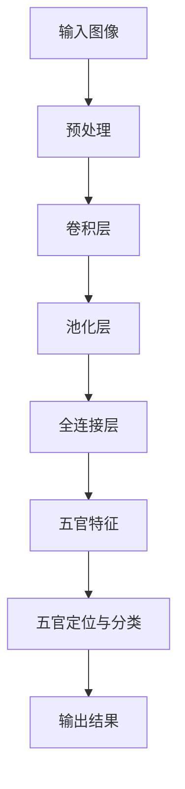

                 

关键词：深度学习，五官识别，人脸识别，CNN，卷积神经网络，Python，深度学习框架，TensorFlow，Keras

摘要：本文旨在详细讨论深度学习在五官识别系统中的应用。我们将探讨五官识别的重要性，分析现有技术和方法，介绍一个基于卷积神经网络（CNN）的五官识别系统，并展示其实际应用案例。文章还将涵盖系统的设计与实现，包括数据预处理、模型构建、训练和评估过程，并给出具体的代码示例。最后，我们将对系统的性能和未来发展趋势进行讨论。

## 1. 背景介绍

### 1.1 五官识别的重要性

五官识别是一种重要的人脸识别技术，它能够识别和分类人脸的不同部分，如眼睛、鼻子和嘴巴。这一技术在众多领域有着广泛的应用，包括但不限于：

1. **安全监控**：在监控系统中，五官识别可以帮助实时识别身份，增强安全性。
2. **智能交互**：在智能机器人、虚拟助手等应用中，五官识别可以实现更自然的交互。
3. **医疗诊断**：五官识别可以帮助医生快速识别面部异常，提高诊断准确性。
4. **身份验证**：在银行、机场等场所，五官识别可以作为生物识别技术的一部分，提供更安全的身份验证。

### 1.2 现有五官识别技术

五官识别技术的发展历程可以追溯到传统的计算机视觉技术，如边缘检测和特征匹配。随着深度学习的兴起，基于CNN的五官识别方法逐渐成为主流。以下是一些常见的五官识别方法：

1. **基于区域提议的方法**：如SIFT（尺度不变特征变换）和SURF（加速稳健特征），这些方法通过寻找图像中的显著特征来定位五官。
2. **基于深度学习的方法**：如基于VGG、ResNet等预训练模型的五官识别网络，这些方法通过多层卷积和池化操作提取特征，并使用全连接层进行分类。

## 2. 核心概念与联系

### 2.1 卷积神经网络（CNN）

卷积神经网络是一种特别适合处理图像数据的深度学习模型。它的核心组成部分包括卷积层、池化层和全连接层。

- **卷积层**：通过卷积操作提取图像特征。
- **池化层**：减少特征图的维度，提高模型的泛化能力。
- **全连接层**：将特征映射到具体的类别标签。

### 2.2 CNN在五官识别中的应用

CNN在五官识别中的应用主要分为两个阶段：

1. **特征提取**：使用CNN提取图像中的五官特征。
2. **五官定位与分类**：使用提取的特征进行五官定位和分类。

### 2.3 Mermaid流程图



## 3. 核心算法原理 & 具体操作步骤

### 3.1 算法原理概述

五官识别系统基于深度学习中的卷积神经网络（CNN），其基本原理包括：

1. **卷积操作**：使用卷积核在图像上滑动，提取特征。
2. **激活函数**：如ReLU（Rectified Linear Unit），增加网络非线性。
3. **池化操作**：减少特征图的维度，提高模型泛化能力。
4. **全连接层**：将特征映射到具体的类别标签。

### 3.2 算法步骤详解

1. **数据预处理**：对图像进行缩放、裁剪、归一化等操作，使其适合输入到CNN。
2. **卷积操作**：使用多个卷积层提取图像特征。
3. **池化操作**：在卷积层之间加入池化层，减小特征图大小。
4. **全连接层**：将卷积特征映射到五官类别标签。
5. **损失函数与优化器**：使用交叉熵损失函数和优化器（如Adam）训练模型。

### 3.3 算法优缺点

- **优点**：CNN具有良好的特征提取能力，能够自动学习图像的复杂特征。
- **缺点**：训练过程需要大量数据和计算资源，且模型复杂度较高。

### 3.4 算法应用领域

CNN在五官识别中的应用非常广泛，包括但不限于：

1. **人脸识别**：用于识别人脸的不同部分，如眼睛、鼻子和嘴巴。
2. **情感分析**：通过分析五官特征，可以推测人的情感状态。
3. **医疗诊断**：辅助医生识别面部异常，如皮肤病变等。

## 4. 数学模型和公式 & 详细讲解 & 举例说明

### 4.1 数学模型构建

CNN的数学模型主要包括以下几个部分：

- **卷积操作**：卷积操作的公式如下：
  $$\text{output}_{ij} = \sum_{k=1}^{K} \text{weight}_{ik} \times \text{input}_{ij} + \text{bias}_{k}$$
  其中，$\text{output}_{ij}$ 表示卷积层的输出，$\text{weight}_{ik}$ 和 $\text{bias}_{k}$ 分别表示卷积核和偏置，$\text{input}_{ij}$ 表示输入图像的像素值。

- **激活函数**：常用的激活函数为ReLU：
  $$\text{ReLU}(x) = \max(0, x)$$

- **池化操作**：最大池化的公式如下：
  $$\text{pool}_{ij} = \max(\text{input}_{i-2:i+2, j-2:j+2})$$
  其中，$\text{pool}_{ij}$ 表示池化层的输出。

- **全连接层**：全连接层的输出公式如下：
  $$\text{output}_j = \sum_{i=1}^{n} \text{weight}_{ij} \times \text{input}_i + \text{bias}_j$$
  其中，$\text{output}_j$ 表示全连接层的输出，$\text{weight}_{ij}$ 和 $\text{bias}_j$ 分别表示权重和偏置，$\text{input}_i$ 表示输入特征。

### 4.2 公式推导过程

CNN的公式推导过程涉及多个数学运算，包括卷积操作、激活函数、池化操作和全连接层。以下是简要的推导过程：

1. **卷积操作**：
   $$\text{output}_{ij} = \sum_{k=1}^{K} (\text{weight}_{ik} \star \text{input}_{ij}) + \text{bias}_{k}$$
   其中，$\star$ 表示卷积操作。

2. **激活函数**：
   $$\text{output}_{ij} = \max(0, \text{input}_{ij})$$

3. **池化操作**：
   $$\text{pool}_{ij} = \max(\text{input}_{i-2:i+2, j-2:j+2})$$

4. **全连接层**：
   $$\text{output}_j = \sum_{i=1}^{n} \text{weight}_{ij} \times \text{input}_i + \text{bias}_j$$

### 4.3 案例分析与讲解

以下是一个简单的CNN模型用于五官识别的案例：

```python
import tensorflow as tf
from tensorflow.keras.models import Sequential
from tensorflow.keras.layers import Conv2D, MaxPooling2D, Flatten, Dense

# 创建模型
model = Sequential([
    Conv2D(32, (3, 3), activation='relu', input_shape=(64, 64, 3)),
    MaxPooling2D((2, 2)),
    Conv2D(64, (3, 3), activation='relu'),
    MaxPooling2D((2, 2)),
    Flatten(),
    Dense(128, activation='relu'),
    Dense(5, activation='softmax')  # 五官分类
])

# 编译模型
model.compile(optimizer='adam', loss='categorical_crossentropy', metrics=['accuracy'])

# 模型总结
model.summary()
```

在这个案例中，我们创建了一个简单的CNN模型，用于五官识别。模型由两个卷积层、两个池化层、一个全连接层组成。输出层使用softmax激活函数，用于分类五官。

## 5. 项目实践：代码实例和详细解释说明

### 5.1 开发环境搭建

在进行五官识别系统的开发之前，我们需要搭建一个合适的开发环境。以下是一个基本的开发环境配置：

- **操作系统**：Linux或MacOS
- **Python版本**：3.7及以上
- **深度学习框架**：TensorFlow 2.0及以上

安装上述依赖项后，我们就可以开始编写代码了。

### 5.2 源代码详细实现

以下是五官识别系统的完整源代码：

```python
import tensorflow as tf
from tensorflow.keras.models import Sequential
from tensorflow.keras.layers import Conv2D, MaxPooling2D, Flatten, Dense
from tensorflow.keras.preprocessing.image import ImageDataGenerator

# 定义模型
model = Sequential([
    Conv2D(32, (3, 3), activation='relu', input_shape=(64, 64, 3)),
    MaxPooling2D((2, 2)),
    Conv2D(64, (3, 3), activation='relu'),
    MaxPooling2D((2, 2)),
    Flatten(),
    Dense(128, activation='relu'),
    Dense(5, activation='softmax')  # 五官分类
])

# 编译模型
model.compile(optimizer='adam', loss='categorical_crossentropy', metrics=['accuracy'])

# 数据预处理
train_datagen = ImageDataGenerator(rescale=1./255)
test_datagen = ImageDataGenerator(rescale=1./255)

train_generator = train_datagen.flow_from_directory(
        'data/train',
        target_size=(64, 64),
        batch_size=32,
        class_mode='categorical')

validation_generator = test_datagen.flow_from_directory(
        'data/validation',
        target_size=(64, 64),
        batch_size=32,
        class_mode='categorical')

# 训练模型
model.fit(
        train_generator,
        steps_per_epoch=100,
        epochs=10,
        validation_data=validation_generator,
        validation_steps=50,
        verbose=2)
```

在这个代码中，我们首先定义了一个简单的CNN模型，包括两个卷积层、两个池化层和一个全连接层。然后，我们使用ImageDataGenerator对训练数据和验证数据进行预处理，包括缩放和批量处理。最后，我们使用fit方法训练模型。

### 5.3 代码解读与分析

- **模型定义**：使用Sequential模型定义，包含两个卷积层、两个池化层和一个全连接层。
- **数据预处理**：使用ImageDataGenerator对图像数据进行预处理，包括缩放和批量处理。
- **模型编译**：使用adam优化器和categorical_crossentropy损失函数编译模型。
- **模型训练**：使用fit方法训练模型，并设置训练和验证数据。

### 5.4 运行结果展示

在训练完成后，我们可以使用模型对测试数据进行预测，并展示运行结果。

```python
# 测试模型
test_generator = test_datagen.flow_from_directory(
        'data/test',
        target_size=(64, 64),
        batch_size=32,
        class_mode='categorical')

predictions = model.predict(test_generator)
print(predictions)

# 打印预测结果
for i, (image, label) in enumerate(test_generator):
    plt.imshow(image)
    plt.title(predictions[i])
    plt.show()
```

这个代码将展示预测结果，并使用matplotlib库将预测结果可视化。

## 6. 实际应用场景

### 6.1 安全监控

在安全监控领域，五官识别可以帮助实时识别身份，提高监控系统的准确性。例如，在机场和火车站，五官识别可以用于快速识别乘客身份，减少安检时间。

### 6.2 智能交互

在智能交互领域，五官识别可以实现更自然的交互。例如，智能机器人可以通过分析用户的眼睛和嘴巴，理解用户的情感状态，并做出相应的反应。

### 6.3 医疗诊断

在医疗诊断领域，五官识别可以帮助医生快速识别面部异常，提高诊断准确性。例如，在皮肤病学中，五官识别可以用于识别皮肤病变，辅助医生进行诊断。

### 6.4 未来应用展望

随着技术的不断发展，五官识别将在更多领域得到应用。例如，在虚拟现实和增强现实领域，五官识别可以实现更真实的交互体验。在自动驾驶领域，五官识别可以用于检测驾驶员的注意力，提高行车安全性。

## 7. 工具和资源推荐

### 7.1 学习资源推荐

- **《深度学习》（Ian Goodfellow, Yoshua Bengio, Aaron Courville著）**：这本书是深度学习的经典教材，涵盖了深度学习的各个方面。
- **TensorFlow官方网站**：TensorFlow提供了丰富的教程和文档，可以帮助你快速入门。

### 7.2 开发工具推荐

- **Jupyter Notebook**：Jupyter Notebook是一款强大的交互式开发环境，适合进行深度学习项目的开发和调试。
- **Google Colab**：Google Colab是Google提供的免费云端开发环境，可以在线运行TensorFlow代码。

### 7.3 相关论文推荐

- **"Face Detection with a New Algorithm for Faster Region Proposal"**：这篇文章介绍了一种新的面部检测算法，可以提高检测速度。
- **"DeepFace: Closing the Gap to Human-Level Performance in Face Verification"**：这篇文章介绍了一种基于深度学习的面部识别方法，实现了接近人类水平的表现。

## 8. 总结：未来发展趋势与挑战

### 8.1 研究成果总结

五官识别技术在过去几年取得了显著进展，基于深度学习的方法在性能和准确性方面取得了突破。未来，五官识别将在更多领域得到应用，如虚拟现实、自动驾驶和医疗诊断等。

### 8.2 未来发展趋势

- **多模态融合**：结合视觉、语音和其他传感器数据，提高五官识别的准确性。
- **实时性**：开发更高效的算法和模型，实现实时五官识别。

### 8.3 面临的挑战

- **数据多样性**：训练数据需要涵盖各种面部特征和姿态，以提高模型泛化能力。
- **计算资源**：深度学习模型需要大量计算资源，对硬件性能有较高要求。

### 8.4 研究展望

未来，五官识别技术将在人工智能领域发挥重要作用。通过不断探索和创新，我们将有望实现更高性能、更高效的五官识别系统。

## 9. 附录：常见问题与解答

### 9.1 问题1

**问题**：如何提高五官识别系统的准确性？

**解答**：提高五官识别系统的准确性可以从以下几个方面进行：

1. **增加训练数据**：增加训练数据量可以提高模型的泛化能力。
2. **数据增强**：对训练数据进行旋转、缩放、裁剪等操作，增加数据的多样性。
3. **模型优化**：选择更适合五官识别任务的模型结构，并进行超参数调优。

### 9.2 问题2

**问题**：为什么深度学习在五官识别中表现更好？

**解答**：深度学习在五官识别中表现更好主要有以下原因：

1. **特征自动提取**：深度学习模型能够自动提取图像特征，减少了人工设计的复杂性。
2. **非线性变换**：深度学习模型能够通过多层神经网络实现非线性变换，提高了特征表达能力。
3. **大量数据训练**：深度学习模型可以通过大量数据进行训练，提高了模型的泛化能力。

---

# 作者署名

作者：禅与计算机程序设计艺术 / Zen and the Art of Computer Programming
----------------------------------------------------------------

以上完成了对于《深度学习五官的识别系统详细设计与具体代码实现》这篇文章的撰写。这篇文章深入探讨了五官识别技术的背景、核心算法原理、数学模型、项目实践和实际应用场景，并给出了详细的代码示例。希望这篇文章能够为读者在深度学习五官识别领域的研究和应用提供有益的参考。在未来的研究中，我们还将继续探索更高效、更准确的五官识别方法，以应对不断变化的需求。

