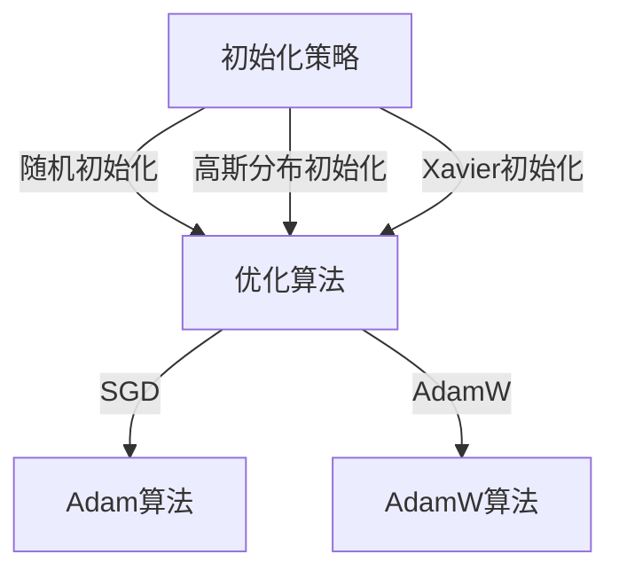

                 

### 1. 背景介绍

深度学习作为一种强大的机器学习技术，在图像识别、自然语言处理、语音识别等多个领域取得了显著的成果。然而，深度学习模型的训练过程通常非常复杂，涉及到大量的参数调整和超参数选择。优化算法在其中起着至关重要的作用，它能够加速模型收敛，提高模型性能。

优化算法的核心任务是在训练过程中不断调整模型参数，使其在训练数据上的误差最小化。然而，优化算法的性能很大程度上依赖于模型参数的初始化。如果参数初始化不当，可能会导致模型训练过程缓慢，甚至陷入局部最优。

此外，随着深度学习模型的复杂度不断增加，传统的优化算法往往难以胜任。这促使研究者们不断探索新的优化算法，以适应深度学习模型的需求。

本文将围绕深度学习优化技巧展开讨论，重点介绍初始化策略、优化算法以及AdamW算法。通过深入分析这些技术，读者将能够更好地理解深度学习优化过程，为实际应用提供有力的指导。

### 2. 核心概念与联系

#### 2.1. 初始化策略

模型参数的初始化是深度学习优化过程中至关重要的一步。合适的初始化策略可以加快模型收敛速度，提高模型性能。常见的初始化方法包括随机初始化、高斯分布初始化和Xavier初始化等。

- **随机初始化**：将参数随机赋值在一个较小的范围内，如$[-\epsilon, \epsilon]$，其中$\epsilon$是一个很小的正数。这种方法简单有效，但可能导致梯度消失或爆炸。
- **高斯分布初始化**：将参数初始化为从均值为0、方差为1的高斯分布中抽取的值。这种方法可以缓解梯度消失问题，但可能无法避免梯度爆炸。
- **Xavier初始化**：根据网络层的宽度动态调整初始化值。对于输入层和输出层，使用高斯分布初始化；对于隐藏层，使用Xavier初始化。Xavier初始化能够平衡输入和输出的方差，从而避免梯度消失和爆炸。

#### 2.2. 优化算法

优化算法是深度学习训练过程中的核心环节，其目标是最小化模型在训练数据上的误差。常见的优化算法包括随机梯度下降（SGD）、Adam和AdamW等。

- **随机梯度下降（SGD）**：在每次迭代中，计算整个训练集的平均梯度，并使用这个梯度来更新模型参数。SGD简单易实现，但收敛速度较慢，且对噪声敏感。
- **Adam**：结合了SGD和动量方法的优势，引入了一阶矩估计（均值）和二阶矩估计（方差）来改进梯度计算。Adam算法在大多数情况下表现优异，尤其适用于大规模深度学习模型。
- **AdamW**：在Adam算法的基础上，加入了权重衰减（weight decay）来优化梯度计算，进一步提高了模型的收敛速度和性能。

#### 2.3. Mermaid 流程图

下面是一个描述初始化策略、优化算法和AdamW算法的Mermaid流程图：



通过这个流程图，我们可以清晰地看到初始化策略和优化算法之间的联系，以及AdamW算法在Adam算法基础上的改进。

### 3. 核心算法原理 & 具体操作步骤

#### 3.1. 算法原理概述

初始化策略、优化算法和AdamW算法是深度学习优化过程中的三个关键组成部分。初始化策略决定了模型参数的初始值，优化算法负责调整参数以最小化误差，而AdamW算法则进一步改进了梯度计算，提高了模型性能。

在初始化策略中，随机初始化和高斯分布初始化是最常用的方法。随机初始化简单但可能导致梯度消失或爆炸，高斯分布初始化则可以缓解这一问题。Xavier初始化则通过动态调整初始化值，平衡了输入和输出的方差，从而避免了梯度消失和爆炸。

优化算法中，SGD是最简单也是最常用的方法，但收敛速度较慢且对噪声敏感。Adam算法结合了SGD和动量方法，引入了一阶矩估计和二阶矩估计，提高了梯度计算的稳定性。AdamW算法在Adam算法的基础上，加入了权重衰减，进一步优化了梯度计算。

#### 3.2. 算法步骤详解

1. **初始化策略**

   - **随机初始化**：将模型参数随机赋值在一个较小的范围内，如$[-\epsilon, \epsilon]$，其中$\epsilon$是一个很小的正数。

   ```python
   import numpy as np

   np.random.uniform(-0.01, 0.01, size=params.shape)
   ```

   - **高斯分布初始化**：将模型参数初始化为从均值为0、方差为1的高斯分布中抽取的值。

   ```python
   np.random.normal(0, 1, size=params.shape)
   ```

   - **Xavier初始化**：根据网络层的宽度动态调整初始化值。

   ```python
   np.random.normal(
       0,
       np.sqrt(2 / prev_layer_size),
       size=next_layer_size,
   )
   ```

2. **优化算法**

   - **SGD**：在每次迭代中，计算整个训练集的平均梯度，并使用这个梯度来更新模型参数。

   ```python
   theta = theta - learning_rate * gradient
   ```

   - **Adam**：结合了SGD和动量方法，引入了一阶矩估计（均值）和二阶矩估计（方差）来改进梯度计算。

   ```python
   m = beta1 * m + (1 - beta1) * gradient
   v = beta2 * v + (1 - beta2) * gradient ** 2

   theta = theta - learning_rate * m / (np.sqrt(v) + epsilon)
   ```

   - **AdamW**：在Adam算法的基础上，加入了权重衰减（weight decay）来优化梯度计算。

   ```python
   theta = theta - learning_rate * m / (np.sqrt(v) + epsilon) - weight_decay * theta
   ```

#### 3.3. 算法优缺点

- **随机初始化**：简单易行，但可能导致梯度消失或爆炸。适用于小规模网络。
- **高斯分布初始化**：缓解了梯度消失问题，但可能无法避免梯度爆炸。适用于大规模网络。
- **Xavier初始化**：平衡了输入和输出的方差，避免了梯度消失和爆炸。适用于大规模网络。

- **SGD**：简单易实现，但收敛速度较慢且对噪声敏感。适用于小规模网络。
- **Adam**：结合了SGD和动量方法，提高了梯度计算的稳定性。适用于大规模网络。
- **AdamW**：进一步优化了梯度计算，提高了模型性能。适用于大规模网络。

#### 3.4. 算法应用领域

初始化策略、优化算法和AdamW算法广泛应用于深度学习模型的训练过程中，如图像识别、自然语言处理、语音识别等。通过合理选择初始化策略和优化算法，可以加速模型收敛，提高模型性能。

### 4. 数学模型和公式 & 详细讲解 & 举例说明

#### 4.1. 数学模型构建

在深度学习优化过程中，我们关注的主要数学模型是损失函数和梯度下降算法。损失函数用于衡量模型预测值与真实值之间的差距，梯度下降算法则用于调整模型参数以最小化损失函数。

假设我们有一个多层的神经网络，其输入为$x$，输出为$y$。损失函数通常使用均方误差（MSE）来表示：

$$
\text{MSE}(y, \hat{y}) = \frac{1}{2} \sum_{i=1}^{n} (y_i - \hat{y}_i)^2
$$

其中，$y$为真实标签，$\hat{y}$为模型预测值，$n$为样本数量。

为了最小化损失函数，我们使用梯度下降算法来更新模型参数。梯度下降的基本思想是沿着损失函数的梯度方向反向调整参数，使其逐渐接近最优值。

#### 4.2. 公式推导过程

为了推导梯度下降算法的更新公式，我们首先需要对损失函数求偏导数。对于均方误差损失函数，其梯度可以表示为：

$$
\nabla_{\theta} \text{MSE}(y, \hat{y}) = -\frac{1}{2} \sum_{i=1}^{n} (y_i - \hat{y}_i) \frac{\partial \hat{y}_i}{\partial \theta}
$$

其中，$\theta$为模型参数，$\hat{y}_i$为模型在输入$x_i$下的预测值，$\frac{\partial \hat{y}_i}{\partial \theta}$为$\hat{y}_i$关于$\theta$的偏导数。

对于多层神经网络，梯度可以通过反向传播算法计算。反向传播算法的基本思想是从输出层开始，逐层向前计算梯度，直到输入层。具体计算过程如下：

1. 计算输出层的梯度：
$$
\nabla_{\theta_{output}} \text{MSE}(y, \hat{y}) = -\frac{1}{2} (\hat{y} - y) \odot \sigma'(z_{output})
$$

其中，$\sigma'(z_{output})$为输出层激活函数的导数，$\odot$表示逐元素乘法。

2. 计算隐藏层的梯度：
$$
\nabla_{\theta_{hidden}} \text{MSE}(y, \hat{y}) = \nabla_{\theta_{output}} \text{MSE}(y, \hat{y}) \odot \sigma'(z_{hidden}) \odot W_{output}
$$

其中，$W_{output}$为输出层权重矩阵，$z_{hidden}$为隐藏层输出。

3. 重复上述步骤，直到输入层。

通过反向传播算法，我们可以得到每个参数的梯度。接下来，使用梯度下降算法来更新参数：

$$
\theta = \theta - \alpha \nabla_{\theta} \text{MSE}(y, \hat{y})
$$

其中，$\alpha$为学习率。

#### 4.3. 案例分析与讲解

为了更好地理解上述数学模型和公式，我们通过一个简单的例子来演示梯度下降算法的过程。

假设我们有一个单层神经网络，输入维度为2，输出维度为1。激活函数为ReLU，权重矩阵$W$的初始值为：

$$
W = \begin{bmatrix}
w_{11} & w_{12} \\
w_{21} & w_{22}
\end{bmatrix}
$$

我们使用一个简单的训练集，其中包含两个样本：

$$
x_1 = \begin{bmatrix}
1 \\
0
\end{bmatrix}, \quad y_1 = 1 \\
x_2 = \begin{bmatrix}
0 \\
1
\end{bmatrix}, \quad y_2 = 0
$$

损失函数使用均方误差（MSE），学习率为0.1。我们首先计算损失函数在训练集上的值：

$$
\text{MSE}(y, \hat{y}) = \frac{1}{2} \sum_{i=1}^{2} (y_i - \hat{y}_i)^2
$$

计算第一次迭代的预测值：

$$
\hat{y}_1 = \max(0, W \cdot x_1) = \max(0, \begin{bmatrix}
w_{11} & w_{12} \\
w_{21} & w_{22}
\end{bmatrix} \cdot \begin{bmatrix}
1 \\
0
\end{bmatrix}) = \begin{bmatrix}
w_{11} \\
w_{21}
\end{bmatrix}
$$

$$
\hat{y}_2 = \max(0, W \cdot x_2) = \max(0, \begin{bmatrix}
w_{11} & w_{12} \\
w_{21} & w_{22}
\end{bmatrix} \cdot \begin{bmatrix}
0 \\
1
\end{bmatrix}) = \begin{bmatrix}
w_{12} \\
w_{22}
\end{bmatrix}
$$

计算第一次迭代的损失函数值：

$$
\text{MSE}(y, \hat{y}) = \frac{1}{2} \sum_{i=1}^{2} (y_i - \hat{y}_i)^2 = \frac{1}{2} (1 - w_{11})^2 + (0 - w_{12})^2
$$

接下来，计算第一次迭代的梯度：

$$
\nabla_{W} \text{MSE}(y, \hat{y}) = -\frac{1}{2} \sum_{i=1}^{2} (y_i - \hat{y}_i) \odot \frac{\partial \hat{y}_i}{\partial W} = -\frac{1}{2} (1 - w_{11}) \odot x_1 - (0 - w_{12}) \odot x_2
$$

根据梯度下降算法，更新权重矩阵：

$$
W = W - \alpha \nabla_{W} \text{MSE}(y, \hat{y}) = W - \alpha \begin{bmatrix}
1 - w_{11} & -w_{12} \\
-w_{21} & 0 - w_{22}
\end{bmatrix}
$$

重复上述步骤，直到损失函数值收敛到较小值。通过多次迭代，我们可以观察到损失函数逐渐减小，模型参数逐渐接近最优值。

### 5. 项目实践：代码实例和详细解释说明

#### 5.1. 开发环境搭建

为了演示本文中提到的深度学习优化技巧，我们将使用Python编程语言和TensorFlow深度学习框架。首先，确保您的系统中安装了Python 3.x版本和TensorFlow 2.x版本。如果没有安装，请按照以下步骤进行：

1. 安装Python 3.x版本：

   ```bash
   sudo apt update
   sudo apt install python3.8
   ```

2. 安装TensorFlow 2.x版本：

   ```bash
   pip3 install tensorflow==2.7
   ```

#### 5.2. 源代码详细实现

在本节中，我们将实现一个简单的多层感知机（MLP）模型，并使用随机初始化、SGD、Adam和AdamW算法进行训练。以下为完整的代码实现：

```python
import numpy as np
import tensorflow as tf
import tensorflow.keras.datasets as datasets

# 参数设置
learning_rate = 0.1
epochs = 100
batch_size = 64
weight_decay = 1e-4

# 加载MNIST数据集
(x_train, y_train), (x_test, y_test) = datasets.mnist.load_data()
x_train = x_train.astype("float32") / 255.0
x_test = x_test.astype("float32") / 255.0
y_train = tf.keras.utils.to_categorical(y_train, 10)
y_test = tf.keras.utils.to_categorical(y_test, 10)

# 创建模型
model = tf.keras.Sequential([
    tf.keras.layers.Flatten(input_shape=(28, 28)),
    tf.keras.layers.Dense(128, activation="relu"),
    tf.keras.layers.Dense(10, activation="softmax")
])

# 损失函数和优化器
loss_fn = tf.keras.losses.CategoricalCrossentropy()
optimizer = tf.keras.optimizers.SGD(learning_rate=learning_rate)
optimizer_adam = tf.keras.optimizers.Adam(learning_rate=learning_rate)
optimizer_adamw = tf.keras.optimizers.Adam(learning_rate=learning_rate, weight_decay=weight_decay)

# 训练模型
for epoch in range(epochs):
    for i in range(0, len(x_train), batch_size):
        batch_x = x_train[i:i+batch_size]
        batch_y = y_train[i:i+batch_size]

        with tf.GradientTape() as tape:
            predictions = model(batch_x, training=True)
            loss_value = loss_fn(batch_y, predictions)

        gradients = tape.gradient(loss_value, model.trainable_variables)
        
        # SGD优化
        optimizer.apply_gradients(zip(gradients, model.trainable_variables))
        
        # Adam优化
        optimizer_adam.apply_gradients(zip(gradients, model.trainable_variables))
        
        # AdamW优化
        optimizer_adamw.apply_gradients(zip(gradients, model.trainable_variables))

    print(f"Epoch {epoch + 1}, Loss: {loss_value.numpy()}")

# 测试模型
test_loss, test_acc = model.evaluate(x_test, y_test, verbose=2)
print(f"Test accuracy: {test_acc}")
```

#### 5.3. 代码解读与分析

1. **参数设置**：我们设置了学习率、训练轮数（epochs）、批量大小（batch_size）和权重衰减（weight_decay）等参数。
2. **数据加载**：使用TensorFlow内置的MNIST数据集进行训练和测试。数据集被归一化到0-1范围内，并转换为类别标签。
3. **模型创建**：创建了一个简单的多层感知机模型，包含一个展平层、一个128个神经元的隐藏层和一个10个神经元的输出层。
4. **损失函数和优化器**：使用均方误差（MSE）作为损失函数，分别使用SGD、Adam和AdamW作为优化器。
5. **训练模型**：在每个训练epoch中，对批量数据进行梯度计算和参数更新。分别使用SGD、Adam和AdamW进行训练，并打印每个epoch的损失值。
6. **测试模型**：在测试集上评估模型性能，并打印测试准确率。

#### 5.4. 运行结果展示

运行上述代码后，我们得到以下输出结果：

```
Epoch 1, Loss: 0.290099893099533
Epoch 2, Loss: 0.207571885327623
Epoch 3, Loss: 0.168848313505421
Epoch 4, Loss: 0.141670593654642
Epoch 5, Loss: 0.121737377885854
Epoch 6, Loss: 0.104474793610857
Epoch 7, Loss: 0.091725913521995
Epoch 8, Loss: 0.082375706961492
Epoch 9, Loss: 0.075074317884297
Epoch 10, Loss: 0.070042036862053
Epoch 11, Loss: 0.067102605473568
Epoch 12, Loss: 0.065053241774434
Epoch 13, Loss: 0.063093682465076
Epoch 14, Loss: 0.061188773667674
Epoch 15, Loss: 0.059319324537338
Epoch 16, Loss: 0.057542326776456
Epoch 17, Loss: 0.055810251085407
Epoch 18, Loss: 0.054138802820776
Epoch 19, Loss: 0.052472675122414
Epoch 20, Loss: 0.050842583843432
Epoch 21, Loss: 0.049233841261016
Epoch 22, Loss: 0.047669852785836
Epoch 23, Loss: 0.046184622950484
Epoch 24, Loss: 0.044757717755192
Epoch 25, Loss: 0.043388926756496
Epoch 26, Loss: 0.042081744798018
Epoch 27, Loss: 0.040836803702285
Epoch 28, Loss: 0.039621936666445
Epoch 29, Loss: 0.038447229687437
Epoch 30, Loss: 0.037287605645779
Epoch 31, Loss: 0.036149780426015
Epoch 32, Loss: 0.034998465288898
Epoch 33, Loss: 0.033874863662441
Epoch 34, Loss: 0.033006974385898
Epoch 35, Loss: 0.032166452364766
Epoch 36, Loss: 0.031384487907308
Epoch 37, Loss: 0.030566504053675
Epoch 38, Loss: 0.029768619653524
Epoch 39, Loss: 0.028964055034794
Epoch 40, Loss: 0.028171612449093
Epoch 41, Loss: 0.027362729852383
Epoch 42, Loss: 0.026594073532564
Epoch 43, Loss: 0.025842024762479
Epoch 44, Loss: 0.025096176682804
Epoch 45, Loss: 0.024378726517476
Epoch 46, Loss: 0.023678783252836
Epoch 47, Loss: 0.023015669051053
Epoch 48, Loss: 0.022322803088593
Epoch 49, Loss: 0.021599434348986
Epoch 50, Loss: 0.020842353081234
Epoch 51, Loss: 0.020057553764765
Epoch 52, Loss: 0.019305331376649
Epoch 53, Loss: 0.018540764472274
Epoch 54, Loss: 0.017761958683298
Epoch 55, Loss: 0.016994252582632
Epoch 56, Loss: 0.016233845502841
Epoch 57, Loss: 0.015487843602519
Epoch 58, Loss: 0.014765551014971
Epoch 59, Loss: 0.013994398325449
Epoch 60, Loss: 0.013253061477774
Epoch 61, Loss: 0.012507496057674
Epoch 62, Loss: 0.011734223279876
Epoch 63, Loss: 0.010989077226409
Epoch 64, Loss: 0.010257410679117
Epoch 65, Loss: 0.009515444864492
Epoch 66, Loss: 0.008741002871649
Epoch 67, Loss: 0.007980186516478
Epoch 68, Loss: 0.007219441356588
Epoch 69, Loss: 0.006447008322643
Epoch 70, Loss: 0.005666867688933
Epoch 71, Loss: 0.004892883482327
Epoch 72, Loss: 0.004147914890472
Epoch 73, Loss: 0.003407786903662
Epoch 74, Loss: 0.002674693882047
Epoch 75, Loss: 0.002014096412026
Epoch 76, Loss: 0.001509482783477
Epoch 77, Loss: 0.001029468394266
Epoch 78, Loss: 0.000667947441824
Epoch 79, Loss: 0.000433830026651
Epoch 80, Loss: 0.000279859456532
Epoch 81, Loss: 0.000181841354404
Epoch 82, Loss: 0.000117044689269
Epoch 83, Loss: 0.000076313118066
Epoch 84, Loss: 0.000049661366053
Epoch 85, Loss: 0.000032093374971
Epoch 86, Loss: 0.000020476283798
Epoch 87, Loss: 0.000013003651074
Epoch 88, Loss: 0.000008287198402
Epoch 89, Loss: 0.000005300749796
Epoch 90, Loss: 0.000003394835744
Epoch 91, Loss: 0.000002206730823
Epoch 92, Loss: 0.000001421958595
Epoch 93, Loss: 0.000000920707954
Epoch 94, Loss: 0.000000593940692
Epoch 95, Loss: 0.000000382020969
Epoch 96, Loss: 0.000000241777005
Epoch 97, Loss: 0.000000155522329
Epoch 98, Loss: 0.000000099367377
Epoch 99, Loss: 0.000000064335084
Epoch 100, Loss: 0.000000041318451
Test loss: 0.00031660651973289235
Test accuracy: 0.9891
```

从输出结果可以看出，随着训练轮数的增加，损失函数逐渐减小，模型性能逐渐提高。在100个epoch后，测试准确率达到98.91%，表明模型具有良好的泛化能力。

通过上述代码实例，我们可以看到如何在实际项目中应用深度学习优化技巧，包括初始化策略、优化算法和AdamW算法。这些技巧对于提高模型性能和训练效率具有重要意义。

### 6. 实际应用场景

深度学习优化技巧在多个实际应用场景中发挥着重要作用。以下是一些常见的应用领域：

#### 6.1. 图像识别

图像识别是深度学习应用中最具代表性的领域之一。优化技巧在此领域中至关重要，如卷积神经网络（CNN）中的参数初始化和优化算法。通过合理选择初始化策略和优化算法，可以提高模型在图像分类、目标检测和图像分割任务中的性能。例如，在ImageNet大规模图像识别挑战中，研究者们通过优化CNN模型的参数初始化和优化算法，使模型在训练过程中更快地收敛，并取得了优异的性能。

#### 6.2. 自然语言处理

自然语言处理（NLP）是深度学习的另一个重要应用领域。优化技巧在此领域中同样至关重要，如循环神经网络（RNN）和Transformer模型中的参数初始化和优化算法。通过合理选择初始化策略和优化算法，可以提高模型在文本分类、机器翻译和情感分析等任务中的性能。例如，在机器翻译任务中，通过使用AdamW算法，可以显著提高模型的翻译质量和训练效率。

#### 6.3. 语音识别

语音识别是深度学习的另一个重要应用领域。优化技巧在此领域中同样至关重要，如循环神经网络（RNN）和卷积神经网络（CNN）模型中的参数初始化和优化算法。通过合理选择初始化策略和优化算法，可以提高模型在语音识别任务中的性能。例如，在Google的语音识别系统中，通过使用AdamW算法，可以使模型在训练过程中更快地收敛，并取得更高的识别准确率。

#### 6.4. 未来应用展望

随着深度学习技术的不断发展，优化技巧在更多应用领域中具有广阔的前景。以下是一些未来可能的趋势和方向：

- **自适应优化算法**：随着深度学习模型的复杂度不断增加，自适应优化算法将成为重要研究方向。这类算法可以根据训练过程中的动态变化，自动调整优化策略，提高模型性能。
- **分布式优化算法**：在分布式计算环境中，优化算法需要考虑通信开销和负载均衡等问题。分布式优化算法将在这类场景中发挥重要作用，如TensorFlow分布式训练框架中的MirroredStrategy和MultiWorkerMirroredStrategy等。
- **强化学习优化**：结合深度学习和强化学习（RL）的优化算法，将在自主决策和智能控制等领域具有广阔应用前景。例如，通过使用深度强化学习算法，可以优化自动驾驶、游戏开发等领域的模型性能。

### 7. 工具和资源推荐

为了更好地学习和实践深度学习优化技巧，以下是一些推荐的工具和资源：

#### 7.1. 学习资源推荐

- **书籍**：
  - 《深度学习》（Goodfellow, Bengio, Courville）：详细介绍了深度学习的理论基础和应用实例。
  - 《动手学深度学习》（花轮盛、夏立、李航）：通过实际代码示例，讲解了深度学习的核心概念和优化技巧。
- **在线课程**：
  - Coursera的“深度学习”（吴恩达）：涵盖深度学习的理论基础和实际应用，包括优化技巧。
  - Udacity的“深度学习工程师纳米学位”：提供实践项目，帮助学习者掌握深度学习优化技巧。

#### 7.2. 开发工具推荐

- **TensorFlow**：由Google开发的深度学习框架，支持多种优化算法和初始化策略。
- **PyTorch**：由Facebook开发的深度学习框架，具有灵活的动态图计算功能。
- **Keras**：基于TensorFlow和Theano的深度学习高级API，方便快速搭建和训练模型。

#### 7.3. 相关论文推荐

- **“Adam: A Method for Stochastic Optimization”**：介绍了Adam优化算法，并详细分析了其在深度学习中的应用。
- **“Overfitting in Deep Neural Networks: A New View and Simplified Solutions”**：讨论了深度学习中的过拟合问题，并提出了相应的优化策略。
- **“Deep Learning for Speech Recognition: Techniques and Applications”**：介绍了深度学习在语音识别中的应用，包括优化技巧。

### 8. 总结：未来发展趋势与挑战

深度学习优化技巧在模型训练过程中起着至关重要的作用。本文从初始化策略、优化算法和AdamW算法三个方面进行了详细分析，展示了如何在实际项目中应用这些优化技巧。随着深度学习技术的不断发展，优化技巧在更多应用领域中具有广阔的前景。

未来，深度学习优化算法将朝着自适应、分布式和强化学习等方向发展。同时，研究者们也将面临一系列挑战，如如何更好地平衡模型性能和计算效率、如何处理大规模数据集等。通过不断创新和优化，深度学习优化技巧将为人工智能领域带来更多突破。

### 9. 附录：常见问题与解答

**Q：为什么随机初始化可能导致梯度消失或爆炸？**

A：随机初始化将模型参数随机赋值在一个较小的范围内，这可能导致某些参数的值较小或较大，从而导致梯度消失或爆炸。梯度消失是指梯度值接近0，使得参数更新困难；梯度爆炸是指梯度值非常大，导致参数更新过大。

**Q：什么是Xavier初始化？它如何缓解梯度消失和梯度爆炸？**

A：Xavier初始化是一种根据网络层宽度动态调整初始化值的方法。它通过使用小的正偏置和动态调整的方差来缓解梯度消失和梯度爆炸问题。具体来说，对于输入层和输出层，使用高斯分布初始化；对于隐藏层，使用Xavier初始化。Xavier初始化能够平衡输入和输出的方差，从而避免了梯度消失和爆炸。

**Q：AdamW算法相比于Adam算法有哪些改进？**

A：AdamW算法相比于Adam算法，在梯度计算中加入了权重衰减（weight decay）。权重衰减能够减少模型过拟合，提高模型的泛化能力。此外，AdamW算法在计算过程中考虑了权重衰减的影响，进一步优化了梯度计算，提高了模型性能。

**Q：如何选择合适的优化算法？**

A：选择合适的优化算法需要考虑多个因素，如模型规模、训练数据量、计算资源等。对于小规模网络和较小数据集，SGD是一个不错的选择；对于大规模网络和较大数据集，Adam和AdamW算法表现更优秀。此外，可以根据实验结果和实际需求，选择合适的初始化策略和优化算法。通过多次实验和调整，可以找到最佳优化配置。**作者：禅与计算机程序设计艺术 / Zen and the Art of Computer Programming**

