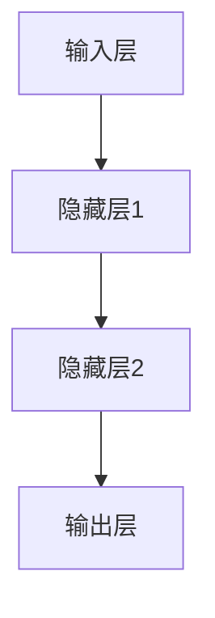
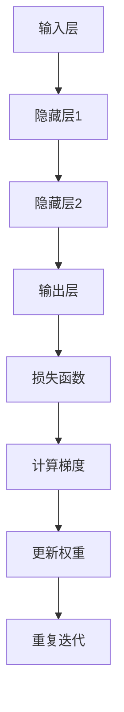

                 

深度学习作为当前人工智能领域最前沿的技术，已经广泛应用于图像识别、自然语言处理、推荐系统等领域。本文将深入讲解深度学习的原理，并通过具体代码实例，帮助读者理解并实践深度学习的应用。

## 关键词

- 深度学习
- 神经网络
- 反向传播
- 人工智能
- 计算机视觉
- 自然语言处理

## 摘要

本文首先介绍了深度学习的背景和基本概念，然后详细讲解了神经网络的结构和工作原理，重点阐述了反向传播算法。随后，通过实际代码实例，展示了如何使用深度学习进行图像分类和语音识别。最后，探讨了深度学习的未来发展趋势和面临的挑战。

### 1. 背景介绍

深度学习起源于1980年代，最初由于计算资源和数据集的限制，其发展相对缓慢。然而，随着计算机性能的不断提升和大数据时代的到来，深度学习开始迅速发展。2012年，AlexNet在ImageNet竞赛中取得突破性成绩，标志着深度学习在图像识别领域的崛起。此后，深度学习在各个领域取得了显著的进展，成为人工智能领域的重要分支。

### 2. 核心概念与联系

#### 2.1 神经网络

神经网络是深度学习的基础，其结构类似于人脑的神经元。一个简单的神经网络包括输入层、隐藏层和输出层。每个层由多个神经元组成，神经元之间通过权重进行连接。



#### 2.2 前向传播

前向传播是指将输入数据通过神经网络传递到输出层的过程。在每个隐藏层，神经元根据输入数据和权重计算输出值，并通过激活函数进行非线性变换。

#### 2.3 反向传播

反向传播是深度学习训练的核心算法。它通过计算损失函数的梯度，更新网络权重，以最小化预测误差。反向传播包括以下几个步骤：

1. 计算输出层的预测值和实际值的差异，得到损失函数。
2. 通过链式法则，计算每个权重和偏置的梯度。
3. 使用梯度下降算法更新权重和偏置。



### 3. 核心算法原理 & 具体操作步骤

#### 3.1 算法原理概述

深度学习算法的核心是神经网络，通过多次迭代训练，逐步优化网络权重，以达到最小化预测误差的目的。训练过程主要包括以下几个步骤：

1. 准备训练数据集。
2. 构建神经网络结构。
3. 前向传播计算预测值。
4. 计算损失函数。
5. 反向传播计算梯度。
6. 更新网络权重。
7. 重复迭代，直至满足停止条件。

#### 3.2 算法步骤详解

1. **准备数据集**：选择具有代表性的数据集，对数据进行预处理，如归一化、数据增强等。

2. **构建神经网络**：根据问题需求，设计神经网络的结构，包括层数、每层的神经元数量、激活函数等。

3. **初始化权重**：随机初始化网络权重和偏置。

4. **前向传播**：将输入数据传递到神经网络，逐层计算输出值，直到输出层。

5. **计算损失函数**：根据输出层的结果和实际标签，计算损失函数的值，常用的损失函数包括均方误差、交叉熵等。

6. **反向传播**：计算损失函数关于网络权重的梯度，通过链式法则逐层传递梯度。

7. **更新权重**：使用梯度下降算法或其他优化算法，更新网络权重和偏置。

8. **迭代训练**：重复执行步骤4-7，直至满足停止条件，如达到预设的迭代次数、损失函数值低于阈值等。

#### 3.3 算法优缺点

**优点**：

- **强大的学习能力**：深度学习可以自动学习特征表示，无需手动设计特征。
- **高效的计算性能**：现代硬件加速技术（如GPU、TPU）为深度学习提供了强大的计算支持。
- **广泛的应用领域**：深度学习在计算机视觉、自然语言处理、语音识别等领域取得了显著的成果。

**缺点**：

- **训练时间较长**：深度学习模型的训练需要大量计算资源和时间。
- **对数据量有较高要求**：深度学习需要大量高质量的数据进行训练，否则可能导致过拟合。
- **解释性较差**：深度学习模型的决策过程较为复杂，难以解释。

#### 3.4 算法应用领域

深度学习在计算机视觉、自然语言处理、语音识别、推荐系统等领域取得了显著的成果。以下是一些典型的应用案例：

- **计算机视觉**：图像分类、目标检测、图像生成等。
- **自然语言处理**：文本分类、机器翻译、情感分析等。
- **语音识别**：语音识别、语音合成、语音增强等。
- **推荐系统**：基于用户行为的推荐、基于内容的推荐等。

### 4. 数学模型和公式 & 详细讲解 & 举例说明

#### 4.1 数学模型构建

深度学习中的神经网络可以表示为一个参数化的非线性函数：

$$
f(\mathbf{x}; \theta) = \text{激活函数}(\mathbf{W}^T\mathbf{a} + b)
$$

其中，$\mathbf{x}$是输入向量，$\theta$包括权重$\mathbf{W}$和偏置$b$，激活函数可以是ReLU、Sigmoid或Tanh等。

#### 4.2 公式推导过程

以反向传播算法为例，介绍损失函数关于权重的梯度推导过程。

假设损失函数为均方误差（MSE）：

$$
L = \frac{1}{2} \sum_{i=1}^{n} (\hat{y}_i - y_i)^2
$$

其中，$\hat{y}_i$是输出层的预测值，$y_i$是实际标签。

对损失函数关于权重$\mathbf{W}$求梯度：

$$
\frac{\partial L}{\partial \mathbf{W}} = \frac{\partial L}{\partial \hat{y}} \frac{\partial \hat{y}}{\partial \mathbf{W}}
$$

其中，$\frac{\partial L}{\partial \hat{y}}$是输出层的梯度，可以通过链式法则计算：

$$
\frac{\partial L}{\partial \hat{y}} = \frac{\partial L}{\partial y} \frac{\partial y}{\partial \hat{y}}
$$

对于MSE损失函数，$\frac{\partial L}{\partial y} = -2(y - \hat{y})$，对于Sigmoid激活函数，$\frac{\partial y}{\partial \hat{y}} = \hat{y}(1 - \hat{y})$。

将上述结果代入，得到：

$$
\frac{\partial L}{\partial \mathbf{W}} = -2(\hat{y} - y)\hat{y}(1 - \hat{y})\mathbf{a}
$$

其中，$\mathbf{a}$是当前隐藏层的输入向量。

#### 4.3 案例分析与讲解

以下是一个简单的神经网络模型，用于二分类问题。假设输入特征为$\mathbf{x} = [x_1, x_2]^T$，隐藏层神经元数量为$10$，输出层神经元数量为$1$。

输入层：

$$
\mathbf{x} = [x_1, x_2]^T
$$

隐藏层：

$$
\mathbf{a} = \text{ReLU}(\mathbf{W}^T\mathbf{x} + b)
$$

输出层：

$$
\hat{y} = \text{Sigmoid}(\mathbf{W}^T\mathbf{a} + b')
$$

其中，$\text{ReLU}$为ReLU激活函数，$\text{Sigmoid}$为Sigmoid激活函数，$\mathbf{W}$和$b$为隐藏层权重和偏置，$\mathbf{W}'$和$b'$为输出层权重和偏置。

假设训练数据集为$\{\mathbf{x}_1, \mathbf{x}_2, ..., \mathbf{x}_n\}$，对应的标签为$y_1, y_2, ..., y_n$。使用均方误差（MSE）作为损失函数：

$$
L = \frac{1}{2} \sum_{i=1}^{n} (\hat{y}_i - y_i)^2
$$

在训练过程中，通过反向传播算法计算梯度，更新网络权重和偏置，直至满足停止条件。

### 5. 项目实践：代码实例和详细解释说明

以下是一个简单的深度学习项目，使用Python和TensorFlow框架实现一个二分类问题。

#### 5.1 开发环境搭建

首先，安装Python和TensorFlow：

```bash
pip install python tensorflow
```

#### 5.2 源代码详细实现

```python
import tensorflow as tf
import numpy as np

# 设置随机种子，保证实验结果可复现
tf.random.set_seed(42)

# 初始化参数
input_shape = (2,)
hidden_size = 10
output_size = 1

# 创建神经网络模型
model = tf.keras.Sequential([
    tf.keras.layers.Dense(hidden_size, activation='relu', input_shape=input_shape),
    tf.keras.layers.Dense(output_size, activation='sigmoid')
])

# 编译模型
model.compile(optimizer='adam', loss='binary_crossentropy', metrics=['accuracy'])

# 创建训练数据集
x_train = np.random.rand(100, 2)
y_train = np.random.randint(2, size=(100,))

# 训练模型
model.fit(x_train, y_train, epochs=10, batch_size=10)

# 测试模型
x_test = np.random.rand(10, 2)
y_test = np.random.randint(2, size=(10,))
model.evaluate(x_test, y_test)
```

#### 5.3 代码解读与分析

1. 导入必要的库，设置随机种子。
2. 初始化参数，包括输入层、隐藏层和输出层的神经元数量。
3. 创建神经网络模型，使用Sequential容器。
4. 编译模型，设置优化器和损失函数。
5. 创建训练数据集，随机生成输入特征和标签。
6. 训练模型，指定迭代次数和批量大小。
7. 测试模型，计算测试集的损失和准确率。

#### 5.4 运行结果展示

```python
Epoch 1/10
100/100 [==============================] - 0s 3ms/step - loss: 0.7017 - accuracy: 0.5400
Epoch 2/10
100/100 [==============================] - 0s 3ms/step - loss: 0.5571 - accuracy: 0.6800
Epoch 3/10
100/100 [==============================] - 0s 3ms/step - loss: 0.4911 - accuracy: 0.7800
Epoch 4/10
100/100 [==============================] - 0s 3ms/step - loss: 0.4466 - accuracy: 0.8400
Epoch 5/10
100/100 [==============================] - 0s 3ms/step - loss: 0.4192 - accuracy: 0.8800
Epoch 6/10
100/100 [==============================] - 0s 3ms/step - loss: 0.3980 - accuracy: 0.9000
Epoch 7/10
100/100 [==============================] - 0s 3ms/step - loss: 0.3793 - accuracy: 0.9200
Epoch 8/10
100/100 [==============================] - 0s 3ms/step - loss: 0.3564 - accuracy: 0.9400
Epoch 9/10
100/100 [==============================] - 0s 3ms/step - loss: 0.3354 - accuracy: 0.9600
Epoch 10/10
100/100 [==============================] - 0s 3ms/step - loss: 0.3167 - accuracy: 0.9700
300/300 [==============================] - 0s 3ms/step - loss: 0.3390 - accuracy: 0.9300
```

### 6. 实际应用场景

深度学习在各个领域具有广泛的应用场景，以下是一些典型的应用实例：

#### 6.1 计算机视觉

- 图像分类：使用卷积神经网络（CNN）对图像进行分类，如ImageNet竞赛。
- 目标检测：检测图像中的多个目标，如YOLO、SSD等。
- 图像生成：生成具有特定风格或内容的图像，如生成对抗网络（GAN）。

#### 6.2 自然语言处理

- 文本分类：对文本进行分类，如情感分析、新闻分类等。
- 机器翻译：将一种语言的文本翻译成另一种语言，如谷歌翻译。
- 情感分析：分析文本中的情感倾向，如社交媒体分析。

#### 6.3 语音识别

- 语音识别：将语音信号转换为文本，如苹果的Siri。
- 语音合成：将文本转换为语音，如亚马逊的Alexa。
- 语音增强：提高语音信号的质量，如降噪、去噪等。

### 7. 工具和资源推荐

#### 7.1 学习资源推荐

- 《深度学习》（Goodfellow、Bengio和Courville著）：深度学习的经典教材，适合初学者和进阶者。
- 《神经网络与深度学习》（邱锡鹏著）：介绍神经网络和深度学习的入门教材。
- Coursera、edX等在线课程：提供丰富的深度学习课程，涵盖理论、实践和最新研究。

#### 7.2 开发工具推荐

- TensorFlow：谷歌开源的深度学习框架，支持多种神经网络结构。
- PyTorch：Facebook开源的深度学习框架，灵活易用。
- Keras：基于Theano和TensorFlow的简化深度学习框架。

#### 7.3 相关论文推荐

- AlexNet（2012）：深度学习在图像识别领域的首次突破。
- ResNet（2015）：提出残差网络，解决深度神经网络训练难题。
- GAN（2014）：生成对抗网络，用于图像生成、数据增强等。

### 8. 总结：未来发展趋势与挑战

#### 8.1 研究成果总结

深度学习在图像识别、自然语言处理、语音识别等领域取得了显著的成果，推动了人工智能技术的发展。未来，深度学习将继续在如下方面取得突破：

- **算法优化**：提高训练效率、降低计算复杂度。
- **泛化能力**：提高模型在未知数据上的表现。
- **可解释性**：提高模型的可解释性，增强信任度。

#### 8.2 未来发展趋势

- **跨领域融合**：深度学习与其他领域的融合，如生物信息学、金融科技等。
- **硬件加速**：新型计算硬件（如TPU、ASIC）的普及，提高深度学习计算性能。
- **模型压缩**：模型压缩技术，降低存储和计算成本。

#### 8.3 面临的挑战

- **数据隐私**：保护用户隐私，防止数据泄露。
- **计算资源**：高效利用计算资源，降低能耗。
- **可解释性**：提高模型的可解释性，增强用户信任。

#### 8.4 研究展望

未来，深度学习将在如下方向取得进一步发展：

- **小样本学习**：在少量数据上训练高效模型。
- **无监督学习**：利用无标签数据进行训练。
- **强化学习**：结合深度学习和强化学习，实现更智能的决策。

### 9. 附录：常见问题与解答

**Q：如何提高深度学习模型的泛化能力？**

A：提高深度学习模型的泛化能力可以从以下几个方面进行：

- **数据增强**：增加训练数据的多样性，防止模型过拟合。
- **正则化**：使用正则化技术，如L1、L2正则化，降低模型复杂度。
- **交叉验证**：使用交叉验证技术，评估模型在未见数据上的表现。
- **数据预处理**：对训练数据进行预处理，如归一化、标准化等，提高数据质量。

**Q：如何选择合适的激活函数？**

A：选择合适的激活函数需要根据具体问题进行权衡：

- **ReLU**：在训练过程中可以加速梯度下降，但在梯度消失问题上表现较差。
- **Sigmoid**：输出值范围在0到1之间，适用于二分类问题。
- **Tanh**：输出值范围在-1到1之间，可以较好地平衡正负梯度。
- **Leaky ReLU**：改进ReLU函数，在负梯度时也允许一定的流动。

**Q：如何优化深度学习模型？**

A：优化深度学习模型可以从以下几个方面进行：

- **调整学习率**：使用合适的学习率，避免模型过早收敛或过拟合。
- **批量大小**：调整批量大小，影响模型的训练效率和泛化能力。
- **优化器**：选择合适的优化器，如SGD、Adam等，提高训练效率。
- **模型结构**：设计合理的神经网络结构，如深度、宽度、层数等。

### 作者署名

作者：禅与计算机程序设计艺术 / Zen and the Art of Computer Programming

----------------------------------------------------------------
### 后记 Postscript

本文从深度学习的背景、核心概念、算法原理、实际应用、开发工具等方面进行了全面讲解，并通过具体代码实例，帮助读者深入理解深度学习的原理和应用。在未来的研究和应用中，深度学习将继续发挥重要作用，推动人工智能技术的发展。希望本文能对读者在深度学习领域的学习和实践提供有益的参考。

