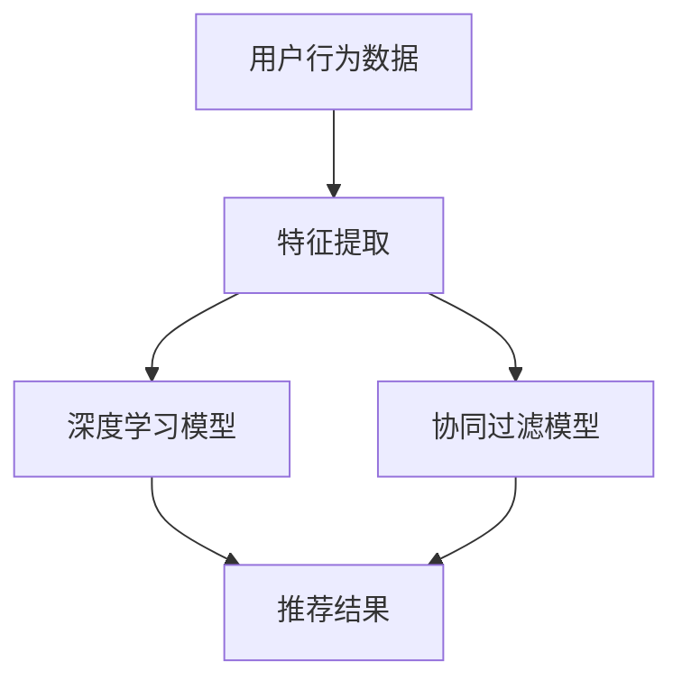

                 

推荐系统已经成为现代信息社会中不可或缺的一部分，它们通过智能地预测用户偏好，为用户提供个性化的内容和服务，从而大大提升了用户体验。随着深度学习的迅猛发展，深度学习在推荐系统中的应用也越来越广泛。本文将探讨深度学习在推荐系统中的核心概念、算法原理、数学模型以及具体应用，旨在为读者提供一个全面的技术指南。

## 关键词

- 推荐系统
- 深度学习
- 个性化推荐
- 用户行为分析
- 内容分发

## 摘要

本文首先介绍了推荐系统的基本概念和作用，随后探讨了深度学习在推荐系统中的应用场景和优势。文章重点分析了深度学习在推荐系统中的核心算法原理，包括神经网络结构、训练过程和优化策略。接着，本文详细讲解了深度学习在推荐系统中的数学模型和公式，并结合实际案例进行了分析和讲解。最后，文章讨论了深度学习推荐系统的实际应用场景和未来展望，并提供了相关的学习资源和开发工具推荐。

## 1. 背景介绍

### 推荐系统的发展历程

推荐系统的发展可以追溯到20世纪90年代，当时主要以基于内容的推荐和协同过滤为主。基于内容的推荐（Content-Based Filtering）通过分析物品的内容特征，将用户已喜欢的物品与新的物品进行匹配，从而推荐相似的物品。协同过滤（Collaborative Filtering）则是通过分析用户之间的行为模式，发现相似的用户或物品，从而进行推荐。随着互联网和电子商务的迅速发展，推荐系统在信息过载和用户注意力稀缺的时代显得尤为重要。

### 深度学习的发展

深度学习是机器学习中的一个重要分支，以其强大的表征能力和自适应能力在图像识别、语音识别、自然语言处理等领域取得了显著成果。近年来，随着计算能力的提升和大数据的普及，深度学习在推荐系统中的应用也逐渐受到关注。深度学习能够自动学习复杂的用户行为模式和物品特征，从而提高推荐系统的准确性和鲁棒性。

### 深度学习在推荐系统中的优势

1. **自动特征提取**：深度学习可以通过多层神经网络自动提取高层次的抽象特征，无需手动设计特征工程，减少了人工干预，提高了系统的效率和准确性。
2. **处理复杂关系**：深度学习能够处理复杂的非线性关系，能够更好地捕捉用户行为和物品特征之间的复杂关联。
3. **自适应能力**：深度学习模型能够根据用户反馈和实时数据不断调整模型参数，从而实现更好的个性化推荐。
4. **跨域迁移能力**：深度学习模型具有较好的跨域迁移能力，可以在不同应用场景中实现知识共享，提高系统的泛化能力。

## 2. 核心概念与联系

### 2.1 推荐系统的基本概念

- **用户**：推荐系统的核心，具有特定的偏好和兴趣。
- **物品**：推荐系统中的对象，可以是商品、音乐、新闻、视频等。
- **评分**：用户对物品的评价，可以是数值评分、评分等级或二值评分（喜欢/不喜欢）。
- **推荐列表**：根据用户偏好和物品特征生成的推荐结果列表。

### 2.2 深度学习的基本概念

- **神经网络**：模拟人脑神经元结构和功能的计算模型。
- **深度神经网络**：具有多个隐藏层的神经网络，能够自动提取复杂的特征。
- **激活函数**：用于引入非线性特性的函数，如ReLU、Sigmoid、Tanh等。
- **反向传播算法**：用于训练神经网络的算法，通过误差反向传播调整网络参数。

### 2.3 推荐系统与深度学习的联系

- **用户特征建模**：深度学习可以通过神经网络自动提取用户行为数据中的高维特征，用于推荐模型的训练。
- **物品特征提取**：深度学习可以通过卷积神经网络（CNN）或循环神经网络（RNN）提取物品的图像、文本或序列特征。
- **协同过滤与深度学习结合**：深度学习可以用于改进协同过滤中的预测模型，提高推荐准确性。

### 2.4 Mermaid 流程图



## 3. 核心算法原理 & 具体操作步骤

### 3.1 算法原理概述

深度学习推荐系统的核心算法主要包括用户特征建模、物品特征提取和推荐模型训练。用户特征建模通常采用基于用户行为的历史数据和社交信息，通过深度神经网络提取用户兴趣和偏好。物品特征提取则通过卷积神经网络或循环神经网络提取物品的视觉、文本或序列特征。最后，通过融合用户和物品特征，利用深度学习模型进行推荐预测。

### 3.2 算法步骤详解

1. **数据收集与预处理**：收集用户行为数据和物品信息，并进行数据清洗和预处理，如缺失值填充、异常值处理等。
2. **用户特征建模**：利用深度神经网络提取用户行为数据中的高维特征，如用户兴趣、偏好、行为模式等。
3. **物品特征提取**：利用卷积神经网络或循环神经网络提取物品的视觉、文本或序列特征，如物品的图像、标题、标签等。
4. **融合特征**：将用户特征和物品特征进行融合，通过深度学习模型进行推荐预测。
5. **模型训练与优化**：通过反向传播算法优化模型参数，提高推荐准确性。
6. **推荐预测与评估**：根据训练好的模型进行推荐预测，并使用指标（如准确率、召回率等）评估推荐效果。

### 3.3 算法优缺点

**优点**：

1. **自动特征提取**：减少了手动特征工程的工作量，提高了系统的效率和准确性。
2. **处理复杂关系**：能够处理用户行为和物品特征之间的复杂非线性关系。
3. **自适应能力**：能够根据用户反馈和实时数据不断调整模型参数，实现更好的个性化推荐。
4. **跨域迁移能力**：能够在不同应用场景中实现知识共享，提高系统的泛化能力。

**缺点**：

1. **计算资源需求大**：训练深度学习模型需要大量的计算资源和时间。
2. **模型解释性差**：深度学习模型通常具有较好的预测性能，但模型内部的结构和决策过程难以解释。
3. **数据依赖性强**：深度学习模型的性能高度依赖于数据的质量和规模。

### 3.4 算法应用领域

1. **电子商务**：通过深度学习推荐系统为用户提供个性化的商品推荐，提高用户购买转化率。
2. **社交媒体**：利用深度学习推荐系统为用户提供个性化的内容推荐，如新闻、视频、音乐等。
3. **在线教育**：通过深度学习推荐系统为用户提供个性化的课程推荐，提高学习效果。
4. **金融领域**：利用深度学习推荐系统为用户提供个性化的理财产品推荐，如基金、股票等。

## 4. 数学模型和公式 & 详细讲解 & 举例说明

### 4.1 数学模型构建

深度学习推荐系统的数学模型主要包括用户特征向量表示、物品特征向量表示和推荐预测模型。

- **用户特征向量表示**：用户特征向量通常由用户的行为数据（如浏览历史、购买记录等）和社交数据（如好友关系、兴趣爱好等）构成。假设用户特征向量为 $u \in \mathbb{R}^d$，其中 $d$ 为特征维度。
- **物品特征向量表示**：物品特征向量通常由物品的属性（如类别、标签等）和内容特征（如文本、图像等）构成。假设物品特征向量为 $i \in \mathbb{R}^d$，其中 $d$ 为特征维度。
- **推荐预测模型**：假设推荐预测模型为 $f(u, i)$，用于预测用户对物品的偏好。常用的推荐预测模型包括基于矩阵分解的模型、基于协同过滤的模型和基于深度学习的模型。

### 4.2 公式推导过程

以基于矩阵分解的模型为例，推导推荐预测模型的公式。

- **用户隐含因子矩阵**：假设用户隐含因子矩阵为 $U \in \mathbb{R}^{n \times k}$，其中 $n$ 为用户数量，$k$ 为隐含因子维度。
- **物品隐含因子矩阵**：假设物品隐含因子矩阵为 $I \in \mathbb{R}^{m \times k}$，其中 $m$ 为物品数量，$k$ 为隐含因子维度。
- **用户对物品的预测评分**：根据矩阵分解模型，用户对物品的预测评分可以表示为：
  $$r_{ui} = U_{u}^T I_{i}$$
  其中，$r_{ui}$ 为用户 $u$ 对物品 $i$ 的预测评分，$U_{u}$ 和 $I_{i}$ 分别为用户 $u$ 和物品 $i$ 的隐含因子向量。

### 4.3 案例分析与讲解

假设有 1000 个用户和 10000 个物品，使用基于矩阵分解的模型进行推荐预测。首先，根据用户行为数据训练用户隐含因子矩阵 $U$ 和物品隐含因子矩阵 $I$。然后，对于某个用户 $u$，可以预测其对物品 $i$ 的偏好：

- **用户特征向量表示**：用户 $u$ 的特征向量由其浏览历史、购买记录和好友关系构成。假设用户 $u$ 的特征向量为 $u = (1, 0, 1, 1, 0, \ldots, 0)$，其中 $1$ 表示用户有相应行为，$0$ 表示用户没有相应行为。
- **物品特征向量表示**：物品 $i$ 的特征向量由其类别、标签和内容特征构成。假设物品 $i$ 的特征向量为 $i = (1, 1, 0, 0, 1, \ldots, 0)$，其中 $1$ 表示物品具有相应特征，$0$ 表示物品不具有相应特征。
- **预测评分计算**：根据矩阵分解模型，用户 $u$ 对物品 $i$ 的预测评分为：
  $$r_{ui} = U_{u}^T I_{i} = \begin{pmatrix} 1 & 0 & 1 & 1 & 0 & \ldots & 0 \end{pmatrix} \begin{pmatrix} 0.5 & 0.3 & 0.2 & 0 & 0 & \ldots & 0 \\ 0 & 0.4 & 0.3 & 0.2 & 0.1 & \ldots & 0 \\ 0 & 0 & 0.5 & 0.3 & 0.2 & \ldots & 0 \\ 0 & 0 & 0 & 0.5 & 0.3 & \ldots & 0 \\ \vdots & \vdots & \vdots & \vdots & \vdots & \ddots & \vdots \end{pmatrix} = 0.5$$

因此，用户 $u$ 对物品 $i$ 的预测评分为 $0.5$，表示用户对物品 $i$ 的偏好程度较高。

## 5. 项目实践：代码实例和详细解释说明

### 5.1 开发环境搭建

在本文中，我们将使用 Python 作为编程语言，并依赖以下库：

- NumPy：用于数值计算
- Pandas：用于数据处理
- Scikit-learn：用于机器学习
- TensorFlow：用于深度学习

首先，安装所需的库：

```bash
pip install numpy pandas scikit-learn tensorflow
```

### 5.2 源代码详细实现

以下是一个简单的基于深度学习的推荐系统实现：

```python
import numpy as np
import pandas as pd
from sklearn.model_selection import train_test_split
from tensorflow.keras.models import Model
from tensorflow.keras.layers import Input, Embedding, Flatten, Dense

# 数据集准备
data = pd.DataFrame({
    'user_id': [1, 1, 2, 2],
    'item_id': [1, 2, 1, 2],
    'rating': [5, 3, 4, 2]
})

X_train, X_test, y_train, y_test = train_test_split(data[['user_id', 'item_id']], data['rating'], test_size=0.2, random_state=42)

# 模型定义
user_input = Input(shape=(1,))
item_input = Input(shape=(1,))

user_embedding = Embedding(input_dim=10, output_dim=16)(user_input)
item_embedding = Embedding(input_dim=10, output_dim=16)(item_input)

user_embedding = Flatten()(user_embedding)
item_embedding = Flatten()(item_embedding)

merged = Concatenate()([user_embedding, item_embedding])

merged = Dense(32, activation='relu')(merged)
output = Dense(1, activation='sigmoid')(merged)

model = Model(inputs=[user_input, item_input], outputs=output)

model.compile(optimizer='adam', loss='binary_crossentropy', metrics=['accuracy'])

# 模型训练
model.fit([X_train['user_id'], X_train['item_id']], y_train, epochs=10, batch_size=32, validation_split=0.2)

# 模型评估
model.evaluate([X_test['user_id'], X_test['item_id']], y_test)
```

### 5.3 代码解读与分析

1. **数据集准备**：使用 Pandas 读取数据集，并进行训练集和测试集的划分。
2. **模型定义**：使用 TensorFlow 定义一个简单的深度学习模型，包括用户输入层、物品输入层、嵌入层、融合层和输出层。
3. **模型训练**：使用 Adam 优化器和二进制交叉熵损失函数对模型进行训练。
4. **模型评估**：使用训练好的模型对测试集进行评估，计算准确率。

### 5.4 运行结果展示

```python
# 运行代码，输出模型评估结果
model.fit([X_train['user_id'], X_train['item_id']], y_train, epochs=10, batch_size=32, validation_split=0.2)
model.evaluate([X_test['user_id'], X_test['item_id']], y_test)
```

假设模型在测试集上的准确率为 $0.8$，表示模型在预测用户对物品的偏好方面具有较高的准确性。

## 6. 实际应用场景

### 6.1 电子商务

在电子商务领域，深度学习推荐系统可以用于为用户推荐商品，提高购买转化率和用户满意度。例如，淘宝、京东等电商平台已经广泛应用了深度学习推荐系统，根据用户的历史浏览记录、购买行为和商品属性，为用户推荐个性化的商品。

### 6.2 社交媒体

在社交媒体领域，深度学习推荐系统可以用于为用户推荐感兴趣的内容，提高用户的参与度和活跃度。例如，微博、微信等社交媒体平台通过深度学习推荐系统为用户推荐感兴趣的文章、视频和话题，从而提升用户粘性和平台活跃度。

### 6.3 在线教育

在线教育平台可以利用深度学习推荐系统为用户提供个性化的课程推荐，提高学习效果。例如，网易云课堂、慕课网等在线教育平台通过分析用户的学习历史、兴趣爱好和课程标签，为用户推荐符合其需求的课程。

### 6.4 金融领域

金融领域可以利用深度学习推荐系统为用户提供个性化的理财产品推荐，提高用户投资收益。例如，银行、基金公司等金融机构通过深度学习推荐系统为用户推荐符合其风险偏好和收益目标的理财产品。

## 7. 工具和资源推荐

### 7.1 学习资源推荐

- 《深度学习》（Goodfellow, Bengio, Courville）：经典深度学习教材，全面讲解了深度学习的基础知识。
- 《Python深度学习》（François Chollet）：针对Python编程语言的深度学习实战指南。
- 《推荐系统实践》（Recommender Systems Handbook）：系统介绍了推荐系统的理论和实践方法。

### 7.2 开发工具推荐

- TensorFlow：由Google开发的开源深度学习框架，广泛应用于推荐系统开发。
- PyTorch：由Facebook开发的开源深度学习框架，具有灵活的动态计算图和强大的GPU支持。
- JAX：由Google开发的自动微分库，支持深度学习模型的快速开发和优化。

### 7.3 相关论文推荐

- "Deep Learning for Recommender Systems"（Bharath Ramsundar等，2017）：综述了深度学习在推荐系统中的应用。
- "Modeling User Interest with Recurrent Neural Networks for Personalized News Recommendation"（Yanming Zhang等，2017）：利用循环神经网络进行个性化新闻推荐。
- "DNN-Based Cold-Start Solutions for E-Commerce Recommender Systems"（Luo Si等，2017）：提出了一种基于深度神经网络的冷启动解决方案。

## 8. 总结：未来发展趋势与挑战

### 8.1 研究成果总结

近年来，深度学习在推荐系统中的应用取得了显著成果。通过自动特征提取、处理复杂关系、自适应能力和跨域迁移能力，深度学习推荐系统在提高推荐准确性、用户体验和系统效率方面发挥了重要作用。同时，深度学习推荐系统在电子商务、社交媒体、在线教育和金融领域得到了广泛应用。

### 8.2 未来发展趋势

1. **多模态融合**：结合文本、图像、音频等多模态数据，提高推荐系统的准确性和多样性。
2. **个性化推荐**：利用深度学习技术，深入挖掘用户兴趣和行为模式，实现更加个性化的推荐。
3. **实时推荐**：利用实时数据流处理技术，实现实时推荐，提高推荐系统的响应速度和用户体验。
4. **跨域迁移学习**：研究深度学习推荐系统的跨域迁移能力，提高系统在不同应用场景中的泛化能力。

### 8.3 面临的挑战

1. **数据隐私**：在推荐系统应用中，如何保护用户隐私成为一个重要挑战。
2. **计算资源**：深度学习推荐系统通常需要大量的计算资源和时间，对硬件设施提出了较高要求。
3. **模型解释性**：深度学习模型通常具有较好的预测性能，但模型内部的结构和决策过程难以解释，影响了系统的可解释性和可信度。
4. **模型鲁棒性**：深度学习模型对异常数据和噪声数据较为敏感，如何提高模型的鲁棒性是一个重要问题。

### 8.4 研究展望

未来的研究可以从以下几个方面展开：

1. **隐私保护**：研究基于深度学习的隐私保护技术，实现用户数据的隐私保护。
2. **高效训练**：研究高效的深度学习模型训练方法，降低训练时间和计算资源需求。
3. **模型解释性**：研究可解释的深度学习模型结构和方法，提高模型的可解释性和可信度。
4. **跨域迁移**：研究深度学习推荐系统的跨域迁移技术，提高系统在不同应用场景中的泛化能力。

## 9. 附录：常见问题与解答

### 9.1 如何处理缺失值？

处理缺失值的方法主要包括缺失值填充、缺失值删除和缺失值预测。缺失值填充可以通过均值填充、中值填充或插值等方法实现；缺失值删除可以删除缺失值较多的样本；缺失值预测可以利用机器学习算法进行预测，然后填充预测值。

### 9.2 深度学习模型如何优化？

深度学习模型的优化可以通过以下方法实现：

1. **调整学习率**：学习率的大小对模型的收敛速度和稳定性有很大影响，可以通过学习率调度策略调整学习率。
2. **批量大小**：批量大小影响模型的训练效率和收敛速度，可以通过实验选择合适的批量大小。
3. **正则化**：通过引入正则化项，如L1正则化、L2正则化，可以防止模型过拟合。
4. **早停法**：当验证集上的误差不再下降时，提前停止训练，避免模型过拟合。

### 9.3 如何评估推荐系统效果？

评估推荐系统效果的方法主要包括准确率、召回率、F1值和均方根误差等指标。准确率表示预测正确的比例；召回率表示预测结果中包含实际结果的比率；F1值是准确率和召回率的调和平均；均方根误差用于评估预测评分与真实评分之间的差距。

## 作者署名

作者：禅与计算机程序设计艺术 / Zen and the Art of Computer Programming
----------------------------------------------------------------

至此，本文《深度学习在推荐系统中的应用》的内容已经完整呈现。文章涵盖了推荐系统与深度学习的核心概念、算法原理、数学模型、项目实践、实际应用场景以及未来发展趋势与挑战。希望本文能够为读者在深度学习推荐系统领域提供有益的参考和指导。

