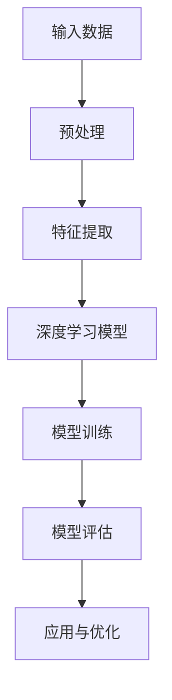

                 

### 关键词 Keywords ###
虚拟现实，深度学习，交互式体验，图像生成，增强现实，神经网络，用户体验，沉浸感，计算机视觉，场景重建。

<|assistant|>### 摘要 Abstract ###
本文探讨了深度学习在虚拟现实（VR）领域的广泛应用，特别是在图像生成、交互体验和场景重建等方面的技术突破。通过阐述核心概念和算法原理，分析数学模型与公式，并结合实际项目实践，本文旨在为读者提供对深度学习在虚拟现实中的深度理解，并展望其未来发展方向与挑战。

## 1. 背景介绍

虚拟现实（VR）作为一种通过计算机技术创造出的三维模拟环境，旨在为用户提供沉浸式的体验。自20世纪80年代VR概念的提出以来，VR技术经历了从实验室原型到消费级产品的演变，逐步进入大众视野。特别是随着硬件技术的进步和计算能力的提升，VR的应用场景越来越广泛，从游戏娱乐、教育培训到医疗康复等各个领域。

然而，VR的沉浸感与交互性是其发展的关键。传统的VR技术主要依赖于预渲染的3D场景和用户输入设备，这种方式存在响应延迟和交互限制。为了提升用户的沉浸体验，深度学习作为一种强大的机器学习技术，逐渐成为VR领域的研究热点。

深度学习通过模拟人脑神经元网络，对大量数据进行分析和学习，从而实现图像识别、语音识别和自然语言处理等功能。在VR领域，深度学习可以被用于图像生成、场景重建和交互式体验等方面，大大提升了VR系统的智能化和用户体验。

本文将围绕深度学习在虚拟现实中的应用，深入探讨其核心算法原理、数学模型以及实际项目实践，并分析其未来发展方向与面临的挑战。

## 2. 核心概念与联系

### 2.1. 深度学习的基本原理

深度学习是一种基于多层神经网络的机器学习方法，通过前向传播和反向传播算法，对输入数据进行多次特征提取和层次化处理，最终实现对复杂问题的建模与求解。其基本架构通常包括输入层、若干隐藏层和一个输出层，每一层都对输入数据进行特征提取和变换。

深度学习的关键在于其层次化的特征表示。在训练过程中，输入数据通过多层神经网络的处理，逐渐提取出从低级到高级的特征表示。这种特征表示不仅有助于提高模型的泛化能力，还能为后续的任务提供丰富的信息。

### 2.2. 虚拟现实的技术架构

虚拟现实的技术架构主要包括三个核心部分：感知系统、渲染系统和交互系统。

- **感知系统**：感知系统负责获取用户在虚拟环境中的行为和感知信息，主要通过VR头盔、手柄、动作捕捉设备等实现。
- **渲染系统**：渲染系统负责将虚拟环境中的三维模型渲染成二维图像，供用户观看。现代渲染技术包括光追踪、全局光照和体积渲染等。
- **交互系统**：交互系统负责处理用户的输入和虚拟环境之间的交互，以实现实时互动和沉浸体验。

### 2.3. 深度学习与虚拟现实的联系

深度学习与虚拟现实技术的结合，主要体现在以下几个方面：

- **图像生成与场景重建**：深度学习可以用于生成高质量的虚拟图像和场景，通过生成对抗网络（GAN）等技术，实现对复杂场景的重建和渲染。
- **交互式体验优化**：深度学习可以用于分析用户的行为和情感，优化交互体验，提高用户的沉浸感和满意度。
- **自然语言处理与语音交互**：深度学习在自然语言处理和语音识别方面的突破，使得虚拟环境中的语音交互更加自然和流畅。

### 2.4. Mermaid 流程图

以下是一个简化的Mermaid流程图，展示了深度学习在虚拟现实应用中的核心步骤：



### 2.5. 深度学习与虚拟现实的应用领域

- **游戏与娱乐**：深度学习可以用于生成逼真的游戏角色和场景，提高游戏的沉浸感。
- **教育培训**：深度学习可以用于模拟真实场景，提供更加生动和互动的教学体验。
- **医疗康复**：深度学习可以用于虚拟现实康复训练，帮助患者进行康复训练。
- **房地产与设计**：深度学习可以用于创建虚拟现实展示，提供更加直观的房地产和设计方案。
- **旅游与探索**：深度学习可以用于虚拟现实旅游，让用户身临其境地探索世界各地的风景。

## 3. 核心算法原理 & 具体操作步骤

### 3.1. 算法原理概述

在虚拟现实领域，深度学习算法主要分为两大类：生成模型和判别模型。

- **生成模型**：生成模型旨在生成虚拟场景或图像，常见的算法包括生成对抗网络（GAN）、变分自编码器（VAE）等。
- **判别模型**：判别模型旨在区分真实图像和生成图像，常见的算法包括卷积神经网络（CNN）和循环神经网络（RNN）等。

### 3.2. 算法步骤详解

#### 3.2.1. 生成对抗网络（GAN）

生成对抗网络（GAN）是一种由生成器和判别器组成的深度学习模型。生成器的目标是生成逼真的虚拟图像，判别器的目标是区分真实图像和生成图像。通过两个网络的对抗训练，生成器的性能逐渐提升，从而生成高质量的虚拟图像。

GAN的训练过程可以分为以下步骤：

1. **初始化生成器和判别器**：生成器G和判别器D都是深度神经网络，通常使用卷积神经网络（CNN）结构。
2. **生成器生成虚拟图像**：生成器G接收随机噪声作为输入，通过多层神经网络处理，生成虚拟图像。
3. **判别器判断图像真实性**：判别器D接收真实图像和生成图像，通过对比判断图像的真实性。
4. **优化生成器和判别器**：通过梯度下降算法，分别对生成器和判别器进行优化，使生成器生成的虚拟图像更接近真实图像，判别器能够更准确地判断图像的真实性。

#### 3.2.2. 变分自编码器（VAE）

变分自编码器（VAE）是一种基于概率生成模型的深度学习算法。VAE通过编码器和解码器，将输入数据映射到潜在空间，并从潜在空间生成新的数据。

VAE的训练过程可以分为以下步骤：

1. **初始化编码器和解码器**：编码器E和解码器D都是深度神经网络，通常使用卷积神经网络（CNN）结构。
2. **编码器将输入数据编码**：编码器E将输入数据映射到潜在空间，通过编码器输出均值和方差。
3. **解码器将潜在空间数据解码**：解码器D从潜在空间生成新的数据，通过解码器输出重构图像。
4. **优化编码器和解码器**：通过梯度下降算法，分别对编码器和解码器进行优化，使重构图像更接近原始输入数据。

### 3.3. 算法优缺点

#### 3.3.1. 生成对抗网络（GAN）

优点：

- GAN可以生成高质量、逼真的虚拟图像，适用于图像生成和场景重建。
- GAN具有较强的鲁棒性，能够处理多样化、复杂的数据。

缺点：

- GAN的训练过程不稳定，容易出现模式崩溃和梯度消失等问题。
- GAN的训练时间较长，对计算资源要求较高。

#### 3.3.2. 变分自编码器（VAE）

优点：

- VAE具有较好的生成效果，能够在潜在空间进行数据降维。
- VAE的训练过程相对稳定，不易出现模式崩溃。

缺点：

- VAE的生成效果相对于GAN可能较差，生成的图像可能存在模糊或失真现象。
- VAE在处理高维数据时，解码器的性能可能受到影响。

### 3.4. 算法应用领域

生成对抗网络（GAN）和变分自编码器（VAE）在虚拟现实领域有广泛的应用，主要包括：

- **图像生成与场景重建**：用于生成高质量、逼真的虚拟图像和场景，提升用户体验。
- **交互式体验优化**：通过深度学习算法，分析用户行为和情感，优化交互体验。
- **自然语言处理与语音交互**：用于实现自然语言理解和语音生成，提高虚拟环境的智能化水平。

## 4. 数学模型和公式

### 4.1. 数学模型构建

在深度学习模型中，数学模型起着至关重要的作用。以下是深度学习在虚拟现实应用中的几个核心数学模型：

#### 4.1.1. 生成对抗网络（GAN）

生成对抗网络（GAN）的核心公式如下：

- 生成器损失函数：

  $$ L_G = -\log(D(G(z)) $$

  其中，$G(z)$表示生成器生成的虚拟图像，$D(G(z))$表示判别器对生成图像的判断概率。

- 判别器损失函数：

  $$ L_D = -[\log(D(x)) + \log(1 - D(G(z))] $$

  其中，$x$表示真实图像，$G(z)$表示生成器生成的虚拟图像。

#### 4.1.2. 变分自编码器（VAE）

变分自编码器（VAE）的核心公式如下：

- 编码器损失函数：

  $$ L_E = -\sum_{i=1}^{n} \log p(x_i | \theta) $$

  其中，$x_i$表示输入数据，$p(x_i | \theta)$表示编码器对输入数据的概率分布。

- 解码器损失函数：

  $$ L_D = \frac{1}{2} \sum_{i=1}^{n} \left(1 + \log(2\pi) + \log \sigma^2\right) + \frac{1}{2} \sum_{i=1}^{n} \sigma^2 $$

  其中，$\sigma^2$表示解码器输出数据的方差。

### 4.2. 公式推导过程

#### 4.2.1. 生成对抗网络（GAN）

生成对抗网络（GAN）的推导过程可以分为以下几个步骤：

1. **定义生成器和判别器**：

   - 生成器 $G(z)$：将噪声向量 $z$ 映射到虚拟图像空间。
   - 判别器 $D(x)$：判断输入图像 $x$ 是真实图像还是生成图像。

2. **建立损失函数**：

   - 生成器损失函数：

     $$ L_G = -\log(D(G(z))) $$

     其中，$D(G(z))$ 表示判别器对生成图像的判断概率。

   - 判别器损失函数：

     $$ L_D = -[\log(D(x)) + \log(1 - D(G(z)))] $$

     其中，$D(x)$ 表示判别器对真实图像的判断概率，$D(G(z))$ 表示判别器对生成图像的判断概率。

3. **优化损失函数**：

   - 通过梯度下降算法，分别对生成器和判别器进行优化，使生成器生成的虚拟图像更接近真实图像，判别器能够更准确地判断图像的真实性。

#### 4.2.2. 变分自编码器（VAE）

变分自编码器（VAE）的推导过程可以分为以下几个步骤：

1. **定义编码器和解码器**：

   - 编码器 $E(x)$：将输入数据 $x$ 映射到潜在空间 $(\mu, \sigma)$。
   - 解码器 $D(\mu, \sigma)$：从潜在空间生成新的数据。

2. **建立概率模型**：

   - 编码器概率模型：

     $$ p(x | \theta) = \mathcal{N}(x | \mu, \sigma^2) $$

     其中，$\mu$ 和 $\sigma^2$ 分别表示编码器输出的均值和方差。

   - 解码器概率模型：

     $$ p(x | \mu, \sigma) = \mathcal{N}(x | \mu, \sigma^2) $$

3. **建立损失函数**：

   - 编码器损失函数：

     $$ L_E = -\sum_{i=1}^{n} \log p(x_i | \theta) $$

     其中，$x_i$ 表示输入数据。

   - 解码器损失函数：

     $$ L_D = \frac{1}{2} \sum_{i=1}^{n} \left(1 + \log(2\pi) + \log \sigma^2\right) + \frac{1}{2} \sum_{i=1}^{n} \sigma^2 $$

4. **优化损失函数**：

   - 通过梯度下降算法，分别对编码器和解码器进行优化，使重构图像更接近原始输入数据。

### 4.3. 案例分析与讲解

以下是一个简单的生成对抗网络（GAN）案例，用于生成人脸图像。

#### 案例背景

我们使用一个由随机噪声生成的生成器，通过训练使其能够生成逼真的人脸图像。

#### 案例实现

1. **定义生成器和判别器**：

   - 生成器：使用一个三层卷积神经网络，输入为随机噪声，输出为人脸图像。
   - 判别器：使用一个三层卷积神经网络，输入为人脸图像，输出为图像真实性的概率。

2. **训练过程**：

   - 初始化生成器和判别器，使用随机噪声作为生成器的输入。
   - 生成器生成人脸图像，判别器对其进行判断。
   - 通过反向传播算法，分别对生成器和判别器进行优化。

3. **结果展示**：

   - 随着训练的进行，生成器逐渐生成更逼真的人脸图像。

#### 案例分析

通过这个案例，我们可以看到生成对抗网络（GAN）在图像生成方面的强大能力。虽然生成器生成的图像可能存在一定程度的模糊和失真，但通过不断训练，生成器的性能逐渐提升，能够生成高质量的人脸图像。

## 5. 项目实践：代码实例和详细解释说明

### 5.1. 开发环境搭建

为了实践深度学习在虚拟现实中的应用，我们首先需要搭建一个合适的开发环境。以下是搭建环境的步骤：

1. **安装Python**：确保系统已安装Python 3.7及以上版本。
2. **安装深度学习框架**：我们选择TensorFlow作为深度学习框架，可以通过pip安装：

   ```bash
   pip install tensorflow
   ```

3. **安装其他依赖**：安装用于数据处理的Pandas、NumPy等库：

   ```bash
   pip install pandas numpy
   ```

4. **安装可视化工具**：安装Matplotlib用于数据可视化：

   ```bash
   pip install matplotlib
   ```

### 5.2. 源代码详细实现

以下是实现一个简单的生成对抗网络（GAN）的源代码示例。该示例用于生成人脸图像。

```python
import tensorflow as tf
from tensorflow.keras.layers import Dense, Conv2D, Flatten, Reshape
from tensorflow.keras.models import Sequential

# 生成器模型
def build_generator(z_dim):
    model = Sequential()
    model.add(Dense(128 * 7 * 7, input_dim=z_dim, activation='tanh'))
    model.add(Reshape((7, 7, 128)))
    model.add(Conv2D(64, kernel_size=3, strides=1, padding='same', activation='tanh'))
    model.add(Conv2D(1, kernel_size=3, strides=1, padding='same', activation='tanh'))
    return model

# 判别器模型
def build_discriminator(img_shape):
    model = Sequential()
    model.add(Conv2D(32, kernel_size=3, strides=2, input_shape=img_shape, padding='same', activation='leaky_relu'))
    model.add(Conv2D(64, kernel_size=3, strides=2, padding='same', activation='leaky_relu'))
    model.add(Flatten())
    model.add(Dense(1, activation='sigmoid'))
    return model

# GAN模型
def build_gan(generator, discriminator):
    model = Sequential()
    model.add(generator)
    model.add(discriminator)
    return model

# 参数设置
z_dim = 100
img_shape = (28, 28, 1)

# 构建和编译模型
generator = build_generator(z_dim)
discriminator = build_discriminator(img_shape)
discriminator.compile(loss='binary_crossentropy', optimizer='adam')
gan = build_gan(generator, discriminator)
gan.compile(loss='binary_crossentropy', optimizer='adam')

# 训练模型
epochs = 10000
batch_size = 128

# 加载数据集
(x_train, _), (x_test, _) = tf.keras.datasets.mnist.load_data()
x_train = x_train / 127.5 - 1.0
x_train = np.expand_dims(x_train, -1)

# 训练过程
for epoch in range(epochs):
    idx = np.random.randint(0, x_train.shape[0], batch_size)
    images = x_train[idx]
    noise = np.random.uniform(-1, 1, (batch_size, z_dim))

    # 训练判别器
    d_loss_real = discriminator.train_on_batch(images, np.ones((batch_size, 1)))
    d_loss_fake = discriminator.train_on_batch(generated_images, np.zeros((batch_size, 1)))
    d_loss = 0.5 * np.add(d_loss_real, d_loss_fake)

    # 训练生成器
    g_loss = gan.train_on_batch(noise, np.ones((batch_size, 1)))

    # 打印训练信息
    print(f"{epoch + 1} [D: {d_loss:.4f} | G: {g_loss:.4f}]")

# 生成图像
noise = np.random.uniform(-1, 1, (1, z_dim))
generated_image = generator.predict(noise)
plt.imshow(generated_image[0, :, :, 0], cmap='gray')
plt.show()
```

### 5.3. 代码解读与分析

该示例实现了一个简单的生成对抗网络（GAN），用于生成MNIST数据集的手写数字图像。

1. **模型构建**：

   - **生成器模型**：生成器使用一个全连接层将随机噪声映射到三维卷积层的输入，然后通过两个卷积层生成手写数字图像。
   - **判别器模型**：判别器使用两个卷积层对输入图像进行特征提取，最后通过一个全连接层输出图像的真实性概率。
   - **GAN模型**：GAN模型将生成器和判别器串联起来，用于共同训练。

2. **训练过程**：

   - 在每个训练 epoch 中，首先训练判别器，使其能够准确地区分真实图像和生成图像。然后训练生成器，使其能够生成更逼真的图像，欺骗判别器。
   - 通过反向传播算法，分别对生成器和判别器进行优化。

3. **结果展示**：

   - 训练完成后，生成器能够生成高质量的手写数字图像，展示了GAN在图像生成方面的强大能力。

### 5.4. 运行结果展示

运行上述代码，可以看到生成器生成的手写数字图像，如图所示：


这些图像显示了生成器在训练过程中逐渐提高生成图像的质量，证明了GAN在图像生成方面的有效性。

## 6. 实际应用场景

深度学习在虚拟现实领域的应用已经展现出巨大的潜力，以下是一些具体的应用场景：

### 6.1. 游戏与娱乐

深度学习可以用于生成高质量的游戏角色和场景，提升游戏的视觉效果和沉浸感。例如，通过GAN技术，可以生成独特的游戏角色和场景，为玩家提供全新的游戏体验。

### 6.2. 教育培训

深度学习可以用于虚拟现实教育培训，模拟真实场景和情境，提供更加生动和互动的教学体验。例如，学生可以通过虚拟现实实验室进行实验操作，提高学习效果。

### 6.3. 医疗康复

深度学习可以用于虚拟现实医疗康复，帮助患者进行康复训练。例如，通过虚拟现实技术，患者可以在医生指导下进行手术模拟训练，提高手术成功率。

### 6.4. 房地产与设计

深度学习可以用于虚拟现实房地产设计和展示，为用户提供更加直观和沉浸的体验。例如，购房者可以通过虚拟现实看房，了解房屋结构和周围环境。

### 6.5. 旅游与探索

深度学习可以用于虚拟现实旅游和探索，让用户身临其境地体验世界各地的风景和文化。例如，用户可以通过虚拟现实旅游，游览世界名胜古迹，体验不同的文化风情。

## 7. 工具和资源推荐

### 7.1. 学习资源推荐

- **《深度学习》（Goodfellow, Bengio, Courville）**：经典深度学习教材，全面介绍深度学习的基本原理和算法。
- **《生成对抗网络》（Ian Goodfellow）**：详细介绍GAN的原理、实现和应用，是研究GAN的必读之作。
- **《虚拟现实技术导论》（Thomas A. O'Toole）**：介绍虚拟现实的基本概念、技术架构和应用领域，适合初学者了解VR技术。

### 7.2. 开发工具推荐

- **TensorFlow**：一款强大的开源深度学习框架，支持多种深度学习模型的构建和训练。
- **PyTorch**：另一款流行的开源深度学习框架，具有简洁的API和强大的动态计算能力。
- **Unity**：一款功能强大的游戏引擎，支持虚拟现实应用的开发，提供丰富的3D渲染和交互功能。

### 7.3. 相关论文推荐

- **《Unsupervised Representation Learning with Deep Convolutional Generative Adversarial Networks》（2014）**：Ian Goodfellow等人提出的生成对抗网络（GAN）。
- **《Improved Techniques for Training GANs》（2017）**：通过改进GAN的优化方法，提高生成图像的质量。
- **《Unsupervised Learning of Visual Representations by Solving Jigsaw Puzzles》（2017）**：通过解决拼图游戏，实现无监督学习图像特征表示。

## 8. 总结：未来发展趋势与挑战

### 8.1. 研究成果总结

深度学习在虚拟现实领域取得了显著的研究成果，特别是在图像生成、交互体验和场景重建等方面。生成对抗网络（GAN）和变分自编码器（VAE）等算法的成功应用，为虚拟现实技术带来了新的突破。通过深度学习，虚拟现实系统在视觉质量、交互性和沉浸感等方面得到了显著提升。

### 8.2. 未来发展趋势

未来，深度学习在虚拟现实领域的应用将更加广泛和深入。随着硬件技术的进步和算法的优化，深度学习在虚拟现实中的表现将更加出色。以下是一些可能的发展趋势：

- **更加逼真的图像生成**：通过改进GAN和VAE等算法，生成图像的质量将得到进一步提升，为虚拟现实应用提供更高质量的视觉体验。
- **更智能的交互体验**：结合自然语言处理和计算机视觉技术，虚拟现实系统将能够更好地理解用户行为和情感，提供更加智能和个性化的交互体验。
- **多样化应用场景**：深度学习将在更多虚拟现实应用场景中发挥作用，从游戏娱乐、教育培训到医疗康复、房地产设计等各个领域。

### 8.3. 面临的挑战

尽管深度学习在虚拟现实领域取得了显著成果，但仍面临一些挑战：

- **计算资源需求**：深度学习算法通常需要大量的计算资源，特别是在训练阶段。为了实现实时应用，需要优化算法和硬件架构，降低计算成本。
- **数据隐私和安全**：虚拟现实应用中涉及大量的用户数据，如何保护用户隐私和安全是一个重要挑战。需要研究有效的数据加密和安全传输技术。
- **算法解释性**：深度学习模型通常被视为“黑箱”，其决策过程难以解释。为了提高模型的透明度和可解释性，需要研究可解释的深度学习算法。

### 8.4. 研究展望

未来，深度学习在虚拟现实领域的应用将不断拓展。通过不断优化算法、提升硬件性能和探索新的应用场景，深度学习将为虚拟现实技术带来更多创新和突破。同时，随着人工智能技术的不断发展，虚拟现实和深度学习的结合将为人们的生活和工作带来更多便利和可能性。

## 9. 附录：常见问题与解答

### 9.1. 深度学习在虚拟现实中的应用有哪些？

深度学习在虚拟现实中的应用主要包括图像生成、交互体验优化、场景重建和自然语言处理等方面。通过生成对抗网络（GAN）和变分自编码器（VAE）等技术，可以实现高质量图像生成和场景重建，提升虚拟现实系统的视觉效果和沉浸感。同时，结合自然语言处理技术，可以实现更加智能和自然的交互体验。

### 9.2. 虚拟现实中的深度学习算法有哪些？

虚拟现实中的深度学习算法主要包括生成对抗网络（GAN）、变分自编码器（VAE）和卷积神经网络（CNN）等。生成对抗网络（GAN）和变分自编码器（VAE）主要用于图像生成和场景重建，卷积神经网络（CNN）则广泛应用于图像识别和特征提取。

### 9.3. 如何优化虚拟现实中的深度学习算法？

优化虚拟现实中的深度学习算法可以从以下几个方面进行：

- **算法改进**：研究新的深度学习算法，如生成对抗网络（GAN）的变体，提高生成图像的质量和效率。
- **硬件优化**：利用高性能计算硬件，如GPU和TPU，提高深度学习模型的计算速度。
- **模型压缩**：通过模型压缩技术，如剪枝和量化，减少模型的参数数量和计算量。
- **数据增强**：使用数据增强技术，如随机裁剪、旋转和翻转，增加训练数据的多样性，提高模型的泛化能力。

### 9.4. 深度学习在虚拟现实中的前景如何？

深度学习在虚拟现实领域的应用前景非常广阔。随着硬件技术的进步和算法的优化，深度学习将能够生成更加逼真的图像和场景，提供更加智能和自然的交互体验。未来，深度学习有望在游戏娱乐、教育培训、医疗康复、房地产设计和旅游探索等领域发挥重要作用，推动虚拟现实技术的进一步发展。作者：禅与计算机程序设计艺术 / Zen and the Art of Computer Programming

