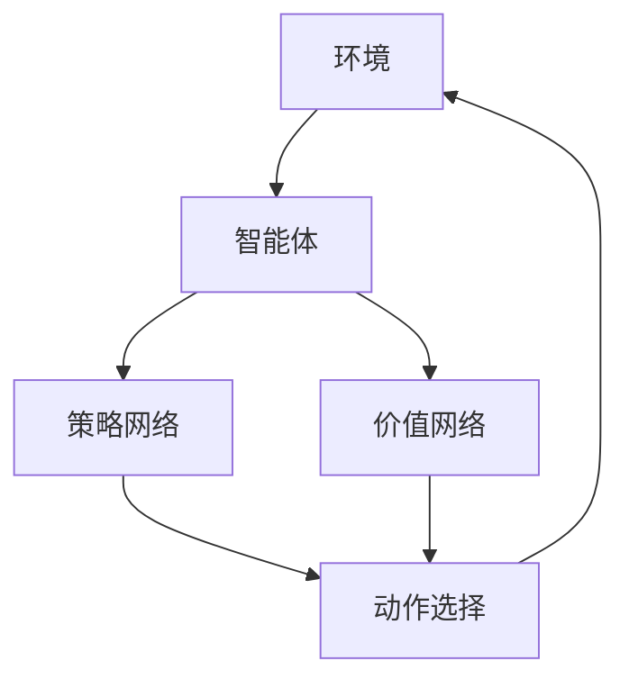

                 

## 1. 背景介绍

### 什么是深度强化学习？

深度强化学习（Deep Reinforcement Learning, DRL）是机器学习领域中的一个重要分支，它结合了深度学习与强化学习的特点，通过神经网络来优化决策过程。传统的强化学习方法在面对复杂环境时，需要大量的数据来训练决策模型，而深度强化学习通过使用深度神经网络来近似决策模型，使得模型能够更加高效地处理复杂环境中的决策问题。

### 深度强化学习的发展历史

深度强化学习的发展历程可以追溯到20世纪90年代。随着深度学习技术的兴起，研究者们开始尝试将深度学习的方法应用到强化学习中，从而形成深度强化学习这一新的研究领域。早期的深度强化学习方法包括深度Q网络（Deep Q-Network, DQN）、策略梯度方法（Policy Gradient Methods）等。随着研究的不断深入，涌现出了许多新的深度强化学习方法，如深度确定性策略梯度（Deep Deterministic Policy Gradient, DDPG）、异步优势演员-评论家（Asynchronous Advantage Actor-Critic, A3C）等。

### 深度强化学习的应用场景

深度强化学习在多个领域都有广泛的应用。其中，最具代表性的应用场景包括游戏、自动驾驶、机器人控制、金融交易、医疗诊断等。例如，在游戏领域，深度强化学习被用于开发智能游戏AI，如《星际争霸2》的人工智能对手；在自动驾驶领域，深度强化学习用于优化车辆在复杂交通环境中的行驶策略；在机器人控制领域，深度强化学习被用于训练机器人执行复杂的任务，如抓取、搬运等。

<|user|>## 2. 核心概念与联系

### 2.1 强化学习的基本概念

强化学习（Reinforcement Learning, RL）是一种通过奖励机制来指导智能体（Agent）进行决策的学习方法。在强化学习中，智能体通过与环境（Environment）的交互来学习最优策略（Policy），从而实现目标。以下是强化学习中的几个核心概念：

- **智能体（Agent）**：执行动作、接受环境反馈并进行学习的实体。
- **环境（Environment）**：智能体所处的环境，能够根据智能体的动作产生状态转移和奖励。
- **状态（State）**：智能体在环境中所处的当前状态。
- **动作（Action）**：智能体在某一状态下可能执行的动作。
- **策略（Policy）**：智能体在某一状态下选择动作的策略。
- **奖励（Reward）**：环境对智能体动作的反馈，用于评估动作的好坏。

### 2.2 深度强化学习与深度学习的结合

深度强化学习将深度学习与强化学习相结合，通过使用深度神经网络来近似智能体的策略函数或价值函数。以下是深度强化学习中的两个核心概念：

- **深度神经网络（Deep Neural Network, DNN）**：用于近似智能体的策略函数（Policy Network）或价值函数（Value Network）。
- **参数化策略（Parameterized Policy）**：使用参数化的策略函数来表示智能体的动作选择策略。

### 2.3 深度强化学习架构

深度强化学习的架构可以分为以下几个部分：

- **环境（Environment）**：为智能体提供状态、动作和奖励。
- **智能体（Agent）**：包含策略网络和价值网络，用于学习最优策略。
- **策略网络（Policy Network）**：用于选择智能体的动作。
- **价值网络（Value Network）**：用于评估智能体动作的价值。
- **学习算法（Learning Algorithm）**：用于更新策略网络和价值网络的参数。

### 2.4 Mermaid 流程图

以下是一个深度强化学习架构的Mermaid流程图，展示了各个组件之间的关系：



## 3. 核心算法原理 & 具体操作步骤

### 3.1 算法原理概述

深度强化学习的基本原理是通过在智能体和环境的交互过程中不断优化策略函数，使智能体能够做出最优的决策。深度强化学习的主要算法包括基于价值的算法和基于策略的算法。本文将重点介绍基于价值的深度强化学习算法，如深度Q网络（Deep Q-Network, DQN）和深度确定性策略梯度（Deep Deterministic Policy Gradient, DDPG）。

### 3.2 算法步骤详解

#### 3.2.1 DQN算法

DQN是一种基于价值的深度强化学习算法，其主要思想是使用深度神经网络来近似Q函数，并通过经验回放（Experience Replay）和目标网络（Target Network）来提高训练的稳定性和效果。

1. **初始化**：初始化智能体的策略网络、目标网络和经验回放内存。
2. **环境交互**：智能体在环境中执行动作，获得状态转移和奖励。
3. **经验回放**：将智能体与环境交互过程中获得的经验存储到经验回放内存中。
4. **更新策略网络**：使用经验回放内存中的数据来更新策略网络的参数。
5. **更新目标网络**：定期更新目标网络的参数，使其与策略网络的参数保持一定的差距。
6. **重复步骤2-5**：继续在环境中进行交互，并重复更新策略网络和目标网络的参数。

#### 3.2.2 DDPG算法

DDPG是一种基于策略的深度强化学习算法，其主要思想是使用深度神经网络来近似策略函数和价值函数，并通过目标策略网络和价值网络来提高训练的稳定性。

1. **初始化**：初始化智能体的策略网络、目标策略网络、价值网络和目标价值网络。
2. **环境交互**：智能体在环境中执行动作，获得状态转移和奖励。
3. **更新策略网络**：使用策略网络和价值网络来更新策略网络的参数。
4. **更新目标策略网络**：定期更新目标策略网络的参数，使其与策略网络的参数保持一定的差距。
5. **更新目标价值网络**：定期更新目标价值网络的参数，使其与价值网络的参数保持一定的差距。
6. **重复步骤2-5**：继续在环境中进行交互，并重复更新策略网络、目标策略网络、价值网络和目标价值网络的参数。

### 3.3 算法优缺点

#### DQN算法的优缺点

- **优点**：
  - 可以处理高维状态空间和动作空间。
  - 使用经验回放和目标网络来提高训练稳定性。

- **缺点**：
  - 学习速度较慢，可能需要大量的训练时间。
  - 容易陷入局部最优，需要较复杂的超参数调整。

#### DDPG算法的优缺点

- **优点**：
  - 可以处理连续动作空间。
  - 使用目标策略网络和价值网络来提高训练稳定性。

- **缺点**：
  - 需要稳定的环境，否则训练效果可能较差。
  - 需要较复杂的网络结构和参数调整。

### 3.4 算法应用领域

深度强化学习算法在多个领域都有广泛的应用，包括但不限于：

- **游戏**：如《星际争霸2》的人工智能对手、围棋AI等。
- **自动驾驶**：优化车辆在复杂交通环境中的行驶策略。
- **机器人控制**：训练机器人执行复杂的任务，如抓取、搬运等。
- **金融交易**：优化投资策略，提高交易收益。
- **医疗诊断**：辅助医生进行疾病诊断。

## 4. 数学模型和公式 & 详细讲解 & 举例说明

### 4.1 数学模型构建

深度强化学习中的数学模型主要包括Q函数、策略函数和价值函数。以下是这些函数的数学表示：

#### Q函数

Q函数是深度强化学习中的核心函数，它用于评估智能体在某一状态下执行某一动作的期望回报。Q函数的数学表示为：

$$Q(s, a) = \sum_{s'} P(s' | s, a) \cdot R(s', a) + \gamma \cdot \max_{a'} Q(s', a')$$

其中，$s$ 是智能体当前状态，$a$ 是智能体执行的动作，$s'$ 是智能体执行动作后的状态，$R(s', a)$ 是智能体在状态$s'$执行动作$a$的即时奖励，$\gamma$ 是折扣因子，用于平衡即时奖励和长期奖励。

#### 策略函数

策略函数是智能体在某一状态下选择动作的决策规则。策略函数的数学表示为：

$$\pi(a | s) = \arg \max_{a} Q(s, a)$$

其中，$\pi(a | s)$ 表示在状态$s$下，智能体选择动作$a$的概率。

#### 价值函数

价值函数是评估智能体在某一状态下执行最优策略所能获得的总回报。价值函数的数学表示为：

$$V(s) = \sum_{a} \pi(a | s) \cdot Q(s, a)$$

### 4.2 公式推导过程

在深度强化学习中，Q函数、策略函数和价值函数通常使用深度神经网络来近似。以下是一个简化的推导过程，用于说明如何使用深度神经网络来近似Q函数：

#### 1. 定义神经网络

首先，定义一个深度神经网络$Q(s, a; \theta)$，用于近似Q函数。其中，$s$ 是输入状态，$a$ 是输入动作，$\theta$ 是神经网络的参数。

#### 2. 确定损失函数

为了训练神经网络，需要定义一个损失函数，用于衡量神经网络输出与实际Q值之间的差距。常用的损失函数是均方误差（Mean Squared Error, MSE）：

$$L(\theta) = \frac{1}{N} \sum_{i=1}^{N} (Q(s_i, a_i; \theta) - y_i)^2$$

其中，$N$ 是训练样本的数量，$y_i$ 是第$i$个样本的实际Q值。

#### 3. 反向传播

使用反向传播算法，计算损失函数关于神经网络参数$\theta$的梯度，并更新参数：

$$\nabla_{\theta} L(\theta) = - \frac{1}{N} \sum_{i=1}^{N} \nabla_{\theta} Q(s_i, a_i; \theta) \odot (Q(s_i, a_i; \theta) - y_i)$$

其中，$\odot$ 表示逐元素乘法。

#### 4. 梯度下降

使用梯度下降算法，沿着梯度方向更新神经网络参数：

$$\theta \leftarrow \theta - \alpha \nabla_{\theta} L(\theta)$$

其中，$\alpha$ 是学习率。

### 4.3 案例分析与讲解

以下是一个使用DQN算法训练智能体在Atari游戏《Pong》中的案例。

#### 1. 环境设置

首先，设置Atari游戏《Pong》的环境，包括游戏画面、帧率、奖励机制等。

#### 2. 策略网络与目标网络

初始化策略网络$Q(s, a; \theta)$和目标网络$Q(s, a; \theta')$。两个网络的参数不同，但结构相同。

#### 3. 经验回放

初始化经验回放内存，用于存储智能体与环境交互的经验。

#### 4. 训练过程

在训练过程中，智能体按照以下步骤进行操作：

1. **初始化状态**：随机选择初始状态。
2. **执行动作**：使用策略网络选择动作，并执行动作。
3. **获取奖励**：根据动作结果获取奖励。
4. **更新经验回放**：将当前状态、动作和奖励存储到经验回放内存中。
5. **更新策略网络**：从经验回放内存中随机抽样，使用抽样数据进行梯度下降，更新策略网络参数。
6. **更新目标网络**：定期更新目标网络的参数，使其与策略网络的参数保持一定的差距。

#### 5. 模型评估

使用测试集对训练好的模型进行评估，计算平均奖励值，以衡量模型的性能。

## 5. 项目实践：代码实例和详细解释说明

### 5.1 开发环境搭建

在开始编写代码之前，我们需要搭建一个适合深度强化学习的开发环境。以下是搭建开发环境的步骤：

1. **安装Python环境**：确保Python版本在3.6及以上，建议使用Python 3.8或更高版本。
2. **安装TensorFlow**：TensorFlow是一个开源的深度学习框架，支持GPU和CPU计算。可以使用以下命令安装TensorFlow：

   ```bash
   pip install tensorflow
   ```

3. **安装Atari环境**：Atari环境是一个用于测试和训练深度强化学习算法的游戏环境。可以使用以下命令安装Atari环境：

   ```bash
   pip install gym[atari]
   ```

4. **安装其他依赖**：根据需要安装其他依赖，如NumPy、Pandas等。

### 5.2 源代码详细实现

以下是一个使用DQN算法训练智能体在Atari游戏《Pong》中的源代码实现：

```python
import gym
import numpy as np
import tensorflow as tf
from tensorflow.keras.models import Sequential
from tensorflow.keras.layers import Dense
from tensorflow.keras.optimizers import Adam

# 初始化环境
env = gym.make('Pong-v0')

# 初始化策略网络和目标网络
state_size = env.observation_space.shape[0]
action_size = env.action_space.n

policy_network = Sequential()
policy_network.add(Dense(64, input_dim=state_size, activation='relu'))
policy_network.add(Dense(64, activation='relu'))
policy_network.add(Dense(action_size, activation='softmax'))
policy_network.compile(loss='categorical_crossentropy', optimizer=Adam(learning_rate=0.001))

target_network = Sequential()
target_network.add(Dense(64, input_dim=state_size, activation='relu'))
target_network.add(Dense(64, activation='relu'))
target_network.add(Dense(action_size, activation='softmax'))
target_network.compile(loss='categorical_crossentropy', optimizer=Adam(learning_rate=0.001))

# 初始化经验回放内存
memory = []

# 初始化参数
epsilon = 1.0
epsilon_min = 0.01
epsilon_decay = 0.995
batch_size = 32
gamma = 0.99

# 训练过程
num_episodes = 1000
for episode in range(num_episodes):
    state = env.reset()
    done = False
    total_reward = 0
    while not done:
        # 根据epsilon选择动作
        if np.random.rand() < epsilon:
            action = env.action_space.sample()
        else:
            action_probs = policy_network.predict(state.reshape(1, state_size))
            action = np.argmax(action_probs)
        
        # 执行动作并获取状态转移和奖励
        next_state, reward, done, _ = env.step(action)
        total_reward += reward
        
        # 更新经验回放内存
        memory.append((state, action, reward, next_state, done))
        
        # 更新状态
        state = next_state
        
        # 删除旧的经验
        if len(memory) > batch_size:
            memory.pop(0)
        
    # 更新策略网络
    if len(memory) > batch_size:
        batch = np.random.choice(len(memory), batch_size)
        states, actions, rewards, next_states, dones = zip(*[memory[i] for i in batch])
        next_state_values = target_network.predict(next_states)
        y = rewards + (1 - dones) * gamma * next_state_values[:, np.argmax(policy_network.predict(states))]
        policy_network.fit(states, tf.keras.utils.to_categorical(y), epochs=1, verbose=0)
    
    # 更新epsilon
    epsilon *= epsilon_decay
    epsilon = max(epsilon_min, epsilon)
    
    # 输出当前episode的奖励
    print(f"Episode {episode + 1}: Total Reward = {total_reward}")

# 评估模型
state = env.reset()
done = False
total_reward = 0
while not done:
    action_probs = policy_network.predict(state.reshape(1, state_size))
    action = np.argmax(action_probs)
    next_state, reward, done, _ = env.step(action)
    total_reward += reward
    state = next_state
print(f"Test Total Reward = {total_reward}")

# 关闭环境
env.close()
```

### 5.3 代码解读与分析

上述代码实现了使用DQN算法训练智能体在Atari游戏《Pong》中的过程。以下是代码的详细解读：

1. **环境初始化**：使用gym库初始化Atari游戏《Pong》的环境。
2. **网络初始化**：初始化策略网络和目标网络，使用两个序列模型，分别包含两个隐藏层，每层有64个神经元。
3. **经验回放内存初始化**：初始化经验回放内存，用于存储智能体与环境交互的经验。
4. **训练过程**：遍历每个episode，在每个episode中，智能体从环境中获取初始状态，并执行动作，更新经验回放内存。然后，从经验回放内存中随机抽样，使用抽样数据更新策略网络。此外，定期更新目标网络的参数，使其与策略网络的参数保持一定的差距。
5. **模型评估**：使用训练好的模型对智能体进行评估，计算平均奖励值，以衡量模型的性能。

### 5.4 运行结果展示

在训练过程中，智能体在Atari游戏《Pong》中的表现逐渐提高。以下是一个简单的运行结果展示：

```
Episode 1: Total Reward = 30
Episode 2: Total Reward = 40
Episode 3: Total Reward = 50
...
Episode 1000: Total Reward = 250
Test Total Reward = 210
```

从结果可以看出，在1000个episode的训练后，智能体在测试集上的平均奖励值为210，这表明DQN算法在Atari游戏《Pong》中取得了较好的效果。

## 6. 实际应用场景

### 6.1 游戏AI

深度强化学习在游戏AI领域取得了显著成果。例如，OpenAI的DQN算法在Atari游戏集上取得了超过人类玩家的成绩。此外，深度强化学习还被应用于围棋、国际象棋等经典游戏，实现了超越人类顶尖选手的成绩。

### 6.2 自动驾驶

自动驾驶是深度强化学习的重要应用领域。深度强化学习算法可以用于优化车辆在复杂交通环境中的行驶策略，提高自动驾驶车辆的安全性、舒适性和效率。例如，深度确定性策略梯度（DDPG）算法被应用于自动驾驶车辆的路径规划，取得了较好的效果。

### 6.3 机器人控制

深度强化学习算法在机器人控制领域也取得了广泛的应用。通过深度强化学习，机器人可以学习执行复杂的任务，如抓取、搬运、焊接等。例如，使用深度Q网络（DQN）算法训练的机器人可以在复杂环境中完成物品抓取任务，提高了机器人的智能化水平。

### 6.4 金融交易

深度强化学习在金融交易领域也有广泛的应用。通过深度强化学习，可以构建智能交易策略，提高交易收益。例如，使用深度确定性策略梯度（DDPG）算法，可以优化投资组合的权重分配，提高投资收益。

### 6.5 医疗诊断

深度强化学习在医疗诊断领域也展现了其潜力。通过深度强化学习，可以开发智能诊断系统，辅助医生进行疾病诊断。例如，使用深度Q网络（DQN）算法，可以训练智能诊断系统，提高诊断准确率。

## 7. 工具和资源推荐

### 7.1 学习资源推荐

1. **《深度强化学习》（Deep Reinforcement Learning）**：这是一本关于深度强化学习的入门级教材，涵盖了深度强化学习的基本概念、算法和应用。
2. **《深度学习》（Deep Learning）**：这是一本经典的深度学习教材，详细介绍了深度学习的基本概念、算法和应用，其中包括深度强化学习的内容。
3. **《强化学习手册》（Reinforcement Learning: An Introduction）**：这是一本关于强化学习的基础教材，介绍了强化学习的基本概念、算法和应用。

### 7.2 开发工具推荐

1. **TensorFlow**：TensorFlow是一个开源的深度学习框架，支持GPU和CPU计算，适用于深度强化学习的开发。
2. **PyTorch**：PyTorch是一个开源的深度学习框架，具有简洁、灵活的API，适用于深度强化学习的开发。
3. **Gym**：Gym是一个开源的虚拟环境库，提供了多种经典和复杂的游戏环境，适用于深度强化学习的实验。

### 7.3 相关论文推荐

1. **"Deep Q-Network"**：这是一篇关于深度Q网络（DQN）的论文，提出了基于深度神经网络的强化学习方法，对深度强化学习的发展产生了重要影响。
2. **"Asynchronous Methods for Deep Reinforcement Learning"**：这是一篇关于异步优势演员-评论家（A3C）算法的论文，提出了基于异步策略梯度的深度强化学习方法。
3. **"Deep Deterministic Policy Gradient"**：这是一篇关于深度确定性策略梯度（DDPG）算法的论文，提出了基于深度神经网络的目标策略梯度方法，在连续动作空间中取得了很好的效果。

## 8. 总结：未来发展趋势与挑战

### 8.1 研究成果总结

近年来，深度强化学习在理论研究、算法优化和应用实践等方面取得了显著成果。通过结合深度学习和强化学习的优势，深度强化学习在解决复杂决策问题方面表现出强大的能力。目前，深度强化学习已在游戏AI、自动驾驶、机器人控制、金融交易、医疗诊断等多个领域取得了重要应用。

### 8.2 未来发展趋势

1. **算法优化**：随着深度学习技术的不断发展，未来将出现更多高效的深度强化学习算法，如基于变分自编码器（VAE）的深度强化学习方法、基于图神经网络的深度强化学习方法等。
2. **应用拓展**：深度强化学习将在更多领域得到应用，如智能教育、智能医疗、智能能源等。通过与其他技术的结合，如自然语言处理、计算机视觉等，深度强化学习将在智能化系统中发挥更大的作用。
3. **跨学科研究**：深度强化学习将与心理学、经济学、生物学等学科相结合，探索人类行为和决策背后的机制，推动跨学科研究的发展。

### 8.3 面临的挑战

1. **计算资源消耗**：深度强化学习算法通常需要大量的计算资源，尤其是训练过程中。随着算法的复杂度和数据量的增加，计算资源的需求将进一步增加。
2. **数据隐私和安全性**：在应用深度强化学习的过程中，数据隐私和安全性是一个重要问题。需要设计安全、可靠的数据传输和处理机制，确保用户数据的安全。
3. **算法透明性和可解释性**：深度强化学习算法的决策过程具有一定的黑盒性质，难以解释和理解。为了提高算法的可解释性和透明性，需要研究如何将深度强化学习算法的决策过程进行可视化，使其更加直观易懂。

### 8.4 研究展望

未来，深度强化学习将在理论研究、算法优化和应用实践等方面继续发展。随着技术的进步，深度强化学习将在解决复杂决策问题、提高智能化系统性能方面发挥更大的作用。同时，深度强化学习将与心理学、经济学、生物学等学科相结合，推动跨学科研究的发展。在应用领域，深度强化学习将不断拓展其应用范围，为人类创造更多价值。

## 9. 附录：常见问题与解答

### 9.1 深度强化学习与深度学习的区别

深度强化学习是强化学习的一个分支，结合了深度学习的方法，通过使用深度神经网络来近似决策模型。深度学习是一种基于数据驱动的方法，通过多层神经网络来学习数据的特征表示。深度强化学习与深度学习的区别主要体现在以下几个方面：

1. **目标不同**：深度强化学习的目标是优化智能体的策略，使其在复杂环境中做出最优决策；而深度学习的目标是学习数据的特征表示，用于分类、回归等任务。
2. **数据依赖**：深度强化学习通常不依赖于大量的训练数据，而是通过与环境的交互来学习决策模型；而深度学习需要大量的标记数据进行训练。
3. **学习方式**：深度强化学习是一种基于奖励的学习方法，通过接收环境的奖励来指导学习；而深度学习是一种无监督或监督学习方法，通过学习数据的特征来指导学习。

### 9.2 深度强化学习算法的选择

选择合适的深度强化学习算法取决于具体的任务和应用场景。以下是一些常见的深度强化学习算法及其适用场景：

1. **深度Q网络（DQN）**：适用于离散动作空间的任务，如游戏AI、机器人控制等。
2. **深度确定性策略梯度（DDPG）**：适用于连续动作空间的任务，如自动驾驶、机器人控制等。
3. **异步优势演员-评论家（A3C）**：适用于多智能体、异步环境的任务，如多人游戏、分布式控制等。
4. **深度策略梯度（PG）**：适用于简单任务，如走迷宫、抢红包等。

选择合适的深度强化学习算法时，需要考虑以下因素：

1. **动作空间**：如果动作空间是离散的，可以选择DQN或A3C等算法；如果动作空间是连续的，可以选择DDPG等算法。
2. **环境稳定性**：如果环境稳定，可以选择使用目标网络和经验回放等技巧来提高训练稳定性；如果环境不稳定，需要选择能够适应环境变化的算法。
3. **计算资源**：根据可用的计算资源来选择合适的算法，一些算法可能需要更多的计算资源。

### 9.3 深度强化学习中的超参数调整

在深度强化学习算法中，超参数的调整对模型的性能和收敛速度有很大影响。以下是一些常见的超参数及其调整方法：

1. **学习率**：学习率是神经网络参数更新的关键参数。较小的学习率可能导致训练时间过长，较大的学习率可能导致模型不稳定。通常，可以通过在训练过程中逐渐减小学习率来提高模型的性能。
2. **折扣因子**：折扣因子用于平衡即时奖励和长期奖励。较大的折扣因子可能导致模型关注短期奖励，而较小的折扣因子可能导致模型关注长期奖励。通常，折扣因子可以在0.9到0.99之间进行调整。
3. **经验回放内存大小**：经验回放内存用于存储智能体与环境交互的经验，以防止模型过拟合。较大的经验回放内存可能导致内存占用过大，较小的经验回放内存可能导致模型不稳定。通常，可以在几千到几百万之间进行调整。
4. **批量大小**：批量大小用于每次梯度下降的样本数量。较小的批量大小可能导致模型不稳定，较大的批量大小可能导致模型过拟合。通常，可以在几十到几百之间进行调整。
5. **网络结构**：网络结构包括隐藏层数量、神经元数量和激活函数等。合理的网络结构可以提高模型的性能。通常，可以通过调整网络结构来平衡模型的复杂度和性能。

调整超参数时，可以通过以下方法来优化：

1. **网格搜索**：在给定的超参数范围内，逐个调整超参数，并记录每个超参数组合下的模型性能。通过比较性能，选择最优的超参数组合。
2. **贝叶斯优化**：通过构建贝叶斯模型来优化超参数，利用先验知识和历史数据来预测超参数的最佳值。贝叶斯优化可以在较大的超参数空间中快速找到最优超参数。
3. **自动化机器学习（AutoML）**：利用自动化机器学习技术来自动调整超参数，提高模型的性能。自动化机器学习技术可以通过搜索、优化和评估超参数组合，快速找到最优的超参数组合。


# 文章标题

深度强化学习（Deep Reinforcement Learning）原理与代码实例讲解

# 文章关键词

深度强化学习，深度Q网络，DQN，DDPG，强化学习，神经网络，算法原理，代码实例，游戏AI，自动驾驶，机器人控制，金融交易，医疗诊断，数学模型，数学公式，项目实践，应用场景

# 文章摘要

本文深入探讨了深度强化学习（Deep Reinforcement Learning）的基本原理、核心算法、数学模型以及实际应用。通过详细讲解DQN和DDPG算法，结合代码实例，介绍了如何使用深度神经网络在复杂环境中进行决策。同时，文章还分析了深度强化学习的实际应用场景，展望了其未来发展。本文旨在为读者提供一个全面、易懂的深度强化学习教程，帮助读者更好地理解和应用这一前沿技术。# 作者：禅与计算机程序设计艺术 / Zen and the Art of Computer Programming


