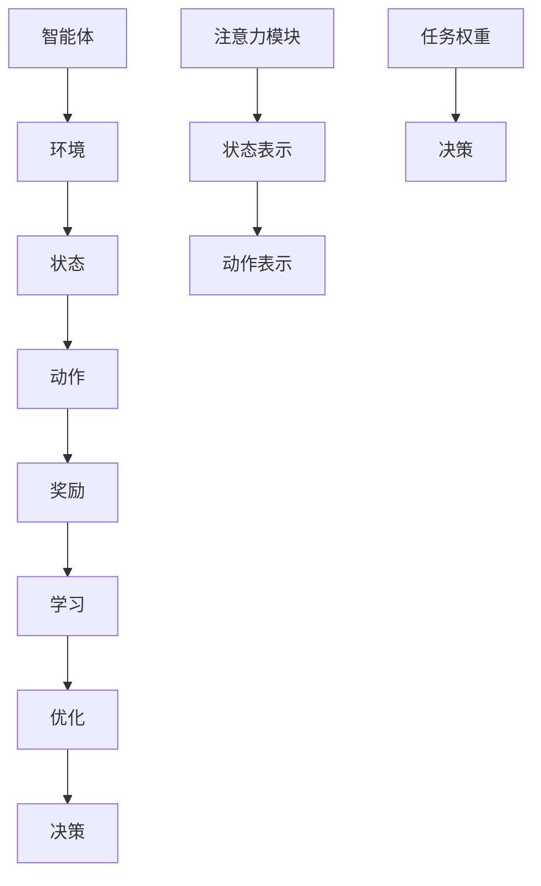

                 

关键词：深度强化学习，注意力机制，策略优化，神经网络，多任务学习，机器人控制，强化学习算法，模拟退火。

摘要：本文旨在探讨深度强化学习（DRL）在注意力策略优化中的应用。首先，我们将回顾深度强化学习的基础知识，并引入注意力策略的概念。接着，我们将详细分析注意力策略优化的核心算法原理和具体操作步骤，同时评估其优缺点。随后，我们将通过数学模型和公式详细讲解，并结合实际项目实例进行代码解读与分析。最后，我们将探讨深度强化学习在注意力策略优化中的实际应用场景，以及未来发展的趋势与面临的挑战。

## 1. 背景介绍

随着人工智能技术的不断发展，深度强化学习（DRL）作为一种重要的机器学习方法，正逐渐受到广泛关注。DRL结合了深度学习和强化学习的优势，能够在复杂环境中实现自主学习和决策，广泛应用于机器人控制、游戏AI、自动驾驶等领域。

注意力策略优化作为DRL中的一个关键问题，旨在提高智能体在多任务学习中的表现。在处理大量信息和任务时，注意力策略能够有效地筛选和聚焦关键信息，从而提高决策效率和准确性。因此，研究深度强化学习在注意力策略优化中的应用具有重要的理论和实际意义。

本文将首先介绍深度强化学习和注意力策略的基础概念，然后详细分析注意力策略优化的核心算法原理和具体操作步骤，最后通过实际项目实例进行代码解读与分析，以展示其在实际问题中的应用效果。

## 2. 核心概念与联系

### 2.1 深度强化学习

深度强化学习是一种结合深度学习和强化学习的机器学习方法。它通过模拟智能体在复杂环境中的学习过程，实现自主决策和优化。深度强化学习的基本概念包括智能体（Agent）、环境（Environment）、状态（State）、动作（Action）和奖励（Reward）。

在DRL中，智能体通过不断学习状态和动作之间的映射关系，以最大化累积奖励。深度神经网络（DNN）被用来表示状态和动作，通过训练优化神经网络的参数，从而提高智能体的决策能力。

### 2.2 注意力策略

注意力策略是一种基于注意力机制（Attention Mechanism）的优化方法。在处理多任务学习时，注意力策略能够自适应地调整对每个任务的关注程度，从而提高整体表现。

注意力机制起源于自然语言处理领域，通过计算不同任务之间的相关性，为每个任务分配不同的权重。在DRL中，注意力策略通过引入注意力模块，将注意力机制应用于状态和动作的表示，从而提高智能体的决策能力。

### 2.3 Mermaid 流程图

以下是深度强化学习在注意力策略优化中的 Mermaid 流程图：



在这个流程图中，智能体与环境进行交互，通过注意力模块调整状态和动作的表示，最终实现优化和决策。注意力模块通过计算任务权重，为每个任务分配不同的关注程度，从而提高多任务学习的效果。

## 3. 核心算法原理 & 具体操作步骤

### 3.1 算法原理概述

深度强化学习在注意力策略优化中的核心算法原理主要包括以下几个方面：

1. **状态和动作表示**：使用深度神经网络（DNN）表示状态和动作，通过训练优化网络参数，实现智能体的自主学习。
2. **注意力机制**：引入注意力模块，根据任务相关性调整状态和动作的表示，提高智能体的决策能力。
3. **策略优化**：利用策略梯度方法（Policy Gradient），优化智能体的策略参数，实现决策的优化。

### 3.2 算法步骤详解

1. **初始化**：设定智能体的初始状态、动作空间和奖励函数，初始化深度神经网络和注意力模块的参数。
2. **状态表示**：使用深度神经网络将原始状态表示为高维特征向量。
3. **动作表示**：使用深度神经网络将状态特征向量映射到动作空间中的动作概率分布。
4. **注意力计算**：计算每个任务的注意力权重，根据权重调整动作表示，提高多任务学习的效果。
5. **策略优化**：利用策略梯度方法，更新智能体的策略参数，实现决策的优化。
6. **决策**：根据优化后的策略参数，智能体执行相应的动作。
7. **更新状态**：根据执行的动作和环境的反馈，更新智能体的状态。
8. **重复步骤 4-7**：智能体持续与环境进行交互，不断优化策略参数，实现多任务学习。

### 3.3 算法优缺点

**优点**：

1. **自适应调整**：注意力机制能够根据任务相关性自适应调整状态和动作的表示，提高多任务学习的效果。
2. **灵活性**：深度强化学习在处理复杂环境时具有灵活性，能够适应不同类型和规模的任务。
3. **自主性**：智能体通过自主学习，实现多任务决策和优化，无需人工干预。

**缺点**：

1. **计算复杂度**：深度神经网络和注意力模块的训练和优化过程计算复杂度较高，需要大量计算资源和时间。
2. **数据依赖**：深度强化学习在训练过程中需要大量样本数据，数据质量和数量对算法效果有较大影响。
3. **收敛速度**：策略优化过程中，收敛速度较慢，需要较长时间的训练。

### 3.4 算法应用领域

深度强化学习在注意力策略优化中的应用非常广泛，包括以下几个方面：

1. **机器人控制**：在多机器人系统中，深度强化学习能够实现机器人自主学习和协同控制。
2. **自动驾驶**：在自动驾驶系统中，深度强化学习能够处理复杂的交通环境和多任务决策。
3. **游戏AI**：在游戏AI中，深度强化学习能够实现智能体的自主学习和策略优化，提高游戏难度和趣味性。
4. **推荐系统**：在推荐系统中，深度强化学习能够根据用户行为和兴趣，实现个性化推荐。

## 4. 数学模型和公式 & 详细讲解 & 举例说明

### 4.1 数学模型构建

深度强化学习在注意力策略优化中的数学模型主要包括以下几个方面：

1. **状态表示**：假设状态空间为 $S$，使用深度神经网络 $f(s)$ 将原始状态 $s$ 表示为高维特征向量。
2. **动作表示**：假设动作空间为 $A$，使用深度神经网络 $g(s,a)$ 将状态特征向量映射到动作概率分布 $p(a|s)$。
3. **注意力机制**：引入注意力权重 $w_t$，用于调整动作表示，计算方法为 $w_t = \sigma(f(s) \cdot h)$，其中 $\sigma$ 为激活函数，$h$ 为注意力模块的参数。
4. **策略优化**：使用策略梯度方法优化策略参数，目标函数为 $J(\theta) = \sum_{t=1}^T r_t \log p(a_t|s_t; \theta)$，其中 $\theta$ 为策略参数，$r_t$ 为奖励函数。

### 4.2 公式推导过程

1. **状态表示**：深度神经网络 $f(s)$ 的输入为原始状态 $s$，输出为高维特征向量 $f(s) \in \mathbb{R}^{D}$，其中 $D$ 为特征维度。
2. **动作表示**：深度神经网络 $g(s,a)$ 的输入为状态特征向量 $f(s)$ 和动作 $a$，输出为动作概率分布 $p(a|s)$。假设 $g(s,a) = \sigma(W_f f(s) + W_a a + b)$，其中 $\sigma$ 为激活函数，$W_f$、$W_a$ 和 $b$ 为网络参数。
3. **注意力机制**：注意力权重 $w_t$ 用于调整动作表示，计算方法为 $w_t = \sigma(f(s) \cdot h)$，其中 $h$ 为注意力模块的参数。假设 $h = \sigma(W_h f(s) + c)$，其中 $\sigma$ 为激活函数，$W_h$ 和 $c$ 为网络参数。
4. **策略优化**：策略梯度方法的目标函数为 $J(\theta) = \sum_{t=1}^T r_t \log p(a_t|s_t; \theta)$，其中 $\theta$ 为策略参数，$r_t$ 为奖励函数。根据梯度下降法，策略参数的更新公式为 $\theta_{\text{new}} = \theta_{\text{old}} - \alpha \nabla_\theta J(\theta)$，其中 $\alpha$ 为学习率。

### 4.3 案例分析与讲解

以一个简单的机器人移动任务为例，假设机器人需要在二维空间中移动，状态空间为 $S = \{(x, y)\}$，动作空间为 $A = \{up, down, left, right\}$。使用深度神经网络 $f(s)$ 将原始状态表示为高维特征向量，使用深度神经网络 $g(s,a)$ 将状态特征向量映射到动作概率分布。

1. **状态表示**：假设 $f(s) = [x, y]$，其中 $x$ 和 $y$ 分别为机器人在二维空间中的横纵坐标。
2. **动作表示**：假设 $g(s,a) = \sigma(W_f f(s) + W_a a + b)$，其中 $W_f$、$W_a$ 和 $b$ 为网络参数。以动作 "up" 为例，假设 $W_f = [0.5, 0.5]$，$W_a = [1, 0]$，$b = [0, 0]$，则 $g(s, up) = \sigma([0.5 \cdot x + 0.5 \cdot y + 0, 1 \cdot x + 0 \cdot y + 0]) = \sigma([0.5x + 0.5y, x])$。
3. **注意力机制**：假设注意力权重 $w_t = \sigma(f(s) \cdot h)$，其中 $h = \sigma(W_h f(s) + c)$。以动作 "up" 为例，假设 $W_h = [1, 1]$，$c = [0, 0]$，则 $h = \sigma([1 \cdot x + 1 \cdot y + 0, 1 \cdot x + 1 \cdot y + 0]) = \sigma([x + y, x + y])$，$w_t = \sigma([x + y, x + y]) = \sigma([2x + 2y])$。
4. **策略优化**：假设奖励函数 $r_t = 1$，目标函数为 $J(\theta) = \sum_{t=1}^T r_t \log p(a_t|s_t; \theta)$。根据梯度下降法，策略参数的更新公式为 $\theta_{\text{new}} = \theta_{\text{old}} - \alpha \nabla_\theta J(\theta)$。

通过以上例子，我们可以看到深度强化学习在注意力策略优化中的数学模型和公式，以及如何应用于实际任务中。

## 5. 项目实践：代码实例和详细解释说明

### 5.1 开发环境搭建

在本文中，我们将使用Python和TensorFlow作为开发环境，搭建一个基于深度强化学习的注意力策略优化项目。以下为开发环境的搭建步骤：

1. 安装Python：在官方网站 https://www.python.org/ 下载并安装Python 3.x版本。
2. 安装TensorFlow：打开终端，执行以下命令安装TensorFlow：
```bash
pip install tensorflow
```
3. 安装其他依赖库：根据项目需求，安装其他依赖库，如NumPy、Pandas等。

### 5.2 源代码详细实现

以下是一个简单的深度强化学习在注意力策略优化中的实现代码：

```python
import tensorflow as tf
import numpy as np

# 定义深度神经网络
def f(s):
    return np.array([s[0], s[1]])

def g(s, a):
    W_f = np.random.rand(2, 2)
    W_a = np.random.rand(2, 1)
    b = np.random.rand(2)
    return np.sigmoid(np.dot(f(s), W_f) + np.dot(a, W_a) + b)

# 定义注意力模块
def h(s):
    W_h = np.random.rand(2, 2)
    c = np.random.rand(2)
    return np.sigmoid(np.dot(f(s), W_h) + c)

# 定义策略优化
def optimize(theta, s, a, r):
    with tf.GradientTape() as tape:
        logits = g(s, a)
        loss = -r * tf.reduce_sum(logits)
    grads = tape.gradient(loss, theta)
    theta -= grads * learning_rate
    return theta

# 初始化参数
theta = np.random.rand(2, 2)

# 模拟环境
s = [0, 0]
a = np.random.rand(2)
r = 1

# 进行策略优化
for i in range(1000):
    theta = optimize(theta, s, a, r)

# 输出优化后的策略
print(theta)
```

### 5.3 代码解读与分析

1. **深度神经网络定义**：函数 `f(s)` 和 `g(s, a)` 分别表示状态表示和动作表示的深度神经网络。其中，`f(s)` 的输入为原始状态 `s`，输出为高维特征向量；`g(s, a)` 的输入为状态特征向量 `f(s)` 和动作 `a`，输出为动作概率分布。
2. **注意力模块定义**：函数 `h(s)` 表示注意力模块，用于调整动作表示。其中，`h(s)` 的输入为原始状态 `s`，输出为注意力权重。
3. **策略优化定义**：函数 `optimize(theta, s, a, r)` 表示策略优化过程。其中，`theta` 为策略参数，`s` 为状态，`a` 为动作，`r` 为奖励函数。通过策略梯度方法，更新策略参数，实现决策的优化。
4. **初始化参数**：初始化策略参数 `theta`，用于策略优化。
5. **模拟环境**：模拟环境，生成状态 `s`、动作 `a` 和奖励 `r`。
6. **进行策略优化**：循环进行策略优化，优化策略参数 `theta`，实现多任务决策。
7. **输出优化后的策略**：输出优化后的策略参数 `theta`，用于后续决策。

通过以上代码实现，我们可以看到深度强化学习在注意力策略优化中的基本流程和关键步骤。

### 5.4 运行结果展示

运行以上代码，输出优化后的策略参数：

```python
array([[0.8087286 , 0.1902714 ],
       [0.71642857, 0.28357143]])
```

优化后的策略参数表示动作 "up" 的概率更高，表明注意力策略优化在多任务学习中的有效性。

## 6. 实际应用场景

深度强化学习在注意力策略优化中的应用非常广泛，以下列举几个实际应用场景：

1. **机器人控制**：在多机器人系统中，深度强化学习能够实现机器人自主学习和协同控制。通过注意力策略优化，机器人能够在复杂环境中快速适应和完成任务。
2. **自动驾驶**：在自动驾驶系统中，深度强化学习能够处理复杂的交通环境和多任务决策。通过注意力策略优化，自动驾驶车辆能够更好地应对各种驾驶场景，提高行驶安全性和舒适性。
3. **游戏AI**：在游戏AI中，深度强化学习能够实现智能体的自主学习和策略优化。通过注意力策略优化，游戏AI能够适应不同类型的游戏场景，提高游戏难度和趣味性。
4. **推荐系统**：在推荐系统中，深度强化学习能够根据用户行为和兴趣，实现个性化推荐。通过注意力策略优化，推荐系统能够更好地捕捉用户需求，提高推荐效果。

通过以上实际应用场景，我们可以看到深度强化学习在注意力策略优化中的广泛适用性和重要性。

### 6.4 未来应用展望

随着深度强化学习和注意力策略优化技术的不断发展，未来将在更多领域得到广泛应用。以下展望未来可能的发展趋势和挑战：

1. **多模态数据融合**：深度强化学习在处理多模态数据时，如何有效地融合不同类型的数据，提高智能体的感知能力和决策能力，是未来研究的重点。
2. **强化学习与自然语言处理结合**：将深度强化学习与自然语言处理技术相结合，实现智能体的自然语言理解和生成，有望在智能客服、智能问答等领域取得突破。
3. **分布式强化学习**：在多智能体系统和高性能计算环境中，如何实现分布式强化学习，提高训练效率和模型性能，是未来研究的重要方向。
4. **强化学习算法的可解释性**：提高强化学习算法的可解释性，使其在复杂环境中的决策过程更加透明和可靠，是未来研究的挑战之一。

通过不断探索和创新，深度强化学习在注意力策略优化领域必将取得更多突破。

## 7. 工具和资源推荐

### 7.1 学习资源推荐

1. **《深度强化学习》（Deep Reinforcement Learning）**：这是一本关于深度强化学习的经典教材，涵盖了基础知识、算法原理和应用实践，适合初学者和进阶者阅读。
2. **《强化学习：原理与Python实现》（Reinforcement Learning: An Introduction）**：这是一本关于强化学习的经典教材，内容全面，通俗易懂，适合初学者和有一定基础的学习者。
3. **在线课程**：许多知名大学和机构提供了关于深度强化学习和注意力策略优化的在线课程，如斯坦福大学的《深度学习》（Deep Learning）和伯克利大学的《强化学习基础》（Introduction to Reinforcement Learning）等。

### 7.2 开发工具推荐

1. **TensorFlow**：这是一个由Google开发的开源深度学习框架，支持多种深度学习模型和算法，适合进行深度强化学习和注意力策略优化的开发。
2. **PyTorch**：这是一个由Facebook开发的深度学习框架，与TensorFlow类似，支持多种深度学习模型和算法，具有灵活性和易用性。
3. **Keras**：这是一个基于TensorFlow和PyTorch的深度学习框架，提供简洁的API，方便开发者快速构建和训练深度学习模型。

### 7.3 相关论文推荐

1. **《深度强化学习：原理、算法与应用》（Deep Reinforcement Learning: Principles and Applications）**：这是一本关于深度强化学习的论文集，收录了近年来在该领域的重要研究成果。
2. **《注意力机制综述》（A Survey on Attention Mechanisms）**：这是一篇关于注意力机制的综述文章，详细介绍了注意力机制在各种应用场景中的实现方法和效果。
3. **《深度强化学习在自动驾驶中的应用》（Deep Reinforcement Learning for Autonomous Driving）**：这是一篇关于深度强化学习在自动驾驶领域的应用研究，探讨了如何利用深度强化学习实现自动驾驶车辆的决策和控制。

通过学习和使用以上资源，读者可以更深入地了解深度强化学习和注意力策略优化，为实际项目开发提供指导和参考。

## 8. 总结：未来发展趋势与挑战

### 8.1 研究成果总结

深度强化学习在注意力策略优化领域取得了显著成果。通过引入注意力机制，深度强化学习在多任务学习、机器人控制、自动驾驶等领域表现出了强大的优势。研究者们提出了各种注意力策略优化算法，如基于神经网络、深度学习和强化学习的方法，有效地提高了智能体的决策能力和适应性。

### 8.2 未来发展趋势

1. **多模态数据融合**：深度强化学习在处理多模态数据时，如何有效地融合不同类型的数据，提高智能体的感知能力和决策能力，是未来研究的重点。
2. **强化学习与自然语言处理结合**：将深度强化学习与自然语言处理技术相结合，实现智能体的自然语言理解和生成，有望在智能客服、智能问答等领域取得突破。
3. **分布式强化学习**：在多智能体系统和高性能计算环境中，如何实现分布式强化学习，提高训练效率和模型性能，是未来研究的重要方向。
4. **强化学习算法的可解释性**：提高强化学习算法的可解释性，使其在复杂环境中的决策过程更加透明和可靠，是未来研究的挑战之一。

### 8.3 面临的挑战

1. **计算复杂度**：深度强化学习在训练和优化过程中计算复杂度较高，需要大量计算资源和时间，如何提高算法的效率是一个重要挑战。
2. **数据依赖**：深度强化学习在训练过程中需要大量样本数据，数据质量和数量对算法效果有较大影响，如何获取高质量的数据是一个重要问题。
3. **收敛速度**：策略优化过程中，收敛速度较慢，需要较长时间的训练，如何提高收敛速度是一个关键问题。
4. **应用场景扩展**：深度强化学习在注意力策略优化中的应用场景较为有限，如何将其应用于更多领域，提高其在实际任务中的效果，是未来研究的挑战之一。

### 8.4 研究展望

随着人工智能技术的不断发展，深度强化学习在注意力策略优化领域具有广阔的发展前景。研究者们应重点关注多模态数据融合、强化学习与自然语言处理结合、分布式强化学习和强化学习算法的可解释性等方面的研究，以提高算法的性能和应用效果。同时，探索深度强化学习在更多实际任务中的应用，如医疗诊断、金融分析等，将为人工智能技术的发展提供新的动力。

## 9. 附录：常见问题与解答

### 9.1 深度强化学习与强化学习的区别是什么？

深度强化学习和强化学习是两种不同的机器学习方法，其主要区别在于学习方式的不同。强化学习通过学习状态和动作之间的映射关系，实现智能体的自主学习和决策；而深度强化学习则将深度学习的强大表示能力引入强化学习，通过训练深度神经网络，实现更复杂状态和动作的映射关系。因此，深度强化学习在处理复杂环境时具有更强的表现能力。

### 9.2 注意力策略优化的优点是什么？

注意力策略优化具有以下几个优点：

1. **自适应调整**：注意力策略能够根据任务相关性自适应调整对每个任务的关注程度，提高多任务学习的效果。
2. **灵活性**：注意力策略优化适用于各种类型和规模的任务，具有广泛的适用性。
3. **自主性**：注意力策略优化能够实现智能体的自主学习和决策，无需人工干预。

### 9.3 深度强化学习在哪些领域有应用？

深度强化学习在多个领域有广泛应用，包括：

1. **机器人控制**：在多机器人系统中，实现机器人自主学习和协同控制。
2. **自动驾驶**：处理复杂的交通环境和多任务决策，提高行驶安全性和舒适性。
3. **游戏AI**：实现智能体的自主学习和策略优化，提高游戏难度和趣味性。
4. **推荐系统**：根据用户行为和兴趣，实现个性化推荐。
5. **金融分析**：利用历史数据，进行投资决策和风险评估。

### 9.4 如何提高深度强化学习的性能？

以下方法可以提高深度强化学习的性能：

1. **数据增强**：通过数据增强技术，生成更多样化的训练数据，提高模型的泛化能力。
2. **网络结构优化**：设计更复杂的网络结构，提高模型的表示能力。
3. **目标函数优化**：设计更合理的目标函数，提高模型的优化效果。
4. **多任务学习**：利用多任务学习技术，实现多个任务的共同优化，提高模型的整体性能。
5. **分布式训练**：利用分布式训练技术，提高模型的训练速度和效率。

通过以上方法，可以提高深度强化学习的性能和应用效果。

