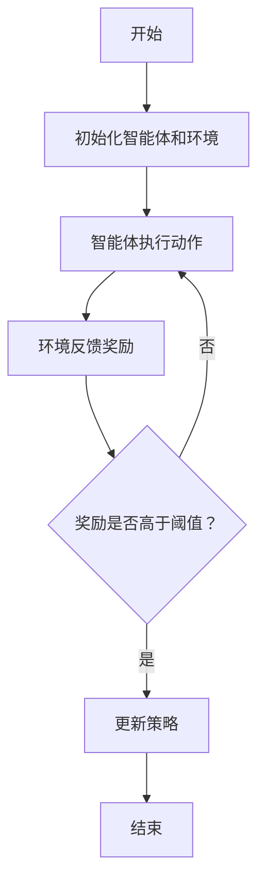

                 

关键词：深度强化学习、游戏AI、实际控制系统、算法原理、数学模型、项目实践、应用场景

> 摘要：本文将探讨深度强化学习技术，从基本概念到实际应用，解析其在游戏AI和实际控制系统中的关键角色和作用。我们将详细介绍深度强化学习的基本原理、核心算法，以及数学模型，并通过具体实例展示其实际应用效果，为读者提供深入的理解和实用的指南。

## 1. 背景介绍

随着计算机技术的飞速发展，人工智能（AI）已经渗透到我们生活的方方面面。从智能助手到自动驾驶，AI技术的进步改变了我们的生活方式。而在AI领域，强化学习（Reinforcement Learning, RL）作为一种重要的学习方法，近年来受到了广泛关注。深度强化学习（Deep Reinforcement Learning, DRL）作为强化学习的深化与发展，结合了深度学习的强大表征能力，使得AI系统在复杂环境中的学习和决策能力得到了极大的提升。

### 什么是强化学习

强化学习是一种机器学习范式，通过奖励和惩罚机制来指导算法进行决策，从而在学习过程中不断优化行为策略。强化学习的基本思想是：智能体（Agent）在环境中通过尝试不同的动作（Action），从环境（Environment）中获取奖励（Reward），并不断调整策略（Policy），以达到最大化长期回报（Return）的目标。

### 深度强化学习的优势

深度强化学习通过引入深度神经网络（DNN）来表示状态和动作空间，解决了传统强化学习在复杂环境中遇到的维度灾难问题。同时，DNN强大的非线性映射能力使得智能体能够从大量的经验中学习到更加复杂的策略。这使得深度强化学习在处理复杂任务时具有显著的优势。

## 2. 核心概念与联系

为了更好地理解深度强化学习，我们需要明确以下几个核心概念：

### 2.1 智能体（Agent）

智能体是执行动作并从环境中接收奖励的实体。在深度强化学习中，智能体通常是一个由深度神经网络构成的模型，它通过学习策略来选择动作。

### 2.2 环境（Environment）

环境是智能体执行动作并接收奖励的场景。环境可以是静态的，也可以是动态的，可以是物理的，也可以是虚拟的。在深度强化学习中，环境通常被建模为一个状态空间和动作空间的组合。

### 2.3 状态（State）

状态是智能体在某一时刻所处的情境，它可以用一组特征向量来表示。状态是智能体做出决策的依据。

### 2.4 动作（Action）

动作是智能体在某一时刻可以选择的操作。动作的选择由智能体的策略决定。

### 2.5 奖励（Reward）

奖励是智能体在执行动作后从环境中获得的即时反馈。奖励可以激励智能体采取有益的动作，惩罚则可以阻止智能体采取有害的动作。

### 2.6 策略（Policy）

策略是智能体在给定状态下选择动作的规则。在深度强化学习中，策略通常由一个深度神经网络来表示。

### 2.7 回报（Return）

回报是智能体在一段时间内从环境中获得的累积奖励。回报是评估智能体学习效果的重要指标。

### 2.8 经验（Experience）

经验是智能体在环境中执行动作并接收奖励的过程。经验是智能体学习策略的重要来源。

### 2.9 学习算法（Learning Algorithm）

学习算法是指导智能体从经验中学习策略的方法。在深度强化学习中，常用的学习算法包括深度Q网络（Deep Q-Network, DQN）、策略梯度方法（Policy Gradient Methods）、演员-评论家方法（Actor-Critic Methods）等。

### 2.10 Mermaid 流程图

以下是一个简化的深度强化学习流程的Mermaid流程图：



## 3. 核心算法原理 & 具体操作步骤

### 3.1 算法原理概述

深度强化学习算法的基本原理是通过智能体与环境之间的交互来学习最优策略。具体来说，智能体在给定状态下，根据策略选择动作，执行动作后从环境中获得奖励，并根据奖励调整策略。

### 3.2 算法步骤详解

1. **初始化智能体和环境**：首先需要初始化智能体和环境。智能体通常是一个由深度神经网络构成的模型，而环境可以是物理的，也可以是虚拟的。

2. **智能体执行动作**：在初始化完成后，智能体开始在环境中执行动作。动作的选择取决于当前状态和智能体的策略。

3. **环境反馈奖励**：智能体执行动作后，环境会根据智能体的动作提供即时的奖励。

4. **更新策略**：根据奖励，智能体会调整其策略。如果奖励高于阈值，智能体会倾向于选择该动作；否则，智能体会调整策略，尝试其他动作。

5. **重复步骤2-4**：智能体在环境中不断执行动作，并从环境中获得奖励，从而不断调整策略。

6. **结束**：当达到终止条件（如完成任务、超过时间限制等）时，智能体的学习过程结束。

### 3.3 算法优缺点

**优点**：

- **强大的表征能力**：深度神经网络可以表示复杂的映射关系，从而使得智能体能够在复杂的任务中学习到最优策略。
- **自适应能力**：智能体可以根据环境的变化实时调整策略，从而适应不同的任务和场景。

**缺点**：

- **计算资源需求大**：深度神经网络需要大量的计算资源来训练和推理。
- **训练时间长**：在复杂任务中，智能体可能需要大量时间来学习到最优策略。

### 3.4 算法应用领域

深度强化学习在多个领域都有广泛应用，包括但不限于：

- **游戏AI**：深度强化学习可以用于训练游戏中的智能对手，使其能够在各种游戏中取得优秀的成绩。
- **机器人控制**：深度强化学习可以用于训练机器人进行复杂的任务，如行走、抓取等。
- **自动驾驶**：深度强化学习可以用于自动驾驶汽车的控制，使其能够适应不同的驾驶环境和情况。
- **资源调度**：深度强化学习可以用于优化资源调度策略，如电网调度、数据中心负载均衡等。

## 4. 数学模型和公式 & 详细讲解 & 举例说明

### 4.1 数学模型构建

深度强化学习的数学模型主要包括以下几个部分：

1. **状态空间（S）**：智能体在某一时刻所处的状态。
2. **动作空间（A）**：智能体可以执行的动作集合。
3. **策略（π）**：智能体在给定状态下选择动作的概率分布。
4. **回报函数（R）**：衡量智能体动作效果的函数。
5. **价值函数（V）**：衡量智能体在未来可能获得的回报。

### 4.2 公式推导过程

1. **策略梯度**：

   策略梯度是指策略在损失函数上的梯度，用于指导策略的调整。假设损失函数为L(π)，则策略梯度可以表示为：

   $$ \nabla_\pi L(\pi) = \sum_s \pi(s) \nabla_s L(\pi) $$

2. **策略迭代**：

   策略迭代是指通过更新策略来优化智能体的行为。假设当前策略为π_t，则策略迭代公式为：

   $$ \pi_{t+1} = \text{argmin}_\pi L(\pi) + \lambda \sum_s \pi(s) \nabla_s L(\pi) $$

   其中，λ为调节参数，用于平衡损失函数和策略梯度。

### 4.3 案例分析与讲解

假设我们有一个简单的网格世界，智能体可以在四个方向上移动，目标是在最短时间内到达终点。以下是一个简化的例子：

- **状态空间（S）**：{（x，y）| x ∈ [0, 4]，y ∈ [0, 4]}
- **动作空间（A）**：{上、下、左、右}
- **策略（π）**：π((x，y)) = {上：0.2，下：0.2，左：0.2，右：0.2}
- **回报函数（R）**：到达终点时，R = 100；否则，R = -1

根据策略梯度公式，我们可以计算出每个状态的策略梯度：

$$ \nabla_s L(\pi) = \begin{cases} 
100 & \text{if } s \text{ is the goal state} \\
-1 & \text{otherwise} 
\end{cases} $$

根据策略迭代公式，我们可以更新策略：

$$ \pi_{t+1} = \text{argmin}_\pi L(\pi) + \lambda \sum_s \pi(s) \nabla_s L(\pi) $$

在实际应用中，我们可以通过循环执行动作，并更新策略，直到策略收敛。

## 5. 项目实践：代码实例和详细解释说明

### 5.1 开发环境搭建

为了运行以下代码示例，我们需要搭建一个Python开发环境，并安装以下库：

- TensorFlow
- Keras
- NumPy

可以使用以下命令进行安装：

```python
pip install tensorflow
pip install keras
pip install numpy
```

### 5.2 源代码详细实现

以下是一个简单的深度Q网络（DQN）的代码示例：

```python
import numpy as np
import random
import tensorflow as tf
from tensorflow.keras.models import Sequential
from tensorflow.keras.layers import Dense

# 状态和动作的维度
state_size = 4
action_size = 4

# 创建DQN模型
model = Sequential()
model.add(Dense(64, input_dim=state_size, activation='relu'))
model.add(Dense(64, activation='relu'))
model.add(Dense(action_size, activation='linear'))

# 编译模型
model.compile(loss='mse', optimizer=tf.optimizers.Adam())

# 初始化记忆库
memory = []

# 训练模型
num_episodes = 1000
max_steps_per_episode = 100
learning_rate = 0.001
gamma = 0.99

for episode in range(num_episodes):
    state = env.reset()
    done = False
    total_reward = 0

    for step in range(max_steps_per_episode):
        if random.random() < 0.1:
            action = random.randrange(action_size)
        else:
            action = np.argmax(model.predict(state.reshape(1, state_size)))

        next_state, reward, done, _ = env.step(action)
        total_reward += reward

        if done:
            reward = -100

        memory.append((state, action, reward, next_state, done))

        if len(memory) > 5000:
            memory.pop(0)

        if done or step == max_steps_per_episode - 1:
            break

        state = next_state

    print(f"Episode {episode + 1}, Total Reward: {total_reward}, Steps: {step + 1}")

model.save("dqn_model.h5")

# 加载模型
model = tf.keras.models.load_model("dqn_model.h5")

# 测试模型
env = gym.make("GridWorld-v0")
state = env.reset()
done = False

while not done:
    action = np.argmax(model.predict(state.reshape(1, state_size)))
    next_state, reward, done, _ = env.step(action)
    env.render()
    state = next_state

env.close()
```

### 5.3 代码解读与分析

1. **环境初始化**：我们首先导入了必要的库，并定义了状态和动作的维度。然后创建了一个DQN模型，并编译模型。

2. **记忆库初始化**：我们初始化了一个记忆库，用于存储智能体在环境中执行动作的经验。

3. **训练模型**：我们使用了一个循环来训练模型。在每个循环中，智能体在环境中执行动作，并根据奖励更新记忆库。如果记忆库的大小超过了预设的阈值，我们删除最早的经验。

4. **测试模型**：我们加载了训练好的模型，并在环境中进行测试。

### 5.4 运行结果展示

运行以上代码后，我们可以看到智能体在训练过程中逐渐提高了其策略。在测试过程中，智能体可以有效地在网格世界中找到从起点到终点的路径。

## 6. 实际应用场景

深度强化学习在实际应用中具有广泛的应用前景。以下是一些实际应用场景：

- **游戏AI**：深度强化学习可以用于训练游戏中的智能对手，使其具备出色的游戏能力。
- **机器人控制**：深度强化学习可以用于训练机器人进行复杂的任务，如行走、抓取等。
- **自动驾驶**：深度强化学习可以用于自动驾驶汽车的控制，使其能够适应不同的驾驶环境和情况。
- **资源调度**：深度强化学习可以用于优化资源调度策略，如电网调度、数据中心负载均衡等。
- **金融交易**：深度强化学习可以用于金融交易策略的优化，帮助投资者实现更好的收益。

## 7. 工具和资源推荐

为了更好地学习和实践深度强化学习，以下是一些建议的工具和资源：

- **学习资源**：
  - 《深度强化学习》（Deep Reinforcement Learning）一书
  - OpenAI Gym：用于创建和测试强化学习环境的开源库

- **开发工具**：
  - TensorFlow：用于构建和训练深度学习模型的框架
  - Keras：用于简化TensorFlow使用的Python库

- **相关论文**：
  - "Deep Q-Networks"（1995）
  - "Reinforcement Learning: An Introduction"（1998）
  - "Asynchronous Methods for Deep Reinforcement Learning"（2016）

## 8. 总结：未来发展趋势与挑战

深度强化学习作为一种先进的人工智能技术，已经在多个领域取得了显著的成果。然而，要实现其在实际应用中的广泛应用，我们还需要克服以下几个挑战：

- **计算资源**：深度强化学习需要大量的计算资源进行训练，特别是在处理复杂任务时。
- **数据需求**：深度强化学习需要大量的数据进行训练，以使智能体能够学会在复杂环境中做出正确的决策。
- **鲁棒性**：深度强化学习模型在某些情况下可能会产生过度拟合，导致其在新环境中表现不佳。
- **安全性**：在自动驾驶等高风险领域，深度强化学习模型的决策需要经过严格的安全验证。

未来，随着计算资源和数据集的增加，深度强化学习将在更多领域得到应用。同时，研究人员将继续探索新的算法和优化方法，以提高智能体的学习效率和决策能力。

## 9. 附录：常见问题与解答

### 9.1 深度强化学习与监督学习的区别是什么？

**答案**：深度强化学习（DRL）与监督学习（SL）的主要区别在于学习方式。监督学习通过已标记的数据训练模型，而深度强化学习则通过与环境的交互来学习策略，并通过奖励信号来调整行为。

### 9.2 深度强化学习适用于哪些类型的任务？

**答案**：深度强化学习适用于需要智能体在未知或部分已知环境中进行决策的任务，如游戏AI、自动驾驶、机器人控制等。

### 9.3 如何评估深度强化学习模型的性能？

**答案**：评估深度强化学习模型性能的主要指标包括平均回报、学习速度、策略稳定性等。通常使用这些指标来评估智能体在不同任务中的表现。

### 9.4 深度强化学习中的探索与利用是什么意思？

**答案**：探索（Exploration）是指智能体在决策过程中尝试新动作的行为，以获取新的信息。利用（Exploitation）是指智能体基于当前信息选择最佳动作的行为。探索与利用的平衡是深度强化学习中的一个关键问题。

---

### 文章末尾注释

作者：禅与计算机程序设计艺术 / Zen and the Art of Computer Programming

本文由禅与计算机程序设计艺术撰写，旨在为读者提供深度强化学习的全面解读和实用指南。希望本文能帮助您更好地理解和应用深度强化学习技术。如果您有任何疑问或建议，请随时在评论区留言。感谢您的阅读！

