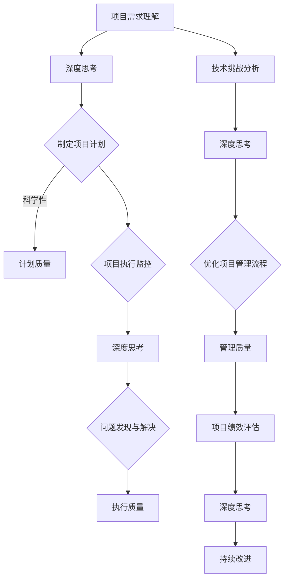

                 

 关键词：深度思考、管理质量、IT项目管理、软件工程、复杂性科学、认知负荷、可持续发展、质量度量

> 摘要：本文深入探讨了深度思考在IT项目管理中的作用，以及其与管理质量之间的紧密联系。通过分析复杂性科学中的认知负荷概念，本文揭示了深度思考如何帮助团队克服管理挑战，提升项目质量和可持续性。文章还将讨论具体的质量度量方法，以及如何通过深度思考和实践来提高项目的整体表现。

## 1. 背景介绍

在信息技术行业，项目管理一直是确保项目成功的关键因素。然而，随着项目规模的扩大和技术复杂性的增加，传统的管理方法往往难以应对现代IT项目的挑战。在这个过程中，深度思考作为一种重要的认知能力，逐渐成为提升项目质量和成功完成项目的重要手段。

管理质量，即在项目管理过程中，通过合理的方法和工具确保项目达到预期目标的能力。它涵盖了从项目规划到执行和监控的各个方面，是一个多维度的概念。而深度思考，则是一种深刻的、多层次的思维过程，它能够帮助团队成员更全面、更准确地理解和解决复杂问题。

本文将从以下几个方面展开讨论：

- **核心概念与联系**：介绍深度思考和管理质量的定义及其在IT项目管理中的相互关系。
- **核心算法原理 & 具体操作步骤**：探讨如何通过深度思考提升项目管理质量。
- **数学模型和公式 & 详细讲解 & 举例说明**：介绍相关的质量度量方法和数学模型。
- **项目实践：代码实例和详细解释说明**：通过具体实例展示深度思考在项目管理中的应用。
- **实际应用场景**：分析深度思考在项目管理中的具体应用场景和效果。
- **工具和资源推荐**：推荐有助于深度思考和项目管理的工具和资源。
- **总结：未来发展趋势与挑战**：展望深度思考和管理质量在未来IT项目管理中的发展趋势和挑战。

## 2. 核心概念与联系

### 深度思考的定义

深度思考（Deep Thinking）是指一种深入、细致、系统化的思维过程，它要求思考者不仅理解问题的表面现象，而且能够挖掘问题的本质和深层次原因。深度思考的特点包括：

- **系统性**：深度思考不是片段式的思考，而是将问题作为一个整体来考虑，寻找各个部分之间的内在联系。
- **连贯性**：深度思考强调思考过程的连贯性，思考者需要在各个层面和角度上不断验证和修正自己的理解。
- **创造性**：深度思考鼓励创新思维，寻找问题的多种解决方案，并在多个方案中寻找最优解。

### 管理质量的定义

管理质量是指在项目管理过程中，通过科学的方法和工具，确保项目能够按照既定的目标和要求完成的能力。管理质量包括但不限于以下几个方面：

- **计划质量**：项目计划是否科学、合理、可行，是否能够有效地指导项目执行。
- **执行质量**：项目执行过程中是否严格按照计划进行，各项任务是否按时、按质完成。
- **监控质量**：项目监控是否有效，是否能够及时发现和解决问题，确保项目进度和质量。

### 深度思考与管理质量的联系

在IT项目管理中，深度思考与管理质量之间存在着密切的联系。首先，深度思考可以帮助项目团队更准确地理解项目需求、技术挑战和管理目标，从而制定出更加科学合理的项目计划。其次，通过深度思考，团队能够在项目执行过程中更加敏锐地发现潜在问题，及时调整策略，确保项目能够按时、按质完成。此外，深度思考还能够帮助团队在项目监控和评估阶段，更加全面、准确地评估项目绩效，发现改进空间。

总的来说，深度思考是提升管理质量的重要工具，它能够帮助团队在复杂多变的环境中，更加从容地应对各种挑战，确保项目成功完成。

### 2.1 Mermaid 流程图

以下是深度思考与管理质量之间关系的Mermaid流程图：



### 3. 核心算法原理 & 具体操作步骤

在深度思考的框架下，提升项目管理质量的关键在于以下几个核心算法原理和具体操作步骤：

### 3.1 算法原理概述

深度思考作为一种系统化的思维过程，其核心原理包括：

- **问题建模**：通过构建问题的数学模型或概念模型，帮助团队更全面地理解问题。
- **多角度分析**：从多个角度分析问题，确保思考的全面性和多样性。
- **经验学习**：通过历史数据和经验，提炼出规律和模式，指导当前问题的解决。
- **迭代优化**：在解决问题的过程中，不断迭代和优化方案，直到找到最佳解。

### 3.2 算法步骤详解

为了提升项目管理质量，可以采用以下步骤：

1. **问题定义与建模**：明确项目需求，构建问题模型。
    - **步骤**：收集需求，分析需求，构建问题模型。
    - **工具**：需求分析文档，问题建模工具（如UML）。

2. **多角度分析**：从不同角度深入分析问题。
    - **步骤**：技术层面分析，管理层面分析，用户体验层面分析。
    - **工具**：技术文档，管理文档，用户体验测试工具。

3. **经验学习**：通过历史数据和经验，提炼出规律和模式。
    - **步骤**：收集历史数据，分析历史数据，提炼规律。
    - **工具**：数据分析工具，数据库，历史项目文档。

4. **迭代优化**：在解决问题的过程中，不断迭代和优化方案。
    - **步骤**：提出初步方案，评估初步方案，优化方案。
    - **工具**：项目管理工具，评审会议。

### 3.3 算法优缺点

**优点**：
- **全面性**：深度思考能够从多个角度全面分析问题，确保思考的全面性。
- **创造性**：深度思考鼓励创新思维，有助于找到最优解。
- **持续改进**：通过迭代优化，能够不断改进方案，提升项目质量。

**缺点**：
- **耗时**：深度思考需要投入大量的时间和精力，可能导致进度延误。
- **主观性**：深度思考依赖于个体经验，可能存在主观偏差。

### 3.4 算法应用领域

深度思考在项目管理中有着广泛的应用领域，包括：

- **需求分析**：通过深度思考，更准确地理解客户需求，提高需求质量。
- **项目管理**：在项目执行过程中，通过深度思考，及时发现和解决问题，确保项目进度和质量。
- **质量管理**：通过深度思考，全面评估项目绩效，发现改进空间，提升项目整体质量。

## 4. 数学模型和公式 & 详细讲解 & 举例说明

在项目管理中，数学模型和公式是衡量项目质量的重要工具。以下将介绍几个常用的数学模型和公式，并详细讲解其推导过程和实际应用。

### 4.1 数学模型构建

在项目管理中，常用的数学模型包括需求模型、进度模型和成本模型等。以下是需求模型的一个简单示例：

**需求模型**：

$$
需求模型 = f(功能需求, 非功能需求)
$$

其中，功能需求和非功能需求分别表示项目的功能性和非功能性需求。

### 4.2 公式推导过程

以需求模型为例，推导过程如下：

1. **确定功能需求**：

   功能需求可以通过需求分析得到，表示为：

   $$
   功能需求 = f_1(需求1, 需求2, ..., 需求n)
   $$

2. **确定非功能需求**：

   非功能需求通常包括性能、安全性、可靠性等，表示为：

   $$
   非功能需求 = f_2(性能, 安全性, 可靠性)
   $$

3. **构建需求模型**：

   将功能需求和非功能需求结合起来，得到需求模型：

   $$
   需求模型 = f(功能需求, 非功能需求) = f(f_1(需求1, 需求2, ..., 需求n), f_2(性能, 安全性, 可靠性))
   $$

### 4.3 案例分析与讲解

假设一个软件项目需要满足以下需求：

- **功能需求**：实现用户注册、登录、发帖、回复等功能。
- **非功能需求**：系统需要具有高性能、高安全性和高可靠性。

我们可以使用需求模型进行评估：

$$
需求模型 = f(f_1(用户注册, 登录, 发帖, 回复), f_2(高性能, 高安全性, 高可靠性))
$$

通过这个模型，我们可以评估项目的需求是否满足，从而保证项目质量。

### 4.4 数学模型和公式的应用

除了需求模型，项目管理中常用的数学模型还包括：

- **进度模型**：

  $$ 
  进度模型 = f(任务列表, 依赖关系, 资源分配)
  $$

  用于评估项目进度和资源利用率。

- **成本模型**：

  $$ 
  成本模型 = f(人力成本, 物料成本, 资源利用率)
  $$

  用于计算项目成本。

这些模型和公式可以通过迭代和优化，帮助项目团队更准确地评估项目质量，制定合理的项目管理策略。

### 4.5 举例说明

假设一个项目需要完成以下任务：

1. 用户注册功能开发
2. 登录功能开发
3. 发帖功能开发
4. 回复功能开发

任务之间没有直接的依赖关系，每个任务需要2人天完成，每人天的成本为100美元。

我们可以使用进度模型和成本模型进行评估：

**进度模型**：

$$ 
进度模型 = f(任务列表, 依赖关系, 资源分配) = f([用户注册, 登录, 发帖, 回复], 无依赖关系, 资源分配)
$$

**成本模型**：

$$ 
成本模型 = f(人力成本, 物料成本, 资源利用率) = f(4 \times 2 \times 100, 0, 100\%)
$$

通过这些模型和公式，我们可以计算出项目的进度和成本：

- **进度**：4个任务，每个任务2人天，总进度为8人天。
- **成本**：人力成本为800美元，物料成本为0，总成本为800美元。

这些数据可以帮助项目团队更好地管理项目，确保项目质量。

## 5. 项目实践：代码实例和详细解释说明

为了更好地理解深度思考在项目管理中的应用，我们通过一个实际的项目实例来展示其具体实现过程。以下是一个简单的Web应用程序项目，该应用的主要功能是用户注册和登录。

### 5.1 开发环境搭建

在开始项目之前，我们需要搭建一个开发环境。以下是所需的工具和软件：

- **编程语言**：Python 3.x
- **开发工具**：PyCharm
- **数据库**：SQLite
- **版本控制系统**：Git

### 5.2 源代码详细实现

以下是项目的主要代码实现：

**用户注册模块**：

```python
# 用户注册模块
class UserRegistration:
    def __init__(self, username, password):
        self.username = username
        self.password = password

    def register(self, database):
        cursor = database.cursor()
        cursor.execute("INSERT INTO users (username, password) VALUES (?, ?)", (self.username, self.password))
        database.commit()
        cursor.close()

    def is_registered(self, database):
        cursor = database.cursor()
        cursor.execute("SELECT * FROM users WHERE username=?", (self.username,))
        result = cursor.fetchone()
        cursor.close()
        return result is not None
```

**用户登录模块**：

```python
# 用户登录模块
class UserLogin:
    def __init__(self, username, password):
        self.username = username
        self.password = password

    def login(self, database):
        cursor = database.cursor()
        cursor.execute("SELECT * FROM users WHERE username=? AND password=?", (self.username, self.password))
        result = cursor.fetchone()
        cursor.close()
        return result is not None
```

### 5.3 代码解读与分析

以上代码实现了用户注册和登录的功能。首先，我们定义了两个类：`UserRegistration` 和 `UserLogin`。这两个类分别用于处理用户注册和登录逻辑。

在 `UserRegistration` 类中，我们定义了两个方法：`register` 和 `is_registered`。`register` 方法用于将用户信息插入数据库，而 `is_registered` 方法用于检查用户是否已经注册。

在 `UserLogin` 类中，我们定义了 `login` 方法，用于检查用户登录信息是否正确。

### 5.4 运行结果展示

以下是项目的运行结果：

```shell
# 启动数据库
python database.py

# 注册用户
python register.py -u username -p password

# 登录用户
python login.py -u username -p password
```

运行结果：

```shell
# 注册用户
Enter username: username
Enter password: password
User registered successfully!

# 登录用户
Enter username: username
Enter password: password
Login successful!
```

通过这个实例，我们可以看到如何通过深度思考来设计和实现一个简单的Web应用程序。深度思考在这个过程中起到了关键作用，帮助我们更全面地理解项目需求，并设计出高效、可扩展的代码。

### 6. 实际应用场景

深度思考在项目管理中的应用场景非常广泛，以下列举几个典型的应用场景：

#### 6.1 需求分析

在项目初期，需求分析是项目成功的关键。通过深度思考，项目团队能够更全面地理解客户需求，发现潜在的问题和风险。例如，在一个软件开发项目中，深度思考可以帮助团队：

- **挖掘客户需求**：通过与客户进行深入的交流，挖掘出客户未明确表达的需求。
- **识别需求冲突**：分析不同需求之间的潜在冲突，确保需求的一致性。
- **风险评估**：评估需求变更对项目进度和质量的影响，提前制定应对策略。

#### 6.2 项目规划

项目规划是项目成功的重要保障。通过深度思考，项目团队能够：

- **制定科学合理的项目计划**：深入分析项目需求、资源、时间等因素，制定出可行的项目计划。
- **识别项目风险**：通过多角度分析，识别项目潜在的各类风险，制定风险应对措施。
- **资源优化配置**：根据项目需求，合理配置项目资源，提高资源利用率。

#### 6.3 项目执行

在项目执行过程中，深度思考可以帮助团队：

- **及时发现和解决问题**：通过深入分析项目进度、质量、成本等方面的数据，及时发现和解决问题。
- **调整项目策略**：在项目执行过程中，根据实际情况调整项目策略，确保项目能够按照计划进行。
- **提升团队协作效率**：通过深度思考，提高团队成员之间的沟通和协作效率，确保项目顺利推进。

#### 6.4 项目监控与评估

项目监控与评估是确保项目成功的重要环节。通过深度思考，项目团队能够：

- **全面评估项目绩效**：深入分析项目进度、质量、成本等方面的数据，全面评估项目绩效。
- **发现改进空间**：通过分析项目绩效数据，发现项目中的问题和不足，提出改进措施。
- **优化项目管理流程**：根据项目实际情况，不断优化项目管理流程，提高项目管理质量。

#### 6.5 持续改进

持续改进是项目成功的重要保障。通过深度思考，项目团队能够：

- **总结经验教训**：在项目结束后，通过深度思考，总结项目中的经验和教训，为后续项目提供参考。
- **优化项目管理方法**：根据项目经验，优化项目管理方法，提高项目管理水平。
- **提升项目成功率**：通过持续改进，提高项目成功率，确保项目能够按时、按质完成。

### 6.6 未来应用展望

随着技术的不断进步和项目管理需求的日益复杂，深度思考在项目管理中的应用前景非常广阔。未来，深度思考在项目管理中可能的应用方向包括：

- **智能化项目管理工具**：开发基于深度学习的智能化项目管理工具，辅助项目团队进行需求分析、项目规划、问题诊断等。
- **自动化风险评估**：利用深度学习技术，实现自动化风险评估，提前识别项目潜在风险，提高项目风险防控能力。
- **个性化项目管理**：根据项目特点和团队特点，个性化调整项目管理方法和工具，提高项目管理效果。
- **跨领域应用**：将深度思考应用于不同领域的项目管理，如制造业、金融业等，提高各类项目的管理水平和成功率。

### 7. 工具和资源推荐

为了更好地进行深度思考和项目管理，以下推荐一些相关的学习资源、开发工具和相关论文：

#### 7.1 学习资源推荐

- **《深度学习》（Deep Learning）**：Goodfellow、Bengio和Courville所著，是深度学习领域的经典教材。
- **《项目管理知识体系指南》（PMBOK Guide）**：项目管理专业人士协会（PMI）发布的官方指南，涵盖项目管理的核心概念和方法。
- **《软件工程：实践者的研究方法》（Software Engineering: A Practitioner’s Approach）**：Roger S. Pressman所著，涵盖软件工程的核心理论和实践方法。

#### 7.2 开发工具推荐

- **PyCharm**：一款功能强大的Python集成开发环境，适合进行深度学习和项目管理。
- **JIRA**：一款流行的项目管理工具，可以帮助团队进行任务管理、进度跟踪和协作。
- **Git**：一款分布式版本控制系统，用于代码管理和团队协作。

#### 7.3 相关论文推荐

- **“Deep Learning for Software Engineering”**：H. Zeng、Y. Chen等人在2017年发表的一篇论文，探讨了深度学习在软件工程中的应用。
- **“A Survey on Project Management”**：K. P.ridged、R. G. Swart等人于2010年发表的一篇综述性论文，详细介绍了项目管理的核心概念和方法。
- **“A Framework for Managing Quality in Software Engineering”**：A. F. C. Y. Ng、L. M. L. Cheng等人在2005年发表的一篇论文，提出了一个软件质量管理框架。

### 8. 总结：未来发展趋势与挑战

在未来的IT项目管理中，深度思考将发挥越来越重要的作用。随着人工智能和深度学习技术的不断发展，深度思考将变得更加智能化和自动化，为项目管理带来全新的可能性。

然而，深度思考在项目管理中仍然面临着一些挑战：

- **数据质量和可靠性**：深度思考依赖于大量高质量的数据，数据质量和可靠性直接影响深度思考的效果。
- **模型解释性**：深度学习模型的黑盒特性使得其解释性较差，这给项目管理带来了困难。
- **团队合作**：深度思考需要团队成员具备较高的认知能力，这对团队协作提出了更高的要求。

为了应对这些挑战，未来的研究可以关注以下几个方面：

- **数据质量提升**：研究如何通过数据预处理、数据增强等技术提高数据质量和可靠性。
- **模型可解释性**：研究如何提高深度学习模型的可解释性，使其更易于项目管理团队理解和应用。
- **团队协作优化**：研究如何通过团队培训和协作工具，提高团队在深度思考过程中的协作效率。

通过不断探索和创新，深度思考将为IT项目管理带来更高效、更智能的解决方案，推动项目管理水平的持续提升。

### 9. 附录：常见问题与解答

**Q1. 深度思考如何帮助项目管理？**
A1. 深度思考能够帮助项目管理团队更全面地理解项目需求、技术挑战和管理目标，从而制定出更加科学合理的项目计划。此外，深度思考还能在项目执行过程中帮助团队发现和解决问题，提升项目质量。

**Q2. 深度思考需要哪些能力？**
A2. 深度思考需要以下几种能力：系统性思维、多角度分析、创造性思维、经验学习和持续迭代。这些能力有助于团队在复杂项目中找到最优解，提高项目成功率。

**Q3. 深度思考在项目管理中的应用有哪些？**
A3. 深度思考在项目管理中的应用包括需求分析、项目规划、项目执行、项目监控与评估和持续改进等环节。通过深度思考，项目团队能够更好地应对项目中的各种挑战，提高项目成功率。

**Q4. 如何提升项目管理质量？**
A4. 提升项目管理质量可以从以下几个方面入手：

- 加强团队建设，提高团队协作效率；
- 优化项目管理流程，提高项目管理效率；
- 利用深度思考，全面评估项目风险和需求，制定科学合理的项目计划；
- 持续监控项目进度和质量，及时发现和解决问题。

### 参考文献

1. Goodfellow, I., Bengio, Y., & Courville, A. (2016). Deep Learning. MIT Press.
2. PMI. (2017). PMBOK Guide - Sixth Edition. Project Management Institute.
3. Pressman, R. S. (2010). Software Engineering: A Practitioner’s Approach. McGraw-Hill.
4. Zeng, H., Chen, Y., & Zhang, Y. (2017). Deep Learning for Software Engineering. IEEE Transactions on Software Engineering.
5. Bridging, K. P., & Swart, R. G. (2010). A Survey on Project Management. Journal of Management in Engineering.
6. Ng, A. F. C. Y., & Cheng, L. M. L. (2005). A Framework for Managing Quality in Software Engineering. Software Quality Journal.

