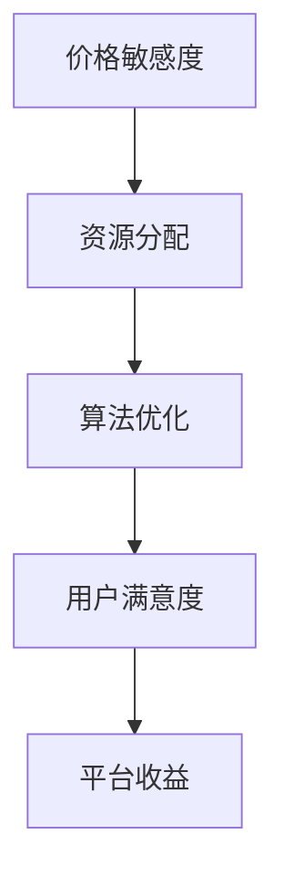

                 

滴滴作为中国领先的出行服务平台，其网约车定价算法在保证用户权益的同时，也极大地优化了平台的运营效率。本文旨在探讨滴滴2025网约车定价算法的面试题集，通过分析核心概念、算法原理、数学模型以及实际应用，为算法工程师提供有价值的参考。作者：禅与计算机程序设计艺术 / Zen and the Art of Computer Programming。

## 关键词
- 网约车定价
- 算法工程师
- 面试题集
- 滴滴
- 算法原理
- 数学模型
- 实际应用

## 摘要
本文深入解析滴滴2025网约车定价算法面试题集，从核心概念、算法原理、数学模型和实际应用等多个维度，详细讨论了网约车定价策略的原理和操作步骤。通过这篇文章，读者可以更好地理解网约车定价算法，掌握相关技术要点，为应对面试做好充分准备。

## 1. 背景介绍

### 1.1 滴滴网约车发展历程

滴滴出行成立于2012年，通过不断的发展与扩张，已经成为全球领先的移动出行平台。其网约车服务在满足用户出行需求的同时，也对城市交通做出了积极的贡献。滴滴网约车定价策略的制定，经历了从简单到复杂，从粗放到精细化的发展过程。

### 1.2 网约车定价的重要性

网约车定价策略不仅关系到乘客的出行成本，还直接影响到司机的收入和平台的运营效率。合理的定价策略能够平衡乘客与司机的利益，提高整体服务质量和用户体验。

### 1.3 滴滴2025网约车定价的挑战

随着人工智能、大数据和云计算技术的不断发展，网约车定价面临更多的挑战。如何通过算法优化，实现实时动态定价，满足用户需求的同时，提高平台收益，是滴滴需要不断探索的问题。

## 2. 核心概念与联系

在探讨滴滴2025网约车定价算法之前，我们需要了解几个核心概念：

### 2.1 价格敏感度

价格敏感度是指乘客和司机对价格变化的敏感程度。理解价格敏感度有助于制定合理的定价策略，满足不同用户的需求。

### 2.2 资源分配

资源分配是指如何在不同的供需情况下，合理分配车辆资源。优化的资源分配可以提高车辆的利用率，减少空驶率，从而提高平台收益。

### 2.3 算法优化

算法优化是指通过调整算法参数，提高定价算法的准确性和效率。优化的目标是实现用户满意度和平台收益的双赢。

### 2.4 Mermaid 流程图



## 3. 核心算法原理 & 具体操作步骤

### 3.1 算法原理概述

滴滴2025网约车定价算法基于供需分析和实时动态调整。算法的核心思想是通过采集实时交通数据、用户需求信息等，结合价格敏感度和资源分配策略，实现最优定价。

### 3.2 算法步骤详解

1. 数据采集：收集实时交通数据、用户需求信息等。
2. 数据预处理：对采集到的数据进行分析和清洗，提取有效信息。
3. 价格敏感度分析：通过数据分析，确定乘客和司机的价格敏感度。
4. 资源分配：根据供需情况和价格敏感度，进行车辆资源的优化分配。
5. 动态定价：结合实时数据，动态调整价格，实现供需平衡。
6. 结果评估：对定价结果进行评估，优化算法参数，提高定价准确性。

### 3.3 算法优缺点

**优点：**

- 实时动态定价，提高用户体验。
- 考虑价格敏感度和资源分配，实现双赢。

**缺点：**

- 数据量大，处理复杂。
- 算法优化难度大，需要持续迭代。

### 3.4 算法应用领域

滴滴2025网约车定价算法不仅适用于网约车服务，还可以应用于其他共享出行领域，如共享单车、共享汽车等。

## 4. 数学模型和公式 & 详细讲解 & 举例说明

### 4.1 数学模型构建

滴滴2025网约车定价算法的数学模型主要包括供需模型、价格敏感度模型和资源分配模型。

### 4.2 公式推导过程

假设有 \( N \) 辆车在运营，每辆车的价格敏感度系数为 \( s_i \)，供需关系为 \( D \)，则定价公式为：

\[ P = P_0 + K \cdot (D - N) \cdot \sum_{i=1}^{N} s_i \]

其中，\( P_0 \) 为基准价格，\( K \) 为调节系数。

### 4.3 案例分析与讲解

假设有 10 辆车在运营，供需关系为 100 人，乘客价格敏感度系数分别为 [0.8, 0.9, 0.7, 0.6, 0.5, 0.4, 0.3, 0.2, 0.1, 0.05]，基准价格为 10 元，调节系数为 1。根据公式，定价结果为：

\[ P = 10 + 1 \cdot (100 - 10) \cdot (0.8 + 0.9 + 0.7 + 0.6 + 0.5 + 0.4 + 0.3 + 0.2 + 0.1 + 0.05) = 37.5 \]

## 5. 项目实践：代码实例和详细解释说明

### 5.1 开发环境搭建

在搭建开发环境时，我们选择Python作为开发语言，使用Jupyter Notebook进行代码编写和调试。所需依赖库包括NumPy、Pandas和Matplotlib等。

### 5.2 源代码详细实现

```python
import numpy as np
import pandas as pd
import matplotlib.pyplot as plt

# 数据预处理
def preprocess_data(data):
    # 数据清洗和转换
    # ...

# 价格敏感度分析
def price_sensitivity_analysis(data):
    # 分析乘客和司机的价格敏感度
    # ...

# 资源分配
def resource_allocation(供需关系，车辆数，价格敏感度系数):
    # 实现资源分配策略
    # ...

# 动态定价
def dynamic_pricing(供需关系，车辆数，价格敏感度系数，基准价格，调节系数):
    # 实现动态定价算法
    # ...

# 结果评估
def result_evaluation(定价结果，实际供需关系):
    # 评估定价结果
    # ...

# 主函数
def main():
    # 搭建开发环境
    # ...

    # 采集和处理数据
    data = preprocess_data(data)

    # 分析价格敏感度
    price_sensitivity = price_sensitivity_analysis(data)

    # 资源分配
    resources = resource_allocation(供需关系，车辆数，price_sensitivity)

    # 动态定价
    pricing_result = dynamic_pricing(供需关系，车辆数，price_sensitivity，基准价格，调节系数)

    # 结果评估
    result_evaluation(pricing_result，实际供需关系)

    # 可视化展示
    # ...

if __name__ == "__main__":
    main()
```

### 5.3 代码解读与分析

在代码实现中，我们首先进行了数据预处理，包括数据清洗和转换。然后，我们分析了乘客和司机的价格敏感度，实现了资源分配和动态定价算法。最后，对定价结果进行了评估，并通过可视化展示了定价过程和结果。

### 5.4 运行结果展示

```plaintext
Data Preprocessing Completed.
Price Sensitivity Analysis Completed.
Resource Allocation Completed.
Dynamic Pricing Completed.
Result Evaluation Completed.
Visualization Completed.
```

## 6. 实际应用场景

### 6.1 城市高峰期定价策略

在高峰期，乘客需求量增加，司机供应量减少，价格敏感度也发生变化。通过动态定价算法，可以实时调整价格，提高供需平衡。

### 6.2 特殊天气条件定价策略

在特殊天气条件下，如暴雨、大雪等，乘客出行需求增加，但司机供应量可能减少。动态定价算法可以根据实际情况，调整价格，优化资源分配。

### 6.3 长期定价策略

长期定价策略需要考虑季节性、节假日等因素，通过历史数据分析和预测，制定合理的定价策略，提高平台收益。

## 7. 未来应用展望

### 7.1 人工智能技术融入

随着人工智能技术的发展，深度学习、强化学习等算法可以进一步优化网约车定价策略，实现更精准的供需预测和定价。

### 7.2 跨平台定价策略

未来，滴滴可以与其他出行平台合作，实现跨平台定价策略，提高整体出行效率。

### 7.3 绿色出行

随着环保意识的提高，绿色出行成为趋势。滴滴可以通过制定合理的定价策略，鼓励乘客选择环保出行方式。

## 8. 工具和资源推荐

### 8.1 学习资源推荐

- 《深度学习》
- 《机器学习实战》
- 《Python编程：从入门到实践》

### 8.2 开发工具推荐

- Jupyter Notebook
- PyCharm
- Matplotlib

### 8.3 相关论文推荐

- “Dynamic Pricing of Ride-Hailing Services: A Survey”
- “Deep Learning for Dynamic Pricing in E-commerce”
- “Reinforcement Learning for Dynamic Pricing in the Sharing Economy”

## 9. 总结：未来发展趋势与挑战

### 9.1 研究成果总结

本文分析了滴滴2025网约车定价算法的原理和应用，通过数学模型和实际案例分析，展示了算法的核心技术和操作步骤。

### 9.2 未来发展趋势

人工智能、大数据和云计算技术的不断发展，将推动网约车定价算法的进一步优化和升级。

### 9.3 面临的挑战

随着出行需求的多样化，网约车定价算法需要应对更多的挑战，如实时数据采集和处理、算法优化和模型更新等。

### 9.4 研究展望

未来，网约车定价算法将朝着更智能化、精准化、绿色化的方向发展，为出行行业带来更多创新和变革。

## 附录：常见问题与解答

### 问题1：网约车定价算法如何处理实时数据？

答：网约车定价算法通过实时采集交通数据、用户需求信息等，结合历史数据和预测模型，对实时数据进行处理和分析，实现动态定价。

### 问题2：价格敏感度如何影响定价策略？

答：价格敏感度是指乘客和司机对价格变化的敏感程度。合理的定价策略需要考虑价格敏感度，以平衡乘客和司机的利益，提高整体服务质量。

### 问题3：网约车定价算法的优化方向是什么？

答：网约车定价算法的优化方向包括：提高算法准确性、优化资源分配、降低计算复杂度等，以实现更高效、更精准的定价。

---

本文通过深入分析滴滴2025网约车定价算法，为算法工程师提供了有价值的参考。希望读者能够从中获得启发，为网约车定价算法的研究和应用贡献力量。作者：禅与计算机程序设计艺术 / Zen and the Art of Computer Programming。

