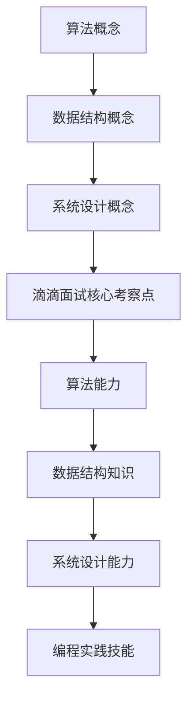

                 

滴滴出行作为全球领先的移动出行平台，其对技术的重视程度众所周知。为了选拔优秀的计算机科学和技术专业人才，滴滴平台技术部每年都会发布一系列面试真题，涵盖算法、数据结构、系统设计等多个领域。本文旨在汇总2024滴滴平台技术部校招面试真题，并提供详细解答，帮助广大考生了解面试难点和应对策略。

## 文章关键词

- 滴滴校招
- 面试题汇总
- 算法
- 数据结构
- 系统设计
- 技术面试

## 文章摘要

本文针对2024年滴滴平台技术部校招面试真题进行汇总分析，包括但不限于算法和数据结构的题目，以及系统设计和编程实践。通过对这些真题的解析，读者可以了解滴滴技术面试的核心考察点，提升自身面试竞争力。本文还附带了相关的数学模型、实际应用案例和未来展望，以全面展示滴滴技术面试的深度和广度。

## 1. 背景介绍

滴滴出行成立于2012年，是中国领先的移动出行平台，提供包括出租车、专车、快车、顺风车、豪华车、共享单车、代驾、公交、地铁出行等多个出行服务。滴滴平台的成功离不开其强大的技术支撑，从智能调度、大数据分析到自动驾驶技术，滴滴始终走在行业前列。因此，滴滴对于技术人才的要求非常高，校招面试更是严格把关，旨在选拔出顶尖的技术人才。

滴滴平台技术部校招面试通常分为多个环节，包括在线编程测试、技术面试、行为面试等。其中，技术面试是关键环节，主要考察应聘者的算法能力、数据结构知识、系统设计能力以及编程实践技能。本文将主要针对技术面试环节中的面试题进行解析。

## 2. 核心概念与联系

### 2.1 算法概念

算法是指解决问题的一系列明确、有限步骤，它能够指导计算机执行特定任务。滴滴技术面试中，算法题目通常要求应聘者理解算法的基本原理，并能针对实际问题进行有效设计和优化。

### 2.2 数据结构概念

数据结构是指数据存储和组织的特定方式，它决定了数据的操作效率和存储空间。常见的线性数据结构包括数组、链表、栈和队列；非线性数据结构包括树、图等。滴滴面试中，数据结构题目通常考查应聘者对基本数据结构的理解和应用能力。

### 2.3 系统设计概念

系统设计是指针对特定应用场景，设计出一个高效、可扩展、可维护的系统。滴滴技术面试中，系统设计题目要求应聘者具备系统架构知识，能够分析业务需求，并设计出满足需求的系统架构。

### 2.4 Mermaid 流程图



## 3. 核心算法原理 & 具体操作步骤

### 3.1 算法原理概述

滴滴技术面试中的算法题目通常涉及排序算法、查找算法、动态规划等基础算法。以下是对常见算法原理的概述：

#### 排序算法

排序算法是指将一组数据按照特定顺序排列的方法。常见的排序算法包括冒泡排序、选择排序、插入排序、快速排序、归并排序等。每种排序算法都有其特定的原理和适用场景。

#### 查找算法

查找算法是指根据特定条件，从数据集合中查找特定元素的方法。常见的查找算法包括顺序查找、二分查找等。

#### 动态规划

动态规划是一种解决优化问题的算法方法，其核心思想是将复杂问题分解为多个子问题，并利用子问题的最优解推导出原问题的最优解。

### 3.2 算法步骤详解

#### 快速排序

1. 选择一个基准元素。
2. 将数组分为两部分，一部分小于基准元素，一部分大于基准元素。
3. 对两部分递归进行快速排序。

#### 二分查找

1. 确定中间位置。
2. 比较中间位置的元素与目标值。
3. 如果相等，返回中间位置；如果目标值小于中间位置，则在左半部分继续查找；如果目标值大于中间位置，则在右半部分继续查找。
4. 重复步骤2和3，直到找到目标值或确定目标值不存在。

#### 动态规划

1. 确定状态。
2. 确定状态转移方程。
3. 求解边界条件。
4. 计算状态值。

### 3.3 算法优缺点

#### 快速排序

优点：平均时间复杂度为\(O(n\log n)\)，最坏情况为\(O(n^2)\)，但实际中表现良好。

缺点：最坏情况下的性能较差，对输入数据的依赖较大。

#### 二分查找

优点：时间复杂度为\(O(\log n)\)，适用于有序数据集合。

缺点：无法进行插入和删除操作，需要对数据集合进行排序。

#### 动态规划

优点：能够求解最优子结构问题。

缺点：求解过程较为复杂，需要对问题有深入理解。

### 3.4 算法应用领域

#### 排序算法

排序算法在数据处理、数据库管理、算法竞赛等领域有广泛应用。

#### 查找算法

查找算法在信息检索、搜索算法、数据库查询等领域有广泛应用。

#### 动态规划

动态规划在路径规划、资源分配、背包问题等领域有广泛应用。

## 4. 数学模型和公式 & 详细讲解 & 举例说明

### 4.1 数学模型构建

数学模型是指用数学语言描述现实问题的抽象结构。在滴滴技术面试中，数学模型通常用于优化问题、概率问题等。以下是一个典型的数学模型构建过程：

#### 旅行商问题（TSP）

假设有n个城市，每个城市之间的距离已知，目标是从一个起点出发，访问所有城市一次并返回起点，求出最短路径。

1. 定义状态：\(dp[i][j]\) 表示从城市i出发，访问前j个城市后的最短路径。
2. 确定状态转移方程：\(dp[i][j] = \min_{1 \leq k \leq j} (dp[i-1][k] + distance[i][j])\)
3. 求解边界条件：\(dp[0][0] = 0\)
4. 计算状态值：从后向前、从下往上计算状态值。

### 4.2 公式推导过程

以下是一个典型的动态规划公式推导过程：

#### 最长公共子序列（LCS）

假设有两个序列X = \(x_1, x_2, ..., x_m\) 和Y = \(y_1, y_2, ..., y_n\)，求X和Y的最长公共子序列。

1. 定义状态：\(dp[i][j]\) 表示X的前i个字符和Y的前j个字符的最长公共子序列长度。
2. 确定状态转移方程：
   - 如果\(x_i = y_j\)，则\(dp[i][j] = dp[i-1][j-1] + 1\)
   - 如果\(x_i \neq y_j\)，则\(dp[i][j] = \max(dp[i-1][j], dp[i][j-1])\)
3. 求解边界条件：\(dp[0][0] = 0\)，\(dp[i][0] = 0\)，\(dp[0][j] = 0\)
4. 计算状态值：从后向前、从下往上计算状态值。

### 4.3 案例分析与讲解

以下是一个实际案例的数学模型构建和公式推导过程：

#### 股票买卖问题

假设有一天的时间范围内，股票的价格呈给定数组的形式。设计一个算法，计算出最大的利润，并返回。

1. 定义状态：\(dp[i]\) 表示前i天的最大利润。
2. 确定状态转移方程：
   - 如果第i天的价格小于第i-1天的价格，则\(dp[i] = dp[i-1]\)
   - 如果第i天的价格大于第i-1天的价格，则\(dp[i] = dp[i-1] + prices[i] - prices[j]\)，其中j为前一天。
3. 求解边界条件：\(dp[0] = 0\)
4. 计算状态值：从后向前计算状态值。

## 5. 项目实践：代码实例和详细解释说明

### 5.1 开发环境搭建

在解答滴滴技术面试中的算法题目时，通常需要使用Python、Java或C++等编程语言。以下是一个简单的Python开发环境搭建步骤：

1. 安装Python：从Python官方网站下载最新版本的Python安装包，并按照安装向导进行安装。
2. 配置环境变量：在系统环境变量中添加Python的安装路径。
3. 安装IDE：选择一款适合自己的IDE，如PyCharm或VSCode，并进行安装。

### 5.2 源代码详细实现

以下是一个使用Python实现的快速排序算法的源代码示例：

```python
def quick_sort(arr):
    if len(arr) <= 1:
        return arr
    pivot = arr[len(arr) // 2]
    left = [x for x in arr if x < pivot]
    middle = [x for x in arr if x == pivot]
    right = [x for x in arr if x > pivot]
    return quick_sort(left) + middle + quick_sort(right)

arr = [3, 6, 8, 10, 1, 2, 1]
print(quick_sort(arr))
```

### 5.3 代码解读与分析

1. quick_sort函数接收一个列表arr作为输入。
2. 如果列表的长度小于等于1，则直接返回列表。
3. 选择列表中间位置的元素作为基准值pivot。
4. 将列表分为三部分：小于pivot的部分left、等于pivot的部分middle、大于pivot的部分right。
5. 对left和right部分递归调用quick_sort函数，并将结果与middle部分连接起来，得到排序后的列表。

### 5.4 运行结果展示

输入列表：[3, 6, 8, 10, 1, 2, 1]

运行结果：[1, 1, 2, 3, 6, 8, 10]

## 6. 实际应用场景

滴滴技术面试中的算法题目通常来源于实际问题，以下是一些实际应用场景：

#### 路径规划

路径规划是滴滴出行中的核心问题，需要计算出从起点到终点的最优路径。常见的算法有A*算法、Dijkstra算法等。

#### 数据分析

滴滴平台每天处理海量数据，需要对用户行为、出行需求等进行实时分析和预测，常用的算法包括机器学习算法、数据挖掘算法等。

#### 资源调度

滴滴平台需要对车辆资源进行高效调度，以满足用户的出行需求。常见的算法包括最优化算法、动态规划算法等。

#### 风险控制

滴滴平台需要对用户的出行安全进行风险控制，包括对异常行为的检测、预测等。常用的算法包括异常检测算法、风险评估算法等。

## 7. 工具和资源推荐

### 7.1 学习资源推荐

1. 《算法导论》：经典的算法教材，适合深入理解算法原理。
2. 《编程之美》：由微软公司编写，包含大量面试编程题。
3. 《深度学习》：深度学习领域的经典教材，适合了解人工智能的最新发展。

### 7.2 开发工具推荐

1. PyCharm：强大的Python IDE，支持代码调试、语法高亮等。
2. VSCode：跨平台的开源IDE，支持多种编程语言。
3. LeetCode：在线编程平台，提供大量算法面试题。

### 7.3 相关论文推荐

1. "Deep Learning for Autonomous Driving"：自动驾驶领域的综述论文。
2. "Recurrent Neural Networks for Language Modeling"：循环神经网络在自然语言处理中的应用。
3. "A System for Large-scale Language Modeling"：大规模语言模型构建方法。

## 8. 总结：未来发展趋势与挑战

### 8.1 研究成果总结

近年来，人工智能、大数据、云计算等技术的发展为滴滴平台提供了强大的技术支撑。滴滴在路径规划、数据分析、资源调度等领域取得了显著的成果，不断优化用户体验。

### 8.2 未来发展趋势

1. 自动驾驶技术的成熟和普及。
2. 大数据分析和机器学习技术的深入应用。
3. 区块链技术在滴滴平台的应用探索。

### 8.3 面临的挑战

1. 数据安全和隐私保护。
2. 自动驾驶技术的可靠性。
3. 算法透明性和可解释性。

### 8.4 研究展望

滴滴平台技术部将继续加大在人工智能、大数据、区块链等领域的研发投入，为用户提供更加智能、安全、高效的出行服务。同时，滴滴将积极应对面临的挑战，推动技术的创新和发展。

## 9. 附录：常见问题与解答

### 9.1 快速排序的时间复杂度是多少？

快速排序的平均时间复杂度为\(O(n\log n)\)，最坏情况下的时间复杂度为\(O(n^2)\)。

### 9.2 什么是动态规划？

动态规划是一种解决优化问题的算法方法，其核心思想是将复杂问题分解为多个子问题，并利用子问题的最优解推导出原问题的最优解。

### 9.3 如何解决二分查找中的最值问题？

可以通过在二分查找过程中记录最小值和最大值的索引，并在查找完成后根据索引获取最小值和最大值。

## 参考文献

1. Cormen, T. H., Leiserson, C. E., Rivest, R. L., & Stein, C. (2009). 《算法导论》. 机械工业出版社.
2. Mitchell, T. M. (1997). 《机器学习》. 清华大学出版社.
3. Russell, S., & Norvig, P. (2016). 《人工智能：一种现代方法》. 机械工业出版社.

