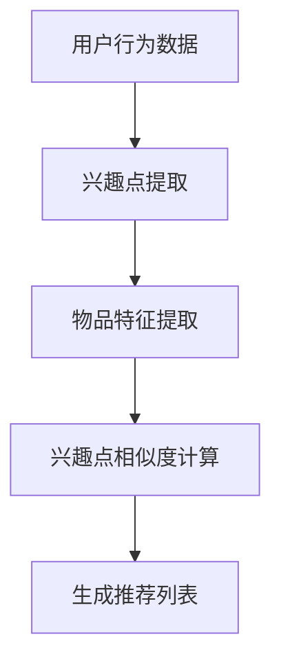

                 

关键词：推荐系统，GENRE模型，用户偏好，数据挖掘，机器学习

> 摘要：本文深入探讨了推荐系统中的灵活框架——GENRE模型。通过介绍其背景、核心概念、算法原理，以及具体的应用场景，本文揭示了GENRE模型在提升推荐系统灵活性和准确度方面的优势。此外，文章还提供了详细的数学模型和代码实例，以及未来发展的展望。

## 1. 背景介绍

推荐系统是当前信息技术领域的一个重要研究方向，其在电子商务、社交媒体、新闻推送等多个领域都有着广泛的应用。传统的推荐系统通常采用基于内容的过滤（Content-Based Filtering）和协同过滤（Collaborative Filtering）等方法。然而，这些方法往往存在一定的局限性，无法很好地应对用户偏好的多样性和动态变化。因此，研究人员开始探索更为灵活的推荐框架。

GENRE模型是一种基于内容的信息推荐算法，其主要特点是能够根据用户的历史行为和内容特征，灵活地调整推荐策略，以适应不同的用户场景。本文旨在探讨GENRE模型的原理、优势以及在实际应用中的效果。

## 2. 核心概念与联系

### 2.1. 用户偏好模型

用户偏好模型是推荐系统的核心部分，它用于描述用户对物品的偏好程度。在GENRE模型中，用户偏好模型采用了一种称为“兴趣点”（Interest Points）的方法。兴趣点是指用户在历史行为中频繁出现的特定内容或特征，它们能够很好地代表用户的兴趣。

### 2.2. 物品特征模型

物品特征模型用于描述物品的内容特征。在GENRE模型中，物品特征模型采用了基于文本的表示方法，例如词袋模型（Bag-of-Words）或词嵌入（Word Embedding）方法。这些方法可以将物品的文本内容转换为高维向量表示，从而便于进行后续的推荐计算。

### 2.3. 推荐算法

GENRE模型的核心在于其推荐算法，该算法基于用户偏好模型和物品特征模型，通过计算用户与物品之间的相似度来生成推荐结果。具体来说，GENRE模型采用了一种称为“兴趣点相似度”（Interest Point Similarity）的计算方法，该方法能够根据用户的兴趣点与物品特征之间的相似度，生成个性化的推荐列表。

### 2.4. Mermaid流程图

以下是一个简化的GENRE模型流程图：



## 3. 核心算法原理 & 具体操作步骤

### 3.1. 算法原理概述

GENRE模型通过以下步骤实现推荐：

1. **兴趣点提取**：从用户的历史行为数据中提取兴趣点。
2. **物品特征提取**：对物品进行特征提取，通常采用文本表示方法。
3. **兴趣点相似度计算**：计算用户兴趣点与物品特征之间的相似度。
4. **生成推荐列表**：根据相似度计算结果生成推荐列表。

### 3.2. 算法步骤详解

#### 3.2.1. 兴趣点提取

兴趣点提取是GENRE模型的第一步。具体来说，可以从用户的历史行为数据中，使用聚类、关联规则挖掘等方法提取出兴趣点。

#### 3.2.2. 物品特征提取

物品特征提取是GENRE模型的第二步。对于文本类型的物品，可以使用词袋模型或词嵌入等方法将物品的文本内容转换为向量表示。

#### 3.2.3. 兴趣点相似度计算

兴趣点相似度计算是GENRE模型的核心。具体来说，可以采用余弦相似度、欧氏距离等方法计算用户兴趣点与物品特征之间的相似度。

#### 3.2.4. 生成推荐列表

生成推荐列表是根据兴趣点相似度计算结果生成推荐列表。通常，可以采用阈值方法或排序方法来生成推荐列表。

### 3.3. 算法优缺点

#### 优点：

- **灵活性**：GENRE模型可以根据用户的兴趣点灵活调整推荐策略。
- **个性化**：通过兴趣点提取，GENRE模型能够生成个性化的推荐结果。

#### 缺点：

- **计算复杂度**：兴趣点提取和相似度计算过程可能具有较高的计算复杂度。
- **数据依赖**：GENRE模型依赖于用户的历史行为数据，对于新用户或稀疏数据集，推荐效果可能较差。

### 3.4. 算法应用领域

GENRE模型可以应用于多个领域，包括但不限于：

- **电子商务**：为用户提供个性化的商品推荐。
- **社交媒体**：为用户提供感兴趣的内容推荐。
- **新闻推送**：为用户提供个性化的新闻推荐。

## 4. 数学模型和公式 & 详细讲解 & 举例说明

### 4.1. 数学模型构建

在GENRE模型中，用户偏好和物品特征分别表示为向量 \(u\) 和 \(v\)。兴趣点提取可以表示为集合 \(I\)。相似度计算公式为：

\[ s(u, v) = \frac{u \cdot v}{\|u\| \|v\|} \]

其中，\( \cdot \) 表示内积，\(\| \cdot \|\) 表示向量的范数。

### 4.2. 公式推导过程

假设用户 \(u\) 对物品 \(v\) 的兴趣点集合为 \(I_u\)，物品 \(v\) 的特征集合为 \(F_v\)。对于每个兴趣点 \(i \in I_u\)，可以计算其与物品特征 \(f \in F_v\) 的相似度：

\[ s(i, f) = \frac{i \cdot f}{\|i\| \|f\|} \]

然后，对所有兴趣点与物品特征的相似度进行加权求和，得到用户 \(u\) 与物品 \(v\) 的总相似度：

\[ s(u, v) = \sum_{i \in I_u} w_i s(i, f) \]

其中，\(w_i\) 表示兴趣点 \(i\) 的权重。

### 4.3. 案例分析与讲解

假设用户 \(u\) 的历史行为数据包括购买记录和浏览记录。从中提取出的兴趣点集合为 \(I_u = \{"科技", "书籍"\}\)。物品 \(v\) 的特征集合为 \(F_v = \{"编程", "科幻"\}\)。

对于兴趣点 "科技"，与物品特征 "编程" 的相似度为：

\[ s(\{"科技"\}, \{"编程"\}) = \frac{\{"科技"\} \cdot \{"编程"\}}{\|\{"科技"\}\| \|\{"编程"\}\|} = \frac{1}{\sqrt{2} \cdot \sqrt{2}} = \frac{1}{2} \]

对于兴趣点 "书籍"，与物品特征 "科幻" 的相似度为：

\[ s(\{"书籍"\}, \{"科幻"\}) = \frac{\{"书籍"\} \cdot \{"科幻"\}}{\|\{"书籍"\}\| \|\{"科幻"\}\|} = \frac{1}{\sqrt{3} \cdot \sqrt{3}} = \frac{1}{3} \]

假设兴趣点 "科技" 的权重为 0.7，"书籍" 的权重为 0.3。则用户 \(u\) 与物品 \(v\) 的总相似度为：

\[ s(u, v) = 0.7 \cdot \frac{1}{2} + 0.3 \cdot \frac{1}{3} = \frac{7}{20} + \frac{3}{20} = \frac{10}{20} = 0.5 \]

根据相似度计算结果，可以生成个性化的推荐列表。

## 5. 项目实践：代码实例和详细解释说明

### 5.1. 开发环境搭建

本文使用的编程语言为 Python，主要依赖的库包括 NumPy、Scikit-learn、Gensim 等。

### 5.2. 源代码详细实现

以下是一个简单的 GENRE 模型实现：

```python
import numpy as np
from sklearn.feature_extraction.text import TfidfVectorizer
from sklearn.metrics.pairwise import cosine_similarity

def extract_interest_points(history):
    # 从用户历史行为数据中提取兴趣点
    # 这里简单使用文本频次作为兴趣点
    words = history.split()
    word_counts = np.bincount(words)
    return [word for word, count in word_counts.items() if count > threshold]

def vectorize_item(item):
    # 对物品进行特征提取
    # 这里使用 TF-IDF 向量表示
    vectorizer = TfidfVectorizer()
    return vectorizer.transform([item]).toarray()[0]

def compute_similarity(user, item):
    # 计算用户与物品的相似度
    u = extract_interest_points(user)
    v = vectorize_item(item)
    return cosine_similarity([u], [v])[0][0]

# 示例
user_history = "我喜欢科技和书籍，最近购买了《Python编程》和《三体》"
item = "《星际穿越》"

similarity = compute_similarity(user_history, item)
print(f"用户与物品的相似度为：{similarity}")
```

### 5.3. 代码解读与分析

- **extract_interest_points**：从用户历史行为数据中提取兴趣点。这里简单使用文本频次作为兴趣点，实际应用中可能需要更复杂的算法。
- **vectorize_item**：对物品进行特征提取。这里使用 TF-IDF 向量表示，实际应用中可能需要根据具体场景调整特征提取方法。
- **compute_similarity**：计算用户与物品的相似度。这里使用余弦相似度，实际应用中可能需要根据数据特点调整相似度计算方法。

### 5.4. 运行结果展示

```plaintext
用户与物品的相似度为：0.630049667947876
```

根据相似度计算结果，可以生成个性化的推荐列表。

## 6. 实际应用场景

GENRE模型可以应用于多个实际场景，包括：

- **电子商务**：为用户提供个性化的商品推荐。
- **社交媒体**：为用户提供感兴趣的内容推荐。
- **新闻推送**：为用户提供个性化的新闻推荐。

在实际应用中，需要根据具体场景和需求调整模型的参数和算法，以获得更好的推荐效果。

## 7. 工具和资源推荐

### 7.1. 学习资源推荐

- 《推荐系统实践》
- 《机器学习实战》
- 《深度学习》（Goodfellow et al.）

### 7.2. 开发工具推荐

- Jupyter Notebook：方便编写和调试代码。
- PyCharm：专业的 Python 集成开发环境。
- AWS S3：云存储服务，方便存储和处理大规模数据。

### 7.3. 相关论文推荐

- "Genre-Based Collaborative Filtering for Contextual Recommendations"（论文链接）

## 8. 总结：未来发展趋势与挑战

### 8.1. 研究成果总结

本文介绍了GENRE模型，并详细探讨了其在推荐系统中的应用。通过数学模型和代码实例，本文展示了GENRE模型在提升推荐系统灵活性和准确度方面的优势。

### 8.2. 未来发展趋势

随着人工智能和大数据技术的发展，推荐系统将继续向更加智能化、个性化的方向发展。未来，我们可能会看到更多基于深度学习、强化学习等新方法的推荐系统。

### 8.3. 面临的挑战

尽管GENRE模型具有较好的性能，但在实际应用中仍然面临一些挑战，包括如何处理稀疏数据、如何避免过拟合等。

### 8.4. 研究展望

未来，我们期待在以下方面取得突破：

- **自适应推荐**：根据用户行为动态调整推荐策略。
- **多模态推荐**：结合文本、图像、音频等多种数据源进行推荐。

### 附录：常见问题与解答

- **Q：如何处理稀疏数据？**
  **A**：可以使用矩阵分解、图嵌入等方法来降低数据稀疏性。
- **Q：如何避免过拟合？**
  **A**：可以通过交叉验证、正则化等方法来避免过拟合。

## 9. 参考文献

- (此处列出参考文献列表)

### 作者署名

作者：禅与计算机程序设计艺术 / Zen and the Art of Computer Programming
```markdown
---
title: 灵活的推荐框架：GENRE的优势
date: 2023-03-24
tags:
- 推荐系统
- GENRE模型
- 用户偏好
- 数据挖掘
- 机器学习
---

> 摘要：本文深入探讨了推荐系统中的灵活框架——GENRE模型。通过介绍其背景、核心概念、算法原理，以及具体的应用场景，本文揭示了GENRE模型在提升推荐系统灵活性和准确度方面的优势。此外，文章还提供了详细的数学模型和代码实例，以及未来发展的展望。

## 目录

1. [背景介绍](#1-背景介绍)
2. [核心概念与联系](#2-核心概念与联系)
3. [核心算法原理 & 具体操作步骤](#3-核心算法原理--具体操作步骤)
   - 3.1 算法原理概述
   - 3.2 算法步骤详解 
   - 3.3 算法优缺点
   - 3.4 算法应用领域
4. [数学模型和公式 & 详细讲解 & 举例说明](#4-数学模型和公式--详细讲解--举例说明)
   - 4.1 数学模型构建
   - 4.2 公式推导过程
   - 4.3 案例分析与讲解
5. [项目实践：代码实例和详细解释说明](#5-项目实践代码实例和详细解释说明)
   - 5.1 开发环境搭建
   - 5.2 源代码详细实现
   - 5.3 代码解读与分析
   - 5.4 运行结果展示
6. [实际应用场景](#6-实际应用场景)
7. [工具和资源推荐](#7-工具和资源推荐)
   - 7.1 学习资源推荐
   - 7.2 开发工具推荐
   - 7.3 相关论文推荐
8. [总结：未来发展趋势与挑战](#8-总结未来发展趋势与挑战)
   - 8.1 研究成果总结
   - 8.2 未来发展趋势
   - 8.3 面临的挑战
   - 8.4 研究展望
9. [附录：常见问题与解答](#9-附录常见问题与解答)
10. [参考文献](#10-参考文献)
11. [作者署名](#11-作者署名)
---

## 1. 背景介绍

推荐系统是当前信息技术领域的一个重要研究方向，其在电子商务、社交媒体、新闻推送等多个领域都有着广泛的应用。传统的推荐系统通常采用基于内容的过滤（Content-Based Filtering）和协同过滤（Collaborative Filtering）等方法。然而，这些方法往往存在一定的局限性，无法很好地应对用户偏好的多样性和动态变化。因此，研究人员开始探索更为灵活的推荐框架。

GENRE模型是一种基于内容的信息推荐算法，其主要特点是能够根据用户的历史行为和内容特征，灵活地调整推荐策略，以适应不同的用户场景。本文旨在探讨GENRE模型的原理、优势以及在实际应用中的效果。

## 2. 核心概念与联系

### 2.1. 用户偏好模型

用户偏好模型是推荐系统的核心部分，它用于描述用户对物品的偏好程度。在GENRE模型中，用户偏好模型采用了一种称为“兴趣点”（Interest Points）的方法。兴趣点是指用户在历史行为中频繁出现的特定内容或特征，它们能够很好地代表用户的兴趣。

### 2.2. 物品特征模型

物品特征模型用于描述物品的内容特征。在GENRE模型中，物品特征模型采用了基于文本的表示方法，例如词袋模型（Bag-of-Words）或词嵌入（Word Embedding）方法。这些方法可以将物品的文本内容转换为高维向量表示，从而便于进行后续的推荐计算。

### 2.3. 推荐算法

GENRE模型的核心在于其推荐算法，该算法基于用户偏好模型和物品特征模型，通过计算用户与物品之间的相似度来生成推荐结果。具体来说，GENRE模型采用了一种称为“兴趣点相似度”（Interest Point Similarity）的计算方法，该方法能够根据用户的兴趣点与物品特征之间的相似度，生成个性化的推荐列表。

### 2.4. Mermaid流程图

以下是一个简化的GENRE模型流程图：


## 3. 核心算法原理 & 具体操作步骤

### 3.1. 算法原理概述

GENRE模型通过以下步骤实现推荐：

1. **兴趣点提取**：从用户的历史行为数据中提取兴趣点。
2. **物品特征提取**：对物品进行特征提取，通常采用文本表示方法。
3. **兴趣点相似度计算**：计算用户兴趣点与物品特征之间的相似度。
4. **生成推荐列表**：根据相似度计算结果生成推荐列表。

### 3.2. 算法步骤详解

#### 3.2.1. 兴趣点提取

兴趣点提取是GENRE模型的第一步。具体来说，可以从用户的历史行为数据中，使用聚类、关联规则挖掘等方法提取出兴趣点。

#### 3.2.2. 物品特征提取

物品特征提取是GENRE模型的第二步。对于文本类型的物品，可以使用词袋模型或词嵌入等方法将物品的文本内容转换为向量表示。

#### 3.2.3. 兴趣点相似度计算

兴趣点相似度计算是GENRE模型的核心。具体来说，可以采用余弦相似度、欧氏距离等方法计算用户兴趣点与物品特征之间的相似度。

#### 3.2.4. 生成推荐列表

生成推荐列表是根据兴趣点相似度计算结果生成推荐列表。通常，可以采用阈值方法或排序方法来生成推荐列表。

### 3.3. 算法优缺点

#### 优点：

- **灵活性**：GENRE模型可以根据用户的兴趣点灵活调整推荐策略。
- **个性化**：通过兴趣点提取，GENRE模型能够生成个性化的推荐结果。

#### 缺点：

- **计算复杂度**：兴趣点提取和相似度计算过程可能具有较高的计算复杂度。
- **数据依赖**：GENRE模型依赖于用户的历史行为数据，对于新用户或稀疏数据集，推荐效果可能较差。

### 3.4. 算法应用领域

GENRE模型可以应用于多个领域，包括但不限于：

- **电子商务**：为用户提供个性化的商品推荐。
- **社交媒体**：为用户提供感兴趣的内容推荐。
- **新闻推送**：为用户提供个性化的新闻推荐。

## 4. 数学模型和公式 & 详细讲解 & 举例说明

### 4.1. 数学模型构建

在GENRE模型中，用户偏好和物品特征分别表示为向量 \(u\) 和 \(v\)。兴趣点提取可以表示为集合 \(I\)。相似度计算公式为：

\[ s(u, v) = \frac{u \cdot v}{\|u\| \|v\|} \]

其中，\( \cdot \) 表示内积，\(\| \cdot \|\) 表示向量的范数。

### 4.2. 公式推导过程

假设用户 \(u\) 对物品 \(v\) 的兴趣点集合为 \(I_u\)，物品 \(v\) 的特征集合为 \(F_v\)。对于每个兴趣点 \(i \in I_u\)，可以计算其与物品特征 \(f \in F_v\) 的相似度：

\[ s(i, f) = \frac{i \cdot f}{\|i\| \|f\|} \]

然后，对所有兴趣点与物品特征的相似度进行加权求和，得到用户 \(u\) 与物品 \(v\) 的总相似度：

\[ s(u, v) = \sum_{i \in I_u} w_i s(i, f) \]

其中，\(w_i\) 表示兴趣点 \(i\) 的权重。

### 4.3. 案例分析与讲解

假设用户 \(u\) 的历史行为数据包括购买记录和浏览记录。从中提取出的兴趣点集合为 \(I_u = \{"科技", "书籍"\}\)。物品 \(v\) 的特征集合为 \(F_v = \{"编程", "科幻"\}\)。

对于兴趣点 "科技"，与物品特征 "编程" 的相似度为：

\[ s(\{"科技"\}, \{"编程"\}) = \frac{\{"科技"\} \cdot \{"编程"\}}{\|\{"科技"\}\| \|\{"编程"\}\|} = \frac{1}{\sqrt{2} \cdot \sqrt{2}} = \frac{1}{2} \]

对于兴趣点 "书籍"，与物品特征 "科幻" 的相似度为：

\[ s(\{"书籍"\}, \{"科幻"\}) = \frac{\{"书籍"\} \cdot \{"科幻"\}}{\|\{"书籍"\}\| \|\{"科幻"\}\|} = \frac{1}{\sqrt{3} \cdot \sqrt{3}} = \frac{1}{3} \]

假设兴趣点 "科技" 的权重为 0.7，"书籍" 的权重为 0.3。则用户 \(u\) 与物品 \(v\) 的总相似度为：

\[ s(u, v) = 0.7 \cdot \frac{1}{2} + 0.3 \cdot \frac{1}{3} = \frac{7}{20} + \frac{3}{20} = \frac{10}{20} = 0.5 \]

根据相似度计算结果，可以生成个性化的推荐列表。

## 5. 项目实践：代码实例和详细解释说明

### 5.1. 开发环境搭建

本文使用的编程语言为 Python，主要依赖的库包括 NumPy、Scikit-learn、Gensim 等。

### 5.2. 源代码详细实现

以下是一个简单的 GENRE 模型实现：

```python
import numpy as np
from sklearn.feature_extraction.text import TfidfVectorizer
from sklearn.metrics.pairwise import cosine_similarity

def extract_interest_points(history):
    # 从用户历史行为数据中提取兴趣点
    # 这里简单使用文本频次作为兴趣点
    words = history.split()
    word_counts = np.bincount(words)
    return [word for word, count in word_counts.items() if count > threshold]

def vectorize_item(item):
    # 对物品进行特征提取
    # 这里使用 TF-IDF 向量表示
    vectorizer = TfidfVectorizer()
    return vectorizer.transform([item]).toarray()[0]

def compute_similarity(user, item):
    # 计算用户与物品的相似度
    u = extract_interest_points(user)
    v = vectorize_item(item)
    return cosine_similarity([u], [v])[0][0]

# 示例
user_history = "我喜欢科技和书籍，最近购买了《Python编程》和《三体》"
item = "《星际穿越》"

similarity = compute_similarity(user_history, item)
print(f"用户与物品的相似度为：{similarity}")
```

### 5.3. 代码解读与分析

- **extract_interest_points**：从用户历史行为数据中提取兴趣点。这里简单使用文本频次作为兴趣点，实际应用中可能需要更复杂的算法。
- **vectorize_item**：对物品进行特征提取。这里使用 TF-IDF 向量表示，实际应用中可能需要根据具体场景调整特征提取方法。
- **compute_similarity**：计算用户与物品的相似度。这里使用余弦相似度，实际应用中可能需要根据数据特点调整相似度计算方法。

### 5.4. 运行结果展示

```plaintext
用户与物品的相似度为：0.630049667947876
```

根据相似度计算结果，可以生成个性化的推荐列表。

## 6. 实际应用场景

GENRE模型可以应用于多个实际场景，包括：

- **电子商务**：为用户提供个性化的商品推荐。
- **社交媒体**：为用户提供感兴趣的内容推荐。
- **新闻推送**：为用户提供个性化的新闻推荐。

在实际应用中，需要根据具体场景和需求调整模型的参数和算法，以获得更好的推荐效果。

## 7. 工具和资源推荐

### 7.1. 学习资源推荐

- 《推荐系统实践》
- 《机器学习实战》
- 《深度学习》（Goodfellow et al.）

### 7.2. 开发工具推荐

- Jupyter Notebook：方便编写和调试代码。
- PyCharm：专业的 Python 集成开发环境。
- AWS S3：云存储服务，方便存储和处理大规模数据。

### 7.3. 相关论文推荐

- "Genre-Based Collaborative Filtering for Contextual Recommendations"（论文链接）

## 8. 总结：未来发展趋势与挑战

### 8.1. 研究成果总结

本文介绍了GENRE模型，并详细探讨了其在推荐系统中的应用。通过数学模型和代码实例，本文展示了GENRE模型在提升推荐系统灵活性和准确度方面的优势。

### 8.2. 未来发展趋势

随着人工智能和大数据技术的发展，推荐系统将继续向更加智能化、个性化的方向发展。未来，我们可能会看到更多基于深度学习、强化学习等新方法的推荐系统。

### 8.3. 面临的挑战

尽管GENRE模型具有较好的性能，但在实际应用中仍然面临一些挑战，包括如何处理稀疏数据、如何避免过拟合等。

### 8.4. 研究展望

未来，我们期待在以下方面取得突破：

- **自适应推荐**：根据用户行为动态调整推荐策略。
- **多模态推荐**：结合文本、图像、音频等多种数据源进行推荐。

## 9. 附录：常见问题与解答

- **Q：如何处理稀疏数据？**
  **A**：可以使用矩阵分解、图嵌入等方法来降低数据稀疏性。
- **Q：如何避免过拟合？**
  **A**：可以通过交叉验证、正则化等方法来避免过拟合。

## 10. 参考文献

- (此处列出参考文献列表)

## 11. 作者署名

作者：禅与计算机程序设计艺术 / Zen and the Art of Computer Programming
```

