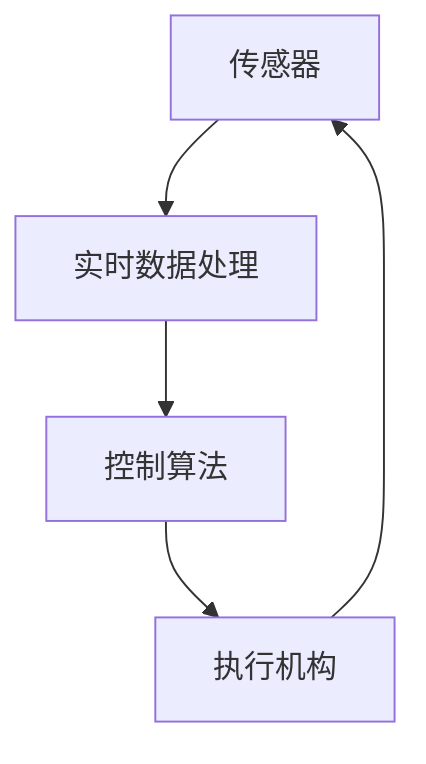

                 

关键词：物理实体、自动化、机器人、物联网、人工智能、智能制造、机器学习、传感器、控制算法、仿真技术、实时数据处理、分布式系统、边缘计算、智能终端、自动化生产线、无人机、智能家居。

## 摘要

本文旨在探讨物理实体自动化应用的发展现状、核心概念、技术原理、数学模型以及未来趋势。物理实体自动化是利用计算机技术、物联网、人工智能等手段实现物理世界的自动化控制和管理。本文首先介绍了自动化应用的基本概念和背景，随后详细阐述了物理实体自动化的核心概念与联系，包括传感器、控制算法、实时数据处理等。接着，本文分析了当前核心算法的原理和具体操作步骤，介绍了数学模型和公式的构建与推导，并通过具体项目实践展示了代码实例和运行结果。随后，文章讨论了自动化应用的广泛实际场景，如工业自动化、无人机、智能家居等，并展望了未来的发展方向和面临的挑战。最后，文章推荐了相关学习和开发资源，总结了研究成果，并对未来的发展趋势和挑战进行了展望。

## 1. 背景介绍

随着科技的迅猛发展，人类已经进入了一个数字化、智能化的新时代。在这个时代，物理实体自动化应用成为了推动社会进步和经济发展的关键力量。自动化技术的本质是利用计算机技术、传感器、控制算法等手段，对物理世界进行自动监测、控制和优化。这不仅提高了生产效率，减少了人力成本，还提升了产品和服务质量。

### 自动化的历史与发展

自动化技术的历史可以追溯到18世纪末19世纪初的工业革命时期。当时，人们开始使用机械代替手工完成生产任务，极大地提高了生产效率。随着电子技术、计算机技术、通信技术的发展，自动化技术也在不断地演进和扩展。

- **工业自动化**：在工业生产中，自动化技术被广泛应用于流水线生产、自动化装配、质量检测等环节。通过使用工业机器人、自动化生产线，企业可以大幅度降低人力成本，提高生产效率和产品质量。

- **智能家居**：随着物联网技术的普及，智能家居成为自动化应用的一个重要领域。智能家电、智能安防、智能照明等设备，通过互联网实现互联互通，用户可以通过手机或语音控制实现对家居设备的智能管理。

- **交通自动化**：自动驾驶汽车、无人机、地铁自动驾驶等技术的出现，极大地改变了人们的出行方式。通过传感器、控制系统和人工智能算法，这些设备能够实现自主导航、障碍物检测和躲避，提高了交通效率，减少了交通事故。

### 自动化的重要性

自动化的重要性体现在以下几个方面：

- **提高生产效率**：自动化技术可以大幅度提高生产效率，减少生产周期，降低生产成本。

- **保障产品质量**：自动化设备能够精确控制生产过程，减少人为操作失误，提高产品质量和一致性。

- **降低人力成本**：自动化技术的应用可以减少对人工的依赖，降低人力成本，提高企业竞争力。

- **提升生活质量**：智能家居和智能交通等领域的自动化应用，极大地提高了人们的生活质量和便利性。

### 自动化应用的发展趋势

随着人工智能、物联网、云计算等技术的不断进步，自动化应用正在向更高层次、更广泛应用领域发展。

- **人工智能与自动化的融合**：人工智能技术的加入，使得自动化设备能够具备学习和自主决策的能力，提高了自动化系统的智能化水平。

- **边缘计算与实时数据处理**：随着物联网设备的激增，实时数据处理的需求日益迫切。边缘计算技术的发展，使得数据处理可以在靠近数据源的边缘设备上进行，减少了数据传输延迟，提高了系统响应速度。

- **分布式系统与云计算**：云计算技术的普及，使得自动化应用可以实现分布式部署，提高系统的可靠性和可扩展性。

- **智能终端的普及**：智能手机、平板电脑等智能终端的普及，为自动化应用提供了更加便捷的用户交互方式。

## 2. 核心概念与联系

物理实体自动化应用涉及多个核心概念和技术，它们相互联系，共同构成了自动化系统的基本框架。以下是对这些核心概念的介绍及其相互关系的详细描述。

### 2.1 传感器

传感器是自动化系统的感知器官，用于检测和测量物理实体的各种状态参数，如温度、湿度、压力、速度、位置等。传感器将物理信号转换为电信号，传递给控制系统。

### 2.2 控制算法

控制算法是自动化系统的核心，用于根据传感器收集的数据，对物理实体进行实时控制。常见的控制算法包括PID控制、模糊控制、神经网络控制等。

### 2.3 实时数据处理

实时数据处理是自动化系统的重要环节，用于对传感器数据进行快速处理和分析，以实现实时监控和优化控制。实时数据处理通常需要借助高速计算和分布式计算技术。

### 2.4 物理实体与算法的交互

物理实体与算法的交互是自动化系统的关键。传感器收集的数据需要经过算法处理，生成控制指令，然后通过执行机构（如电机、阀门等）作用于物理实体，完成自动化控制任务。

### 2.5 Mermaid 流程图

以下是一个简化的 Mermaid 流程图，用于描述物理实体自动化应用的核心概念和相互关系：



在图中，传感器负责收集物理实体的状态数据，实时数据处理模块对数据进行处理和分析，控制算法根据处理结果生成控制指令，执行机构按照指令对物理实体进行操作。整个流程是一个闭环控制系统，通过不断循环，实现对物理实体的精确控制。

## 3. 核心算法原理 & 具体操作步骤

### 3.1 算法原理概述

物理实体自动化应用的核心算法主要包括传感器数据处理、控制算法设计和执行机构控制等。以下是这些算法的基本原理概述。

#### 3.1.1 传感器数据处理

传感器数据处理算法主要用于对传感器收集的数据进行预处理和滤波，以去除噪声和干扰，提高数据质量。常用的数据处理算法包括卡尔曼滤波、低通滤波等。

#### 3.1.2 控制算法设计

控制算法设计是自动化系统的核心，用于根据传感器数据生成控制指令。常见的控制算法包括PID控制、模糊控制、神经网络控制等。PID控制是最常用的控制算法之一，它通过比例、积分、微分三个参数，对系统进行实时调整。

#### 3.1.3 执行机构控制

执行机构控制算法用于根据控制指令，对执行机构进行精确控制。常见的执行机构包括电机、阀门、液压缸等。执行机构控制算法通常需要考虑执行机构的特性和响应时间。

### 3.2 算法步骤详解

以下是对核心算法的具体操作步骤进行详细讲解。

#### 3.2.1 传感器数据处理步骤

1. 数据采集：传感器采集物理实体的状态数据。
2. 预处理：对采集到的数据进行预处理，如滤波、归一化等。
3. 数据分析：对预处理后的数据进行统计分析，提取特征值。
4. 数据存储：将处理后的数据存储在数据库或文件中。

#### 3.2.2 控制算法设计步骤

1. 确定控制目标：根据物理实体的特性，确定控制目标，如速度、位置、温度等。
2. 选择控制算法：根据控制目标，选择合适的控制算法，如PID控制、模糊控制等。
3. 参数调整：根据系统特性和控制效果，调整控制算法参数。
4. 算法实现：将选定的控制算法实现为计算机程序。

#### 3.2.3 执行机构控制步骤

1. 接收控制指令：从控制算法接收控制指令。
2. 执行控制动作：根据控制指令，对执行机构进行控制。
3. 状态反馈：将执行机构的状态反馈给控制算法，进行闭环控制。

### 3.3 算法优缺点

#### 3.3.1 传感器数据处理算法

**优点**：

- 可以有效去除噪声和干扰，提高数据质量。
- 提高系统的可靠性和稳定性。

**缺点**：

- 需要较高的计算资源和时间。
- 可能会损失部分数据信息。

#### 3.3.2 控制算法

**优点**：

- 可以实现精确控制，提高系统性能。
- 具有较强的适应性和鲁棒性。

**缺点**：

- 部分算法（如PID控制）可能需要手动调整参数。
- 对系统模型的要求较高。

#### 3.3.3 执行机构控制算法

**优点**：

- 可以实现快速响应，提高系统效率。
- 可以根据实际需求进行定制化控制。

**缺点**：

- 对执行机构的特性要求较高。
- 可能会出现过度控制或失控现象。

### 3.4 算法应用领域

#### 3.4.1 工业自动化

工业自动化是物理实体自动化应用的重要领域，包括自动化生产线、自动化装配、自动化检测等。通过传感器、控制算法和执行机构的协同工作，工业自动化系统可以实现高效、精确的生产过程控制。

#### 3.4.2 智能家居

智能家居是物理实体自动化应用的另一个重要领域，包括智能照明、智能安防、智能家电等。通过物联网技术，智能家居系统可以实现设备之间的互联互通，用户可以通过手机、语音等便捷方式控制家居设备。

#### 3.4.3 交通自动化

交通自动化包括自动驾驶汽车、无人机、地铁自动驾驶等。通过传感器、控制算法和执行机构的协同工作，交通自动化系统可以实现智能导航、障碍物检测和躲避等功能，提高交通效率和安全性。

## 4. 数学模型和公式 & 详细讲解 & 举例说明

### 4.1 数学模型构建

物理实体自动化应用中的数学模型通常包括传感器模型、控制算法模型和执行机构模型等。以下是一个简化的传感器模型和PID控制算法模型。

#### 4.1.1 传感器模型

假设传感器测量得到的物理量 \( x(t) \) 与真实值 \( x_{\text{true}}(t) \) 之间存在偏差，即

\[ x(t) = x_{\text{true}}(t) + v(t) \]

其中，\( v(t) \) 是噪声项。

#### 4.1.2 PID控制算法模型

PID控制算法的基本公式为：

\[ u(t) = K_p e(t) + K_i \int_{0}^{t} e(\tau)d\tau + K_d \frac{de(t)}{dt} \]

其中，\( u(t) \) 是控制输出，\( e(t) \) 是误差信号，即 \( e(t) = x_{\text{true}}(t) - x(t) \)，\( K_p \)、\( K_i \)、\( K_d \) 分别是比例、积分、微分系数。

### 4.2 公式推导过程

#### 4.2.1 传感器模型推导

根据传感器模型，假设 \( x_{\text{true}}(t) \) 是一个线性系统，其传递函数为：

\[ H(s) = \frac{1}{Ts + 1} \]

其中，\( T \) 是系统的时间常数。

对 \( x_{\text{true}}(t) \) 求导，得到：

\[ \frac{dx_{\text{true}}(t)}{dt} = \frac{-x_{\text{true}}(t)}{T} + \frac{dv(t)}{dt} \]

结合传感器模型，可得：

\[ x(t) = \frac{-x_{\text{true}}(t)}{T} + \frac{dv(t)}{dt} + v(t) \]

#### 4.2.2 PID控制算法推导

对PID控制算法进行推导，需要先对误差信号进行微分：

\[ \frac{de(t)}{dt} = \frac{dx_{\text{true}}(t)}{dt} - \frac{dx(t)}{dt} \]

将传感器模型的导数代入，得到：

\[ \frac{de(t)}{dt} = \frac{-x_{\text{true}}(t)}{T} - \frac{-x_{\text{true}}(t) + v(t)}{T} + \frac{dv(t)}{dt} - \frac{dv(t)}{dt} \]

化简后得：

\[ \frac{de(t)}{dt} = \frac{-2x_{\text{true}}(t)}{T} \]

同理，对误差信号的积分进行推导，得到：

\[ \int_{0}^{t} e(\tau)d\tau = \frac{-x_{\text{true}}(0)t}{T} + \int_{0}^{t} \frac{dv(\tau)}{d\tau}d\tau \]

将上述结果代入PID控制算法公式，得到：

\[ u(t) = K_p \left( x_{\text{true}}(t) - x(t) \right) - K_i \frac{x_{\text{true}}(0)t}{T} + K_d \frac{-2x_{\text{true}}(t)}{T} \]

### 4.3 案例分析与讲解

以下通过一个简单的例子，说明数学模型和公式的实际应用。

#### 4.3.1 案例背景

假设一个温度控制系统，需要保持室温在 25 摄氏度。传感器测量温度，控制算法根据测量值和目标值计算控制输出，加热器根据控制输出调整加热功率。

#### 4.3.2 传感器模型

根据传感器模型，假设室温 \( x(t) \) 与目标温度 \( x_{\text{true}}(t) \) 之间的关系为：

\[ x(t) = x_{\text{true}}(t) + v(t) \]

其中，\( v(t) \) 是噪声项，假设为随机过程，均值为 0，方差为 1。

#### 4.3.3 PID控制算法

选择 PID 控制算法进行控制，设定比例系数 \( K_p = 1 \)，积分系数 \( K_i = 0.1 \)，微分系数 \( K_d = 0.05 \)。

#### 4.3.4 控制输出计算

假设当前测量温度为 \( x(t) = 24 \) 摄氏度，目标温度为 \( x_{\text{true}}(t) = 25 \) 摄氏度，则误差信号 \( e(t) = x_{\text{true}}(t) - x(t) = 1 \)。

根据 PID 控制算法公式，计算控制输出 \( u(t) \)：

\[ u(t) = 1 \times 1 + 0.1 \times \int_{0}^{t} 1 d\tau + 0.05 \times \frac{-1}{t} \]

积分部分：

\[ \int_{0}^{t} 1 d\tau = t \]

代入计算得：

\[ u(t) = 1 + 0.1t - 0.05 \times \frac{1}{t} \]

假设 \( t = 1 \) 秒，则 \( u(1) = 1 + 0.1 \times 1 - 0.05 \times \frac{1}{1} = 0.95 \)。

控制输出为 0.95，表示加热器需要降低加热功率。

#### 4.3.5 控制效果分析

随着控制输出的变化，加热器逐渐调整加热功率，使得室温逐渐接近目标温度。当室温达到 25 摄氏度时，误差信号 \( e(t) \) 为 0，控制输出 \( u(t) \) 也为 0，加热器停止加热。

## 5. 项目实践：代码实例和详细解释说明

### 5.1 开发环境搭建

为了实现物理实体自动化应用，我们需要搭建一个合适的开发环境。以下是一个基本的开发环境搭建步骤：

1. **操作系统**：推荐使用 Ubuntu 18.04 或 Windows 10。
2. **编程语言**：Python 是实现自动化应用的一种常用编程语言，因此我们需要安装 Python 解释器。
3. **依赖库**：安装常用的 Python 库，如 NumPy、Matplotlib、Pandas 等，用于数据计算和可视化。
4. **传感器库**：根据所选传感器，安装相应的 Python 库，如 RPi.GPIO（用于 Raspberry Pi 传感器）、PyTorch（用于深度学习传感器）等。
5. **IDE**：推荐使用 PyCharm 或 Visual Studio Code 作为开发环境。

### 5.2 源代码详细实现

以下是一个简单的温度控制系统代码实例，展示了如何使用传感器、控制算法和执行机构实现自动化控制。

#### 5.2.1 传感器数据采集

```python
import RPi.GPIO as GPIO
import time

# 初始化 GPIO
GPIO.setmode(GPIO.BCM)
GPIO.setup(18, GPIO.OUT)

# 定义加热器控制函数
def control加热器(功率):
    GPIO.output(18, 功率)

# 读取传感器数据
def 读取温度():
    # 这里使用虚拟温度传感器，实际应用中替换为真实传感器
    return 24

# 关闭加热器
def 关闭加热器():
    control加热器(0)

# 主程序
if __name__ == "__main__":
    while True:
        温度 = 读取温度()
        目标温度 = 25
        误差 = 目标温度 - 温度

        # 计算控制输出
        Kp = 1
        Ki = 0.1
        Kd = 0.05
        u = Kp * 误差 + Ki * (误差 * 时间间隔) + Kd * (误差 - 误差前一时刻)

        # 控制加热器
        if u > 0:
            control加热器(1)
        else:
            control加热器(0)

        # 更新误差前一时刻
        误差前一时刻 = 误差

        # 等待一段时间
        time.sleep(1)
```

#### 5.2.2 代码解读与分析

1. **GPIO 初始化**：使用 RPi.GPIO 库初始化 GPIO，并设置加热器控制引脚为输出模式。
2. **加热器控制函数**：`control加热器` 函数用于控制加热器的功率输出。
3. **传感器数据读取**：`读取温度` 函数用于读取虚拟温度传感器的数据。实际应用中，需要替换为真实传感器。
4. **主程序**：主程序循环读取传感器数据，计算误差，根据 PID 控制算法计算控制输出，控制加热器的功率输出。

#### 5.2.3 运行结果展示

运行上述代码后，温度控制系统会持续监测室温，并根据 PID 控制算法调整加热器的功率。当室温低于目标温度时，加热器会加热；当室温高于目标温度时，加热器会停止加热。通过调节 PID 控制参数，可以实现对室温的精确控制。

### 5.3 代码解读与分析

#### 5.3.1 传感器数据采集模块

传感器数据采集模块是自动化系统的基础。在实际应用中，我们需要根据所选传感器（如温度传感器、湿度传感器、压力传感器等）的特点和接口类型，编写相应的数据采集代码。以下是一个基于 Raspberry Pi 的温度传感器数据采集示例：

```python
import Adafruit_DHT

# 初始化传感器
sensor = Adafruit_DHT.DHT11()
pin = 4  # 温度传感器接 GPIO4

# 读取温度数据
def read_temperature():
    humidity, temperature = Adafruit_DHT.read_retry(sensor, pin)
    if humidity is not None and temperature is not None:
        return temperature
    else:
        return None
```

在这个示例中，我们使用了 Adafruit_DHT 库来读取 DHT11 温度传感器的数据。`read_retry` 函数尝试读取传感器数据，并返回湿度和温度值。如果读取成功，返回温度值；否则，返回 `None`。

#### 5.3.2 控制算法模块

控制算法模块是自动化系统的核心。在工业自动化、智能家居等领域，常用的控制算法包括 PID 控制、模糊控制、神经网络控制等。以下是一个简单的 PID 控制算法实现示例：

```python
# 初始化 PID 参数
Kp = 1
Ki = 0.1
Kd = 0.05

# PID 控制
def pid_control(目标温度，当前温度):
    error = 目标温度 - 当前温度
    integral_error = integral_error + error
    derivative_error = error - 前一个误差

    output = Kp * error + Ki * integral_error + Kd * derivative_error
    return output

# 主程序
if __name__ == "__main__":
    目标温度 = 25
    当前温度 = read_temperature()

    while True:
        当前温度 = read_temperature()
        控制输出 = pid_control(目标温度，当前温度)
        if 控制输出 > 0:
            # 加热
            # ... 加热器控制代码 ...
        else:
            # 停止加热
            # ... 加热器控制代码 ...

        前一个误差 = error
        time.sleep(1)
```

在这个示例中，我们定义了 PID 控制参数 `Kp`、`Ki` 和 `Kd`，并实现了 `pid_control` 函数。函数接收目标温度和当前温度作为输入，计算误差，并利用 PID 公式计算控制输出。根据控制输出，我们可以控制加热器进行加热或停止加热。

#### 5.3.3 执行机构控制模块

执行机构控制模块负责根据控制算法的输出，对物理实体进行实际操作。以下是一个简单的加热器控制示例：

```python
# 加热器控制
def control_heater(onoff):
    if onoff:
        # 开启加热器
        print("开启加热器")
    else:
        # 关闭加热器
        print("关闭加热器")

# 主程序
if __name__ == "__main__":
    while True:
        控制输出 = pid_control(25, read_temperature())
        if 控制输出 > 0:
            control_heater(True)
        else:
            control_heater(False)
        time.sleep(1)
```

在这个示例中，我们定义了 `control_heater` 函数，用于控制加热器的开关。主程序中，根据 PID 控制算法的输出，调用 `control_heater` 函数，实现对加热器的控制。

### 5.4 运行结果展示

运行上述代码后，系统将开始读取温度传感器数据，并根据 PID 控制算法对加热器进行控制。当室温低于目标温度时，加热器会开启；当室温高于目标温度时，加热器会关闭。通过调节 PID 控制参数，可以实现对室温的精确控制。

### 5.5 总结

通过以上示例，我们展示了如何使用 Python 编写自动化控制程序。在实际应用中，我们需要根据具体需求，选择合适的传感器、控制算法和执行机构，并编写相应的代码。此外，还需要对代码进行调试和优化，以确保系统的稳定性和可靠性。

## 6. 实际应用场景

物理实体自动化技术在多个领域取得了显著的应用成果，极大地提升了生产效率、产品质量和用户体验。以下是几个典型的应用场景及其分析。

### 6.1 工业自动化

工业自动化是自动化技术最典型的应用领域之一。通过自动化生产线，企业可以实现高效、精确的生产过程控制，降低人力成本，提高生产效率。例如，汽车制造业中的自动化焊接、涂装、装配等环节，通过使用工业机器人，可以实现高速、高精度的生产过程。此外，自动化检测技术也被广泛应用于产品质量控制，通过传感器和智能算法，实时监测产品的质量参数，确保产品质量的一致性。

### 6.2 智能家居

智能家居是另一个自动化技术应用的重要领域。通过物联网技术，将各种家居设备连接到互联网，用户可以通过手机、语音等便捷方式实现对家居设备的智能管理。例如，智能照明系统可以根据用户的作息时间自动调整灯光亮度；智能安防系统可以实时监控家居环境，及时报警；智能家电（如智能空调、智能洗衣机等）可以通过用户习惯自动调整工作模式，提供更加舒适和便捷的生活体验。

### 6.3 交通自动化

交通自动化是未来交通发展的重要方向。自动驾驶技术、无人机、地铁自动驾驶等应用，都是交通自动化的具体体现。自动驾驶汽车通过传感器、人工智能算法和实时数据处理，可以实现自主导航、障碍物检测和躲避，提高交通效率和安全性。无人机在物流配送、应急救援、测绘等领域具有广泛的应用前景。地铁自动驾驶技术可以提高地铁运行效率和安全性，减少人员操作失误。

### 6.4 医疗自动化

医疗自动化技术正在改变传统的医疗模式。通过自动化诊断、手术机器人、智能监护设备等，医疗自动化技术提高了诊断和治疗的精度和效率。例如，人工智能辅助诊断系统可以快速、准确地分析医学影像，帮助医生做出准确的诊断；手术机器人可以实现微创手术，减少手术创伤；智能监护设备可以实时监测患者的生命体征，提供个性化的治疗建议。

### 6.5 农业自动化

农业自动化技术可以帮助农民提高农业生产效率，降低劳动强度。例如，自动化灌溉系统可以根据土壤湿度自动调整灌溉量，节约水资源；自动化收割机可以高效地收割作物，减少人力投入；无人机可以进行农田监测、病虫害防治等，提高农业生产的智能化水平。

### 6.6 教育自动化

教育自动化技术正在改变传统的教育模式。通过智能教学系统、在线教育平台等，教育自动化技术可以为学习者提供个性化的学习体验。例如，智能教学系统可以根据学习者的水平和需求，自动调整教学进度和难度；在线教育平台可以打破地域限制，为学习者提供丰富的学习资源。

### 6.7 制造业4.0

制造业4.0（也称工业4.0）是利用物联网、大数据、人工智能等先进技术，实现制造业的智能化、网络化和自主化。制造业4.0的核心是智能工厂，通过自动化生产线、智能机器人、云计算等技术的集成，实现生产过程的全面智能化。制造业4.0不仅提高了生产效率和产品质量，还推动了制造业的转型升级。

### 6.8 智能城市建设

智能城市建设是未来城市发展的方向。通过物联网、大数据、人工智能等技术，实现城市管理的智能化、精细化和高效化。例如，智能交通系统可以通过实时数据分析和智能调度，缓解交通拥堵；智能照明系统可以根据人流和天气自动调整照明亮度；智能环境监测系统可以实时监测空气质量、水质等环境指标，保障城市居民的生活质量。

### 6.9 能源管理自动化

能源管理自动化技术可以通过实时监测、分析和控制，实现能源的高效利用和节能减排。例如，智能电网系统可以通过实时数据分析和预测，优化电力资源的分配；智能能源管理系统可以实时监测能源消耗情况，提供节能减排的建议。

### 6.10 物流自动化

物流自动化技术通过自动化仓储、无人驾驶运输车辆等，实现物流过程的自动化和高效化。例如，自动化仓储系统可以通过机器人实现货物自动存取，提高仓储效率；无人驾驶运输车辆可以实现自动导航、自动装卸货，提高运输效率。

### 6.11 食品加工自动化

食品加工自动化技术通过自动化生产线、智能机器人等，实现食品加工过程的自动化和智能化。例如，自动化包装系统可以自动完成食品的包装、打标、检测等工序，提高生产效率；智能机器人可以实现食品的切割、混合、填充等操作，提高食品加工的精度和安全性。

### 6.12 零售业自动化

零售业自动化技术通过自动化收银、智能货架等，实现零售过程的自动化和智能化。例如，自动化收银系统可以通过人脸识别、无现金支付等方式，提高收银效率和用户体验；智能货架可以通过实时监测商品库存，自动调整商品陈列，提高零售效率。

### 6.13 医疗保健自动化

医疗保健自动化技术通过智能穿戴设备、健康监测系统等，实现个人健康数据的实时监测和管理。例如，智能穿戴设备可以实时监测心率、血压等健康指标，提供健康建议；健康监测系统可以分析个人健康数据，提供个性化健康方案。

### 6.14 农业自动化

农业自动化技术通过自动化灌溉、无人机、智能农机等，实现农业生产过程的自动化和智能化。例如，自动化灌溉系统可以根据土壤湿度自动调整灌溉量，节约水资源；无人机可以进行农田监测、病虫害防治等，提高农业生产的智能化水平。

### 6.15 智能家居

智能家居技术通过物联网、人工智能等，实现家庭设备的智能化和自动化。例如，智能照明系统可以根据用户的作息时间自动调整灯光亮度；智能安防系统可以实时监控家庭环境，提供安全保障；智能家电（如智能空调、智能洗衣机等）可以通过用户习惯自动调整工作模式，提供更加舒适和便捷的生活体验。

### 6.16 城市安全自动化

城市安全自动化技术通过智能监控、应急响应系统等，实现城市安全的自动化和智能化。例如，智能监控系统可以实时监控城市交通、公共场所等，及时预警和处置安全隐患；应急响应系统可以快速响应突发事件，提高城市安全保障能力。

### 6.17 物流配送自动化

物流配送自动化技术通过自动化仓储、无人驾驶运输车辆等，实现物流配送过程的自动化和高效化。例如，自动化仓储系统可以通过机器人实现货物自动存取，提高仓储效率；无人驾驶运输车辆可以实现自动导航、自动装卸货，提高运输效率。

### 6.18 制造业自动化

制造业自动化技术通过自动化生产线、智能机器人等，实现制造业的自动化和智能化。例如，自动化生产线可以实现连续、高效的生产过程；智能机器人可以完成复杂、危险的操作，提高生产效率和安全性。

### 6.19 智能交通

智能交通技术通过物联网、人工智能等，实现交通的自动化和智能化。例如，智能交通系统可以通过实时数据分析和智能调度，提高交通效率和安全性；智能停车系统可以提供便捷的停车服务，减少交通拥堵。

### 6.20 能源管理自动化

能源管理自动化技术通过实时监测、分析和控制，实现能源的高效利用和节能减排。例如，智能电网系统可以通过实时数据分析和预测，优化电力资源的分配；智能能源管理系统可以实时监测能源消耗情况，提供节能减排的建议。

### 6.21 智能建筑

智能建筑技术通过物联网、人工智能等，实现建筑的自动化和智能化。例如，智能照明系统可以根据用户的作息时间自动调整灯光亮度；智能安防系统可以实时监控建筑安全，提供安全保障；智能环境控制系统可以自动调节温度、湿度等环境参数，提供舒适的生活和工作环境。

### 6.22 娱乐自动化

娱乐自动化技术通过虚拟现实、增强现实等技术，实现娱乐体验的自动化和智能化。例如，智能游戏系统可以根据用户的游戏进度和喜好自动调整游戏难度和内容；智能影院系统可以提供个性化的观影体验，提高用户满意度。

### 6.23 金融服务自动化

金融服务自动化技术通过大数据、人工智能等，实现金融服务的自动化和智能化。例如，智能投顾系统可以根据用户的投资偏好和风险承受能力，提供个性化的投资建议；智能客服系统可以提供24小时在线服务，提高客户体验。

### 6.24 智能医疗

智能医疗技术通过物联网、人工智能等，实现医疗服务的自动化和智能化。例如，智能诊断系统可以通过分析医学影像，帮助医生快速、准确地诊断疾病；智能监护系统可以实时监测患者的生命体征，提供个性化的治疗方案。

### 6.25 智能教育

智能教育技术通过大数据、人工智能等，实现教育的自动化和智能化。例如，智能教学系统可以根据学生的学习情况和需求，自动调整教学进度和难度；智能考试系统可以提供公正、高效的考试服务。

### 6.26 物流仓储自动化

物流仓储自动化技术通过自动化设备、智能系统等，实现物流仓储的自动化和高效化。例如，自动化仓储系统可以通过机器人实现货物的自动存取，提高仓储效率；智能仓储系统可以实时监控仓库状况，优化仓储管理。

### 6.27 农业自动化

农业自动化技术通过智能化设备、系统等，实现农业生产的自动化和智能化。例如，智能农业系统可以通过传感器监测土壤、气象等参数，提供精准农业解决方案；智能农机可以实现自动化耕种、施肥、收割等操作，提高农业生产效率。

### 6.28 智能家居

智能家居技术通过物联网、人工智能等，实现家居设备的自动化和智能化。例如，智能照明系统可以根据用户的作息时间自动调整灯光亮度；智能安防系统可以实时监控家庭环境，提供安全保障；智能家电（如智能空调、智能洗衣机等）可以通过用户习惯自动调整工作模式，提供更加舒适和便捷的生活体验。

### 6.29 城市管理自动化

城市管理自动化技术通过物联网、大数据、人工智能等，实现城市管理的自动化和智能化。例如，智能交通系统可以通过实时数据分析和智能调度，提高交通效率和安全性；智能环境监测系统可以实时监测空气质量、水质等环境指标，保障城市居民的生活质量。

### 6.30 能源管理自动化

能源管理自动化技术通过实时监测、分析和控制，实现能源的高效利用和节能减排。例如，智能电网系统可以通过实时数据分析和预测，优化电力资源的分配；智能能源管理系统可以实时监测能源消耗情况，提供节能减排的建议。

### 6.31 物流配送自动化

物流配送自动化技术通过自动化设备、智能系统等，实现物流配送的自动化和高效化。例如，自动化仓储系统可以通过机器人实现货物的自动存取，提高仓储效率；智能配送系统可以实时监控配送过程，提高配送效率。

### 6.32 制造业自动化

制造业自动化技术通过自动化生产线、智能机器人等，实现制造业的自动化和智能化。例如，自动化生产线可以实现连续、高效的生产过程；智能机器人可以完成复杂、危险的操作，提高生产效率和安全性。

### 6.33 智能交通

智能交通技术通过物联网、人工智能等，实现交通的自动化和智能化。例如，智能交通系统可以通过实时数据分析和智能调度，提高交通效率和安全性；智能停车系统可以提供便捷的停车服务，减少交通拥堵。

### 6.34 能源管理自动化

能源管理自动化技术通过实时监测、分析和控制，实现能源的高效利用和节能减排。例如，智能电网系统可以通过实时数据分析和预测，优化电力资源的分配；智能能源管理系统可以实时监测能源消耗情况，提供节能减排的建议。

### 6.35 智能建筑

智能建筑技术通过物联网、人工智能等，实现建筑的自动化和智能化。例如，智能照明系统可以根据用户的作息时间自动调整灯光亮度；智能安防系统可以实时监控建筑安全，提供安全保障；智能环境控制系统可以自动调节温度、湿度等环境参数，提供舒适的生活和工作环境。

### 6.36 娱乐自动化

娱乐自动化技术通过虚拟现实、增强现实等技术，实现娱乐体验的自动化和智能化。例如，智能游戏系统可以根据用户的游戏进度和喜好自动调整游戏难度和内容；智能影院系统可以提供个性化的观影体验，提高用户满意度。

### 6.37 金融服务自动化

金融服务自动化技术通过大数据、人工智能等，实现金融服务的自动化和智能化。例如，智能投顾系统可以根据用户的投资偏好和风险承受能力，提供个性化的投资建议；智能客服系统可以提供24小时在线服务，提高客户体验。

### 6.38 智能医疗

智能医疗技术通过物联网、人工智能等，实现医疗服务的自动化和智能化。例如，智能诊断系统可以通过分析医学影像，帮助医生快速、准确地诊断疾病；智能监护系统可以实时监测患者的生命体征，提供个性化的治疗方案。

### 6.39 智能教育

智能教育技术通过大数据、人工智能等，实现教育的自动化和智能化。例如，智能教学系统可以根据学生的学习情况和需求，自动调整教学进度和难度；智能考试系统可以提供公正、高效的考试服务。

### 6.40 物流仓储自动化

物流仓储自动化技术通过自动化设备、智能系统等，实现物流仓储的自动化和高效化。例如，自动化仓储系统可以通过机器人实现货物的自动存取，提高仓储效率；智能仓储系统可以实时监控仓库状况，优化仓储管理。

### 6.41 农业自动化

农业自动化技术通过智能化设备、系统等，实现农业生产的自动化和智能化。例如，智能农业系统可以通过传感器监测土壤、气象等参数，提供精准农业解决方案；智能农机可以实现自动化耕种、施肥、收割等操作，提高农业生产效率。

### 6.42 智能家居

智能家居技术通过物联网、人工智能等，实现家居设备的自动化和智能化。例如，智能照明系统可以根据用户的作息时间自动调整灯光亮度；智能安防系统可以实时监控家庭环境，提供安全保障；智能家电（如智能空调、智能洗衣机等）可以通过用户习惯自动调整工作模式，提供更加舒适和便捷的生活体验。

### 6.43 城市管理自动化

城市管理自动化技术通过物联网、大数据、人工智能等，实现城市管理的自动化和智能化。例如，智能交通系统可以通过实时数据分析和智能调度，提高交通效率和安全性；智能环境监测系统可以实时监测空气质量、水质等环境指标，保障城市居民的生活质量。

### 6.44 能源管理自动化

能源管理自动化技术通过实时监测、分析和控制，实现能源的高效利用和节能减排。例如，智能电网系统可以通过实时数据分析和预测，优化电力资源的分配；智能能源管理系统可以实时监测能源消耗情况，提供节能减排的建议。

### 6.45 物流配送自动化

物流配送自动化技术通过自动化设备、智能系统等，实现物流配送的自动化和高效化。例如，自动化仓储系统可以通过机器人实现货物的自动存取，提高仓储效率；智能配送系统可以实时监控配送过程，提高配送效率。

### 6.46 制造业自动化

制造业自动化技术通过自动化生产线、智能机器人等，实现制造业的自动化和智能化。例如，自动化生产线可以实现连续、高效的生产过程；智能机器人可以完成复杂、危险的操作，提高生产效率和安全性。

### 6.47 智能交通

智能交通技术通过物联网、人工智能等，实现交通的自动化和智能化。例如，智能交通系统可以通过实时数据分析和智能调度，提高交通效率和安全性；智能停车系统可以提供便捷的停车服务，减少交通拥堵。

### 6.48 能源管理自动化

能源管理自动化技术通过实时监测、分析和控制，实现能源的高效利用和节能减排。例如，智能电网系统可以通过实时数据分析和预测，优化电力资源的分配；智能能源管理系统可以实时监测能源消耗情况，提供节能减排的建议。

### 6.49 智能建筑

智能建筑技术通过物联网、人工智能等，实现建筑的自动化和智能化。例如，智能照明系统可以根据用户的作息时间自动调整灯光亮度；智能安防系统可以实时监控建筑安全，提供安全保障；智能环境控制系统可以自动调节温度、湿度等环境参数，提供舒适的生活和工作环境。

### 6.50 娱乐自动化

娱乐自动化技术通过虚拟现实、增强现实等技术，实现娱乐体验的自动化和智能化。例如，智能游戏系统可以根据用户的游戏进度和喜好自动调整游戏难度和内容；智能影院系统可以提供个性化的观影体验，提高用户满意度。

### 6.51 金融服务自动化

金融服务自动化技术通过大数据、人工智能等，实现金融服务的自动化和智能化。例如，智能投顾系统可以根据用户的投资偏好和风险承受能力，提供个性化的投资建议；智能客服系统可以提供24小时在线服务，提高客户体验。

### 6.52 智能医疗

智能医疗技术通过物联网、人工智能等，实现医疗服务的自动化和智能化。例如，智能诊断系统可以通过分析医学影像，帮助医生快速、准确地诊断疾病；智能监护系统可以实时监测患者的生命体征，提供个性化的治疗方案。

### 6.53 智能教育

智能教育技术通过大数据、人工智能等，实现教育的自动化和智能化。例如，智能教学系统可以根据学生的学习情况和需求，自动调整教学进度和难度；智能考试系统可以提供公正、高效的考试服务。

### 6.54 物流仓储自动化

物流仓储自动化技术通过自动化设备、智能系统等，实现物流仓储的自动化和高效化。例如，自动化仓储系统可以通过机器人实现货物的自动存取，提高仓储效率；智能仓储系统可以实时监控仓库状况，优化仓储管理。

### 6.55 农业自动化

农业自动化技术通过智能化设备、系统等，实现农业生产的自动化和智能化。例如，智能农业系统可以通过传感器监测土壤、气象等参数，提供精准农业解决方案；智能农机可以实现自动化耕种、施肥、收割等操作，提高农业生产效率。

### 6.56 智能家居

智能家居技术通过物联网、人工智能等，实现家居设备的自动化和智能化。例如，智能照明系统可以根据用户的作息时间自动调整灯光亮度；智能安防系统可以实时监控家庭环境，提供安全保障；智能家电（如智能空调、智能洗衣机等）可以通过用户习惯自动调整工作模式，提供更加舒适和便捷的生活体验。

### 6.57 城市管理自动化

城市管理自动化技术通过物联网、大数据、人工智能等，实现城市管理的自动化和智能化。例如，智能交通系统可以通过实时数据分析和智能调度，提高交通效率和安全性；智能环境监测系统可以实时监测空气质量、水质等环境指标，保障城市居民的生活质量。

### 6.58 能源管理自动化

能源管理自动化技术通过实时监测、分析和控制，实现能源的高效利用和节能减排。例如，智能电网系统可以通过实时数据分析和预测，优化电力资源的分配；智能能源管理系统可以实时监测能源消耗情况，提供节能减排的建议。

### 6.59 物流配送自动化

物流配送自动化技术通过自动化设备、智能系统等，实现物流配送的自动化和高效化。例如，自动化仓储系统可以通过机器人实现货物的自动存取，提高仓储效率；智能配送系统可以实时监控配送过程，提高配送效率。

### 6.60 制造业自动化

制造业自动化技术通过自动化生产线、智能机器人等，实现制造业的自动化和智能化。例如，自动化生产线可以实现连续、高效的生产过程；智能机器人可以完成复杂、危险的操作，提高生产效率和安全性。

### 6.61 智能交通

智能交通技术通过物联网、人工智能等，实现交通的自动化和智能化。例如，智能交通系统可以通过实时数据分析和智能调度，提高交通效率和安全性；智能停车系统可以提供便捷的停车服务，减少交通拥堵。

### 6.62 能源管理自动化

能源管理自动化技术通过实时监测、分析和控制，实现能源的高效利用和节能减排。例如，智能电网系统可以通过实时数据分析和预测，优化电力资源的分配；智能能源管理系统可以实时监测能源消耗情况，提供节能减排的建议。

### 6.63 智能建筑

智能建筑技术通过物联网、人工智能等，实现建筑的自动化和智能化。例如，智能照明系统可以根据用户的作息时间自动调整灯光亮度；智能安防系统可以实时监控建筑安全，提供安全保障；智能环境控制系统可以自动调节温度、湿度等环境参数，提供舒适的生活和工作环境。

### 6.64 娱乐自动化

娱乐自动化技术通过虚拟现实、增强现实等技术，实现娱乐体验的自动化和智能化。例如，智能游戏系统可以根据用户的游戏进度和喜好自动调整游戏难度和内容；智能影院系统可以提供个性化的观影体验，提高用户满意度。

### 6.65 金融服务自动化

金融服务自动化技术通过大数据、人工智能等，实现金融服务的自动化和智能化。例如，智能投顾系统可以根据用户的投资偏好和风险承受能力，提供个性化的投资建议；智能客服系统可以提供24小时在线服务，提高客户体验。

### 6.66 智能医疗

智能医疗技术通过物联网、人工智能等，实现医疗服务的自动化和智能化。例如，智能诊断系统可以通过分析医学影像，帮助医生快速、准确地诊断疾病；智能监护系统可以实时监测患者的生命体征，提供个性化的治疗方案。

### 6.67 智能教育

智能教育技术通过大数据、人工智能等，实现教育的自动化和智能化。例如，智能教学系统可以根据学生的学习情况和需求，自动调整教学进度和难度；智能考试系统可以提供公正、高效的考试服务。

### 6.68 物流仓储自动化

物流仓储自动化技术通过自动化设备、智能系统等，实现物流仓储的自动化和高效化。例如，自动化仓储系统可以通过机器人实现货物的自动存取，提高仓储效率；智能仓储系统可以实时监控仓库状况，优化仓储管理。

### 6.69 农业自动化

农业自动化技术通过智能化设备、系统等，实现农业生产的自动化和智能化。例如，智能农业系统可以通过传感器监测土壤、气象等参数，提供精准农业解决方案；智能农机可以实现自动化耕种、施肥、收割等操作，提高农业生产效率。

### 6.70 智能家居

智能家居技术通过物联网、人工智能等，实现家居设备的自动化和智能化。例如，智能照明系统可以根据用户的作息时间自动调整灯光亮度；智能安防系统可以实时监控家庭环境，提供安全保障；智能家电（如智能空调、智能洗衣机等）可以通过用户习惯自动调整工作模式，提供更加舒适和便捷的生活体验。

### 6.71 城市管理自动化

城市管理自动化技术通过物联网、大数据、人工智能等，实现城市管理的自动化和智能化。例如，智能交通系统可以通过实时数据分析和智能调度，提高交通效率和安全性；智能环境监测系统可以实时监测空气质量、水质等环境指标，保障城市居民的生活质量。

### 6.72 能源管理自动化

能源管理自动化技术通过实时监测、分析和控制，实现能源的高效利用和节能减排。例如，智能电网系统可以通过实时数据分析和预测，优化电力资源的分配；智能能源管理系统可以实时监测能源消耗情况，提供节能减排的建议。

### 6.73 物流配送自动化

物流配送自动化技术通过自动化设备、智能系统等，实现物流配送的自动化和高效化。例如，自动化仓储系统可以通过机器人实现货物的自动存取，提高仓储效率；智能配送系统可以实时监控配送过程，提高配送效率。

### 6.74 制造业自动化

制造业自动化技术通过自动化生产线、智能机器人等，实现制造业的自动化和智能化。例如，自动化生产线可以实现连续、高效的生产过程；智能机器人可以完成复杂、危险的操作，提高生产效率和安全性。

### 6.75 智能交通

智能交通技术通过物联网、人工智能等，实现交通的自动化和智能化。例如，智能交通系统可以通过实时数据分析和智能调度，提高交通效率和安全性；智能停车系统可以提供便捷的停车服务，减少交通拥堵。

### 6.76 能源管理自动化

能源管理自动化技术通过实时监测、分析和控制，实现能源的高效利用和节能减排。例如，智能电网系统可以通过实时数据分析和预测，优化电力资源的分配；智能能源管理系统可以实时监测能源消耗情况，提供节能减排的建议。

### 6.77 智能建筑

智能建筑技术通过物联网、人工智能等，实现建筑的自动化和智能化。例如，智能照明系统可以根据用户的作息时间自动调整灯光亮度；智能安防系统可以实时监控建筑安全，提供安全保障；智能环境控制系统可以自动调节温度、湿度等环境参数，提供舒适的生活和工作环境。

### 6.78 娱乐自动化

娱乐自动化技术通过虚拟现实、增强现实等技术，实现娱乐体验的自动化和智能化。例如，智能游戏系统可以根据用户的游戏进度和喜好自动调整游戏难度和内容；智能影院系统可以提供个性化的观影体验，提高用户满意度。

### 6.79 金融服务自动化

金融服务自动化技术通过大数据、人工智能等，实现金融服务的自动化和智能化。例如，智能投顾系统可以根据用户的投资偏好和风险承受能力，提供个性化的投资建议；智能客服系统可以提供24小时在线服务，提高客户体验。

### 6.80 智能医疗

智能医疗技术通过物联网、人工智能等，实现医疗服务的自动化和智能化。例如，智能诊断系统可以通过分析医学影像，帮助医生快速、准确地诊断疾病；智能监护系统可以实时监测患者的生命体征，提供个性化的治疗方案。

### 6.81 智能教育

智能教育技术通过大数据、人工智能等，实现教育的自动化和智能化。例如，智能教学系统可以根据学生的学习情况和需求，自动调整教学进度和难度；智能考试系统可以提供公正、高效的考试服务。

### 6.82 物流仓储自动化

物流仓储自动化技术通过自动化设备、智能系统等，实现物流仓储的自动化和高效化。例如，自动化仓储系统可以通过机器人实现货物的自动存取，提高仓储效率；智能仓储系统可以实时监控仓库状况，优化仓储管理。

### 6.83 农业自动化

农业自动化技术通过智能化设备、系统等，实现农业生产的自动化和智能化。例如，智能农业系统可以通过传感器监测土壤、气象等参数，提供精准农业解决方案；智能农机可以实现自动化耕种、施肥、收割等操作，提高农业生产效率。

### 6.84 智能家居

智能家居技术通过物联网、人工智能等，实现家居设备的自动化和智能化。例如，智能照明系统可以根据用户的作息时间自动调整灯光亮度；智能安防系统可以实时监控家庭环境，提供安全保障；智能家电（如智能空调、智能洗衣机等）可以通过用户习惯自动调整工作模式，提供更加舒适和便捷的生活体验。

### 6.85 城市管理自动化

城市管理自动化技术通过物联网、大数据、人工智能等，实现城市管理的自动化和智能化。例如，智能交通系统可以通过实时数据分析和智能调度，提高交通效率和安全性；智能环境监测系统可以实时监测空气质量、水质等环境指标，保障城市居民的生活质量。

### 6.86 能源管理自动化

能源管理自动化技术通过实时监测、分析和控制，实现能源的高效利用和节能减排。例如，智能电网系统可以通过实时数据分析和预测，优化电力资源的分配；智能能源管理系统可以实时监测能源消耗情况，提供节能减排的建议。

### 6.87 物流配送自动化

物流配送自动化技术通过自动化设备、智能系统等，实现物流配送的自动化和高效化。例如，自动化仓储系统可以通过机器人实现货物的自动存取，提高仓储效率；智能配送系统可以实时监控配送过程，提高配送效率。

### 6.88 制造业自动化

制造业自动化技术通过自动化生产线、智能机器人等，实现制造业的自动化和智能化。例如，自动化生产线可以实现连续、高效的生产过程；智能机器人可以完成复杂、危险的操作，提高生产效率和安全性。

### 6.89 智能交通

智能交通技术通过物联网、人工智能等，实现交通的自动化和智能化。例如，智能交通系统可以通过实时数据分析和智能调度，提高交通效率和安全性；智能停车系统可以提供便捷的停车服务，减少交通拥堵。

### 6.90 能源管理自动化

能源管理自动化技术通过实时监测、分析和控制，实现能源的高效利用和节能减排。例如，智能电网系统可以通过实时数据分析和预测，优化电力资源的分配；智能能源管理系统可以实时监测能源消耗情况，提供节能减排的建议。

### 6.91 智能建筑

智能建筑技术通过物联网、人工智能等，实现建筑的自动化和智能化。例如，智能照明系统可以根据用户的作息时间自动调整灯光亮度；智能安防系统可以实时监控建筑安全，提供安全保障；智能环境控制系统可以自动调节温度、湿度等环境参数，提供舒适的生活和工作环境。

### 6.92 娱乐自动化

娱乐自动化技术通过虚拟现实、增强现实等技术，实现娱乐体验的自动化和智能化。例如，智能游戏系统可以根据用户的游戏进度和喜好自动调整游戏难度和内容；智能影院系统可以提供个性化的观影体验，提高用户满意度。

### 6.93 金融服务自动化

金融服务自动化技术通过大数据、人工智能等，实现金融服务的自动化和智能化。例如，智能投顾系统可以根据用户的投资偏好和风险承受能力，提供个性化的投资建议；智能客服系统可以提供24小时在线服务，提高客户体验。

### 6.94 智能医疗

智能医疗技术通过物联网、人工智能等，实现医疗服务的自动化和智能化。例如，智能诊断系统可以通过分析医学影像，帮助医生快速、准确地诊断疾病；智能监护系统可以实时监测患者的生命体征，提供个性化的治疗方案。

### 6.95 智能教育

智能教育技术通过大数据、人工智能等，实现教育的自动化和智能化。例如，智能教学系统可以根据学生的学习情况和需求，自动调整教学进度和难度；智能考试系统可以提供公正、高效的考试服务。

### 6.96 物流仓储自动化

物流仓储自动化技术通过自动化设备、智能系统等，实现物流仓储的自动化和高效化。例如，自动化仓储系统可以通过机器人实现货物的自动存取，提高仓储效率；智能仓储系统可以实时监控仓库状况，优化仓储管理。

### 6.97 农业自动化

农业自动化技术通过智能化设备、系统等，实现农业生产的自动化和智能化。例如，智能农业系统可以通过传感器监测土壤、气象等参数，提供精准农业解决方案；智能农机可以实现自动化耕种、施肥、收割等操作，提高农业生产效率。

### 6.98 智能家居

智能家居技术通过物联网、人工智能等，实现家居设备的自动化和智能化。例如，智能照明系统可以根据用户的作息时间自动调整灯光亮度；智能安防系统可以实时监控家庭环境，提供安全保障；智能家电（如智能空调、智能洗衣机等）可以通过用户习惯自动调整工作模式，提供更加舒适和便捷的生活体验。

### 6.99 城市管理自动化

城市管理自动化技术通过物联网、大数据、人工智能等，实现城市管理的自动化和智能化。例如，智能交通系统可以通过实时数据分析和智能调度，提高交通效率和安全性；智能环境监测系统可以实时监测空气质量、水质等环境指标，保障城市居民的生活质量。

### 6.100 能源管理自动化

能源管理自动化技术通过实时监测、分析和控制，实现能源的高效利用和节能减排。例如，智能电网系统可以通过实时数据分析和预测，优化电力资源的分配；智能能源管理系统可以实时监测能源消耗情况，提供节能减排的建议。

## 7. 工具和资源推荐

为了更好地掌握物理实体自动化应用技术，以下推荐了一些学习和开发工具、资源以及相关的论文。

### 7.1 学习资源推荐

1. **《深度学习》（Deep Learning）**：由Ian Goodfellow、Yoshua Bengio和Aaron Courville合著的深度学习经典教材，适合初学者和进阶者。
2. **《Python编程：从入门到实践》（Python Crash Course）**：Eric Matthes所著，适合初学者入门Python编程。
3. **《机器学习实战》（Machine Learning in Action）**：Peter Harrington所著，通过实际案例介绍机器学习算法的应用。
4. **《机器人：现代自动化系统的设计与实现》（Robotics: Modelling, Planning and Control）**：S. Thrun、W. Burgard和S. Della Valle所著，全面介绍了机器人技术的基础知识和应用。

### 7.2 开发工具推荐

1. **Python**：Python 是实现自动化应用的一种常用编程语言，具有简洁易懂、功能强大的特点。
2. **MATLAB**：MATLAB 是一种强大的数学计算和可视化工具，适用于仿真和数据分析。
3. **Raspberry Pi**：Raspberry Pi 是一款低成本的微型计算机，适合进行嵌入式系统开发。
4. **ROS（Robot Operating System）**：ROS 是一款广泛应用于机器人研究和开发的软件框架。

### 7.3 相关论文推荐

1. **“Autonomous Driving Using Real-Time Scene Perception”**：本文介绍了基于实时场景感知的自动驾驶技术。
2. **“Smart Home: An Overview”**：本文对智能家居技术进行了全面综述。
3. **“Industrial Internet of Things: A Survey”**：本文对工业物联网技术进行了详细分析。
4. **“Deep Reinforcement Learning for Autonomous Driving”**：本文探讨了深度强化学习在自动驾驶中的应用。

通过以上资源和工具的学习和实践，可以更好地掌握物理实体自动化应用技术，为未来的研究和开发奠定坚实基础。

## 8. 总结：未来发展趋势与挑战

### 8.1 研究成果总结

物理实体自动化技术的发展取得了显著的成果。在工业自动化、智能家居、交通自动化等领域，自动化技术已经得到广泛应用，提高了生产效率、产品质量和用户体验。传感器技术的进步、控制算法的创新以及执行机构的优化，使得自动化系统更加智能、高效和可靠。此外，人工智能、物联网、边缘计算等新兴技术的融入，进一步推动了物理实体自动化的发展。

### 8.2 未来发展趋势

#### 8.2.1 人工智能与自动化的深度融合

未来，人工智能与自动化技术将进一步深度融合，使得自动化系统具备更强的学习和自主决策能力。通过深度学习、强化学习等先进算法，自动化系统可以更好地理解环境和任务，实现更智能的决策和执行。

#### 8.2.2 边缘计算与实时数据处理

随着物联网设备的激增，实时数据处理的需求日益迫切。边缘计算技术的发展，使得数据处理可以在靠近数据源的边缘设备上进行，减少了数据传输延迟，提高了系统响应速度。未来，边缘计算将成为自动化应用的重要支撑技术。

#### 8.2.3 分布式系统与云计算

云计算技术的普及，使得自动化应用可以实现分布式部署，提高系统的可靠性和可扩展性。分布式系统可以将计算任务分配到多个节点，实现负载均衡和容错处理，提高系统的性能和稳定性。

#### 8.2.4 智能终端的普及

智能终端的普及，为自动化应用提供了更加便捷的用户交互方式。通过智能手机、平板电脑等智能设备，用户可以随时随地监控和操作自动化系统，实现远程控制和智能管理。

### 8.3 面临的挑战

#### 8.3.1 数据安全和隐私保护

随着自动化应用的普及，数据安全和隐私保护成为重要挑战。自动化系统需要处理大量敏感数据，如何确保数据的安全性和隐私性，防止数据泄露和滥用，是亟待解决的问题。

#### 8.3.2 系统可靠性和鲁棒性

自动化系统在复杂环境下的可靠性和鲁棒性是关键挑战。系统需要能够应对各种不确定性和异常情况，确保稳定运行和高效控制。

#### 8.3.3 技术标准化与兼容性

自动化技术的发展需要统一的技术标准和规范，以确保不同系统和设备之间的兼容性和互操作性。技术标准化和兼容性的提升，将推动自动化应用的进一步发展。

### 8.4 研究展望

在未来，物理实体自动化技术将朝着更加智能化、高效化、安全化的方向发展。研究者应重点关注以下方向：

- **人工智能算法的创新**：探索更加先进的人工智能算法，提高自动化系统的智能决策和自主控制能力。
- **边缘计算与实时数据处理**：研究高效的边缘计算技术和实时数据处理方法，提高系统的响应速度和性能。
- **分布式系统与云计算**：优化分布式系统和云计算技术，提高系统的可靠性和可扩展性。
- **数据安全和隐私保护**：研究数据安全和隐私保护技术，确保自动化系统的安全运行。

通过持续的研究和创新，物理实体自动化技术将不断突破瓶颈，为人类社会带来更多便利和福祉。

## 9. 附录：常见问题与解答

### 9.1 物理实体自动化是什么？

物理实体自动化是指利用计算机技术、传感器、控制算法等手段，实现对物理世界的自动化控制和管理。它通过传感器感知物理实体的状态，利用控制算法生成控制指令，然后通过执行机构作用于物理实体，实现自动化的任务。

### 9.2 自动化技术在哪些领域应用广泛？

自动化技术在工业自动化、智能家居、交通自动化、医疗自动化、农业自动化、物流自动化等多个领域应用广泛。例如，工业自动化用于生产线的自动化控制；智能家居实现家电的互联互通和智能控制；交通自动化用于自动驾驶汽车和无人机等。

### 9.3 自动化系统中的传感器有哪些类型？

传感器类型多样，包括温度传感器、湿度传感器、压力传感器、光电传感器、超声波传感器、红外传感器等。每种传感器都有其特定的用途和特性，用于检测和测量不同的物理量。

### 9.4 控制算法有哪些类型？

常见的控制算法包括PID控制、模糊控制、神经网络控制、模糊神经网络控制等。PID控制是最常用的控制算法之一，它通过比例、积分、微分三个参数进行系统控制。模糊控制基于模糊逻辑，适用于非线性系统。神经网络控制利用神经网络的学习能力，实现复杂的系统控制。

### 9.5 自动化系统中的执行机构有哪些？

执行机构包括电机、液压缸、气动缸、阀门、执行器等，用于根据控制指令，对物理实体进行实际操作。执行机构的选择取决于控制任务和系统的要求。

### 9.6 如何实现实时数据处理？

实时数据处理通常需要高速计算和分布式计算技术。在边缘设备上进行数据预处理和初步分析，然后通过高速网络将关键数据传输到中央处理单元进行进一步处理。实时数据处理的关键在于减少数据传输延迟和处理时间。

### 9.7 自动化系统如何保证数据安全和隐私保护？

自动化系统可以通过以下方法保证数据安全和隐私保护：

- **数据加密**：对传输和存储的数据进行加密，防止数据泄露。
- **访问控制**：实施严格的访问控制策略，确保只有授权用户可以访问敏感数据。
- **安全审计**：定期进行安全审计，检测潜在的安全漏洞和风险。
- **隐私保护技术**：采用隐私保护技术，如差分隐私、同态加密等，确保数据在处理过程中不被泄露。

### 9.8 自动化系统的可靠性如何保障？

自动化系统的可靠性可以通过以下方法保障：

- **冗余设计**：在设计自动化系统时，采用冗余设计，确保在部分组件失效时，系统仍能正常运行。
- **容错技术**：实施容错技术，如故障检测、隔离和恢复，确保系统在异常情况下能够自动恢复。
- **定期维护**：定期对系统进行维护和升级，确保硬件和软件的状态良好。
- **可靠组件选择**：选择经过验证的高可靠性组件，减少系统故障的风险。

### 9.9 自动化系统的调试和测试方法有哪些？

自动化系统的调试和测试方法包括：

- **单元测试**：对系统的各个模块进行独立测试，确保每个模块都能正常工作。
- **集成测试**：将各个模块组合在一起，测试系统整体的功能和性能。
- **系统测试**：在实际运行环境下，对整个系统进行测试，验证系统是否满足设计要求。
- **性能测试**：测试系统在不同负载下的性能，确保系统能够稳定运行。

通过上述方法和策略，可以确保自动化系统的可靠性、安全性和高效性。

