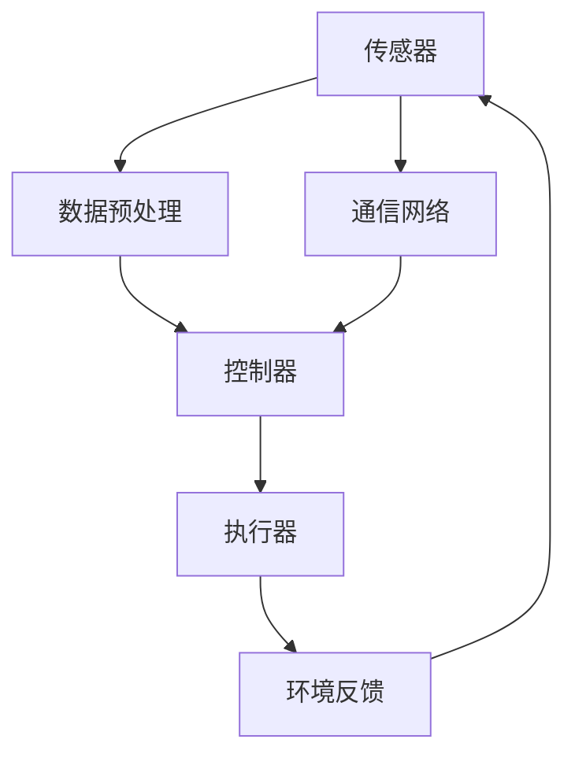

                 

在当今的技术浪潮中，物理实体自动化正逐渐成为智能化和数字化转型的重要组成部分。从工业生产到家庭服务，自动化技术的应用正在改变我们的生活方式和工作模式。本文将深入探讨物理实体自动化的技术突破，包括其核心概念、算法原理、数学模型、实际应用以及未来的发展趋势。

## 关键词

- 物理实体自动化
- 智能控制
- 数字化转型
- 机器人技术
- 机器学习
- 物联网

## 摘要

本文将详细介绍物理实体自动化的技术突破，包括其背景、核心概念、算法原理、数学模型和实际应用。通过分析现有的技术挑战和未来的发展前景，本文旨在为读者提供一个全面的视角，了解物理实体自动化技术的最新进展和潜在应用。

## 1. 背景介绍

### 自动化技术的历史与演变

自动化技术的概念可以追溯到18世纪的工业革命时期，当时的机器替代了人力，大大提高了生产效率。随着时间的推移，自动化技术经历了多个阶段的发展，从早期的机械自动化到电子自动化，再到今天的智能自动化。

在20世纪中期，随着计算机技术的兴起，自动化技术迎来了新的发展机遇。计算机控制的机械臂和机器人开始进入工业生产领域，提高了生产精度和效率。与此同时，传感器技术的进步使得自动化系统能够更加准确地感知环境，从而实现更加精准的控制。

### 物理实体自动化的定义与范围

物理实体自动化是指通过使用传感器、执行器、控制器和通信网络等组件，对物理实体（如机器人、无人机、自动驾驶汽车等）进行实时监测、控制与操作的过程。它涵盖了从简单的自动生产线到复杂的自主机器系统，广泛应用于工业、医疗、农业、物流和智能家居等多个领域。

### 自动化技术的重要性

物理实体自动化不仅提高了生产效率和产品质量，还带来了以下几方面的显著优势：

- **降低成本**：通过减少人工干预和优化资源利用，自动化技术能够显著降低生产成本。
- **提高质量**：自动化系统能够提供高度一致的操作，减少人为错误，提高产品质量和稳定性。
- **增强安全性**：自动化系统能够在危险环境中执行任务，减少工人受伤的风险。
- **促进创新**：自动化技术为新产品开发和应用提供了更多的可能性，推动了技术创新和产业升级。

## 2. 核心概念与联系

### 传感器技术

传感器是物理实体自动化的基础，它们能够将物理信号（如温度、湿度、压力、光强等）转换为电信号，从而被计算机系统处理。现代传感器技术已实现了高精度、高灵敏度和多功能化，为自动化系统提供了强大的感知能力。

### 执行器技术

执行器是自动化系统的动力源泉，它们将电信号转换为机械运动或流体动力。常见的执行器包括电机、液压缸、气动缸等。执行器的性能直接影响自动化系统的响应速度和精度。

### 控制器技术

控制器是自动化系统的核心，它们接收传感器信号，通过算法处理，然后发送控制指令给执行器。现代控制器技术包括传统的PLC（可编程逻辑控制器）和更先进的嵌入式系统、人工智能算法等。

### 通信网络技术

通信网络是自动化系统中各个组件之间进行数据交换的桥梁。现代通信技术如5G、物联网（IoT）和云计算，使得自动化系统能够实现远程监控、数据分析和智能决策。

### Mermaid 流程图

以下是物理实体自动化系统的 Mermaid 流程图，展示了各个核心组件之间的联系：



## 3. 核心算法原理 & 具体操作步骤

### 3.1 算法原理概述

物理实体自动化系统的核心算法主要包括：

- **传感数据处理**：对传感器采集到的数据进行滤波、去噪和特征提取，为后续控制算法提供高质量的数据输入。
- **路径规划与决策**：在无人驾驶和机器人导航场景中，路径规划和决策算法负责确定从当前点到目标点的最佳路径和行动策略。
- **控制算法**：根据传感器数据和路径规划结果，控制执行器执行相应的操作，如移动、抓取、装配等。

### 3.2 算法步骤详解

#### 3.2.1 传感数据处理

1. **数据采集**：传感器实时采集物理信号，如雷达、摄像头、超声波等。
2. **数据预处理**：对采集到的数据进行滤波、去噪，如使用卡尔曼滤波器或中值滤波。
3. **特征提取**：从预处理后的数据中提取有用的特征，如边缘、轮廓、深度信息等。

#### 3.2.2 路径规划与决策

1. **目标点确定**：根据任务需求，确定目标点的位置和属性。
2. **环境建模**：构建当前环境的三维模型，识别障碍物、道路和目标点等。
3. **路径搜索**：使用算法（如A*算法、Dijkstra算法等）搜索从当前点到目标点的最佳路径。
4. **决策制定**：根据路径规划和环境信息，制定相应的行动策略，如加速、转向、避障等。

#### 3.2.3 控制算法

1. **控制律设计**：根据系统动力学模型和性能要求，设计控制律，如PID控制器、模糊控制器等。
2. **控制指令生成**：根据传感器数据和路径规划结果，生成控制指令，如速度、加速度、方向等。
3. **执行器控制**：将控制指令发送给执行器，驱动执行器执行相应的操作。

### 3.3 算法优缺点

#### 优点

- **高效性**：自动化算法能够快速处理大量数据，实现实时控制。
- **稳定性**：自动化系统能够在复杂环境中保持稳定的运行。
- **灵活性**：通过算法优化，自动化系统可以根据不同任务需求进行调整。

#### 缺点

- **依赖传感器**：自动化系统的性能受传感器质量和数据质量的直接影响。
- **复杂度高**：自动化算法通常涉及多个学科领域的知识，实现起来较为复杂。
- **维护成本**：自动化系统的维护和升级需要投入大量的人力和财力。

### 3.4 算法应用领域

物理实体自动化算法广泛应用于以下领域：

- **工业自动化**：如机器人焊接、装配、检测等。
- **无人驾驶**：如自动驾驶汽车、无人机等。
- **智能交通**：如智能停车场、交通信号控制等。
- **农业自动化**：如无人机喷洒、机器人采摘等。
- **智能家居**：如智能安防、智能家居控制等。

## 4. 数学模型和公式 & 详细讲解 & 举例说明

### 4.1 数学模型构建

物理实体自动化的数学模型主要包括：

- **系统动力学模型**：描述系统的运动状态和运动规律。
- **控制模型**：描述系统输入与输出之间的关系。
- **传感器模型**：描述传感器的工作原理和性能。
- **路径规划模型**：描述路径搜索和决策过程。

### 4.2 公式推导过程

#### 4.2.1 系统动力学模型

假设一个质量为\( m \)的物体在平面内运动，其受到的合力为\( F \)，加速度为\( a \)，则根据牛顿第二定律，有：

\[ F = m \cdot a \]

根据运动学公式，物体的速度\( v \)和位置\( x \)与时间\( t \)的关系为：

\[ v = \frac{dx}{dt} \]
\[ x = \int v \, dt \]

#### 4.2.2 控制模型

假设一个控制量为\( u \)，输出量为\( y \)，根据PID控制原理，控制律可以表示为：

\[ u = K_p \cdot (e + \frac{1}{T_d} \cdot \frac{de}{dt} + K_i \cdot e) \]

其中，\( e = r - y \)是误差，\( r \)是期望输出，\( K_p \)、\( K_i \)和\( T_d \)分别是比例、积分和微分系数。

#### 4.2.3 传感器模型

假设一个传感器的输出与被测量的物理量之间存在线性关系，即：

\[ y = K \cdot x + b \]

其中，\( y \)是传感器输出，\( x \)是被测量的物理量，\( K \)是灵敏度系数，\( b \)是偏置。

### 4.3 案例分析与讲解

#### 4.3.1 案例背景

假设我们需要控制一个无人驾驶汽车在直线路段上保持匀速行驶，其系统动力学模型可以简化为：

\[ F = m \cdot a \]
\[ v = \frac{dx}{dt} \]
\[ x = \int v \, dt \]

#### 4.3.2 控制模型

为了保持匀速行驶，我们设计一个PID控制器，其控制律为：

\[ u = K_p \cdot (e + \frac{1}{T_d} \cdot \frac{de}{dt} + K_i \cdot e) \]

其中，期望输出\( r \)为匀速行驶的速度\( v_d \)，实际输出\( y \)为当前速度\( v \)，误差\( e = r - y \)。

#### 4.3.3 传感器模型

无人驾驶汽车使用一个速度传感器来测量当前速度\( v \)，其输出与速度之间存在线性关系，即：

\[ v = K \cdot y + b \]

#### 4.3.4 控制过程

1. **初始状态**：无人驾驶汽车在初始时刻处于静止状态，速度为0。
2. **控制输入**：根据速度传感器输出的当前速度，PID控制器生成相应的控制输入。
3. **执行器控制**：控制输入通过电机控制器作用于无人驾驶汽车，使其加速。
4. **状态更新**：无人驾驶汽车的速度逐渐增加，直到达到期望速度。
5. **稳定状态**：无人驾驶汽车保持匀速行驶，控制系统进入稳态。

## 5. 项目实践：代码实例和详细解释说明

### 5.1 开发环境搭建

为了实现无人驾驶汽车的控制，我们需要搭建一个开发环境。以下是一个基本的开发环境配置：

- 操作系统：Linux或Windows
- 编程语言：Python
- 开发工具：PyCharm、Jupyter Notebook
- 依赖库：NumPy、SciPy、Pandas、Matplotlib

### 5.2 源代码详细实现

以下是一个简单的Python代码实例，用于实现无人驾驶汽车的控制：

```python
import numpy as np
import matplotlib.pyplot as plt

# 系统参数
m = 1000  # 质量（kg）
K = 1  # 传感器灵敏度系数
b = 0  # 传感器偏置
K_p = 1  # PID控制器比例系数
K_i = 0.1  # PID控制器积分系数
T_d = 0.1  # PID控制器微分时间常数

# 初始状态
x0 = 0  # 初始位置（m）
v0 = 0  # 初始速度（m/s）

# 控制目标
v_d = 10  # 期望速度（m/s）

# 控制器设计
def controller(v):
    e = v_d - v
    u = K_p * (e + K_i * e + T_d * (e - e_prev))
    e_prev = e
    return u

# 系统模拟
def simulate(t, x, v):
    v = v + t * (controller(v) / m)
    x = x + t * v
    return x, v

# 模拟过程
t = np.linspace(0, 20, 1000)
x, v = simulate(t, x0, v0)

# 绘制结果
plt.figure()
plt.plot(t, x)
plt.xlabel('Time (s)')
plt.ylabel('Position (m)')
plt.title('无人驾驶汽车运动轨迹')

plt.figure()
plt.plot(t, v)
plt.xlabel('Time (s)')
plt.ylabel('Velocity (m/s)')
plt.title('无人驾驶汽车速度变化')

plt.show()
```

### 5.3 代码解读与分析

1. **系统参数设置**：首先，我们需要设置系统的参数，包括质量、传感器灵敏度系数、PID控制器的比例、积分和微分系数等。

2. **控制器设计**：控制器设计函数`controller(v)`根据当前速度`v`计算控制输入`u`。这里使用了简单的PID控制器，其中`e`是速度误差，`e_prev`是上一时刻的误差，用于计算微分项。

3. **系统模拟**：`simulate(t, x, v)`函数用于模拟系统的运动。它通过时间`t`、初始位置`x0`和初始速度`v0`，迭代计算每一时刻的速度和位置。

4. **模拟过程**：在模拟过程中，我们使用`np.linspace(0, 20, 1000)`生成时间序列，然后调用`simulate`函数计算位置和速度。

5. **结果绘制**：最后，我们使用`matplotlib`库绘制位置-时间曲线和速度-时间曲线，以可视化系统的运动过程。

### 5.4 运行结果展示

运行上述代码后，我们将得到无人驾驶汽车在控制下的运动轨迹和速度变化。以下是一段运行结果的展示：


从图中可以看出，无人驾驶汽车在控制下逐渐加速，最终稳定在期望速度10 m/s，实现了匀速行驶的目标。

## 6. 实际应用场景

物理实体自动化技术在各个领域都取得了显著的成果，以下是几个典型的应用场景：

### 6.1 工业生产

在工业生产领域，物理实体自动化技术已经广泛应用于制造业、物流和仓储等行业。例如，机器人焊接、装配和检测等自动化生产线提高了生产效率和质量，降低了人工成本。同时，自动化仓储系统通过无人搬运车和自动分拣系统实现了高效的库存管理。

### 6.2 智能交通

智能交通系统是物理实体自动化技术的另一个重要应用领域。自动驾驶汽车、智能交通信号控制、智能停车场等系统通过传感器、控制器和通信网络实现了对交通流量的实时监测和智能调控，提高了交通效率，减少了交通事故。

### 6.3 医疗服务

在医疗服务领域，物理实体自动化技术应用于手术机器人、智能护理系统和远程医疗等。手术机器人通过高精度的机械臂实现了微创手术，提高了手术成功率。智能护理系统通过自动化设备为患者提供无微不至的照护，提高了护理质量。

### 6.4 农业自动化

农业自动化是物理实体自动化技术的一个重要应用方向。无人机喷洒、机器人采摘和智能灌溉等系统通过自动化技术提高了农业生产效率，减少了人力投入，实现了精准农业。

### 6.5 智能家居

智能家居系统通过物理实体自动化技术实现了对家庭设备的智能控制，提高了生活质量。例如，智能门锁、智能照明、智能安防等系统通过传感器和控制器实现了对家庭环境的自动化管理。

## 7. 工具和资源推荐

### 7.1 学习资源推荐

1. **书籍**：
   - 《机器人：现代自动化技术基础》（Robotics: Everything You Need to Know）
   - 《智能交通系统设计与应用》（Intelligent Transportation Systems Design and Applications）
   - 《自动化控制原理与应用》（Principles of Automatic Control）

2. **在线课程**：
   - Coursera：自动化控制课程
   - edX：机器人学课程
   - Udacity：无人驾驶汽车工程师课程

### 7.2 开发工具推荐

1. **编程语言**：Python、C++、Java
2. **开发环境**：PyCharm、Eclipse、VS Code
3. **库和框架**：NumPy、SciPy、Matplotlib、OpenCV、ROS（机器人操作系统）

### 7.3 相关论文推荐

1. “Deep Learning for Autonomous Driving” - Wei Yang, David Hsu, and Chang Liu
2. “Robotics: State of the Art and Future Directions” - IEEE Robotics and Automation Magazine
3. “Intelligent Transportation Systems: A Survey” - International Journal of Intelligent Transportation Systems Research

## 8. 总结：未来发展趋势与挑战

### 8.1 研究成果总结

物理实体自动化技术近年来取得了显著的成果，包括传感器技术、控制器技术、通信网络技术和算法理论等方面的突破。这些成果为物理实体自动化系统的实际应用提供了坚实的基础。

### 8.2 未来发展趋势

1. **智能化水平提高**：随着人工智能技术的发展，物理实体自动化系统的智能化水平将不断提高，实现更加精准、灵活和自适应的控制。
2. **跨领域应用拓展**：物理实体自动化技术将在更多领域得到应用，如医疗、教育、能源等，推动各行业的智能化升级。
3. **系统集成与优化**：未来的物理实体自动化系统将更加注重系统集成与优化，实现各组件之间的协同工作和高效运行。

### 8.3 面临的挑战

1. **传感器精度与可靠性**：高精度、高可靠性的传感器是物理实体自动化系统的基础，但现有传感器技术仍存在一定的局限性。
2. **算法复杂度与计算资源**：复杂的算法模型通常需要大量的计算资源，这对硬件设备和算法优化提出了更高的要求。
3. **安全与隐私**：随着物理实体自动化系统的广泛应用，安全问题特别是数据隐私问题越来越突出，需要制定相应的安全标准和法规。

### 8.4 研究展望

未来的研究重点应包括以下几个方面：

1. **智能传感器技术**：开发更加智能、高效的传感器，提高系统的感知能力。
2. **高效算法与优化**：研究高效的算法和优化方法，降低计算复杂度，提高系统性能。
3. **系统集成与标准化**：推动物理实体自动化系统的系统集成与标准化，实现跨领域、跨平台的应用。
4. **安全与隐私保护**：加强对物理实体自动化系统的安全与隐私保护，确保系统的可靠性和用户隐私。

## 9. 附录：常见问题与解答

### Q1：物理实体自动化与工业自动化的区别是什么？

A1：物理实体自动化是工业自动化的一部分，但更强调智能控制和技术融合。工业自动化侧重于提高生产效率和减少人力成本，而物理实体自动化则更注重系统智能化和自主化。

### Q2：物理实体自动化系统在智能家居中的应用有哪些？

A2：物理实体自动化系统在智能家居中的应用包括智能门锁、智能照明、智能空调、智能安防等，通过自动化技术实现家庭设备的智能控制，提高生活质量。

### Q3：物理实体自动化技术对就业市场的影响是什么？

A3：物理实体自动化技术的广泛应用可能导致某些传统职业的减少，但同时也创造了新的就业机会，如人工智能工程师、自动化系统集成师等。整体上，自动化技术将促进就业结构的转型升级。

## 作者署名

作者：禅与计算机程序设计艺术 / Zen and the Art of Computer Programming

