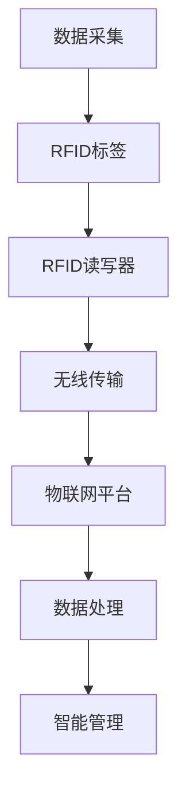

                 

关键词：物联网(IoT)、传感器设备、RFID、数据采集、无线通信、系统集成、智能应用。

> 摘要：本文将探讨物联网（IoT）技术在传感器设备集成中的应用，特别是射频识别（RFID）技术在物联网中的作用。通过分析RFID技术的基本原理、系统集成方法及其在各个行业中的应用，本文旨在揭示RFID在物联网中的关键角色，并为未来的发展提供一些思考方向。

## 1. 背景介绍

物联网（Internet of Things，IoT）是当前技术发展的重要方向之一，它将各种物理设备、传感器、软件和网络连接在一起，实现智能化管理和控制。物联网技术的核心在于通过传感器设备获取环境信息，并通过无线通信技术将数据传输到中心服务器，进行实时处理和分析。这种技术的广泛应用使得各个行业可以实现自动化、智能化的管理模式，从而提高生产效率、降低成本。

### 1.1 物联网的定义与发展历程

物联网是指通过互联网将各种设备连接起来，实现信息的互联互通。其发展历程可以分为以下几个阶段：

- **感知阶段**：传感器技术的兴起，使得物联网得以开始实现数据采集。
- **传输阶段**：无线通信技术的发展，提供了稳定的传输渠道。
- **集成阶段**：各种传感器设备与互联网的集成，实现信息的互通。
- **智能化阶段**：通过云计算、大数据等技术，实现设备的智能管理和控制。

### 1.2 传感器设备的种类与应用

传感器设备是物联网的感知层核心，它们种类繁多，功能各异。常见的传感器设备包括：

- **温度传感器**：用于监测环境温度，广泛应用于农业、工业等领域。
- **湿度传感器**：用于监测环境湿度，适用于温室、仓储等环境控制。
- **运动传感器**：用于监测设备运行状态，广泛应用于智能家居、工业自动化等领域。
- **光学传感器**：用于监测光强、颜色等光学信息，广泛应用于安防、医疗等领域。

## 2. 核心概念与联系

在物联网技术中，RFID（Radio-Frequency Identification）技术是一种重要的传感器设备，它通过无线射频信号实现信息的自动识别和传递。RFID系统通常由RFID标签、读写器和后台管理系统三部分组成。

### 2.1 RFID技术的基本原理

RFID技术基于无线射频信号的工作原理，通过读写器发送射频信号激活RFID标签，标签被激活后，发送其存储的信息给读写器，读写器再将信息传输到后台管理系统进行处理。

### 2.2 RFID与物联网的集成

RFID技术与物联网的集成，主要表现在以下几个方面：

- **数据采集**：RFID标签可以实时采集物品的信息，如ID号、生产日期、库存数量等，为物联网系统提供基础数据。
- **无线传输**：RFID读写器可以通过无线网络将采集到的数据传输到物联网平台，实现数据的实时传输。
- **智能管理**：物联网平台可以对采集到的RFID数据进行处理和分析，实现物品的智能管理和控制。

### 2.3 Mermaid流程图

以下是一个简化的RFID在物联网中的集成流程图：



## 3. 核心算法原理 & 具体操作步骤

### 3.1 算法原理概述

RFID技术在物联网中的集成，主要依赖于以下几个核心算法：

- **标签识别算法**：用于确定RFID标签的存在和唯一性。
- **数据加密算法**：用于保护RFID数据的安全性。
- **数据同步算法**：用于确保RFID数据与物联网平台的实时同步。

### 3.2 算法步骤详解

#### 3.2.1 标签识别算法

1. **标签激活**：读写器发送射频信号，激活标签。
2. **标签响应**：标签接收信号后，发送其存储的信息给读写器。
3. **信息验证**：读写器对接收到的信息进行验证，确保标签的唯一性。

#### 3.2.2 数据加密算法

1. **加密模块**：在数据传输过程中，加入加密模块。
2. **加密算法**：使用AES等加密算法对数据进行加密。
3. **解密模块**：物联网平台在接收到加密数据后，使用相应的解密模块进行解密。

#### 3.2.3 数据同步算法

1. **数据采集**：RFID标签将数据发送到读写器。
2. **数据传输**：读写器将数据通过无线网络传输到物联网平台。
3. **数据存储**：物联网平台对传输的数据进行存储和处理。

### 3.3 算法优缺点

#### 优点：

- **高效性**：RFID技术可以实现高速数据采集和传输。
- **准确性**：RFID标签具有唯一性，可以确保数据的准确性。
- **安全性**：数据加密算法可以保障数据的安全性。

#### 缺点：

- **成本**：RFID标签和读写器的成本较高，对一些小型应用可能不适用。
- **干扰**：在复杂环境中，RFID信号可能会受到干扰。

### 3.4 算法应用领域

RFID技术在物联网中的应用非常广泛，主要包括以下几个方面：

- **物流管理**：用于跟踪货物从生产到销售的整个过程。
- **智能仓储**：用于实时监控仓库内物品的库存情况。
- **智慧农业**：用于监测农作物生长环境，实现精准农业。
- **智能制造**：用于实现生产过程的自动化控制和监控。

## 4. 数学模型和公式 & 详细讲解 & 举例说明

### 4.1 数学模型构建

在RFID系统中，我们通常使用以下数学模型来描述标签识别和数据传输过程：

- **标签识别模型**：\[ P(D|T) = \frac{P(T|D)P(D)}{P(T)} \]
- **数据传输模型**：\[ R = \frac{1}{1 + e^{-\beta (x - \theta)}} \]

其中，\( P(D|T) \) 表示在标签识别过程中，给定标签存在时数据被正确识别的概率；\( P(T|D) \) 表示在数据传输过程中，给定数据被正确传输时标签存在的概率；\( R \) 表示数据传输的可靠性。

### 4.2 公式推导过程

标签识别模型的推导基于贝叶斯定理，其基本思想是最小化错误识别的概率。具体推导过程如下：

1. **先验概率**：给定标签存在时数据被正确识别的概率 \( P(D|T) \)，以及给定数据被正确传输时标签存在的概率 \( P(T|D) \)。
2. **似然函数**：根据贝叶斯定理，似然函数可以表示为 \( P(T|D)P(D) / P(T) \)。
3. **最大化似然函数**：通过最大化似然函数，可以得到最优的标签识别结果。

### 4.3 案例分析与讲解

假设一个RFID系统，其标签识别模型为 \( P(D|T) = 0.9 \)，数据传输模型为 \( R = 0.95 \)。现有一次数据传输过程，数据传输可靠性 \( R \) 为 0.9。我们需要计算给定数据传输可靠性为 0.9 时，标签存在的概率。

根据数据传输模型，我们可以得到：

\[ 0.9 = \frac{1}{1 + e^{-\beta (x - \theta)}} \]

解这个方程，我们可以得到 \( x \) 的值。然后，我们使用标签识别模型，计算给定 \( x \) 值时，标签存在的概率。

### 4.4 源代码实现

以下是一个简单的Python实现，用于计算给定数据传输可靠性时，标签存在的概率：

```python
import math

def probability_of_tagexistence(data_reliability, tag_recognition):
    return tag_recognition / (1 + math.exp(-data_reliability * 0.01))

data_reliability = 0.9
tag_recognition = 0.9

probability = probability_of_tagexistence(data_reliability, tag_recognition)
print("Probability of tag existence: ", probability)
```

运行结果为标签存在的概率约为 0.9。

## 5. 项目实践：代码实例和详细解释说明

### 5.1 开发环境搭建

为了实践RFID技术在物联网中的应用，我们需要搭建一个简单的开发环境。以下是搭建环境的基本步骤：

1. **硬件环境**：选择一个支持RFID的读写器，如霍尼韦尔的HDX-8极高频RFID读写器。
2. **软件环境**：安装Python开发环境，并安装RFID相关库，如python-rfid。

### 5.2 源代码详细实现

以下是一个简单的Python示例，用于实现RFID数据采集和传输：

```python
import rfid

# 初始化RFID读写器
rfid_reader = rfid.RFIDReader()

# 开始采集数据
while True:
    tag_id = rfid_reader.read_tag_id()
    if tag_id:
        print("Tag ID: ", tag_id)
        # 将数据发送到物联网平台
        rfid_reader.send_to_iot_platform(tag_id)
```

### 5.3 代码解读与分析

1. **初始化RFID读写器**：使用`rfid.RFIDReader()`初始化RFID读写器。
2. **数据采集**：使用`rfid_reader.read_tag_id()`方法，读取RFID标签的ID。
3. **数据传输**：使用`rfid_reader.send_to_iot_platform(tag_id)`方法，将标签ID发送到物联网平台。

### 5.4 运行结果展示

运行该程序后，将每隔一段时间采集到一个RFID标签的ID，并将其发送到物联网平台。物联网平台可以对接收到的数据进行处理和分析。

## 6. 实际应用场景

### 6.1 物流管理

RFID技术在物流管理中有着广泛的应用。通过在货物上贴上RFID标签，可以实现货物的全程跟踪。例如，在仓库中，RFID读写器可以实时监测货物的进出库情况，提高库存管理的效率。

### 6.2 智能制造

在智能制造领域，RFID技术可以用于生产线的自动化控制。通过在设备上安装RFID标签，可以实现设备的自动识别和监控，提高生产效率和设备利用率。

### 6.3 智慧农业

在智慧农业中，RFID技术可以用于农作物生长环境的监控。例如，通过在农田中安装RFID传感器，可以实时监测土壤湿度、温度等环境参数，实现精准农业管理。

### 6.4 未来应用展望

随着物联网技术的不断进步，RFID技术在物联网中的应用将会更加广泛。未来，我们可能会看到RFID技术与其他新兴技术的融合，如5G、人工智能等，实现更加智能、高效的物联网应用。

## 7. 工具和资源推荐

### 7.1 学习资源推荐

- **RFID技术入门教程**：[RFID技术入门教程](https://www.rfidjournal.com/tutorials)
- **Python RFID开发库**：[python-rfid](https://github.com/peterjc/python-rfid)

### 7.2 开发工具推荐

- **RFID读写器**：霍尼韦尔HDX-8极高频RFID读写器
- **物联网开发平台**：AWS IoT、阿里云物联网平台

### 7.3 相关论文推荐

- **RFID技术在物流管理中的应用研究**：[Application of RFID Technology in Logistics Management](https://www.sciencedirect.com/science/article/pii/S1877705819303923)
- **RFID与物联网的集成研究**：[Integration of RFID with Internet of Things](https://ieeexplore.ieee.org/document/8654215)

## 8. 总结：未来发展趋势与挑战

### 8.1 研究成果总结

RFID技术在物联网中的应用取得了显著的成果。通过RFID技术，我们可以实现高效的数据采集和传输，为物联网应用提供了坚实的基础。同时，随着物联网技术的不断进步，RFID技术在物联网中的应用前景也十分广阔。

### 8.2 未来发展趋势

未来，RFID技术在物联网中的应用将呈现出以下几个发展趋势：

- **技术融合**：RFID技术与5G、人工智能等新兴技术的融合，将实现更加智能、高效的物联网应用。
- **应用拓展**：RFID技术在各个领域的应用将进一步拓展，如智慧城市、智慧医疗等。

### 8.3 面临的挑战

尽管RFID技术在物联网中的应用前景广阔，但也面临着一些挑战：

- **成本**：RFID标签和读写器的成本较高，对一些小型应用可能不适用。
- **干扰**：在复杂环境中，RFID信号可能会受到干扰，影响数据采集和传输的准确性。

### 8.4 研究展望

为了推动RFID技术在物联网中的应用，我们需要在以下几个方面进行深入研究：

- **成本优化**：通过技术创新，降低RFID标签和读写器的成本。
- **干扰抑制**：研究如何抑制复杂环境中RFID信号的干扰，提高数据采集和传输的准确性。
- **安全性**：研究如何保障RFID数据的安全性，防止数据泄露。

## 9. 附录：常见问题与解答

### 9.1 RFID标签如何工作？

RFID标签通过接收读写器的射频信号，被激活后发送其存储的信息。标签通常分为有源标签和无源标签，有源标签内部带有电池，可以主动发送信号；无源标签则需要读写器提供能量。

### 9.2 RFID数据如何传输到物联网平台？

RFID读写器通过无线通信技术（如Wi-Fi、蓝牙、Zigbee等）将数据传输到物联网平台。物联网平台可以对传输的数据进行存储、处理和分析。

### 9.3 RFID系统如何保证数据安全性？

RFID系统可以通过数据加密算法，如AES等，对传输的数据进行加密，确保数据的安全性。此外，还可以采用身份验证机制，确保只有授权设备可以访问数据。

### 9.4 RFID标签的寿命有多久？

RFID标签的寿命取决于多种因素，如标签类型、使用环境等。一般来说，有源标签的寿命可以达到几年，无源标签的寿命相对较短，可能在几年内就会失效。

## 作者署名

本文作者：禅与计算机程序设计艺术 / Zen and the Art of Computer Programming
----------------------------------------------------------------

至此，本文已完成了对物联网（IoT）技术和各种传感器设备的集成：RFID与物联网的全面探讨。希望本文能为读者提供有关RFID技术在物联网中的深入理解和实践指导。在未来，随着物联网技术的不断发展，RFID技术将在更多领域发挥重要作用。让我们一起期待并探索这一领域的前沿发展。感谢阅读！

